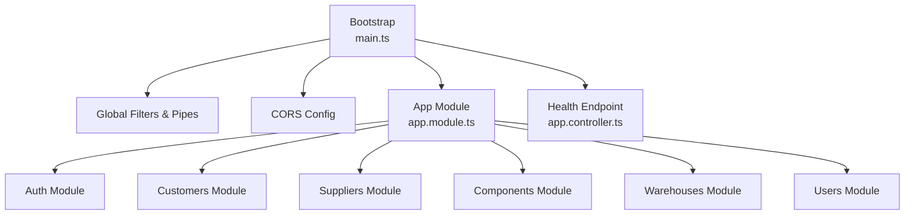
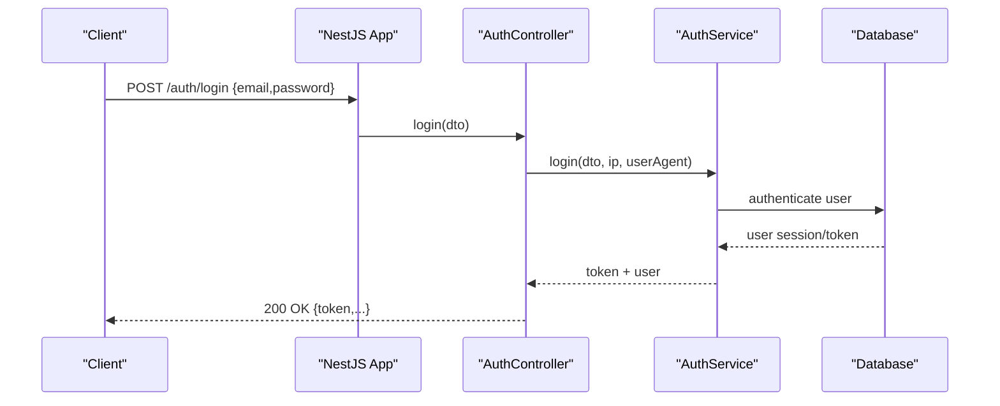
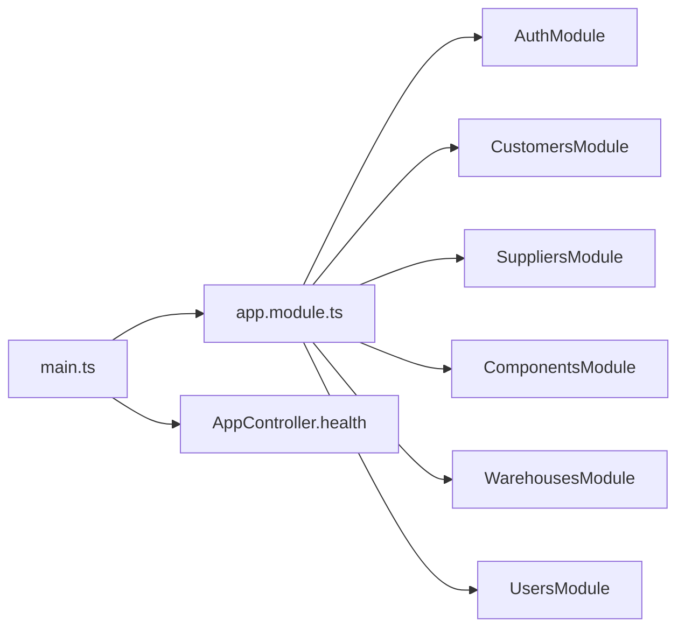
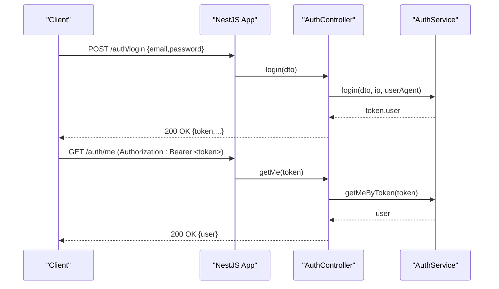

# API Reference

<cite>
**Referenced Files in This Document**
- [main.ts](file://apps/api/src/main.ts)
- [app.module.ts](file://apps/api/src/app.module.ts)
- [app.controller.ts](file://apps/api/src/app.controller.ts)
- [auth.controller.ts](file://apps/api/src/auth/auth.controller.ts)
- [dtos.ts](file://apps/api/src/auth/dtos.ts)
- [customers.controller.ts](file://apps/api/src/customers/customers.controller.ts)
- [suppliers.controller.ts](file://apps/api/src/suppliers/suppliers.controller.ts)
- [components.controller.ts](file://apps/api/src/components/components.controller.ts)
- [warehouses.controller.ts](file://apps/api/src/warehouses/warehouses.controller.ts)
- [users.controller.ts](file://apps/api/src/users/users.controller.ts)
- [package.json](file://apps/api/package.json)
- [api README.md](file://docs/api/README.md)
</cite>

## Table of Contents
1. Introduction
2. Project Structure
3. Core Components
4. Architecture Overview
5. Detailed Component Analysis
6. Dependency Analysis
7. Performance Considerations
8. Troubleshooting Guide
9. Conclusion
10. Appendices

## Introduction
This document provides a comprehensive API reference for Ananya ERP’s REST API, focusing on authentication, business domains, and system administration endpoints. It describes HTTP methods, URL patterns, request/response schemas, authentication requirements, error handling, and practical client usage guidance for TypeScript/JavaScript applications. It also covers testing approaches, debugging techniques, performance tips, and migration considerations for future API versioning.

The API is implemented with NestJS and follows resource-oriented design principles. Controllers are thin, validation occurs at the boundary using class-validator and ValidationPipe, and domain logic resides in services and domain packages.

**Section sources**
- [api README.md:22-33](file://docs/api/README.md#L22-L33)
- [api README.md:39-62](file://docs/api/README.md#L39-L62)
- [api README.md:80-95](file://docs/api/README.md#L80-L95)

## Project Structure
At runtime, the application bootstrap configures CORS, global exception filters, logging interceptors, and validation pipes. The root health endpoint is exposed by the application controller. All feature modules (e.g., customers, suppliers, components, warehouses, users, auth) are imported into the root module.

**Diagram sources**
- [main.ts:11-36](file://apps/api/src/main.ts#L11-L36)
- [app.module.ts:82-162](file://apps/api/src/app.module.ts#L82-L162)
- [app.controller.ts:3-11](file://apps/api/src/app.controller.ts#L3-L11)

**Section sources**
- [main.ts:11-36](file://apps/api/src/main.ts#L11-L36)
- [app.module.ts:82-162](file://apps/api/src/app.module.ts#L82-L162)
- [app.controller.ts:3-11](file://apps/api/src/app.controller.ts#L3-L11)

## Core Components
- Authentication and Onboarding: Login, logout, current user info, password management, invitations, organization setup.
- Customers: Create, list, retrieve, activate/suspend, add contacts and addresses.
- Suppliers: Full CRUD plus contact management and component mapping.
- Components: Catalog operations with read/write/delete guards and ML suggestion feedback.
- Warehouses: Create, list, retrieve, bin management.
- Users: Admin user management including activation, deactivation, and admin password reset.

Authentication is enforced via bearer tokens where applicable; some endpoints are guarded by role-based or resource-specific guards.

**Section sources**
- [auth.controller.ts:24-110](file://apps/api/src/auth/auth.controller.ts#L24-L110)
- [customers.controller.ts:10-50](file://apps/api/src/customers/customers.controller.ts#L10-L50)
- [suppliers.controller.ts:23-80](file://apps/api/src/suppliers/suppliers.controller.ts#L23-L80)
- [components.controller.ts:65-141](file://apps/api/src/components/components.controller.ts#L65-L141)
- [warehouses.controller.ts:5-36](file://apps/api/src/warehouses/warehouses.controller.ts#L5-L36)
- [users.controller.ts:5-49](file://apps/api/src/users/users.controller.ts#L5-L49)

## Architecture Overview
The API exposes resource-oriented endpoints grouped by domain modules. Requests pass through global validation and logging before reaching controllers, which delegate to services. Domain errors are translated into appropriate HTTP responses.

**Diagram sources**
- [auth.controller.ts:32-37](file://apps/api/src/auth/auth.controller.ts#L32-L37)
- [main.ts:11-36](file://apps/api/src/main.ts#L11-L36)

## Detailed Component Analysis

### Authentication and Onboarding
- Base path: /auth
- Endpoints:
  - POST /auth/login
    - Request body: email, password, optional rememberMe
    - Response: token and user context
    - Notes: Captures IP and User-Agent
  - POST /auth/logout
    - Requires Authorization header with Bearer token
    - Response: success confirmation
  - GET /auth/me
    - Requires Authorization header with Bearer token
    - Response: current user profile
  - POST /auth/change-password
    - Requires Authorization header with Bearer token
    - Request body: currentPassword, newPassword
  - POST /auth/reset-password-request
    - Request body: email
  - POST /auth/reset-password
    - Request body: token, newPassword
  - POST /auth/invitations
    - Optional Authorization header; creates invitation with optional roleId and department
  - GET /auth/invitations/verify/:token
    - Verifies invitation token
  - POST /auth/invitations/accept
    - Accepts invitation with token, password, firstName, lastName
  - GET /auth/setup-status
    - Returns onboarding status
  - GET /auth/bootstrap-status
    - Alias for setup status
  - POST /auth/setup-organization
    - Initializes organization with company details and admin credentials

Request schema references:
- LoginDto, ChangePasswordDto, ResetPasswordRequestDto, ResetPasswordDto, CreateInvitationDto, AcceptInvitationDto, SetupOrganizationDto

Security notes:
- Token-based authentication for protected routes
- Invitation flow supports optional authenticated creation

Error handling:
- Validation errors returned by ValidationPipe for invalid DTOs
- Domain errors mapped to HTTP responses by services

Practical examples:
- Login: POST /auth/login with JSON body containing email and password
- Get current user: GET /auth/me with Authorization: Bearer <token>
- Setup organization: POST /auth/setup-organization with organization and admin details

**Section sources**
- [auth.controller.ts:24-110](file://apps/api/src/auth/auth.controller.ts#L24-L110)
- [dtos.ts:3-110](file://apps/api/src/auth/dtos.ts#L3-L110)

### Customers
- Base path: /customers
- Endpoints:
  - POST /customers
    - Creates a customer
  - GET /customers
    - Lists customers with optional query params: status, search
  - GET /customers/:id
    - Retrieves a specific customer
  - POST /customers/:id/activate
    - Activates a customer
  - POST /customers/:id/suspend
    - Suspends a customer
  - POST /customers/:id/contacts
    - Adds a contact to a customer
  - POST /customers/:id/addresses
    - Adds an address to a customer

Request schema references:
- CreateCustomerDto, AddCustomerContactDto, AddCustomerAddressDto

Notes:
- Filtering by status and search supported on list
- Action endpoints for lifecycle management

**Section sources**
- [customers.controller.ts:10-50](file://apps/api/src/customers/customers.controller.ts#L10-L50)

### Suppliers
- Base path: /suppliers
- Endpoints:
  - POST /suppliers
    - Creates a supplier
  - GET /suppliers
    - Lists suppliers with optional search
  - GET /suppliers/:id
    - Retrieves a specific supplier
  - PUT /suppliers/:id
    - Updates a supplier
  - DELETE /suppliers/:id
    - Deletes a supplier (204 No Content)
  - POST /suppliers/:id/contacts
    - Adds a contact
  - DELETE /suppliers/:id/contacts/:contactId
    - Removes a contact (204 No Content)
  - POST /suppliers/:id/components
    - Maps a component to a supplier
  - DELETE /suppliers/:id/components/:mappingId
    - Removes a component mapping (204 No Content)

Request schema references:
- CreateSupplierDto, UpdateSupplierDto, AddContactDto, MapComponentDto

Notes:
- Custom exception filter applied for supplier-related errors
- Bulk actions via dedicated endpoints

**Section sources**
- [suppliers.controller.ts:23-80](file://apps/api/src/suppliers/suppliers.controller.ts#L23-L80)

### Components
- Base path: /components
- Endpoints:
  - POST /components/suggest
    - Requires read guard; returns suggested components from ML service
  - GET /components/sku/preview
    - Requires read guard; returns SKU preview string
  - POST /components/suggest/feedback
    - Requires write guard; records AI suggestion feedback with actor from session
  - POST /components
    - Requires write guard; creates a component
  - GET /components
    - Requires read guard; lists all components
  - GET /components/:id
    - Requires read guard; retrieves a component
  - PUT /components/:id
    - Requires write guard; updates a component
  - DELETE /components/:id
    - Requires delete guard; deletes a component

Request schema references:
- SuggestComponentDto, ComponentSuggestionResponseDto, CreateMlFeedbackDto, CreateComponentDto, UpdateComponentDto

Security notes:
- Resource-specific guards enforce read/write/delete permissions
- Feedback recording uses authenticated actor from request context

Notes:
- Exception filter for component-related errors
- Integration with ML service for suggestions and feedback

**Section sources**
- [components.controller.ts:33-64](file://apps/api/src/components/components.controller.ts#L33-L64)
- [components.controller.ts:65-141](file://apps/api/src/components/components.controller.ts#L65-L141)

### Warehouses
- Base path: /warehouses
- Endpoints:
  - POST /warehouses
    - Creates a warehouse
  - GET /warehouses
    - Lists warehouses
  - GET /warehouses/:id
    - Retrieves a specific warehouse
  - POST /warehouses/:id/bins
    - Adds a bin to a warehouse
  - PATCH /warehouses/:id/bins/:binId
    - Updates a bin

Request schema references:
- CreateWarehouseDto, AddBinDto, UpdateBinDto

Notes:
- Hierarchical resource model with nested bin management

**Section sources**
- [warehouses.controller.ts:5-36](file://apps/api/src/warehouses/warehouses.controller.ts#L5-L36)

### Users (Administration)
- Base path: /users
- Endpoints:
  - GET /users
    - Lists users with optional search, roleId, status
  - GET /users/:id
    - Retrieves a specific user
  - POST /users
    - Creates a user
  - PUT /users/:id
    - Updates a user
  - POST /users/:id/disable
    - Disables a user
  - POST /users/:id/activate
    - Activates a user
  - POST /users/:id/reset-password
    - Admin resets password for a user

Request schema references:
- CreateUserDto, UpdateUserDto, AdminResetPasswordDto

Notes:
- Admin operations for user lifecycle and password management

**Section sources**
- [users.controller.ts:5-49](file://apps/api/src/users/users.controller.ts#L5-L49)

## Dependency Analysis
The application bootstraps with global middleware and pipes, then imports numerous feature modules. Each module encapsulates its own controllers, services, and repositories.

**Diagram sources**
- [main.ts:11-36](file://apps/api/src/main.ts#L11-L36)
- [app.module.ts:82-162](file://apps/api/src/app.module.ts#L82-L162)
- [app.controller.ts:3-11](file://apps/api/src/app.controller.ts#L3-L11)

**Section sources**
- [app.module.ts:82-162](file://apps/api/src/app.module.ts#L82-L162)
- [main.ts:11-36](file://apps/api/src/main.ts#L11-L36)

## Performance Considerations
- Use pagination and filtering on list endpoints where available (e.g., customers search/status).
- Avoid unnecessary reads on compute-heavy endpoints like component suggestions; cache results when appropriate.
- Leverage database indexes for frequently queried fields (e.g., email, status).
- Monitor response times and logs via the global logging interceptor.
- Keep payloads minimal; use selective field retrieval if supported by services.

[No sources needed since this section provides general guidance]

## Troubleshooting Guide
Common issues and diagnostics:
- Validation errors: Returned by ValidationPipe when DTO fields are missing or invalid. Check request bodies against documented schemas.
- Authentication failures: Ensure Authorization header includes a valid Bearer token for protected endpoints.
- CORS errors: Verify CORS_ORIGIN configuration allows your client origin.
- Health check: Use GET /health to verify API availability.

Debugging steps:
- Inspect request/response logs provided by the global interceptor.
- Validate DTOs locally using the same validation rules as the server.
- Test endpoints incrementally starting with unauthenticated endpoints (login, health), then authenticated ones.

**Section sources**
- [main.ts:18-32](file://apps/api/src/main.ts#L18-L32)
- [app.controller.ts:3-11](file://apps/api/src/app.controller.ts#L3-L11)

## Conclusion
Ananya ERP’s API provides a robust, resource-oriented surface for authentication, core business domains, and administration. Controllers are thin and validated at the boundary, while domain logic is encapsulated in services and modules. Security is enforced via guards and token-based authentication. Clients should follow the documented schemas and handle errors gracefully. Future enhancements include explicit API versioning, pagination/filtering standards, and OpenAPI documentation.

[No sources needed since this section summarizes without analyzing specific files]

## Appendices

### Authentication Flow Sequence

**Diagram sources**
- [auth.controller.ts:32-49](file://apps/api/src/auth/auth.controller.ts#L32-L49)

### Client Implementation Guidelines (TypeScript/JavaScript)
- Base URL: Configure based on deployment (default port may be 4000).
- Headers: Include Authorization: Bearer <token> for protected endpoints.
- Content-Type: application/json for JSON payloads.
- Error Handling: Parse non-2xx responses and display user-friendly messages.
- Retry Logic: Implement exponential backoff for transient errors.
- Example flows:
  - Login: POST /auth/login with JSON body, store token.
  - Fetch current user: GET /auth/me with Authorization header.
  - Create customer: POST /customers with CreateCustomerDto.
  - List suppliers: GET /suppliers?search=...
  - Manage warehouse bins: POST /warehouses/:id/bins, PATCH /warehouses/:id/bins/:binId.

[No sources needed since this section provides general guidance]

### Rate Limiting and Versioning
- Rate limiting: Not currently configured in the bootstrap; consider adding middleware for production environments.
- Versioning: Not yet implemented; plan for URL or header-based versioning as the API evolves.

[No sources needed since this section provides general guidance]

### Migration and Backwards Compatibility Notes
- Plan for additive changes first (new fields, new endpoints).
- Deprecate old fields gradually with warnings.
- Introduce versioned routes when breaking changes are necessary.
- Maintain compatibility tests to ensure existing clients remain functional.

[No sources needed since this section provides general guidance]