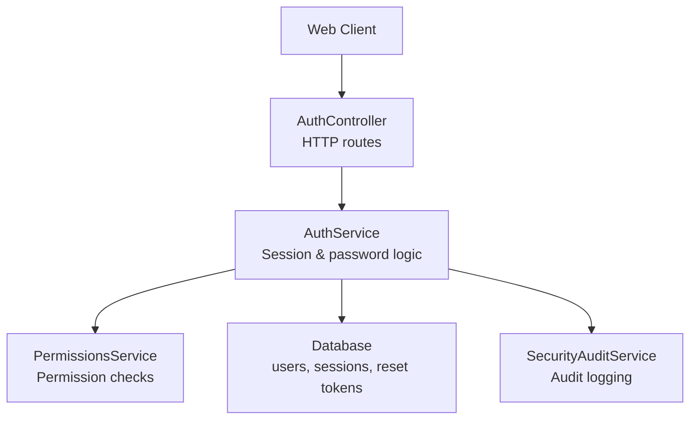
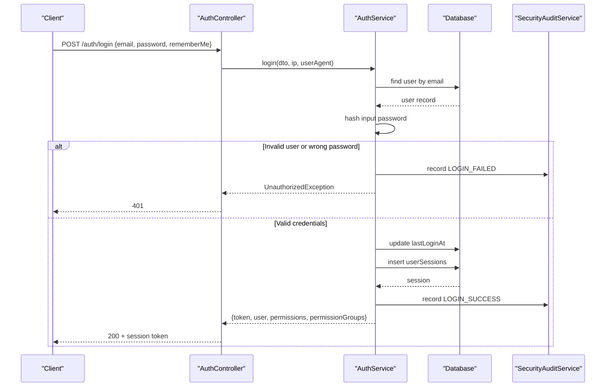
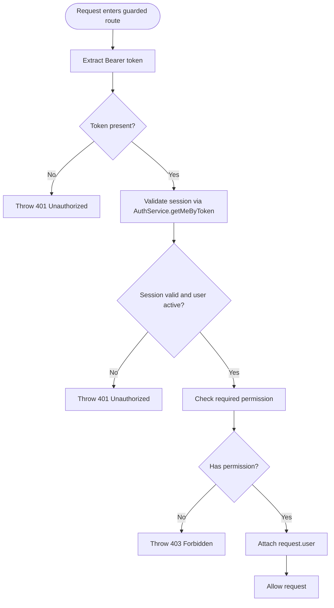
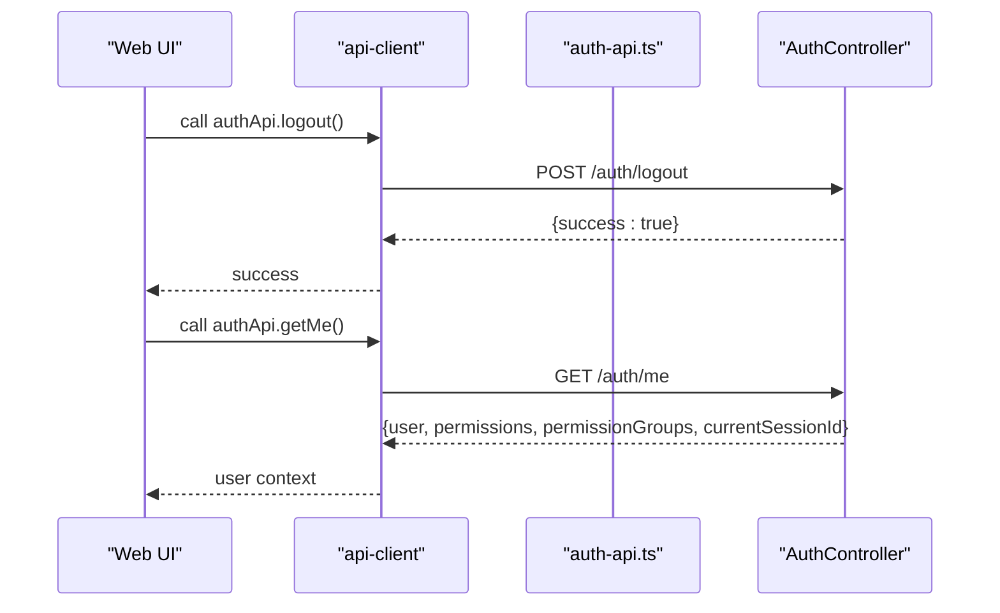
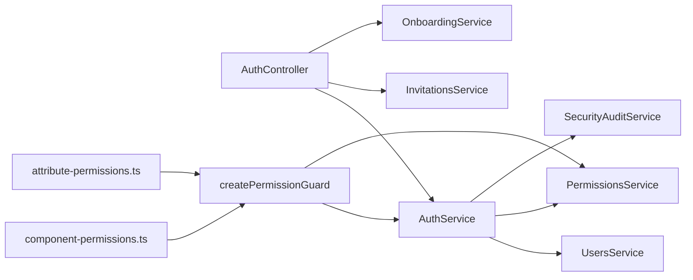

# Authentication & Authorization

<cite>
**Referenced Files in This Document**
- [AUTHENTICATION.md](file://docs/AUTHENTICATION.md)
- [auth.controller.ts](file://apps/api/src/auth/auth.controller.ts)
- [auth.service.ts](file://apps/api/src/auth/auth.service.ts)
- [dtos.ts](file://apps/api/src/auth/dtos.ts)
- [permission.guard.ts](file://apps/api/src/auth/permission.guard.ts)
- [component-permissions.ts](file://apps/api/src/auth/component-permissions.ts)
- [attribute-permissions.ts](file://apps/api/src/auth/attribute-permissions.ts)
- [component-write.guard.ts](file://apps/api/src/auth/component-write.guard.ts)
- [auth-api.ts](file://apps/web/lib/api/auth-api.ts)
</cite>

## Table of Contents
1. [Introduction](#introduction)
2. [Project Structure](#project-structure)
3. [Core Components](#core-components)
4. [Architecture Overview](#architecture-overview)
5. [Detailed Component Analysis](#detailed-component-analysis)
6. [Dependency Analysis](#dependency-analysis)
7. [Performance Considerations](#performance-considerations)
8. [Troubleshooting Guide](#troubleshooting-guide)
9. [Conclusion](#conclusion)
10. [Appendices](#appendices)

## Introduction
This document provides comprehensive API documentation for Ananya ERP’s authentication and authorization system. It covers user login, logout, session validation, password management, invitation-based onboarding, role-based access control (RBAC), permission guards, component-level permissions, attribute-level permissions, and security considerations.

The backend uses a session-token model rather than stateless JWTs: successful authentication creates a server-side session token stored in the database, and clients send that token as a Bearer token in the `Authorization` header. There is no dedicated token-refresh endpoint; instead, sessions are either short-lived or long-lived depending on the login request, and clients should re-authenticate when a session becomes invalid.

## Project Structure
Authentication-related functionality lives primarily under the API application’s `auth` module:

- `AuthController`: HTTP endpoints for login, logout, profile lookup, password changes, reset flows, invitations, and setup status.
- `AuthService`: Session creation, validation, revocation, password hashing, reset tokens, and audit logging.
- DTOs: Request/response shape definitions for login, password operations, invitations, and organization setup.
- Permission infrastructure: A reusable guard factory, plus domain-specific permission bindings for components and attributes.
- Web client integration: The frontend calls `/auth/*` endpoints through a centralized API helper.

**Diagram sources**
- [auth.controller.ts:24-110](file://apps/api/src/auth/auth.controller.ts#L24-L110)
- [auth.service.ts:29-332](file://apps/api/src/auth/auth.service.ts#L29-L332)

**Section sources**
- [AUTHENTICATION.md:1-65](file://docs/AUTHENTICATION.md#L1-L65)
- [auth.controller.ts:24-110](file://apps/api/src/auth/auth.controller.ts#L24-L110)
- [auth.service.ts:29-332](file://apps/api/src/auth/auth.service.ts#L29-L332)

## Core Components
- **Login**: Authenticates email/password, validates account status, updates last-login metadata, creates a session token, and returns the user profile with permissions.
- **Logout**: Revokes an existing session token and records the logout event.
- **Profile Lookup (`GET /auth/me`)**: Validates a Bearer session token and returns the current user, their permissions, permission groups, and current session identifier.
- **Password Management**: Change password, request password reset, and complete password reset using one-time tokens.
- **Invitations & Onboarding**: Create invitations, verify invitation tokens, accept invitations to join an organization, and manage setup/bootstrap status.
- **RBAC Guards**: Reusable permission guards enforce authentication and required permissions before allowing access to protected routes.

**Section sources**
- [auth.controller.ts:32-110](file://apps/api/src/auth/auth.controller.ts#L32-L110)
- [auth.service.ts:37-332](file://apps/api/src/auth/auth.service.ts#L37-L332)
- [dtos.ts:3-110](file://apps/api/src/auth/dtos.ts#L3-L110)

## Architecture Overview
Ananya ERP’s authentication flow is centered around server-managed sessions:

1. The client sends credentials to `POST /auth/login`.
2. The controller extracts IP and user agent, then delegates to `AuthService.login`.
3. `AuthService` validates the user, hashes the provided password, creates a session record, and returns a token along with user data and permissions.
4. For subsequent requests, the client includes `Authorization: Bearer <token>`.
5. Protected routes use `createPermissionGuard` to validate the session and check required permissions.
6. Password and reset flows create or consume one-time tokens stored in the database.

**Diagram sources**
- [auth.controller.ts:32-37](file://apps/api/src/auth/auth.controller.ts#L32-L37)
- [auth.service.ts:37-137](file://apps/api/src/auth/auth.service.ts#L37-L137)

**Section sources**
- [auth.controller.ts:32-37](file://apps/api/src/auth/auth.controller.ts#L32-L37)
- [auth.service.ts:37-137](file://apps/api/src/auth/auth.service.ts#L37-L137)

## Detailed Component Analysis

### Authentication Endpoints

#### Login
- **Method**: `POST`
- **Path**: `/auth/login`
- **Headers**: None required for this endpoint.
- **Request Body**: Defined by `LoginDto`.
- **Response**: Returns a session token, user object, user permissions, and permission groups.
- **Behavior**:
  - Validates email format and presence.
  - Looks up the user by email.
  - Rejects disabled accounts.
  - Compares hashed passwords.
  - Records failed attempts in the security audit log.
  - Creates a session with optional “remember me” duration.

**Request schema**
- `email`: string, required, valid email.
- `password`: string, required.
- `rememberMe`: boolean, optional.

**Response fields**
- `token`: string, server-generated session token.
- `user`: user profile object.
- `permissions`: array of permission strings.
- `permissionGroups`: permission group metadata from `PermissionsService`.

**Error responses**
- `401 Unauthorized`: invalid credentials, disabled account, or user not found.
- `5xx`: unexpected operational failures during user lookup or session creation.

**Section sources**
- [auth.controller.ts:32-37](file://apps/api/src/auth/auth.controller.ts#L32-L37)
- [auth.service.ts:37-137](file://apps/api/src/auth/auth.service.ts#L37-L137)
- [dtos.ts:3-13](file://apps/api/src/auth/dtos.ts#L3-L13)

#### Logout
- **Method**: `POST`
- **Path**: `/auth/logout`
- **Headers**: `Authorization: Bearer <token>`
- **Request Body**: Empty object.
- **Response**: `{ success: boolean }`.
- **Behavior**:
  - Extracts the bearer token from the header.
  - Marks the session as revoked if it exists.
  - Records a logout audit event.

**Section sources**
- [auth.controller.ts:39-43](file://apps/api/src/auth/auth.controller.ts#L39-L43)
- [auth.service.ts:140-162](file://apps/api/src/auth/auth.service.ts#L140-L162)

#### Get Current User
- **Method**: `GET`
- **Path**: `/auth/me`
- **Headers**: `Authorization: Bearer <token>`
- **Response**: Current user profile, permissions, permission groups, and current session ID.
- **Behavior**:
  - Validates the session token.
  - Rejects expired, revoked, or missing sessions.
  - Returns user data and permission metadata.

**Section sources**
- [auth.controller.ts:45-49](file://apps/api/src/auth/auth.controller.ts#L45-L49)
- [auth.service.ts:164-184](file://apps/api/src/auth/auth.service.ts#L164-L184)

#### Change Password
- **Method**: `POST`
- **Path**: `/auth/change-password`
- **Headers**: `Authorization: Bearer <token>`
- **Request Body**: Defined by `ChangePasswordDto`.
- **Response**: `{ success: boolean }`.
- **Behavior**:
  - Resolves the authenticated user from the session.
  - Validates the current password.
  - Updates the password hash.
  - Records a password-change audit event.

**Request schema**
- `currentPassword`: string, required.
- `newPassword`: string, required.

**Error responses**
- `401 Unauthorized`: invalid or expired session.
- `400 Bad Request`: current password does not match.
- `404 Not Found`: user not found.

**Section sources**
- [auth.controller.ts:51-59](file://apps/api/src/auth/auth.controller.ts#L51-L59)
- [auth.service.ts:186-217](file://apps/api/src/auth/auth.service.ts#L186-L217)
- [dtos.ts:15-21](file://apps/api/src/auth/dtos.ts#L15-L21)

#### Request Password Reset
- **Method**: `POST`
- **Path**: `/auth/reset-password-request`
- **Request Body**: Defined by `ResetPasswordRequestDto`.
- **Response**: Generic message indicating whether instructions were generated.
- **Behavior**:
  - Looks up the user by email.
  - If the user exists, generates a one-time reset token with an expiration.
  - Stores the reset token in the database.
  - Records a password-reset request audit event.

**Request schema**
- `email`: string, required, valid email.

**Section sources**
- [auth.controller.ts:61-64](file://apps/api/src/auth/auth.controller.ts#L61-L64)
- [auth.service.ts:219-244](file://apps/api/src/auth/auth.service.ts#L219-L244)
- [dtos.ts:23-26](file://apps/api/src/auth/dtos.ts#L23-L26)

#### Complete Password Reset
- **Method**: `POST`
- **Path**: `/auth/reset-password`
- **Request Body**: Defined by `ResetPasswordDto`.
- **Response**: `{ success: boolean }`.
- **Behavior**:
  - Validates the reset token and its expiration.
  - Updates the user’s password hash.
  - Marks the reset token as used.
  - Records a password-reset completion audit event.

**Request schema**
- `token`: string, required.
- `newPassword`: string, required.

**Error responses**
- `400 Bad Request`: invalid or expired reset token.

**Section sources**
- [auth.controller.ts:66-69](file://apps/api/src/auth/auth.controller.ts#L66-L69)
- [auth.service.ts:246-284](file://apps/api/src/auth/auth.service.ts#L246-L284)
- [dtos.ts:28-34](file://apps/api/src/auth/dtos.ts#L28-L34)

#### Invitation Endpoints
- **Create Invitation**: `POST /auth/invitations`
  - Optional authentication to associate the inviter’s user ID.
  - Accepts email, optional role ID, and optional department.
- **Verify Invitation**: `GET /auth/invitations/verify/:token`
  - Validates invitation token status.
- **Accept Invitation**: `POST /auth/invitations/accept`
  - Completes credential setup and joins an existing organization.

**Section sources**
- [auth.controller.ts:71-95](file://apps/api/src/auth/auth.controller.ts#L71-L95)
- [dtos.ts:36-61](file://apps/api/src/auth/dtos.ts#L36-L61)

#### Setup & Bootstrap Status
- **Setup Status**: `GET /auth/setup-status`
- **Bootstrap Status**: `GET /auth/bootstrap-status`
- **Setup Organization**: `POST /auth/setup-organization`

These endpoints support initial organization creation and bootstrap workflows described in the authentication documentation.

**Section sources**
- [auth.controller.ts:97-110](file://apps/api/src/auth/auth.controller.ts#L97-L110)
- [AUTHENTICATION.md:18-42](file://docs/AUTHENTICATION.md#L18-L42)

### RBAC and Permission Guards

#### Guard Factory
`createPermissionGuard(permission, subject)` builds a NestJS guard that:
- Requires a Bearer token.
- Validates the session using the same logic as `/auth/me`.
- Rejects inactive users.
- Checks the user’s permissions via `PermissionsService.hasPermission`.
- Populates `request.user` with identity and permission metadata.
- Returns `401` for authentication/session failures and `403` for insufficient permissions.

**Diagram sources**
- [permission.guard.ts:31-147](file://apps/api/src/auth/permission.guard.ts#L31-L147)

**Section sources**
- [permission.guard.ts:13-147](file://apps/api/src/auth/permission.guard.ts#L13-L147)

#### Component-Level Permissions
Component catalog permissions reuse the inventory permission vocabulary:
- `Inventory.Read`: view component data, search, detail, SKU preview, and suggestion reads.
- `Inventory.Update`: modify component data.
- `Inventory.Delete`: delete component data.

Guards:
- `ComponentReadGuard`
- `ComponentWriteGuard`
- `ComponentDeleteGuard`

**Section sources**
- [component-permissions.ts:12-78](file://apps/api/src/auth/component-permissions.ts#L12-L78)
- [component-write.guard.ts:8-34](file://apps/api/src/auth/component-write.guard.ts#L8-L34)

#### Attribute-Level Permissions
Attribute intelligence and attribute library permissions also reuse inventory permissions:
- `Inventory.Read`: view attribute intelligence findings.
- `Inventory.Update`: review attribute intelligence findings and edit attribute-library content.
- `Inventory.Delete`: delete an attribute definition, which is a destructive cascading operation.

Guards:
- `AttributeReadGuard`
- `AttributeWriteGuard`
- `AttributeDeleteGuard`

**Section sources**
- [attribute-permissions.ts:4-93](file://apps/api/src/auth/attribute-permissions.ts#L4-L93)

### Token Handling Model

#### Session Tokens vs JWT
Ananya ERP does not implement JWT in the analyzed authentication code. Instead:
- Login creates a random session token stored in the database.
- Clients send the token as `Authorization: Bearer <token>`.
- `/auth/me` validates the token and returns user context.
- Guards reuse the same session validation.

There is no explicit token refresh endpoint. Long-lived sessions are supported via the `rememberMe` flag during login, but there is no separate refresh mechanism in the analyzed files.

**Section sources**
- [auth.service.ts:85-137](file://apps/api/src/auth/auth.service.ts#L85-L137)
- [auth.controller.ts:39-49](file://apps/api/src/auth/auth.controller.ts#L39-L49)
- [permission.guard.ts:77-113](file://apps/api/src/auth/permission.guard.ts#L77-L113)

### Client-Side Authentication Flow
The web client exposes helpers for:
- Logging out.
- Fetching the current user.
- Changing passwords.
- Listing and revoking sessions.
- Checking setup and bootstrap status.

**Diagram sources**
- [auth-api.ts:60-105](file://apps/web/lib/api/auth-api.ts#L60-L105)
- [auth.controller.ts:39-49](file://apps/api/src/auth/auth.controller.ts#L39-L49)

**Section sources**
- [auth-api.ts:60-105](file://apps/web/lib/api/auth-api.ts#L60-L105)

## Dependency Analysis
The authentication subsystem has clear boundaries:

- Controllers depend on services.
- Services depend on repositories, database schemas, and audit/logging services.
- Permission guards depend on both `AuthService` and `PermissionsService`.
- Domain permission modules bind generic guards to specific permission codes.

**Diagram sources**
- [auth.controller.ts:24-30](file://apps/api/src/auth/auth.controller.ts#L24-L30)
- [auth.service.ts:29-35](file://apps/api/src/auth/auth.service.ts#L29-L35)
- [permission.guard.ts:66-147](file://apps/api/src/auth/permission.guard.ts#L66-L147)
- [component-permissions.ts:1-78](file://apps/api/src/auth/component-permissions.ts#L1-L78)
- [attribute-permissions.ts:1-93](file://apps/api/src/auth/attribute-permissions.ts#L1-L93)

**Section sources**
- [auth.controller.ts:24-30](file://apps/api/src/auth/auth.controller.ts#L24-L30)
- [auth.service.ts:29-35](file://apps/api/src/auth/auth.service.ts#L29-L35)
- [permission.guard.ts:66-147](file://apps/api/src/auth/permission.guard.ts#L66-L147)

## Performance Considerations
- **Session Validation Cost**: Every protected request performs a database lookup to validate the session token. This adds latency compared to stateless JWT verification but centralizes session state and revocation.
- **Audit Logging**: Login success/failure, logout, password changes, and reset flows write audit events. Ensure audit storage scales appropriately.
- **Password Hashing**: The analyzed implementation uses a simple SHA-256 hash function. This is lightweight but may be considered weak for production password storage; consider upgrading to a proper password-hashing algorithm if security requirements demand it.
- **Remember-Me Sessions**: Long-lived sessions reduce re-authentication frequency but increase the window of exposure if tokens are compromised.

[No sources needed since this section provides general guidance]

## Troubleshooting Guide

### Common Error Patterns
- **401 Unauthorized**:
  - Missing `Authorization` header.
  - Malformed Bearer token.
  - Expired session.
  - Revoked session.
  - Inactive user.
- **403 Forbidden**:
  - User is authenticated but lacks the required permission.
- **400 Bad Request**:
  - Invalid password reset token.
  - Current password mismatch when changing passwords.
- **404 Not Found**:
  - User not found during password change.
  - Session user no longer exists.

### Debugging Steps
1. Verify the client sends `Authorization: Bearer <token>` on protected requests.
2. Call `GET /auth/me` to confirm the session is valid and returns user context.
3. Check the requested permission code against the user’s returned permissions.
4. Review audit logs for login failures, logout events, password changes, and reset activity.
5. For session issues, list active sessions and revoke suspicious ones.

**Section sources**
- [permission.guard.ts:77-127](file://apps/api/src/auth/permission.guard.ts#L77-L127)
- [auth.service.ts:140-217](file://apps/api/src/auth/auth.service.ts#L140-L217)
- [auth.service.ts:246-284](file://apps/api/src/auth/auth.service.ts#L246-L284)

## Conclusion
Ananya ERP’s authentication system relies on server-managed session tokens validated through `/auth/me` and reused by permission guards. Authorization is implemented through reusable guards bound to permission codes such as `Inventory.Read`, `Inventory.Update`, and `Inventory.Delete`. The system supports login, logout, password management, invitation-based onboarding, and audit logging. While there is no JWT refresh mechanism in the analyzed code, clients can rely on session validation and re-authentication flows. For production hardening, consider strengthening password hashing, adding rate limiting, and documenting token lifecycle policies clearly for client integrations.

[No sources needed since this section summarizes without analyzing specific files]

## Appendices

### API Endpoint Summary

| Endpoint | Method | Headers | Request Body | Response | Notes |
|---|---|---|---|---|---|
| `/auth/login` | `POST` | None | `LoginDto` | `{ token, user, permissions, permissionGroups }` | Creates session; supports `rememberMe`. |
| `/auth/logout` | `POST` | `Authorization: Bearer <token>` | `{}` | `{ success: boolean }` | Revokes session. |
| `/auth/me` | `GET` | `Authorization: Bearer <token>` | None | `{ user, permissions, permissionGroups, currentSessionId }` | Validates session. |
| `/auth/change-password` | `POST` | `Authorization: Bearer <token>` | `ChangePasswordDto` | `{ success: boolean }` | Requires current password. |
| `/auth/reset-password-request` | `POST` | None | `ResetPasswordRequestDto` | Message object | Generates reset token if user exists. |
| `/auth/reset-password` | `POST` | None | `ResetPasswordDto` | `{ success: boolean }` | Consumes one-time reset token. |
| `/auth/invitations` | `POST` | Optional `Authorization` | `CreateInvitationDto` | Invitation result | Optional inviter context. |
| `/auth/invitations/verify/:token` | `GET` | None | None | Verification result | Validates invitation token. |
| `/auth/invitations/accept` | `POST` | None | `AcceptInvitationDto` | Acceptance result | Joins organization. |
| `/auth/setup-status` | `GET` | None | None | Setup status | Onboarding status. |
| `/auth/bootstrap-status` | `GET` | None | None | Bootstrap status | Bootstrap status. |
| `/auth/setup-organization` | `POST` | None | `SetupOrganizationDto` | Setup result | Initializes organization. |

**Section sources**
- [auth.controller.ts:32-110](file://apps/api/src/auth/auth.controller.ts#L32-L110)
- [dtos.ts:3-110](file://apps/api/src/auth/dtos.ts#L3-L110)

### Permission Vocabulary Reference

| Permission Code | Meaning | Typical Use |
|---|---|---|
| `Inventory.Read` | View inventory and related master data | Read-only access to components and attribute intelligence. |
| `Inventory.Update` | Edit inventory and related master data | Write access to components and attribute intelligence. |
| `Inventory.Delete` | Delete inventory-related master data | Destructive operations such as deleting components or attribute definitions. |

**Section sources**
- [component-permissions.ts:52-78](file://apps/api/src/auth/component-permissions.ts#L52-L78)
- [attribute-permissions.ts:23-56](file://apps/api/src/auth/attribute-permissions.ts#L23-L56)
- [component-write.guard.ts:8-34](file://apps/api/src/auth/component-write.guard.ts#L8-L34)