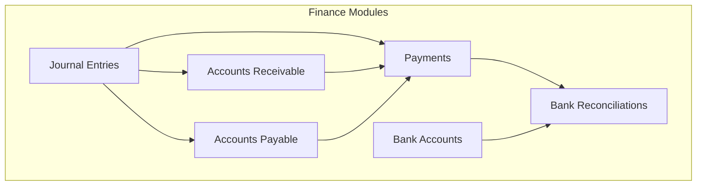
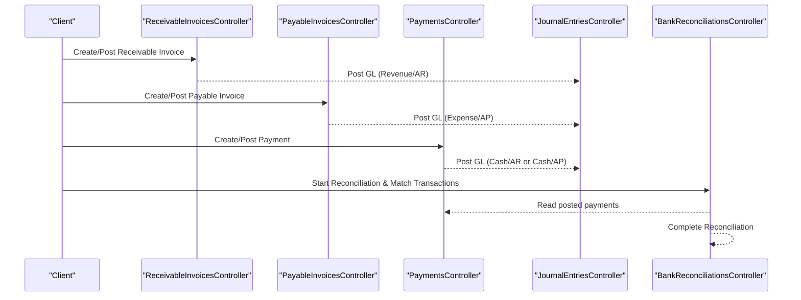
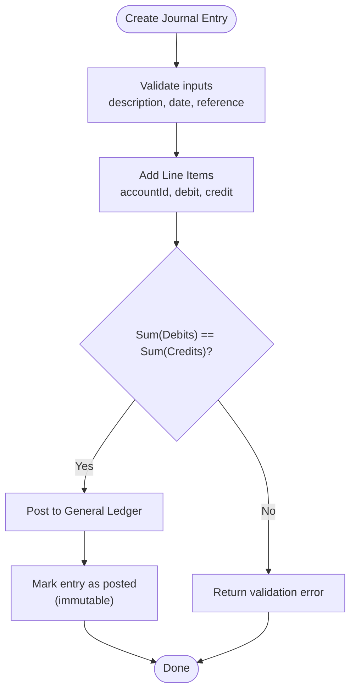
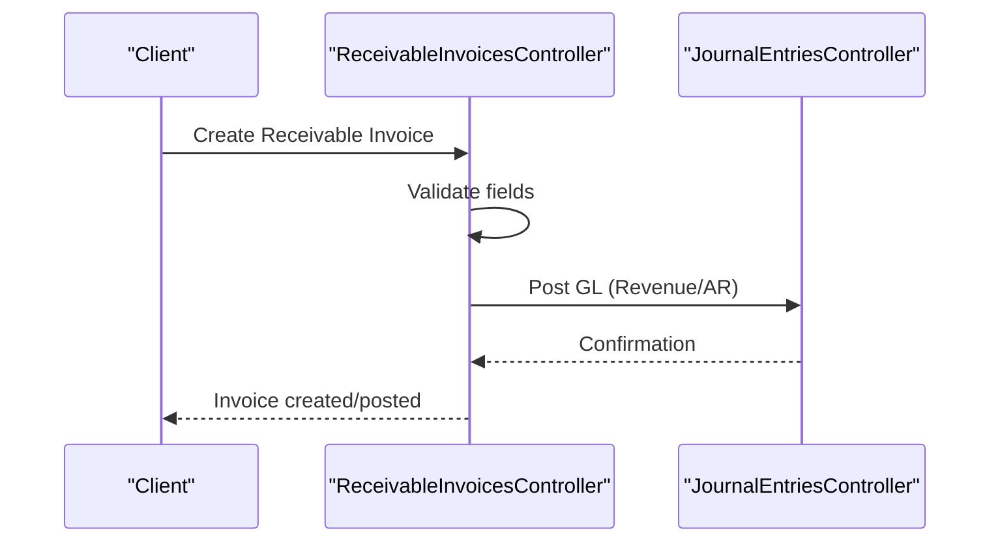
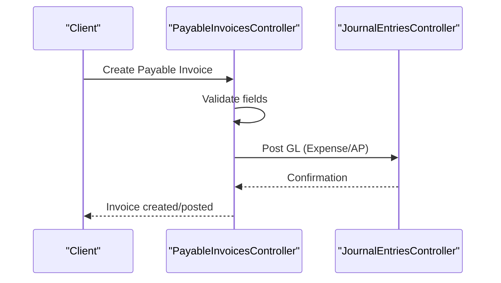
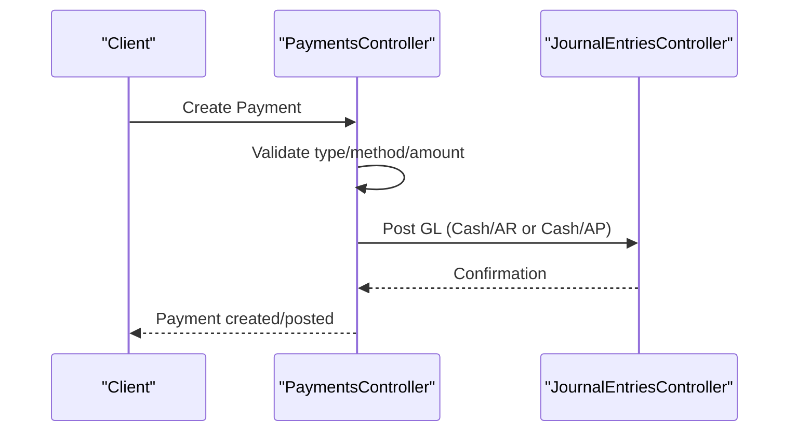
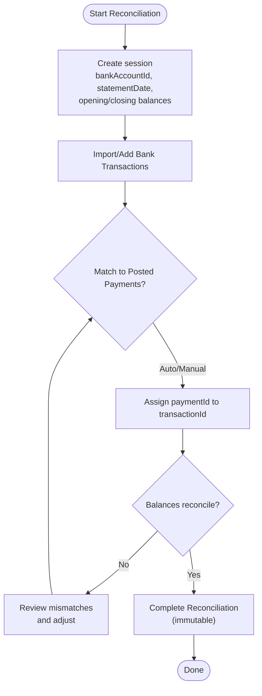
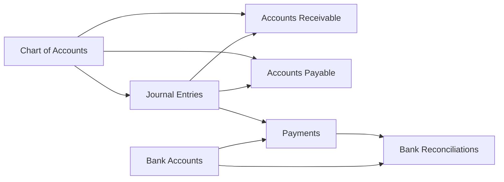

# Finance & Accounting APIs

<cite>
**Referenced Files in This Document**
- [0031-chart-of-accounts.md](file://docs/rfcs/0031-chart-of-accounts.md)
- [0032-general-ledger-and-journal-entries.md](file://docs/rfcs/0032-general-ledger-and-journal-entries.md)
- [0033-accounts-receivable.md](file://docs/rfcs/0033-accounts-receivable.md)
- [0034-accounts-payable.md](file://docs/rfcs/0034-accounts-payable.md)
- [0035-payments-and-bank-reconciliation.md](file://docs/rfcs/0035-payments-and-bank-reconciliation.md)
- [dtos.ts](file://apps/api/src/journal-entries/dtos.ts)
- [journal-entries.controller.ts](file://apps/api/src/journal-entries/journal-entries.controller.ts)
- [journal-entries.service.ts](file://apps/api/src/journal-entries/journal-entries.service.ts)
- [receivable-invoices.controller.ts](file://apps/api/src/receivable-invoices/receivable-invoices.controller.ts)
- [receivable-invoices.service.ts](file://apps/api/src/receivable-invoices/receivable-invoices.service.ts)
- [dtos.ts](file://apps/api/src/receivable-invoices/dtos.ts)
- [payable-invoices.controller.ts](file://apps/api/src/payable-invoices/payable-invoices.controller.ts)
- [payable-invoices.service.ts](file://apps/api/src/payable-invoices/payable-invoices.service.ts)
- [dtos.ts](file://apps/api/src/payable-invoices/dtos.ts)
- [payments.controller.ts](file://apps/api/src/payments/payments.controller.ts)
- [payments.service.ts](file://apps/api/src/payments/payments.service.ts)
- [dtos.ts](file://apps/api/src/payments/dtos.ts)
- [bank-accounts.controller.ts](file://apps/api/src/bank-accounts/bank-accounts.controller.ts)
- [bank-accounts.service.ts](file://apps/api/src/bank-accounts/bank-accounts.service.ts)
- [bank-reconciliations.controller.ts](file://apps/api/src/bank-reconciliations/bank-reconciliations.controller.ts)
- [bank-reconciliations.service.ts](file://apps/api/src/bank-reconciliations/bank-reconciliations.service.ts)
- [dtos.ts](file://apps/api/src/bank-reconciliations/dtos.ts)
</cite>

## Table of Contents
1. Introduction
2. Project Structure
3. Core Components
4. Architecture Overview
5. Detailed Component Analysis
6. Dependency Analysis
7. Performance Considerations
8. Troubleshooting Guide
9. Conclusion
10. Appendices

## Introduction
This document provides comprehensive API documentation for finance and accounting endpoints covering journal entries, accounts receivable, accounts payable, payments, bank accounts, and bank reconciliation. It explains double-entry accounting principles, invoice processing, payment matching, and reconciliation workflows. It also includes schemas for financial transactions, account structures, and reconciliation data, along with examples of complete accounting cycles and financial reporting preparation.

## Project Structure
The finance and accounting features are implemented as NestJS modules under apps/api/src with controllers, services, and DTOs per domain:
- Journal Entries: general ledger postings with balanced debits and credits
- Accounts Receivable: customer invoices and payment application
- Accounts Payable: vendor bills and payment application
- Payments: cash movements and linking to invoices or transfers
- Bank Accounts: master data for cash accounts
- Bank Reconciliations: statement import, transaction matching, and completion

**Diagram sources**
- [journal-entries.controller.ts](file://apps/api/src/journal-entries/journal-entries.controller.ts)
- [receivable-invoices.controller.ts](file://apps/api/src/receivable-invoices/receivable-invoices.controller.ts)
- [payable-invoices.controller.ts](file://apps/api/src/payable-invoices/payable-invoices.controller.ts)
- [payments.controller.ts](file://apps/api/src/payments/payments.controller.ts)
- [bank-accounts.controller.ts](file://apps/api/src/bank-accounts/bank-accounts.controller.ts)
- [bank-reconciliations.controller.ts](file://apps/api/src/bank-reconciliations/bank-reconciliations.controller.ts)

**Section sources**
- [0031-chart-of-accounts.md:1-98](file://docs/rfcs/0031-chart-of-accounts.md#L1-L98)
- [0032-general-ledger-and-journal-entries.md:1-98](file://docs/rfcs/0032-general-ledger-and-journal-entries.md#L1-L98)
- [0033-accounts-receivable.md:1-92](file://docs/rfcs/0033-accounts-receivable.md#L1-L92)
- [0034-accounts-payable.md:1-92](file://docs/rfcs/0034-accounts-payable.md#L1-L92)
- [0035-payments-and-bank-reconciliation.md:1-105](file://docs/rfcs/0035-payments-and-bank-reconciliation.md#L1-L105)

## Core Components
- Chart of Accounts: Hierarchical accounts (Asset, Liability, Equity, Revenue, Expense) with unique account numbers and active/inactive states. Used by all finance modules.
- General Ledger & Journal Entries: Double-entry bookkeeping ensuring Sum(Debits) equals Sum(Credits). Posted entries are immutable; adjustments use reversing entries.
- Accounts Receivable: Customer invoices from Sales Orders; tracks open balances and aging buckets; supports payment application.
- Accounts Payable: Vendor bills from Procurement Purchase Invoices; tracks liabilities and aging; supports supplier payment application.
- Payments: Records cash inflows/outflows/transfers/refunds; updates AR/AP balances and posts GL entries; can be reconciled to bank statements.
- Bank Accounts: Master data for cash accounts used in payments and reconciliation.
- Bank Reconciliation: Matches bank statement transactions to posted payments; supports auto-matching and manual assignment; finalizes reconciliation immutably.

**Section sources**
- [0031-chart-of-accounts.md:17-76](file://docs/rfcs/0031-chart-of-accounts.md#L17-L76)
- [0032-general-ledger-and-journal-entries.md:17-76](file://docs/rfcs/0032-general-ledger-and-journal-entries.md#L17-L76)
- [0033-accounts-receivable.md:16-72](file://docs/rfcs/0033-accounts-receivable.md#L16-L72)
- [0034-accounts-payable.md:16-72](file://docs/rfcs/0034-accounts-payable.md#L16-L72)
- [0035-payments-and-bank-reconciliation.md:17-83](file://docs/rfcs/0035-payments-and-bank-reconciliation.md#L17-L83)

## Architecture Overview
High-level flow across finance modules:
- Journal Entries post balanced debits/credits to the General Ledger.
- Receivable and Payable Invoices originate from Sales/Procurement and post revenue/liability entries.
- Payments apply against invoices and update cash accounts and AR/AP balances.
- Bank Reconciliation matches bank statement lines to posted payments and finalizes the period.

**Diagram sources**
- [receivable-invoices.controller.ts](file://apps/api/src/receivable-invoices/receivable-invoices.controller.ts)
- [payable-invoices.controller.ts](file://apps/api/src/payable-invoices/payable-invoices.controller.ts)
- [payments.controller.ts](file://apps/api/src/payments/payments.controller.ts)
- [journal-entries.controller.ts](file://apps/api/src/journal-entries/journal-entries.controller.ts)
- [bank-reconciliations.controller.ts](file://apps/api/src/bank-reconciliations/bank-reconciliations.controller.ts)

## Detailed Component Analysis

### Journal Entries (General Ledger)
- Purpose: Record balanced double-entry transactions and maintain an immutable ledger.
- Key operations:
  - Create a journal entry with description, optional date/reference
  - Add line items specifying account, debit, credit, and optional description
  - Post to General Ledger (enforces balance invariant)
  - Reverse or void if needed
- Validation: Debits and credits must be non-negative; total debits equal total credits before posting.

API endpoints (per RFC):
- POST /journal-entries
- GET /journal-entries
- GET /journal-entries/:id
- POST /journal-entries/:id/lines
- POST /journal-entries/:id/post
- POST /journal-entries/:id/reverse

Request schema (DTOs):
- CreateJournalEntryDto: description (string, required), date (optional string), reference (optional string)
- AddJournalLineDto: accountId (string, required), debit (number >= 0), credit (number >= 0), description (optional string)

Processing logic:
- Validate input fields and amounts
- Enforce Sum(Debits) == Sum(Credits)
- Persist journal entry and lines
- On post, create corresponding GL postings and lock the entry

**Diagram sources**
- [dtos.ts:10-40](file://apps/api/src/journal-entries/dtos.ts#L10-L40)
- [journal-entries.controller.ts](file://apps/api/src/journal-entries/journal-entries.controller.ts)
- [journal-entries.service.ts](file://apps/api/src/journal-entries/journal-entries.service.ts)

**Section sources**
- [0032-general-ledger-and-journal-entries.md:17-94](file://docs/rfcs/0032-general-ledger-and-journal-entries.md#L17-L94)
- [dtos.ts:10-40](file://apps/api/src/journal-entries/dtos.ts#L10-L40)

### Accounts Receivable
- Purpose: Manage customer invoices originating from Sales Orders, track outstanding balances, and apply payments.
- Key operations:
  - Create invoice with customerId, salesOrderId, dueDate, amount
  - Post invoice to GL (revenue and AR)
  - Apply customer payments to reduce open balance
- Validation: Positive amount; references required; payments cannot exceed invoice balance.

API endpoints (per RFC):
- POST /receivable-invoices
- GET /receivable-invoices
- GET /receivable-invoices/:id
- POST /receivable-invoices/:id/post

Request schema (DTOs):
- CreateReceivableInvoiceDto: customerId (string, required), salesOrderId (string, required), dueDate (string, required), amount (number >= 0.01)

**Diagram sources**
- [receivable-invoices.controller.ts](file://apps/api/src/receivable-invoices/receivable-invoices.controller.ts)
- [dtos.ts:9-25](file://apps/api/src/receivable-invoices/dtos.ts#L9-L25)

**Section sources**
- [0033-accounts-receivable.md:16-88](file://docs/rfcs/0033-accounts-receivable.md#L16-L88)
- [dtos.ts:9-25](file://apps/api/src/receivable-invoices/dtos.ts#L9-L25)

### Accounts Payable
- Purpose: Manage vendor bills from Procurement Purchase Invoices, track liabilities, and apply supplier payments.
- Key operations:
  - Create payable invoice with supplierId, purchaseInvoiceId, dueDate, amount
  - Post to GL (expense and AP)
  - Apply supplier payments to reduce liability
- Validation: Positive amount; references required; payments cannot exceed payable balance.

API endpoints (per RFC):
- POST /payable-invoices
- GET /payable-invoices
- GET /payable-invoices/:id
- POST /payable-invoices/:id/post

Request schema (DTOs):
- CreatePayableInvoiceDto: supplierId (string, required), purchaseInvoiceId (string, required), dueDate (string, required), amount (number >= 0.01)

**Diagram sources**
- [payable-invoices.controller.ts](file://apps/api/src/payable-invoices/payable-invoices.controller.ts)
- [dtos.ts:9-25](file://apps/api/src/payable-invoices/dtos.ts#L9-L25)

**Section sources**
- [0034-accounts-payable.md:16-88](file://docs/rfcs/0034-accounts-payable.md#L16-L88)
- [dtos.ts:9-25](file://apps/api/src/payable-invoices/dtos.ts#L9-L25)

### Payments
- Purpose: Record cash movements (customer payment, supplier payment, internal transfer, refund), update AR/AP balances, and post GL entries.
- Key operations:
  - Create payment with type, method, amount, optional reference, bank account, target invoice
  - Post payment to GL (cash and AR/AP or inter-account transfer)
  - Mark as reconciled when matched to bank statements
- Validation: Positive amount; valid payment type/method; bank account must be active.

API endpoints (per RFC):
- POST /payments
- GET /payments
- GET /payments/:id/post

Request schema (DTOs):
- CreatePaymentDto: paymentType (enum), paymentMethod (enum), amount (number >= 0.01), reference (optional), bankAccountId (optional), targetInvoiceId (optional)

**Diagram sources**
- [payments.controller.ts](file://apps/api/src/payments/payments.controller.ts)
- [dtos.ts:10-34](file://apps/api/src/payments/dtos.ts#L10-L34)

**Section sources**
- [0035-payments-and-bank-reconciliation.md:17-99](file://docs/rfcs/0035-payments-and-bank-reconciliation.md#L17-L99)
- [dtos.ts:10-34](file://apps/api/src/payments/dtos.ts#L10-L34)

### Bank Accounts
- Purpose: Maintain master data for cash accounts used in payments and reconciliation.
- Operations:
  - CRUD for bank accounts
  - Ensure accounts are active before use in payments/reconciliation

API endpoints (per RFC):
- POST /bank-accounts
- GET /bank-accounts
- GET /bank-accounts/:id
- PUT /bank-accounts/:id
- DELETE /bank-accounts/:id

**Section sources**
- [0035-payments-and-bank-reconciliation.md:80-100](file://docs/rfcs/0035-payments-and-bank-reconciliation.md#L80-L100)
- [bank-accounts.controller.ts](file://apps/api/src/bank-accounts/bank-accounts.controller.ts)
- [bank-accounts.service.ts](file://apps/api/src/bank-accounts/bank-accounts.service.ts)

### Bank Reconciliations
- Purpose: Match bank statement transactions to posted payments and finalize reconciliation immutably.
- Key operations:
  - Start reconciliation with bankAccountId, statementDate, openingBalance, closingBalance
  - Import/add bank transactions (date, description, amount)
  - Match transactions to payments (transactionId, paymentId)
  - Complete reconciliation (locks session)
- Validation: Positive amounts; dates valid; completed sessions cannot be modified.

API endpoints (per RFC):
- POST /bank-reconciliations
- GET /bank-reconciliations
- GET /bank-reconciliations/:id
- POST /bank-reconciliations/:id/match
- POST /bank-reconciliations/:id/complete

Request schema (DTOs):
- CreateBankReconciliationDto: bankAccountId (string, required), statementDate (string, required), openingBalance (number), closingBalance (number)
- AddBankTransactionDto: transactionDate (string, required), description (string, required), amount (number)
- MatchTransactionDto: transactionId (string, required), paymentId (string, required)

**Diagram sources**
- [bank-reconciliations.controller.ts](file://apps/api/src/bank-reconciliations/bank-reconciliations.controller.ts)
- [dtos.ts:3-40](file://apps/api/src/bank-reconciliations/dtos.ts#L3-L40)

**Section sources**
- [0035-payments-and-bank-reconciliation.md:17-100](file://docs/rfcs/0035-payments-and-bank-reconciliation.md#L17-L100)
- [dtos.ts:3-40](file://apps/api/src/bank-reconciliations/dtos.ts#L3-L40)

## Dependency Analysis
- Chart of Accounts is foundational; all finance modules depend on it for valid account references.
- Journal Entries are central; AR/AP and Payments post GL entries through this module.
- Payments depend on Bank Accounts and may target AR/AP invoices via targetInvoiceId.
- Bank Reconciliations depend on Payments and Bank Accounts to match and finalize.

**Diagram sources**
- [0031-chart-of-accounts.md:69-76](file://docs/rfcs/0031-chart-of-accounts.md#L69-L76)
- [0032-general-ledger-and-journal-entries.md:69-76](file://docs/rfcs/0032-general-ledger-and-journal-entries.md#L69-L76)
- [0033-accounts-receivable.md:65-72](file://docs/rfcs/0033-accounts-receivable.md#L65-L72)
- [0034-accounts-payable.md:65-72](file://docs/rfcs/0034-accounts-payable.md#L65-L72)
- [0035-payments-and-bank-reconciliation.md:76-83](file://docs/rfcs/0035-payments-and-bank-reconciliation.md#L76-L83)

**Section sources**
- [0031-chart-of-accounts.md:69-76](file://docs/rfcs/0031-chart-of-accounts.md#L69-L76)
- [0032-general-ledger-and-journal-entries.md:69-76](file://docs/rfcs/0032-general-ledger-and-journal-entries.md#L69-L76)
- [0033-accounts-receivable.md:65-72](file://docs/rfcs/0033-accounts-receivable.md#L65-L72)
- [0034-accounts-payable.md:65-72](file://docs/rfcs/0034-accounts-payable.md#L65-L72)
- [0035-payments-and-bank-reconciliation.md:76-83](file://docs/rfcs/0035-payments-and-bank-reconciliation.md#L76-L83)

## Performance Considerations
- Batch operations: When creating multiple journal lines or importing many bank transactions, batch requests to reduce round-trips.
- Indexing: Ensure indexes on foreign keys (e.g., bankAccountId, paymentId, accountId) for fast lookups during matching and reporting.
- Idempotency: Use idempotent keys for payment creation to prevent duplicates during retries.
- Caching: Cache chart of accounts hierarchy for read-heavy reporting scenarios.
- Concurrency: Use optimistic locking on posted entries and reconciliation sessions to avoid conflicts.

[No sources needed since this section provides general guidance]

## Troubleshooting Guide
Common issues and resolutions:
- Journal entry not posting: Verify Sum(Debits) equals Sum(Credits); ensure all referenced accounts are active.
- Payment cannot be applied: Confirm target invoice exists and is open; ensure payment amount does not exceed remaining balance.
- Bank reconciliation mismatch: Check that opening/closing balances align with prior period; verify all transactions are imported and matched.
- Duplicate payments: Implement idempotency keys and deduplication checks at the controller/service layer.

**Section sources**
- [0032-general-ledger-and-journal-entries.md:55-94](file://docs/rfcs/0032-general-ledger-and-journal-entries.md#L55-L94)
- [0035-payments-and-bank-reconciliation.md:61-100](file://docs/rfcs/0035-payments-and-bank-reconciliation.md#L61-L100)

## Conclusion
The finance and accounting APIs provide a robust foundation for double-entry bookkeeping, invoice processing, payment management, and bank reconciliation. By adhering to the defined schemas, validation rules, and state machines, integrators can implement reliable accounting cycles and generate accurate financial reports.

[No sources needed since this section summarizes without analyzing specific files]

## Appendices

### A. Complete Accounting Cycle Example
- Step 1: Create and post a Receivable Invoice (Sales Order)
  - Endpoint: POST /receivable-invoices
  - Schema: CreateReceivableInvoiceDto
- Step 2: Receive Payment from Customer
  - Endpoint: POST /payments
  - Schema: CreatePaymentDto (paymentType = CUSTOMER_PAYMENT, targetInvoiceId set)
- Step 3: Reconcile Payment to Bank Statement
  - Start: POST /bank-reconciliations (CreateBankReconciliationDto)
  - Import: POST /bank-reconciliations/:id/transactions (AddBankTransactionDto)
  - Match: POST /bank-reconciliations/:id/match (MatchTransactionDto)
  - Complete: POST /bank-reconciliations/:id/complete

**Section sources**
- [0033-accounts-receivable.md:73-88](file://docs/rfcs/0033-accounts-receivable.md#L73-L88)
- [0035-payments-and-bank-reconciliation.md:84-100](file://docs/rfcs/0035-payments-and-bank-reconciliation.md#L84-L100)
- [dtos.ts:9-25](file://apps/api/src/receivable-invoices/dtos.ts#L9-L25)
- [dtos.ts:10-34](file://apps/api/src/payments/dtos.ts#L10-L34)
- [dtos.ts:3-40](file://apps/api/src/bank-reconciliations/dtos.ts#L3-L40)

### B. Financial Reporting Preparation
- Generate Trial Balance from General Ledger using posted journal entries
- Produce Accounts Receivable Aging Report from receivable invoices and applied payments
- Produce Accounts Payable Aging Report from payable invoices and applied payments
- Prepare Bank Reconciliation Report from completed reconciliation sessions

**Section sources**
- [0032-general-ledger-and-journal-entries.md:37-42](file://docs/rfcs/0032-general-ledger-and-journal-entries.md#L37-L42)
- [0033-accounts-receivable.md:34-39](file://docs/rfcs/0033-accounts-receivable.md#L34-L39)
- [0034-accounts-payable.md:34-39](file://docs/rfcs/0034-accounts-payable.md#L34-L39)
- [0035-payments-and-bank-reconciliation.md:41-46](file://docs/rfcs/0035-payments-and-bank-reconciliation.md#L41-L46)