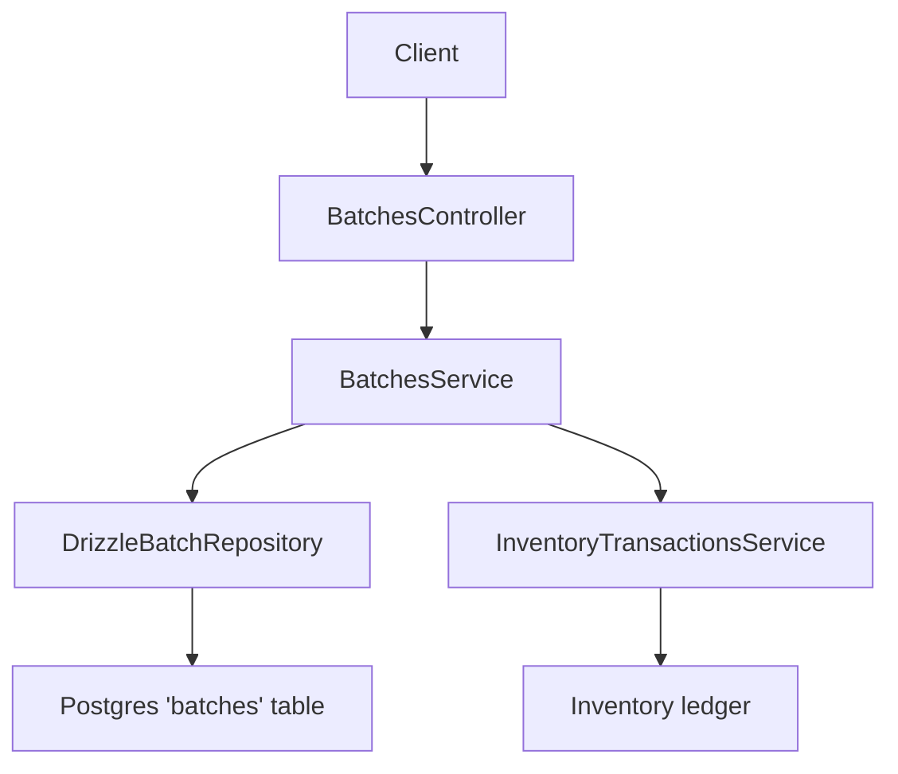
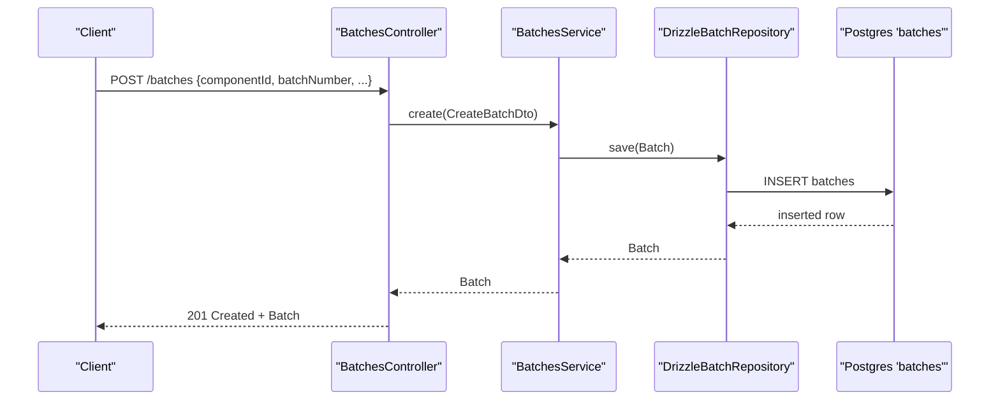
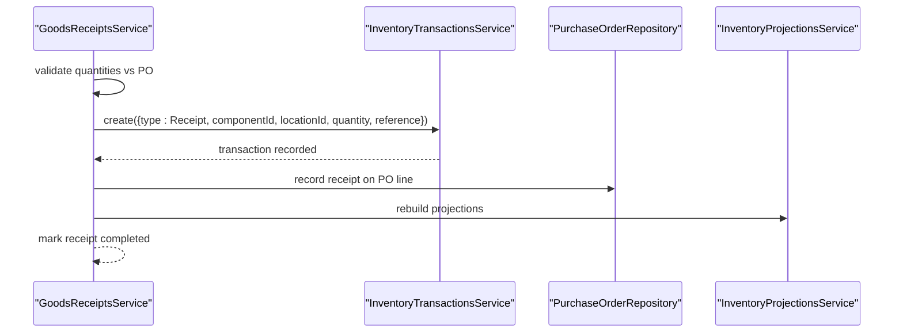
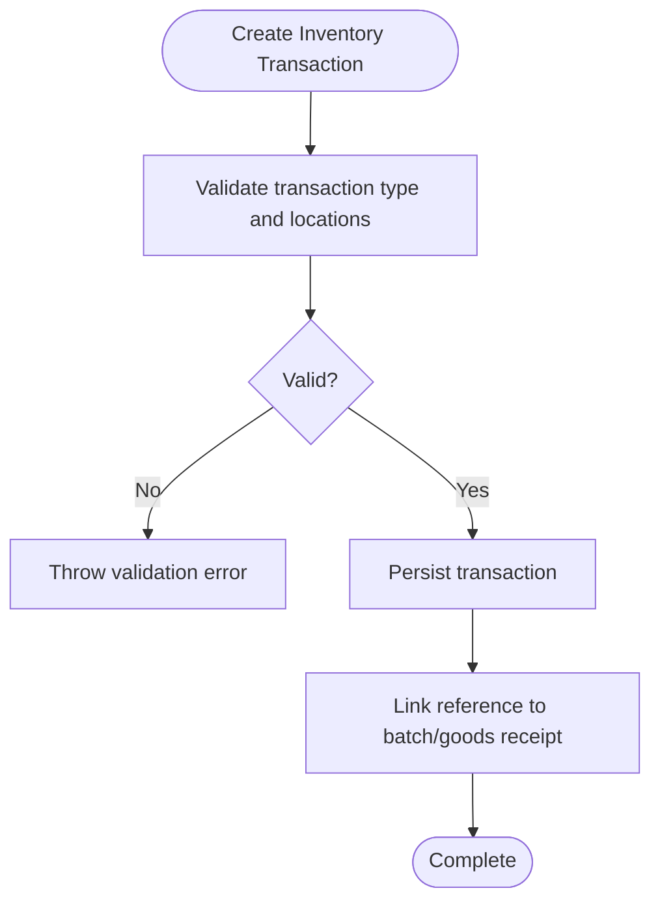
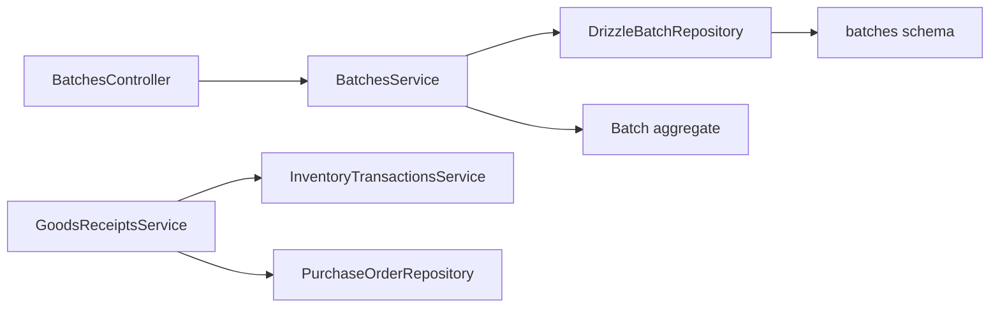

# Batches API

<cite>
**Referenced Files in This Document**
- [batches.controller.ts](file://apps/api/src/batches/batches.controller.ts)
- [batches.service.ts](file://apps/api/src/batches/batches.service.ts)
- [create-batch.dto.ts](file://apps/api/src/batches/create-batch.dto.ts)
- [batch.tokens.ts](file://apps/api/src/batches/batch.tokens.ts)
- [batch.ts](file://packages/inventory/src/batches/batch.ts)
- [batch.repository.ts](file://packages/inventory/src/batches/batch.repository.ts)
- [drizzle-batch.repository.ts](file://apps/api/src/infrastructure/repositories/drizzle-batch.repository.ts)
- [batches schema](file://packages/database/src/schema/batches.ts)
- [goods-receipts.service.ts](file://apps/api/src/goods-receipts/goods-receipts.service.ts)
- [inventory-transaction.ts](file://packages/inventory/src/ledger/inventory-transaction.ts)
</cite>

## Table of Contents
1. Introduction
2. Project Structure
3. Core Components
4. Architecture Overview
5. Detailed Component Analysis
6. Dependency Analysis
7. Performance Considerations
8. Troubleshooting Guide
9. Conclusion

## Introduction
This document provides detailed API documentation for batch tracking endpoints and the underlying batch data model. It covers CRUD operations for batches, validation rules, expiration handling, integration with goods receipts and production orders, status management, and audit requirements. The goal is to help developers create, update, retrieve, and trace batches across inventory transactions while ensuring data integrity and compliance.

## Project Structure
The batch feature spans multiple layers:
- API layer exposes REST endpoints for batch operations.
- Service layer orchestrates business logic and repository calls.
- Domain model defines the Batch aggregate and creation/validation rules.
- Repository layer implements persistence using Drizzle ORM against a Postgres schema.
- Integration points connect batches to goods receipts and inventory transactions.

**Diagram sources**
- [batches.controller.ts:12-44](file://apps/api/src/batches/batches.controller.ts#L12-L44)
- [batches.service.ts:19-48](file://apps/api/src/batches/batches.service.ts#L19-L48)
- [drizzle-batch.repository.ts:30-95](file://apps/api/src/infrastructure/repositories/drizzle-batch.repository.ts#L30-L95)
- [batches schema:11-47](file://packages/database/src/schema/batches.ts#L11-L47)
- [goods-receipts.service.ts:86-116](file://apps/api/src/goods-receipts/goods-receipts.service.ts#L86-L116)

**Section sources**
- [batches.controller.ts:12-44](file://apps/api/src/batches/batches.controller.ts#L12-L44)
- [batches.service.ts:19-48](file://apps/api/src/batches/batches.service.ts#L19-L48)
- [drizzle-batch.repository.ts:30-95](file://apps/api/src/infrastructure/repositories/drizzle-batch.repository.ts#L30-L95)
- [batches schema:11-47](file://packages/database/src/schema/batches.ts#L11-L47)

## Core Components
- BatchesController: Exposes GET and POST endpoints for listing, retrieving, and creating batches; includes component-scoped retrieval.
- BatchesService: Implements domain-level operations (create, list by component, get by id) and composes repository calls.
- Batch aggregate: Defines immutable properties, factory method for creation with validation, reassignment capability, and rehydration.
- BatchRepository interface: Declares find/save/update operations used by services.
- DrizzleBatchRepository: Persists batches to Postgres via Drizzle ORM, mapping between domain and row types.
- Batches schema: Defines table structure, constraints, and indexes.

Key responsibilities:
- Validation at DTO and domain levels ensures required fields and consistent formatting.
- Uniqueness constraint on (componentId, batchNumber) prevents duplicate batches per component.
- Optional manufacturing and expiry dates support traceability and expiration handling.
- Supplier batch number enables external traceability linkage.

**Section sources**
- [batches.controller.ts:12-44](file://apps/api/src/batches/batches.controller.ts#L12-L44)
- [batches.service.ts:19-48](file://apps/api/src/batches/batches.service.ts#L19-L48)
- [create-batch.dto.ts:3-21](file://apps/api/src/batches/create-batch.dto.ts#L3-L21)
- [batch.ts:21-93](file://packages/inventory/src/batches/batch.ts#L21-L93)
- [batch.repository.ts:3-17](file://packages/inventory/src/batches/batch.repository.ts#L3-L17)
- [drizzle-batch.repository.ts:30-95](file://apps/api/src/infrastructure/repositories/drizzle-batch.repository.ts#L30-L95)
- [batches schema:11-47](file://packages/database/src/schema/batches.ts#L11-L47)

## Architecture Overview
The batch API follows a layered architecture:
- Controllers handle HTTP requests and map DTOs to service inputs.
- Services enforce business rules and delegate to repositories.
- Repositories implement persistence and domain mapping.
- Domain aggregates encapsulate validation and behavior.

**Diagram sources**
- [batches.controller.ts:21-30](file://apps/api/src/batches/batches.controller.ts#L21-L30)
- [batches.service.ts:19-22](file://apps/api/src/batches/batches.service.ts#L19-L22)
- [drizzle-batch.repository.ts:70-81](file://apps/api/src/infrastructure/repositories/drizzle-batch.repository.ts#L70-L81)
- [batches schema:11-47](file://packages/database/src/schema/batches.ts#L11-L47)

## Detailed Component Analysis

### API Endpoints
- Create Batch
  - Method: POST
  - Path: /batches
  - Request body: componentId (string), batchNumber (string), manufacturingDate (optional date string), expiryDate (optional date string), supplierBatchNumber (optional string)
  - Behavior: Validates input, creates Batch aggregate, persists via repository
  - Response: Created batch object
  - Errors: Validation errors for missing or invalid fields; domain errors for invalid inputs

- List All Batches
  - Method: GET
  - Path: /batches
  - Response: Array of batches joined with component details (name, SKU), ordered by SKU and batch number

- Get Batch by ID
  - Method: GET
  - Path: /batches/:id
  - Response: Single batch object
  - Errors: Not found if batch does not exist

- List Batches by Component
  - Method: GET
  - Path: /batches/component/:componentId
  - Response: Array of batches for the specified component

Notes:
- No explicit update endpoint is exposed; updates are handled through consolidation flows that use repository.update.
- Date fields are converted to Date objects in the controller before passing to the service.

**Section sources**
- [batches.controller.ts:16-44](file://apps/api/src/batches/batches.controller.ts#L16-L44)
- [batches.service.ts:24-48](file://apps/api/src/batches/batches.service.ts#L24-L48)
- [create-batch.dto.ts:3-21](file://apps/api/src/batches/create-batch.dto.ts#L3-L21)

### Data Model
- Batch properties:
  - id: unique identifier
  - componentId: foreign key to component
  - batchNumber: unique per component
  - manufacturingDate: optional timestamp
  - expiryDate: optional timestamp
  - supplierBatchNumber: optional external reference
  - createdAt: timestamp

- Constraints and indexes:
  - Unique index on (componentId, batchNumber)
  - Index on componentId for efficient queries

- Domain behavior:
  - Factory validates required fields and normalizes strings
  - ReassignTo allows changing the owning component without altering identity
  - Rehydrate reconstructs from persisted rows

**Section sources**
- [batch.ts:3-19](file://packages/inventory/src/batches/batch.ts#L3-L19)
- [batch.ts:40-93](file://packages/inventory/src/batches/batch.ts#L40-L93)
- [batches schema:11-47](file://packages/database/src/schema/batches.ts#L11-L47)

### Repository Layer
- Operations:
  - findById: retrieves a single batch by id
  - findByBatchNumber: finds a batch by component and batch number
  - findManyByComponent: lists all batches for a component
  - save: inserts a new batch
  - update: updates existing batch (used during consolidation)

- Mapping:
  - toDomain converts database rows to Batch aggregates
  - toRow converts Batch aggregates to insert/update values

**Section sources**
- [batch.repository.ts:3-17](file://packages/inventory/src/batches/batch.repository.ts#L3-L17)
- [drizzle-batch.repository.ts:8-28](file://apps/api/src/infrastructure/repositories/drizzle-batch.repository.ts#L8-L28)
- [drizzle-batch.repository.ts:33-95](file://apps/api/src/infrastructure/repositories/drizzle-batch.repository.ts#L33-L95)

### Integration with Goods Receipts
- Goods receipt lines can include batchNumber and expiryDate.
- When posting a goods receipt, inventory transactions are created with reference to the receipt.
- While the current service posts inventory transactions, batch association is captured in line metadata; downstream processes may link these transactions to specific batches based on batchNumber and expiryDate.

**Diagram sources**
- [goods-receipts.service.ts:42-116](file://apps/api/src/goods-receipts/goods-receipts.service.ts#L42-L116)

**Section sources**
- [goods-receipts.service.ts:42-116](file://apps/api/src/goods-receipts/goods-receipts.service.ts#L42-L116)

### Inventory Transactions and Traceability
- InventoryTransaction enforces type-specific validations (e.g., Receipt must not have sourceLocationId).
- Reference fields allow linking transactions to documents like goods receipts.
- For batch traceability, ensure batchNumber and expiryDate are propagated into transaction references or related records to enable full lot-level auditing.

**Diagram sources**
- [inventory-transaction.ts:53-156](file://packages/inventory/src/ledger/inventory-transaction.ts#L53-L156)

**Section sources**
- [inventory-transaction.ts:53-156](file://packages/inventory/src/ledger/inventory-transaction.ts#L53-L156)

### Batch Status Management
- The Batch aggregate does not expose a status field; batches are identified by their properties and relationships.
- Status management is typically handled at higher-level entities (e.g., Goods Receipt status transitions).
- For batch lifecycle, rely on creation timestamps and associated transactions to infer usage and movement.

**Section sources**
- [batch.ts:21-93](file://packages/inventory/src/batches/batch.ts#L21-L93)
- [goods-receipts.service.ts:146-180](file://apps/api/src/goods-receipts/goods-receipts.service.ts#L146-L180)

### Audit Requirements
- Audit fields:
  - createdAt is automatically set on batch creation.
  - Inventory transactions include createdBy and createdAt for traceability.
- Recommendations:
  - Log user context when creating batches via API.
  - Ensure all batch-related changes are linked to a reference (e.g., goods receipt number).
  - Maintain immutable history by appending transactions rather than mutating batch state.

**Section sources**
- [batches schema:34-38](file://packages/database/src/schema/batches.ts#L34-L38)
- [inventory-transaction.ts:22-47](file://packages/inventory/src/ledger/inventory-transaction.ts#L22-L47)

## Dependency Analysis
- Controller depends on Service for business logic.
- Service depends on Repository abstraction and domain Batch aggregate.
- Repository depends on Drizzle ORM and database schema.
- Goods receipts integrate with inventory transactions and purchase orders.

**Diagram sources**
- [batches.controller.ts:12-44](file://apps/api/src/batches/batches.controller.ts#L12-L44)
- [batches.service.ts:19-48](file://apps/api/src/batches/batches.service.ts#L19-L48)
- [drizzle-batch.repository.ts:30-95](file://apps/api/src/infrastructure/repositories/drizzle-batch.repository.ts#L30-L95)
- [batches schema:11-47](file://packages/database/src/schema/batches.ts#L11-L47)
- [goods-receipts.service.ts:42-116](file://apps/api/src/goods-receipts/goods-receipts.service.ts#L42-L116)

**Section sources**
- [batches.controller.ts:12-44](file://apps/api/src/batches/batches.controller.ts#L12-L44)
- [batches.service.ts:19-48](file://apps/api/src/batches/batches.service.ts#L19-L48)
- [drizzle-batch.repository.ts:30-95](file://apps/api/src/infrastructure/repositories/drizzle-batch.repository.ts#L30-L95)
- [batches schema:11-47](file://packages/database/src/schema/batches.ts#L11-L47)
- [goods-receipts.service.ts:42-116](file://apps/api/src/goods-receipts/goods-receipts.service.ts#L42-L116)

## Performance Considerations
- Use component-scoped queries to reduce result sets.
- Leverage indexes on componentId and unique (componentId, batchNumber) for fast lookups.
- Avoid unnecessary joins; fetch component details only when needed.
- Batch operations should be minimized to reduce round trips; consider bulk inserts where appropriate.

[No sources needed since this section provides general guidance]

## Troubleshooting Guide
Common issues and resolutions:
- Validation errors:
  - Missing componentId or batchNumber: ensure required fields are provided.
  - Invalid date formats: pass ISO date strings for manufacturingDate and expiryDate.
- Duplicate batch errors:
  - Unique constraint violation on (componentId, batchNumber): verify batch uniqueness per component.
- Not found errors:
  - GET /batches/:id returns 404 if batch does not exist; verify id correctness.
- Goods receipt processing:
  - Exceeded remaining quantity: receiving more than PO outstanding triggers an error; adjust quantities.
  - Already processed receipt: cannot post non-draft receipts; check status before posting.

**Section sources**
- [create-batch.dto.ts:3-21](file://apps/api/src/batches/create-batch.dto.ts#L3-L21)
- [batches.schema:41-46](file://packages/database/src/schema/batches.ts#L41-L46)
- [batches.controller.ts:37-44](file://apps/api/src/batches/batches.controller.ts#L37-L44)
- [goods-receipts.service.ts:42-60](file://apps/api/src/goods-receipts/goods-receipts.service.ts#L42-L60)
- [goods-receipts.service.ts:146-152](file://apps/api/src/goods-receipts/goods-receipts.service.ts#L146-L152)

## Conclusion
The Batches API provides robust CRUD capabilities for batch tracking with strong validation, clear data modeling, and integration points for goods receipts and inventory transactions. By adhering to the defined validation rules, leveraging database constraints, and maintaining audit trails through transactions, teams can achieve reliable traceability and compliance for lot-managed inventory.

[No sources needed since this section summarizes without analyzing specific files]