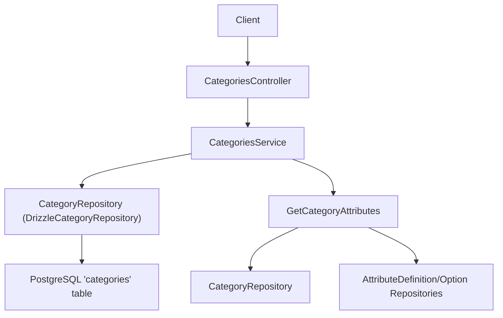
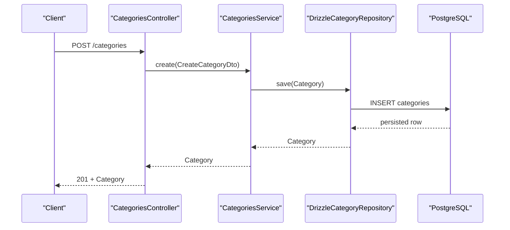
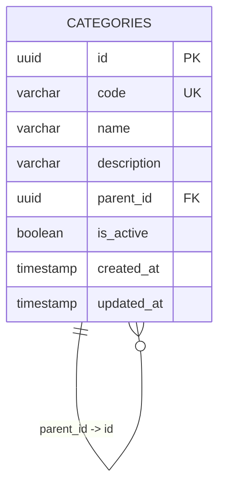
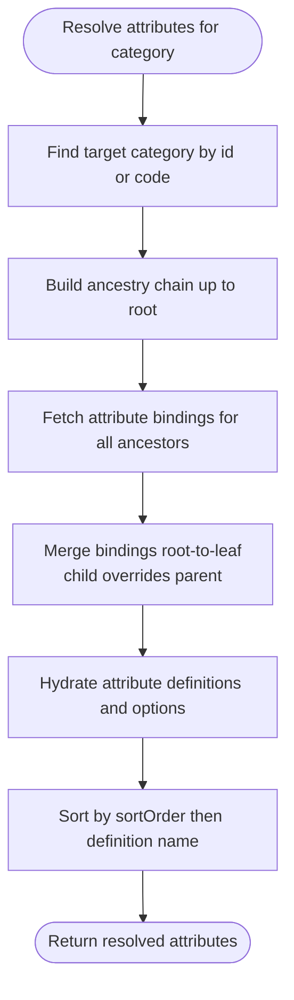
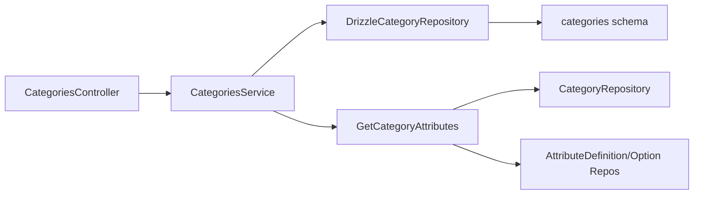

# Categories API

<cite>
**Referenced Files in This Document**
- [categories.controller.ts](file://apps/api/src/categories/categories.controller.ts)
- [categories.service.ts](file://apps/api/src/categories/categories.service.ts)
- [create-category.dto.ts](file://apps/api/src/categories/create-category.dto.ts)
- [update-category.dto.ts](file://apps/api/src/categories/update-category.dto.ts)
- [category-exception.filter.ts](file://apps/api/src/categories/category-exception.filter.ts)
- [drizzle-category.repository.ts](file://apps/api/src/infrastructure/repositories/drizzle-category.repository.ts)
- [categories schema](file://packages/database/src/schema/categories.ts)
- [category aggregate](file://packages/inventory/src/categories/category.ts)
- [category repository interface](file://packages/inventory/src/categories/category.repository.ts)
- [get category attributes](file://packages/inventory/src/attributes/get-category-attributes.ts)
- [category attribute model](file://packages/inventory/src/attributes/category-attribute.ts)
- [audit api client](file://apps/web/lib/api/audit-api.ts)
</cite>

## Table of Contents
1. Introduction
2. Project Structure
3. Core Components
4. Architecture Overview
5. Detailed Component Analysis
6. Dependency Analysis
7. Performance Considerations
8. Troubleshooting Guide
9. Conclusion

## Introduction
This document provides comprehensive API documentation for category management endpoints. It covers CRUD operations, hierarchical category structures, the category data model with parent-child relationships and metadata, attribute inheritance, validation rules, relationship with components, permissions considerations, and audit trail integration points.

## Project Structure
The categories feature is implemented as a NestJS module with:
- Controller exposing REST endpoints under /categories
- Service delegating to domain use cases and a repository abstraction
- DTOs for request validation
- Exception filter mapping domain errors to HTTP responses
- Repository implementation using Drizzle ORM against a Postgres schema
- Domain models and attribute inheritance logic in the inventory package

**Diagram sources**
- [categories.controller.ts:17-48](file://apps/api/src/categories/categories.controller.ts#L17-L48)
- [categories.service.ts:14-52](file://apps/api/src/categories/categories.service.ts#L14-L52)
- [drizzle-category.repository.ts:36-145](file://apps/api/src/infrastructure/repositories/drizzle-category.repository.ts#L36-L145)
- [get category attributes:19-149](file://packages/inventory/src/attributes/get-category-attributes.ts#L19-L149)

**Section sources**
- [categories.controller.ts:17-48](file://apps/api/src/categories/categories.controller.ts#L17-L48)
- [categories.service.ts:14-52](file://apps/api/src/categories/categories.service.ts#L14-L52)
- [drizzle-category.repository.ts:36-145](file://apps/api/src/infrastructure/repositories/drizzle-category.repository.ts#L36-L145)
- [categories schema:12-45](file://packages/database/src/schema/categories.ts#L12-L45)

## Core Components
- CategoriesController: Exposes REST endpoints for create, read, update, delete, and list categories.
- CategoriesService: Orchestrates operations via domain use cases and repository methods.
- DTOs: Validate incoming payloads for create and update operations.
- CategoryExceptionFilter: Maps domain exceptions to standardized HTTP error responses.
- DrizzleCategoryRepository: Implements persistence for categories, including hierarchy checks and component references.
- Category Aggregate: Encapsulates domain rules for creation and updates.
- Attribute Inheritance: Resolves effective attributes per category by walking the ancestry chain.

**Section sources**
- [categories.controller.ts:17-48](file://apps/api/src/categories/categories.controller.ts#L17-L48)
- [categories.service.ts:14-52](file://apps/api/src/categories/categories.service.ts#L14-L52)
- [create-category.dto.ts:3-19](file://apps/api/src/categories/create-category.dto.ts#L3-L19)
- [update-category.dto.ts:3-23](file://apps/api/src/categories/update-category.dto.ts#L3-L23)
- [category-exception.filter.ts:18-57](file://apps/api/src/categories/category-exception.filter.ts#L18-L57)
- [drizzle-category.repository.ts:36-145](file://apps/api/src/infrastructure/repositories/drizzle-category.repository.ts#L36-L145)
- [category aggregate:34-127](file://packages/inventory/src/categories/category.ts#L34-L127)
- [get category attributes:19-149](file://packages/inventory/src/attributes/get-category-attributes.ts#L19-L149)

## Architecture Overview
The API follows a layered design:
- Presentation layer: Controller validates requests using DTOs and delegates to service.
- Application layer: Service composes domain use cases and calls repository.
- Domain layer: Category aggregate enforces business rules; attribute resolution computes inherited attributes.
- Infrastructure layer: Repository translates between domain models and database rows.

**Diagram sources**
- [categories.controller.ts:22-25](file://apps/api/src/categories/categories.controller.ts#L22-L25)
- [categories.service.ts:29-31](file://apps/api/src/categories/categories.service.ts#L29-L31)
- [drizzle-category.repository.ts:36-145](file://apps/api/src/infrastructure/repositories/drizzle-category.repository.ts#L36-L145)

## Detailed Component Analysis

### REST Endpoints
Base path: /categories

- Create category
  - Method: POST
  - Path: /categories
  - Request body: CreateCategoryDto fields
  - Success response: Category object
  - Errors: Conflict if code already exists; Bad Request on validation or domain rule violations

- Get all categories
  - Method: GET
  - Path: /categories
  - Response: Array of Category objects

- Get category by id or code
  - Method: GET
  - Path: /categories/:id
  - Notes: The repository supports lookup by UUID or unique code
  - Response: Category object
  - Errors: Not Found if not found

- Update category
  - Method: PUT
  - Path: /categories/:id
  - Request body: UpdateCategoryDto fields
  - Response: Updated Category object
  - Errors: Bad Request on validation or domain rule violations

- Delete category
  - Method: DELETE
  - Path: /categories/:id
  - Response: 204 No Content on success
  - Errors: Bad Request if referenced by children or components; Not Found if missing

Request and response schemas are derived from the DTOs and domain model.

**Section sources**
- [categories.controller.ts:17-48](file://apps/api/src/categories/categories.controller.ts#L17-L48)
- [create-category.dto.ts:3-19](file://apps/api/src/categories/create-category.dto.ts#L3-L19)
- [update-category.dto.ts:3-23](file://apps/api/src/categories/update-category.dto.ts#L3-L23)
- [drizzle-category.repository.ts:36-145](file://apps/api/src/infrastructure/repositories/drizzle-category.repository.ts#L36-L145)

### Data Model and Hierarchy
- Fields: id (UUID), code (unique string), name, description (nullable), parentId (nullable self-reference), isActive (boolean), createdAt, updatedAt
- Constraints: Unique index on code; index on parentId; foreign key restricts deletion of parents with children
- Hierarchy: Parent-child via parentId; root categories have null parentId

**Diagram sources**
- [categories schema:12-45](file://packages/database/src/schema/categories.ts#L12-L45)

**Section sources**
- [categories schema:12-45](file://packages/database/src/schema/categories.ts#L12-L45)

### Validation Rules and Domain Invariants
- Code must be present and non-empty; normalized to uppercase
- Name must be present and non-empty
- Cannot set a category as its own parent
- Deletion blocked when category has children or is referenced by components

These rules are enforced in the domain aggregate and repository checks.

**Section sources**
- [category aggregate:58-118](file://packages/inventory/src/categories/category.ts#L58-L118)
- [drizzle-category.repository.ts:118-145](file://apps/api/src/infrastructure/repositories/drizzle-category.repository.ts#L118-L145)

### Attribute Inheritance Mechanism
- Attributes can be bound to categories with required flags, sort order, and default values
- Effective attributes for a category are resolved by walking the ancestry chain from root to target
- Child bindings override parent settings; defaults propagate unless overridden
- Active attribute definitions and options are included in the result

**Diagram sources**
- [get category attributes:19-149](file://packages/inventory/src/attributes/get-category-attributes.ts#L19-L149)

**Section sources**
- [get category attributes:19-149](file://packages/inventory/src/attributes/get-category-attributes.ts#L19-L149)
- [category attribute model:3-96](file://packages/inventory/src/attributes/category-attribute.ts#L3-L96)

### Relationship with Components
- A category may be referenced by components
- Deletion is prevented if any component references the category
- This ensures referential integrity at the application level

**Section sources**
- [drizzle-category.repository.ts:132-145](file://apps/api/src/infrastructure/repositories/drizzle-category.repository.ts#L132-L145)

### Permissions and Audit Trails
- Authentication and authorization are handled by other modules; this API relies on them to protect endpoints
- Security audit logs can be queried via the security audit endpoint; while not directly part of categories endpoints, they provide an audit trail mechanism across the system

**Section sources**
- [audit api client:1-27](file://apps/web/lib/api/audit-api.ts#L1-L27)

## Dependency Analysis
- Controller depends on Service and DTOs
- Service depends on domain use cases and CategoryRepository
- Repository depends on Drizzle ORM and the categories schema
- Attribute resolution depends on category and attribute repositories

**Diagram sources**
- [categories.controller.ts:17-48](file://apps/api/src/categories/categories.controller.ts#L17-L48)
- [categories.service.ts:14-52](file://apps/api/src/categories/categories.service.ts#L14-L52)
- [drizzle-category.repository.ts:36-145](file://apps/api/src/infrastructure/repositories/drizzle-category.repository.ts#L36-L145)
- [get category attributes:19-149](file://packages/inventory/src/attributes/get-category-attributes.ts#L19-L149)

**Section sources**
- [categories.controller.ts:17-48](file://apps/api/src/categories/categories.controller.ts#L17-L48)
- [categories.service.ts:14-52](file://apps/api/src/categories/categories.service.ts#L14-L52)
- [drizzle-category.repository.ts:36-145](file://apps/api/src/infrastructure/repositories/drizzle-category.repository.ts#L36-L145)

## Performance Considerations
- Use code lookups where appropriate to avoid unnecessary UUID conversions
- Indexes on code and parentId support efficient queries for hierarchy traversal and filtering
- Attribute resolution batches ancestor lookups and merges efficiently; consider caching results for frequently accessed categories
- Avoid deep hierarchies that require many ancestor hops; keep category trees reasonably shallow

[No sources needed since this section provides general guidance]

## Troubleshooting Guide
Common errors and their meanings:
- Conflict (409): Category code already exists
- Not Found (404): Category not found by id or code
- Bad Request (400): Invalid input or domain rule violation (e.g., setting a category as its own parent, deleting a category with children or component references)

The exception filter maps these domain errors to consistent JSON responses with status codes and messages.

**Section sources**
- [category-exception.filter.ts:18-57](file://apps/api/src/categories/category-exception.filter.ts#L18-L57)

## Conclusion
The Categories API provides robust CRUD operations with strong domain validation, hierarchical structure support, and attribute inheritance. Integration points exist for permissions and audit logging through shared modules. Use the provided endpoints and understand the constraints around hierarchy and component references to manage categories safely and effectively.

[No sources needed since this section summarizes without analyzing specific files]