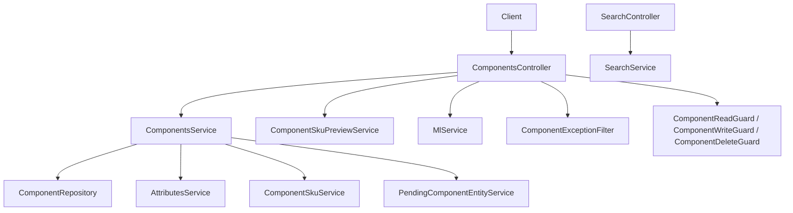
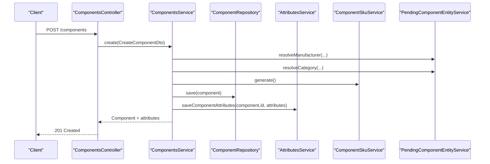
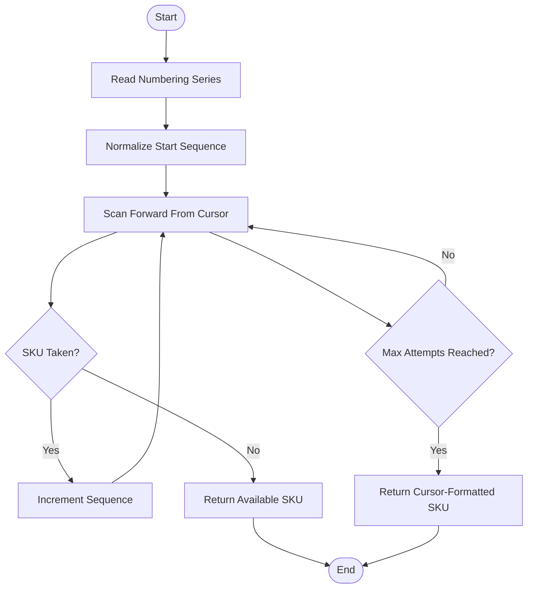
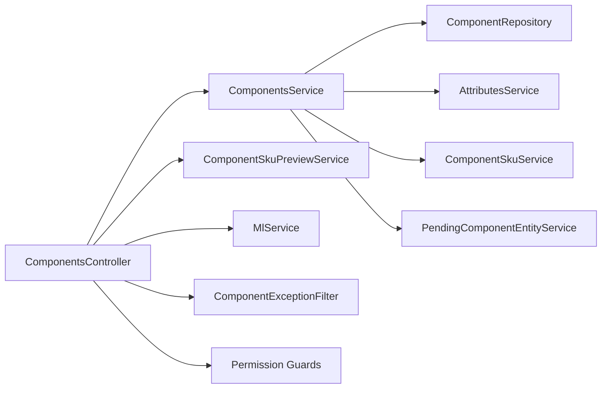

# Components API

<cite>
**Referenced Files in This Document**
- [components.controller.ts](file://apps/api/src/components/components.controller.ts)
- [components.service.ts](file://apps/api/src/components/components.service.ts)
- [create-component.dto.ts](file://apps/api/src/components/create-component.dto.ts)
- [update-component.dto.ts](file://apps/api/src/components/update-component.dto.ts)
- [component-sku-allocation.ts](file://apps/api/src/components/component-sku-allocation.ts)
- [component-sku.service.ts](file://apps/api/src/components/component-sku.service.ts)
- [component-sku-preview.service.ts](file://apps/api/src/components/component-sku-preview.service.ts)
- [component-exception.filter.ts](file://apps/api/src/components/component-exception.filter.ts)
- [component-permissions.ts](file://apps/api/src/auth/component-permissions.ts)
- [pending-component-entity.service.ts](file://apps/api/src/components/pending-component-entity.service.ts)
- [component-lifecycle.guard.ts](file://apps/api/src/components/component-lifecycle.guard.ts)
- [search.controller.ts](file://apps/api/src/search/search.controller.ts)
- [search.service.ts](file://apps/api/src/search/search.service.ts)
- [search.types.ts](file://apps/api/src/search/search.types.ts)
</cite>

## Table of Contents
1. [Introduction](#introduction)
2. [Project Structure](#project-structure)
3. [Core Components](#core-components)
4. [Architecture Overview](#architecture-overview)
5. [Detailed Component Analysis](#detailed-component-analysis)
6. [Dependency Analysis](#dependency-analysis)
7. [Performance Considerations](#performance-considerations)
8. [Troubleshooting Guide](#troubleshooting-guide)
9. [Conclusion](#conclusion)

## Introduction
This document provides comprehensive API documentation for component management endpoints. It covers all CRUD operations, the component data model including attributes and lifecycle behavior, SKU allocation and preview, search integration, validation rules, error handling, and permission requirements. The goal is to help both technical and non-technical users understand how to create, update, retrieve, and delete components safely and efficiently.

## Project Structure
The component management feature is implemented as a NestJS controller with a service layer, DTOs for input validation, specialized services for SKU generation and preview, an exception filter for consistent error responses, and guards for authorization. Search functionality is exposed through a separate search module that aggregates results from multiple providers, including inventory.

**Diagram sources**
- [components.controller.ts:65-142](file://apps/api/src/components/components.controller.ts#L65-L142)
- [components.service.ts:87-206](file://apps/api/src/components/components.service.ts#L87-L206)
- [component-sku.service.ts:10-47](file://apps/api/src/components/component-sku.service.ts#L10-L47)
- [component-sku-preview.service.ts:25-60](file://apps/api/src/components/component-sku-preview.service.ts#L25-L60)
- [component-exception.filter.ts:23-70](file://apps/api/src/components/component-exception.filter.ts#L23-L70)
- [component-permissions.ts:52-77](file://apps/api/src/auth/component-permissions.ts#L52-L77)
- [search.controller.ts:4-14](file://apps/api/src/search/search.controller.ts#L4-L14)
- [search.service.ts:9-42](file://apps/api/src/search/search.service.ts#L9-L42)

**Section sources**
- [components.controller.ts:65-142](file://apps/api/src/components/components.controller.ts#L65-L142)
- [components.service.ts:87-206](file://apps/api/src/components/components.service.ts#L87-L206)

## Core Components
- ComponentsController: Exposes REST endpoints for component creation, retrieval, updates, deletion, SKU preview, suggestion, and feedback recording. All routes are guarded by role-based permissions.
- ComponentsService: Orchestrates business logic for creating, updating, deleting, listing, and retrieving components. It normalizes attribute inputs, resolves pending manufacturer/category entities, and attaches attributes to returned components.
- CreateComponentDto and UpdateComponentDto: Validate incoming payloads for create and update operations, including optional fields like SKU, manufacturer part number, name, description, category/manufacturer references, default location, unit, and attributes.
- ComponentSkuService: Generates unique SKUs using a database-backed numbering series for components.
- ComponentSkuPreviewService: Provides a read-only preview of the next available SKU without reserving it.
- ComponentExceptionFilter: Converts domain exceptions into standardized HTTP responses with appropriate status codes.
- Permission Guards: Enforce Inventory.Read, Inventory.Update, and Inventory.Delete permissions for read, write, and delete operations respectively.
- PendingComponentEntityService: Resolves or creates manufacturers and categories inline when clients provide pending entity definitions instead of IDs.
- Lifecycle Guard Helper: Prevents use of consolidated (retired) components for new operational activity.

**Section sources**
- [components.controller.ts:65-142](file://apps/api/src/components/components.controller.ts#L65-L142)
- [components.service.ts:87-206](file://apps/api/src/components/components.service.ts#L87-L206)
- [create-component.dto.ts:44-94](file://apps/api/src/components/create-component.dto.ts#L44-L94)
- [update-component.dto.ts:45-90](file://apps/api/src/components/update-component.dto.ts#L45-L90)
- [component-sku.service.ts:10-47](file://apps/api/src/components/component-sku.service.ts#L10-L47)
- [component-sku-preview.service.ts:25-60](file://apps/api/src/components/component-sku-preview.service.ts#L25-L60)
- [component-exception.filter.ts:23-70](file://apps/api/src/components/component-exception.filter.ts#L23-L70)
- [component-permissions.ts:52-77](file://apps/api/src/auth/component-permissions.ts#L52-L77)
- [pending-component-entity.service.ts:22-128](file://apps/api/src/components/pending-component-entity.service.ts#L22-L128)
- [component-lifecycle.guard.ts:22-67](file://apps/api/src/components/component-lifecycle.guard.ts#L22-L67)

## Architecture Overview
The Components API follows a layered architecture:
- Controller Layer: Validates request bodies via DTOs, applies guards, delegates to services, and returns normalized responses.
- Service Layer: Implements domain logic, coordinates repositories and auxiliary services, and enriches responses with attributes.
- Data Access Layer: Uses a repository abstraction for persistence operations.
- Cross-Cutting Concerns: Exception filtering, permission enforcement, SKU allocation, and pending entity resolution.

**Diagram sources**
- [components.controller.ts:106-112](file://apps/api/src/components/components.controller.ts#L106-L112)
- [components.service.ts:108-142](file://apps/api/src/components/components.service.ts#L108-L142)
- [component-sku.service.ts:12-46](file://apps/api/src/components/component-sku.service.ts#L12-L46)
- [pending-component-entity.service.ts:29-52](file://apps/api/src/components/pending-component-entity.service.ts#L29-L52)

## Detailed Component Analysis

### Endpoints and Operations

#### Create Component
- Method: POST
- Path: /components
- Authentication: Required
- Authorization: Inventory.Update
- Request Body: CreateComponentDto
- Response: Component with optional attributes map
- Behavior:
  - Resolves pending manufacturer/category if provided.
  - Generates SKU via ComponentSkuService unless explicitly provided.
  - Saves component and associated attributes.
  - Returns enriched component with attributes.

Validation Rules:
- name: required string, max length 255.
- unit: required string, max length 50.
- sku: optional string, max length 50.
- manufacturerPartNumber: optional string, max length 128.
- description: optional string, max length 1000.
- manufacturerId/categoryId/defaultLocationId: optional UUIDs.
- pendingManufacturer/pendingCategory: optional nested objects for inline creation.
- attributes: optional record or array of attribute entries.

Error Handling:
- Invalid payload: 400 Bad Request.
- Duplicate SKU: 409 Conflict.
- Missing default location: 400 Bad Request.
- Attribute definition not found or invalid value: 400 Bad Request.

Permission Requirements:
- Requires Inventory.Update.

Example Usage:
- See [CreateComponentDto:44-94](file://apps/api/src/components/create-component.dto.ts#L44-L94) for field constraints and types.

**Section sources**
- [components.controller.ts:106-112](file://apps/api/src/components/components.controller.ts#L106-L112)
- [components.service.ts:108-142](file://apps/api/src/components/components.service.ts#L108-L142)
- [create-component.dto.ts:44-94](file://apps/api/src/components/create-component.dto.ts#L44-L94)
- [component-exception.filter.ts:43-63](file://apps/api/src/components/component-exception.filter.ts#L43-L63)
- [component-permissions.ts:52-77](file://apps/api/src/auth/component-permissions.ts#L52-L77)

#### Retrieve All Components
- Method: GET
- Path: /components
- Authentication: Required
- Authorization: Inventory.Read
- Response: Array of Component objects with attributes maps
- Behavior:
  - Lists all components.
  - Attaches attributes per component.

Error Handling:
- No special errors; empty list returns [].

Permission Requirements:
- Requires Inventory.Read.

**Section sources**
- [components.controller.ts:114-118](file://apps/api/src/components/components.controller.ts#L114-L118)
- [components.service.ts:183-194](file://apps/api/src/components/components.service.ts#L183-L194)
- [component-permissions.ts:52-77](file://apps/api/src/auth/component-permissions.ts#L52-L77)

#### Retrieve Component by ID
- Method: GET
- Path: /components/:id
- Authentication: Required
- Authorization: Inventory.Read
- Response: Component object with attributes map
- Behavior:
  - Finds component by ID.
  - Throws ComponentNotFoundError if missing.
  - Attaches attributes.

Error Handling:
- Not found: 404 Not Found.

Permission Requirements:
- Requires Inventory.Read.

**Section sources**
- [components.controller.ts:120-126](file://apps/api/src/components/components.controller.ts#L120-L126)
- [components.service.ts:196-205](file://apps/api/src/components/components.service.ts#L196-L205)
- [component-exception.filter.ts:49-51](file://apps/api/src/components/component-exception.filter.ts#L49-L51)
- [component-permissions.ts:52-77](file://apps/api/src/auth/component-permissions.ts#L52-L77)

#### Update Component
- Method: PUT
- Path: /components/:id
- Authentication: Required
- Authorization: Inventory.Update
- Request Body: UpdateComponentDto
- Response: Component with optional attributes map
- Behavior:
  - Updates component properties.
  - Resolves pending manufacturer/category if provided.
  - Saves attributes if included.
  - Returns enriched component with attributes.

Validation Rules:
- Optional fields include manufacturerPartNumber, name, description, manufacturerId, categoryId, defaultLocationId, unit, isActive, attributes.

Error Handling:
- Invalid payload: 400 Bad Request.
- Not found: 404 Not Found.

Permission Requirements:
- Requires Inventory.Update.

Example Usage:
- See [UpdateComponentDto:45-90](file://apps/api/src/components/update-component.dto.ts#L45-L90) for field constraints and types.

**Section sources**
- [components.controller.ts:128-135](file://apps/api/src/components/components.controller.ts#L128-L135)
- [components.service.ts:144-177](file://apps/api/src/components/components.service.ts#L144-L177)
- [update-component.dto.ts:45-90](file://apps/api/src/components/update-component.dto.ts#L45-L90)
- [component-exception.filter.ts:49-63](file://apps/api/src/components/component-exception.filter.ts#L49-L63)
- [component-permissions.ts:52-77](file://apps/api/src/auth/component-permissions.ts#L52-L77)

#### Delete Component
- Method: DELETE
- Path: /components/:id
- Authentication: Required
- Authorization: Inventory.Delete
- Response: Empty body on success
- Behavior:
  - Deletes component by ID.

Error Handling:
- Not found: 404 Not Found.

Permission Requirements:
- Requires Inventory.Delete.

**Section sources**
- [components.controller.ts:137-141](file://apps/api/src/components/components.controller.ts#L137-L141)
- [components.service.ts:179-181](file://apps/api/src/components/components.service.ts#L179-L181)
- [component-exception.filter.ts:49-51](file://apps/api/src/components/component-exception.filter.ts#L49-L51)
- [component-permissions.ts:52-77](file://apps/api/src/auth/component-permissions.ts#L52-L77)

#### Preview Next Available SKU
- Method: GET
- Path: /components/sku/preview
- Authentication: Required
- Authorization: Inventory.Read
- Response: String representing the next available SKU
- Behavior:
  - Reads numbering series configuration.
  - Scans forward from cursor to find first free SKU.
  - Does not reserve the SKU.

Error Handling:
- Exhaustion fallback returns current cursor-formatted SKU rather than failing.

Permission Requirements:
- Requires Inventory.Read.

**Section sources**
- [components.controller.ts:82-86](file://apps/api/src/components/components.controller.ts#L82-L86)
- [component-sku-preview.service.ts:32-59](file://apps/api/src/components/component-sku-preview.service.ts#L32-L59)
- [component-sku-allocation.ts:43-68](file://apps/api/src/components/component-sku-allocation.ts#L43-L68)
- [component-permissions.ts:52-77](file://apps/api/src/auth/component-permissions.ts#L52-L77)

#### Suggest Components
- Method: POST
- Path: /components/suggest
- Authentication: Required
- Authorization: Inventory.Read
- Request Body: SuggestComponentDto
- Response: ComponentSuggestionResponseDto
- Behavior:
  - Delegates to ML service for suggestions.
  - Costs money due to external inference; hence requires read permission.

Error Handling:
- ML-related errors handled by ML service.

Permission Requirements:
- Requires Inventory.Read.

**Section sources**
- [components.controller.ts:74-80](file://apps/api/src/components/components.controller.ts#L74-L80)
- [component-permissions.ts:52-77](file://apps/api/src/auth/component-permissions.ts#L52-L77)

#### Record Suggestion Feedback
- Method: POST
- Path: /components/suggest/feedback
- Authentication: Required
- Authorization: Inventory.Update
- Request Body: CreateMlFeedbackDto
- Response: ML feedback acknowledgment
- Behavior:
  - Records AI suggestion telemetry.
  - Actor identity comes from authenticated session, not request body.

Error Handling:
- ML-related errors handled by ML service.

Permission Requirements:
- Requires Inventory.Update.

**Section sources**
- [components.controller.ts:96-104](file://apps/api/src/components/components.controller.ts#L96-L104)
- [component-permissions.ts:52-77](file://apps/api/src/auth/component-permissions.ts#L52-L77)

### Component Data Model
- Identifier: id (UUID)
- Identifiers:
  - sku: optional string identifier for the component.
  - manufacturerPartNumber: optional string referencing manufacturer part number.
- Metadata:
  - name: required string.
  - description: optional string.
  - manufacturerId: optional UUID reference to manufacturer.
  - categoryId: optional UUID reference to category.
  - defaultLocationId: optional UUID reference to default storage location.
  - unit: required string representing unit of measure.
  - isActive: optional boolean indicating active/inactive state.
- Attributes:
  - attributes: optional map of key-value pairs attached to the component.
  - Supports flexible attribute inputs during create/update.

Lifecycle States:
- Active/Inactive via isActive flag.
- Consolidated (retired) components cannot be used for new operational activity; selection paths should enforce this rule.

**Section sources**
- [create-component.dto.ts:44-94](file://apps/api/src/components/create-component.dto.ts#L44-L94)
- [update-component.dto.ts:45-90](file://apps/api/src/components/update-component.dto.ts#L45-L90)
- [component-lifecycle.guard.ts:22-67](file://apps/api/src/components/component-lifecycle.guard.ts#L22-L67)

### SKU Allocation System
- Generation:
  - ComponentSkuService generates SKUs by incrementing a database-backed numbering series for components.
  - Series includes prefix, zero-padding length, and next sequence number.
- Preview:
  - ComponentSkuPreviewService reads the numbering series and scans forward to find the first free SKU without reserving it.
- Allocation Algorithm:
  - Starts at configured cursor.
  - Checks availability via repository lookup.
  - Returns first available SKU or null after maximum attempts.
  - Fallback returns formatted cursor SKU on exhaustion.

**Diagram sources**
- [component-sku-allocation.ts:43-68](file://apps/api/src/components/component-sku-allocation.ts#L43-L68)
- [component-sku-preview.service.ts:32-59](file://apps/api/src/components/component-sku-preview.service.ts#L32-L59)
- [component-sku.service.ts:12-46](file://apps/api/src/components/component-sku.service.ts#L12-L46)

**Section sources**
- [component-sku.service.ts:10-47](file://apps/api/src/components/component-sku.service.ts#L10-L47)
- [component-sku-preview.service.ts:25-60](file://apps/api/src/components/component-sku-preview.service.ts#L25-L60)
- [component-sku-allocation.ts:1-68](file://apps/api/src/components/component-sku-allocation.ts#L1-L68)

### Managing Component Variants
- Variants are modeled as separate components sharing common attributes.
- Use attributes to encode variant-specific properties such as color, size, or material.
- When creating variants, reuse attribute definitions and pass attribute payloads to associate variant details.

Best Practices:
- Keep base attributes stable across variants.
- Use clear attribute codes for variant dimensions.
- Leverage search to discover related variants by shared attributes.

**Section sources**
- [components.service.ts:35-85](file://apps/api/src/components/components.service.ts#L35-L85)
- [create-component.dto.ts:83-94](file://apps/api/src/components/create-component.dto.ts#L83-L94)
- [update-component.dto.ts:84-90](file://apps/api/src/components/update-component.dto.ts#L84-L90)

### Bulk Operations
- The component module does not expose dedicated bulk endpoints in the analyzed files.
- Clients can perform batch operations by iterating over individual endpoints.
- For large-scale imports, consider using the import/export subsystem outside the component module.

Recommendations:
- Implement client-side retries and concurrency limits.
- Use SKU preview to pre-validate uniqueness before bulk creation.

[No sources needed since this section provides general guidance]

### Component Search Functionality
- Global search endpoint: GET /search?q=...&limit=...
- Aggregates results from multiple providers, including inventory.
- Component items appear under the Inventory category within search results.

Usage:
- Query with a keyword to retrieve matching components and other inventory entities.
- Adjust limit to control result count.

**Section sources**
- [search.controller.ts:4-14](file://apps/api/src/search/search.controller.ts#L4-L14)
- [search.service.ts:9-42](file://apps/api/src/search/search.service.ts#L9-L42)
- [search.types.ts:1-24](file://apps/api/src/search/search.types.ts#L1-L24)

## Dependency Analysis
The following diagram illustrates dependencies among core components:

**Diagram sources**
- [components.controller.ts:65-142](file://apps/api/src/components/components.controller.ts#L65-L142)
- [components.service.ts:87-206](file://apps/api/src/components/components.service.ts#L87-L206)
- [component-sku.service.ts:10-47](file://apps/api/src/components/component-sku.service.ts#L10-L47)
- [component-sku-preview.service.ts:25-60](file://apps/api/src/components/component-sku-preview.service.ts#L25-L60)
- [component-exception.filter.ts:23-70](file://apps/api/src/components/component-exception.filter.ts#L23-L70)
- [component-permissions.ts:52-77](file://apps/api/src/auth/component-permissions.ts#L52-L77)

**Section sources**
- [components.controller.ts:65-142](file://apps/api/src/components/components.controller.ts#L65-L142)
- [components.service.ts:87-206](file://apps/api/src/components/components.service.ts#L87-L206)

## Performance Considerations
- Attribute Loading:
  - Listing components loads attributes in bulk to reduce round trips.
- SKU Allocation:
  - Database-backed numbering series ensures atomic increments.
  - Preview scans forward only when necessary; avoid excessive scanning by reusing previews.
- Search:
  - Parallel provider searches improve responsiveness; failures in one provider do not block others.

[No sources needed since this section provides general guidance]

## Troubleshooting Guide
Common Errors and Responses:
- Duplicate SKU:
  - Status: 409 Conflict
  - Message: Provided by domain exception.
- Missing Default Location:
  - Status: 400 Bad Request
  - Message: Provided by domain exception.
- Component Not Found:
  - Status: 404 Not Found
  - Message: Provided by domain exception.
- Invalid Input (SKU, Name, Unit, Attributes):
  - Status: 400 Bad Request
  - Message: Provided by domain exception.
- Pending Entity Conflicts:
  - Status: 400 Bad Request
  - Message: Indicates conflicting pending entity definitions.

Authorization Issues:
- Unauthorized access to read endpoints: 401/403 depending on guard implementation.
- Unauthorized writes: 403 Forbidden.
- Unauthorized deletes: 403 Forbidden.

Lifecycle Restrictions:
- Attempting to use a consolidated component for new activity will raise a specific error indicating consolidation and directing to the surviving component.

**Section sources**
- [component-exception.filter.ts:23-70](file://apps/api/src/components/component-exception.filter.ts#L23-L70)
- [component-permissions.ts:52-77](file://apps/api/src/auth/component-permissions.ts#L52-L77)
- [component-lifecycle.guard.ts:22-67](file://apps/api/src/components/component-lifecycle.guard.ts#L22-L67)

## Conclusion
The Components API provides robust CRUD capabilities with strong validation, secure authorization, and flexible attribute support. SKU allocation is centralized and predictable, while preview offers safe exploration of future identifiers. Search integrates components into a unified discovery experience. Error handling is consistent and informative, aiding both developers and operators. For advanced workflows, leverage attributes to model variants and consider client-side batching for bulk operations.