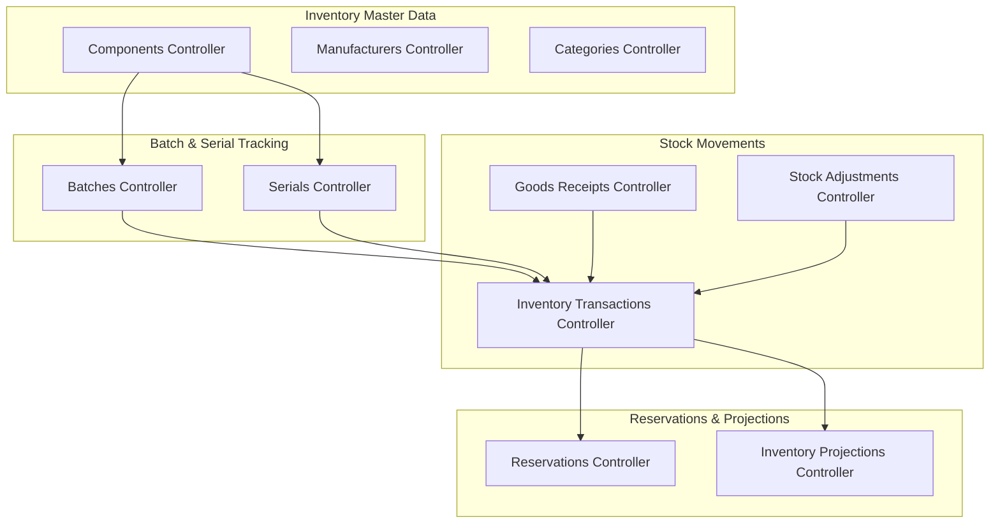
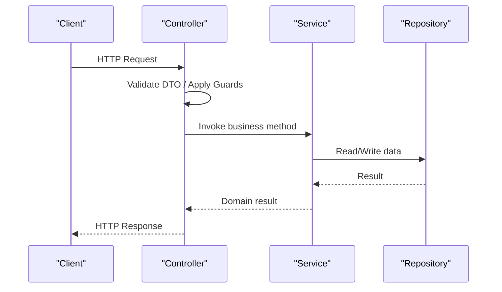
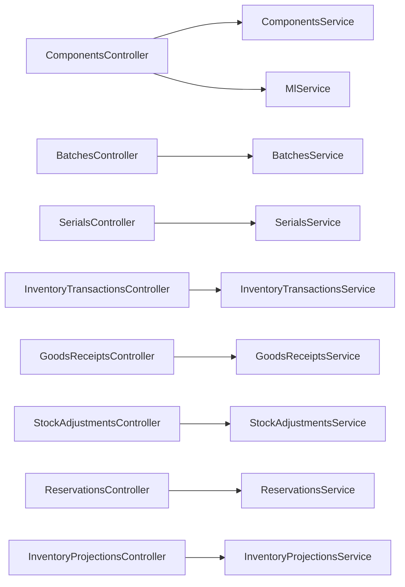
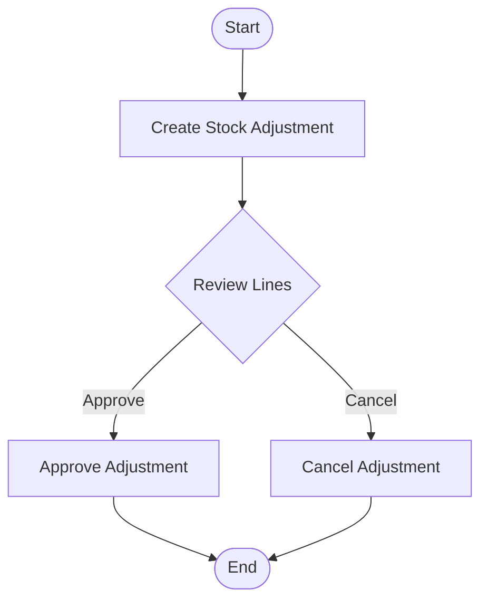
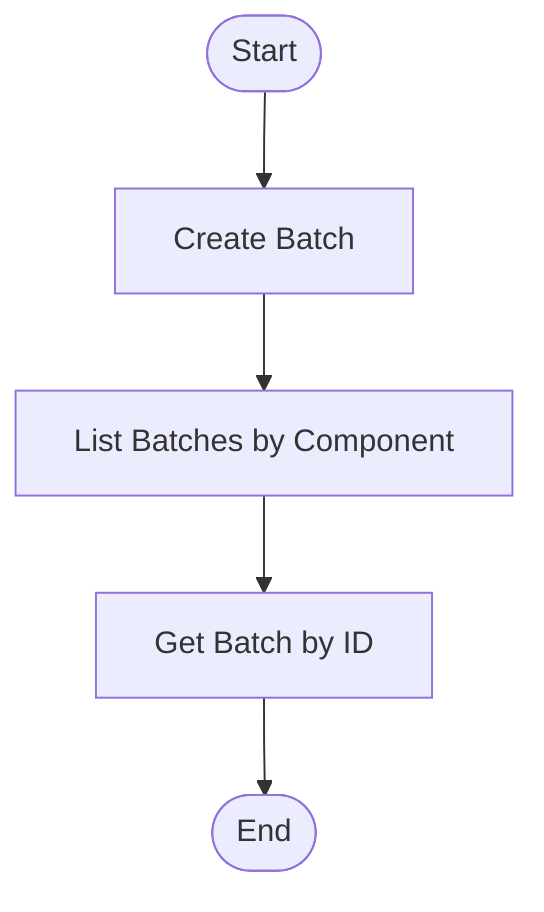
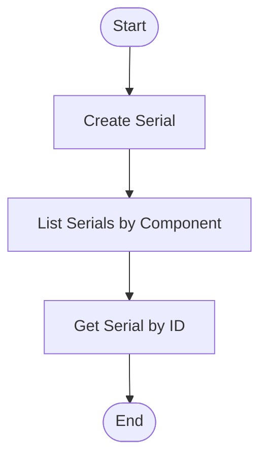
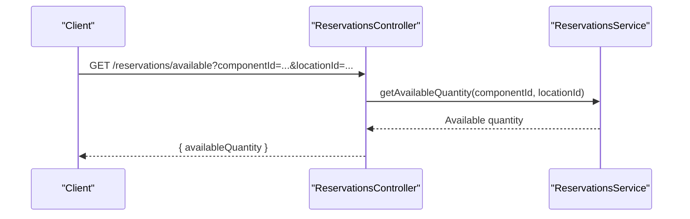
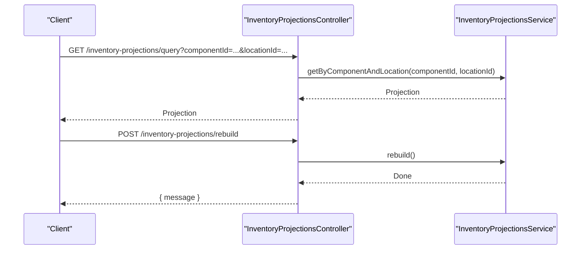

# Inventory Management APIs

<cite>
**Referenced Files in This Document**
- [components.controller.ts](file://apps/api/src/components/components.controller.ts)
- [create-component.dto.ts](file://apps/api/src/components/create-component.dto.ts)
- [batches.controller.ts](file://apps/api/src/batches/batches.controller.ts)
- [create-batch.dto.ts](file://apps/api/src/batches/create-batch.dto.ts)
- [categories.controller.ts](file://apps/api/src/categories/categories.controller.ts)
- [manufacturers.controller.ts](file://apps/api/src/manufacturers/manufacturers.controller.ts)
- [serials.controller.ts](file://apps/api/src/serials/serials.controller.ts)
- [inventory-transactions.controller.ts](file://apps/api/src/inventory-transactions/inventory-transactions.controller.ts)
- [create-inventory-transaction.dto.ts](file://apps/api/src/inventory-transactions/create-inventory-transaction.dto.ts)
- [reservations.controller.ts](file://apps/api/src/reservations/reservations.controller.ts)
- [dtos.ts](file://apps/api/src/reservations/dtos.ts)
- [stock-adjustments.controller.ts](file://apps/api/src/stock-adjustments/stock-adjustments.controller.ts)
- [dtos.ts](file://apps/api/src/stock-adjustments/dtos.ts)
- [inventory-projections.controller.ts](file://apps/api/src/inventory-projections/inventory-projections.controller.ts)
- [goods-receipts.controller.ts](file://apps/api/src/goods-receipts/goods-receipts.controller.ts)
</cite>

## Table of Contents
1. Introduction
2. Project Structure
3. Core Components
4. Architecture Overview
5. Detailed Component Analysis
6. Dependency Analysis
7. Performance Considerations
8. Troubleshooting Guide
9. Conclusion
10. Appendices

## Introduction
This document provides detailed API documentation for inventory management endpoints covering components, manufacturers, categories, batches, serial numbers, inventory transactions, and reservations. It includes CRUD operations, bulk actions where applicable, specialized workflows (stock adjustments, goods receipts), request/response schemas, examples of common operations (stock adjustments, batch tracking, serial number management), and guidance on inventory projection calculations and real-time stock availability queries.

## Project Structure
The inventory-related endpoints are implemented as NestJS controllers under the apps/api/src directory. Each controller exposes REST endpoints and delegates business logic to services. DTOs define request validation and response shapes.

**Diagram sources**
- [components.controller.ts:65-142](file://apps/api/src/components/components.controller.ts#L65-L142)
- [batches.controller.ts:12-45](file://apps/api/src/batches/batches.controller.ts#L12-L45)
- [serials.controller.ts:12-39](file://apps/api/src/serials/serials.controller.ts#L12-L39)
- [inventory-transactions.controller.ts:14-52](file://apps/api/src/inventory-transactions/inventory-transactions.controller.ts#L14-L52)
- [goods-receipts.controller.ts:14-46](file://apps/api/src/goods-receipts/goods-receipts.controller.ts#L14-L46)
- [stock-adjustments.controller.ts:15-49](file://apps/api/src/stock-adjustments/stock-adjustments.controller.ts#L15-L49)
- [reservations.controller.ts:17-83](file://apps/api/src/reservations/reservations.controller.ts#L17-L83)
- [inventory-projections.controller.ts:11-52](file://apps/api/src/inventory-projections/inventory-projections.controller.ts#L11-L52)

**Section sources**
- [components.controller.ts:65-142](file://apps/api/src/components/components.controller.ts#L65-L142)
- [batches.controller.ts:12-45](file://apps/api/src/batches/batches.controller.ts#L12-L45)
- [serials.controller.ts:12-39](file://apps/api/src/serials/serials.controller.ts#L12-L39)
- [inventory-transactions.controller.ts:14-52](file://apps/api/src/inventory-transactions/inventory-transactions.controller.ts#L14-L52)
- [goods-receipts.controller.ts:14-46](file://apps/api/src/goods-receipts/goods-receipts.controller.ts#L14-L46)
- [stock-adjustments.controller.ts:15-49](file://apps/api/src/stock-adjustments/stock-adjustments.controller.ts#L15-L49)
- [reservations.controller.ts:17-83](file://apps/api/src/reservations/reservations.controller.ts#L17-L83)
- [inventory-projections.controller.ts:11-52](file://apps/api/src/inventory-projections/inventory-projections.controller.ts#L11-L52)

## Core Components
- Components: Full CRUD plus AI suggestion endpoints with read/write guards.
- Manufacturers: Full CRUD.
- Categories: Full CRUD.
- Batches: Create and list by component; get by ID.
- Serials: Create and list by component; get by ID.
- Inventory Transactions: Create and list with filters; get by ID.
- Goods Receipts: Create, add lines, post receipt; list and get by ID.
- Stock Adjustments: Create, approve/cancel; list and get by ID.
- Reservations: Create, update, fulfill/release/cancel/delete; list; query available quantity.
- Inventory Projections: Query projections by component/location; rebuild.

**Section sources**
- [components.controller.ts:65-142](file://apps/api/src/components/components.controller.ts#L65-L142)
- [manufacturers.controller.ts:17-49](file://apps/api/src/manufacturers/manufacturers.controller.ts#L17-L49)
- [categories.controller.ts:17-49](file://apps/api/src/categories/categories.controller.ts#L17-L49)
- [batches.controller.ts:12-45](file://apps/api/src/batches/batches.controller.ts#L12-L45)
- [serials.controller.ts:12-39](file://apps/api/src/serials/serials.controller.ts#L12-L39)
- [inventory-transactions.controller.ts:14-52](file://apps/api/src/inventory-transactions/inventory-transactions.controller.ts#L14-L52)
- [goods-receipts.controller.ts:14-46](file://apps/api/src/goods-receipts/goods-receipts.controller.ts#L14-L46)
- [stock-adjustments.controller.ts:15-49](file://apps/api/src/stock-adjustments/stock-adjustments.controller.ts#L15-L49)
- [reservations.controller.ts:17-83](file://apps/api/src/reservations/reservations.controller.ts#L17-L83)
- [inventory-projections.controller.ts:11-52](file://apps/api/src/inventory-projections/inventory-projections.controller.ts#L11-L52)

## Architecture Overview
The inventory subsystem follows a layered architecture:
- Controllers expose REST endpoints and validate inputs via DTOs.
- Services encapsulate domain logic and orchestrate data access.
- Repositories (not shown here) interact with the database.
- Guards enforce permissions for sensitive operations.

[No sources needed since this diagram shows conceptual workflow, not actual code structure]

## Detailed Component Analysis

### Components API
- Endpoints:
  - POST /components/suggest
  - GET /components/sku/preview
  - POST /components/suggest/feedback
  - POST /components
  - GET /components
  - GET /components/:id
  - PUT /components/:id
  - DELETE /components/:id
- Security:
  - Read endpoints use ComponentReadGuard.
  - Write endpoints use ComponentWriteGuard.
  - Delete uses ComponentDeleteGuard.
- Notes:
  - suggest is authenticated read/compute and requires read permission.
  - feedback writes telemetry using the authenticated user from the session.

Request schema: CreateComponentDto
- Fields include optional sku, manufacturerPartNumber, required name, optional description, optional manufacturerId/categoryId/defaultLocationId, optional pendingManufacturer/pendingCategory, required unit, optional attributes.

Response shape:
- Single component or array of components with optional attributes map.

Common operations:
- Create a component with master data references or pending values.
- Update an existing component.
- Delete a component (guarded).

**Section sources**
- [components.controller.ts:65-142](file://apps/api/src/components/components.controller.ts#L65-L142)
- [create-component.dto.ts:44-94](file://apps/api/src/components/create-component.dto.ts#L44-L94)

### Manufacturers API
- Endpoints:
  - POST /manufacturers
  - GET /manufacturers
  - GET /manufacturers/:id
  - PUT /manufacturers/:id
  - DELETE /manufacturers/:id
- Behavior:
  - Standard CRUD over Manufacturer entities.

**Section sources**
- [manufacturers.controller.ts:17-49](file://apps/api/src/manufacturers/manufacturers.controller.ts#L17-L49)

### Categories API
- Endpoints:
  - POST /categories
  - GET /categories
  - GET /categories/:id
  - PUT /categories/:id
  - DELETE /categories/:id
- Behavior:
  - Standard CRUD over Category entities.

**Section sources**
- [categories.controller.ts:17-49](file://apps/api/src/categories/categories.controller.ts#L17-L49)

### Batches API
- Endpoints:
  - GET /batches
  - POST /batches
  - GET /batches/component/:componentId
  - GET /batches/:id
- Behavior:
  - Create batch with componentId, batchNumber, optional manufacturingDate/expiryDate/supplierBatchNumber.
  - Date fields are parsed into dates before persistence.
  - Returns 404 if batch not found.

Request schema: CreateBatchDto
- componentId (string, required)
- batchNumber (string, required)
- manufacturingDate (optional ISO date string)
- expiryDate (optional ISO date string)
- supplierBatchNumber (optional string)

**Section sources**
- [batches.controller.ts:12-45](file://apps/api/src/batches/batches.controller.ts#L12-L45)
- [create-batch.dto.ts:3-21](file://apps/api/src/batches/create-batch.dto.ts#L3-L21)

### Serial Numbers API
- Endpoints:
  - GET /serials
  - POST /serials
  - GET /serials/component/:componentId
  - GET /serials/:id
- Behavior:
  - Create serial entries and retrieve by component or ID.
  - Returns 404 if serial not found.

**Section sources**
- [serials.controller.ts:12-39](file://apps/api/src/serials/serials.controller.ts#L12-L39)

### Inventory Transactions API
- Endpoints:
  - POST /inventory-transactions
  - GET /inventory-transactions
  - GET /inventory-transactions/:id
- Filters:
  - componentId, locationId, transactionType, reference, createdBy, search
- Behavior:
  - Create a transaction with type, quantities, locations, and metadata.
  - List with filtering and search.
  - Get by ID returns 404 if not found.

Request schema: CreateInventoryTransactionDto
- componentId (string, required)
- quantity (number, min 0.0001)
- unitOfMeasure (string, required)
- sourceLocationId (optional string)
- destinationLocationId (optional string)
- transactionType (enum TransactionType, required)
- reference (optional string)
- reason (optional string)
- createdBy (string, required)

**Section sources**
- [inventory-transactions.controller.ts:14-52](file://apps/api/src/inventory-transactions/inventory-transactions.controller.ts#L14-L52)
- [create-inventory-transaction.dto.ts:4-36](file://apps/api/src/inventory-transactions/create-inventory-transaction.dto.ts#L4-L36)

### Goods Receipts API
- Endpoints:
  - POST /goods-receipts
  - GET /goods-receipts
  - GET /goods-receipts/:id
  - POST /goods-receipts/:id/lines
  - POST /goods-receipts/:id/post
- Filters:
  - purchaseOrderId, supplierId
- Behavior:
  - Create a draft receipt, add lines, then post to finalize.

**Section sources**
- [goods-receipts.controller.ts:14-46](file://apps/api/src/goods-receipts/goods-receipts.controller.ts#L14-L46)

### Stock Adjustments API
- Endpoints:
  - POST /stock-adjustments
  - GET /stock-adjustments
  - GET /stock-adjustments/:id
  - POST /stock-adjustments/:id/approve
  - POST /stock-adjustments/:id/cancel
- Filters:
  - locationId, componentId, status, search
- Behavior:
  - Create adjustment with lines; approve to apply changes; cancel to discard.

Request schemas:
- CreateStockAdjustmentDto
  - locationId (required)
  - reason (required)
  - notes (optional)
  - createdBy (optional)
  - lines (array of CreateStockAdjustmentLineDto)
- CreateStockAdjustmentLineDto
  - componentId (required)
  - currentQuantity (number, min 0)
  - countedQuantity (number, min 0)
  - unitOfMeasure (optional)
- ApproveStockAdjustmentDto
  - approvedBy (optional)

**Section sources**
- [stock-adjustments.controller.ts:15-49](file://apps/api/src/stock-adjustments/stock-adjustments.controller.ts#L15-L49)
- [dtos.ts:12-57](file://apps/api/src/stock-adjustments/dtos.ts#L12-L57)

### Reservations API
- Endpoints:
  - POST /reservations
  - GET /reservations
  - GET /reservations/available
  - GET /reservations/:id
  - PUT /reservations/:id
  - POST /reservations/:id/fulfill
  - POST /reservations/:id/release
  - POST /reservations/:id/cancel
  - DELETE /reservations/:id
- Filters:
  - componentId, locationId, reservationType, status, referenceDocument, search
- Behavior:
  - Create reservations with typed lines; query available quantity per component/location; lifecycle actions fulfill/release/cancel; delete when appropriate.

Request schemas:
- ReservationTypeDto: WORK_ORDER | PROJECT | PURCHASE_REQUEST | SALES_ORDER
- ReservationLineInputDto
  - componentId (required)
  - locationId (required)
  - reservedQuantity (number, min 0.0001)
  - unitOfMeasure (optional)
  - notes (optional)
- CreateReservationDto
  - reservationType (required)
  - referenceDocument (optional)
  - reservedBy (required)
  - notes (optional)
  - expiresAt (optional)
  - lines (optional array of ReservationLineInputDto)
- UpdateReservationDto
  - Same fields as CreateReservationDto but all optional

**Section sources**
- [reservations.controller.ts:17-83](file://apps/api/src/reservations/reservations.controller.ts#L17-L83)
- [dtos.ts:12-91](file://apps/api/src/reservations/dtos.ts#L12-L91)

### Inventory Projections API
- Endpoints:
  - GET /inventory-projections/query
  - GET /inventory-projections/component/:componentId
  - GET /inventory-projections/location/:locationId
  - POST /inventory-projections/rebuild
- Behavior:
  - Query projections for a specific component and location; list by component or location; trigger rebuild.

Validation:
- query endpoint requires both componentId and locationId; otherwise returns 404.

**Section sources**
- [inventory-projections.controller.ts:11-52](file://apps/api/src/inventory-projections/inventory-projections.controller.ts#L11-L52)

## Dependency Analysis
Controllers depend on services for business logic and on DTOs for input validation. Some controllers integrate with external services (e.g., ML service for suggestions).

**Diagram sources**
- [components.controller.ts:65-142](file://apps/api/src/components/components.controller.ts#L65-L142)
- [batches.controller.ts:12-45](file://apps/api/src/batches/batches.controller.ts#L12-L45)
- [serials.controller.ts:12-39](file://apps/api/src/serials/serials.controller.ts#L12-L39)
- [inventory-transactions.controller.ts:14-52](file://apps/api/src/inventory-transactions/inventory-transactions.controller.ts#L14-L52)
- [goods-receipts.controller.ts:14-46](file://apps/api/src/goods-receipts/goods-receipts.controller.ts#L14-L46)
- [stock-adjustments.controller.ts:15-49](file://apps/api/src/stock-adjustments/stock-adjustments.controller.ts#L15-L49)
- [reservations.controller.ts:17-83](file://apps/api/src/reservations/reservations.controller.ts#L17-L83)
- [inventory-projections.controller.ts:11-52](file://apps/api/src/inventory-projections/inventory-projections.controller.ts#L11-L52)

**Section sources**
- [components.controller.ts:65-142](file://apps/api/src/components/components.controller.ts#L65-L142)
- [batches.controller.ts:12-45](file://apps/api/src/batches/batches.controller.ts#L12-L45)
- [serials.controller.ts:12-39](file://apps/api/src/serials/serials.controller.ts#L12-L39)
- [inventory-transactions.controller.ts:14-52](file://apps/api/src/inventory-transactions/inventory-transactions.controller.ts#L14-L52)
- [goods-receipts.controller.ts:14-46](file://apps/api/src/goods-receipts/goods-receipts.controller.ts#L14-L46)
- [stock-adjustments.controller.ts:15-49](file://apps/api/src/stock-adjustments/stock-adjustments.controller.ts#L15-L49)
- [reservations.controller.ts:17-83](file://apps/api/src/reservations/reservations.controller.ts#L17-L83)
- [inventory-projections.controller.ts:11-52](file://apps/api/src/inventory-projections/inventory-projections.controller.ts#L11-L52)

## Performance Considerations
- Use filtered listing endpoints to reduce payload size (transactions, reservations, stock adjustments).
- Prefer querying projections by component+location for targeted availability checks.
- Rebuild projections only when necessary due to potential cost.
- Batch operations (e.g., adding multiple lines to goods receipts or stock adjustments) should be used judiciously to balance throughput and memory usage.

[No sources needed since this section provides general guidance]

## Troubleshooting Guide
- Not Found Errors:
  - Batches, Serials, Inventory Transactions return 404 when requested IDs do not exist.
  - Inventory Projections query endpoint returns 404 if either componentId or locationId is missing.
- Validation Errors:
  - Ensure numeric fields meet minimum constraints (e.g., quantity > 0).
  - Enum fields must match allowed values (e.g., transactionType, reservationType).
- Permission Errors:
  - Components endpoints require appropriate guards; ensure the caller has read/write/delete permissions.

**Section sources**
- [batches.controller.ts:37-44](file://apps/api/src/batches/batches.controller.ts#L37-L44)
- [serials.controller.ts:31-38](file://apps/api/src/serials/serials.controller.ts#L31-L38)
- [inventory-transactions.controller.ts:42-51](file://apps/api/src/inventory-transactions/inventory-transactions.controller.ts#L42-L51)
- [inventory-projections.controller.ts:15-34](file://apps/api/src/inventory-projections/inventory-projections.controller.ts#L15-L34)
- [components.controller.ts:33-63](file://apps/api/src/components/components.controller.ts#L33-L63)

## Conclusion
The inventory management APIs provide comprehensive capabilities for managing master data (components, manufacturers, categories), tracking batches and serials, recording stock movements, adjusting stock levels, reserving inventory, and projecting future availability. Proper use of DTOs, filters, and lifecycle endpoints enables robust workflows for inventory control and planning.

[No sources needed since this section summarizes without analyzing specific files]

## Appendices

### Common Operations Examples

- Stock Adjustment Workflow
  - Create an adjustment with lines specifying current and counted quantities.
  - Approve to apply changes or cancel to discard.

**Diagram sources**
- [stock-adjustments.controller.ts:20-48](file://apps/api/src/stock-adjustments/stock-adjustments.controller.ts#L20-L48)
- [dtos.ts:30-57](file://apps/api/src/stock-adjustments/dtos.ts#L30-L57)

- Batch Tracking Workflow
  - Create a batch for a component with manufacturing/expiry dates.
  - Retrieve batches by component or ID.

**Diagram sources**
- [batches.controller.ts:16-44](file://apps/api/src/batches/batches.controller.ts#L16-L44)
- [create-batch.dto.ts:3-21](file://apps/api/src/batches/create-batch.dto.ts#L3-L21)

- Serial Number Management Workflow
  - Create serial entries and retrieve by component or ID.

**Diagram sources**
- [serials.controller.ts:16-38](file://apps/api/src/serials/serials.controller.ts#L16-L38)

- Real-Time Availability Query
  - Query available quantity for a component at a location via reservations.

**Diagram sources**
- [reservations.controller.ts:46-52](file://apps/api/src/reservations/reservations.controller.ts#L46-L52)

- Inventory Projection Calculation
  - Query projection for a component at a location; rebuild projections when needed.

**Diagram sources**
- [inventory-projections.controller.ts:15-51](file://apps/api/src/inventory-projections/inventory-projections.controller.ts#L15-L51)