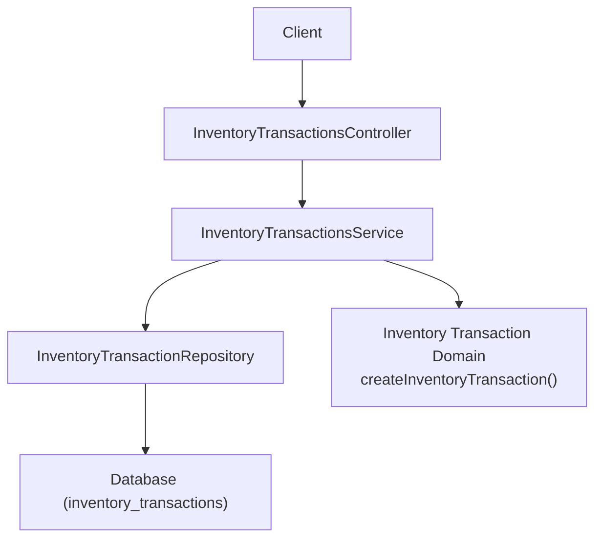
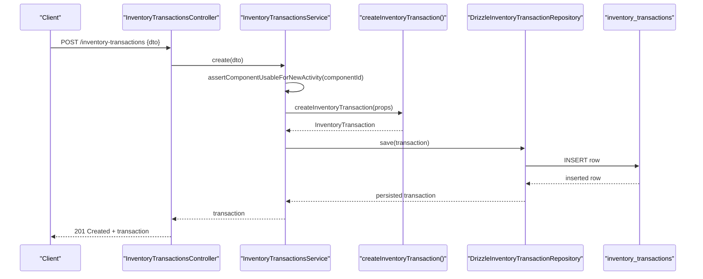
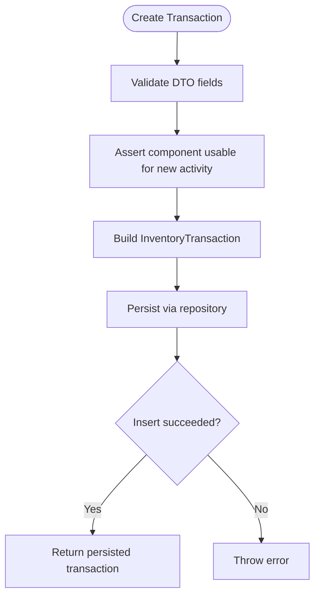
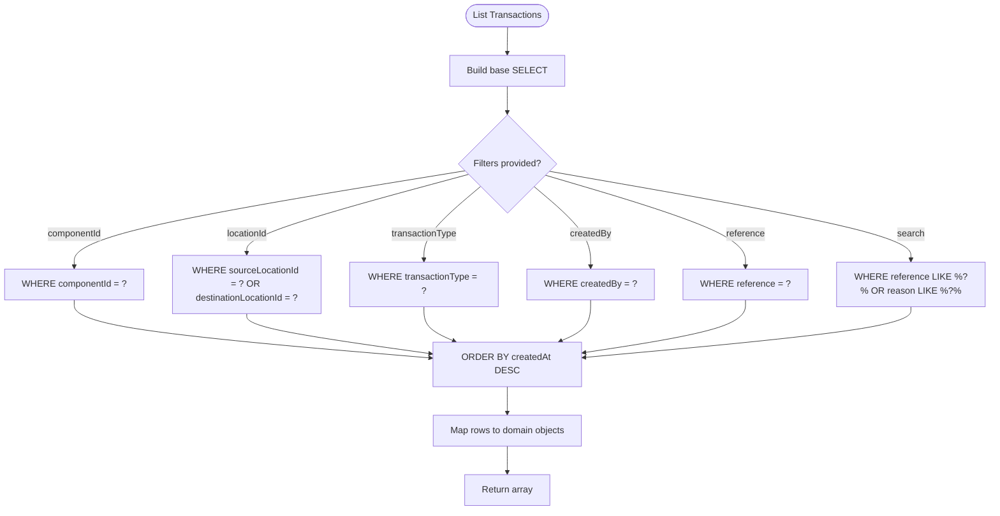
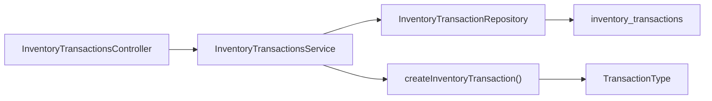

# Inventory Transactions API

<cite>
**Referenced Files in This Document**
- [inventory-transactions.controller.ts](file://apps/api/src/inventory-transactions/inventory-transactions.controller.ts)
- [inventory-transactions.service.ts](file://apps/api/src/inventory-transactions/inventory-transactions.service.ts)
- [create-inventory-transaction.dto.ts](file://apps/api/src/inventory-transactions/create-inventory-transaction.dto.ts)
- [inventory-transactions.module.ts](file://apps/api/src/inventory-transactions/inventory-transactions.module.ts)
- [drizzle-inventory-transaction.repository.ts](file://apps/api/src/infrastructure/repositories/drizzle-inventory-transaction.repository.ts)
- [inventory-transaction.types.ts](file://packages/inventory/src/ledger/inventory-transaction.types.ts)
- [inventory-transaction.repository.ts](file://packages/inventory/src/ledger/inventory-transaction.repository.ts)
- [transaction-types.ts](file://packages/inventory/src/ledger/transaction-types.ts)
- [create-inventory-transaction.ts](file://packages/inventory/src/ledger/create-inventory-transaction.ts)
- [0005-transaction-types.md](file://docs/rfcs/0005-transaction-types.md)
- [0004-inventory-projection.md](file://docs/rfcs/0004-inventory-projection.md)
</cite>

## Table of Contents
1. [Introduction](#introduction)
2. [Project Structure](#project-structure)
3. [Core Components](#core-components)
4. [Architecture Overview](#architecture-overview)
5. [Detailed Component Analysis](#detailed-component-analysis)
6. [Dependency Analysis](#dependency-analysis)
7. [Performance Considerations](#performance-considerations)
8. [Troubleshooting Guide](#troubleshooting-guide)
9. [Conclusion](#conclusion)
10. [Appendices](#appendices)

## Introduction
This document provides detailed API documentation for the Inventory Transactions endpoints. It covers transaction creation, retrieval, and filtering; explains the transaction data model including types, quantities, timestamps, and reference entities; and outlines validation rules, atomicity guarantees, integration with inventory projections, auditing, rollback considerations, and performance guidance for high-volume operations.

## Project Structure
The Inventory Transactions feature is implemented as a NestJS module exposing REST endpoints backed by a service and a repository abstraction. The domain model and transaction types are defined in the shared inventory package.

**Diagram sources**
- [inventory-transactions.controller.ts:14-51](file://apps/api/src/inventory-transactions/inventory-transactions.controller.ts#L14-L51)
- [inventory-transactions.service.ts:19-42](file://apps/api/src/inventory-transactions/inventory-transactions.service.ts#L19-L42)
- [drizzle-inventory-transaction.repository.ts:45-112](file://apps/api/src/infrastructure/repositories/drizzle-inventory-transaction.repository.ts#L45-L112)
- [create-inventory-transaction.ts:4-8](file://packages/inventory/src/ledger/create-inventory-transaction.ts#L4-L8)

**Section sources**
- [inventory-transactions.controller.ts:14-51](file://apps/api/src/inventory-transactions/inventory-transactions.controller.ts#L14-L51)
- [inventory-transactions.module.ts:7-17](file://apps/api/src/inventory-transactions/inventory-transactions.module.ts#L7-L17)

## Core Components
- Controller: Exposes POST /inventory-transactions to create transactions, GET /inventory-transactions to filter and list, and GET /inventory-transactions/:id to retrieve a single transaction.
- Service: Validates component usability before creating transactions, constructs domain objects, and delegates persistence to the repository.
- Repository: Implements database queries for save, find by id, and filtered find-many with ordering by creation time.
- Domain Model: Defines transaction properties, types, and construction helpers.

Key responsibilities:
- Input validation via DTOs and domain constraints.
- Filtering by component, location, type, creator, and search across reference/reason.
- Returning consistent domain models to callers.

**Section sources**
- [inventory-transactions.controller.ts:18-51](file://apps/api/src/inventory-transactions/inventory-transactions.controller.ts#L18-L51)
- [inventory-transactions.service.ts:19-42](file://apps/api/src/inventory-transactions/inventory-transactions.service.ts#L19-L42)
- [drizzle-inventory-transaction.repository.ts:48-112](file://apps/api/src/infrastructure/repositories/drizzle-inventory-transaction.repository.ts#L48-L112)
- [inventory-transaction.types.ts:3-38](file://packages/inventory/src/ledger/inventory-transaction.types.ts#L3-L38)

## Architecture Overview
The API follows a layered architecture:
- Presentation layer (controller) handles HTTP requests and query parameters.
- Application layer (service) enforces business rules and orchestrates use cases.
- Domain layer (inventory package) defines immutable transaction aggregates and canonical types.
- Infrastructure layer (repository) persists transactions using Drizzle ORM.

**Diagram sources**
- [inventory-transactions.controller.ts:18-21](file://apps/api/src/inventory-transactions/inventory-transactions.controller.ts#L18-L21)
- [inventory-transactions.service.ts:19-32](file://apps/api/src/inventory-transactions/inventory-transactions.service.ts#L19-L32)
- [create-inventory-transaction.ts:4-8](file://packages/inventory/src/ledger/create-inventory-transaction.ts#L4-L8)
- [drizzle-inventory-transaction.repository.ts:101-112](file://apps/api/src/infrastructure/repositories/drizzle-inventory-transaction.repository.ts#L101-L112)

## Detailed Component Analysis

### API Endpoints

#### Create Inventory Transaction
- Method: POST
- Path: /inventory-transactions
- Request body: See DTO fields below
- Response: Persisted InventoryTransaction

Validation rules enforced at the API boundary:
- componentId: string, required
- quantity: number, minimum 0.0001
- unitOfMeasure: string, required
- sourceLocationId: optional string
- destinationLocationId: optional string
- transactionType: enum from canonical types
- reference: optional string
- reason: optional string
- createdBy: string, required

Business rule enforcement:
- Before saving, the service asserts that the target component is usable for new activity (e.g., not consolidated or retired).

Example scenarios:
- Stock adjustment: Use transactionType Adjustment with positive or negative quantity and a reason explaining the correction.
- Goods receipt: Use transactionType Receipt with destinationLocationId set to the receiving warehouse/bin and a reference linking to the purchase order or delivery note.

**Section sources**
- [inventory-transactions.controller.ts:18-21](file://apps/api/src/inventory-transactions/inventory-transactions.controller.ts#L18-L21)
- [create-inventory-transaction.dto.ts:4-36](file://apps/api/src/inventory-transactions/create-inventory-transaction.dto.ts#L4-L36)
- [inventory-transactions.service.ts:19-32](file://apps/api/src/inventory-transactions/inventory-transactions.service.ts#L19-L32)

#### List Inventory Transactions
- Method: GET
- Path: /inventory-transactions
- Query parameters:
  - componentId: string (optional)
  - locationId: string (optional; matches either source or destination)
  - transactionType: enum (optional)
  - reference: string (optional; exact match)
  - createdBy: string (optional)
  - search: string (optional; case-insensitive substring match on reference or reason)
- Response: Array of InventoryTransaction, ordered newest first

Filtering behavior:
- locationId filters transactions where the specified location appears as either source or destination.
- search performs substring matching against reference and reason fields.

Example usage:
- Query history for a specific component and type: ?componentId=...&transactionType=Receipt
- Find all movements involving a location: ?locationId=...
- Search by keyword in notes: ?search=PO-1234

**Section sources**
- [inventory-transactions.controller.ts:23-40](file://apps/api/src/inventory-transactions/inventory-transactions.controller.ts#L23-L40)
- [drizzle-inventory-transaction.repository.ts:58-99](file://apps/api/src/infrastructure/repositories/drizzle-inventory-transaction.repository.ts#L58-L99)

#### Get Inventory Transaction by ID
- Method: GET
- Path: /inventory-transactions/:id
- Response: Single InventoryTransaction or 404 Not Found if missing

**Section sources**
- [inventory-transactions.controller.ts:42-51](file://apps/api/src/inventory-transactions/inventory-transactions.controller.ts#L42-L51)

### Data Model

#### InventoryTransaction Properties
- id: string (unique identifier)
- componentId: string (the item being moved or adjusted)
- quantity: number (minimum threshold enforced at API level)
- unitOfMeasure: string (unit associated with the quantity)
- sourceLocationId: string? (origin location for transfers or issues)
- destinationLocationId: string? (destination location for receipts or transfers)
- transactionType: enum (canonical type describing why inventory moved)
- reference: string? (business document or external ID linking to origin)
- reason: string? (human-readable explanation)
- createdBy: string (actor or system that created the transaction)
- createdAt: Date (timestamp of creation)

Notes:
- Timestamps are persisted by the repository mapping and returned to clients.
- Optional fields allow modeling both inbound/outbound and internal movements.

**Section sources**
- [inventory-transaction.types.ts:3-29](file://packages/inventory/src/ledger/inventory-transaction.types.ts#L3-L29)
- [drizzle-inventory-transaction.repository.ts:13-27](file://apps/api/src/infrastructure/repositories/drizzle-inventory-transaction.repository.ts#L13-L27)

#### Transaction Types
Canonical types define the business meaning of inventory movement:
- Receipt: Inventory entering the organization
- Issue: Inventory leaving the organization
- Transfer: Movement between locations without changing total ownership
- Adjustment: Administrative correction outside normal workflows
- Return: Inventory returning from a previous issue
- Consumption: Inventory consumed during a process
- Production: Inventory created by consuming other items
- ManualCorrection: Additional correction type present in implementation
- InitialStock: Initial stock entry

Classification:
- Inbound: Receipt, Return
- Outbound: Issue, Consumption
- Internal: Transfer, Adjustment, Production, ManualCorrection, InitialStock

Guidance:
- Choose the minimal type that captures the business intent.
- Use reference and reason to provide context and auditability.

**Section sources**
- [transaction-types.ts:1-26](file://packages/inventory/src/ledger/transaction-types.ts#L1-L26)
- [0005-transaction-types.md:66-183](file://docs/rfcs/0005-transaction-types.md#L66-L183)

### Processing Logic

#### Creation Flow

**Diagram sources**
- [inventory-transactions.service.ts:19-32](file://apps/api/src/inventory-transactions/inventory-transactions.service.ts#L19-L32)
- [create-inventory-transaction.ts:4-8](file://packages/inventory/src/ledger/create-inventory-transaction.ts#L4-L8)
- [drizzle-inventory-transaction.repository.ts:101-112](file://apps/api/src/infrastructure/repositories/drizzle-inventory-transaction.repository.ts#L101-L112)

**Section sources**
- [inventory-transactions.service.ts:19-32](file://apps/api/src/inventory-transactions/inventory-transactions.service.ts#L19-L32)
- [drizzle-inventory-transaction.repository.ts:101-112](file://apps/api/src/infrastructure/repositories/drizzle-inventory-transaction.repository.ts#L101-L112)

#### Listing and Filtering Flow

**Diagram sources**
- [drizzle-inventory-transaction.repository.ts:58-99](file://apps/api/src/infrastructure/repositories/drizzle-inventory-transaction.repository.ts#L58-L99)

**Section sources**
- [drizzle-inventory-transaction.repository.ts:58-99](file://apps/api/src/infrastructure/repositories/drizzle-inventory-transaction.repository.ts#L58-L99)

### Integration with Inventory Projections
- The ledger records every inventory movement and remains the source of truth.
- Projections represent current inventory position derived deterministically from the ledger.
- Projections are disposable and can be rebuilt at any time without altering history.
- Read queries should use projections for current stock; historical reporting uses the ledger.

Operational implications:
- New transactions update projections incrementally or trigger rebuilds to maintain consistency.
- If projection and ledger disagree, trust the ledger and rebuild projections.

**Section sources**
- [0004-inventory-projection.md:11-18](file://docs/rfcs/0004-inventory-projection.md#L11-L18)
- [0004-inventory-projection.md:31-64](file://docs/rfcs/0004-inventory-projection.md#L31-L64)
- [0004-inventory-projection.md:83-105](file://docs/rfcs/0004-inventory-projection.md#L83-L105)
- [0004-inventory-projection.md:107-149](file://docs/rfcs/0004-inventory-projection.md#L107-L149)

### Validation Rules
- Quantity must be greater than zero (minimum enforced at API layer).
- Transaction type must be one of the canonical types.
- Component must be usable for new activity before accepting inbound or internal adjustments.
- Reference and reason are optional but recommended for traceability.

Error handling:
- Missing or invalid fields result in validation errors from the controller layer.
- Business rule violations (e.g., component unusable) cause request failure before persistence.
- Persistence failures return an error indicating creation failure.

**Section sources**
- [create-inventory-transaction.dto.ts:4-36](file://apps/api/src/inventory-transactions/create-inventory-transaction.dto.ts#L4-L36)
- [inventory-transactions.service.ts:19-32](file://apps/api/src/inventory-transactions/inventory-transactions.service.ts#L19-L32)
- [drizzle-inventory-transaction.repository.ts:101-112](file://apps/api/src/infrastructure/repositories/drizzle-inventory-transaction.repository.ts#L101-L112)

### Atomicity Guarantees
- Each transaction is persisted as a single insert operation.
- The repository returns the inserted row or throws on failure, ensuring clear success/failure semantics.
- For multi-step operations that must be fully committed or fully rolled back, wrap calls in a database transaction at the application boundary.

**Section sources**
- [drizzle-inventory-transaction.repository.ts:101-112](file://apps/api/src/infrastructure/repositories/drizzle-inventory-transaction.repository.ts#L101-L112)

### Auditing and Rollback
- Auditing:
  - Every transaction includes createdBy and createdAt for audit trails.
  - Reference and reason fields support traceability to business documents and explanations.
- Rollback:
  - Transactions are immutable after creation per design principles.
  - To correct mistakes, record a compensating transaction (e.g., Adjustment or Return) rather than modifying existing entries.
  - Rebuild projections from the ledger to ensure derived state reflects corrections.

**Section sources**
- [inventory-transaction.types.ts:3-29](file://packages/inventory/src/ledger/inventory-transaction.types.ts#L3-L29)
- [0005-transaction-types.md:58-63](file://docs/rfcs/0005-transaction-types.md#L58-L63)
- [0004-inventory-projection.md:93-105](file://docs/rfcs/0004-inventory-projection.md#L93-L105)

### Performance Considerations
- Use projections for read-heavy queries such as current stock or inventory by location.
- Avoid scanning the full ledger for frequent reads; rely on projections for performance.
- Leverage filtering options to narrow results and reduce payload size.
- For high-volume ingestion:
  - Batch multiple logical operations within a single database transaction when possible.
  - Ensure indexes exist on frequently filtered columns (componentId, locationId, transactionType, createdBy).
  - Monitor query plans for search patterns using LIKE to avoid full table scans where possible.

**Section sources**
- [0004-inventory-projection.md:21-27](file://docs/rfcs/0004-inventory-projection.md#L21-L27)
- [0004-inventory-projection.md:107-119](file://docs/rfcs/0004-inventory-projection.md#L107-L119)
- [drizzle-inventory-transaction.repository.ts:58-99](file://apps/api/src/infrastructure/repositories/drizzle-inventory-transaction.repository.ts#L58-L99)

## Dependency Analysis

**Diagram sources**
- [inventory-transactions.controller.ts:14-51](file://apps/api/src/inventory-transactions/inventory-transactions.controller.ts#L14-L51)
- [inventory-transactions.service.ts:19-42](file://apps/api/src/inventory-transactions/inventory-transactions.service.ts#L19-L42)
- [drizzle-inventory-transaction.repository.ts:45-112](file://apps/api/src/infrastructure/repositories/drizzle-inventory-transaction.repository.ts#L45-L112)
- [transaction-types.ts:1-26](file://packages/inventory/src/ledger/transaction-types.ts#L1-L26)

**Section sources**
- [inventory-transactions.module.ts:7-17](file://apps/api/src/inventory-transactions/inventory-transactions.module.ts#L7-L17)
- [inventory-transaction.repository.ts:4-10](file://packages/inventory/src/ledger/inventory-transaction.repository.ts#L4-L10)

## Performance Considerations
- Prefer querying projections for current inventory to minimize latency.
- Use targeted filters to reduce result sets.
- For bulk imports, consider batching inserts within transactions and deferring non-critical side effects.
- Monitor slow queries and add appropriate indexes on filtered fields.

[No sources needed since this section provides general guidance]

## Troubleshooting Guide
Common issues and resolutions:
- Validation errors:
  - Ensure quantity meets minimum thresholds and transactionType is valid.
  - Confirm required fields like componentId, unitOfMeasure, and createdBy are present.
- Component unusable:
  - If the component has been consolidated or retired, new transactions will be rejected. Resolve by targeting the surviving component or correcting upstream processes.
- Not found:
  - Retrieving a transaction by ID returns 404 when the ID does not exist. Verify IDs and access permissions.
- Projection inconsistencies:
  - If projections do not reflect recent changes, trigger a rebuild from the ledger to restore consistency.

**Section sources**
- [create-inventory-transaction.dto.ts:4-36](file://apps/api/src/inventory-transactions/create-inventory-transaction.dto.ts#L4-L36)
- [inventory-transactions.controller.ts:42-51](file://apps/api/src/inventory-transactions/inventory-transactions.controller.ts#L42-L51)
- [inventory-transactions.service.ts:19-32](file://apps/api/src/inventory-transactions/inventory-transactions.service.ts#L19-L32)
- [0004-inventory-projection.md:93-105](file://docs/rfcs/0004-inventory-projection.md#L93-L105)

## Conclusion
The Inventory Transactions API provides a robust, auditable foundation for recording inventory movements with clear separation between immutable history (ledger) and efficient read models (projections). By adhering to canonical transaction types, enforcing validation and business rules, and leveraging projections for reads, the system supports accurate reporting, scalable performance, and reliable reconciliation.

[No sources needed since this section summarizes without analyzing specific files]

## Appendices

### Example Workflows

#### Creating a Stock Adjustment
- Use transactionType Adjustment.
- Provide quantity (positive to increase, negative to decrease), unitOfMeasure, and a reason explaining the correction.
- Optionally include reference to link to an internal ticket or count sheet.

**Section sources**
- [create-inventory-transaction.dto.ts:4-36](file://apps/api/src/inventory-transactions/create-inventory-transaction.dto.ts#L4-L36)
- [0005-transaction-types.md:102-110](file://docs/rfcs/0005-transaction-types.md#L102-L110)

#### Recording a Goods Receipt
- Use transactionType Receipt.
- Set destinationLocationId to the receiving location.
- Include reference to the purchase order or delivery document.

**Section sources**
- [create-inventory-transaction.dto.ts:4-36](file://apps/api/src/inventory-transactions/create-inventory-transaction.dto.ts#L4-L36)
- [0005-transaction-types.md:68-79](file://docs/rfcs/0005-transaction-types.md#L68-L79)

#### Querying Transaction History
- Filter by componentId and/or transactionType to narrow results.
- Use locationId to find movements involving a specific location.
- Use search to locate transactions by keywords in reference or reason.

**Section sources**
- [inventory-transactions.controller.ts:23-40](file://apps/api/src/inventory-transactions/inventory-transactions.controller.ts#L23-L40)
- [drizzle-inventory-transaction.repository.ts:58-99](file://apps/api/src/infrastructure/repositories/drizzle-inventory-transaction.repository.ts#L58-L99)