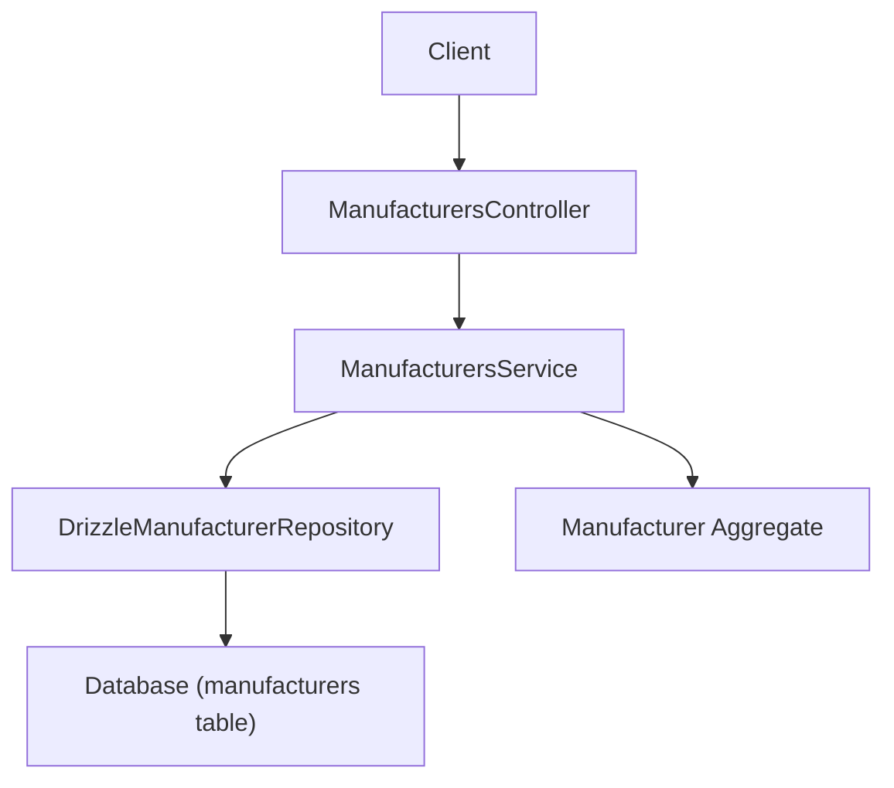
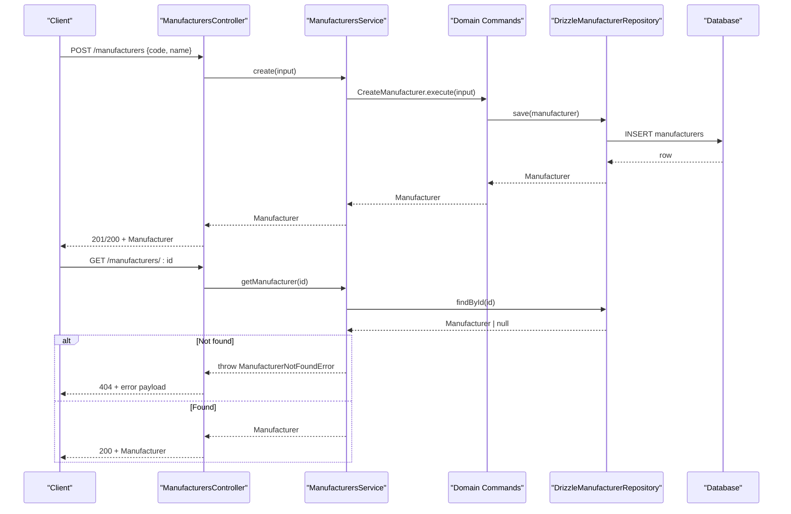
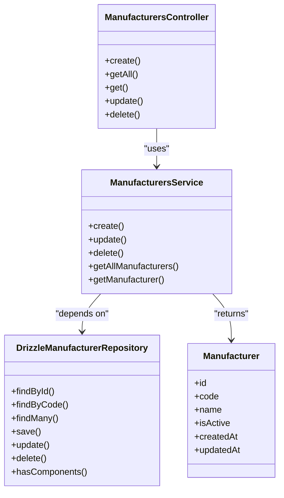

# Manufacturers API

<cite>
**Referenced Files in This Document**
- [manufacturers.controller.ts](file://apps/api/src/manufacturers/manufacturers.controller.ts)
- [manufacturers.service.ts](file://apps/api/src/manufacturers/manufacturers.service.ts)
- [create-manufacturer.dto.ts](file://apps/api/src/manufacturers/create-manufacturer.dto.ts)
- [update-manufacturer.dto.ts](file://apps/api/src/manufacturers/update-manufacturer.dto.ts)
- [manufacturer-exception.filter.ts](file://apps/api/src/manufacturers/manufacturer-exception.filter.ts)
- [manufacturers.module.ts](file://apps/api/src/manufacturers/manufacturers.module.ts)
- [drizzle-manufacturer.repository.ts](file://apps/api/src/infrastructure/repositories/drizzle-manufacturer.repository.ts)
- [manufacturer.ts](file://packages/inventory/src/manufacturers/manufacturer.ts)
- [manufacturer.errors.ts](file://packages/inventory/src/manufacturers/manufacturer.errors.ts)
- [manufacturer.repository.ts](file://packages/inventory/src/manufacturers/manufacturer.repository.ts)
- [manufacturers.ts](file://packages/database/src/schema/manufacturers.ts)
</cite>

## Table of Contents
1. Introduction
2. Project Structure
3. Core Components
4. Architecture Overview
5. Detailed Component Analysis
6. Dependency Analysis
7. Performance Considerations
8. Troubleshooting Guide
9. Conclusion

## Introduction
This document provides detailed API documentation for manufacturer management endpoints. It covers CRUD operations (create, read, update, delete), the manufacturer data model, validation rules, error handling, status management, and integration points with repositories and domain logic. The goal is to enable developers to integrate with the manufacturers API confidently and understand how requests are processed end-to-end.

## Project Structure
The manufacturers feature follows a layered architecture:
- Controller layer exposes HTTP endpoints under /manufacturers.
- Service layer orchestrates use cases using domain commands and repository abstractions.
- Repository layer persists data via Drizzle ORM against the database schema.
- Domain layer defines the Manufacturer aggregate, input types, and errors.
- Module wires controllers, services, and repository providers.

**Diagram sources**
- [manufacturers.controller.ts:17-48](file://apps/api/src/manufacturers/manufacturers.controller.ts#L17-L48)
- [manufacturers.service.ts:14-52](file://apps/api/src/manufacturers/manufacturers.service.ts#L14-L52)
- [drizzle-manufacturer.repository.ts:29-103](file://apps/api/src/infrastructure/repositories/drizzle-manufacturer.repository.ts#L29-L103)
- [manufacturer.ts:27-58](file://packages/inventory/src/manufacturers/manufacturer.ts#L27-L58)

**Section sources**
- [manufacturers.controller.ts:17-48](file://apps/api/src/manufacturers/manufacturers.controller.ts#L17-L48)
- [manufacturers.module.ts:7-18](file://apps/api/src/manufacturers/manufacturers.module.ts#L7-L18)

## Core Components
- ManufacturersController: Exposes REST endpoints for create, list, get by id, update, and delete.
- ManufacturersService: Delegates to domain commands (CreateManufacturer, UpdateManufacturer, DeleteManufacturer) and repository methods.
- DTOs: CreateManufacturerDto and UpdateManufacturerDto define request payloads and validation constraints.
- Exception Filter: Maps domain/repository exceptions to standardized HTTP responses.
- Repository: Implements persistence using Drizzle ORM and maps between domain objects and rows.
- Domain Model: Manufacturer aggregate enforces invariants and normalizes inputs.

Key responsibilities:
- Input validation at the controller boundary (DTO decorators).
- Business rule enforcement in domain commands and aggregate.
- Consistent error mapping to HTTP status codes.
- Data persistence and retrieval through repository abstraction.

**Section sources**
- [manufacturers.controller.ts:17-48](file://apps/api/src/manufacturers/manufacturers.controller.ts#L17-L48)
- [manufacturers.service.ts:14-52](file://apps/api/src/manufacturers/manufacturers.service.ts#L14-L52)
- [create-manufacturer.dto.ts:1-14](file://apps/api/src/manufacturers/create-manufacturer.dto.ts#L1-L14)
- [update-manufacturer.dto.ts:1-16](file://apps/api/src/manufacturers/update-manufacturer.dto.ts#L1-L16)
- [manufacturer-exception.filter.ts:16-53](file://apps/api/src/manufacturers/manufacturer-exception.filter.ts#L16-L53)
- [drizzle-manufacturer.repository.ts:29-103](file://apps/api/src/infrastructure/repositories/drizzle-manufacturer.repository.ts#L29-L103)
- [manufacturer.ts:27-58](file://packages/inventory/src/manufacturers/manufacturer.ts#L27-L58)

## Architecture Overview
End-to-end flow for manufacturer operations:
- Request enters the controller, validated by DTO decorators.
- Controller delegates to service methods.
- Service executes domain commands that enforce business rules and call repository methods.
- Repository persists or retrieves data from the database and returns domain objects.
- Exceptions are caught by the exception filter and converted to HTTP responses.

**Diagram sources**
- [manufacturers.controller.ts:22-48](file://apps/api/src/manufacturers/manufacturers.controller.ts#L22-L48)
- [manufacturers.service.ts:29-51](file://apps/api/src/manufacturers/manufacturers.service.ts#L29-L51)
- [drizzle-manufacturer.repository.ts:59-89](file://apps/api/src/infrastructure/repositories/drizzle-manufacturer.repository.ts#L59-L89)
- [manufacturer-exception.filter.ts:31-46](file://apps/api/src/manufacturers/manufacturer-exception.filter.ts#L31-L46)

## Detailed Component Analysis

### API Endpoints
Base path: /manufacturers

- Create Manufacturer
  - Method: POST
  - Path: /manufacturers
  - Request body: CreateManufacturerDto
  - Success response: Manufacturer object
  - Validation: code required, string, max length; name required, string, max length
  - Errors: Conflict if code already exists; Bad Request on invalid input

- List Manufacturers
  - Method: GET
  - Path: /manufacturers
  - Response: Array of Manufacturer objects

- Get Manufacturer by ID
  - Method: GET
  - Path: /manufacturers/:id
  - Response: Manufacturer object
  - Errors: Not Found if manufacturer does not exist

- Update Manufacturer
  - Method: PUT
  - Path: /manufacturers/:id
  - Request body: UpdateManufacturerDto (all fields optional)
  - Response: Updated Manufacturer object
  - Errors: Bad Request on invalid input; Not Found if not present

- Delete Manufacturer
  - Method: DELETE
  - Path: /manufacturers/:id
  - Response: No content on success
  - Errors: Bad Request if referenced by components; Not Found if not present

Notes:
- All endpoints are protected by the module’s exception filter which maps domain errors to HTTP status codes.
- Status management is supported via the isActive field in updates.

**Section sources**
- [manufacturers.controller.ts:17-48](file://apps/api/src/manufacturers/manufacturers.controller.ts#L17-L48)
- [create-manufacturer.dto.ts:1-14](file://apps/api/src/manufacturers/create-manufacturer.dto.ts#L1-L14)
- [update-manufacturer.dto.ts:1-16](file://apps/api/src/manufacturers/update-manufacturer.dto.ts#L1-L16)
- [manufacturer-exception.filter.ts:16-53](file://apps/api/src/manufacturers/manufacturer-exception.filter.ts#L16-L53)

### Data Model
Manufacturer entity fields:
- id: unique identifier
- code: unique, normalized uppercase string used as a stable key
- name: human-readable name
- isActive: boolean flag indicating active status
- createdAt: timestamp when created
- updatedAt: timestamp when last updated

Constraints and indexes:
- code is unique and indexed for fast lookups
- isActive defaults to true
- timestamps default to current time

Relationships:
- A manufacturer can be referenced by components; deletion is blocked if references exist.

**Section sources**
- [manufacturer.ts:7-25](file://packages/inventory/src/manufacturers/manufacturer.ts#L7-L25)
- [manufacturer.ts:27-58](file://packages/inventory/src/manufacturers/manufacturer.ts#L27-L58)
- [manufacturers.ts:11-39](file://packages/database/src/schema/manufacturers.ts#L11-L39)
- [drizzle-manufacturer.repository.ts:95-103](file://apps/api/src/infrastructure/repositories/drizzle-manufacturer.repository.ts#L95-L103)

### Validation Rules
Request-level validation (DTOs):
- CreateManufacturerDto
  - code: string, required, max length
  - name: string, required, max length
- UpdateManufacturerDto
  - code: optional string
  - name: optional string
  - isActive: optional boolean

Domain-level validation (aggregate):
- code must be non-empty after trimming and normalization
- name must be non-empty after trimming
- Errors thrown for invalid inputs

**Section sources**
- [create-manufacturer.dto.ts:1-14](file://apps/api/src/manufacturers/create-manufacturer.dto.ts#L1-L14)
- [update-manufacturer.dto.ts:1-16](file://apps/api/src/manufacturers/update-manufacturer.dto.ts#L1-L16)
- [manufacturer.ts:48-58](file://packages/inventory/src/manufacturers/manufacturer.ts#L48-L58)
- [manufacturer.errors.ts:1-20](file://packages/inventory/src/manufacturers/manufacturer.errors.ts#L1-L20)

### Error Handling
Exception filter maps domain errors to HTTP responses:
- ManufacturerCodeAlreadyExistsError -> 409 Conflict
- ManufacturerNotFoundError -> 404 Not Found
- ManufacturerReferencedByComponentsError -> 400 Bad Request
- InvalidManufacturerCodeError -> 400 Bad Request
- InvalidManufacturerNameError -> 400 Bad Request

Response shape includes statusCode, error type, and message.

**Section sources**
- [manufacturer-exception.filter.ts:16-53](file://apps/api/src/manufacturers/manufacturer-exception.filter.ts#L16-L53)

### Status Management
- isActive field controls whether a manufacturer is considered active.
- Updates can toggle isActive without changing identity fields.
- Active status influences sorting and selection in other modules (e.g., component consolidation preview).

**Section sources**
- [update-manufacturer.dto.ts:12-15](file://apps/api/src/manufacturers/update-manufacturer.dto.ts#L12-L15)
- [manufacturer.ts:11-13](file://packages/inventory/src/manufacturers/manufacturer.ts#L11-L13)
- [drizzle-manufacturer.repository.ts:72-89](file://apps/api/src/infrastructure/repositories/drizzle-manufacturer.repository.ts#L72-L89)

### Audit Logging
- There is no explicit audit logging implementation in the manufacturer endpoints shown here.
- Timestamps (createdAt, updatedAt) are persisted and can be used for basic change tracking.
- For full audit trails, consider integrating an audit log service or middleware around write operations.

[No sources needed since this section provides general guidance]

### Search and Retrieval
- List all manufacturers: GET /manufacturers returns all records ordered by code.
- Retrieve by ID: GET /manufacturers/:id returns a single record or 404.
- Additional search capabilities (e.g., filtering by name or status) are not exposed in the current controller; they can be added by extending the service and repository.

**Section sources**
- [manufacturers.controller.ts:27-35](file://apps/api/src/manufacturers/manufacturers.controller.ts#L27-L35)
- [drizzle-manufacturer.repository.ts:50-57](file://apps/api/src/infrastructure/repositories/drizzle-manufacturer.repository.ts#L50-L57)

## Dependency Analysis
Component relationships:
- Controller depends on Service and ExceptionFilter.
- Service depends on domain commands and repository injection token.
- Repository implements ManufacturerRepository interface and uses Drizzle ORM.
- Domain aggregate enforces invariants and produces errors.

**Diagram sources**
- [manufacturers.controller.ts:17-48](file://apps/api/src/manufacturers/manufacturers.controller.ts#L17-L48)
- [manufacturers.service.ts:14-52](file://apps/api/src/manufacturers/manufacturers.service.ts#L14-L52)
- [drizzle-manufacturer.repository.ts:29-103](file://apps/api/src/infrastructure/repositories/drizzle-manufacturer.repository.ts#L29-L103)
- [manufacturer.ts:27-58](file://packages/inventory/src/manufacturers/manufacturer.ts#L27-L58)

**Section sources**
- [manufacturers.module.ts:7-18](file://apps/api/src/manufacturers/manufacturers.module.ts#L7-L18)
- [manufacturer.repository.ts:5-13](file://packages/inventory/src/manufacturers/manufacturer.repository.ts#L5-L13)

## Performance Considerations
- Unique index on code improves lookup performance for duplicate checks and queries by code.
- Listing all manufacturers orders by code; consider pagination for large datasets.
- Avoid unnecessary joins; repository methods are focused and minimal.
- Use isActive for logical filtering in client-side lists to reduce server load.

[No sources needed since this section provides general guidance]

## Troubleshooting Guide
Common issues and resolutions:
- 409 Conflict on create: Indicates duplicate manufacturer code. Ensure code uniqueness before submission.
- 404 Not Found on get/update/delete: Manufacturer ID does not exist. Verify ID and existence.
- 400 Bad Request on update/delete: Invalid input or manufacturer referenced by components. Check payload and dependencies.
- Validation errors: Ensure code and name meet DTO constraints (required strings, max lengths).

Diagnostic tips:
- Inspect the error response payload for message details.
- Confirm repository operations succeed and map correctly to domain objects.
- Validate domain invariants in the Manufacturer aggregate.

**Section sources**
- [manufacturer-exception.filter.ts:31-46](file://apps/api/src/manufacturers/manufacturer-exception.filter.ts#L31-L46)
- [manufacturers.service.ts:45-51](file://apps/api/src/manufacturers/manufacturers.service.ts#L45-L51)
- [drizzle-manufacturer.repository.ts:95-103](file://apps/api/src/infrastructure/repositories/drizzle-manufacturer.repository.ts#L95-L103)

## Conclusion
The Manufacturers API provides a clean, layered implementation for managing manufacturer master data. It enforces strong validation and business rules, maps errors consistently to HTTP responses, and supports status management via isActive. While additional search features and audit logging are not present in the current scope, the modular design allows straightforward extension. Developers should leverage the provided endpoints and error conventions for reliable integration.

[No sources needed since this section summarizes without analyzing specific files]