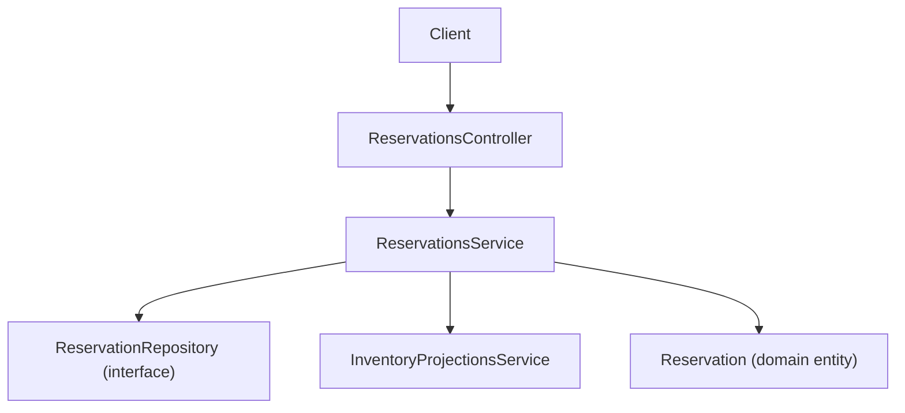
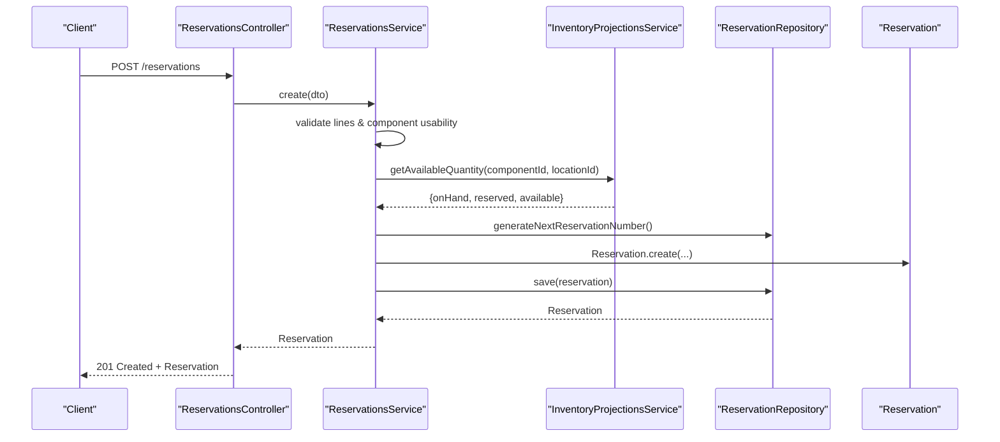
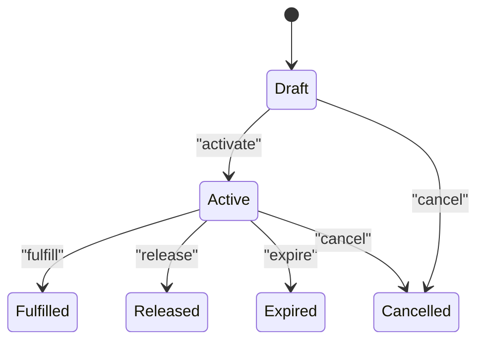
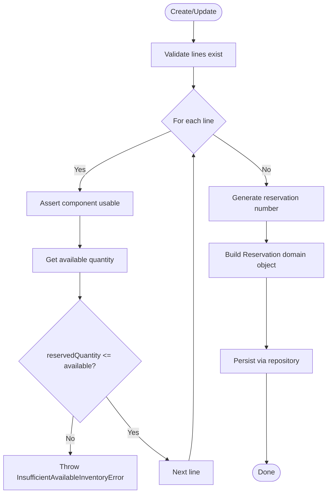
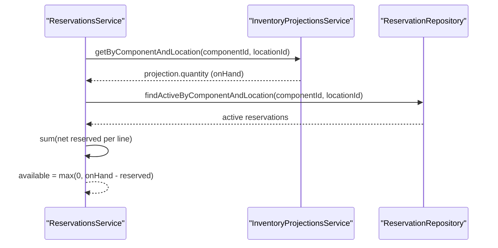
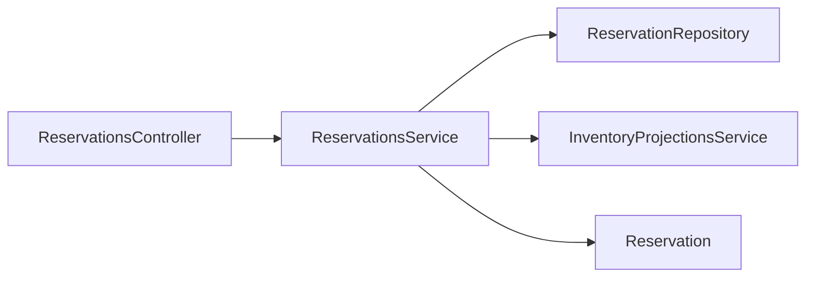

# Reservations API

<cite>
**Referenced Files in This Document**
- [reservations.controller.ts](file://apps/api/src/reservations/reservations.controller.ts)
- [reservations.service.ts](file://apps/api/src/reservations/reservations.service.ts)
- [dtos.ts](file://apps/api/src/reservations/dtos.ts)
- [create-reservation.dto.ts](file://apps/api/src/reservations/create-reservation.dto.ts)
- [reservation.ts](file://packages/inventory/src/reservations/reservation.ts)
- [reservation.types.ts](file://packages/inventory/src/reservations/reservation.types.ts)
- [reservation.repository.ts](file://packages/inventory/src/reservations/reservation.repository.ts)
</cite>

## Table of Contents
1. [Introduction](#introduction)
2. [Project Structure](#project-structure)
3. [Core Components](#core-components)
4. [Architecture Overview](#architecture-overview)
5. [Detailed Component Analysis](#detailed-component-analysis)
6. [Dependency Analysis](#dependency-analysis)
7. [Performance Considerations](#performance-considerations)
8. [Troubleshooting Guide](#troubleshooting-guide)
9. [Conclusion](#conclusion)

## Introduction
This document provides comprehensive API documentation for the Reservations feature. It covers CRUD operations, lifecycle transitions, validation rules, concurrency considerations, and integration with inventory availability calculations. The goal is to enable clients to create, update, fulfill, release, cancel, and delete reservations while ensuring data integrity and predictable behavior across sales orders, production, and other demand sources.

## Project Structure
The Reservations API is implemented as a NestJS module with:
- A controller exposing REST endpoints
- A service implementing business logic and validation
- DTOs defining request payloads
- An inventory domain model (Reservation entity and types)
- A repository interface for persistence

**Diagram sources**
- [reservations.controller.ts:17-83](file://apps/api/src/reservations/reservations.controller.ts#L17-L83)
- [reservations.service.ts:19-25](file://apps/api/src/reservations/reservations.service.ts#L19-L25)
- [reservation.repository.ts:13-26](file://packages/inventory/src/reservations/reservation.repository.ts#L13-L26)
- [reservation.ts:16-41](file://packages/inventory/src/reservations/reservation.ts#L16-L41)

**Section sources**
- [reservations.controller.ts:17-83](file://apps/api/src/reservations/reservations.controller.ts#L17-L83)
- [reservations.service.ts:19-25](file://apps/api/src/reservations/reservations.service.ts#L19-L25)

## Core Components
- ReservationsController: Exposes REST endpoints for reservation management.
- ReservationsService: Implements creation, updates, fulfillment, release, cancellation, deletion, listing, and available quantity calculation.
- DTOs: Define request shapes for creating and updating reservations.
- Reservation Entity: Encapsulates state machine, line items, and business rules.
- Repository Interface: Defines persistence operations and queries.

Key responsibilities:
- Validate inputs and enforce over-reservation checks.
- Manage reservation lifecycle states.
- Integrate with inventory projections to compute available quantities.
- Provide filtering and search capabilities.

**Section sources**
- [reservations.controller.ts:17-83](file://apps/api/src/reservations/reservations.controller.ts#L17-L83)
- [reservations.service.ts:27-209](file://apps/api/src/reservations/reservations.service.ts#L27-L209)
- [dtos.ts:12-91](file://apps/api/src/reservations/dtos.ts#L12-L91)
- [reservation.ts:16-213](file://packages/inventory/src/reservations/reservation.ts#L16-L213)
- [reservation.repository.ts:13-26](file://packages/inventory/src/reservations/reservation.repository.ts#L13-L26)

## Architecture Overview
The API follows a layered architecture:
- Controller layer handles HTTP requests and parameter binding.
- Service layer enforces business rules, performs validations, and coordinates domain objects.
- Inventory projections provide real-time on-hand and reserved quantities.
- Repository interface abstracts persistence details.

**Diagram sources**
- [reservations.controller.ts:22-25](file://apps/api/src/reservations/reservations.controller.ts#L22-L25)
- [reservations.service.ts:27-70](file://apps/api/src/reservations/reservations.service.ts#L27-L70)
- [reservation.ts:47-72](file://packages/inventory/src/reservations/reservation.ts#L47-L72)
- [reservation.repository.ts:13-26](file://packages/inventory/src/reservations/reservation.repository.ts#L13-L26)

## Detailed Component Analysis

### API Endpoints
Base path: /reservations

- Create reservation
  - Method: POST
  - Path: /reservations
  - Request body: CreateReservationDto
  - Response: Reservation object
  - Notes: Validates at least one line; checks component usability; validates against available inventory; generates reservation number; sets initial status to Active.

- List reservations
  - Method: GET
  - Path: /reservations
  - Query parameters:
    - componentId: string (optional)
    - locationId: string (optional)
    - reservationType: enum (optional)
    - status: enum (optional)
    - referenceDocument: string (optional)
    - search: string (optional)
  - Response: Array of Reservation objects

- Get available quantity
  - Method: GET
  - Path: /reservations/available
  - Query parameters:
    - componentId: string (required)
    - locationId: string (required)
  - Response: { onHand: number, reserved: number, available: number }

- Get reservation by ID
  - Method: GET
  - Path: /reservations/:id
  - Response: Reservation object

- Update reservation
  - Method: PUT
  - Path: /reservations/:id
  - Request body: UpdateReservationDto
  - Response: Reservation object
  - Notes: Only allowed when status is Active or Draft; re-validates lines and available inventory.

- Fulfill reservation
  - Method: POST
  - Path: /reservations/:id/fulfill
  - Response: Reservation object
  - Notes: Transitions from Active to Fulfilled.

- Release reservation
  - Method: POST
  - Path: /reservations/:id/release
  - Response: Reservation object
  - Notes: Transitions from Active to Released.

- Cancel reservation
  - Method: POST
  - Path: /reservations/:id/cancel
  - Response: Reservation object
  - Notes: Prevents cancellation if already Fulfilled, Released, or Cancelled.

- Delete reservation
  - Method: DELETE
  - Path: /reservations/:id
  - Response: 204 No Content
  - Notes: Disallows deletion if status is Fulfilled or Released.

**Section sources**
- [reservations.controller.ts:17-83](file://apps/api/src/reservations/reservations.controller.ts#L17-L83)

### Data Model
Reservation header fields:
- id: string
- reservationNumber: string
- reservationType: enum ("WORK_ORDER" | "PROJECT" | "PURCHASE_REQUEST" | "SALES_ORDER")
- referenceDocument: string | null
- reservedBy: string
- notes: string | null
- status: enum ("DRAFT" | "ACTIVE" | "FULFILLED" | "RELEASED" | "EXPIRED" | "CANCELLED")
- createdAt: Date
- updatedAt: Date
- expiresAt: Date | null

Reservation line fields:
- id: string
- reservationId: string
- componentId: string
- locationId: string
- reservedQuantity: number
- fulfilledQuantity: number
- unitOfMeasure: string (default "pcs")
- notes: string | null
- createdAt: Date
- updatedAt: Date

Request DTOs:
- CreateReservationDto: includes reservationType, referenceDocument, reservedBy, notes, expiresAt, and optional lines array.
- UpdateReservationDto: same fields as CreateReservationDto but all optional.
- ReservationLineInputDto: componentId, locationId, reservedQuantity, unitOfMeasure, notes.
- Legacy single-line CreateReservationDto: componentId, locationId, quantity, unitOfMeasure, reference, reservedBy, expiresAt.

Validation rules:
- Lines must be present and non-empty for creation.
- Each line’s reservedQuantity must be greater than zero.
- reservedQuantity cannot exceed available inventory for that component/location.
- Component must be usable for new activities (not retired).
- Updates only allowed for Active or Draft statuses.
- Deletion disallowed for Fulfilled or Released statuses.

Concurrency control:
- Over-reservation check performed per line before persisting.
- Available quantity computed using inventory projections plus active reservations.
- Status transitions enforced by domain entity methods.

Audit requirements:
- Timestamps created and updated are maintained.
- ReservedBy captures the actor responsible for the reservation.
- ReferenceDocument links the reservation to an external document (e.g., sales order).

Lifecycle states and transitions:
- Draft -> Active (activate)
- Active -> Fulfilled (fulfill)
- Active -> Released (release)
- Active -> Expired (expire)
- Active/Draft -> Cancelled (cancel), except when already Fulfilled/Released/Cancelled

**Diagram sources**
- [reservation.ts:162-212](file://packages/inventory/src/reservations/reservation.ts#L162-L212)

**Section sources**
- [reservation.types.ts:1-56](file://packages/inventory/src/reservations/reservation.types.ts#L1-L56)
- [reservation.ts:16-213](file://packages/inventory/src/reservations/reservation.ts#L16-L213)
- [dtos.ts:12-91](file://apps/api/src/reservations/dtos.ts#L12-L91)
- [create-reservation.dto.ts:9-33](file://apps/api/src/reservations/create-reservation.dto.ts#L9-L33)

### Business Logic and Validation Flow
Creation flow:
- Validate presence of lines.
- For each line:
  - Assert component usability.
  - Compute available quantity via inventory projections and active reservations.
  - Reject if reservedQuantity exceeds available.
- Generate next reservation number.
- Build Reservation domain object with Active status.
- Persist via repository.

Update flow:
- Load reservation; reject if not Active or Draft.
- Update header fields.
- If lines provided:
  - Re-validate component usability and available inventory for each line.
  - Replace existing lines with validated ones.
- Persist changes.

Available quantity calculation:
- Retrieve projection for component/location.
- Sum active reservations’ net reserved quantities for the same component/location.
- Compute available = max(0, onHand - reserved).

**Diagram sources**
- [reservations.service.ts:27-70](file://apps/api/src/reservations/reservations.service.ts#L27-L70)
- [reservations.service.ts:73-118](file://apps/api/src/reservations/reservations.service.ts#L73-L118)
- [reservations.service.ts:177-209](file://apps/api/src/reservations/reservations.service.ts#L177-L209)

**Section sources**
- [reservations.service.ts:27-209](file://apps/api/src/reservations/reservations.service.ts#L27-L209)

### Integration with Inventory Availability
- Uses InventoryProjectionsService to obtain on-hand quantities per component/location.
- Aggregates active reservations to compute total reserved quantities.
- Ensures no over-allocation by comparing requested reservedQuantity against available.

**Diagram sources**
- [reservations.service.ts:177-209](file://apps/api/src/reservations/reservations.service.ts#L177-L209)
- [reservation.repository.ts:13-26](file://packages/inventory/src/reservations/reservation.repository.ts#L13-L26)

**Section sources**
- [reservations.service.ts:177-209](file://apps/api/src/reservations/reservations.service.ts#L177-L209)

### Examples

- Creating reservations for sales orders
  - Use POST /reservations with reservationType set to SALES_ORDER.
  - Include lines referencing components and locations required to fulfill the sales order.
  - Ensure reservedQuantity does not exceed available inventory.

- Reserving inventory for production
  - Use POST /reservations with reservationType set to WORK_ORDER.
  - Add lines for raw materials/components needed by the work order.
  - Optionally set expiresAt to align with production planning windows.

- Handling reservation conflicts
  - If multiple clients attempt to reserve the same component/location concurrently, the first successful request will reduce available inventory.
  - Subsequent requests exceeding available inventory will fail with an insufficient inventory error.
  - Clients should retry with reduced quantities or wait for expiration/release.

[No sources needed since this section provides conceptual examples without quoting code]

## Dependency Analysis
- Controller depends on ReservationsService for all operations.
- Service depends on:
  - ReservationRepository for persistence and queries.
  - InventoryProjectionsService for availability calculations.
  - Reservation domain entity for state transitions and business rules.
- Repository interface defines contracts for finding, saving, deleting, and generating IDs.

**Diagram sources**
- [reservations.controller.ts:17-83](file://apps/api/src/reservations/reservations.controller.ts#L17-L83)
- [reservations.service.ts:19-25](file://apps/api/src/reservations/reservations.service.ts#L19-L25)
- [reservation.repository.ts:13-26](file://packages/inventory/src/reservations/reservation.repository.ts#L13-L26)
- [reservation.ts:16-41](file://packages/inventory/src/reservations/reservation.ts#L16-L41)

**Section sources**
- [reservations.controller.ts:17-83](file://apps/api/src/reservations/reservations.controller.ts#L17-L83)
- [reservations.service.ts:19-25](file://apps/api/src/reservations/reservations.service.ts#L19-L25)

## Performance Considerations
- Avoid excessive repeated calls to available quantity; cache results where appropriate at the client side.
- Batch line validations to minimize round-trips to inventory projections.
- Use filtering query parameters to limit result sets when listing reservations.
- Prefer targeted updates (header-only vs full line replacement) to reduce write amplification.

[No sources needed since this section provides general guidance]

## Troubleshooting Guide
Common errors and resolutions:
- Missing or empty lines during creation:
  - Ensure at least one line item is included in the request payload.
- Insufficient available inventory:
  - Verify current available quantity via GET /reservations/available.
  - Reduce reservedQuantity or wait for other reservations to expire/release.
- Updating a non-mutable reservation:
  - Only Active or Draft reservations can be edited.
- Deleting completed or released reservations:
  - Deletion is blocked for Fulfilled or Released statuses.
- Invalid status transitions:
  - Follow allowed transitions defined by the domain entity.

Operational tips:
- Use referenceDocument to trace back to originating documents (sales orders, work orders).
- Monitor expiresAt to proactively manage expiring reservations.
- Audit logs should capture reservedBy and timestamps for compliance.

**Section sources**
- [reservations.service.ts:27-118](file://apps/api/src/reservations/reservations.service.ts#L27-L118)
- [reservations.service.ts:146-175](file://apps/api/src/reservations/reservations.service.ts#L146-L175)
- [reservation.ts:162-212](file://packages/inventory/src/reservations/reservation.ts#L162-L212)

## Conclusion
The Reservations API provides robust support for managing inventory commitments across sales and production workflows. It enforces strict validation, integrates with inventory projections to prevent over-allocation, and offers clear lifecycle management through well-defined state transitions. Clients should design their workflows around these constraints to ensure reliable and auditable reservation handling.