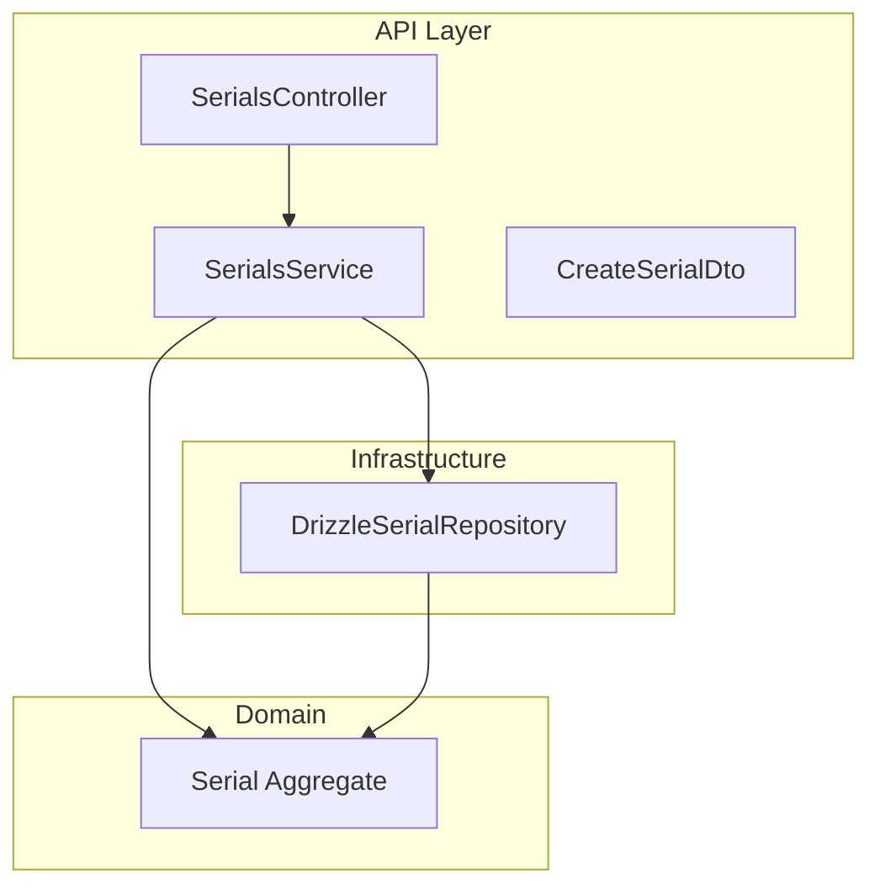
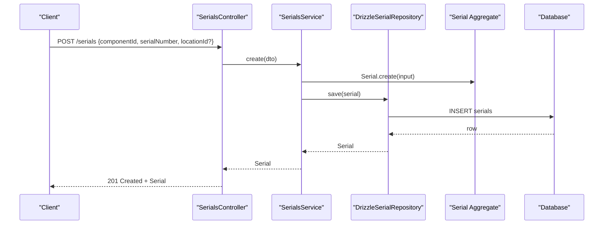
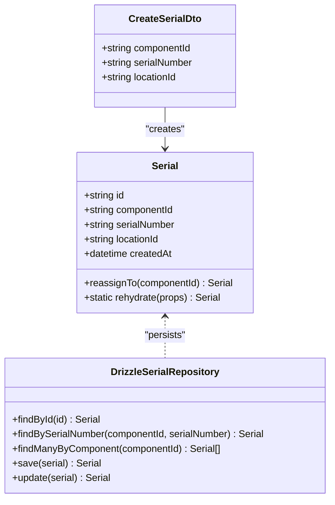
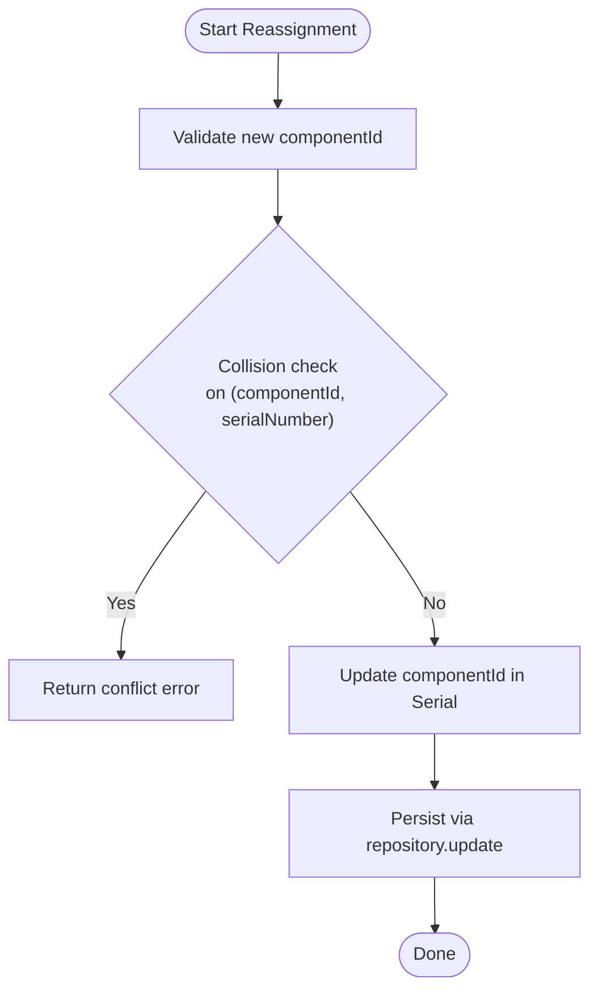
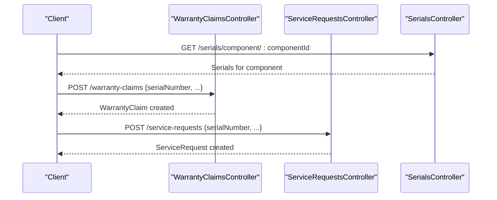
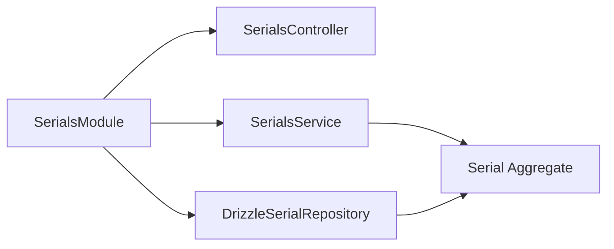

# Serial Numbers API

<cite>
**Referenced Files in This Document**
- [serials.controller.ts](file://apps/api/src/serials/serials.controller.ts)
- [serials.service.ts](file://apps/api/src/serials/serials.service.ts)
- [create-serial.dto.ts](file://apps/api/src/serials/create-serial.dto.ts)
- [serials.module.ts](file://apps/api/src/serials/serials.module.ts)
- [drizzle-serial.repository.ts](file://apps/api/src/infrastructure/repositories/drizzle-serial.repository.ts)
- [serial.ts](file://packages/inventory/src/serials/serial.ts)
- [serial.spec.ts](file://packages/inventory/src/serials/serial.spec.ts)
- [traceability.ts](file://packages/inventory/src/components/traceability.ts)
- [0007-batch-and-serial-tracking.md](file://docs/rfcs/0007-batch-and-serial-tracking.md)
- [warranty-claims.controller.ts](file://apps/api/src/warranty-claims/warranty-claims.controller.ts)
- [service-requests.controller.ts](file://apps/api/src/service-requests/service-requests.controller.ts)
</cite>

## Table of Contents
1. [Introduction](#introduction)
2. [Project Structure](#project-structure)
3. [Core Components](#core-components)
4. [Architecture Overview](#architecture-overview)
5. [Detailed Component Analysis](#detailed-component-analysis)
6. [Dependency Analysis](#dependency-analysis)
7. [Performance Considerations](#performance-considerations)
8. [Troubleshooting Guide](#troubleshooting-guide)
9. [Conclusion](#conclusion)

## Introduction
This document provides comprehensive API documentation for serial number management within the application. It covers:
- CRUD operations for serial numbers
- Assignment and transfer of ownership to components
- Status updates and lifecycle tracking
- Data model details, validation rules, and format patterns
- Integration with warranty claims and service workflows
- Audit logging considerations and best practices

Serial numbers uniquely identify individual inventory items and are tied to a specific component type. They move independently through inventory while preserving their identity across assignments and location changes.

## Project Structure
The serial number feature is implemented as a NestJS module with controller, service, DTO, repository, and domain aggregate layers.

**Diagram sources**
- [serials.controller.ts:12-39](file://apps/api/src/serials/serials.controller.ts#L12-L39)
- [serials.service.ts:12-49](file://apps/api/src/serials/serials.service.ts#L12-L49)
- [drizzle-serial.repository.ts:26-92](file://apps/api/src/infrastructure/repositories/drizzle-serial.repository.ts#L26-L92)
- [serial.ts:52-82](file://packages/inventory/src/serials/serial.ts#L52-L82)

**Section sources**
- [serials.controller.ts:12-39](file://apps/api/src/serials/serials.controller.ts#L12-L39)
- [serials.service.ts:12-49](file://apps/api/src/serials/serials.service.ts#L12-L49)
- [drizzle-serial.repository.ts:26-92](file://apps/api/src/infrastructure/repositories/drizzle-serial.repository.ts#L26-L92)
- [serial.ts:52-82](file://packages/inventory/src/serials/serial.ts#L52-L82)

## Core Components
- SerialsController: Exposes REST endpoints for listing, creating, finding by ID, and querying by component.
- SerialsService: Orchestrates creation via the domain aggregate and delegates persistence to the repository; includes list queries joining component and location metadata.
- CreateSerialDto: Validates input for componentId, serialNumber, and optional locationId.
- DrizzleSerialRepository: Implements persistence using Drizzle ORM, mapping between database rows and the domain Serial aggregate.
- Serial Aggregate: Domain object that enforces business rules such as reassignment and hydration.

Key responsibilities:
- Creation: Validate inputs, build domain entity, persist.
- Listing: Return enriched data including component and location names.
- Lookup: Find by ID or by component.
- Reassignment: Change component association while preserving identity.

**Section sources**
- [serials.controller.ts:12-39](file://apps/api/src/serials/serials.controller.ts#L12-L39)
- [serials.service.ts:12-49](file://apps/api/src/serials/serials.service.ts#L12-L49)
- [create-serial.dto.ts:1-14](file://apps/api/src/serials/create-serial.dto.ts#L1-L14)
- [drizzle-serial.repository.ts:26-92](file://apps/api/src/infrastructure/repositories/drizzle-serial.repository.ts#L26-L92)
- [serial.ts:52-82](file://packages/inventory/src/serials/serial.ts#L52-L82)

## Architecture Overview
The serial number workflow spans controller, service, repository, and domain layers. Warranty and service modules reference serial numbers but do not directly manage them.

**Diagram sources**
- [serials.controller.ts:21-24](file://apps/api/src/serials/serials.controller.ts#L21-L24)
- [serials.service.ts:19-22](file://apps/api/src/serials/serials.service.ts#L19-L22)
- [drizzle-serial.repository.ts:66-77](file://apps/api/src/infrastructure/repositories/drizzle-serial.repository.ts#L66-L77)
- [serial.ts:52-82](file://packages/inventory/src/serials/serial.ts#L52-L82)

## Detailed Component Analysis

### Serial Numbers API Endpoints
Base path: `/serials`

- List all serials
  - Method: GET
  - Path: `/serials`
  - Response: Array of serial records with component and location metadata
  - Notes: Sorted by component SKU then serial number

- Create a serial number
  - Method: POST
  - Path: `/serials`
  - Request body: CreateSerialDto
  - Response: Created Serial record
  - Validation: componentId and serialNumber required; locationId optional

- Get serial by component
  - Method: GET
  - Path: `/serials/component/:componentId`
  - Response: Array of serials for the given component

- Get serial by ID
  - Method: GET
  - Path: `/serials/:id`
  - Response: Single Serial record
  - Error: 404 Not Found if not found

Notes:
- The current controller does not expose update or delete endpoints.
- Ownership transfer (reassignment) is supported at the domain level via Serial.reassignTo and persisted through repository.update.

**Section sources**
- [serials.controller.ts:16-38](file://apps/api/src/serials/serials.controller.ts#L16-L38)
- [serials.service.ts:24-48](file://apps/api/src/serials/serials.service.ts#L24-L48)
- [create-serial.dto.ts:1-14](file://apps/api/src/serials/create-serial.dto.ts#L1-L14)

### Data Model: Serial
Fields:
- id: Unique identifier for the serial record
- componentId: Identifier of the component type this serial belongs to
- serialNumber: Unique serial string for the physical unit
- locationId: Optional identifier of the current storage location
- createdAt: Timestamp when the serial was created

Lifecycle and behavior:
- Creation: Enforced by Serial.create; empty serialNumber is invalid
- Reassignment: Serial.reassignTo allows changing componentId while preserving identity and timestamps
- Hydration: Serial.rehydrate reconstructs domain objects from persisted rows

Validation rules:
- serialNumber must be non-empty
- componentId is required for assignment
- Uniqueness constraint on (componentId, serialNumber) is enforced at the database layer

Format patterns:
- No strict regex pattern is enforced by the API; callers should ensure uniqueness and consistency
- Recommended practice: Use stable, human-readable identifiers with prefixes where appropriate

Audit and traceability:
- Serials support per-item traceability for warranty and recall scenarios
- Inventory transactions preserve immutable history; corrections are represented as additional transactions

**Diagram sources**
- [serial.ts:52-82](file://packages/inventory/src/serials/serial.ts#L52-L82)
- [create-serial.dto.ts:1-14](file://apps/api/src/serials/create-serial.dto.ts#L1-L14)
- [drizzle-serial.repository.ts:26-92](file://apps/api/src/infrastructure/repositories/drizzle-serial.repository.ts#L26-L92)

**Section sources**
- [serial.ts:52-82](file://packages/inventory/src/serials/serial.ts#L52-L82)
- [serial.spec.ts:1-25](file://packages/inventory/src/serials/serial.spec.ts#L1-L25)
- [drizzle-serial.repository.ts:26-92](file://apps/api/src/infrastructure/repositories/drizzle-serial.repository.ts#L26-L92)
- [0007-batch-and-serial-tracking.md:103-114](file://docs/rfcs/0007-batch-and-serial-tracking.md#L103-L114)

### Assignment and Transfer Operations
Assignment:
- When creating a serial, associate it with a component via componentId.
- Optionally set locationId to track initial storage location.

Transfer (Reassignment):
- Use Serial.reassignTo to change the component association while keeping the serial number and creation timestamp intact.
- Persist changes via repository.update.

Ownership change flow:

**Diagram sources**
- [serial.ts:52-82](file://packages/inventory/src/serials/serial.ts#L52-L82)
- [drizzle-serial.repository.ts:79-91](file://apps/api/src/infrastructure/repositories/drizzle-serial.repository.ts#L79-L91)

**Section sources**
- [serial.ts:52-82](file://packages/inventory/src/serials/serial.ts#L52-L82)
- [drizzle-serial.repository.ts:79-91](file://apps/api/src/infrastructure/repositories/drizzle-serial.repository.ts#L79-L91)

### Status Updates and Lifecycle Tracking
Current API surface:
- No explicit status field exists on the Serial model.
- Lifecycle is tracked implicitly through:
  - Creation timestamp
  - Component association
  - Location association
  - Inventory transaction history (immutable ledger)

Recommended approach:
- Track operational states (e.g., IN_STOCK, ASSIGNED, UNDER_REPAIR) through related entities such as service requests or warranty claims rather than mutating the serial itself.
- Use inventory transactions to represent state transitions immutably.

**Section sources**
- [serial.ts:52-82](file://packages/inventory/src/serials/serial.ts#L52-L82)
- [0007-batch-and-serial-tracking.md:145-157](file://docs/rfcs/0007-batch-and-serial-tracking.md#L145-L157)

### Integration with Warranty and Service Workflows
Warranty Claims:
- Warranty claims reference a serial number to tie entitlements to a specific device.
- Claim lifecycle includes submission, review, approval, and rejection.

Service Requests:
- Service requests can be associated with a serial number to track maintenance and repairs.
- Service request statuses include OPEN, DIAGNOSED, WAITING_PARTS, REPAIR_IN_PROGRESS, COMPLETED, CLOSED, CANCELLED.

Integration points:
- Warranty claim creation may include serialNumber to link the claim to a tracked device.
- Service request creation may include serialNumber to scope diagnostics and repairs.

**Diagram sources**
- [serials.controller.ts:26-29](file://apps/api/src/serials/serials.controller.ts#L26-L29)
- [warranty-claims.controller.ts:10-48](file://apps/api/src/warranty-claims/warranty-claims.controller.ts#L10-L48)
- [service-requests.controller.ts:20-83](file://apps/api/src/service-requests/service-requests.controller.ts#L20-L83)

**Section sources**
- [warranty-claims.controller.ts:10-48](file://apps/api/src/warranty-claims/warranty-claims.controller.ts#L10-L48)
- [service-requests.controller.ts:20-83](file://apps/api/src/service-requests/service-requests.controller.ts#L20-L83)

### Examples

Generate serial numbers:
- Generate unique serial numbers externally (e.g., via a generator service) and pass them to POST /serials with componentId and optional locationId.
- Ensure uniqueness per component before creation.

Assign to components:
- Create a serial with componentId to assign it to a component type.
- Optionally set locationId to indicate initial storage.

Track ownership changes:
- Use Serial.reassignTo to change componentId and persist via repository.update.
- Maintain audit trail through inventory transactions and related service/warranty records.

**Section sources**
- [create-serial.dto.ts:1-14](file://apps/api/src/serials/create-serial.dto.ts#L1-L14)
- [serial.ts:52-82](file://packages/inventory/src/serials/serial.ts#L52-L82)
- [drizzle-serial.repository.ts:66-91](file://apps/api/src/infrastructure/repositories/drizzle-serial.repository.ts#L66-L91)

## Dependency Analysis
Module wiring and dependencies:

External integrations:
- Database schema uses Drizzle ORM for persistence.
- Warranty and service controllers reference serial numbers but do not depend on SerialsModule.

Traceability mode:
- Components can be configured with NONE, BATCH, or SERIAL traceability modes.

**Diagram sources**
- [serials.module.ts:1-19](file://apps/api/src/serials/serials.module.ts#L1-L19)
- [traceability.ts:1-5](file://packages/inventory/src/components/traceability.ts#L1-L5)

**Section sources**
- [serials.module.ts:1-19](file://apps/api/src/serials/serials.module.ts#L1-L19)
- [traceability.ts:1-5](file://packages/inventory/src/components/traceability.ts#L1-L5)

## Performance Considerations
- Listing serials joins components and locations; consider pagination and filtering for large datasets.
- Repository queries use indexed lookups by id and componentId; ensure database indexes exist for frequent filters.
- Avoid unnecessary hydration of domain aggregates when only IDs are needed.

[No sources needed since this section provides general guidance]

## Troubleshooting Guide
Common issues:
- Creating duplicate serials under the same component:
  - Cause: Missing uniqueness checks before creation.
  - Resolution: Check existence via findBySerialNumber or handle database constraint errors.
- Updating serials without proper authorization:
  - Cause: Missing guards or permissions.
  - Resolution: Implement write guards and validate user roles.
- Reassignment conflicts:
  - Cause: New componentId already has the same serialNumber.
  - Resolution: Validate collisions prior to calling reassignTo and return clear error messages.

Error handling:
- NotFoundException thrown when serial by ID is missing.
- Repository methods throw descriptive errors on failed insert/update.

**Section sources**
- [serials.controller.ts:31-38](file://apps/api/src/serials/serials.controller.ts#L31-L38)
- [drizzle-serial.repository.ts:66-91](file://apps/api/src/infrastructure/repositories/drizzle-serial.repository.ts#L66-L91)

## Conclusion
The Serial Numbers API provides essential capabilities for creating, listing, and retrieving serial-tracked inventory items, with domain-level support for reassignment and integration points for warranty and service workflows. While explicit status fields are absent, lifecycle tracking is achieved through immutable inventory transactions and associations with related entities. For robust operations, enforce uniqueness constraints, implement authorization, and maintain audit trails through transactions and service records.

[No sources needed since this section summarizes without analyzing specific files]