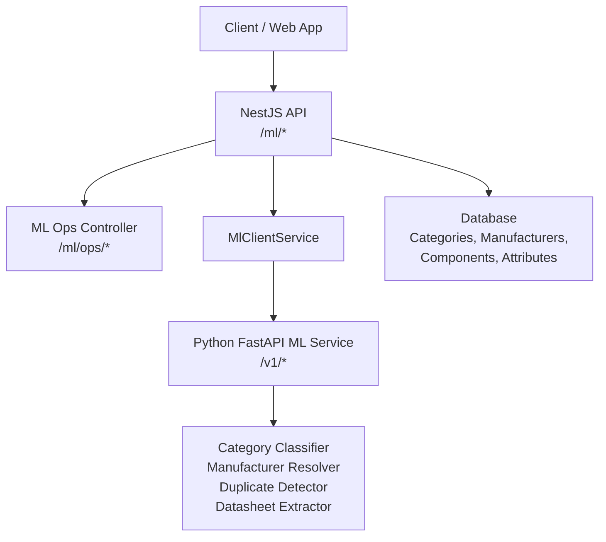
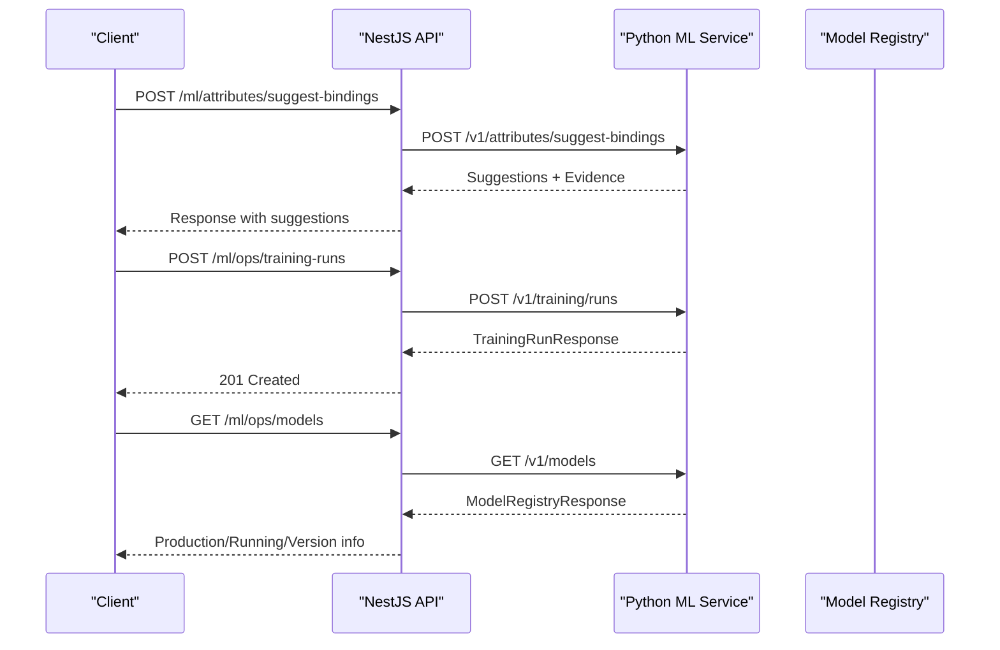
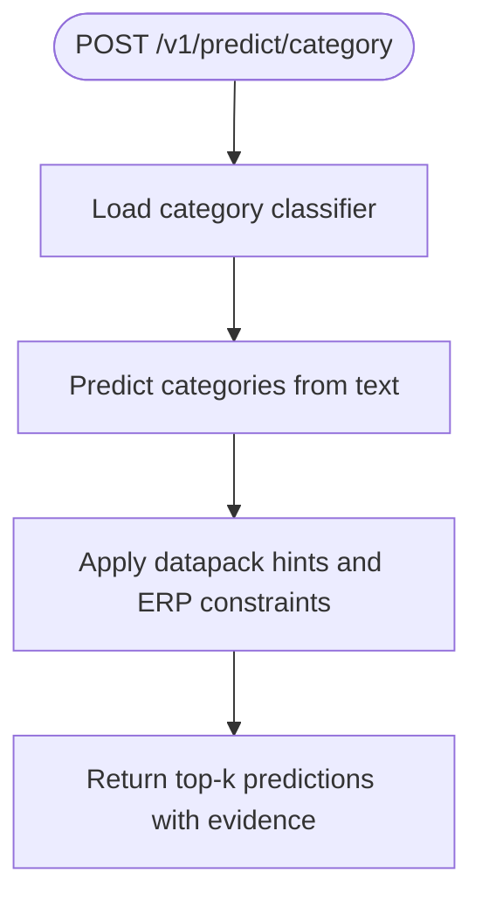
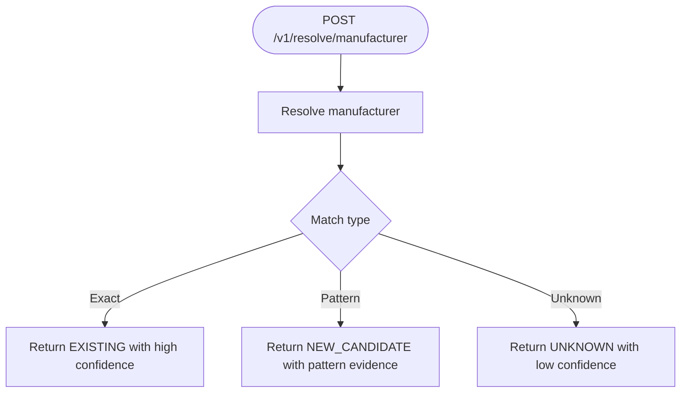
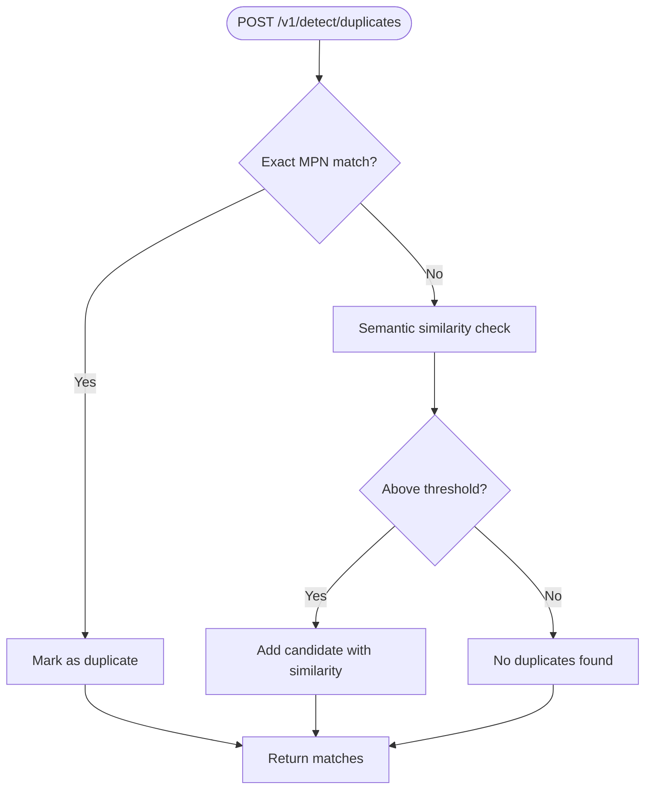
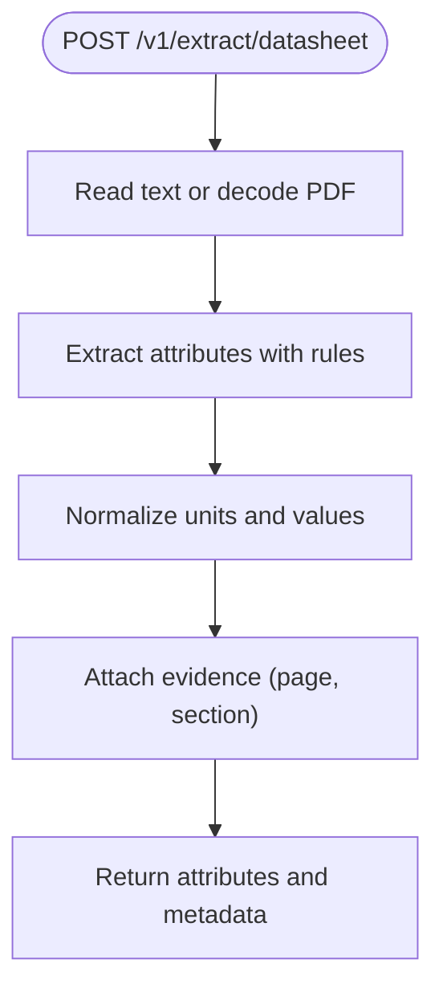
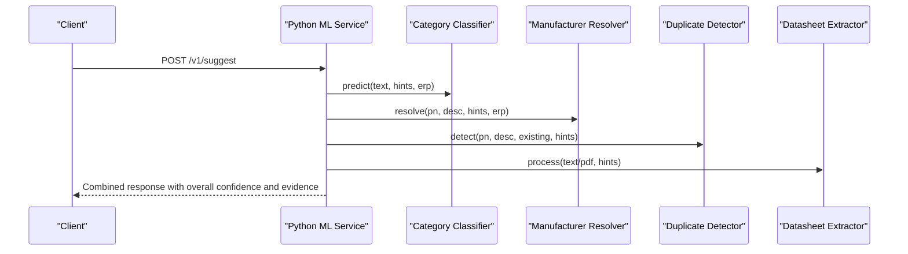
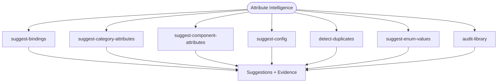
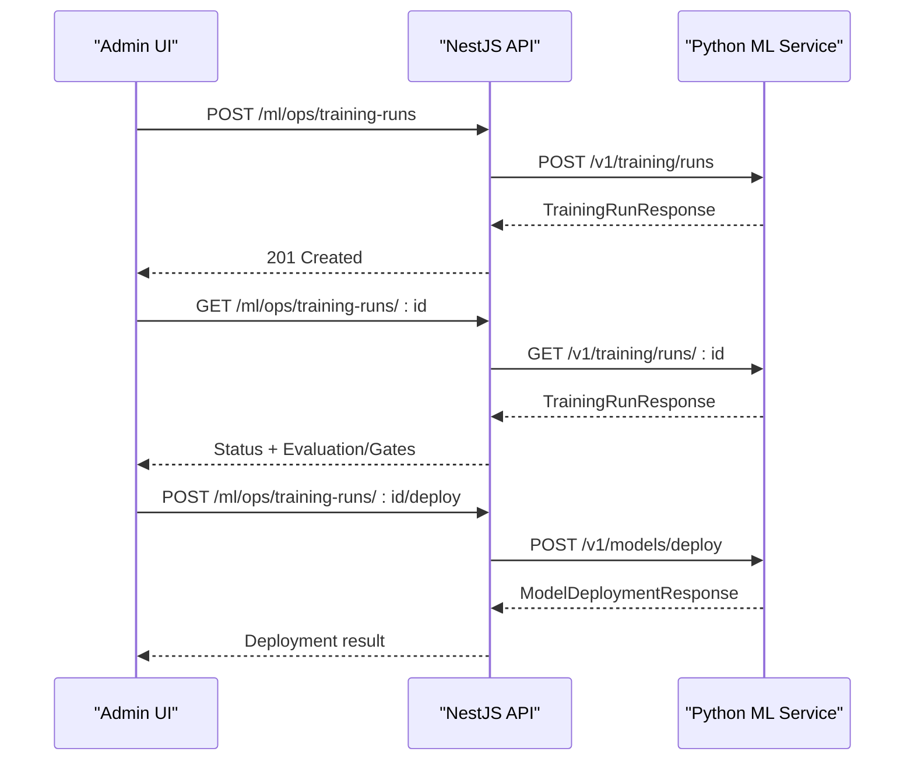
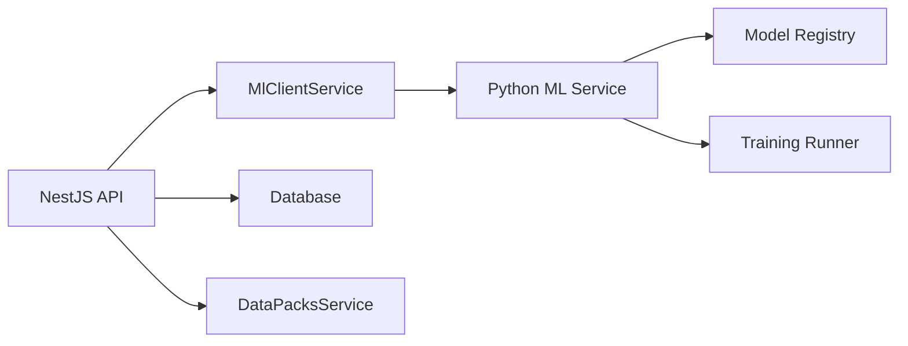

# ML & Intelligence APIs

<cite>
**Referenced Files in This Document**
- [main.py](file://apps/ml/app/main.py)
- [schemas.py](file://apps/ml/app/schemas.py)
- [ml.controller.ts](file://apps/api/src/ml/ml.controller.ts)
- [ml.service.ts](file://apps/api/src/ml/ml.service.ts)
- [dtos.ts](file://apps/api/src/ml/dtos.ts)
- [ml-client.service.ts](file://apps/api/src/ml/ml-client.service.ts)
- [ml-ops.controller.ts](file://apps/api/src/ml/ops/ml-ops.controller.ts)
- [ml-ops.service.ts](file://apps/api/src/ml/ops/ml-ops.service.ts)
</cite>

## Table of Contents
1. Introduction
2. Project Structure
3. Core Components
4. Architecture Overview
5. Detailed Component Analysis
6. Dependency Analysis
7. Performance Considerations
8. Troubleshooting Guide
9. Conclusion
10. Appendices

## Introduction
This document provides detailed API documentation for machine learning and intelligence endpoints that power component classification, manufacturer resolution, attribute extraction, duplicate detection, and ML model management. It covers:
- Inference endpoints for category prediction, manufacturer resolution, duplicate detection, datasheet extraction, and composite suggestions.
- Attribute intelligence endpoints for binding suggestions, category/component attribute recommendations, configuration suggestions, duplicate detection among attributes, enum value suggestions, and library audits.
- ML operations endpoints to submit training runs, track progress, retrieve results, deploy models, rollback, and reload running artifacts.
- Request/response schemas, status updates, error handling, and examples for integrating ML features into business workflows and monitoring performance.

## Project Structure
The ML capability spans two services:
- Python FastAPI service (apps/ml/app) exposes the ML inference and operations endpoints.
- NestJS API (apps/api/src/ml) provides authenticated controllers, DTOs, and orchestration logic that call the Python service via an internal client.

**Diagram sources**
- [ml.controller.ts:40-110](file://apps/api/src/ml/ml.controller.ts#L40-L110)
- [ml-ops.controller.ts:73-188](file://apps/api/src/ml/ops/ml-ops.controller.ts#L73-L188)
- [ml-client.service.ts:971-1016](file://apps/api/src/ml/ml-client.service.ts#L971-L1016)
- [main.py:67-152](file://apps/ml/app/main.py#L67-L152)

**Section sources**
- [ml.controller.ts:40-110](file://apps/api/src/ml/ml.controller.ts#L40-L110)
- [ml-ops.controller.ts:73-188](file://apps/api/src/ml/ops/ml-ops.controller.ts#L73-L188)
- [main.py:67-152](file://apps/ml/app/main.py#L67-L152)

## Core Components
- Category Classification: Predict ERP categories from text or datasheets with confidence levels and evidence.
- Manufacturer Resolution: Resolve manufacturer identity from part numbers, descriptions, and datasheets.
- Duplicate Detection: Identify existing components that may be duplicates using exact MPN and semantic similarity.
- Datasheet Extraction: Extract structured attributes from text or PDF content with normalized units and evidence.
- Composite Suggestion: Combine category, manufacturer, duplicate detection, and attribute extraction into a single response with overall confidence and aggregated evidence.
- Attribute Intelligence: Suggest bindings, recommended attributes for categories/components, attribute configurations, detect attribute duplicates, suggest enum values, and audit the attribute library.
- ML Operations: Start training runs, list and query runs, list models, deploy candidates, rollback, and reload models; expose dataset snapshots and quarantine summaries.

**Section sources**
- [main.py:103-361](file://apps/ml/app/main.py#L103-L361)
- [schemas.py:61-229](file://apps/ml/app/schemas.py#L61-L229)
- [schemas.py:336-582](file://apps/ml/app/schemas.py#L336-L582)
- [ml.controller.ts:119-287](file://apps/api/src/ml/ml.controller.ts#L119-L287)
- [ml-ops.controller.ts:81-188](file://apps/api/src/ml/ops/ml-ops.controller.ts#L81-L188)

## Architecture Overview
The NestJS API authenticates requests and enforces permissions before delegating to either local processing or the Python ML service. The Python service loads lightweight CPU-first models at startup and exposes versioned endpoints for inference and ML ops.

**Diagram sources**
- [ml.controller.ts:194-232](file://apps/api/src/ml/ml.controller.ts#L194-L232)
- [ml-ops.controller.ts:116-188](file://apps/api/src/ml/ops/ml-ops.controller.ts#L116-L188)
- [main.py:262-486](file://apps/ml/app/main.py#L262-L486)

## Detailed Component Analysis

### Category Classification
- Endpoint: POST /v1/predict/category
- Purpose: Predict ERP categories from text, optionally constrained by ERP categories and manufacturers, with optional datasheet context.
- Inputs: text, top_k, datapack_hints, erp_categories, erp_manufacturers, datasheet_text.
- Outputs: predictions with category, subcategory, resolution, confidence, confidence_level, evidence, and candidates.
- Behavior: Returns top-k predictions; supports hints to bias classification toward known families.

**Diagram sources**
- [main.py:103-113](file://apps/ml/app/main.py#L103-L113)
- [schemas.py:86-96](file://apps/ml/app/schemas.py#L86-L96)

**Section sources**
- [main.py:103-113](file://apps/ml/app/main.py#L103-L113)
- [schemas.py:61-96](file://apps/ml/app/schemas.py#L61-L96)

### Manufacturer Resolution
- Endpoint: POST /v1/resolve/manufacturer
- Purpose: Resolve manufacturer from part number, description, and optional datasheet text, with ERP manufacturer context and datapack hints.
- Inputs: part_number, description, datasheet_text, erp_manufacturers, datapack_hints.
- Outputs: resolution, manufacturer, manufacturer_id, code, confidence, confidence_level, match_type, evidence, candidates.

**Diagram sources**
- [main.py:126-134](file://apps/ml/app/main.py#L126-L134)
- [schemas.py:107-131](file://apps/ml/app/schemas.py#L107-L131)

**Section sources**
- [main.py:126-134](file://apps/ml/app/main.py#L126-L134)
- [schemas.py:107-131](file://apps/ml/app/schemas.py#L107-L131)

### Duplicate Detection
- Endpoint: POST /v1/detect/duplicates
- Purpose: Detect potential duplicates against existing components using exact MPN and semantic similarity.
- Inputs: part_number, description, existing_components, similarity_threshold, datapack_hints.
- Outputs: is_duplicate, matches with similarity, confidence_level, match_type, reason, evidence.

**Diagram sources**
- [main.py:136-144](file://apps/ml/app/main.py#L136-L144)
- [schemas.py:132-163](file://apps/ml/app/schemas.py#L132-L163)

**Section sources**
- [main.py:136-144](file://apps/ml/app/main.py#L136-L144)
- [schemas.py:132-163](file://apps/ml/app/schemas.py#L132-L163)

### Datasheet Extraction
- Endpoint: POST /v1/extract/datasheet
- Purpose: Extract structured attributes from text or PDF base64, normalizing units and providing evidence including page and section when available.
- Inputs: text, pdf_base64, datapack_hints.
- Outputs: attributes map with code, value, unit, source_value/source_unit, formatted, confidence, confidence_level, evidence; extracted_text_preview, extracted_text, page_count, pages_analyzed, extractor_version.

**Diagram sources**
- [main.py:146-152](file://apps/ml/app/main.py#L146-L152)
- [schemas.py:164-196](file://apps/ml/app/schemas.py#L164-L196)

**Section sources**
- [main.py:146-152](file://apps/ml/app/main.py#L146-L152)
- [schemas.py:164-196](file://apps/ml/app/schemas.py#L164-L196)

### Composite Suggestion
- Endpoint: POST /v1/suggest
- Purpose: Unified endpoint combining category classification, manufacturer resolution, duplicate detection, and attribute extraction into one response with overall confidence and aggregated evidence.
- Inputs: query, part_number, description, datasheet_text, datasheet_pdf_base64, existing_components, erp_categories, erp_manufacturers, datapack_hints.
- Outputs: category_predictions, manufacturer, duplicates, extracted_attributes, confidence_level, overall_evidence, execution_time_ms.

**Diagram sources**
- [main.py:154-256](file://apps/ml/app/main.py#L154-L256)
- [schemas.py:197-216](file://apps/ml/app/schemas.py#L197-L216)

**Section sources**
- [main.py:154-256](file://apps/ml/app/main.py#L154-L256)
- [schemas.py:197-216](file://apps/ml/app/schemas.py#L197-L216)

### Attribute Intelligence Endpoints
- Suggest Attribute Bindings: POST /v1/attributes/suggest-bindings
  - Inputs: attributeName, attributeCode, description, dataType, unitCategory, categories, datapack_hints, component_category_counts.
  - Outputs: suggestions with categoryId, categoryCode, categoryName, confidence, confidenceLevel, reason, evidence, modelVersion.
- Suggest Category Attributes: POST /v1/attributes/suggest-category-attributes
  - Inputs: categoryId, categoryCode, categoryName, existingAttributes, boundAttributeIds, datapack_hints, categoryComponentCount.
  - Outputs: suggestions with attribute definition details, confidence, confidenceLevel, isAlreadyBound, reason, evidence.
- Suggest Component Attributes: POST /v1/attributes/suggest-component-attributes
  - Inputs: query, partNumber, description, datasheetText, categories, attributes, boundAttributeIds, boundAttributeCodes, existingValues, extractedAttributes, datapack_hints.
  - Outputs: suggestions with relevance and suggestedValue where supported.
- Suggest Attribute Config: POST /v1/attributes/suggest-config
  - Inputs: name, description, existingAttributes, datapack_hints.
  - Outputs: suggestion with suggestedCode, dataType, unitCategory, defaultUnit, displayUnits, groupName, suggestedAliases, suggestedOptions, validationRules, canonicalMatch, confidence, confidenceLevel, reason, evidence.
- Detect Attribute Duplicates: POST /v1/attributes/detect-duplicates
  - Inputs: name, code, existingAttributes, existingBindings, threshold, datapack_hints.
  - Outputs: isDuplicate, matches with similarity, confidenceLevel, matchType, usageCount, boundCategories, aliases, reason, evidence; suggestedAliases.
- Suggest Enum Values: POST /v1/attributes/suggest-enum-values
  - Inputs: attributeCode, attributeName, existingOptions, datapack_hints.
  - Outputs: suggestedOptions with code, label, source, confidence, confidenceLevel.
- Audit Attribute Library: POST /v1/attributes/audit
  - Inputs: attributes, categories, bindings, componentCountsByAttribute, componentCountsByCategoryAttribute, datapack_hints.
  - Outputs: summary counts and issues with id, type, severity, attribute/category details, confidence, confidenceLevel, reason, payload, evidence.

**Diagram sources**
- [main.py:262-361](file://apps/ml/app/main.py#L262-L361)
- [schemas.py:336-582](file://apps/ml/app/schemas.py#L336-L582)

**Section sources**
- [main.py:262-361](file://apps/ml/app/main.py#L262-L361)
- [schemas.py:336-582](file://apps/ml/app/schemas.py#L336-L582)

### ML Operations — Training Control Plane
- Start Training Run: POST /v1/training/runs
  - Inputs: runId (optional), requestedBy (optional).
  - Outputs: TrainingRunResponse with runId, status, phase, timestamps, durations, candidate/base model versions, pipeline/dataset versions, record counts, evaluation/gate summaries, errorCode, errorMessage, artifactReference, log, cancellable=false.
- List Active Training Run: GET /v1/training/runs/active
- List Training Runs: GET /v1/training/runs
- Get Training Run: GET /v1/training/runs/{run_id}
- List Models: GET /v1/models
- Get Active Model: GET /v1/models/active
- Deploy Candidate: POST /v1/models/deploy
  - Inputs: runId.
  - Outputs: ModelDeploymentResponse with artifactVersion, previousVersion, restoredVersion, deployedAt, artifactSha256, runningVersion, reloadPending, reloadError, deploymentMetadataStale.
- Rollback Model: POST /v1/models/rollback
  - Outputs: ModelDeploymentResponse indicating restoration.
- Reload Model: POST /v1/models/reload
  - Re-reads production artifact into running process without changing version; returns reloadPending and reloadError if any.
- Dataset Overview: GET /v1/datasets/current
  - Outputs: current snapshot, snapshots, quarantine summary, distribution.

**Diagram sources**
- [ml-ops.controller.ts:116-188](file://apps/api/src/ml/ops/ml-ops.controller.ts#L116-L188)
- [main.py:383-486](file://apps/ml/app/main.py#L383-L486)
- [ml-client.service.ts:971-1016](file://apps/api/src/ml/ml-client.service.ts#L971-L1016)

**Section sources**
- [main.py:383-486](file://apps/ml/app/main.py#L383-L486)
- [ml-ops.controller.ts:116-188](file://apps/api/src/ml/ops/ml-ops.controller.ts#L116-L188)
- [ml-client.service.ts:971-1016](file://apps/api/src/ml/ml-client.service.ts#L971-L1016)

## Dependency Analysis
- NestJS API depends on:
  - MlClientService to call Python ML endpoints with timeouts and error mapping.
  - Database for categories, manufacturers, components, attributes, and feedback.
  - DataPacksService for active intelligence hints used during suggestions.
- Python ML Service depends on:
  - Lightweight CPU-first models loaded at startup.
  - Model registry for active/running versions and dataset snapshots.
  - Training runner for controlled training lifecycle and deployment gates.

**Diagram sources**
- [ml.service.ts:313-447](file://apps/api/src/ml/ml.service.ts#L313-L447)
- [ml-client.service.ts:971-1016](file://apps/api/src/ml/ml-client.service.ts#L971-L1016)
- [main.py:60-72](file://apps/ml/app/main.py#L60-L72)

**Section sources**
- [ml.service.ts:313-447](file://apps/api/src/ml/ml.service.ts#L313-L447)
- [ml-client.service.ts:971-1016](file://apps/api/src/ml/ml-client.service.ts#L971-L1016)
- [main.py:60-72](file://apps/ml/app/main.py#L60-L72)

## Performance Considerations
- Lightweight models are eagerly loaded at startup to minimize first-request latency.
- Composite suggestion aggregates multiple inferences but bounds document reading and limits returned data to avoid large payloads.
- Duplicate detection uses a bounded candidate set to prevent unbounded payloads to the model service.
- Unit normalization and canonicalization reduce downstream comparison costs.
- Training runs are asynchronous; polling endpoints provide progress without blocking clients.

[No sources needed since this section provides general guidance]

## Troubleshooting Guide
- Health and readiness:
  - Use GET /ml/health to verify NestJS API health and reachability of the Python ML service.
  - Use GET /ready on the Python service to check model loading status and running model identity.
- Training run issues:
  - If a run becomes unknown to the ML service (process restart), the API marks it as FAILED with ML_JOB_LOST to avoid stale RUNNING states.
  - Conflict errors (409) indicate refusal reasons such as already active run or non-PASSED candidate; inspect gateSummary and evaluationSummary for details.
- Deployment issues:
  - Deployment failures return structured reasons (e.g., DEPLOYMENT_FAILED); use reload to refresh the running model without restarting the container.
  - Rollback requires a backup artifact; otherwise refused with NO_ROBACK_ARTIFACT.
- Attribute intelligence:
  - Low-confidence suggestions often indicate missing datapack hints or insufficient datasheet context; enrich inputs with relevant categories/manufacturers and datasheet text.
  - Duplicate detection among attributes can be tuned via threshold; review suggestedAliases to consolidate naming inconsistencies.

**Section sources**
- [ml.controller.ts:102-110](file://apps/api/src/ml/ml.controller.ts#L102-L110)
- [main.py:82-101](file://apps/ml/app/main.py#L82-L101)
- [ml-ops.service.ts:838-870](file://apps/api/src/ml/ops/ml-ops.service.ts#L838-L870)
- [ml-ops.controller.ts:145-188](file://apps/api/src/ml/ops/ml-ops.controller.ts#L145-L188)

## Conclusion
The ML & Intelligence APIs provide a comprehensive surface for component intelligence and model operations. They combine robust inference endpoints with strict operational controls for training and deployment, ensuring safe, auditable, and performant integration into business workflows. By leveraging datapack hints, ERP context, and datasheet extraction, the system delivers actionable suggestions with transparent evidence and confidence levels.

[No sources needed since this section summarizes without analyzing specific files]

## Appendices

### API Endpoints Summary
- Inference
  - POST /v1/predict/category
  - POST /v1/predict/category/batch
  - POST /v1/resolve/manufacturer
  - POST /v1/detect/duplicates
  - POST /v1/extract/datasheet
  - POST /v1/suggest
- Attribute Intelligence
  - POST /v1/attributes/suggest-bindings
  - POST /v1/attributes/suggest-category-attributes
  - POST /v1/attributes/suggest-component-attributes
  - POST /v1/attributes/suggest-config
  - POST /v1/attributes/detect-duplicates
  - POST /v1/attributes/suggest-enum-values
  - POST /v1/attributes/audit
- ML Operations
  - POST /v1/training/runs
  - GET /v1/training/runs/active
  - GET /v1/training/runs
  - GET /v1/training/runs/{run_id}
  - GET /v1/models
  - GET /v1/models/active
  - POST /v1/models/deploy
  - POST /v1/models/rollback
  - POST /v1/models/reload
  - GET /v1/datasets/current

**Section sources**
- [main.py:82-486](file://apps/ml/app/main.py#L82-L486)
- [ml.controller.ts:119-287](file://apps/api/src/ml/ml.controller.ts#L119-L287)
- [ml-ops.controller.ts:81-188](file://apps/api/src/ml/ops/ml-ops.controller.ts#L81-L188)

### Example Integrations
- Business workflow: Component creation form
  - Call POST /v1/suggest with query, part_number, description, and optional datasheet text or PDF base64.
  - Use category_predictions to preselect ERP category; use manufacturer to auto-fill manufacturer; use duplicates to warn about potential duplicates; use extracted_attributes to populate specification fields; present confidence_level and overall_evidence to guide reviewer decisions.
- Attribute library maintenance
  - Call POST /v1/attributes/suggest-bindings to propose bindings for new attributes across categories.
  - Call POST /v1/attributes/suggest-category-attributes to recommend attributes for a category based on existing definitions and bindings.
  - Call POST /v1/attributes/detect-duplicates to identify duplicate attributes and suggested aliases for consolidation.
- ML operations
  - Trigger training via POST /ml/ops/training-runs; poll GET /ml/ops/training-runs/:id for progress; upon PASSED, deploy via POST /ml/ops/training-runs/:id/deploy; monitor models via GET /ml/ops/models; reload if needed via POST /ml/ops/models/reload.

**Section sources**
- [main.py:154-256](file://apps/ml/app/main.py#L154-L256)
- [main.py:262-361](file://apps/ml/app/main.py#L262-L361)
- [ml-ops.controller.ts:116-188](file://apps/api/src/ml/ops/ml-ops.controller.ts#L116-L188)

### Monitoring and Performance Metrics
- Execution time:
  - Composite suggestion includes execution_time_ms for end-to-end latency measurement.
- Confidence levels:
  - Responses include confidence and confidence_level fields to quantify reliability; aggregate overall_confidence_level in composite responses.
- Evidence:
  - Each suggestion includes evidence items with type, description, weight, and optional source/page/section for traceability.
- Operational metrics:
  - Use GET /ml/ops/overview and GET /ml/ops/usage to monitor training frequency, dataset quality, and model adoption.

**Section sources**
- [main.py:154-256](file://apps/ml/app/main.py#L154-L256)
- [schemas.py:4-20](file://apps/ml/app/schemas.py#L4-L20)
- [ml-ops.controller.ts:81-114](file://apps/api/src/ml/ops/ml-ops.controller.ts#L81-L114)