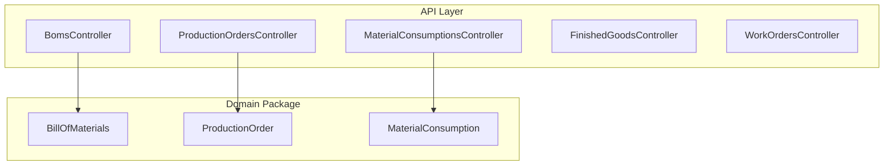
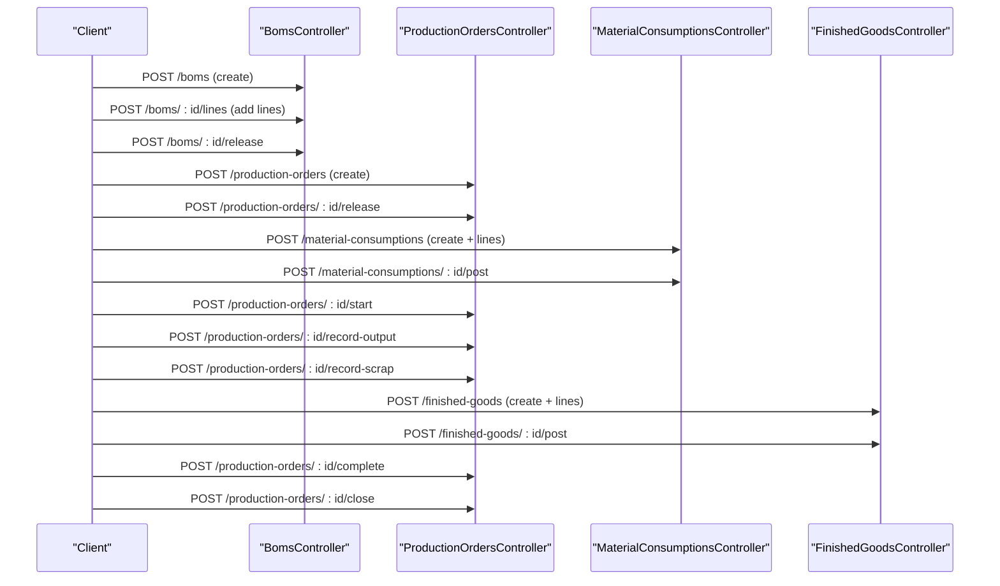
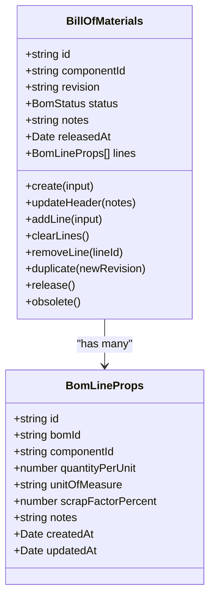
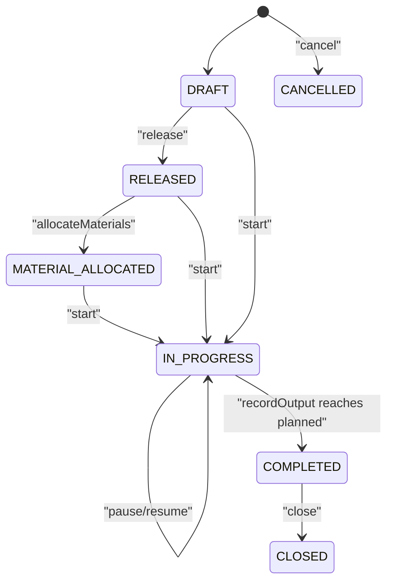
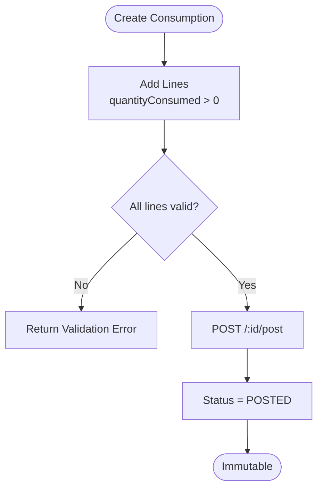
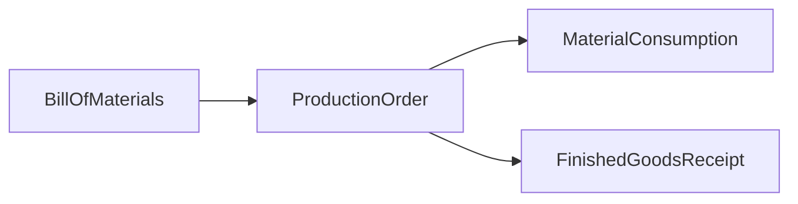
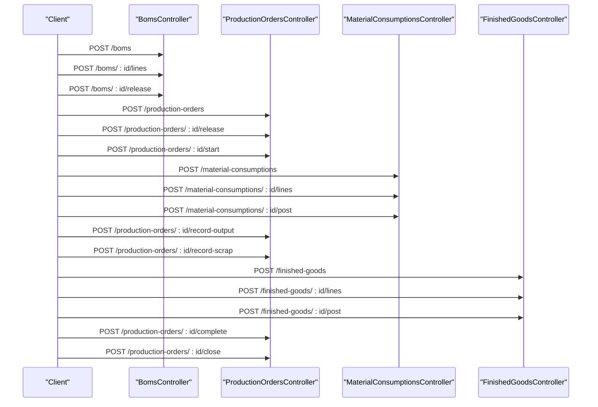

# Manufacturing Operations APIs

<cite>
**Referenced Files in This Document**
- [boms.controller.ts](file://apps/api/src/boms/boms.controller.ts)
- [dtos.ts (BOMs)](file://apps/api/src/boms/dtos.ts)
- [production-orders.controller.ts](file://apps/api/src/production-orders/production-orders.controller.ts)
- [dtos.ts (Production Orders)](file://apps/api/src/production-orders/dtos.ts)
- [material-consumptions.controller.ts](file://apps/api/src/material-consumptions/material-consumptions.controller.ts)
- [dtos.ts (Material Consumptions)](file://apps/api/src/material-consumptions/dtos.ts)
- [finished-goods.controller.ts](file://apps/api/src/finished-goods/finished-goods.controller.ts)
- [dtos.ts (Finished Goods)](file://apps/api/src/finished-goods/dtos.ts)
- [work-orders.controller.ts](file://apps/api/src/work-orders/work-orders.controller.ts)
- [dtos.ts (Work Orders)](file://apps/api/src/work-orders/dtos.ts)
- [bill-of-materials.ts](file://packages/manufacturing/src/boms/bill-of-materials.ts)
- [production-order.ts](file://packages/manufacturing/src/production-orders/production-order.ts)
- [material-consumption.ts](file://packages/manufacturing/src/material-consumptions/material-consumption.ts)
</cite>

## Table of Contents
1. [Introduction](#introduction)
2. [Project Structure](#project-structure)
3. [Core Components](#core-components)
4. [Architecture Overview](#architecture-overview)
5. [Detailed Component Analysis](#detailed-component-analysis)
6. [Dependency Analysis](#dependency-analysis)
7. [Performance Considerations](#performance-considerations)
8. [Troubleshooting Guide](#troubleshooting-guide)
9. [Conclusion](#conclusion)
10. [Appendices](#appendices)

## Introduction
This document provides detailed API documentation for manufacturing operations, covering:
- Bill of Materials (BOM)
- Production Orders (also exposed as Work Orders)
- Material Consumption
- Finished Goods Receipt
- Service Work Orders
It also documents BOM structure, production scheduling, material requirements planning, and traceability tracking. Schemas are provided for production routing, scrap recording, and quality control. Complete end-to-end workflows from planning to completion are included.

## Project Structure
The manufacturing domain is implemented across NestJS controllers and a shared domain package:
- Controllers expose REST endpoints for BOMs, production orders, material consumptions, finished goods, and service work orders.
- DTOs define request validation rules and payload shapes.
- The manufacturing package contains domain models with state machines and business invariants.

**Diagram sources**
- [boms.controller.ts:22-83](file://apps/api/src/boms/boms.controller.ts#L22-L83)
- [production-orders.controller.ts:26-128](file://apps/api/src/production-orders/production-orders.controller.ts#L26-L128)
- [material-consumptions.controller.ts:5-34](file://apps/api/src/material-consumptions/material-consumptions.controller.ts#L5-L34)
- [finished-goods.controller.ts:5-32](file://apps/api/src/finished-goods/finished-goods.controller.ts#L5-L32)
- [work-orders.controller.ts:10-69](file://apps/api/src/work-orders/work-orders.controller.ts#L10-L69)
- [bill-of-materials.ts:51-337](file://packages/manufacturing/src/boms/bill-of-materials.ts#L51-L337)
- [production-order.ts:71-270](file://packages/manufacturing/src/production-orders/production-order.ts#L71-L270)
- [material-consumption.ts:59-141](file://packages/manufacturing/src/material-consumptions/material-consumption.ts#L59-L141)

**Section sources**
- [boms.controller.ts:22-83](file://apps/api/src/boms/boms.controller.ts#L22-L83)
- [production-orders.controller.ts:26-128](file://apps/api/src/production-orders/production-orders.controller.ts#L26-L128)
- [material-consumptions.controller.ts:5-34](file://apps/api/src/material-consumptions/material-consumptions.controller.ts#L5-L34)
- [finished-goods.controller.ts:5-32](file://apps/api/src/finished-goods/finished-goods.controller.ts#L5-L32)
- [work-orders.controller.ts:10-69](file://apps/api/src/work-orders/work-orders.controller.ts#L10-L69)

## Core Components
- BOMs: Define product structures with revisioning, line items, release/obsolete lifecycle, and duplication.
- Production Orders: Plan and execute manufacturing runs with scheduling, allocation, start/pause/resume, output/scrap recording, completion, closure, and cancellation.
- Material Consumptions: Record planned vs actual consumption per component/location with batch/serial traceability; immutable after posting.
- Finished Goods: Record produced quantities, optional scrapped quantities, and location/batch/serial details; immutable after posting.
- Service Work Orders: Manage field/service tasks with assignment, time logging, and lifecycle transitions.

**Section sources**
- [bill-of-materials.ts:51-337](file://packages/manufacturing/src/boms/bill-of-materials.ts#L51-L337)
- [production-order.ts:71-270](file://packages/manufacturing/src/production-orders/production-order.ts#L71-L270)
- [material-consumption.ts:59-141](file://packages/manufacturing/src/material-consumptions/material-consumption.ts#L59-L141)

## Architecture Overview
End-to-end manufacturing flow:
1. Create and manage BOMs (draft, add lines, release).
2. Create Production Orders against a released BOM.
3. Allocate materials and record consumption.
4. Execute production (start, pause/resume), record partial outputs and scrap.
5. Post finished goods receipts.
6. Close or cancel the order.

**Diagram sources**
- [boms.controller.ts:27-78](file://apps/api/src/boms/boms.controller.ts#L27-L78)
- [production-orders.controller.ts:33-123](file://apps/api/src/production-orders/production-orders.controller.ts#L33-L123)
- [material-consumptions.controller.ts:11-34](file://apps/api/src/material-consumptions/material-consumptions.controller.ts#L11-L34)
- [finished-goods.controller.ts:9-32](file://apps/api/src/finished-goods/finished-goods.controller.ts#L9-L32)

## Detailed Component Analysis

### Bill of Materials (BOM) API
Endpoints:
- POST /boms
- GET /boms?componentId&status
- GET /boms/revisions/:componentId
- GET /boms/:id
- PUT /boms/:id
- POST /boms/:id/duplicate
- POST /boms/:id/lines
- DELETE /boms/:id/lines/:lineId
- POST /boms/:id/release
- POST /boms/:id/obsolete
- DELETE /boms/:id

Request schemas:
- CreateBomDto
  - componentId: string (required)
  - revision: string (optional)
  - notes: string (optional)
  - lines: AddBomLineDto[] (optional)
- AddBomLineDto
  - componentId: string (required)
  - quantityPerUnit: number (required, >0)
  - unitOfMeasure: string (optional)
  - scrapFactorPercent: number (optional, >=0)
  - notes: string (optional)
- UpdateBomDto
  - notes: string (optional)
  - lines: AddBomLineDto[] (optional)
- DuplicateBomDto
  - newRevision: string (optional)

Behavior highlights:
- BOM status transitions: DRAFT -> RELEASED -> OBSOLETE.
- Immutable once released; only draft allows edits.
- Duplicate creates a new revision preserving lines.

**Diagram sources**
- [bill-of-materials.ts:11-35](file://packages/manufacturing/src/boms/bill-of-materials.ts#L11-L35)
- [bill-of-materials.ts:51-337](file://packages/manufacturing/src/boms/bill-of-materials.ts#L51-L337)

**Section sources**
- [boms.controller.ts:22-83](file://apps/api/src/boms/boms.controller.ts#L22-L83)
- [dtos.ts (BOMs):12-71](file://apps/api/src/boms/dtos.ts#L12-L71)
- [bill-of-materials.ts:51-337](file://packages/manufacturing/src/boms/bill-of-materials.ts#L51-L337)

### Production Orders API
Endpoints:
- POST /production-orders (alias: /work-orders)
- GET /production-orders?componentId&bomId&locationId&status&priority&search
- GET /production-orders/:id
- GET /production-orders/:id/materials
- GET /production-orders/:id/timeline
- PUT /production-orders/:id
- POST /production-orders/:id/release
- POST /production-orders/:id/start
- POST /production-orders/:id/record-output
- POST /production-orders/:id/record-scrap
- POST /production-orders/:id/pause
- POST /production-orders/:id/resume
- POST /production-orders/:id/complete
- POST /production-orders/:id/close
- POST /production-orders/:id/cancel
- DELETE /production-orders/:id

Request schemas:
- CreateProductionOrderDto
  - bomId: string (required)
  - componentId: string (required)
  - locationId: string (optional)
  - quantityPlanned: number (required, >=1)
  - priority: enum LOW|NORMAL|HIGH|URGENT (optional)
  - startDate: string (optional)
  - endDate: string (optional)
  - notes: string (optional)
  - createdBy: string (optional)
- UpdateProductionOrderDto
  - locationId: string (optional)
  - quantityPlanned: number (optional, >=1)
  - priority: enum (optional)
  - startDate: string (optional)
  - endDate: string (optional)
  - notes: string (optional)
- RecordPartialOutputDto
  - producedQuantity: number (required, >=1)
  - scrappedQuantity: number (optional, >=0)
  - notes: string (optional)
- RecordScrapDto
  - componentId: string (required)
  - quantity: number (required, >0)
  - reason: string (required)
- CompleteProductionOrderDto
  - producedQuantity: number (optional, >=1)

State machine:
- DRAFT -> RELEASED -> MATERIAL_ALLOCATED -> IN_PROGRESS -> COMPLETED -> CLOSED
- CANCELLED terminal from non-terminal states

**Diagram sources**
- [production-order.ts:7-16](file://packages/manufacturing/src/production-orders/production-order.ts#L7-L16)
- [production-order.ts:164-259](file://packages/manufacturing/src/production-orders/production-order.ts#L164-L259)

**Section sources**
- [production-orders.controller.ts:26-128](file://apps/api/src/production-orders/production-orders.controller.ts#L26-L128)
- [dtos.ts (Production Orders):17-116](file://apps/api/src/production-orders/dtos.ts#L17-L116)
- [production-order.ts:71-270](file://packages/manufacturing/src/production-orders/production-order.ts#L71-L270)

### Material Consumption API
Endpoints:
- POST /material-consumptions
- GET /material-consumptions?productionOrderId
- GET /material-consumptions/:id
- POST /material-consumptions/:id/lines
- POST /material-consumptions/:id/post

Request schemas:
- CreateMaterialConsumptionDto
  - productionOrderId: string (required)
- AddConsumptionLineDto
  - componentId: string (required)
  - locationId: string (required)
  - quantityPlanned: number (optional)
  - quantityConsumed: number (required, >0)
  - batchNumber: string (optional)
  - serialNumbers: string[] (optional)

Behavior:
- Statuses: DRAFT -> POSTED.
- Immutable after posting.

**Diagram sources**
- [material-consumption.ts:18-135](file://packages/manufacturing/src/material-consumptions/material-consumption.ts#L18-L135)

**Section sources**
- [material-consumptions.controller.ts:5-34](file://apps/api/src/material-consumptions/material-consumptions.controller.ts#L5-L34)
- [dtos.ts (Material Consumptions):10-40](file://apps/api/src/material-consumptions/dtos.ts#L10-L40)
- [material-consumption.ts:59-141](file://packages/manufacturing/src/material-consumptions/material-consumption.ts#L59-L141)

### Finished Goods API
Endpoints:
- POST /finished-goods
- GET /finished-goods?productionOrderId
- GET /finished-goods/:id
- POST /finished-goods/:id/lines
- POST /finished-goods/:id/post

Request schemas:
- CreateFinishedGoodsDto
  - productionOrderId: string (required)
- AddFgrLineDto
  - componentId: string (required)
  - locationId: string (required)
  - quantityProduced: number (required, >=0)
  - quantityScrapped: number (optional, >=0)
  - batchNumber: string (optional)
  - serialNumbers: string[] (optional)

Behavior:
- Records production output and optional scrap per line.
- Immutable after posting.

**Section sources**
- [finished-goods.controller.ts:5-32](file://apps/api/src/finished-goods/finished-goods.controller.ts#L5-L32)
- [dtos.ts (Finished Goods):10-41](file://apps/api/src/finished-goods/dtos.ts#L10-L41)

### Service Work Orders API
Endpoints:
- POST /work-orders
- GET /work-orders?serviceRequestId&assignedTechnician&status&priority&search
- GET /work-orders/:id
- POST /work-orders/:id/assign
- POST /work-orders/:id/start
- POST /work-orders/:id/pause
- POST /work-orders/:id/hours
- POST /work-orders/:id/complete
- POST /work-orders/:id/cancel

Request schemas:
- CreateWorkOrderDto
  - serviceRequestId: string (required)
  - assignedTechnician: string (optional)
  - title: string (required)
  - description: string (optional)
  - plannedHours: number (required, >=0)
  - priority: enum (from service module) (optional)
- AssignWorkOrderDto
  - technician: string (required)
- LogWorkOrderHoursDto
  - hours: number (required, >=0.1)

Note: These are service-oriented work orders distinct from manufacturing production orders.

**Section sources**
- [work-orders.controller.ts:10-69](file://apps/api/src/work-orders/work-orders.controller.ts#L10-L69)
- [dtos.ts (Work Orders):10-46](file://apps/api/src/work-orders/dtos.ts#L10-L46)

## Dependency Analysis
Key relationships:
- Production Orders depend on BOMs to determine required components and quantities.
- Material Consumptions reference Production Orders and capture actual usage with batch/serial traceability.
- Finished Goods link back to Production Orders to record output and scrap.

**Diagram sources**
- [bill-of-materials.ts:51-337](file://packages/manufacturing/src/boms/bill-of-materials.ts#L51-L337)
- [production-order.ts:71-270](file://packages/manufacturing/src/production-orders/production-order.ts#L71-L270)
- [material-consumption.ts:59-141](file://packages/manufacturing/src/material-consumptions/material-consumption.ts#L59-L141)

**Section sources**
- [production-orders.controller.ts:33-123](file://apps/api/src/production-orders/production-orders.controller.ts#L33-L123)
- [material-consumptions.controller.ts:11-34](file://apps/api/src/material-consumptions/material-consumptions.controller.ts#L11-L34)
- [finished-goods.controller.ts:9-32](file://apps/api/src/finished-goods/finished-goods.controller.ts#L9-L32)

## Performance Considerations
- Batch operations: Prefer adding multiple BOM lines or consumption lines in single requests to reduce round trips.
- Filtering: Use query parameters (componentId, bomId, locationId, status, priority) to minimize payload sizes.
- Idempotency: For repeated calls (e.g., duplicate BOM), ensure client-side deduplication to avoid unnecessary writes.
- Indexing: Ensure database indexes on foreign keys (componentId, bomId, productionOrderId) for efficient lookups.

[No sources needed since this section provides general guidance]

## Troubleshooting Guide
Common issues and resolutions:
- Invalid BOM status transition: Attempting to edit or release an already released BOM. Resolve by creating a new revision via duplicate.
- Immutable consumption/finished goods: Posting again after posted. Resolve by creating a new receipt/consumption.
- Invalid production order transitions: Starting or completing out of order. Follow the documented state machine.
- Quantity validation errors: Ensure planned/produced/consumed quantities meet minimum constraints.

**Section sources**
- [bill-of-materials.ts:91-135](file://packages/manufacturing/src/boms/bill-of-materials.ts#L91-L135)
- [material-consumption.ts:98-135](file://packages/manufacturing/src/material-consumptions/material-consumption.ts#L98-L135)
- [production-order.ts:141-259](file://packages/manufacturing/src/production-orders/production-order.ts#L141-L259)

## Conclusion
The manufacturing APIs provide a robust foundation for planning, execution, and reporting across BOM management, production scheduling, material consumption, and finished goods. Stateful domain models enforce critical invariants, while controllers offer clear REST interfaces for integration.

[No sources needed since this section summarizes without analyzing specific files]

## Appendices

### A. Complete Manufacturing Workflow Example
Step-by-step sequence:
1. Create BOM and add lines.
2. Release BOM.
3. Create Production Order referencing the BOM.
4. Release and allocate materials.
5. Create Material Consumption and post it.
6. Start production; record partial outputs and scrap as needed.
7. Create Finished Goods and post them.
8. Complete and close the Production Order.

**Diagram sources**
- [boms.controller.ts:27-78](file://apps/api/src/boms/boms.controller.ts#L27-L78)
- [production-orders.controller.ts:33-123](file://apps/api/src/production-orders/production-orders.controller.ts#L33-L123)
- [material-consumptions.controller.ts:11-34](file://apps/api/src/material-consumptions/material-consumptions.controller.ts#L11-L34)
- [finished-goods.controller.ts:9-32](file://apps/api/src/finished-goods/finished-goods.controller.ts#L9-L32)

### B. Production Routing Schema
Production routing is represented as ordered operations within a Production Order:
- operationName: string (required)
- sequence: number (required, ascending)
- status: string (e.g., PENDING, IN_PROGRESS, COMPLETED)
- completedAt: date/time (optional)

Usage:
- Define routing steps when creating or updating a Production Order.
- Track progress per operation during execution.

[No sources needed since this section defines conceptual schema]

### C. Scrap Recording Schema
Use the RecordScrapDto endpoint:
- componentId: string (required)
- quantity: number (required, >0)
- reason: string (required)

Record scrap at any point during production to maintain accurate yield metrics.

**Section sources**
- [dtos.ts (Production Orders):97-109](file://apps/api/src/production-orders/dtos.ts#L97-L109)

### D. Quality Control Notes
- Attach quality-related notes to:
  - BOM lines (notes)
  - Production Order updates (notes)
  - Output records (notes)
  - Scrap records (reason)
- Maintain batch/serial numbers in consumption and finished goods lines for traceability.

**Section sources**
- [dtos.ts (BOMs):12-33](file://apps/api/src/boms/dtos.ts#L12-L33)
- [dtos.ts (Production Orders):82-109](file://apps/api/src/production-orders/dtos.ts#L82-L109)
- [dtos.ts (Material Consumptions):16-40](file://apps/api/src/material-consumptions/dtos.ts#L16-L40)
- [dtos.ts (Finished Goods):16-41](file://apps/api/src/finished-goods/dtos.ts#L16-L41)