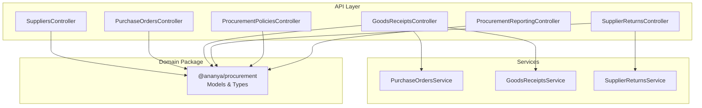
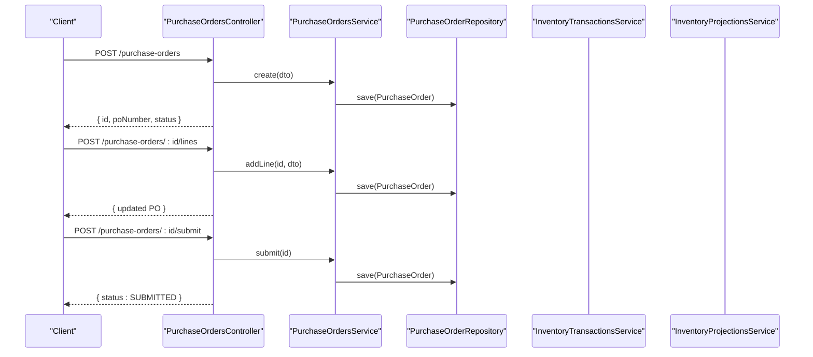
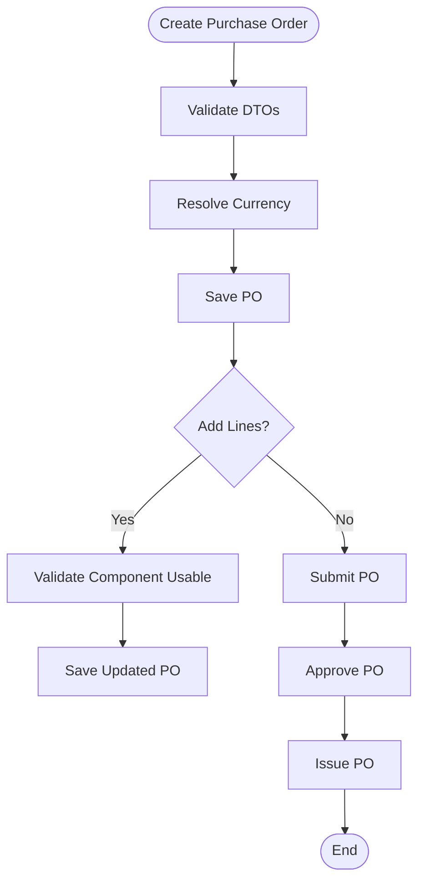
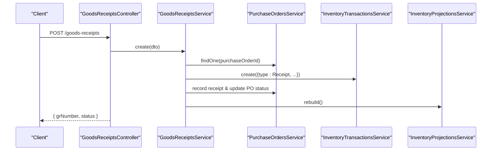
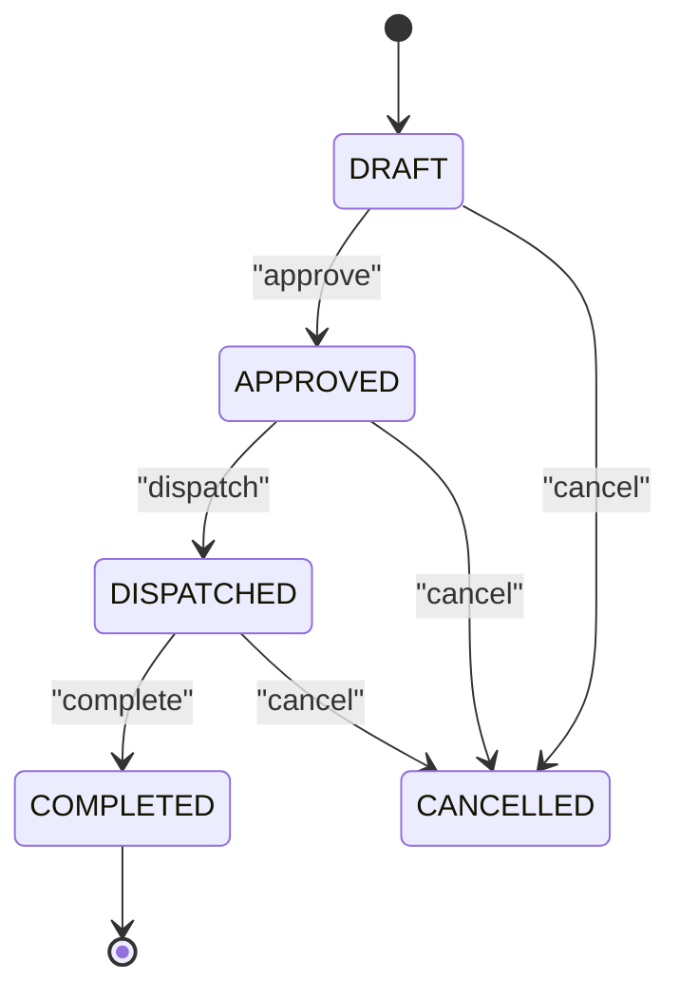
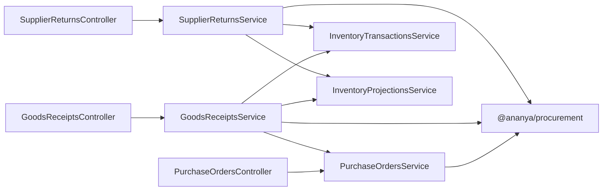
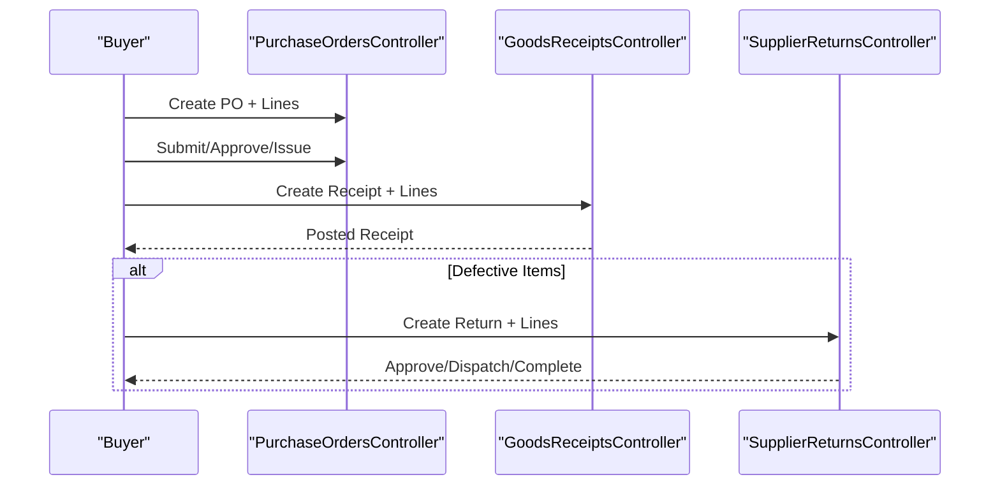

# Procurement & Supply Chain APIs

<cite>
**Referenced Files in This Document**
- [suppliers.controller.ts](file://apps/api/src/suppliers/suppliers.controller.ts)
- [dtos.ts (Suppliers)](file://apps/api/src/suppliers/dtos.ts)
- [purchase-orders.controller.ts](file://apps/api/src/purchase-orders/purchase-orders.controller.ts)
- [dtos.ts (Purchase Orders)](file://apps/api/src/purchase-orders/dtos.ts)
- [purchase-orders.service.ts](file://apps/api/src/purchase-orders/purchase-orders.service.ts)
- [goods-receipts.controller.ts](file://apps/api/src/goods-receipts/goods-receipts.controller.ts)
- [dtos.ts (Goods Receipts)](file://apps/api/src/goods-receipts/dtos.ts)
- [goods-receipts.service.ts](file://apps/api/src/goods-receipts/goods-receipts.service.ts)
- [supplier-returns.controller.ts](file://apps/api/src/supplier-returns/supplier-returns.controller.ts)
- [dtos.ts (Supplier Returns)](file://apps/api/src/supplier-returns/dtos.ts)
- [supplier-returns.service.ts](file://apps/api/src/supplier-returns/supplier-returns.service.ts)
- [procurement-policies.controller.ts](file://apps/api/src/procurement-policies/procurement-policies.controller.ts)
- [dtos.ts (Procurement Policies)](file://apps/api/src/procurement-policies/dtos.ts)
- [procurement-reporting.controller.ts](file://apps/api/src/procurement-reporting/procurement-reporting.controller.ts)
- [procurement-reporting.service.ts](file://apps/api/src/procurement-reporting/procurement-reporting.service.ts)
- [index.ts (Procurement Package)](file://packages/procurement/src/index.ts)
</cite>

## Table of Contents
1. [Introduction](#introduction)
2. [Project Structure](#project-structure)
3. [Core Components](#core-components)
4. [Architecture Overview](#architecture-overview)
5. [Detailed Component Analysis](#detailed-component-analysis)
6. [Dependency Analysis](#dependency-analysis)
7. [Performance Considerations](#performance-considerations)
8. [Troubleshooting Guide](#troubleshooting-guide)
9. [Conclusion](#conclusion)
10. [Appendices](#appendices)

## Introduction
This document provides comprehensive API documentation for procurement and supply chain management endpoints, covering supplier management, purchase order lifecycle, goods receipt processing, supplier returns, and procurement policies. It includes detailed schemas for PO line items, receipt quantities, and return processing, along with example workflows from requisition to payment. It also addresses approval workflows, vendor performance tracking, and procurement analytics endpoints.

## Project Structure
The procurement domain is implemented as a set of NestJS controllers and services under apps/api/src, with shared domain models and types exposed via the @ananya/procurement package. Key modules include:
- Suppliers: CRUD and contact/component mapping
- Purchase Orders: Lifecycle transitions (submit, approve, issue, cancel), line item management
- Goods Receipts: Creation, line addition, posting, inventory updates, and PO reconciliation
- Supplier Returns: Approval, dispatch, completion, cancellation, and inventory adjustments
- Procurement Policies: Policy configuration for thresholds and approvals
- Procurement Reporting: Analytics and reporting endpoints

**Diagram sources**
- [suppliers.controller.ts:23-80](file://apps/api/src/suppliers/suppliers.controller.ts#L23-L80)
- [purchase-orders.controller.ts:23-82](file://apps/api/src/purchase-orders/purchase-orders.controller.ts#L23-L82)
- [goods-receipts.controller.ts:14-45](file://apps/api/src/goods-receipts/goods-receipts.controller.ts#L14-L45)
- [supplier-returns.controller.ts:20-88](file://apps/api/src/supplier-returns/supplier-returns.controller.ts#L20-L88)
- [procurement-policies.controller.ts:5-23](file://apps/api/src/procurement-policies/procurement-policies.controller.ts#L5-L23)
- [procurement-reporting.controller.ts:1-200](file://apps/api/src/procurement-reporting/procurement-reporting.controller.ts#L1-L200)
- [purchase-orders.service.ts:22-144](file://apps/api/src/purchase-orders/purchase-orders.service.ts#L22-L144)
- [goods-receipts.service.ts:26-206](file://apps/api/src/goods-receipts/goods-receipts.service.ts#L26-L206)
- [supplier-returns.service.ts:23-261](file://apps/api/src/supplier-returns/supplier-returns.service.ts#L23-L261)
- [index.ts (Procurement Package):1-7](file://packages/procurement/src/index.ts#L1-L7)

**Section sources**
- [suppliers.controller.ts:23-80](file://apps/api/src/suppliers/suppliers.controller.ts#L23-L80)
- [purchase-orders.controller.ts:23-82](file://apps/api/src/purchase-orders/purchase-orders.controller.ts#L23-L82)
- [goods-receipts.controller.ts:14-45](file://apps/api/src/goods-receipts/goods-receipts.controller.ts#L14-L45)
- [supplier-returns.controller.ts:20-88](file://apps/api/src/supplier-returns/supplier-returns.controller.ts#L20-L88)
- [procurement-policies.controller.ts:5-23](file://apps/api/src/procurement-policies/procurement-policies.controller.ts#L5-L23)
- [procurement-reporting.controller.ts:1-200](file://apps/api/src/procurement-reporting/procurement-reporting.controller.ts#L1-L200)
- [index.ts (Procurement Package):1-7](file://packages/procurement/src/index.ts#L1-L7)

## Core Components
- Supplier Management: Create, update, delete suppliers; add/remove contacts; map components with vendor-specific pricing and lead times.
- Purchase Order Lifecycle: Create/update POs; add lines; submit/approve/issue/cancel; filter by supplier and status.
- Goods Receipt Processing: Create receipts against POs; add lines; post receipts to inventory; reconcile PO line receipts and statuses.
- Supplier Returns: Create returns; add/remove lines; approve/dispatch/complete/cancel; adjust inventory on dispatch and cancellation.
- Procurement Policies: Define policy type, name, threshold amounts, over-receipt tolerance, and executive approval requirements.
- Procurement Reporting: Query analytics and metrics across procurement operations (see Appendices for endpoint details).

**Section sources**
- [suppliers.controller.ts:23-80](file://apps/api/src/suppliers/suppliers.controller.ts#L23-L80)
- [purchase-orders.controller.ts:23-82](file://apps/api/src/purchase-orders/purchase-orders.controller.ts#L23-L82)
- [goods-receipts.controller.ts:14-45](file://apps/api/src/goods-receipts/goods-receipts.controller.ts#L14-L45)
- [supplier-returns.controller.ts:20-88](file://apps/api/src/supplier-returns/supplier-returns.controller.ts#L20-L88)
- [procurement-policies.controller.ts:5-23](file://apps/api/src/procurement-policies/procurement-policies.controller.ts#L5-L23)
- [procurement-reporting.controller.ts:1-200](file://apps/api/src/procurement-reporting/procurement-reporting.controller.ts#L1-L200)

## Architecture Overview
The API follows a layered architecture:
- Controllers expose REST endpoints and delegate to services.
- Services implement business logic, enforce validation, and coordinate with repositories and other services (e.g., inventory transactions and projections).
- Domain models and types are provided by the @ananya/procurement package.

**Diagram sources**
- [purchase-orders.controller.ts:28-66](file://apps/api/src/purchase-orders/purchase-orders.controller.ts#L28-L66)
- [purchase-orders.service.ts:38-121](file://apps/api/src/purchase-orders/purchase-orders.service.ts#L38-L121)

**Section sources**
- [purchase-orders.controller.ts:23-82](file://apps/api/src/purchase-orders/purchase-orders.controller.ts#L23-L82)
- [purchase-orders.service.ts:22-144](file://apps/api/src/purchase-orders/purchase-orders.service.ts#L22-L144)

## Detailed Component Analysis

### Supplier Management API
- Endpoints:
  - POST /suppliers: Create supplier
  - GET /suppliers: List suppliers (search)
  - GET /suppliers/:id: Get supplier
  - PUT /suppliers/:id: Update supplier
  - DELETE /suppliers/:id: Delete supplier
  - POST /suppliers/:id/contacts: Add contact
  - DELETE /suppliers/:id/contacts/:contactId: Remove contact
  - POST /suppliers/:id/components: Map component with vendor part number, lead time, MOQ, order multiple, unit price, currency
  - DELETE /suppliers/:id/components/:mappingId: Remove component mapping

- Request/Response Schemas:
  - CreateSupplierDto: code, name, taxId, paymentTerms, currency
  - UpdateSupplierDto: optional fields including isActive
  - AddContactDto: name, email, phone, role, isPrimary
  - MapComponentDto: componentId, vendorPartNumber, leadTimeDays, minimumOrderQuantity, orderMultiple, unitPrice, currency

- Notes:
  - All fields validated using class-validator decorators.
  - Contacts and component mappings are managed per supplier.

**Section sources**
- [suppliers.controller.ts:23-80](file://apps/api/src/suppliers/suppliers.controller.ts#L23-L80)
- [dtos.ts (Suppliers):9-107](file://apps/api/src/suppliers/dtos.ts#L9-L107)

### Purchase Order Lifecycle API
- Endpoints:
  - POST /purchase-orders: Create PO with optional lines
  - GET /purchase-orders: Filter by supplierId, status, search
  - GET /purchase-orders/:id: Get PO
  - PUT /purchase-orders/:id: Update PO fields and lines
  - DELETE /purchase-orders/:id: Delete PO
  - POST /purchase-orders/:id/lines: Add PO line
  - POST /purchase-orders/:id/submit: Submit PO
  - POST /purchase-orders/:id/approve: Approve PO
  - POST /purchase-orders/:id/issue: Issue PO
  - POST /purchase-orders/:id/cancel: Cancel PO

- Request/Response Schemas:
  - CreatePurchaseOrderDto: supplierId, currency, notes, expectedDeliveryDate, trackingNumber, carrier, shippingProvider, trackingUrl, lines[]
  - UpdatePurchaseOrderDto: optional fields including lines[]
  - AddPoLineDto: componentId, vendorPartNumber, unitPrice, quantityOrdered, taxRate

- Business Logic:
  - Currency resolution uses system settings base currency with fallback.
  - Line addition validates component usability before adding.
  - Status transitions enforced by domain model methods (submit, approve, issue, cancel).

**Diagram sources**
- [purchase-orders.service.ts:38-115](file://apps/api/src/purchase-orders/purchase-orders.service.ts#L38-L115)
- [purchase-orders.controller.ts:28-66](file://apps/api/src/purchase-orders/purchase-orders.controller.ts#L28-L66)

**Section sources**
- [purchase-orders.controller.ts:23-82](file://apps/api/src/purchase-orders/purchase-orders.controller.ts#L23-L82)
- [dtos.ts (Purchase Orders):12-104](file://apps/api/src/purchase-orders/dtos.ts#L12-L104)
- [purchase-orders.service.ts:22-144](file://apps/api/src/purchase-orders/purchase-orders.service.ts#L22-L144)

### Goods Receipt Processing API
- Endpoints:
  - POST /goods-receipts: Create receipt against PO
  - GET /goods-receipts: Filter by purchaseOrderId, supplierId
  - GET /goods-receipts/:id: Get receipt
  - POST /goods-receipts/:id/lines: Add receipt line
  - POST /goods-receipts/:id/post: Post receipt to inventory

- Request/Response Schemas:
  - CreateGoodsReceiptDto: purchaseOrderId, supplierId, packingSlipNumber, receivedAt, lines[]
  - AddGoodsReceiptLineDto: poLineId, componentId, locationId, quantityReceived, quantityRejected, batchNumber, expiryDate, serialNumbers[]

- Business Logic:
  - Validates receiving quantities against PO outstanding amounts.
  - Creates inventory transactions (Receipt) and updates PO line receipts.
  - Marks receipt completed and rebuilds inventory projections.

**Diagram sources**
- [goods-receipts.controller.ts:19-45](file://apps/api/src/goods-receipts/goods-receipts.controller.ts#L19-L45)
- [goods-receipts.service.ts:42-116](file://apps/api/src/goods-receipts/goods-receipts.service.ts#L42-L116)

**Section sources**
- [goods-receipts.controller.ts:14-45](file://apps/api/src/goods-receipts/goods-receipts.controller.ts#L14-L45)
- [dtos.ts (Goods Receipts):12-69](file://apps/api/src/goods-receipts/dtos.ts#L12-L69)
- [goods-receipts.service.ts:26-206](file://apps/api/src/goods-receipts/goods-receipts.service.ts#L26-L206)

### Supplier Returns API
- Endpoints:
  - POST /supplier-returns: Create return
  - GET /supplier-returns: Filter by supplierId, status
  - GET /supplier-returns/:id: Get return
  - PUT /supplier-returns/:id: Update return (DRAFT only)
  - DELETE /supplier-returns/:id: Delete return (DRAFT or CANCELLED only)
  - PATCH /supplier-returns/:id/status: Update status (DRAFT/APPROVED/DISPATCHED/COMPLETED/CREDITED/CANCELLED)
  - POST /supplier-returns/:id/lines: Add return line
  - DELETE /supplier-returns/:id/lines/:lineId: Remove return line
  - POST /supplier-returns/:id/approve: Approve return
  - POST /supplier-returns/:id/dispatch: Dispatch return
  - POST /supplier-returns/:id/complete: Complete return
  - POST /supplier-returns/:id/cancel: Cancel return

- Request/Response Schemas:
  - CreateSupplierReturnDto: supplierId, purchaseOrderId, rmaNumber
  - UpdateSupplierReturnDto: optional fields
  - UpdateSupplierReturnStatusDto: status, rmaNumber
  - AddSupplierReturnLineDto: componentId, locationId, quantityReturned, unitPrice, reason, batchNumber, serialNumbers[]

- Business Logic:
  - Enforces state transitions and validations (e.g., DRAFT-only modifications).
  - Validates stock availability at selected locations before adding/removing lines and dispatching.
  - Issues inventory transactions on dispatch; restores stock on cancellation.

**Diagram sources**
- [supplier-returns.service.ts:122-226](file://apps/api/src/supplier-returns/supplier-returns.service.ts#L122-L226)

**Section sources**
- [supplier-returns.controller.ts:20-88](file://apps/api/src/supplier-returns/supplier-returns.controller.ts#L20-L88)
- [dtos.ts (Supplier Returns):9-76](file://apps/api/src/supplier-returns/dtos.ts#L9-L76)
- [supplier-returns.service.ts:23-261](file://apps/api/src/supplier-returns/supplier-returns.service.ts#L23-L261)

### Procurement Policies API
- Endpoints:
  - POST /procurement-policies: Create policy
  - GET /procurement-policies: List policies
  - GET /procurement-policies/:id: Get policy

- Request/Response Schemas:
  - CreateProcurementPolicyDto: policyType, name, thresholdAmount, overReceiptTolerancePercent, requiresExecutiveApproval

- Notes:
  - PolicyType is imported from @ananya/procurement.
  - Policies can drive approval workflows and tolerances.

**Section sources**
- [procurement-policies.controller.ts:5-23](file://apps/api/src/procurement-policies/procurement-policies.controller.ts#L5-L23)
- [dtos.ts (Procurement Policies):10-30](file://apps/api/src/procurement-policies/dtos.ts#L10-L30)

### Procurement Reporting API
- Endpoints:
  - See procurement-reporting.controller.ts for available analytics endpoints (e.g., spend analysis, supplier performance, PO cycle times).
  - Service layer aggregates data from procurement modules and inventory systems.

- Notes:
  - Use these endpoints to build dashboards and reports for procurement analytics.

**Section sources**
- [procurement-reporting.controller.ts:1-200](file://apps/api/src/procurement-reporting/procurement-reporting.controller.ts#L1-L200)
- [procurement-reporting.service.ts:1-200](file://apps/api/src/procurement-reporting/procurement-reporting.service.ts#L1-L200)

## Dependency Analysis
- Controllers depend on services for business logic.
- Services depend on repositories and cross-cutting services:
  - GoodsReceiptsService depends on PurchaseOrdersService, InventoryTransactionsService, and InventoryProjectionsService.
  - SupplierReturnsService depends on InventoryTransactionsService and InventoryProjectionsService.
- Domain models and enums are provided by @ananya/procurement package.

**Diagram sources**
- [purchase-orders.controller.ts:23-82](file://apps/api/src/purchase-orders/purchase-orders.controller.ts#L23-L82)
- [goods-receipts.controller.ts:14-45](file://apps/api/src/goods-receipts/goods-receipts.controller.ts#L14-L45)
- [supplier-returns.controller.ts:20-88](file://apps/api/src/supplier-returns/supplier-returns.controller.ts#L20-L88)
- [purchase-orders.service.ts:22-144](file://apps/api/src/purchase-orders/purchase-orders.service.ts#L22-L144)
- [goods-receipts.service.ts:26-206](file://apps/api/src/goods-receipts/goods-receipts.service.ts#L26-L206)
- [supplier-returns.service.ts:23-261](file://apps/api/src/supplier-returns/supplier-returns.service.ts#L23-L261)
- [index.ts (Procurement Package):1-7](file://packages/procurement/src/index.ts#L1-L7)

**Section sources**
- [purchase-orders.service.ts:22-144](file://apps/api/src/purchase-orders/purchase-orders.service.ts#L22-L144)
- [goods-receipts.service.ts:26-206](file://apps/api/src/goods-receipts/goods-receipts.service.ts#L26-L206)
- [supplier-returns.service.ts:23-261](file://apps/api/src/supplier-returns/supplier-returns.service.ts#L23-L261)
- [index.ts (Procurement Package):1-7](file://packages/procurement/src/index.ts#L1-L7)

## Performance Considerations
- Inventory projection rebuilds are triggered after significant changes (receipt posting, return dispatch/cancellation). Ensure background jobs handle heavy loads during peak periods.
- Batch operations:
  - For large receipts or returns, consider batching line processing to reduce database round-trips.
- Validation overhead:
  - Pre-validate component IDs and location IDs to minimize service-side checks.
- Caching:
  - Cache frequently accessed supplier and policy data where appropriate.

[No sources needed since this section provides general guidance]

## Troubleshooting Guide
Common errors and resolutions:
- Exceeded remaining quantity when creating goods receipt lines:
  - Ensure quantityReceived does not exceed PO line outstanding quantity.
- Cannot modify non-DRAFT return:
  - Only DRAFT returns allow line additions/removals and detail updates.
- Insufficient stock for return lines:
  - Verify available stock at the selected location before adding lines or dispatching.
- Invalid status transitions:
  - Follow allowed state transitions for supplier returns (DRAFT -> APPROVED -> DISPATCHED -> COMPLETED; cancellations allowed from DRAFT/APPROVED/DISPATCHED).

**Section sources**
- [goods-receipts.service.ts:42-60](file://apps/api/src/goods-receipts/goods-receipts.service.ts#L42-L60)
- [supplier-returns.service.ts:63-109](file://apps/api/src/supplier-returns/supplier-returns.service.ts#L63-L109)
- [supplier-returns.service.ts:129-181](file://apps/api/src/supplier-returns/supplier-returns.service.ts#L129-L181)

## Conclusion
The procurement and supply chain APIs provide a robust foundation for managing suppliers, purchase orders, goods receipts, supplier returns, and procurement policies. The services enforce business rules, integrate with inventory systems, and support analytics through reporting endpoints. Use the schemas and workflows documented here to implement end-to-end procurement processes from requisition to payment.

[No sources needed since this section summarizes without analyzing specific files]

## Appendices

### Example Procurement Workflow: Requisition to Payment
- Steps:
  1. Create supplier and map components if needed.
  2. Create purchase order with line items.
  3. Submit and approve the PO.
  4. Issue the PO to the supplier.
  5. Receive goods via goods receipts; post to inventory.
  6. If issues arise, process supplier returns (approve, dispatch, complete).
  7. Generate purchase invoices and process payments (via finance modules).

**Diagram sources**
- [purchase-orders.controller.ts:28-76](file://apps/api/src/purchase-orders/purchase-orders.controller.ts#L28-L76)
- [goods-receipts.controller.ts:19-45](file://apps/api/src/goods-receipts/goods-receipts.controller.ts#L19-L45)
- [supplier-returns.controller.ts:24-88](file://apps/api/src/supplier-returns/supplier-returns.controller.ts#L24-L88)

### Approval Workflows
- PO approval:
  - Use POST /purchase-orders/:id/approve to transition to approved state.
- Supplier return approval:
  - Use POST /supplier-returns/:id/approve to transition to approved state.
- Policy-driven approvals:
  - Configure thresholds and executive approval requirements via procurement policies.

**Section sources**
- [purchase-orders.controller.ts:63-71](file://apps/api/src/purchase-orders/purchase-orders.controller.ts#L63-L71)
- [supplier-returns.controller.ts:70-73](file://apps/api/src/supplier-returns/supplier-returns.controller.ts#L70-L73)
- [procurement-policies.controller.ts:9-22](file://apps/api/src/procurement-policies/procurement-policies.controller.ts#L9-L22)

### Vendor Performance Tracking
- Metrics to track:
  - On-time delivery rate (compare expected vs actual receipt dates).
  - Quality metrics (return rates, reasons).
  - Spend per supplier and category.
- Use procurement reporting endpoints to aggregate and visualize these metrics.

**Section sources**
- [procurement-reporting.controller.ts:1-200](file://apps/api/src/procurement-reporting/procurement-reporting.controller.ts#L1-L200)
- [procurement-reporting.service.ts:1-200](file://apps/api/src/procurement-reporting/procurement-reporting.service.ts#L1-L200)

### Procurement Analytics Endpoints
- Typical endpoints:
  - Spend analysis by supplier/category/timeframe
  - PO cycle time metrics
  - Supplier performance scores
  - Over-receipt and under-receipt trends
- Refer to procurement-reporting.controller.ts and service for exact paths and query parameters.

**Section sources**
- [procurement-reporting.controller.ts:1-200](file://apps/api/src/procurement-reporting/procurement-reporting.controller.ts#L1-L200)
- [procurement-reporting.service.ts:1-200](file://apps/api/src/procurement-reporting/procurement-reporting.service.ts#L1-L200)