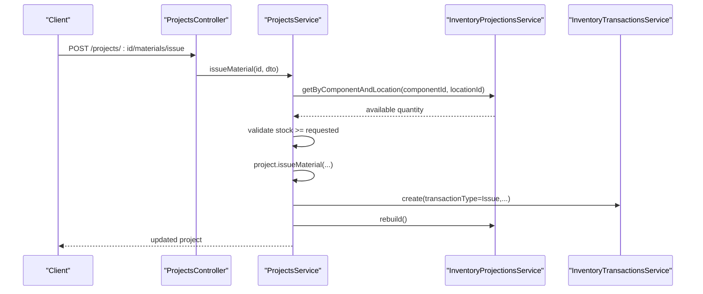
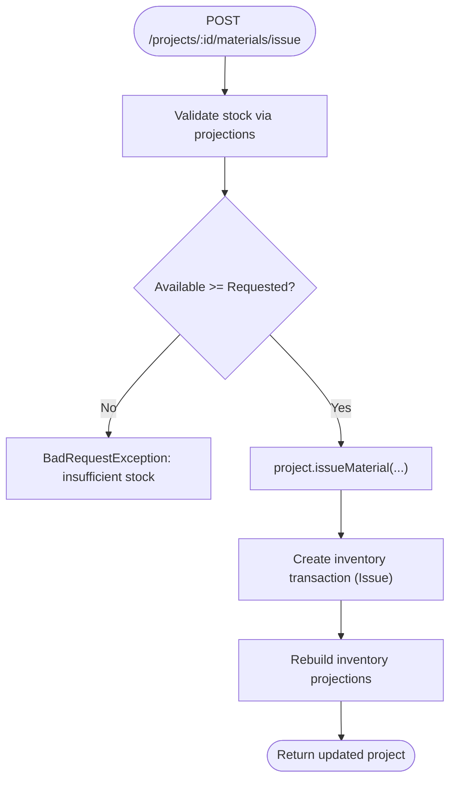
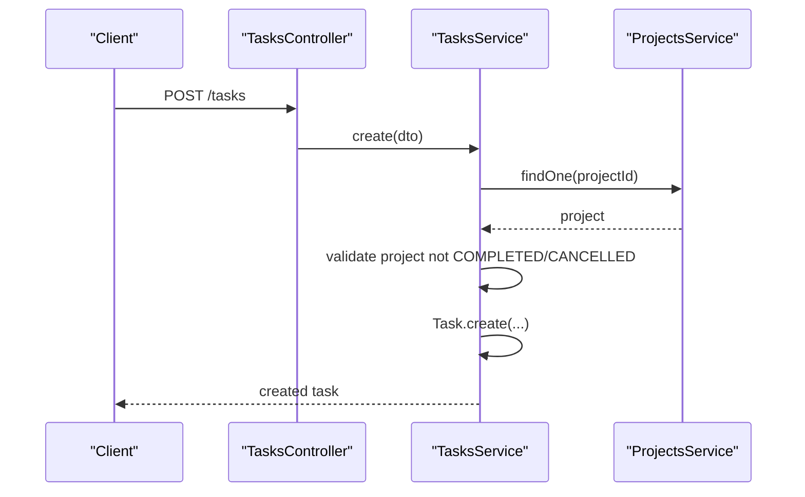
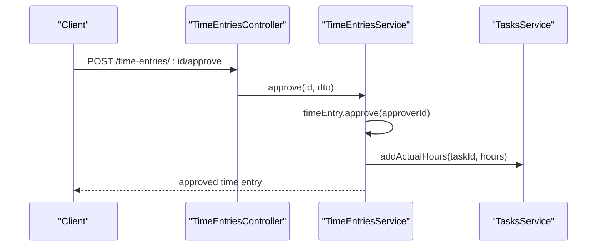
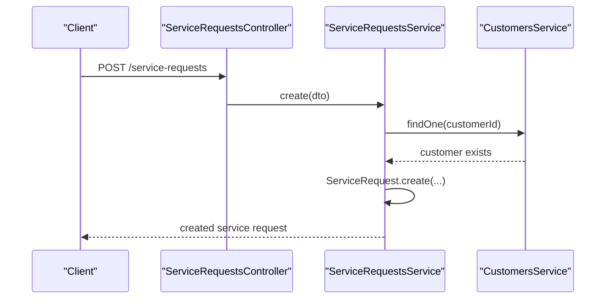
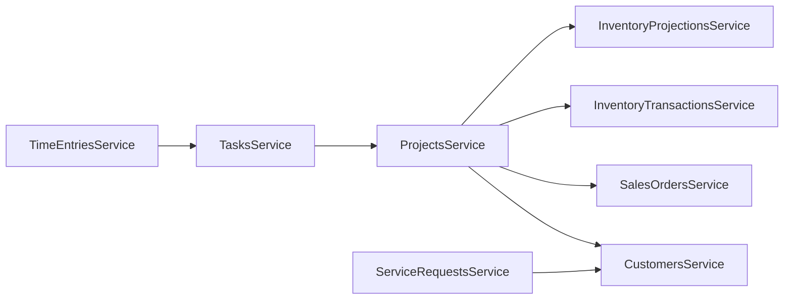

# Project & Service APIs

<cite>
**Referenced Files in This Document**
- [projects.controller.ts](file://apps/api/src/projects/projects.controller.ts)
- [projects.service.ts](file://apps/api/src/projects/projects.service.ts)
- [projects/dtos.ts](file://apps/api/src/projects/dtos.ts)
- [tasks.controller.ts](file://apps/api/src/tasks/tasks.controller.ts)
- [tasks.service.ts](file://apps/api/src/tasks/tasks.service.ts)
- [tasks/dtos.ts](file://apps/api/src/tasks/dtos.ts)
- [time-entries.controller.ts](file://apps/api/src/time-entries/time-entries.controller.ts)
- [time-entries.service.ts](file://apps/api/src/time-entries/time-entries.service.ts)
- [time-entries/dtos.ts](file://apps/api/src/time-entries/dtos.ts)
- [service-requests.controller.ts](file://apps/api/src/service-requests/service-requests.controller.ts)
- [service-requests.service.ts](file://apps/api/src/service-requests/service-requests.service.ts)
- [service-requests/dtos.ts](file://apps/api/src/service-requests/dtos.ts)
- [warranty-claims.controller.ts](file://apps/api/src/warranty-claims/warranty-claims.controller.ts)
- [warranty-claims/dtos.ts](file://apps/api/src/warranty-claims/dtos.ts)
- [maintenance-schedules.controller.ts](file://apps/api/src/maintenance-schedules/maintenance-schedules.controller.ts)
- [maintenance-schedules/dtos.ts](file://apps/api/src/maintenance-schedules/maintenance-schedules/dtos.ts)
- [service-notes.controller.ts](file://apps/api/src/service-notes/service-notes.controller.ts)
- [service-notes/dtos.ts](file://apps/api/src/service-notes/dtos.ts)
</cite>

## Table of Contents
1. Introduction
2. Project Structure
3. Core Components
4. Architecture Overview
5. Detailed Component Analysis
6. Dependency Analysis
7. Performance Considerations
8. Troubleshooting Guide
9. Conclusion
10. Appendices

## Introduction
This document provides detailed API documentation for project management and service endpoints across projects, tasks, time tracking, service requests, warranty claims, maintenance schedules, and service notes. It covers the project lifecycle, task dependencies, time tracking workflows, and service request management. Schemas for project entities, time entries, and service workflows are included, along with examples illustrating planning, execution, and service delivery processes.

## Project Structure
The API is organized by domain modules under apps/api/src, each exposing a NestJS controller that delegates to a service. Services encapsulate business logic, enforce validation via DTOs, and interact with repositories and other services (e.g., customers, sales orders, inventory).

```mermaid
graph TB
subgraph "Projects"
PCtrl["ProjectsController"]
PSvc["ProjectsService"]
end
subgraph "Tasks"
TCtrl["TasksController"]
TSvc["TasksService"]
end
subgraph "Time Entries"
TE Ctrl["TimeEntriesController"]
TESvc["TimeEntriesService"]
end
subgraph "Service Requests"
SR Ctrl["ServiceRequestsController"]
SRSvc["ServiceRequestsService"]
end
subgraph "Warranty Claims"
WC Ctrl["WarrantyClaimsController"]
end
subgraph "Maintenance Schedules"
MS Ctrl["MaintenanceSchedulesController"]
end
subgraph "Service Notes"
SN Ctrl["ServiceNotesController"]
end
PCtrl --> PSvc
TCtrl --> TSvc
TE Ctrl --> TESvc
SR Ctrl --> SRSvc
WC Ctrl -.->|"uses"@| SRSvc
MS Ctrl -.->|"uses"@| SRSvc
SN Ctrl -.->|"links to"@| SR Ctrl
```

[No sources needed since this diagram shows conceptual workflow, not actual code structure]

## Core Components
- Projects: Create, update, list, find, start/pause/complete/archive/cancel, add milestones, allocate/issue/return materials.
- Tasks: Create, list, find, assign, start/block/complete/cancel; enforced by project status.
- Time Entries: Create, list, find, approve/reject; approval updates task actual hours.
- Service Requests: Create, list, find, assign, diagnose, set waiting parts, start repair, complete/close/cancel.
- Warranty Claims: Create, list, find, review/approve/reject with optional notes.
- Maintenance Schedules: Create, list, find, pause/resume, complete visit/plan, cancel.
- Service Notes: Create, list, find; linkable to service requests, work orders, or warranty claims.

**Section sources**
- [projects.controller.ts:24-119](file://apps/api/src/projects/projects.controller.ts#L24-L119)
- [tasks.controller.ts:6-61](file://apps/api/src/tasks/tasks.controller.ts#L6-L61)
- [time-entries.controller.ts:6-46](file://apps/api/src/time-entries/time-entries.controller.ts#L6-L46)
- [service-requests.controller.ts:14-83](file://apps/api/src/service-requests/service-requests.controller.ts#L14-L83)
- [warranty-claims.controller.ts:6-49](file://apps/api/src/warranty-claims/warranty-claims.controller.ts#L6-L49)
- [maintenance-schedules.controller.ts:6-63](file://apps/api/src/maintenance-schedules/maintenance-schedules.controller.ts#L6-L63)
- [service-notes.controller.ts:5-31](file://apps/api/src/service-notes/service-notes.controller.ts#L5-L31)

## Architecture Overview
Controllers expose REST endpoints and delegate to services. Services validate inputs via DTOs, enforce business rules, coordinate cross-service operations (e.g., inventory projections), and persist changes through repositories.



**Diagram sources**
- [projects.controller.ts:111-114](file://apps/api/src/projects/projects.controller.ts#L111-L114)
- [projects.service.ts:216-253](file://apps/api/src/projects/projects.service.ts#L216-L253)

**Section sources**
- [projects.service.ts:40-66](file://apps/api/src/projects/projects.service.ts#L40-L66)
- [projects.service.ts:185-214](file://apps/api/src/projects/projects.service.ts#L185-L214)
- [projects.service.ts:216-253](file://apps/api/src/projects/projects.service.ts#L216-L253)
- [projects.service.ts:256-280](file://apps/api/src/projects/projects.service.ts#L256-L280)

## Detailed Component Analysis

### Projects
- Endpoints:
  - POST /projects: Create project
  - GET /projects: List with filters (status, priority, customerId, salesOrderId, projectManager, search)
  - GET /projects/:id: Find by id
  - PUT /projects/:id: Update project
  - POST /projects/:id/start|pause|complete|archive|cancel: Lifecycle actions
  - POST /projects/:id/milestones: Add milestone
  - POST /projects/:id/milestones/:milestoneId/complete: Complete milestone
  - POST /projects/:id/materials/allocate|issue|return: Material operations
- Business rules:
  - Creation validates referenced customer/sales order if provided.
  - Material allocation/issue validates available stock via inventory projections before mutating project state.
  - Issue/Return log inventory transactions and rebuild projections.
- Key DTOs:
  - CreateProjectDto, UpdateProjectDto, ProjectActionDto, AllocateMaterialDto, IssueMaterialDto, ReturnMaterialDto, AddMilestoneDto



**Diagram sources**
- [projects.service.ts:216-253](file://apps/api/src/projects/projects.service.ts#L216-L253)

**Section sources**
- [projects.controller.ts:24-119](file://apps/api/src/projects/projects.controller.ts#L24-L119)
- [projects.service.ts:40-66](file://apps/api/src/projects/projects.service.ts#L40-L66)
- [projects.service.ts:99-123](file://apps/api/src/projects/projects.service.ts#L99-L123)
- [projects.service.ts:125-158](file://apps/api/src/projects/projects.service.ts#L125-L158)
- [projects.service.ts:160-183](file://apps/api/src/projects/projects.service.ts#L160-L183)
- [projects.service.ts:185-214](file://apps/api/src/projects/projects.service.ts#L185-L214)
- [projects.service.ts:216-253](file://apps/api/src/projects/projects.service.ts#L216-L253)
- [projects.service.ts:256-280](file://apps/api/src/projects/projects.service.ts#L256-L280)
- [projects/dtos.ts:10-183](file://apps/api/src/projects/dtos.ts#L10-L183)

### Tasks
- Endpoints:
  - POST /tasks: Create task
  - GET /tasks: List with filters (projectId, assignedUser, status, priority, search)
  - GET /tasks/:id: Find by id
  - POST /tasks/:id/assign: Assign user
  - POST /tasks/:id/start|block|complete|cancel: Task lifecycle
- Business rules:
  - Cannot create tasks on completed or cancelled projects.
  - Approving time entries adds actual hours to the task.
- Key DTOs:
  - CreateTaskDto, AssignTaskDto



**Diagram sources**
- [tasks.controller.ts:10-13](file://apps/api/src/tasks/tasks.controller.ts#L10-L13)
- [tasks.service.ts:26-46](file://apps/api/src/tasks/tasks.service.ts#L26-L46)

**Section sources**
- [tasks.controller.ts:6-61](file://apps/api/src/tasks/tasks.controller.ts#L6-L61)
- [tasks.service.ts:26-46](file://apps/api/src/tasks/tasks.service.ts#L26-L46)
- [tasks.service.ts:72-113](file://apps/api/src/tasks/tasks.service.ts#L72-L113)
- [tasks/dtos.ts:10-41](file://apps/api/src/tasks/dtos.ts#L10-L41)

### Time Entries
- Endpoints:
  - POST /time-entries: Create time entry
  - GET /time-entries: List with filters (userId, taskId, status, startDate, endDate)
  - GET /time-entries/:id: Find by id
  - POST /time-entries/:id/approve: Approve with approverId
  - POST /time-entries/:id/reject: Reject
- Business rules:
  - Cannot log time against tasks in DONE or CANCELLED status.
  - Approval updates the associated task’s actual hours.
- Key DTOs:
  - CreateTimeEntryDto, ApproveTimeEntryDto



**Diagram sources**
- [time-entries.controller.ts:37-40](file://apps/api/src/time-entries/time-entries.controller.ts#L37-L40)
- [time-entries.service.ts:68-74](file://apps/api/src/time-entries/time-entries.service.ts#L68-L74)
- [tasks.service.ts:107-113](file://apps/api/src/tasks/tasks.service.ts#L107-L113)

**Section sources**
- [time-entries.controller.ts:6-46](file://apps/api/src/time-entries/time-entries.controller.ts#L6-L46)
- [time-entries.service.ts:25-42](file://apps/api/src/time-entries/time-entries.service.ts#L25-L42)
- [time-entries.service.ts:44-81](file://apps/api/src/time-entries/time-entries.service.ts#L44-L81)
- [time-entries/dtos.ts:11-39](file://apps/api/src/time-entries/dtos.ts#L11-L39)

### Service Requests
- Endpoints:
  - POST /service-requests: Create service request
  - GET /service-requests: List with filters (status, priority, category, customerId, assignedTechnician, search)
  - GET /service-requests/:id: Find by id
  - POST /service-requests/:id/assign: Assign technician
  - POST /service-requests/:id/diagnose: Diagnose with notes
  - POST /service-requests/:id/waiting-parts: Set waiting parts
  - POST /service-requests/:id/start-repair: Start repair
  - POST /service-requests/:id/complete: Complete
  - POST /service-requests/:id/close: Close
  - POST /service-requests/:id/cancel: Cancel
- Business rules:
  - Creation validates referenced customer if provided.
- Key DTOs:
  - CreateServiceRequestDto, AssignServiceRequestDto, DiagnoseServiceRequestDto



**Diagram sources**
- [service-requests.controller.ts:20-23](file://apps/api/src/service-requests/service-requests.controller.ts#L20-L23)
- [service-requests.service.ts:26-44](file://apps/api/src/service-requests/service-requests.service.ts#L26-L44)

**Section sources**
- [service-requests.controller.ts:14-83](file://apps/api/src/service-requests/service-requests.controller.ts#L14-L83)
- [service-requests.service.ts:26-44](file://apps/api/src/service-requests/service-requests.service.ts#L26-L44)
- [service-requests.service.ts:72-125](file://apps/api/src/service-requests/service-requests.service.ts#L72-L125)
- [service-requests/dtos.ts:4-53](file://apps/api/src/service-requests/dtos.ts#L4-L53)

### Warranty Claims
- Endpoints:
  - POST /warranty-claims: Create claim
  - GET /warranty-claims: List with filters (customerId, productId, decision, search)
  - GET /warranty-claims/:id: Find by id
  - POST /warranty-claims/:id/review: Review
  - POST /warranty-claims/:id/approve: Approve with optional notes
  - POST /warranty-claims/:id/reject: Reject with optional notes
- Key DTOs:
  - CreateWarrantyClaimDto, DecisionNotesDto

**Section sources**
- [warranty-claims.controller.ts:6-49](file://apps/api/src/warranty-claims/warranty-claims.controller.ts#L6-L49)
- [warranty-claims/dtos.ts:8-39](file://apps/api/src/warranty-claims/dtos.ts#L8-L39)

### Maintenance Schedules
- Endpoints:
  - POST /maintenance-schedules: Create schedule
  - GET /maintenance-schedules: List with filters (customerId, assignedTechnician, status, frequency, search)
  - GET /maintenance-schedules/:id: Find by id
  - POST /maintenance-schedules/:id/pause|resume: Pause/resume
  - POST /maintenance-schedules/:id/complete-visit|complete-plan: Complete visit/plan
  - POST /maintenance-schedules/:id/cancel: Cancel
- Key DTOs:
  - CreateMaintenanceScheduleDto

**Section sources**
- [maintenance-schedules.controller.ts:6-63](file://apps/api/src/maintenance-schedules/maintenance-schedules.controller.ts#L6-L63)
- [maintenance-schedules/dtos.ts:9-38](file://apps/api/src/maintenance-schedules/maintenance-schedules/dtos.ts#L9-L38)

### Service Notes
- Endpoints:
  - POST /service-notes: Create note
  - GET /service-notes: List with filters (serviceRequestId, workOrderId, warrantyClaimId)
  - GET /service-notes/:id: Find by id
- Key DTOs:
  - CreateServiceNoteDto

**Section sources**
- [service-notes.controller.ts:5-31](file://apps/api/src/service-notes/service-notes.controller.ts#L5-L31)
- [service-notes/dtos.ts:3-24](file://apps/api/src/service-notes/dtos.ts#L3-L24)

## Dependency Analysis
- Cross-module dependencies:
  - ProjectsService depends on CustomersService, SalesOrdersService, InventoryTransactionsService, InventoryProjectionsService.
  - TasksService depends on ProjectsService to enforce project status constraints.
  - TimeEntriesService depends on TasksService to update actual hours upon approval.
  - ServiceRequestsService depends on CustomersService for reference validation.
- Repository injection:
  - Each service uses an injected repository token (e.g., PROJECT_REPOSITORY, TASK_REPOSITORY) to persist data.



**Diagram sources**
- [projects.service.ts:31-38](file://apps/api/src/projects/projects.service.ts#L31-L38)
- [tasks.service.ts:20-24](file://apps/api/src/tasks/tasks.service.ts#L20-L24)
- [time-entries.service.ts:19-23](file://apps/api/src/time-entries/time-entries.service.ts#L19-L23)
- [service-requests.service.ts:20-24](file://apps/api/src/service-requests/service-requests.service.ts#L20-L24)

**Section sources**
- [projects.service.ts:31-38](file://apps/api/src/projects/projects.service.ts#L31-L38)
- [tasks.service.ts:20-24](file://apps/api/src/tasks/tasks.service.ts#L20-L24)
- [time-entries.service.ts:19-23](file://apps/api/src/time-entries/time-entries.service.ts#L19-L23)
- [service-requests.service.ts:20-24](file://apps/api/src/service-requests/service-requests.service.ts#L20-L24)

## Performance Considerations
- Avoid unnecessary projection rebuilds: Only rebuild inventory projections after material issues/returns where physical stock changes.
- Batch queries: Use list endpoints with filters to reduce round trips when retrieving multiple resources.
- Idempotent actions: Ensure lifecycle transitions (start/pause/complete/archive/cancel) are validated server-side to prevent redundant operations.
- Indexing: Ensure database indexes exist on frequently filtered fields such as status, priority, customerId, and dates.

[No sources needed since this section provides general guidance]

## Troubleshooting Guide
Common errors and handling:
- Not found:
  - GET /projects/:id, /tasks/:id, /time-entries/:id, /service-requests/:id return not found when entity does not exist.
- Bad request:
  - Creating tasks on completed/cancelled projects.
  - Logging time entries against done/cancelled tasks.
  - Allocating/issuing materials without sufficient stock.
- Validation:
  - DTOs enforce required fields and value ranges (e.g., hours between 0.1 and 24).

**Section sources**
- [projects.service.ts:117-123](file://apps/api/src/projects/projects.service.ts#L117-L123)
- [tasks.service.ts:26-46](file://apps/api/src/tasks/tasks.service.ts#L26-L46)
- [time-entries.service.ts:25-42](file://apps/api/src/time-entries/time-entries.service.ts#L25-L42)
- [projects.service.ts:191-202](file://apps/api/src/projects/projects.service.ts#L191-L202)
- [projects.service.ts:219-230](file://apps/api/src/projects/projects.service.ts#L219-L230)
- [time-entries/dtos.ts:24-27](file://apps/api/src/time-entries/dtos.ts#L24-L27)

## Conclusion
The API provides a comprehensive set of endpoints to manage projects, tasks, time entries, service requests, warranty claims, maintenance schedules, and service notes. Business rules ensure data integrity across domains, while clear lifecycle endpoints support planning, execution, and service delivery workflows. Use the schemas and examples below to integrate effectively.

[No sources needed since this section summarizes without analyzing specific files]

## Appendices

### API Schemas and Examples

#### Projects
- CreateProjectDto fields: name, projectType, description, owner, projectManager, customerId, salesOrderId, startDate, targetCompletionDate, priority, performedBy
- UpdateProjectDto: same fields as CreateProjectDto but all optional
- ProjectActionDto: performedBy
- AllocateMaterialDto: componentId, locationId, quantity, unitOfMeasure, notes, performedBy
- IssueMaterialDto: componentId, locationId, quantity, performedBy
- ReturnMaterialDto: componentId, locationId, quantity, performedBy
- AddMilestoneDto: name, dueDate, completionPercentage

Example usage:
- Plan a project: POST /projects with name, projectManager, startDate, targetCompletionDate, priority.
- Add milestones: POST /projects/:id/milestones with name and dueDate.
- Allocate materials: POST /projects/:id/materials/allocate with componentId, locationId, quantity.
- Issue materials: POST /projects/:id/materials/issue with componentId, locationId, quantity.

**Section sources**
- [projects/dtos.ts:10-183](file://apps/api/src/projects/dtos.ts#L10-L183)
- [projects.controller.ts:29-119](file://apps/api/src/projects/projects.controller.ts#L29-L119)

#### Tasks
- CreateTaskDto fields: projectId, title, description, assignedUser, estimatedHours, priority
- AssignTaskDto fields: userId

Example usage:
- Create task: POST /tasks with projectId, title, estimatedHours.
- Assign task: POST /tasks/:id/assign with userId.
- Start/Block/Complete/Cancel: POST /tasks/:id/{action}.

**Section sources**
- [tasks/dtos.ts:10-41](file://apps/api/src/tasks/dtos.ts#L10-L41)
- [tasks.controller.ts:10-61](file://apps/api/src/tasks/tasks.controller.ts#L10-L61)

#### Time Entries
- CreateTimeEntryDto fields: userId, taskId, date, hours, description
- ApproveTimeEntryDto fields: approverId

Example usage:
- Log time: POST /time-entries with taskId, date, hours.
- Approve: POST /time-entries/:id/approve with approverId.
- Reject: POST /time-entries/:id/reject.

**Section sources**
- [time-entries/dtos.ts:11-39](file://apps/api/src/time-entries/dtos.ts#L11-L39)
- [time-entries.controller.ts:10-46](file://apps/api/src/time-entries/time-entries.controller.ts#L10-L46)

#### Service Requests
- CreateServiceRequestDto fields: customerId, salesOrderId, projectId, componentId, serialNumber, title, description, priority, category
- AssignServiceRequestDto fields: technician
- DiagnoseServiceRequestDto fields: notes

Example usage:
- Create request: POST /service-requests with customerId, title, category.
- Assign: POST /service-requests/:id/assign with technician.
- Diagnose: POST /service-requests/:id/diagnose with notes.
- Start repair/Complete/Close/Cancel: POST /service-requests/:id/{action}.

**Section sources**
- [service-requests/dtos.ts:4-53](file://apps/api/src/service-requests/dtos.ts#L4-L53)
- [service-requests.controller.ts:20-83](file://apps/api/src/service-requests/service-requests.controller.ts#L20-L83)

#### Warranty Claims
- CreateWarrantyClaimDto fields: customerId, productId, serialNumber, purchaseDate, expiryDate, claimReason
- DecisionNotesDto fields: notes

Example usage:
- Create claim: POST /warranty-claims with customerId, productId, purchaseDate, expiryDate, claimReason.
- Review/Approve/Reject: POST /warranty-claims/:id/{action} with optional notes.

**Section sources**
- [warranty-claims/dtos.ts:8-39](file://apps/api/src/warranty-claims/dtos.ts#L8-L39)
- [warranty-claims.controller.ts:10-49](file://apps/api/src/warranty-claims/warranty-claims.controller.ts#L10-L49)

#### Maintenance Schedules
- CreateMaintenanceScheduleDto fields: customerId, assetName, serialNumber, frequency, nextVisitDate, assignedTechnician, notes

Example usage:
- Create schedule: POST /maintenance-schedules with customerId, assetName, frequency, nextVisitDate.
- Pause/Resume: POST /maintenance-schedules/:id/{action}.
- Complete visit/plan: POST /maintenance-schedules/:id/{action}.
- Cancel: POST /maintenance-schedules/:id/cancel.

**Section sources**
- [maintenance-schedules/dtos.ts:9-38](file://apps/api/src/maintenance-schedules/maintenance-schedules/dtos.ts#L9-L38)
- [maintenance-schedules.controller.ts:12-63](file://apps/api/src/maintenance-schedules/maintenance-schedules.controller.ts#L12-L63)

#### Service Notes
- CreateServiceNoteDto fields: serviceRequestId, workOrderId, warrantyClaimId, author, body

Example usage:
- Create note: POST /service-notes with author, body, and one of serviceRequestId/workOrderId/warrantyClaimId.
- List by context: GET /service-notes?serviceRequestId=...

**Section sources**
- [service-notes/dtos.ts:3-24](file://apps/api/src/service-notes/dtos.ts#L3-L24)
- [service-notes.controller.ts:9-31](file://apps/api/src/service-notes/service-notes.controller.ts#L9-L31)