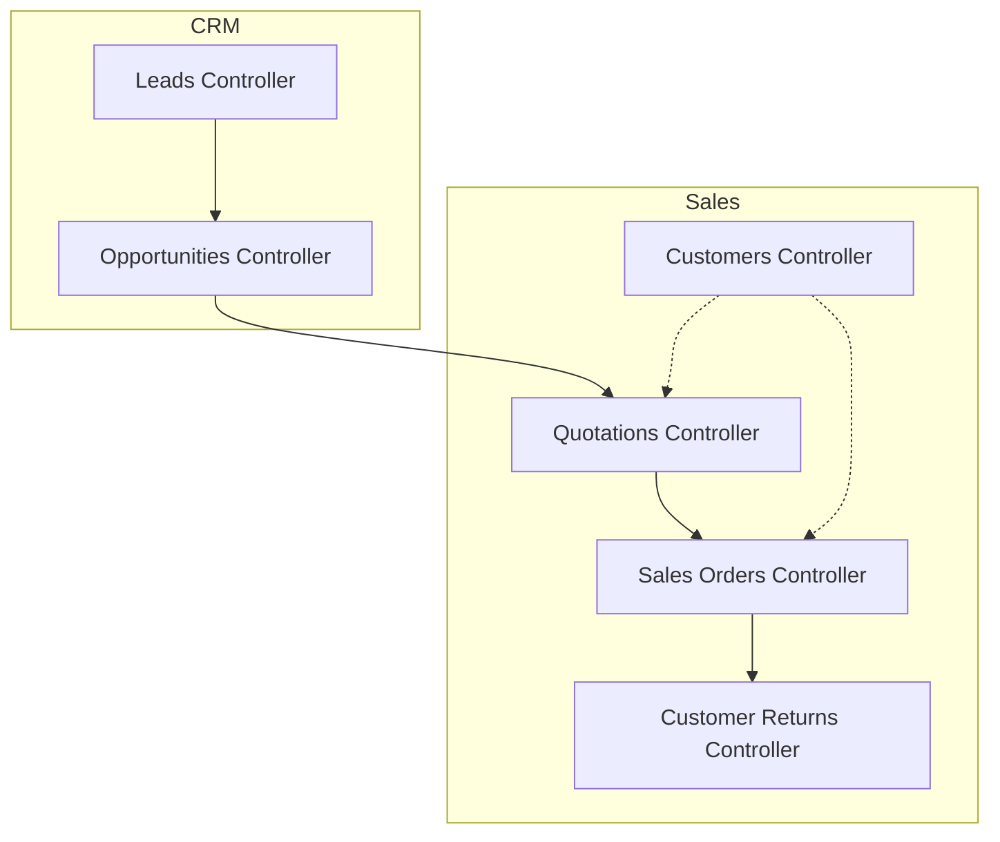
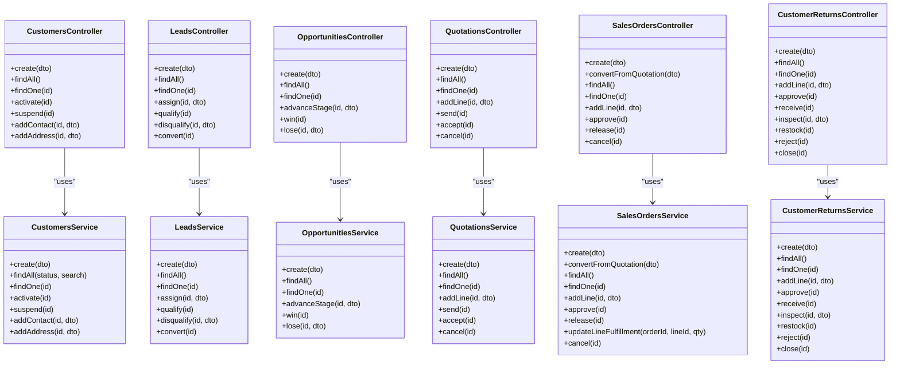
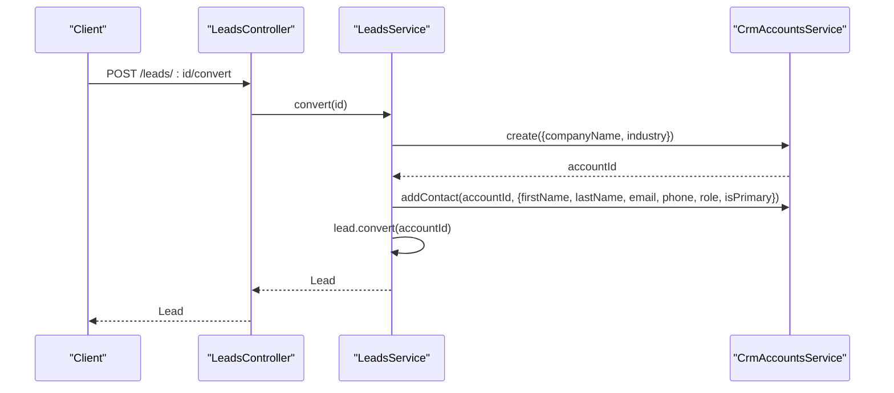
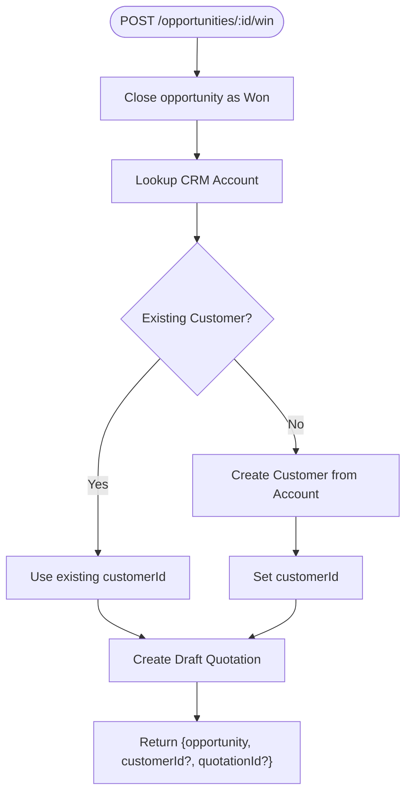
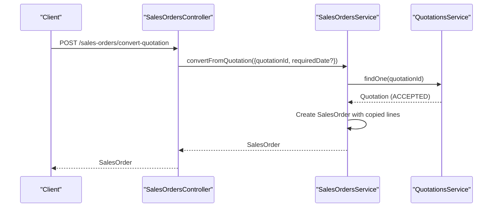
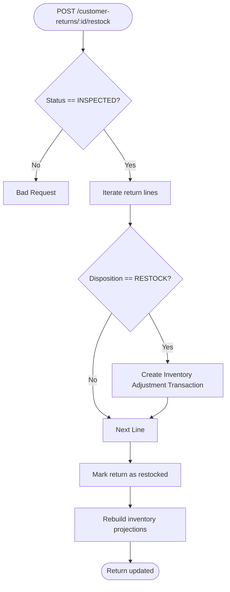
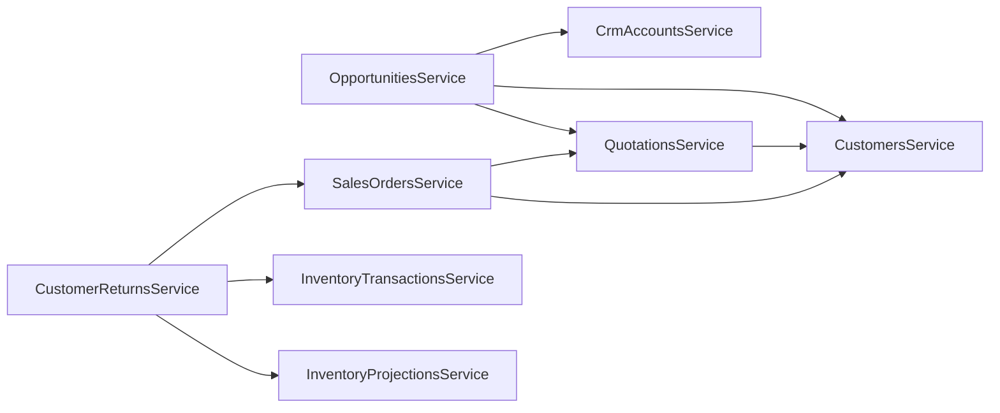

# Sales & CRM APIs

<cite>
**Referenced Files in This Document**
- [customers.controller.ts](file://apps/api/src/customers/customers.controller.ts)
- [customers.service.ts](file://apps/api/src/customers/customers.service.ts)
- [customers dtos.ts](file://apps/api/src/customers/dtos.ts)
- [leads.controller.ts](file://apps/api/src/leads/leads.controller.ts)
- [leads.service.ts](file://apps/api/src/leads/leads.service.ts)
- [leads dtos.ts](file://apps/api/src/leads/dtos.ts)
- [opportunities.controller.ts](file://apps/api/src/opportunities/opportunities.controller.ts)
- [opportunities.service.ts](file://apps/api/src/opportunities/opportunities.service.ts)
- [opportunities dtos.ts](file://apps/api/src/opportunities/dtos.ts)
- [quotations.controller.ts](file://apps/api/src/quotations/quotations.controller.ts)
- [quotations.service.ts](file://apps/api/src/quotations/quotations.service.ts)
- [quotations dtos.ts](file://apps/api/src/quotations/dtos.ts)
- [sales-orders.controller.ts](file://apps/api/src/sales-orders/sales-orders.controller.ts)
- [sales-orders.service.ts](file://apps/api/src/sales-orders/sales-orders.service.ts)
- [sales-orders dtos.ts](file://apps/api/src/sales-orders/dtos.ts)
- [customer-returns.controller.ts](file://apps/api/src/customer-returns/customer-returns.controller.ts)
- [customer-returns.service.ts](file://apps/api/src/customer-returns/customer-returns.service.ts)
- [customer-returns dtos.ts](file://apps/api/src/customer-returns/dtos.ts)
</cite>

## Table of Contents
1. Introduction
2. Project Structure
3. Core Components
4. Architecture Overview
5. Detailed Component Analysis
6. Dependency Analysis
7. Performance Considerations
8. Troubleshooting Guide
9. Conclusion

## Introduction
This document provides comprehensive API documentation for the Sales and CRM modules, covering customer management, lead tracking, opportunity management, quotations, sales orders, and customer returns. It explains the end-to-end sales lifecycle from lead generation to fulfillment and return processing, including schemas for request payloads and state transitions for key entities.

## Project Structure
The Sales and CRM functionality is implemented as NestJS controllers and services under apps/api/src with clear separation between HTTP endpoints (controllers), business logic (services), and data contracts (DTOs). Each domain area has its own module:
- Customers: Customer master data, contacts, addresses, and status management
- Leads: Lead capture, assignment, qualification, disqualification, and conversion to accounts
- Opportunities: Opportunity creation, pipeline stage advancement, win/lose handling
- Quotations: Quote creation, line items, send/accept/cancel workflow
- Sales Orders: Order creation, quotation conversion, approval/release, cancellation
- Customer Returns: Return creation, inspection, restock/reject/close workflows

**Diagram sources**
- [leads.controller.ts:1-50](file://apps/api/src/leads/leads.controller.ts#L1-L50)
- [opportunities.controller.ts:1-51](file://apps/api/src/opportunities/opportunities.controller.ts#L1-L51)
- [customers.controller.ts:1-52](file://apps/api/src/customers/customers.controller.ts#L1-L52)
- [quotations.controller.ts:1-48](file://apps/api/src/quotations/quotations.controller.ts#L1-L48)
- [sales-orders.controller.ts:1-57](file://apps/api/src/sales-orders/sales-orders.controller.ts#L1-L57)
- [customer-returns.controller.ts:1-68](file://apps/api/src/customer-returns/customer-returns.controller.ts#L1-L68)

**Section sources**
- [customers.controller.ts:1-52](file://apps/api/src/customers/customers.controller.ts#L1-L52)
- [leads.controller.ts:1-50](file://apps/api/src/leads/leads.controller.ts#L1-L50)
- [opportunities.controller.ts:1-51](file://apps/api/src/opportunities/opportunities.controller.ts#L1-L51)
- [quotations.controller.ts:1-48](file://apps/api/src/quotations/quotations.controller.ts#L1-L48)
- [sales-orders.controller.ts:1-57](file://apps/api/src/sales-orders/sales-orders.controller.ts#L1-L57)
- [customer-returns.controller.ts:1-68](file://apps/api/src/customer-returns/customer-returns.controller.ts#L1-L68)

## Core Components
- Customers: Create, list, retrieve, activate/suspend, add contacts and addresses. Supports filtering by status and search.
- Leads: Create, list, retrieve, assign owner, qualify/disqualify, convert to account/contact.
- Opportunities: Create, list, retrieve, advance stages, win/lose; winning an opportunity can create a customer and draft quotation.
- Quotations: Create, list, retrieve, add lines, send/accept/cancel; requires active customer.
- Sales Orders: Create, list, retrieve, add lines, approve/release/cancel; supports conversion from accepted quotations.
- Customer Returns: Create, list, retrieve, add lines, approve/receive/inspect/restock/reject/close; integrates with inventory transactions/projections on restock.

Key DTOs define input validation rules and required fields for each endpoint.

**Section sources**
- [customers.service.ts:24-83](file://apps/api/src/customers/customers.service.ts#L24-L83)
- [leads.service.ts:16-97](file://apps/api/src/leads/leads.service.ts#L16-L97)
- [opportunities.service.ts:34-133](file://apps/api/src/opportunities/opportunities.service.ts#L34-L133)
- [quotations.service.ts:21-81](file://apps/api/src/quotations/quotations.service.ts#L21-L81)
- [sales-orders.service.ts:31-133](file://apps/api/src/sales-orders/sales-orders.service.ts#L31-L133)
- [customer-returns.service.ts:33-158](file://apps/api/src/customer-returns/customer-returns.service.ts#L33-L158)

## Architecture Overview
The system follows a layered architecture:
- Controllers expose REST endpoints and delegate to services
- Services implement business logic, orchestrate cross-domain operations, and persist via repositories
- DTOs enforce input validation and structure
- Domain models (from @ananya/sales and @ananya/crm) encapsulate entity state machines and behaviors

**Diagram sources**
- [customers.controller.ts:1-52](file://apps/api/src/customers/customers.controller.ts#L1-L52)
- [customers.service.ts:1-85](file://apps/api/src/customers/customers.service.ts#L1-L85)
- [leads.controller.ts:1-50](file://apps/api/src/leads/leads.controller.ts#L1-L50)
- [leads.service.ts:1-99](file://apps/api/src/leads/leads.service.ts#L1-L99)
- [opportunities.controller.ts:1-51](file://apps/api/src/opportunities/opportunities.controller.ts#L1-L51)
- [opportunities.service.ts:1-135](file://apps/api/src/opportunities/opportunities.service.ts#L1-L135)
- [quotations.controller.ts:1-48](file://apps/api/src/quotations/quotations.controller.ts#L1-L48)
- [quotations.service.ts:1-83](file://apps/api/src/quotations/quotations.service.ts#L1-L83)
- [sales-orders.controller.ts:1-57](file://apps/api/src/sales-orders/sales-orders.controller.ts#L1-L57)
- [sales-orders.service.ts:1-135](file://apps/api/src/sales-orders/sales-orders.service.ts#L1-L135)
- [customer-returns.controller.ts:1-68](file://apps/api/src/customer-returns/customer-returns.controller.ts#L1-L68)
- [customer-returns.service.ts:1-160](file://apps/api/src/customer-returns/customer-returns.service.ts#L1-L160)

## Detailed Component Analysis

### Customer Management API
- Endpoints
  - POST /customers: Create customer
  - GET /customers: List customers with optional filters (status, search)
  - GET /customers/:id: Retrieve customer
  - POST /customers/:id/activate: Activate customer
  - POST /customers/:id/suspend: Suspend customer
  - POST /customers/:id/contacts: Add contact
  - POST /customers/:id/addresses: Add address

- Request Schemas
  - CreateCustomerDto: name (string, required), email (string, required), phone (optional), taxId (optional), currency (optional)
  - AddCustomerContactDto: name (required), email (required), phone (optional), role (optional), isPrimary (optional boolean)
  - AddCustomerAddressDto: addressType (required), street1 (required), street2 (optional), city (required), state (optional), postalCode (required), country (required), isDefault (optional boolean)

- Behavior
  - Customer number is generated before creation
  - Status transitions: ACTIVE/SUSPENDED via activate/suspend
  - Contacts and addresses are appended to the customer record

**Section sources**
- [customers.controller.ts:10-50](file://apps/api/src/customers/customers.controller.ts#L10-L50)
- [customers.service.ts:24-83](file://apps/api/src/customers/customers.service.ts#L24-L83)
- [customers dtos.ts:10-86](file://apps/api/src/customers/dtos.ts#L10-L86)

### Lead Tracking API
- Endpoints
  - POST /leads: Create lead
  - GET /leads: List leads with optional filters (status, source, owner, search)
  - GET /leads/:id: Retrieve lead
  - POST /leads/:id/assign: Assign owner
  - POST /leads/:id/qualify: Qualify lead
  - POST /leads/:id/disqualify: Disqualify with reason
  - POST /leads/:id/convert: Convert to account and primary contact

- Request Schemas
  - CreateLeadDto: name (required), company (required), email (optional), phone (optional), source (optional enum), industry (optional), owner (required)
  - AssignLeadDto: owner (required)
  - DisqualifyLeadDto: reason (required)

- Behavior
  - Lead number is generated before creation
  - Conversion creates a CRM account and a primary contact derived from lead details

**Diagram sources**
- [leads.controller.ts:30-48](file://apps/api/src/leads/leads.controller.ts#L30-L48)
- [leads.service.ts:70-97](file://apps/api/src/leads/leads.service.ts#L70-L97)

**Section sources**
- [leads.controller.ts:6-48](file://apps/api/src/leads/leads.controller.ts#L6-L48)
- [leads.service.ts:16-97](file://apps/api/src/leads/leads.service.ts#L16-L97)
- [leads dtos.ts:4-44](file://apps/api/src/leads/dtos.ts#L4-L44)

### Opportunity Management API
- Endpoints
  - POST /opportunities: Create opportunity
  - GET /opportunities: List opportunities with optional filters (crmAccountId, stage, search)
  - GET /opportunities/:id: Retrieve opportunity
  - POST /opportunities/:id/advance: Advance to next stage
  - POST /opportunities/:id/win: Close won (may create customer and draft quote)
  - POST /opportunities/:id/lose: Close lost with reason

- Request Schemas
  - CreateOpportunityDto: name (required), leadId (optional), crmAccountId (required), estimatedValue (number, >=0), expectedCloseDate (date string), probability (optional number)
  - AdvanceOpportunityStageDto: stage (enum)
  - CloseOpportunityLostDto: reason (required)

- Behavior
  - Winning an opportunity attempts to create a sales customer if none exists and generates a draft quotation

**Diagram sources**
- [opportunities.service.ts:81-125](file://apps/api/src/opportunities/opportunities.service.ts#L81-L125)

**Section sources**
- [opportunities.controller.ts:10-49](file://apps/api/src/opportunities/opportunities.controller.ts#L10-L49)
- [opportunities.service.ts:34-133](file://apps/api/src/opportunities/opportunities.service.ts#L34-L133)
- [opportunities dtos.ts:11-47](file://apps/api/src/opportunities/dtos.ts#L11-L47)

### Quotations API
- Endpoints
  - POST /quotations: Create quotation
  - GET /quotations: List quotations with optional filters (customerId, status)
  - GET /quotations/:id: Retrieve quotation
  - POST /quotations/:id/lines: Add line item
  - POST /quotations/:id/send: Send quotation
  - POST /quotations/:id/accept: Accept quotation
  - POST /quotations/:id/cancel: Cancel quotation

- Request Schemas
  - CreateQuotationDto: customerId (required), currency (optional), validUntil (optional date)
  - AddQuotationLineDto: componentId (required), quantity (number, >0), unitPrice (number, >=0), discount (optional number, >=0)

- Behavior
  - Requires customer to be ACTIVE
  - Status transitions include SEND, ACCEPT, CANCEL

**Section sources**
- [quotations.controller.ts:6-46](file://apps/api/src/quotations/quotations.controller.ts#L6-L46)
- [quotations.service.ts:21-81](file://apps/api/src/quotations/quotations.service.ts#L21-L81)
- [quotations dtos.ts:10-41](file://apps/api/src/quotations/dtos.ts#L10-L41)

### Sales Orders API
- Endpoints
  - POST /sales-orders: Create sales order
  - POST /sales-orders/convert-quotation: Convert accepted quotation to sales order
  - GET /sales-orders: List orders with optional filters (customerId, status)
  - GET /sales-orders/:id: Retrieve order
  - POST /sales-orders/:id/lines: Add line item
  - POST /sales-orders/:id/approve: Approve order
  - POST /sales-orders/:id/release: Release order
  - POST /sales-orders/:id/cancel: Cancel order

- Request Schemas
  - CreateSalesOrderDto: customerId (required), orderDate (optional), requiredDate (optional), quotationId (optional)
  - ConvertQuotationDto: quotationId (required), requiredDate (optional)
  - AddSalesOrderLineDto: componentId (required), quantity (number, >0), unitPrice (number, >=0), discount (optional number, >=0), tax (optional number, >=0)

- Behavior
  - Requires customer to be ACTIVE
  - Conversion copies all lines from the accepted quotation into the new order

**Diagram sources**
- [sales-orders.controller.ts:19-22](file://apps/api/src/sales-orders/sales-orders.controller.ts#L19-L22)
- [sales-orders.service.ts:51-78](file://apps/api/src/sales-orders/sales-orders.service.ts#L51-L78)

**Section sources**
- [sales-orders.controller.ts:10-55](file://apps/api/src/sales-orders/sales-orders.controller.ts#L10-L55)
- [sales-orders.service.ts:31-133](file://apps/api/src/sales-orders/sales-orders.service.ts#L31-L133)
- [sales-orders dtos.ts:10-60](file://apps/api/src/sales-orders/dtos.ts#L10-L60)

### Customer Returns API
- Endpoints
  - POST /customer-returns: Create return
  - GET /customer-returns: List returns with optional filters (customerId, salesOrderId, status)
  - GET /customer-returns/:id: Retrieve return
  - POST /customer-returns/:id/lines: Add return line
  - POST /customer-returns/:id/approve: Approve return
  - POST /customer-returns/:id/receive: Receive goods
  - POST /customer-returns/:id/inspect: Inspect with dispositions
  - POST /customer-returns/:id/restock: Restock eligible items
  - POST /customer-returns/:id/reject: Reject return
  - POST /customer-returns/:id/close: Close return

- Request Schemas
  - CreateCustomerReturnDto: customerId (required), salesOrderId (required), notes (optional)
  - AddReturnLineDto: salesOrderLineId (required), componentId (required), quantity (number, >0), reason (enum)
  - InspectReturnDto: dispositions (object mapping line identifiers to disposition enums)

- Behavior
  - Validates that returned quantity does not exceed fulfilled quantity on the referenced sales order line
  - Restocking triggers inventory adjustments and rebuilds projections

**Diagram sources**
- [customer-returns.service.ts:114-143](file://apps/api/src/customer-returns/customer-returns.service.ts#L114-L143)

**Section sources**
- [customer-returns.controller.ts:10-66](file://apps/api/src/customer-returns/customer-returns.controller.ts#L10-L66)
- [customer-returns.service.ts:33-158](file://apps/api/src/customer-returns/customer-returns.service.ts#L33-L158)
- [customer-returns dtos.ts:11-47](file://apps/api/src/customer-returns/dtos.ts#L11-L47)

## Dependency Analysis
Cross-module dependencies:
- OpportunitiesService depends on CrmAccountsService, CustomersService, and QuotationsService to facilitate handoff from CRM to Sales when an opportunity is won
- QuotationsService depends on CustomersService to ensure the customer is active before creating quotes
- SalesOrdersService depends on CustomersService and QuotationsService to validate customer status and convert accepted quotations
- CustomerReturnsService depends on SalesOrdersService and inventory services to validate return lines and perform stock adjustments

**Diagram sources**
- [opportunities.service.ts:24-32](file://apps/api/src/opportunities/opportunities.service.ts#L24-L32)
- [quotations.service.ts:14-19](file://apps/api/src/quotations/quotations.service.ts#L14-L19)
- [sales-orders.service.ts:23-29](file://apps/api/src/sales-orders/sales-orders.service.ts#L23-L29)
- [customer-returns.service.ts:24-31](file://apps/api/src/customer-returns/customer-returns.service.ts#L24-L31)

**Section sources**
- [opportunities.service.ts:24-32](file://apps/api/src/opportunities/opportunities.service.ts#L24-L32)
- [quotations.service.ts:14-19](file://apps/api/src/quotations/quotations.service.ts#L14-L19)
- [sales-orders.service.ts:23-29](file://apps/api/src/sales-orders/sales-orders.service.ts#L23-L29)
- [customer-returns.service.ts:24-31](file://apps/api/src/customer-returns/customer-returns.service.ts#L24-L31)

## Performance Considerations
- Validation at DTO layer reduces invalid requests early
- Repository abstraction allows efficient querying with filters (status, source, owner, search)
- Avoid unnecessary object creation by reusing existing customers where possible (e.g., during opportunity win)
- Batch operations like rebuilding inventory projections should be used judiciously after bulk changes

[No sources needed since this section provides general guidance]

## Troubleshooting Guide
Common errors and resolutions:
- Not Found: Occurs when retrieving entities by ID that do not exist (customers, leads, opportunities, quotations, sales orders, returns)
  - Ensure correct IDs and that prior steps have been executed successfully
- Bad Request:
  - Creating quotations or sales orders for non-active customers
  - Converting only ACCEPTED quotations to sales orders
  - Adding return lines exceeding fulfilled quantities
  - Restocking returns not in INSPECTED state
- Cross-entity mismatches:
  - Customer returns must reference a sales order belonging to the same customer

Operational checks:
- Verify customer status before creating quotations or sales orders
- Confirm quotation status before conversion
- Validate return line quantities against sales order line fulfillment
- Ensure inventory projection rebuild occurs after restocking

**Section sources**
- [customers.service.ts:43-48](file://apps/api/src/customers/customers.service.ts#L43-L48)
- [leads.service.ts:41-46](file://apps/api/src/leads/leads.service.ts#L41-L46)
- [opportunities.service.ts:63-68](file://apps/api/src/opportunities/opportunities.service.ts#L63-L68)
- [quotations.service.ts:21-27](file://apps/api/src/quotations/quotations.service.ts#L21-L27)
- [sales-orders.service.ts:31-37](file://apps/api/src/sales-orders/sales-orders.service.ts#L31-L37)
- [sales-orders.service.ts:51-57](file://apps/api/src/sales-orders/sales-orders.service.ts#L51-L57)
- [customer-returns.service.ts:71-90](file://apps/api/src/customer-returns/customer-returns.service.ts#L71-L90)
- [customer-returns.service.ts:114-120](file://apps/api/src/customer-returns/customer-returns.service.ts#L114-L120)

## Conclusion
The Sales and CRM APIs provide a cohesive flow from lead capture through opportunity management, quotation acceptance, sales order fulfillment, and post-sale returns. The design emphasizes strict validation, clear state transitions, and integration points between CRM and Sales domains. Following the documented workflows and schemas ensures reliable end-to-end processes and predictable error handling.

[No sources needed since this section summarizes without analyzing specific files]