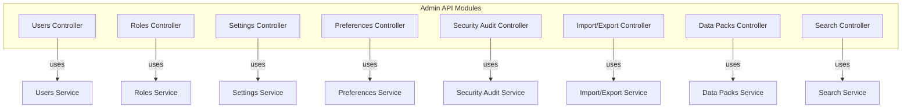
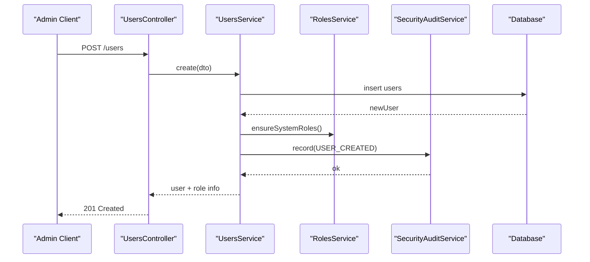
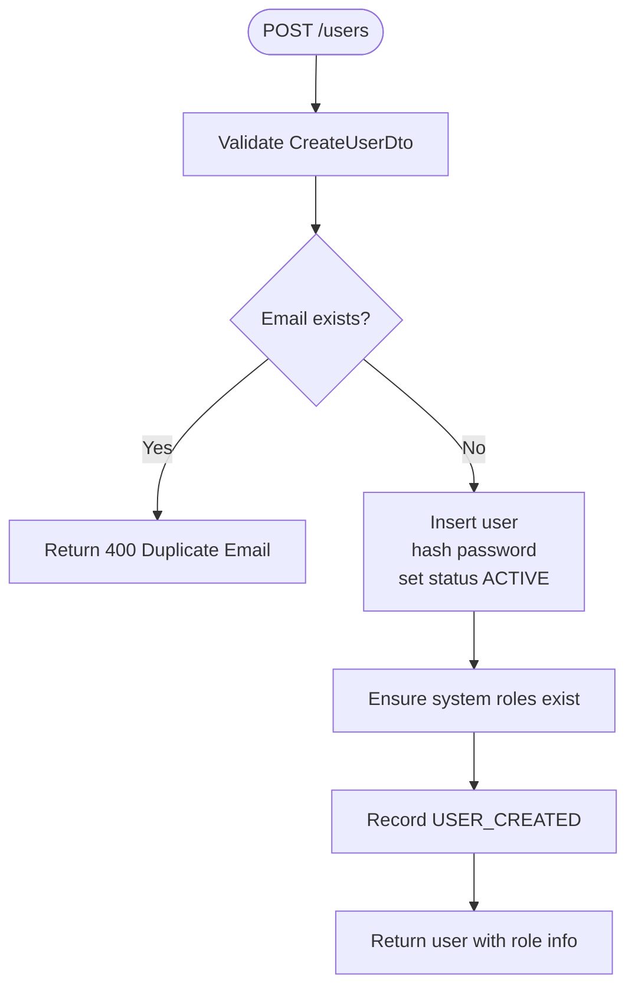
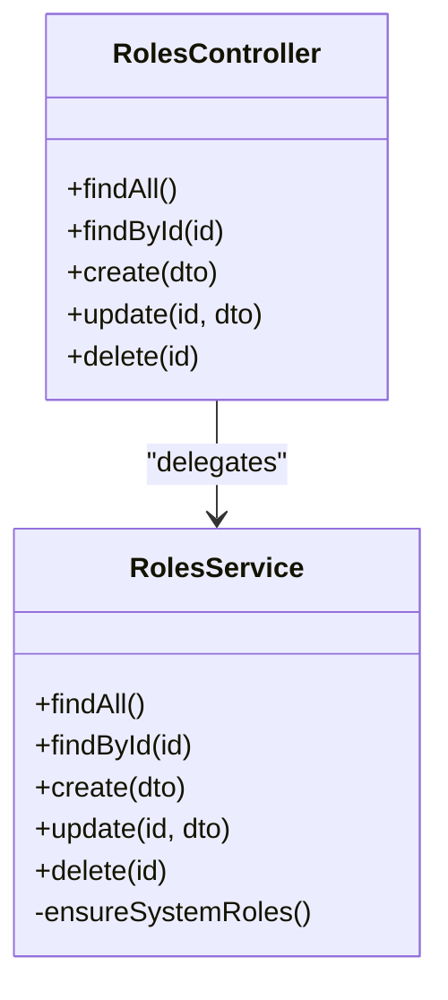
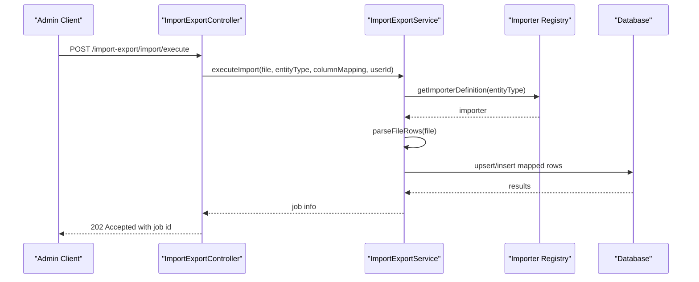
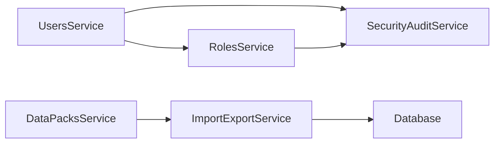

# System Administration APIs

<cite>
**Referenced Files in This Document**
- [users.controller.ts](file://apps/api/src/users/users.controller.ts)
- [users.service.ts](file://apps/api/src/users/users.service.ts)
- [users/dtos.ts](file://apps/api/src/users/dtos.ts)
- [roles.controller.ts](file://apps/api/src/roles/roles.controller.ts)
- [roles.service.ts](file://apps/api/src/roles/roles.service.ts)
- [roles/dtos.ts](file://apps/api/src/roles/dtos.ts)
- [settings.controller.ts](file://apps/api/src/settings/settings.controller.ts)
- [settings/dtos.ts](file://apps/api/src/settings/dtos.ts)
- [preferences.controller.ts](file://apps/api/src/preferences/preferences.controller.ts)
- [preferences/dtos.ts](file://apps/api/src/preferences/dtos.ts)
- [security-audit.controller.ts](file://apps/api/src/security-audit/security-audit.controller.ts)
- [import-export.controller.ts](file://apps/api/src/import-export/import-export.controller.ts)
- [import-export.service.ts](file://apps/api/src/import-export/import-export.service.ts)
- [import-export/dtos.ts](file://apps/api/src/import-export/dtos.ts)
- [data-packs.controller.ts](file://apps/api/src/data-packs/data-packs.controller.ts)
- [data-packs.service.ts](file://apps/api/src/data-packs/data-packs.service.ts)
- [search.controller.ts](file://apps/api/src/search/search.controller.ts)
</cite>

## Table of Contents
1. Introduction
2. Project Structure
3. Core Components
4. Architecture Overview
5. Detailed Component Analysis
6. Dependency Analysis
7. Performance Considerations
8. Troubleshooting Guide
9. Conclusion
10. Appendices

## Introduction
This document provides comprehensive API documentation for system administration endpoints covering user management, roles, settings, preferences, security audit, import/export, data packs, and search functionality. It includes schemas for admin entities, audit trails, and data formats, along with examples for system setup, user onboarding, and data management operations.

## Project Structure
The system administration APIs are implemented as NestJS controllers and services under apps/api/src. Each feature area (users, roles, settings, preferences, security audit, import/export, data packs, search) is organized into its own module with dedicated controllers, services, and DTOs.

**Diagram sources**
- [users.controller.ts:5-50](file://apps/api/src/users/users.controller.ts#L5-L50)
- [roles.controller.ts:13-41](file://apps/api/src/roles/roles.controller.ts#L13-L41)
- [settings.controller.ts:21-81](file://apps/api/src/settings/settings.controller.ts#L21-L81)
- [preferences.controller.ts:19-85](file://apps/api/src/preferences/preferences.controller.ts#L19-L85)
- [security-audit.controller.ts:4-15](file://apps/api/src/security-audit/security-audit.controller.ts#L4-L15)
- [import-export.controller.ts:19-146](file://apps/api/src/import-export/import-export.controller.ts#L19-L146)
- [data-packs.controller.ts:4-26](file://apps/api/src/data-packs/data-packs.controller.ts#L4-L26)
- [search.controller.ts:4-14](file://apps/api/src/search/search.controller.ts#L4-L14)

**Section sources**
- [users.controller.ts:5-50](file://apps/api/src/users/users.controller.ts#L5-L50)
- [roles.controller.ts:13-41](file://apps/api/src/roles/roles.controller.ts#L13-L41)
- [settings.controller.ts:21-81](file://apps/api/src/settings/settings.controller.ts#L21-L81)
- [preferences.controller.ts:19-85](file://apps/api/src/preferences/preferences.controller.ts#L19-L85)
- [security-audit.controller.ts:4-15](file://apps/api/src/security-audit/security-audit.controller.ts#L4-L15)
- [import-export.controller.ts:19-146](file://apps/api/src/import-export/import-export.controller.ts#L19-L146)
- [data-packs.controller.ts:4-26](file://apps/api/src/data-packs/data-packs.controller.ts#L4-L26)
- [search.controller.ts:4-14](file://apps/api/src/search/search.controller.ts#L4-L14)

## Core Components
- Users: Provisioning, listing, updating, activation/deactivation, and admin password reset.
- Roles: CRUD for roles with permissions; system role protection.
- Settings: Organization profile, system settings, numbering series, feature flags, and organization reset.
- Preferences: Dashboard layout, saved views, favorites, workspace preferences.
- Security Audit: Queryable audit logs by category and user.
- Import/Export: Templates, preview/execute imports, exports, job tracking, and reverse import.
- Data Packs: Catalog browsing, pack details, and installation.
- Search: Global search across entities.

**Section sources**
- [users.controller.ts:5-50](file://apps/api/src/users/users.controller.ts#L5-L50)
- [roles.controller.ts:13-41](file://apps/api/src/roles/roles.controller.ts#L13-L41)
- [settings.controller.ts:21-81](file://apps/api/src/settings/settings.controller.ts#L21-L81)
- [preferences.controller.ts:19-85](file://apps/api/src/preferences/preferences.controller.ts#L19-L85)
- [security-audit.controller.ts:4-15](file://apps/api/src/security-audit/security-audit.controller.ts#L4-L15)
- [import-export.controller.ts:19-146](file://apps/api/src/import-export/import-export.controller.ts#L19-L146)
- [data-packs.controller.ts:4-26](file://apps/api/src/data-packs/data-packs.controller.ts#L4-L26)
- [search.controller.ts:4-14](file://apps/api/src/search/search.controller.ts#L4-L14)

## Architecture Overview
High-level flow for key administrative operations:

**Diagram sources**
- [users.controller.ts:23-26](file://apps/api/src/users/users.controller.ts#L23-L26)
- [users.service.ts:121-154](file://apps/api/src/users/users.service.ts#L121-L154)
- [roles.service.ts:18-45](file://apps/api/src/roles/roles.service.ts#L18-L45)

**Section sources**
- [users.controller.ts:23-26](file://apps/api/src/users/users.controller.ts#L23-L26)
- [users.service.ts:121-154](file://apps/api/src/users/users.service.ts#L121-L154)
- [roles.service.ts:18-45](file://apps/api/src/roles/roles.service.ts#L18-L45)

## Detailed Component Analysis

### Users Management
- Endpoints:
  - GET /users?search=&roleId=&status=
  - GET /users/:id
  - POST /users
  - PUT /users/:id
  - POST /users/:id/disable
  - POST /users/:id/activate
  - POST /users/:id/reset-password
- Key behaviors:
  - Create validates email uniqueness, hashes password, sets status ACTIVE, and records audit event.
  - Update supports partial updates including role assignment.
  - Disable protects primary administrator from deactivation.
  - Admin reset password enforces minimum length.
- Schemas:
  - CreateUserDto: email, password, firstName, lastName, department?, roleId?
  - UpdateUserDto: firstName?, lastName?, department?, roleId?
  - AdminResetPasswordDto: newPassword
- Example flows:
  - User provisioning: POST /users with CreateUserDto returns created user with role name and permissions.
  - Role assignment: PUT /users/:id with UpdateUserDto to change role.
  - Activation/Deactivation: POST /users/:id/activate or /disable.
  - Password reset: POST /users/:id/reset-password with AdminResetPasswordDto.

**Diagram sources**
- [users.controller.ts:23-26](file://apps/api/src/users/users.controller.ts#L23-L26)
- [users.service.ts:121-154](file://apps/api/src/users/users.service.ts#L121-L154)
- [roles.service.ts:18-45](file://apps/api/src/roles/roles.service.ts#L18-L45)

**Section sources**
- [users.controller.ts:5-50](file://apps/api/src/users/users.controller.ts#L5-L50)
- [users.service.ts:38-200](file://apps/api/src/users/users.service.ts#L38-L200)
- [users/dtos.ts:9-57](file://apps/api/src/users/dtos.ts#L9-L57)

### Roles Management
- Endpoints:
  - GET /roles
  - GET /roles/:id
  - POST /roles
  - PUT /roles/:id
  - DELETE /roles/:id
- Key behaviors:
  - System roles are seeded on module init and protected from deletion/name changes.
  - Custom roles can be created/updated with permission arrays.
- Schemas:
  - CreateRoleDto: name, description?, permissions[]
  - UpdateRoleDto: name?, description?, permissions?
- Example flows:
  - Create a custom role with permissions.
  - Update role permissions or description.
  - Delete non-system role.

**Diagram sources**
- [roles.controller.ts:13-41](file://apps/api/src/roles/roles.controller.ts#L13-L41)
- [roles.service.ts:14-149](file://apps/api/src/roles/roles.service.ts#L14-L149)

**Section sources**
- [roles.controller.ts:13-41](file://apps/api/src/roles/roles.controller.ts#L13-L41)
- [roles.service.ts:14-149](file://apps/api/src/roles/roles.service.ts#L14-L149)
- [roles/dtos.ts:3-30](file://apps/api/src/roles/dtos.ts#L3-L30)

### Settings Management
- Endpoints:
  - GET /settings/organization
  - PUT /settings/organization
  - POST /settings/organization/reset
  - GET /settings/system
  - PUT /settings/system
  - GET /settings/numbering
  - PUT /settings/numbering
  - POST /settings/numbering/generate/:entityType
  - GET /settings/feature-flags
  - PATCH /settings/feature-flags
- Key behaviors:
  - Organization profile update fields include legal, contact, address, timezone, logo.
  - System settings include currency, warehouse, fiscal year, date format.
  - Numbering series per entity type with prefix, date format, sequence, padding.
  - Feature flags toggle via key and boolean.
  - Organization reset requires confirmation and password confirmation.
- Schemas:
  - UpdateOrganizationProfileDto: companyName?, legalName?, registrationNumber?, taxId?, email?, phone?, website?, address?, city?, state?, country?, postalCode?, primaryTimezone?, logoUrl?
  - UpdateSystemSettingsDto: baseCurrency?, supportedCurrencies?, defaultWarehouseId?, fiscalYearStartMonth?, dateFormat?
  - UpdateNumberingSeriesDto: entityType, prefix, dateFormat?, nextSequenceNumber?, zeroPadLength?
  - ToggleFeatureFlagDto: key, isEnabled
  - ResetOrganizationDto: confirmText, passwordConfirm

**Section sources**
- [settings.controller.ts:21-81](file://apps/api/src/settings/settings.controller.ts#L21-L81)
- [settings/dtos.ts:9-123](file://apps/api/src/settings/dtos.ts#L9-L123)

### Preferences Management
- Endpoints:
  - GET /preferences/dashboard?userId=
  - PUT /preferences/dashboard?userId=
  - GET /preferences/saved-views?userId=&module=
  - POST /preferences/saved-views?userId=
  - GET /preferences/favorites?userId=
  - POST /preferences/favorites?userId=
  - DELETE /preferences/favorites/:id?userId=
  - GET /preferences/workspace?userId=
  - PUT /preferences/workspace?userId=
- Key behaviors:
  - Dashboard layout stores widgets configuration.
  - Saved views store filters, sorting, columns, and default flag per module.
  - Favorites link entities with titles and hrefs.
  - Workspace preferences include landing page, table density, theme.
- Schemas:
  - UpdateDashboardLayoutDto: widgetsJson[]
  - CreateSavedViewDto: module, name, filtersJson?, sortJson?, columnsJson?, isDefault?
  - CreateFavoriteDto: entityType, entityId, title, href
  - UpdateWorkspacePreferenceDto: defaultLandingPage?, tableDensity?, themePreference?

**Section sources**
- [preferences.controller.ts:19-85](file://apps/api/src/preferences/preferences.controller.ts#L19-L85)
- [preferences/dtos.ts:9-69](file://apps/api/src/preferences/dtos.ts#L9-L69)

### Security Audit
- Endpoints:
  - GET /security/audit?category=&userId=
- Key behaviors:
  - Retrieve audit logs filtered by category and/or userId.
  - Auditing occurs for critical actions such as user creation/update and role lifecycle events.

**Section sources**
- [security-audit.controller.ts:4-15](file://apps/api/src/security-audit/security-audit.controller.ts#L4-L15)
- [users.service.ts:146-152](file://apps/api/src/users/users.service.ts#L146-L152)
- [roles.service.ts:90-96](file://apps/api/src/roles/roles.service.ts#L90-L96)
- [roles.service.ts:123-127](file://apps/api/src/roles/roles.service.ts#L123-L127)
- [roles.service.ts:141-145](file://apps/api/src/roles/roles.service.ts#L141-L145)

### Import/Export
- Endpoints:
  - GET /import-export/template/:entityType
  - GET /import-export/template/:entityType/csv
  - GET /import-export/template/:entityType/xlsx
  - POST /import-export/import/preview (multipart file + entityType)
  - POST /import-export/import/execute (multipart file + entityType + columnMapping + optional userId)
  - POST /import-export/export (body ExportRequestDto)
  - GET /import-export/jobs?userId=
  - GET /import-export/jobs/:id
  - POST /import-export/jobs/:id/reverse
- Key behaviors:
  - Templates available in JSON, CSV, and XLSX formats per entity type.
  - Preview parses uploaded file (CSV/JSON) and returns rows for review.
  - Execute import supports column mapping and optional userId via header or body.
  - Export supports formats CSV/EXCEL/JSON with filters, selected IDs, and columns.
  - Jobs provide progress and completion status; reverse import supported.
- Schemas:
  - ExportFormat: CSV | EXCEL | JSON
  - ExportRequestDto: entityType, format, selectedIds?, columns?, filters?
  - ExportResponseDto: job, fileName, format, recordCount, fileContent
  - BulkActionType: DELETE | ARCHIVE | UPDATE_STATUS | ASSIGN_CATEGORY | ASSIGN_LOCATION | ASSIGN_MANUFACTURER
  - BulkActionDto: entityType, action, ids[], payload?
  - UploadedFileObj: originalname, buffer, size, mimetype?
- Example flows:
  - Download template: GET /import-export/template/:entityType/csv
  - Preview import: POST /import-export/import/preview with file and entityType
  - Execute import: POST /import-export/import/execute with file, entityType, columnMapping, userId
  - Export data: POST /import-export/export with ExportRequestDto
  - Track jobs: GET /import-export/jobs and GET /import-export/jobs/:id
  - Reverse import: POST /import-export/jobs/:id/reverse

**Diagram sources**
- [import-export.controller.ts:83-121](file://apps/api/src/import-export/import-export.controller.ts#L83-L121)
- [import-export.service.ts:110-200](file://apps/api/src/import-export/import-export.service.ts#L110-L200)
- [import-export/dtos.ts:31-70](file://apps/api/src/import-export/dtos.ts#L31-L70)

**Section sources**
- [import-export.controller.ts:19-146](file://apps/api/src/import-export/import-export.controller.ts#L19-L146)
- [import-export.service.ts:110-200](file://apps/api/src/import-export/import-export.service.ts#L110-L200)
- [import-export/dtos.ts:9-109](file://apps/api/src/import-export/dtos.ts#L9-L109)

### Data Packs
- Endpoints:
  - GET /data-packs
  - GET /data-packs/:id
  - POST /data-packs/:id/install
- Key behaviors:
  - Catalog lists available packs with metadata and install status.
  - Pack detail includes rows and intelligence hints for classification.
  - Installation triggers data seeding using the pack definition and may log activity.
- Schemas:
  - DataPackCatalogItem: id, name, category, description, entityType, recordCount, isInstalled, installedAt?
  - DataPackDefinition: id, name, category, description, entityType, recordCount, rows?, intelligence?
  - DataPackIntelligenceHint: categoryCode?, categoryName?, aliases?, keywords?, mpnPatterns?, manufacturerHints?, commonTerminology?, expectedAttributes?, attributeAliases?, packagePatterns?, electricalUnitHints?, classificationExamples?

**Section sources**
- [data-packs.controller.ts:4-26](file://apps/api/src/data-packs/data-packs.controller.ts#L4-L26)
- [data-packs.service.ts:16-62](file://apps/api/src/data-packs/data-packs.service.ts#L16-L62)
- [data-packs.service.ts:64-200](file://apps/api/src/data-packs/data-packs.service.ts#L64-L200)

### Search
- Endpoints:
  - GET /search?q=&limit=
- Key behaviors:
  - Global search across entities with configurable limit.
  - Default limit applied when not provided.

**Section sources**
- [search.controller.ts:4-14](file://apps/api/src/search/search.controller.ts#L4-L14)

## Dependency Analysis
Key dependencies between components:
- UsersService depends on RolesService and SecurityAuditService.
- RolesService seeds system roles and records audit events.
- Import/Export service integrates with multiple domain tables and uses an importer registry.
- Data Packs leverage Import/Export capabilities and optionally log activities.

**Diagram sources**
- [users.service.ts:21-24](file://apps/api/src/users/users.service.ts#L21-L24)
- [roles.service.ts:14-16](file://apps/api/src/roles/roles.service.ts#L14-L16)
- [data-packs.service.ts:1-5](file://apps/api/src/data-packs/data-packs.service.ts#L1-L5)
- [import-export.service.ts:1-65](file://apps/api/src/import-export/import-export.service.ts#L1-L65)

**Section sources**
- [users.service.ts:21-24](file://apps/api/src/users/users.service.ts#L21-L24)
- [roles.service.ts:14-16](file://apps/api/src/roles/roles.service.ts#L14-L16)
- [data-packs.service.ts:1-5](file://apps/api/src/data-packs/data-packs.service.ts#L1-L5)
- [import-export.service.ts:1-65](file://apps/api/src/import-export/import-export.service.ts#L1-L65)

## Performance Considerations
- Use query filters for users list (search, roleId, status) to reduce payload size.
- Prefer exporting subsets via selectedIds and columns to minimize export job size.
- Limit search results with the limit parameter to avoid large responses.
- For bulk imports, use column mapping to align headers efficiently and reduce validation overhead.
- Avoid frequent toggling of feature flags in tight loops; batch updates where possible.

[No sources needed since this section provides general guidance]

## Troubleshooting Guide
Common issues and resolutions:
- Duplicate email during user creation: Ensure unique email addresses before creating users.
- Primary administrator cannot be disabled: Do not attempt to disable the designated primary admin account.
- Invalid JSON file format during import preview: Validate JSON structure before upload.
- Missing required parameters: Provide entityType for templates and imports; ensure file is present and non-empty.
- System role constraints: Cannot delete or rename system roles; create custom roles instead.

**Section sources**
- [users.service.ts:121-154](file://apps/api/src/users/users.service.ts#L121-L154)
- [users.service.ts:186-200](file://apps/api/src/users/users.service.ts#L186-L200)
- [import-export.service.ts:127-184](file://apps/api/src/import-export/import-export.service.ts#L127-L184)
- [roles.service.ts:132-147](file://apps/api/src/roles/roles.service.ts#L132-L147)

## Conclusion
The system administration APIs provide robust capabilities for managing users, roles, settings, preferences, audits, data migration, and search. They enforce validation, protect critical system state, and integrate auditing throughout. Use the documented schemas and flows to implement secure and efficient administrative workflows.

[No sources needed since this section summarizes without analyzing specific files]

## Appendices

### API Reference Summary

- Users
  - GET /users?search=&roleId=&status=
  - GET /users/:id
  - POST /users
  - PUT /users/:id
  - POST /users/:id/disable
  - POST /users/:id/activate
  - POST /users/:id/reset-password

- Roles
  - GET /roles
  - GET /roles/:id
  - POST /roles
  - PUT /roles/:id
  - DELETE /roles/:id

- Settings
  - GET /settings/organization
  - PUT /settings/organization
  - POST /settings/organization/reset
  - GET /settings/system
  - PUT /settings/system
  - GET /settings/numbering
  - PUT /settings/numbering
  - POST /settings/numbering/generate/:entityType
  - GET /settings/feature-flags
  - PATCH /settings/feature-flags

- Preferences
  - GET /preferences/dashboard?userId=
  - PUT /preferences/dashboard?userId=
  - GET /preferences/saved-views?userId=&module=
  - POST /preferences/saved-views?userId=
  - GET /preferences/favorites?userId=
  - POST /preferences/favorites?userId=
  - DELETE /preferences/favorites/:id?userId=
  - GET /preferences/workspace?userId=
  - PUT /preferences/workspace?userId=

- Security Audit
  - GET /security/audit?category=&userId=

- Import/Export
  - GET /import-export/template/:entityType
  - GET /import-export/template/:entityType/csv
  - GET /import-export/template/:entityType/xlsx
  - POST /import-export/import/preview
  - POST /import-export/import/execute
  - POST /import-export/export
  - GET /import-export/jobs?userId=
  - GET /import-export/jobs/:id
  - POST /import-export/jobs/:id/reverse

- Data Packs
  - GET /data-packs
  - GET /data-packs/:id
  - POST /data-packs/:id/install

- Search
  - GET /search?q=&limit=

**Section sources**
- [users.controller.ts:5-50](file://apps/api/src/users/users.controller.ts#L5-L50)
- [roles.controller.ts:13-41](file://apps/api/src/roles/roles.controller.ts#L13-L41)
- [settings.controller.ts:21-81](file://apps/api/src/settings/settings.controller.ts#L21-L81)
- [preferences.controller.ts:19-85](file://apps/api/src/preferences/preferences.controller.ts#L19-L85)
- [security-audit.controller.ts:4-15](file://apps/api/src/security-audit/security-audit.controller.ts#L4-L15)
- [import-export.controller.ts:19-146](file://apps/api/src/import-export/import-export.controller.ts#L19-L146)
- [data-packs.controller.ts:4-26](file://apps/api/src/data-packs/data-packs.controller.ts#L4-L26)
- [search.controller.ts:4-14](file://apps/api/src/search/search.controller.ts#L4-L14)