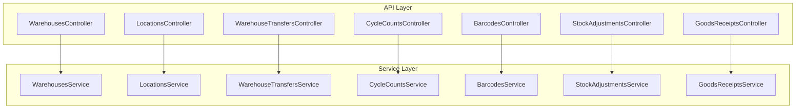
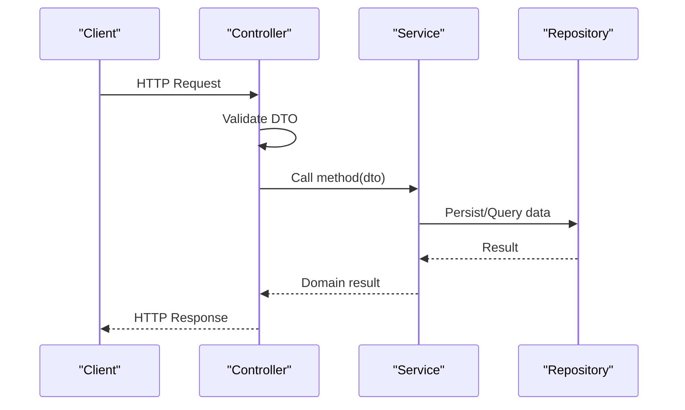
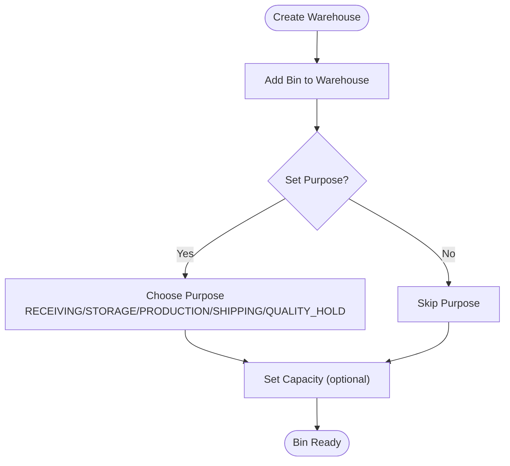
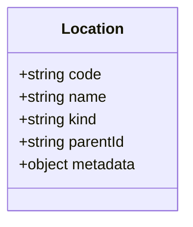
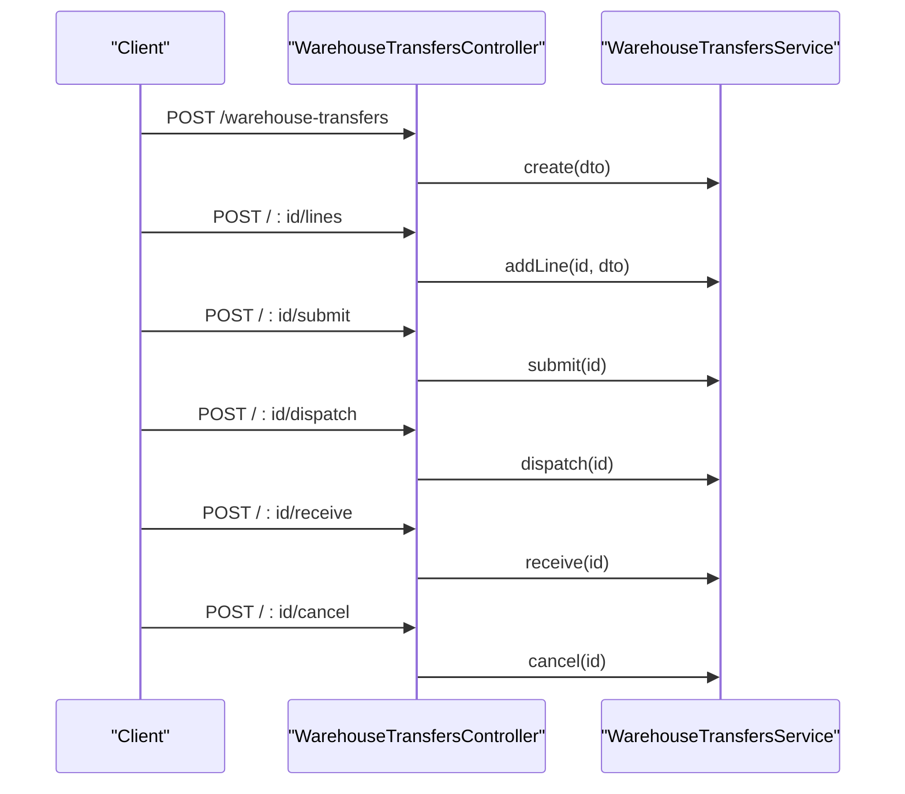
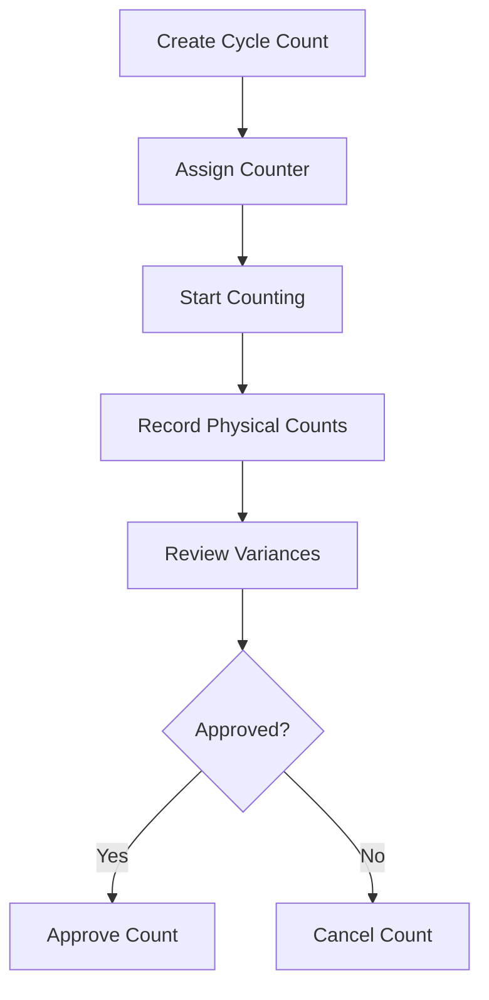
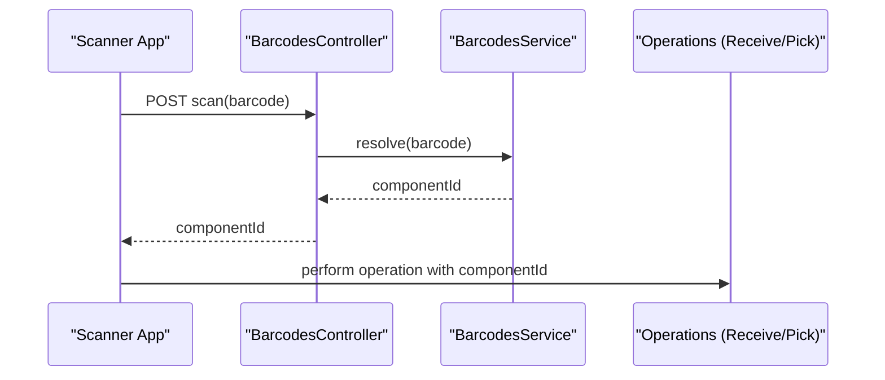
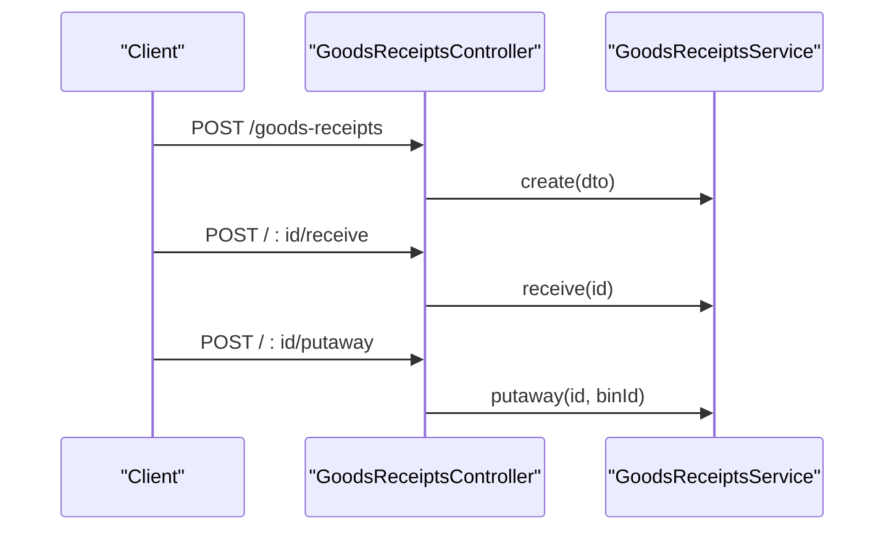
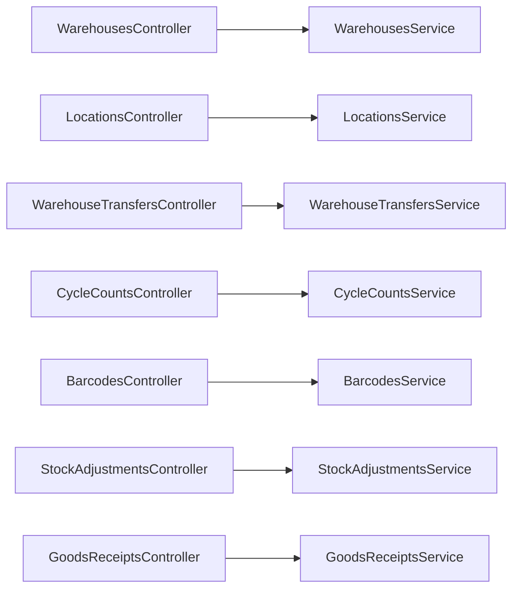

# Warehouse Operations APIs

<cite>
**Referenced Files in This Document**
- [warehouses.controller.ts](file://apps/api/src/warehouses/warehouses.controller.ts)
- [warehouses.service.ts](file://apps/api/src/warehouses/warehouses.service.ts)
- [dtos.ts](file://apps/api/src/warehouses/dtos.ts)
- [locations.controller.ts](file://apps/api/src/locations/locations.controller.ts)
- [create-location.dto.ts](file://apps/api/src/locations/create-location.dto.ts)
- [update-location.dto.ts](file://apps/api/src/locations/update-location.dto.ts)
- [locations.service.ts](file://apps/api/src/locations/locations.service.ts)
- [warehouse-transfers.controller.ts](file://apps/api/src/warehouse-transfers/warehouse-transfers.controller.ts)
- [warehouse-transfers.service.ts](file://apps/api/src/warehouse-transfers/warehouse-transfers.service.ts)
- [dtos.ts](file://apps/api/src/warehouse-transfers/dtos.ts)
- [cycle-counts.controller.ts](file://apps/api/src/cycle-counts/cycle-counts.controller.ts)
- [cycle-counts.service.ts](file://apps/api/src/cycle-counts/cycle-counts.service.ts)
- [dtos.ts](file://apps/api/src/cycle-counts/dtos.ts)
- [barcodes.controller.ts](file://apps/api/src/barcodes/barcodes.controller.ts)
- [barcodes.service.ts](file://apps/api/src/barcodes/barcodes.service.ts)
- [stock-adjustments.controller.ts](file://apps/api/src/stock-adjustments/stock-adjustments.controller.ts)
- [stock-adjustments.service.ts](file://apps/api/src/stock-adjustments/stock-adjustments.service.ts)
- [dtos.ts](file://apps/api/src/stock-adjustments/dtos.ts)
- [goods-receipts.controller.ts](file://apps/api/src/goods-receipts/goods-receipts.controller.ts)
- [goods-receipts.service.ts](file://apps/api/src/goods-receipts/goods-receipts.service.ts)
- [dtos.ts](file://apps/api/src/goods-receipts/dtos.ts)
</cite>

## Table of Contents
1. [Introduction](#introduction)
2. [Project Structure](#project-structure)
3. [Core Components](#core-components)
4. [Architecture Overview](#architecture-overview)
5. [Detailed Component Analysis](#detailed-component-analysis)
6. [Dependency Analysis](#dependency-analysis)
7. [Performance Considerations](#performance-considerations)
8. [Troubleshooting Guide](#troubleshooting-guide)
9. [Conclusion](#conclusion)

## Introduction
This document provides comprehensive API documentation for warehouse operations, covering:
- Warehouses and bin management
- Location hierarchies
- Transfers (creation, dispatch, receive, cancel)
- Cycle counting (assign, start, record counts, approve)
- Barcode scanning integration
- Stock adjustments
- Goods receipts (receiving and putaway)

It includes endpoint schemas, request/response structures, workflow diagrams, and examples for common warehouse processes such as receiving, putaway, picking, and shipping.

## Project Structure
The warehouse-related endpoints are implemented as NestJS controllers with corresponding services and DTOs under the apps/api/src directory. Each domain area (warehouses, locations, transfers, cycle counts, barcodes, stock adjustments, goods receipts) has its own controller, service, and DTO files.

**Diagram sources**
- [warehouses.controller.ts:5-36](file://apps/api/src/warehouses/warehouses.controller.ts#L5-L36)
- [locations.controller.ts:19-50](file://apps/api/src/locations/locations.controller.ts#L19-L50)
- [warehouse-transfers.controller.ts:21-84](file://apps/api/src/warehouse-transfers/warehouse-transfers.controller.ts#L21-L84)
- [cycle-counts.controller.ts:23-94](file://apps/api/src/cycle-counts/cycle-counts.controller.ts#L23-L94)
- [barcodes.controller.ts:1-200](file://apps/api/src/barcodes/barcodes.controller.ts#L1-L200)
- [stock-adjustments.controller.ts:1-200](file://apps/api/src/stock-adjustments/stock-adjustments.controller.ts#L1-L200)
- [goods-receipts.controller.ts:1-200](file://apps/api/src/goods-receipts/goods-receipts.controller.ts#L1-L200)

**Section sources**
- [warehouses.controller.ts:5-36](file://apps/api/src/warehouses/warehouses.controller.ts#L5-L36)
- [locations.controller.ts:19-50](file://apps/api/src/locations/locations.controller.ts#L19-L50)
- [warehouse-transfers.controller.ts:21-84](file://apps/api/src/warehouse-transfers/warehouse-transfers.controller.ts#L21-L84)
- [cycle-counts.controller.ts:23-94](file://apps/api/src/cycle-counts/cycle-counts.controller.ts#L23-L94)

## Core Components
- Warehouses: Create/list warehouses; add/update bins with capacity and purpose.
- Locations: Full CRUD for hierarchical locations with parent-child relationships.
- Transfers: Create, update, list, add lines, submit, dispatch, receive, cancel.
- Cycle Counts: Create, assign counter, start, record physical counts, review variances, approve, cancel.
- Barcodes: Scan and resolve items to components for fast operations.
- Stock Adjustments: Adjust inventory quantities with reasons and approvals.
- Goods Receipts: Receive inbound shipments and move into storage bins.

**Section sources**
- [warehouses.controller.ts:9-36](file://apps/api/src/warehouses/warehouses.controller.ts#L9-L36)
- [locations.controller.ts:24-50](file://apps/api/src/locations/locations.controller.ts#L24-L50)
- [warehouse-transfers.controller.ts:26-84](file://apps/api/src/warehouse-transfers/warehouse-transfers.controller.ts#L26-L84)
- [cycle-counts.controller.ts:28-94](file://apps/api/src/cycle-counts/cycle-counts.controller.ts#L28-L94)
- [barcodes.controller.ts:1-200](file://apps/api/src/barcodes/barcodes.controller.ts#L1-L200)
- [stock-adjustments.controller.ts:1-200](file://apps/api/src/stock-adjustments/stock-adjustments.controller.ts#L1-L200)
- [goods-receipts.controller.ts:1-200](file://apps/api/src/goods-receipts/goods-receipts.controller.ts#L1-L200)

## Architecture Overview
The warehouse operations follow a layered architecture:
- Controllers expose REST endpoints and validate inputs via DTOs.
- Services implement business logic, orchestrate state transitions, and interact with repositories.
- DTOs define strict input schemas using class-validator decorators.

**Diagram sources**
- [warehouses.controller.ts:9-36](file://apps/api/src/warehouses/warehouses.controller.ts#L9-L36)
- [locations.controller.ts:24-50](file://apps/api/src/locations/locations.controller.ts#L24-L50)
- [warehouse-transfers.controller.ts:26-84](file://apps/api/src/warehouse-transfers/warehouse-transfers.controller.ts#L26-L84)
- [cycle-counts.controller.ts:28-94](file://apps/api/src/cycle-counts/cycle-counts.controller.ts#L28-L94)

## Detailed Component Analysis

### Warehouses and Bins
Endpoints:
- POST /warehouses
- GET /warehouses
- GET /warehouses/:id
- POST /warehouses/:id/bins
- PATCH /warehouses/:id/bins/:binId

Bin management schema:
- Add Bin
  - code: string (required)
  - capacity: number (optional, min 0)
  - purpose: enum (RECEIVING | STORAGE | PRODUCTION | SHIPPING | QUALITY_HOLD)
- Update Bin
  - isActive: boolean (optional)
  - capacity: number (optional, min 0)

Example usage:
- Create a warehouse and add a RECEIVING bin with capacity 1000.
- Update an existing bin to set isActive false or adjust capacity.

**Diagram sources**
- [warehouses.controller.ts:9-36](file://apps/api/src/warehouses/warehouses.controller.ts#L9-L36)
- [dtos.ts:24-49](file://apps/api/src/warehouses/dtos.ts#L24-L49)

**Section sources**
- [warehouses.controller.ts:9-36](file://apps/api/src/warehouses/warehouses.controller.ts#L9-L36)
- [dtos.ts:10-49](file://apps/api/src/warehouses/dtos.ts#L10-L49)

### Locations (Hierarchical)
Endpoints:
- POST /locations
- GET /locations
- GET /locations/:id
- PUT /locations/:id
- DELETE /locations/:id

Location hierarchy schema:
- Create Location
  - code: string (max 50)
  - name: string (max 255)
  - kind: string (e.g., ZONE, AISLE, BIN)
  - parentId: UUID (optional, null allowed)
  - metadata: object (optional)

Example usage:
- Create a zone location, then create child aisle and bin locations by setting parentId.

**Diagram sources**
- [create-location.dto.ts:9-32](file://apps/api/src/locations/create-location.dto.ts#L9-L32)

**Section sources**
- [locations.controller.ts:24-50](file://apps/api/src/locations/locations.controller.ts#L24-L50)
- [create-location.dto.ts:9-32](file://apps/api/src/locations/create-location.dto.ts#L9-L32)
- [update-location.dto.ts:1-200](file://apps/api/src/locations/update-location.dto.ts#L1-L200)

### Transfers
Endpoints:
- POST /warehouse-transfers (also aliased as /transfers)
- GET /warehouse-transfers
- GET /warehouse-transfers/:id
- PUT /warehouse-transfers/:id
- POST /warehouse-transfers/:id/lines
- POST /warehouse-transfers/:id/submit
- POST /warehouse-transfers/:id/dispatch
- POST /warehouse-transfers/:id/receive
- POST /warehouse-transfers/:id/cancel
- DELETE /warehouse-transfers/:id

Transfer line schema:
- componentId: string (required)
- quantity: number (min > 0)
- unitOfMeasure: string (optional)
- notes: string (optional)

Workflow:
- Create transfer with source and destination locations.
- Add lines for components and quantities.
- Submit to lock allocations.
- Dispatch to mark outbound.
- Receive to complete inbound at destination.
- Cancel to abort.

**Diagram sources**
- [warehouse-transfers.controller.ts:26-84](file://apps/api/src/warehouse-transfers/warehouse-transfers.controller.ts#L26-L84)
- [warehouse-transfers.service.ts:1-200](file://apps/api/src/warehouse-transfers/warehouse-transfers.service.ts#L1-L200)

**Section sources**
- [warehouse-transfers.controller.ts:26-84](file://apps/api/src/warehouse-transfers/warehouse-transfers.controller.ts#L26-L84)
- [dtos.ts:12-83](file://apps/api/src/warehouse-transfers/dtos.ts#L12-L83)

### Cycle Counting
Endpoints:
- POST /cycle-counts
- GET /cycle-counts
- GET /cycle-counts/:id
- GET /cycle-counts/:id/summary
- PUT /cycle-counts/:id
- POST /cycle-counts/:id/assign
- POST /cycle-counts/:id/start
- POST /cycle-counts/:id/record-counts
- POST /cycle-counts/:id/approve
- POST /cycle-counts/:id/cancel
- DELETE /cycle-counts/:id

Counting procedure:
- Create count for a location with optional lines.
- Assign a counter.
- Start counting.
- Record physical counts per line.
- Review variances summary.
- Approve to reconcile inventory.
- Cancel if needed.

Reconciliation schema:
- PhysicalCountEntryDto
  - lineId: string (required)
  - countedQuantity: number (min 0)
  - notes: string (optional)

**Diagram sources**
- [cycle-counts.controller.ts:28-94](file://apps/api/src/cycle-counts/cycle-counts.controller.ts#L28-L94)
- [cycle-counts.service.ts:1-200](file://apps/api/src/cycle-counts/cycle-counts.service.ts#L1-L200)

**Section sources**
- [cycle-counts.controller.ts:28-94](file://apps/api/src/cycle-counts/cycle-counts.controller.ts#L28-L94)
- [dtos.ts:12-119](file://apps/api/src/cycle-counts/dtos.ts#L12-L119)

### Barcode Scanning Integration
Barcode scanning enables rapid identification of components during receiving, putaway, picking, and shipping. Typical flow:
- Scan barcode -> Resolve to component -> Perform operation (receive, pick, ship).

Integration points:
- Use barcode resolution to populate componentId in transfer lines or count lines.
- Combine with goods receipts for receiving workflows.
- Combine with cycle counts for quick line lookup.

**Diagram sources**
- [barcodes.controller.ts:1-200](file://apps/api/src/barcodes/barcodes.controller.ts#L1-L200)
- [barcodes.service.ts:1-200](file://apps/api/src/barcodes/barcodes.service.ts#L1-L200)

**Section sources**
- [barcodes.controller.ts:1-200](file://apps/api/src/barcodes/barcodes.controller.ts#L1-L200)
- [barcodes.service.ts:1-200](file://apps/api/src/barcodes/barcodes.service.ts#L1-L200)

### Stock Adjustments
Endpoints:
- POST /stock-adjustments
- GET /stock-adjustments
- GET /stock-adjustments/:id
- PUT /stock-adjustments/:id
- POST /stock-adjustments/:id/approve
- POST /stock-adjustments/:id/cancel
- DELETE /stock-adjustments/:id

Adjustment processing:
- Create adjustment with reason and target location/bin.
- Optionally attach lines for multiple components.
- Approve to apply changes to inventory ledger.
- Cancel to revert pending adjustments.

Schema highlights:
- Reason codes and approval fields ensure auditability.
- Lines include componentId, quantity delta, and notes.

**Section sources**
- [stock-adjustments.controller.ts:1-200](file://apps/api/src/stock-adjustments/stock-adjustments.controller.ts#L1-L200)
- [stock-adjustments.service.ts:1-200](file://apps/api/src/stock-adjustments/stock-adjustments.service.ts#L1-L200)
- [dtos.ts:1-200](file://apps/api/src/stock-adjustments/dtos.ts#L1-L200)

### Goods Receipts (Receiving and Putaway)
Endpoints:
- POST /goods-receipts
- GET /goods-receipts
- GET /goods-receipts/:id
- PUT /goods-receipts/:id
- POST /goods-receipts/:id/receive
- POST /goods-receipts/:id/putaway
- POST /goods-receipts/:id/cancel
- DELETE /goods-receipts/:id

Receiving workflow:
- Create receipt from purchase order or manual entry.
- Receive inbound items against expected lines.
- Putaway items into designated bins (RECEIVING or STORAGE).
- Cancel if shipment is rejected or incomplete.

Putaway example:
- After receiving, call putaway to move stock into a STORAGE bin with appropriate capacity checks.

**Diagram sources**
- [goods-receipts.controller.ts:1-200](file://apps/api/src/goods-receipts/goods-receipts.controller.ts#L1-L200)
- [goods-receipts.service.ts:1-200](file://apps/api/src/goods-receipts/goods-receipts.service.ts#L1-L200)

**Section sources**
- [goods-receipts.controller.ts:1-200](file://apps/api/src/goods-receipts/goods-receipts.controller.ts#L1-L200)
- [goods-receipts.service.ts:1-200](file://apps/api/src/goods-receipts/goods-receipts.service.ts#L1-L200)
- [dtos.ts:1-200](file://apps/api/src/goods-receipts/dtos.ts#L1-L200)

## Dependency Analysis
Controllers depend on their respective services for business logic. DTOs provide validation constraints that enforce correct payloads across endpoints.

**Diagram sources**
- [warehouses.controller.ts:5-36](file://apps/api/src/warehouses/warehouses.controller.ts#L5-L36)
- [locations.controller.ts:19-50](file://apps/api/src/locations/locations.controller.ts#L19-L50)
- [warehouse-transfers.controller.ts:21-84](file://apps/api/src/warehouse-transfers/warehouse-transfers.controller.ts#L21-L84)
- [cycle-counts.controller.ts:23-94](file://apps/api/src/cycle-counts/cycle-counts.controller.ts#L23-L94)
- [barcodes.controller.ts:1-200](file://apps/api/src/barcodes/barcodes.controller.ts#L1-L200)
- [stock-adjustments.controller.ts:1-200](file://apps/api/src/stock-adjustments/stock-adjustments.controller.ts#L1-L200)
- [goods-receipts.controller.ts:1-200](file://apps/api/src/goods-receipts/goods-receipts.controller.ts#L1-L200)

**Section sources**
- [warehouses.controller.ts:5-36](file://apps/api/src/warehouses/warehouses.controller.ts#L5-L36)
- [locations.controller.ts:19-50](file://apps/api/src/locations/locations.controller.ts#L19-L50)
- [warehouse-transfers.controller.ts:21-84](file://apps/api/src/warehouse-transfers/warehouse-transfers.controller.ts#L21-L84)
- [cycle-counts.controller.ts:23-94](file://apps/api/src/cycle-counts/cycle-counts.controller.ts#L23-L94)

## Performance Considerations
- Batch operations: Prefer bulk endpoints where available (e.g., adding multiple transfer lines or recording multiple physical counts).
- Pagination and filtering: Use query parameters (status, locationId, search) to limit payload sizes.
- Validation overhead: Keep DTOs minimal and required only for critical fields to reduce parsing time.
- Indexing: Ensure repository queries for location hierarchies and transfer statuses leverage database indexes.

[No sources needed since this section provides general guidance]

## Troubleshooting Guide
Common issues and resolutions:
- Invalid DTO fields: Ensure all required fields are present and conform to constraints (e.g., non-negative quantities, valid UUIDs).
- State transition errors: Transfers and cycle counts require specific states before actions like submit, dispatch, receive, or approve.
- Capacity violations: When putting away or assigning bins, verify bin capacity and purpose alignment.
- Barcode resolution failures: Confirm barcode-to-component mapping exists before performing operations.

Validation and error handling patterns:
- Controllers use DTO decorators for input validation.
- Exception filters centralize error responses per domain.

**Section sources**
- [warehouses.controller.ts:9-36](file://apps/api/src/warehouses/warehouses.controller.ts#L9-L36)
- [locations.controller.ts:24-50](file://apps/api/src/locations/locations.controller.ts#L24-L50)
- [warehouse-transfers.controller.ts:26-84](file://apps/api/src/warehouse-transfers/warehouse-transfers.controller.ts#L26-L84)
- [cycle-counts.controller.ts:28-94](file://apps/api/src/cycle-counts/cycle-counts.controller.ts#L28-L94)

## Conclusion
The warehouse operations APIs provide robust endpoints for managing warehouses, locations, transfers, cycle counts, barcode scanning, stock adjustments, and goods receipts. By following the documented schemas and workflows, clients can implement efficient receiving, putaway, picking, and shipping processes while maintaining accurate inventory records and audit trails.

[No sources needed since this section summarizes without analyzing specific files]