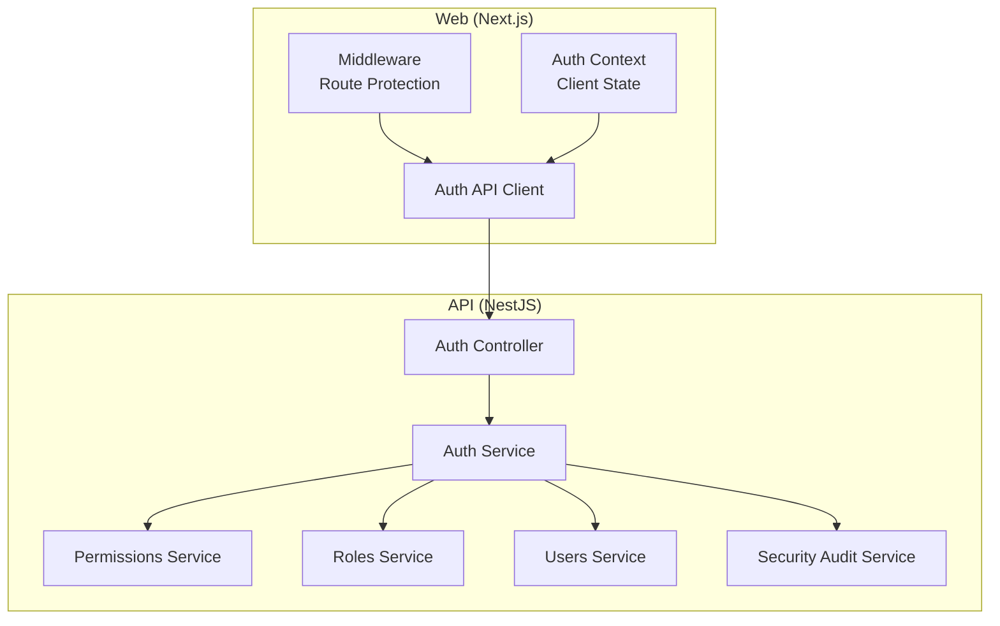
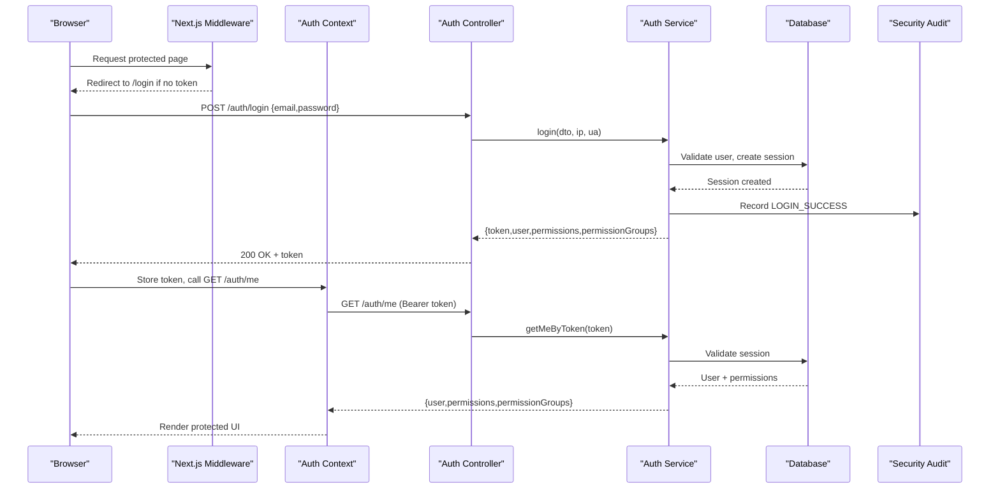
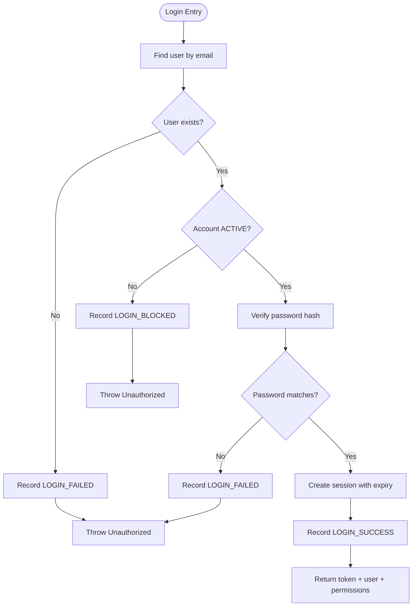
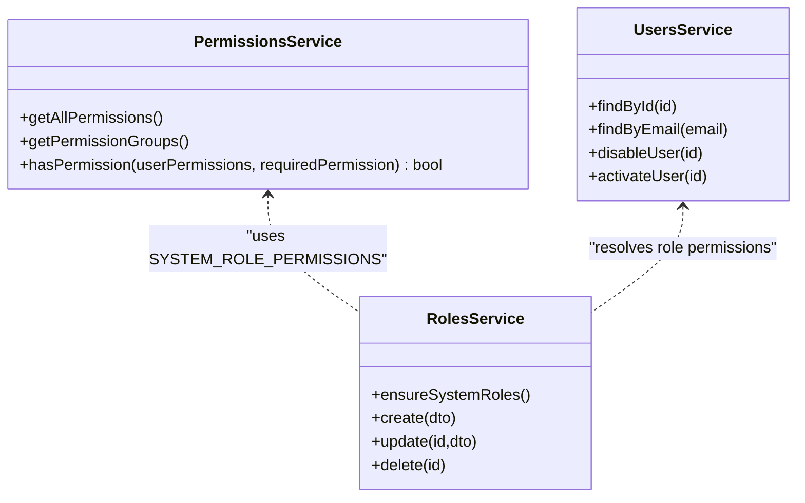
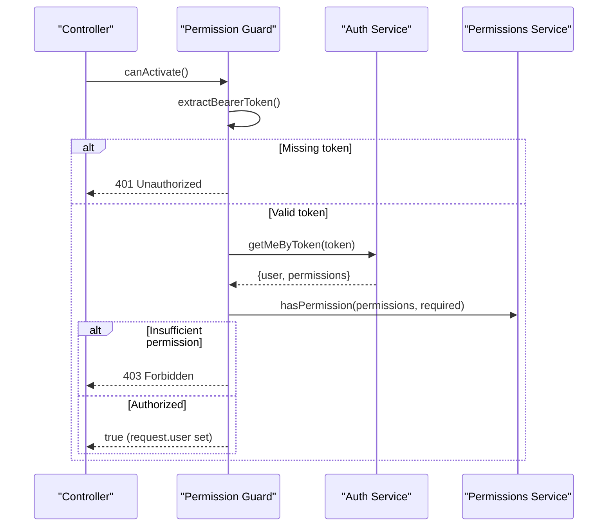
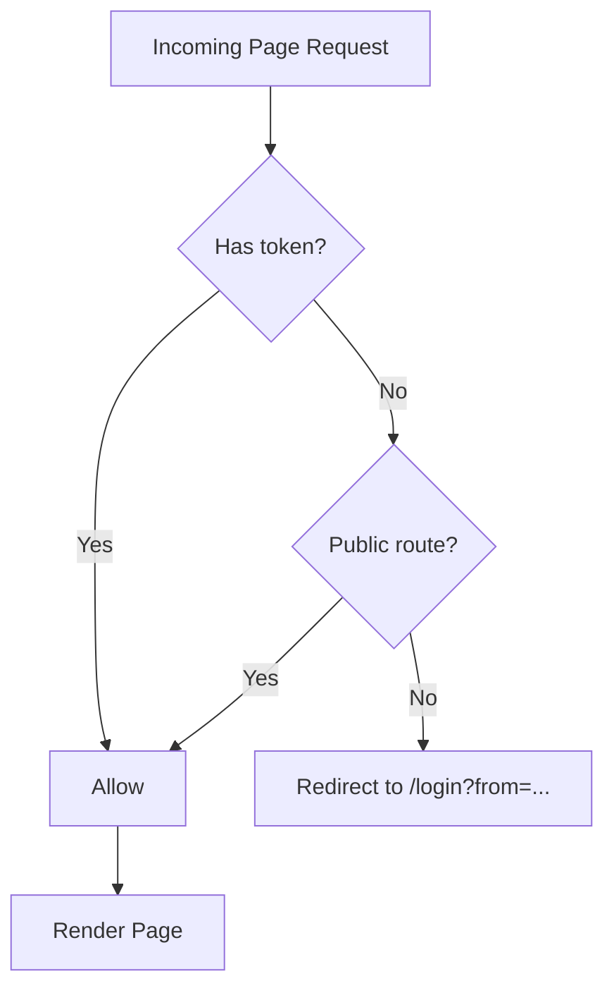
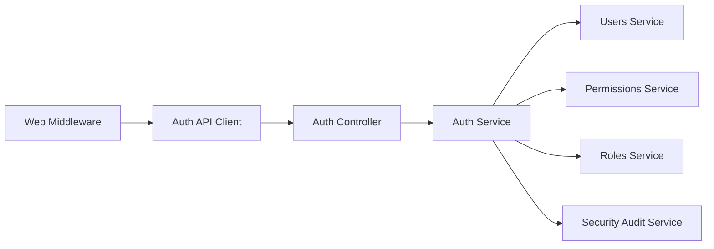

# Authentication & Security

<cite>
**Referenced Files in This Document**
- [AUTHENTICATION.md](file://docs/AUTHENTICATION.md)
- [auth.controller.ts](file://apps/api/src/auth/auth.controller.ts)
- [auth.service.ts](file://apps/api/src/auth/auth.service.ts)
- [permission.guard.ts](file://apps/api/src/auth/permission.guard.ts)
- [component-write.guard.ts](file://apps/api/src/auth/component-write.guard.ts)
- [permissions.service.ts](file://apps/api/src/permissions/permissions.service.ts)
- [roles.service.ts](file://apps/api/src/roles/roles.service.ts)
- [users.service.ts](file://apps/api/src/users/users.service.ts)
- [security-audit.service.ts](file://apps/api/src/security-audit/security-audit.service.ts)
- [middleware.ts](file://apps/web/middleware.ts)
- [auth-context.tsx](file://apps/web/lib/auth/auth-context.tsx)
- [auth-api.ts](file://apps/web/lib/api/auth-api.ts)
</cite>

## Table of Contents
1. Introduction
2. Project Structure
3. Core Components
4. Architecture Overview
5. Detailed Component Analysis
6. Dependency Analysis
7. Performance Considerations
8. Troubleshooting Guide
9. Conclusion
10. Appendices

## Introduction
This document explains Ananya ERP’s authentication and security model with a focus on session-based authentication, role-based access control (RBAC), permission management, and frontend route protection. It covers the end-to-end login flow, token/session lifecycle, guard-based authorization, audit logging, and practical guidance for securing endpoints and routes. It also provides recommendations for integrating external identity providers and implementing multi-factor authentication.

## Project Structure
Ananya separates concerns across API and Web applications:
- API (NestJS): Authentication controllers/services, RBAC permissions, guards, roles, users, and security audit logging.
- Web (Next.js): Middleware for route protection, client-side auth context, and API clients for authentication operations.

**Diagram sources**
- [middleware.ts:14-49](file://apps/web/middleware.ts#L14-L49)
- [auth-context.tsx:36-178](file://apps/web/lib/auth/auth-context.tsx#L36-L178)
- [auth-api.ts:60-105](file://apps/web/lib/api/auth-api.ts#L60-L105)
- [auth.controller.ts:24-110](file://apps/api/src/auth/auth.controller.ts#L24-L110)
- [auth.service.ts:37-184](file://apps/api/src/auth/auth.service.ts#L37-L184)
- [permissions.service.ts:214-248](file://apps/api/src/permissions/permissions.service.ts#L214-L248)
- [roles.service.ts:14-45](file://apps/api/src/roles/roles.service.ts#L14-L45)
- [users.service.ts:19-36](file://apps/api/src/users/users.service.ts#L19-L36)
- [security-audit.service.ts:15-30](file://apps/api/src/security-audit/security-audit.service.ts#L15-L30)

**Section sources**
- [AUTHENTICATION.md:1-65](file://docs/AUTHENTICATION.md#L1-L65)
- [middleware.ts:14-49](file://apps/web/middleware.ts#L14-L49)
- [auth.controller.ts:24-110](file://apps/api/src/auth/auth.controller.ts#L24-L110)

## Core Components
- Session-based authentication via server-side sessions stored in the database; tokens are random opaque strings with expiry and revocation support.
- RBAC through system roles and permission codes; administrators have wildcard permissions.
- Guard-based authorization to enforce per-route permissions.
- Frontend middleware protects routes based on presence of an auth token.
- Security audit logging captures key security events.

Key responsibilities:
- AuthController: Exposes login/logout/me/password/reset endpoints and invitation flows.
- AuthService: Validates credentials, creates/validates sessions, manages password resets, and records audit events.
- PermissionsService: Defines permission codes, groups, and evaluation logic including wildcard/domain-level checks.
- RolesService: Ensures system roles exist and persists role changes with audit logs.
- UsersService: Manages user accounts, status, and integrates with roles.
- SecurityAuditService: Persists and queries security audit logs.
- Web Middleware: Enforces route-level authentication for Next.js pages.
- Auth Context: Maintains client state, handles 401 responses, and synchronizes sessions across tabs.

**Section sources**
- [auth.controller.ts:24-110](file://apps/api/src/auth/auth.controller.ts#L24-L110)
- [auth.service.ts:37-184](file://apps/api/src/auth/auth.service.ts#L37-L184)
- [permissions.service.ts:15-248](file://apps/api/src/permissions/permissions.service.ts#L15-L248)
- [roles.service.ts:14-45](file://apps/api/src/roles/roles.service.ts#L14-L45)
- [users.service.ts:19-36](file://apps/api/src/users/users.service.ts#L19-L36)
- [security-audit.service.ts:15-30](file://apps/api/src/security-audit/security-audit.service.ts#L15-L30)
- [middleware.ts:14-49](file://apps/web/middleware.ts#L14-L49)
- [auth-context.tsx:36-178](file://apps/web/lib/auth/auth-context.tsx#L36-L178)

## Architecture Overview
The authentication architecture uses server-side sessions rather than JWT. Clients send a Bearer token (session token) or rely on cookies set by the client after login. Guards validate sessions and enforce permissions. The web middleware enforces route protection at the edge.

**Diagram sources**
- [auth.controller.ts:32-49](file://apps/api/src/auth/auth.controller.ts#L32-L49)
- [auth.service.ts:37-184](file://apps/api/src/auth/auth.service.ts#L37-L184)
- [security-audit.service.ts:15-30](file://apps/api/src/security-audit/security-audit.service.ts#L15-L30)
- [middleware.ts:14-49](file://apps/web/middleware.ts#L14-L49)
- [auth-context.tsx:54-81](file://apps/web/lib/auth/auth-context.tsx#L54-L81)

## Detailed Component Analysis

### Authentication Flow and Session Management
- Login validates credentials, updates last login timestamp, generates a random session token with configurable expiry, stores device info, and records a successful login event.
- Logout revokes the session and records logout.
- Me endpoint validates active, non-revoked sessions and returns user profile with permissions and permission groups.
- Password change and reset flows create secure tokens and record relevant audit events.

**Diagram sources**
- [auth.service.ts:37-138](file://apps/api/src/auth/auth.service.ts#L37-L138)
- [security-audit.service.ts:15-30](file://apps/api/src/security-audit/security-audit.service.ts#L15-L30)

**Section sources**
- [auth.controller.ts:32-69](file://apps/api/src/auth/auth.controller.ts#L32-L69)
- [auth.service.ts:37-184](file://apps/api/src/auth/auth.service.ts#L37-L184)

### Permission System and RBAC
- Permission codes are grouped by domain (e.g., Inventory, Procurement). Wildcard permissions grant full access. Domain-level wildcards allow broad but scoped access.
- System roles are seeded on startup and cannot be deleted; their names are immutable.
- Authorization is enforced using guards that check the current user’s permissions against required codes.

**Diagram sources**
- [permissions.service.ts:15-248](file://apps/api/src/permissions/permissions.service.ts#L15-L248)
- [roles.service.ts:14-149](file://apps/api/src/roles/roles.service.ts#L14-L149)
- [users.service.ts:82-119](file://apps/api/src/users/users.service.ts#L82-L119)

**Section sources**
- [permissions.service.ts:15-248](file://apps/api/src/permissions/permissions.service.ts#L15-L248)
- [roles.service.ts:14-149](file://apps/api/src/roles/roles.service.ts#L14-L149)

### Guard Implementations and Authorization Patterns
- createPermissionGuard builds a NestJS guard that:
  - Extracts Bearer token from headers
  - Validates session via AuthService.getMeByToken
  - Checks user status and required permission via PermissionsService.hasPermission
  - Populates request.user with minimal identity
  - Returns 401 for invalid/expired sessions and 403 for insufficient permissions
- ComponentWriteGuard binds a specific permission code to component write operations.

**Diagram sources**
- [permission.guard.ts:31-147](file://apps/api/src/auth/permission.guard.ts#L31-L147)
- [component-write.guard.ts:1-34](file://apps/api/src/auth/component-write.guard.ts#L1-L34)

**Section sources**
- [permission.guard.ts:31-147](file://apps/api/src/auth/permission.guard.ts#L31-L147)
- [component-write.guard.ts:1-34](file://apps/api/src/auth/component-write.guard.ts#L1-L34)

### Frontend Route Protection and Session Handling
- Next.js middleware blocks unauthenticated access to protected routes and redirects to login with a return URL.
- Auth context stores the token in localStorage and cookie, refreshes user data, handles 401 globally, and syncs logout across tabs via BroadcastChannel.
- Profile page exposes session listing and revocation actions.

**Diagram sources**
- [middleware.ts:14-49](file://apps/web/middleware.ts#L14-L49)
- [auth-context.tsx:83-134](file://apps/web/lib/auth/auth-context.tsx#L83-L134)
- [auth-context.tsx:136-178](file://apps/web/lib/auth/auth-context.tsx#L136-L178)

**Section sources**
- [middleware.ts:14-49](file://apps/web/middleware.ts#L14-L49)
- [auth-context.tsx:36-178](file://apps/web/lib/auth/auth-context.tsx#L36-L178)
- [auth-api.ts:60-105](file://apps/web/lib/api/auth-api.ts#L60-L105)

### Practical Examples

- Securing an API endpoint:
  - Apply a guard built from createPermissionGuard with the required permission code and subject string.
  - Example binding: see ComponentWriteGuard for a concrete permission binding pattern.

- Protecting a frontend route:
  - Ensure the route is not listed in PUBLIC_ROUTES so middleware will require a token.
  - Use AuthContext.hasPermission to conditionally render UI elements.

- Implementing custom permissions:
  - Add a new permission code and description to ALL_PERMISSIONS.
  - Assign it to a system role or custom role via RolesService.
  - Enforce it with createPermissionGuard in controllers.

- Managing sessions from the UI:
  - Use authApi.getSessions, revokeSession, and revokeOtherSessions to manage active sessions.

**Section sources**
- [component-write.guard.ts:1-34](file://apps/api/src/auth/component-write.guard.ts#L1-L34)
- [permissions.service.ts:15-248](file://apps/api/src/permissions/permissions.service.ts#L15-L248)
- [roles.service.ts:63-149](file://apps/api/src/roles/roles.service.ts#L63-L149)
- [auth-api.ts:60-105](file://apps/web/lib/api/auth-api.ts#L60-L105)

## Dependency Analysis
Authentication depends on users, roles, permissions, and audit services. The web layer depends on middleware and auth context to protect routes and maintain state.

**Diagram sources**
- [auth.controller.ts:24-110](file://apps/api/src/auth/auth.controller.ts#L24-L110)
- [auth.service.ts:37-184](file://apps/api/src/auth/auth.service.ts#L37-L184)
- [users.service.ts:19-36](file://apps/api/src/users/users.service.ts#L19-L36)
- [permissions.service.ts:214-248](file://apps/api/src/permissions/permissions.service.ts#L214-L248)
- [roles.service.ts:14-45](file://apps/api/src/roles/roles.service.ts#L14-L45)
- [security-audit.service.ts:15-30](file://apps/api/src/security-audit/security-audit.service.ts#L15-L30)
- [middleware.ts:14-49](file://apps/web/middleware.ts#L14-L49)
- [auth-api.ts:60-105](file://apps/web/lib/api/auth-api.ts#L60-L105)

**Section sources**
- [auth.controller.ts:24-110](file://apps/api/src/auth/auth.controller.ts#L24-L110)
- [auth.service.ts:37-184](file://apps/api/src/auth/auth.service.ts#L37-L184)

## Performance Considerations
- Session validation performs a single database lookup per protected request; ensure indexes exist on session token and expiration fields.
- Avoid excessive permission checks in hot paths; cache permission groups where appropriate.
- Minimize payload sizes by returning only necessary user fields in /auth/me.
- Use connection pooling and query optimization for high-throughput scenarios.

[No sources needed since this section provides general guidance]

## Troubleshooting Guide
Common issues and resolutions:
- 401 Unauthorized on protected routes:
  - Missing or malformed Authorization header; ensure Bearer token is present.
  - Expired or revoked session; re-authenticate or refresh token.
- 403 Forbidden:
  - Insufficient permissions; verify user’s role and assigned permissions.
- Session not persisting:
  - Confirm cookie settings and SameSite policy; ensure middleware allows token storage.
- Multi-tab logout not syncing:
  - Verify BroadcastChannel usage and fallback storage event handling.

**Section sources**
- [permission.guard.ts:77-147](file://apps/api/src/auth/permission.guard.ts#L77-L147)
- [auth-context.tsx:83-134](file://apps/web/lib/auth/auth-context.tsx#L83-L134)
- [middleware.ts:14-49](file://apps/web/middleware.ts#L14-L49)

## Conclusion
Ananya ERP implements robust, session-based authentication with clear RBAC and guard-driven authorization. The design centralizes session validation and permission checks while providing comprehensive audit logging. Frontend protections complement backend enforcement, ensuring consistent security across the stack. For future enhancements, consider adopting JWT or OIDC for distributed systems and adding MFA for sensitive operations.

[No sources needed since this section summarizes without analyzing specific files]

## Appendices

### Security Best Practices
- Enforce HTTPS everywhere and use secure, HttpOnly cookies when applicable.
- Rotate secrets regularly and store them securely.
- Limit exposure of error messages; avoid leaking internal details.
- Rate-limit login and password reset endpoints.
- Regularly review and prune inactive sessions and unused roles.

[No sources needed since this section provides general guidance]

### Integrating External Authentication Providers
Recommended approach:
- Introduce an OAuth/OIDC provider integration module that exchanges provider tokens for Ananya sessions.
- Map external claims to Ananya roles and permissions during login.
- Keep existing session model to preserve compatibility with guards and middleware.
- Add provider-specific configuration and secret management.

[No sources needed since this section provides general guidance]

### Implementing Multi-Factor Authentication (MFA)
Recommended steps:
- Extend login flow to support a second factor challenge after initial credential verification.
- Store temporary MFA state tied to a short-lived token.
- Enforce MFA for privileged actions or admin roles.
- Log MFA challenges and outcomes in the security audit log.

[No sources needed since this section provides general guidance]