# Core Business Domains

<cite>
**Referenced Files in This Document**
- [README.md](file://README.md)
- [ARCHITECTURE.md](file://docs/architecture/ARCHITECTURE.md)
- [DDD.md](file://docs/architecture/DDD.md)
- [inventory index.ts](file://packages/inventory/src/index.ts)
- [procurement index.ts](file://packages/procurement/src/index.ts)
- [manufacturing index.ts](file://packages/manufacturing/src/index.ts)
- [warehouse index.ts](file://packages/warehouse/src/index.ts)
- [sales index.ts](file://packages/sales/src/index.ts)
- [finance index.ts](file://packages/finance/src/index.ts)
- [projects index.ts](file://packages/projects/src/index.ts)
- [service index.ts](file://packages/service/src/index.ts)
</cite>

## Table of Contents
1. [Introduction](#introduction)
2. [Project Structure](#project-structure)
3. [Core Components](#core-components)
4. [Architecture Overview](#architecture-overview)
5. [Detailed Component Analysis](#detailed-component-analysis)
6. [Dependency Analysis](#dependency-analysis)
7. [Performance Considerations](#performance-considerations)
8. [Troubleshooting Guide](#troubleshooting-guide)
9. [Conclusion](#conclusion)
10. [Appendices](#appendices)

## Introduction
This document explains Ananya ERP’s core business domains: inventory management, procurement, manufacturing, warehouse operations, sales and CRM, finance and accounting, project management, and service management. It describes each domain’s purpose, key entities, workflows, and business rules; documents the domain package structure, interfaces, and integration patterns; provides practical examples for common processes such as purchase order lifecycle, production planning, customer management, and financial transactions; and clarifies domain boundaries, data ownership, and inter-domain communication. It also includes guidance for extending existing domains or creating new ones following established patterns.

Ananya is a modular monolith with a domain-first design. Business logic lives in domain packages, while the API layer orchestrates use cases and infrastructure provides persistence and external integrations. The repository pattern abstracts database access, and validation occurs at both the API and domain layers.

**Section sources**
- [README.md:275-298](file://README.md#L275-L298)
- [ARCHITECTURE.md:17-59](file://docs/architecture/ARCHITECTURE.md#L17-L59)
- [DDD.md:12-59](file://docs/architecture/DDD.md#L12-L59)

## Project Structure
At a high level:
- apps/web: Next.js frontend
- apps/api: NestJS REST API and worker entrypoint
- apps/ml: Python/FastAPI ML microservice
- packages/*: Domain packages (inventory, procurement, manufacturing, warehouse, sales, finance, projects, service), plus shared and database packages
- docs: Architecture, RFCs, standards, and development guides

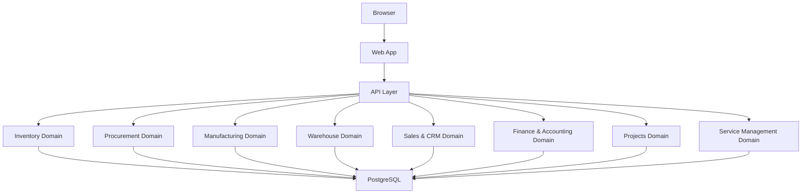

**Diagram sources**
- [README.md:275-298](file://README.md#L275-L298)

**Section sources**
- [README.md:275-298](file://README.md#L275-L298)

## Core Components
Each domain package encapsulates its own aggregates, repositories, errors, and utilities. The package index files expose the public surface area for other parts of the system to consume.

- Inventory: components, locations, manufacturers, categories, units, ledger, adjustments, projections, reservations, batches, serials, attributes
- Procurement: suppliers, purchase orders, goods receipts, supplier returns, purchase invoices, policies
- Manufacturing: BOMs, production orders, material consumptions, finished goods receipt, traceability
- Warehouse: warehouses, stock counts, cycle counts, transfers, policies
- Sales & CRM: customers, quotations, sales orders, fulfillment, returns
- Finance & Accounting: accounts, journals, receivables, payables, payments, banking
- Projects: projects, tasks, time entries
- Service: service requests, work orders, warranty claims, RMA, maintenance schedules, notes

These packages follow DDD conventions: aggregates own identity, timestamps, invariants, and behavior; repositories persist aggregates; application services orchestrate flows without embedding business rules.

**Section sources**
- [inventory index.ts:1-13](file://packages/inventory/src/index.ts#L1-L13)
- [procurement index.ts:1-7](file://packages/procurement/src/index.ts#L1-L7)
- [manufacturing index.ts:1-6](file://packages/manufacturing/src/index.ts#L1-L6)
- [warehouse index.ts:1-6](file://packages/warehouse/src/index.ts#L1-L6)
- [sales index.ts:1-6](file://packages/sales/src/index.ts#L1-L6)
- [finance index.ts:1-7](file://packages/finance/src/index.ts#L1-L7)
- [projects index.ts:1-4](file://packages/projects/src/index.ts#L1-L4)
- [service index.ts:1-7](file://packages/service/src/index.ts#L1-L7)
- [DDD.md:62-126](file://docs/architecture/DDD.md#L62-L126)
- [DDD.md:174-207](file://docs/architecture/DDD.md#L174-L207)

## Architecture Overview
Ananya follows a layered, domain-first architecture:
- API Layer: validates input, coordinates use cases, returns results
- Domain Packages: own business rules, invariants, and aggregate lifecycles
- Repository Interfaces: define contracts for persistence
- Infrastructure: Drizzle/PostgreSQL, external services, file systems

Dependencies point downward. The domain never depends on infrastructure. Validation happens at both API and domain layers. Identity and timestamps are owned by aggregates. Mapping between aggregates and persistence rows is handled in infrastructure.

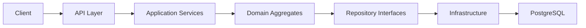

**Diagram sources**
- [ARCHITECTURE.md:33-59](file://docs/architecture/ARCHITECTURE.md#L33-L59)
- [DDD.md:28-59](file://docs/architecture/DDD.md#L28-L59)

**Section sources**
- [ARCHITECTURE.md:17-59](file://docs/architecture/ARCHITECTURE.md#L17-L59)
- [DDD.md:28-59](file://docs/architecture/DDD.md#L28-L59)

## Detailed Component Analysis

### Inventory Management
Purpose: Track items, locations, and movements; maintain accurate stock levels through an immutable ledger; support batch and serial tracking; manage attributes and categories.

Key entities:
- Component (item definition, SKU, attributes)
- Location (physical or logical place)
- Manufacturer (source of components)
- Category (classification)
- Unit (units of measure)
- InventoryTransaction (ledger entries)
- StockAdjustment (non-transactional adjustments)
- Reservation (committed quantities)
- Batch and Serial (traceability identifiers)
- AttributeDefinition and values

Workflows:
- Create/update component with category attributes and SKU rules
- Record inventory transactions (receipts, issues, adjustments)
- Reserve quantities for downstream processes
- Rebuild projections from ledger for forward-looking availability

Business rules:
- Aggregates enforce invariants (e.g., valid SKU, attribute constraints)
- Ledger entries are immutable and authoritative
- Reservations reduce available quantity without changing physical stock until consumed

Integration points:
- Procurement creates receipts that post inventory transactions
- Manufacturing consumes materials and posts finished goods
- Warehouse performs counts and transfers affecting inventory
- Sales fulfills against reservations and posted stock

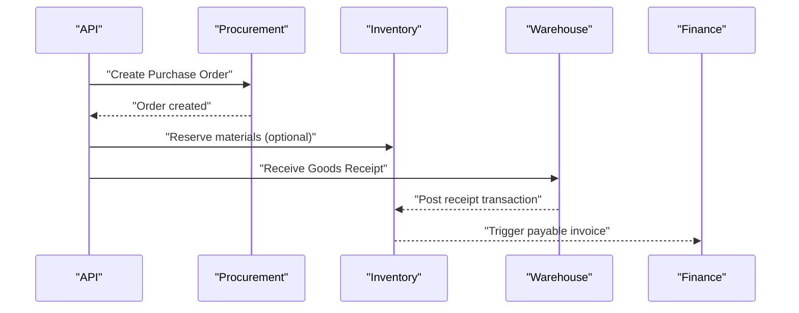

**Diagram sources**
- [procurement index.ts:1-7](file://packages/procurement/src/index.ts#L1-L7)
- [inventory index.ts:1-13](file://packages/inventory/src/index.ts#L1-L13)
- [warehouse index.ts:1-6](file://packages/warehouse/src/index.ts#L1-L6)
- [finance index.ts:1-7](file://packages/finance/src/index.ts#L1-L7)

**Section sources**
- [inventory index.ts:1-13](file://packages/inventory/src/index.ts#L1-L13)
- [DDD.md:62-126](file://docs/architecture/DDD.md#L62-L126)

### Procurement
Purpose: Manage suppliers, purchase orders, goods receipts, supplier returns, purchase invoices, and procurement policies.

Key entities:
- Supplier
- Purchase Order
- Goods Receipt
- Supplier Return
- Purchase Invoice
- Policy (reorder rules, approval workflows)

Workflows:
- Create purchase order with line items and currency
- Receive goods and reconcile against order
- Generate supplier return when needed
- Match three-way (PO, receipt, invoice) before posting

Business rules:
- Currency handling per order
- Three-way matching enforces accuracy before invoicing
- Policies drive recommendations and approvals

Integration points:
- Posts inventory transactions via goods receipts
- Creates payables for purchase invoices
- Feeds MRP/planning signals

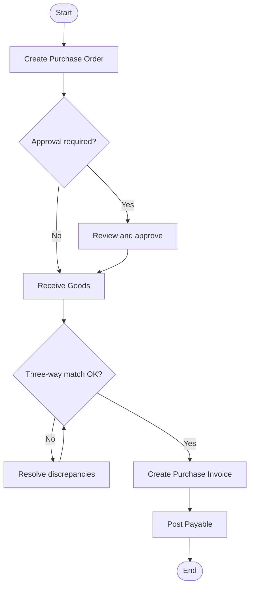

**Diagram sources**
- [procurement index.ts:1-7](file://packages/procurement/src/index.ts#L1-L7)
- [finance index.ts:1-7](file://packages/finance/src/index.ts#L1-L7)

**Section sources**
- [procurement index.ts:1-7](file://packages/procurement/src/index.ts#L1-L7)

### Manufacturing
Purpose: Plan and execute production using BOMs, track material consumption, record finished goods, and ensure traceability.

Key entities:
- Bill of Materials (BOM)
- Production Order
- Material Consumption
- Finished Goods Receipt
- Traceability records

Workflows:
- Define BOM with components and quantities
- Create production order referencing BOM
- Consume materials during production
- Record finished goods into inventory
- Maintain traceability across batches/serials

Business rules:
- BOM validity and versioning
- Material consumption must align with BOM and availability
- Finished goods receipt updates inventory and cost

Integration points:
- Consumes inventory and posts transactions
- Produces finished goods that feed sales and warehouse
- Supports traceability across supply chain

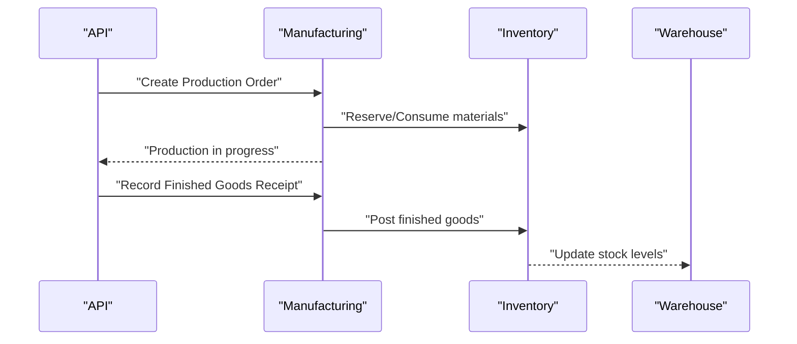

**Diagram sources**
- [manufacturing index.ts:1-6](file://packages/manufacturing/src/index.ts#L1-L6)
- [inventory index.ts:1-13](file://packages/inventory/src/index.ts#L1-L13)
- [warehouse index.ts:1-6](file://packages/warehouse/src/index.ts#L1-L6)

**Section sources**
- [manufacturing index.ts:1-6](file://packages/manufacturing/src/index.ts#L1-L6)

### Warehouse Operations
Purpose: Model warehouses, bins, stock counts, cycle counts, and transfers to control physical inventory movement and accuracy.

Key entities:
- Warehouse
- Stock Count
- Cycle Count
- Transfer
- Policy (rules for counting, allocation)

Workflows:
- Perform stock counts and adjust inventory
- Run cycle counts to maintain accuracy
- Execute transfers between locations
- Enforce policies for receiving, putaway, and picking

Business rules:
- Counts must be approved before posting
- Transfers require source and destination authorization
- Policies govern allocation and counting strategies

Integration points:
- Adjusts inventory ledger via counts and transfers
- Supports fulfillment by ensuring accurate stock
- Integrates with procurement receipts and manufacturing outputs

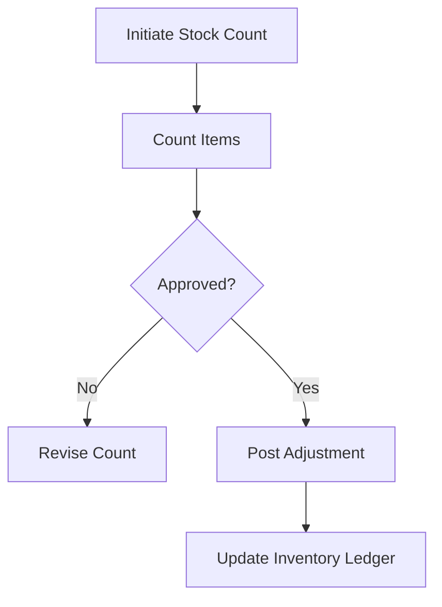

**Diagram sources**
- [warehouse index.ts:1-6](file://packages/warehouse/src/index.ts#L1-L6)
- [inventory index.ts:1-13](file://packages/inventory/src/index.ts#L1-L13)

**Section sources**
- [warehouse index.ts:1-6](file://packages/warehouse/src/index.ts#L1-L6)

### Sales & CRM
Purpose: Manage customers, opportunities, quotations, sales orders, fulfillment, and returns to drive revenue and customer satisfaction.

Key entities:
- Customer
- Quotation
- Sales Order
- Fulfillment Request
- Return

Workflows:
- Create and manage customer records
- Generate quotations and convert to sales orders
- Fulfill orders against reserved or available stock
- Process returns and credit memos

Business rules:
- Quotations have expiry and pricing rules
- Sales orders validate availability and reservations
- Returns require reason codes and approvals

Integration points:
- Reserves inventory for fulfillment
- Triggers shipping/delivery processes
- Posts receivables and invoices in finance

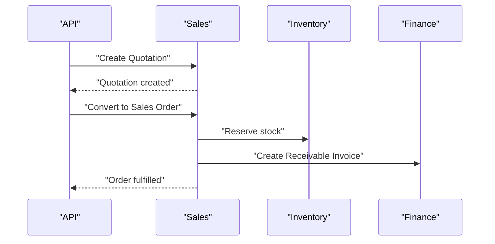

**Diagram sources**
- [sales index.ts:1-6](file://packages/sales/src/index.ts#L1-L6)
- [inventory index.ts:1-13](file://packages/inventory/src/index.ts#L1-L13)
- [finance index.ts:1-7](file://packages/finance/src/index.ts#L1-L7)

**Section sources**
- [sales index.ts:1-6](file://packages/sales/src/index.ts#L1-L6)

### Finance & Accounting
Purpose: Maintain chart of accounts, journal entries, receivables, payables, payments, and bank reconciliation to ensure accurate financial reporting.

Key entities:
- Account
- Journal Entry
- Receivable Invoice
- Payable Invoice
- Payment
- Bank Reconciliation

Workflows:
- Post journal entries for transactions
- Manage receivables from sales and payables from procurement
- Record payments and reconcile bank statements

Business rules:
- Double-entry integrity for journal entries
- Payments must reconcile against invoices
- Reconciliation ensures bank balances match books

Integration points:
- Receives events from sales (receivables) and procurement (payables)
- Updates inventory valuation where applicable
- Provides audit trail for all financial movements

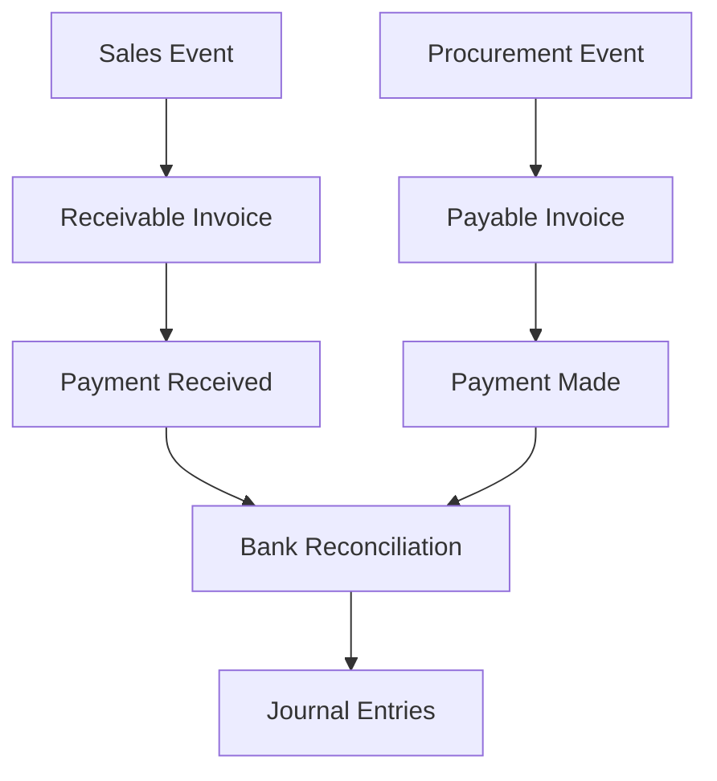

**Diagram sources**
- [finance index.ts:1-7](file://packages/finance/src/index.ts#L1-L7)
- [sales index.ts:1-6](file://packages/sales/src/index.ts#L1-L6)
- [procurement index.ts:1-7](file://packages/procurement/src/index.ts#L1-L7)

**Section sources**
- [finance index.ts:1-7](file://packages/finance/src/index.ts#L1-L7)

### Project Management
Purpose: Organize work through projects, tasks, and time tracking to plan, execute, and measure delivery.

Key entities:
- Project
- Task
- Time Entry

Workflows:
- Create projects with goals and milestones
- Assign tasks and track progress
- Log time against tasks for costing and reporting

Business rules:
- Tasks belong to projects and can be prioritized
- Time entries must reference valid tasks and users
- Project budgets and actuals derived from time and costs

Integration points:
- Links to service work orders and maintenance
- Feeds cost data into finance
- Supports resource planning

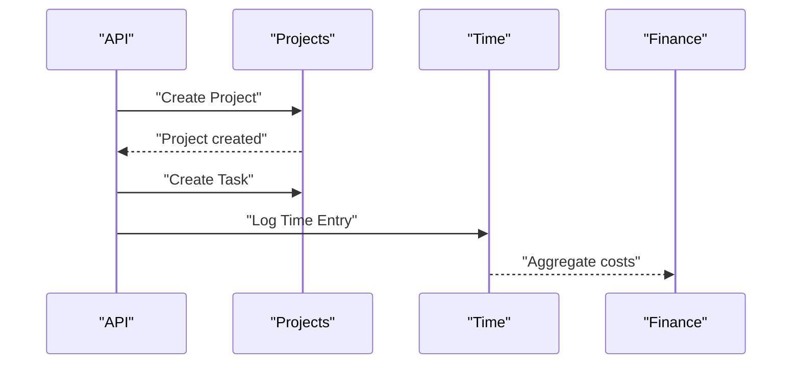

**Diagram sources**
- [projects index.ts:1-4](file://packages/projects/src/index.ts#L1-L4)
- [finance index.ts:1-7](file://packages/finance/src/index.ts#L1-L7)

**Section sources**
- [projects index.ts:1-4](file://packages/projects/src/index.ts#L1-L4)

### Service Management
Purpose: Handle service requests, work orders, warranty claims, RMA, maintenance schedules, and notes to deliver after-sales support.

Key entities:
- Service Request
- Work Order
- Warranty Claim
- RMA Request
- Maintenance Schedule
- Note

Workflows:
- Capture service requests and create work orders
- Manage warranty and RMA processes
- Schedule preventive maintenance
- Attach notes for context and history

Business rules:
- Work orders must link to assets or products
- Warranty eligibility based on policy and dates
- RMA requires inspection and disposition

Integration points:
- Consumes inventory for replacements
- Generates service-related invoices or credits
- Updates asset status and maintenance history

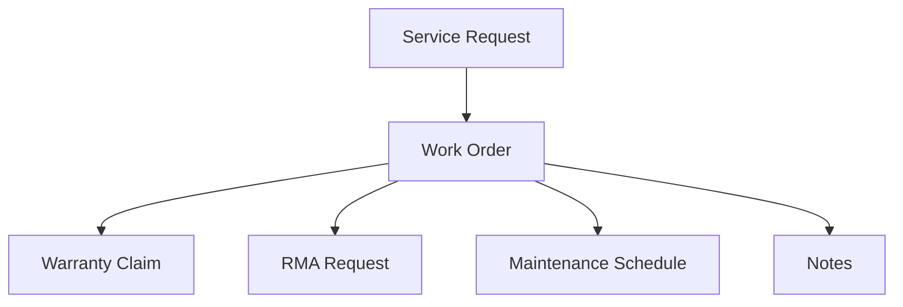

**Diagram sources**
- [service index.ts:1-7](file://packages/service/src/index.ts#L1-L7)

**Section sources**
- [service index.ts:1-7](file://packages/service/src/index.ts#L1-L7)

## Dependency Analysis
Domain packages are independent modules with clear responsibilities. Cross-domain interactions occur through well-defined APIs and events:
- Procurement posts inventory transactions via goods receipts
- Manufacturing consumes materials and posts finished goods
- Sales reserves and fulfills against inventory
- Finance records receivables/payables and reconciles payments
- Warehouse adjusts stock via counts and transfers
- Projects and Service integrate with finance for costing and maintenance

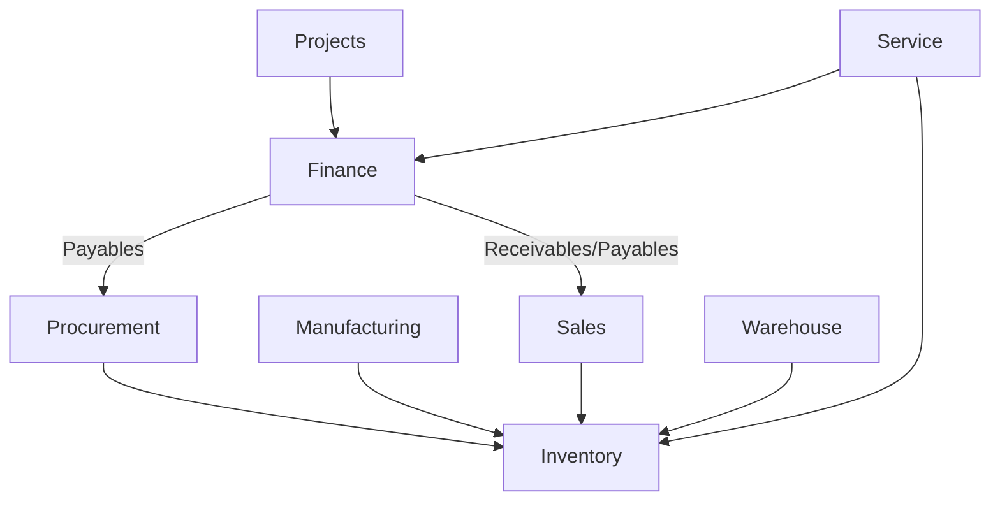

**Diagram sources**
- [procurement index.ts:1-7](file://packages/procurement/src/index.ts#L1-L7)
- [manufacturing index.ts:1-6](file://packages/manufacturing/src/index.ts#L1-L6)
- [sales index.ts:1-6](file://packages/sales/src/index.ts#L1-L6)
- [warehouse index.ts:1-6](file://packages/warehouse/src/index.ts#L1-L6)
- [finance index.ts:1-7](file://packages/finance/src/index.ts#L1-L7)
- [projects index.ts:1-4](file://packages/projects/src/index.ts#L1-L4)
- [service index.ts:1-7](file://packages/service/src/index.ts#L1-L7)

**Section sources**
- [ARCHITECTURE.md:33-59](file://docs/architecture/ARCHITECTURE.md#L33-L59)
- [DDD.md:84-109](file://docs/architecture/DDD.md#L84-L109)

## Performance Considerations
- Prefer domain-level validations to reduce invalid state propagation
- Use repository abstractions to optimize queries and caching strategies
- Keep ledger-based inventory immutable to simplify auditing and projections
- Batch operations where possible (e.g., bulk stock adjustments)
- Offload heavy computations (projections, planning) to background workers

[No sources needed since this section provides general guidance]

## Troubleshooting Guide
Common issues and resolutions:
- Migration failures: verify PostgreSQL health and credentials
- API unavailable: check JWT secret, CORS settings, and database connectivity
- Data Packs installation fails: ensure migrations completed successfully first
- Logs: inspect api, web, worker, ml, and db logs for errors

Operational tips:
- Use compose commands to check service status and view recent logs
- Validate environment variables for API_PUBLIC_URL and CORS_ORIGIN
- Back up PostgreSQL and uploads regularly

**Section sources**
- [README.md:162-190](file://README.md#L162-L190)

## Conclusion
Ananya’s domain-driven modular monolith cleanly separates concerns across inventory, procurement, manufacturing, warehouse, sales, finance, projects, and service domains. Each domain owns its aggregates, repositories, and rules, enabling scalable growth and maintainability. By following DDD conventions, leveraging repository abstractions, and integrating through clear boundaries, teams can extend capabilities or add new domains with minimal disruption.

[No sources needed since this section summarizes without analyzing specific files]

## Appendices

### Practical Examples

#### Purchase Order Lifecycle
- Create purchase order with supplier and line items
- Approve based on policy thresholds
- Receive goods and reconcile against order
- Match three-way (PO, receipt, invoice)
- Post payable and update inventory

**Section sources**
- [procurement index.ts:1-7](file://packages/procurement/src/index.ts#L1-L7)
- [finance index.ts:1-7](file://packages/finance/src/index.ts#L1-L7)

#### Production Planning
- Define BOM with components and quantities
- Create production order and reserve materials
- Consume materials during execution
- Record finished goods and update inventory
- Maintain traceability across batches/serials

**Section sources**
- [manufacturing index.ts:1-6](file://packages/manufacturing/src/index.ts#L1-L6)
- [inventory index.ts:1-13](file://packages/inventory/src/index.ts#L1-L13)

#### Customer Management
- Create and update customer records
- Generate quotations and convert to sales orders
- Fulfill orders against reservations and stock
- Process returns and issue credits

**Section sources**
- [sales index.ts:1-6](file://packages/sales/src/index.ts#L1-L6)

#### Financial Transactions
- Post journal entries for all financial events
- Manage receivables from sales and payables from procurement
- Record payments and reconcile bank statements
- Ensure double-entry integrity and auditability

**Section sources**
- [finance index.ts:1-7](file://packages/finance/src/index.ts#L1-L7)

### Extending or Creating New Domains
Follow these steps:
- Define aggregates with identity, timestamps, invariants, and behavior
- Implement repository interfaces for persistence
- Create application services to orchestrate use cases
- Add API controllers and DTOs in apps/api
- Expose package exports via index.ts
- Write tests for domain rules and application flows
- Document decisions in RFCs under docs/rfcs

Guidelines:
- Keep dependencies pointing downward
- Avoid leaking infrastructure into domain
- Use domain errors for business failures and infrastructure errors for system failures
- Preserve immutability and explicit mutations

**Section sources**
- [DDD.md:62-126](file://docs/architecture/DDD.md#L62-L126)
- [DDD.md:174-207](file://docs/architecture/DDD.md#L174-L207)
- [DDD.md:263-290](file://docs/architecture/DDD.md#L263-L290)
- [ARCHITECTURE.md:17-59](file://docs/architecture/ARCHITECTURE.md#L17-L59)