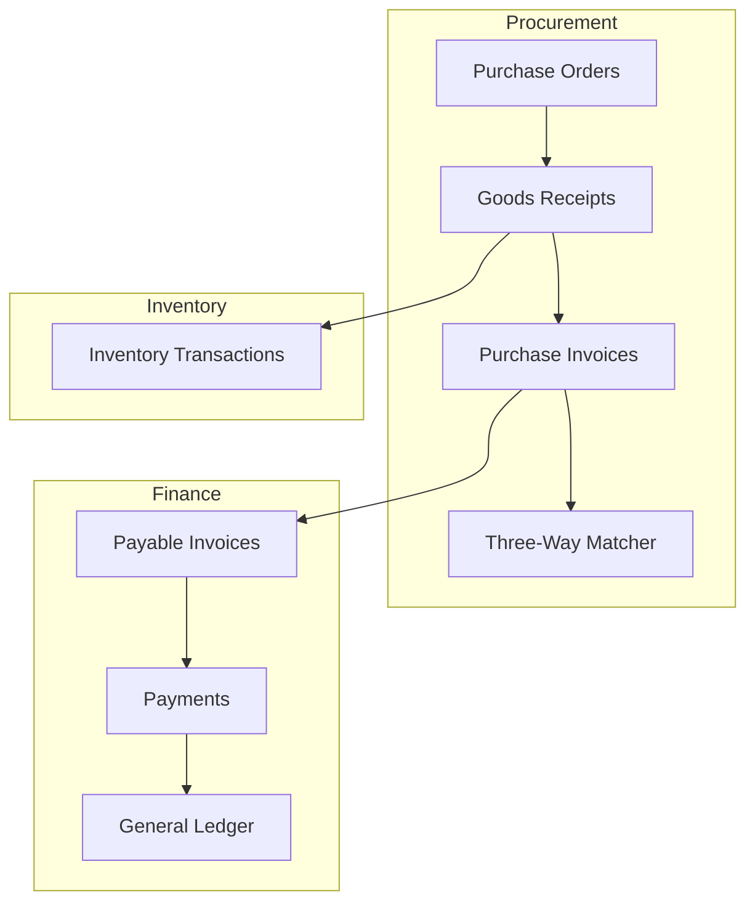
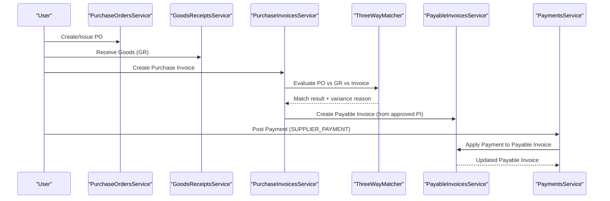
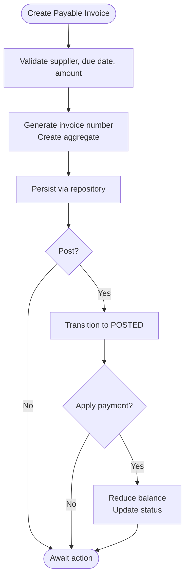
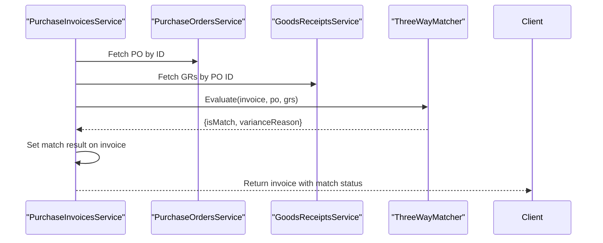
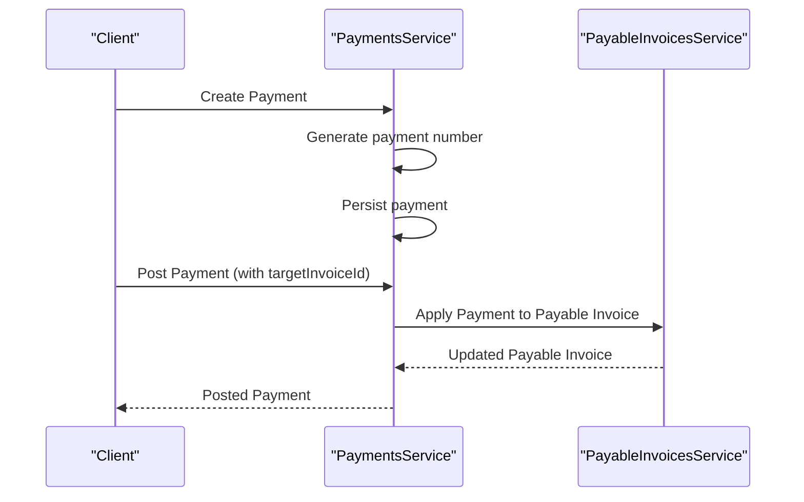
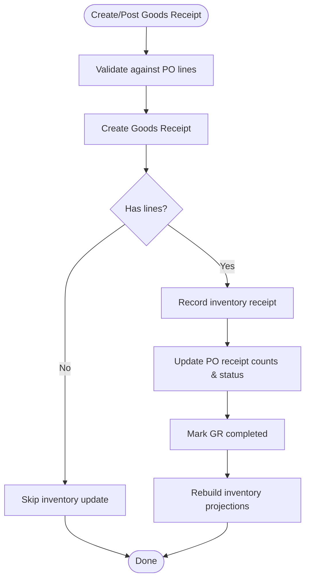
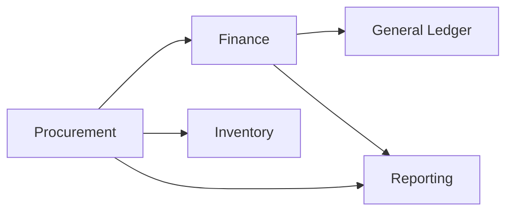

# Accounts Payable

<cite>
**Referenced Files in This Document**
- [RFC-0034: Accounts Payable](file://docs/rfcs/0034-accounts-payable.md)
- [Payable Invoices Service](file://apps/api/src/payable-invoices/payable-invoices.service.ts)
- [Purchase Invoices Service](file://apps/api/src/purchase-invoices/purchase-invoices.service.ts)
- [Payments Service](file://apps/api/src/payments/payments.service.ts)
- [Goods Receipts Service](file://apps/api/src/goods-receipts/goods-receipts.service.ts)
- [Purchase Orders Service](file://apps/api/src/purchase-orders/purchase-orders.service.ts)
- [Three-Way Matcher](file://packages/procurement/src/purchase-invoices/three-way-matcher.ts)
- [Payable Invoice Domain](file://packages/finance/src/payables/payable-invoice.ts)
- [Payable Invoice Repository](file://packages/finance/src/payables/payable-invoice.repository.ts)
- [Payment Domain](file://packages/finance/src/payments/payment.ts)
- [Payment Repository](file://packages/finance/src/payments/payment.repository.ts)
</cite>

## Table of Contents
1. [Introduction](#introduction)
2. [Project Structure](#project-structure)
3. [Core Components](#core-components)
4. [Architecture Overview](#architecture-overview)
5. [Detailed Component Analysis](#detailed-component-analysis)
6. [Dependency Analysis](#dependency-analysis)
7. [Performance Considerations](#performance-considerations)
8. [Troubleshooting Guide](#troubleshooting-guide)
9. [Conclusion](#conclusion)
10. [Appendices](#appendices)

## Introduction
This document provides comprehensive documentation for the Accounts Payable module in Ananya ERP. It covers vendor invoice processing, payment scheduling and execution, three-way matching (purchase order, goods receipt, invoice), and the end-to-end payables workflow from purchase order through vendor payment. It also explains integration points with procurement, inventory, and general ledger systems; expense allocation and tax handling considerations; compliance reporting; vendor management; payment terms; and cash flow optimization strategies.

The module is designed around domain-driven principles with clear separation between application services, domain aggregates, and repositories, enabling robust workflows, auditability, and extensibility.

## Project Structure
The Accounts Payable functionality spans multiple modules within the API layer and shared packages:
- Procurement: Purchase orders, goods receipts, purchase invoices, and three-way matching logic.
- Finance: Payable invoices, payments, journal entries, and banking reconciliation.
- Inventory: Stock movements triggered by goods receipts.
- Reporting: Supplier aging and related analytics.

**Diagram sources**
- [Purchase Orders Service](file://apps/api/src/purchase-orders/purchase-orders.service.ts)
- [Goods Receipts Service](file://apps/api/src/goods-receipts/goods-receipts.service.ts)
- [Purchase Invoices Service](file://apps/api/src/purchase-invoices/purchase-invoices.service.ts)
- [Three-Way Matcher](file://packages/procurement/src/purchase-invoices/three-way-matcher.ts)
- [Payable Invoices Service](file://apps/api/src/payable-invoices/payable-invoices.service.ts)
- [Payments Service](file://apps/api/src/payments/payments.service.ts)

**Section sources**
- [RFC-0034: Accounts Payable](file://docs/rfcs/0034-accounts-payable.md)

## Core Components
- Payable Invoice: Represents a financial liability to a supplier, originating from procurement purchase invoices. Supports creation, posting, payment application, cancellation, and status transitions.
- Purchase Invoice: Captures vendor billing details, links to purchase orders and goods receipts, supports line items, approval, and three-way matching.
- Payment: Records outgoing or incoming payments, supports posting and automatic allocation to receivable or payable invoices.
- Goods Receipt: Records physical receipt of goods against purchase orders, updates inventory, and adjusts purchase order fulfillment status.
- Three-Way Matching: Validates alignment among purchase order, goods receipt, and invoice to detect variances and enforce policy.

Key responsibilities:
- Enforce business rules and state transitions at the domain level.
- Coordinate cross-module operations via application services.
- Persist data through repository abstractions.

**Section sources**
- [Payable Invoices Service](file://apps/api/src/payable-invoices/payable-invoices.service.ts)
- [Purchase Invoices Service](file://apps/api/src/purchase-invoices/purchase-invoices.service.ts)
- [Payments Service](file://apps/api/src/payments/payments.service.ts)
- [Goods Receipts Service](file://apps/api/src/goods-receipts/goods-receipts.service.ts)
- [Three-Way Matcher](file://packages/procurement/src/purchase-invoices/three-way-matcher.ts)
- [Payable Invoice Domain](file://packages/finance/src/payables/payable-invoice.ts)
- [Payment Domain](file://packages/finance/src/payments/payment.ts)

## Architecture Overview
The Accounts Payable architecture follows a layered approach:
- API Layer: Controllers expose endpoints that delegate to services.
- Application Services: Orchestrate use cases, validate inputs, and coordinate domain actions.
- Domain Layer: Encapsulates business logic, invariants, and state machines.
- Infrastructure Layer: Repositories implement persistence and external integrations.

**Diagram sources**
- [Purchase Orders Service](file://apps/api/src/purchase-orders/purchase-orders.service.ts)
- [Goods Receipts Service](file://apps/api/src/goods-receipts/goods-receipts.service.ts)
- [Purchase Invoices Service](file://apps/api/src/purchase-invoices/purchase-invoices.service.ts)
- [Three-Way Matcher](file://packages/procurement/src/purchase-invoices/three-way-matcher.ts)
- [Payable Invoices Service](file://apps/api/src/payable-invoices/payable-invoices.service.ts)
- [Payments Service](file://apps/api/src/payments/payments.service.ts)

## Detailed Component Analysis

### Payable Invoices
Responsibilities:
- Create payable invoices linked to suppliers and source purchase invoices.
- Post invoices to move them into accounting-ready states.
- Apply partial or full payments to reduce outstanding balances.
- Cancel invoices when necessary.

State transitions:
- Draft → Posted → Partially Paid → Paid or Cancelled.

Integration:
- Receives input from procurement purchase invoices.
- Updates balances and triggers downstream accounting entries via finance domain.

**Diagram sources**
- [Payable Invoices Service](file://apps/api/src/payable-invoices/payable-invoices.service.ts)
- [Payable Invoice Domain](file://packages/finance/src/payables/payable-invoice.ts)
- [Payable Invoice Repository](file://packages/finance/src/payables/payable-invoice.repository.ts)

**Section sources**
- [Payable Invoices Service](file://apps/api/src/payable-invoices/payable-invoices.service.ts)
- [RFC-0034: Accounts Payable](file://docs/rfcs/0034-accounts-payable.md)

### Purchase Invoices and Three-Way Matching
Responsibilities:
- Capture vendor invoice lines and metadata.
- Link to purchase orders and goods receipts.
- Perform three-way matching to detect variances and enforce policies.
- Approve invoices for payment and mark as paid upon settlement.

Matching logic:
- Compares quantities and amounts across PO, GR, and invoice.
- Returns match result and variance reason for downstream decisions.

**Diagram sources**
- [Purchase Invoices Service](file://apps/api/src/purchase-invoices/purchase-invoices.service.ts)
- [Three-Way Matcher](file://packages/procurement/src/purchase-invoices/three-way-matcher.ts)

**Section sources**
- [Purchase Invoices Service](file://apps/api/src/purchase-invoices/purchase-invoices.service.ts)
- [Three-Way Matcher](file://packages/procurement/src/purchase-invoices/three-way-matcher.ts)

### Payments and Allocation
Responsibilities:
- Record payments with type, method, amount, reference, and bank account.
- Post payments and optionally auto-allocate to target invoices.
- Support both customer and supplier payment types.

Allocation behavior:
- For supplier payments, automatically apply to the specified payable invoice.
- Ensures consistent reduction of outstanding liabilities.

**Diagram sources**
- [Payments Service](file://apps/api/src/payments/payments.service.ts)
- [Payable Invoices Service](file://apps/api/src/payable-invoices/payable-invoices.service.ts)

**Section sources**
- [Payments Service](file://apps/api/src/payments/payments.service.ts)

### Goods Receipts and Inventory Integration
Responsibilities:
- Validate receiving quantities against purchase order remaining quantities.
- Record stock receipts in the inventory ledger.
- Update purchase order line receipt counts and overall status.
- Rebuild inventory projections after changes.

Workflow highlights:
- Prevents over-receiving beyond ordered quantities.
- Ensures inventory accuracy and traceability.

**Diagram sources**
- [Goods Receipts Service](file://apps/api/src/goods-receipts/goods-receipts.service.ts)

**Section sources**
- [Goods Receipts Service](file://apps/api/src/goods-receipts/goods-receipts.service.ts)

### Purchase Orders
Responsibilities:
- Create, update, submit, approve, issue, and cancel purchase orders.
- Resolve currency based on system settings and explicit values.
- Manage lines and lifecycle transitions.

Integration:
- Serves as the authoritative source for expected quantities and pricing for three-way matching.

**Section sources**
- [Purchase Orders Service](file://apps/api/src/purchase-orders/purchase-orders.service.ts)

## Dependency Analysis
The Accounts Payable module depends on:
- Procurement domain for purchase orders, goods receipts, and purchase invoices.
- Finance domain for payable invoices and payments.
- Inventory transactions for stock movements.
- Reporting capabilities for supplier aging and metrics.

**Diagram sources**
- [Purchase Invoices Service](file://apps/api/src/purchase-invoices/purchase-invoices.service.ts)
- [Payable Invoices Service](file://apps/api/src/payable-invoices/payable-invoices.service.ts)
- [Payments Service](file://apps/api/src/payments/payments.service.ts)
- [Goods Receipts Service](file://apps/api/src/goods-receipts/goods-receipts.service.ts)

**Section sources**
- [RFC-0034: Accounts Payable](file://docs/rfcs/0034-accounts-payable.md)

## Performance Considerations
- Batch operations: When creating multiple goods receipt lines or applying multiple payments, consider batching repository saves to reduce database round-trips.
- Asynchronous tasks: Inventory projection rebuilds can be executed asynchronously to avoid blocking user interactions.
- Indexing: Ensure indexes on foreign keys such as supplierId, purchaseOrderId, and status fields to optimize queries for large datasets.
- Caching: Cache lookup-heavy references like supplier master data and chart of accounts where appropriate.
- Validation early: Validate inputs at the service boundary to prevent expensive domain operations on invalid data.

[No sources needed since this section provides general guidance]

## Troubleshooting Guide
Common issues and resolutions:
- Over-receiving goods: If goods receipt quantity exceeds purchase order remaining quantity, an error will be raised. Review PO lines and adjust receiving quantities accordingly.
- Three-way mismatch: If invoice does not match PO and GR, investigate variance reasons and adjust invoice lines or receive additional goods before approval.
- Payment allocation errors: Ensure the target invoice exists and is eligible for payment application. Check invoice status and outstanding balance.
- Duplicate postings: Verify idempotency in payment posting and ensure unique payment numbers are generated.

Operational checks:
- Confirm supplier IDs and due dates are valid for payable invoices.
- Validate that purchase invoices have required references (supplier, purchase order).
- Monitor inventory projections after goods receipt posting to ensure consistency.

**Section sources**
- [Goods Receipts Service](file://apps/api/src/goods-receipts/goods-receipts.service.ts)
- [Purchase Invoices Service](file://apps/api/src/purchase-invoices/purchase-invoices.service.ts)
- [Payable Invoices Service](file://apps/api/src/payable-invoices/payable-invoices.service.ts)
- [Payments Service](file://apps/api/src/payments/payments.service.ts)

## Conclusion
Ananya ERP’s Accounts Payable module provides a robust, domain-driven foundation for managing vendor bills, payments, and compliance. The integration with procurement and inventory ensures accurate three-way matching and real-time stock updates, while finance domain services enable reliable payment application and accounting integrity. By following the documented workflows and leveraging the provided APIs, organizations can streamline payables processes, maintain strong controls, and optimize cash flow.

[No sources needed since this section summarizes without analyzing specific files]

## Appendices

### Practical Examples

#### Vendor Invoice Entry
- Create a purchase invoice referencing a purchase order and goods receipt.
- Add line items with quantities and amounts.
- Run three-way matching to validate alignment.
- Approve the invoice for payment.

References:
- [Purchase Invoices Service](file://apps/api/src/purchase-invoices/purchase-invoices.service.ts)
- [Three-Way Matcher](file://packages/procurement/src/purchase-invoices/three-way-matcher.ts)

#### Approval Workflows
- After successful matching, approve the purchase invoice.
- Optionally enforce multi-level approvals based on organizational policies.

References:
- [Purchase Invoices Service](file://apps/api/src/purchase-invoices/purchase-invoices.service.ts)

#### Payment Runs
- Create a supplier payment with amount, method, and reference.
- Post the payment and allocate it to the target payable invoice.
- Verify reduced outstanding balance on the payable invoice.

References:
- [Payments Service](file://apps/api/src/payments/payments.service.ts)
- [Payable Invoices Service](file://apps/api/src/payable-invoices/payable-invoices.service.ts)

#### Vendor Statements
- Query payable invoices filtered by supplier and status to generate statements.
- Include aging buckets (0–30, 31–60, 61–90, 90+) for unpaid liabilities.

References:
- [RFC-0034: Accounts Payable](file://docs/rfcs/0034-accounts-payable.md)

### Integration with Procurement, Inventory, and General Ledger
- Procurement: Purchase orders and goods receipts drive invoice creation and matching.
- Inventory: Goods receipts record stock movements and update projections.
- General Ledger: Payable invoices and payments post expense and liability entries.

References:
- [Goods Receipts Service](file://apps/api/src/goods-receipts/goods-receipts.service.ts)
- [Payable Invoices Service](file://apps/api/src/payable-invoices/payable-invoices.service.ts)
- [Payments Service](file://apps/api/src/payments/payments.service.ts)

### Expense Allocation, Tax Handling, and Compliance Reporting
- Expense allocation: Use invoice lines to allocate costs to cost centers, projects, or departments as configured in your organization.
- Tax handling: Configure tax codes and rates per line item; ensure tax calculations align with local regulations.
- Compliance reporting: Generate supplier aging reports and audit trails for all payable transactions.

References:
- [RFC-0034: Accounts Payable](file://docs/rfcs/0034-accounts-payable.md)

### Vendor Management, Payment Terms, and Cash Flow Optimization
- Vendor management: Maintain supplier master data including payment terms, currencies, and contact information.
- Payment terms: Define net days, early payment discounts, and penalties for late payments.
- Cash flow optimization: Schedule payments to leverage discounts while maintaining liquidity; monitor aging to prioritize high-risk vendors.

References:
- [RFC-0034: Accounts Payable](file://docs/rfcs/0034-accounts-payable.md)