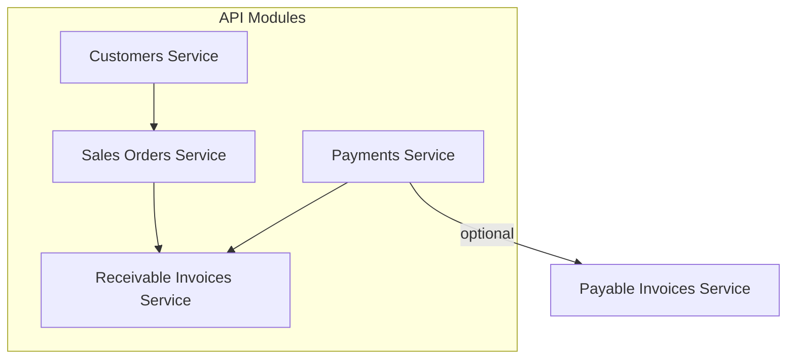
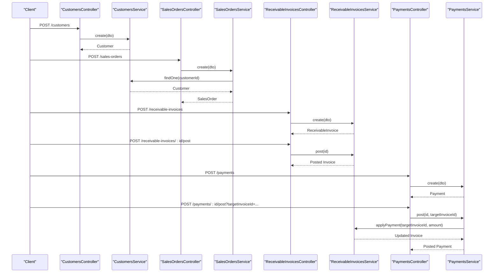
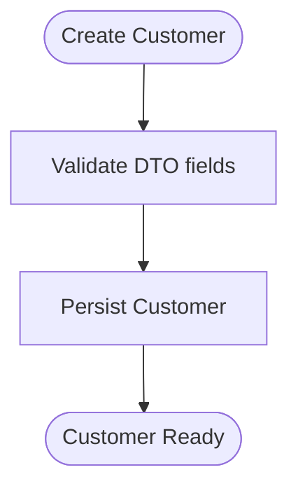
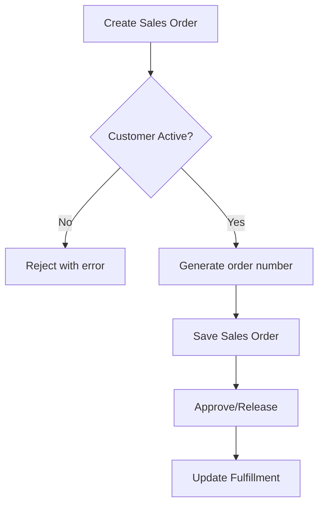
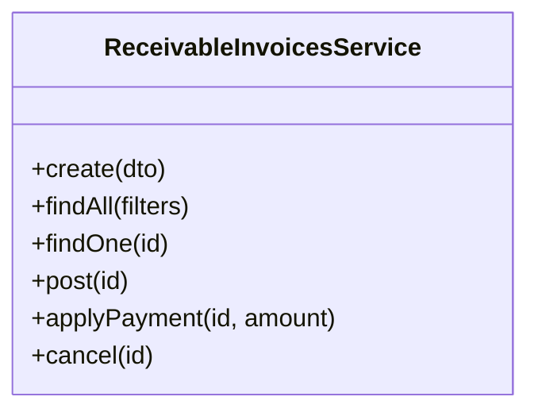
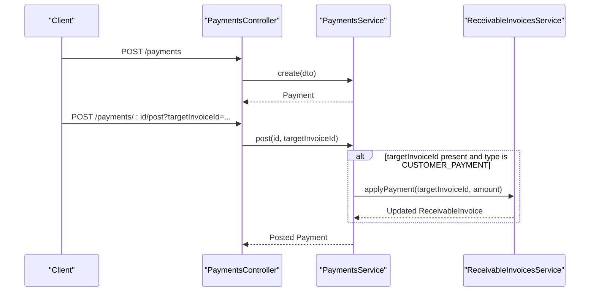
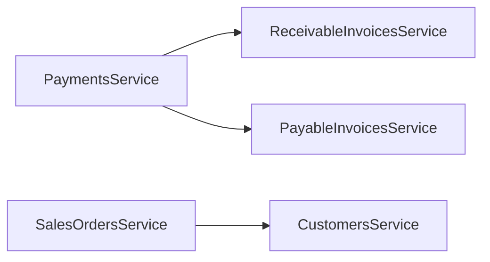

# Accounts Receivable

<cite>
**Referenced Files in This Document**
- [receivable-invoices.service.ts](file://apps/api/src/receivable-invoices/receivable-invoices.service.ts)
- [receivable-invoices.controller.ts](file://apps/api/src/receivable-invoices/receivable-invoices.controller.ts)
- [receivable-invoices.dtos.ts](file://apps/api/src/receivable-invoices/dtos.ts)
- [payments.service.ts](file://apps/api/src/payments/payments.service.ts)
- [payments.controller.ts](file://apps/api/src/payments/payments.controller.ts)
- [payments.dtos.ts](file://apps/api/src/payments/dtos.ts)
- [customers.service.ts](file://apps/api/src/customers/customers.service.ts)
- [customers.controller.ts](file://apps/api/src/customers/customers.controller.ts)
- [customers.dtos.ts](file://apps/api/src/customers/dtos.ts)
- [sales-orders.service.ts](file://apps/api/src/sales-orders/sales-orders.service.ts)
- [sales-orders.controller.ts](file://apps/api/src/sales-orders/sales-orders.controller.ts)
- [sales-orders.dtos.ts](file://apps/api/src/sales-orders/dtos.ts)
</cite>

## Table of Contents
1. Introduction
2. Project Structure
3. Core Components
4. Architecture Overview
5. Detailed Component Analysis
6. Dependency Analysis
7. Performance Considerations
8. Troubleshooting Guide
9. Conclusion

## Introduction
This document explains the Accounts Receivable (AR) module in Ananya ERP, focusing on invoice creation, customer billing cycles, payment application, and aging analysis. It covers the end-to-end workflow from sales order fulfillment through cash collection, including integration with customers, sales orders, and payments. Practical examples illustrate setting up customers, processing invoices, applying payments, and managing credit-related controls. It also outlines reporting for aging, dunning processes, dispute handling, credit memos, and write-offs.

## Project Structure
The AR functionality is implemented as a set of NestJS modules under apps/api/src:
- Customers: master data and lifecycle management
- Sales Orders: order creation, approval, release, and fulfillment updates
- Receivable Invoices: invoice creation, posting, cancellation, and payment application
- Payments: payment creation, posting, and automatic allocation to receivables or payables

**Diagram sources**
- [customers.service.ts:1-85](file://apps/api/src/customers/customers.service.ts#L1-L85)
- [sales-orders.service.ts:1-135](file://apps/api/src/sales-orders/sales-orders.service.ts#L1-L135)
- [receivable-invoices.service.ts:1-78](file://apps/api/src/receivable-invoices/receivable-invoices.service.ts#L1-L78)
- [payments.service.ts:1-88](file://apps/api/src/payments/payments.service.ts#L1-L88)

**Section sources**
- [customers.controller.ts:1-52](file://apps/api/src/customers/customers.controller.ts#L1-L52)
- [sales-orders.controller.ts:1-57](file://apps/api/src/sales-orders/sales-orders.controller.ts#L1-L57)
- [receivable-invoices.controller.ts:1-39](file://apps/api/src/receivable-invoices/receivable-invoices.controller.ts#L1-L39)
- [payments.controller.ts:1-42](file://apps/api/src/payments/payments.controller.ts#L1-L42)

## Core Components
- Customers: Create, activate/suspend, add contacts and addresses; used to validate customer status before creating sales orders.
- Sales Orders: Create from scratch or convert from accepted quotations; approve, release, update fulfillment, and cancel.
- Receivable Invoices: Create linked to a customer and sales order; post to become due; apply payments; cancel if needed.
- Payments: Create with type/method/amount; post and optionally auto-allocate to a target receivable or payable invoice.

Key responsibilities:
- Enforce business rules at service layer (e.g., active customer check).
- Persist entities via repositories injected into services.
- Expose REST endpoints via controllers with DTO validation.

**Section sources**
- [customers.service.ts:24-37](file://apps/api/src/customers/customers.service.ts#L24-L37)
- [sales-orders.service.ts:31-49](file://apps/api/src/sales-orders/sales-orders.service.ts#L31-L49)
- [receivable-invoices.service.ts:18-30](file://apps/api/src/receivable-invoices/receivable-invoices.service.ts#L18-L30)
- [payments.service.ts:23-36](file://apps/api/src/payments/payments.service.ts#L23-L36)

## Architecture Overview
The AR flow integrates four primary services:
- Customer validation ensures only active customers can proceed.
- Sales orders capture demand and drive fulfillment.
- Receivable invoices formalize amounts owed by customers.
- Payments record cash inflows and automatically reduce outstanding receivables when posted with a target invoice.

**Diagram sources**
- [customers.controller.ts:14-17](file://apps/api/src/customers/customers.controller.ts#L14-L17)
- [customers.service.ts:24-37](file://apps/api/src/customers/customers.service.ts#L24-L37)
- [sales-orders.controller.ts:14-17](file://apps/api/src/sales-orders/sales-orders.controller.ts#L14-L17)
- [sales-orders.service.ts:31-49](file://apps/api/src/sales-orders/sales-orders.service.ts#L31-L49)
- [receivable-invoices.controller.ts:10-13](file://apps/api/src/receivable-invoices/receivable-invoices.controller.ts#L10-L13)
- [receivable-invoices.service.ts:18-30](file://apps/api/src/receivable-invoices/receivable-invoices.service.ts#L18-L30)
- [receivable-invoices.controller.ts:29-32](file://apps/api/src/receivable-invoices/receivable-invoices.controller.ts#L29-L32)
- [receivable-invoices.service.ts:54-59](file://apps/api/src/receivable-invoices/receivable-invoices.service.ts#L54-L59)
- [payments.controller.ts:10-13](file://apps/api/src/payments/payments.controller.ts#L10-L13)
- [payments.service.ts:23-36](file://apps/api/src/payments/payments.service.ts#L23-L36)
- [payments.controller.ts:29-35](file://apps/api/src/payments/payments.controller.ts#L29-L35)
- [payments.service.ts:58-79](file://apps/api/src/payments/payments.service.ts#L58-L79)

## Detailed Component Analysis

### Customers
- Purpose: Master data for billing and credit tracking.
- Key operations:
  - Create with name, email, phone, tax ID, currency.
  - Activate/Suspend to control ordering and invoicing eligibility.
  - Add contacts and addresses for communication and shipping.
- Integration points:
  - Sales orders validate customer status before creation.
  - Receivable invoices reference customer IDs for billing.

**Diagram sources**
- [customers.controller.ts:14-17](file://apps/api/src/customers/customers.controller.ts#L14-L17)
- [customers.service.ts:24-37](file://apps/api/src/customers/customers.service.ts#L24-L37)

**Section sources**
- [customers.service.ts:24-37](file://apps/api/src/customers/customers.service.ts#L24-L37)
- [customers.controller.ts:14-17](file://apps/api/src/customers/customers.controller.ts#L14-L17)
- [customers.dtos.ts:10-30](file://apps/api/src/customers/dtos.ts#L10-L30)

### Sales Orders
- Purpose: Capture customer demand and drive fulfillment and subsequent invoicing.
- Key operations:
  - Create from scratch or convert from an accepted quotation.
  - Approve and release to authorize fulfillment.
  - Update line fulfillment quantities as goods are shipped.
  - Cancel orders when necessary.
- Business rule example:
  - Only active customers can have sales orders created.

**Diagram sources**
- [sales-orders.service.ts:31-49](file://apps/api/src/sales-orders/sales-orders.service.ts#L31-L49)
- [sales-orders.service.ts:103-115](file://apps/api/src/sales-orders/sales-orders.service.ts#L103-L115)
- [sales-orders.service.ts:117-126](file://apps/api/src/sales-orders/sales-orders.service.ts#L117-L126)

**Section sources**
- [sales-orders.service.ts:31-49](file://apps/api/src/sales-orders/sales-orders.service.ts#L31-L49)
- [sales-orders.service.ts:51-79](file://apps/api/src/sales-orders/sales-orders.service.ts#L51-L79)
- [sales-orders.service.ts:103-115](file://apps/api/src/sales-orders/sales-orders.service.ts#L103-L115)
- [sales-orders.service.ts:117-126](file://apps/api/src/sales-orders/sales-orders.service.ts#L117-L126)
- [sales-orders.controller.ts:14-17](file://apps/api/src/sales-orders/sales-orders.controller.ts#L14-L17)
- [sales-orders.controller.ts:19-22](file://apps/api/src/sales-orders/sales-orders.controller.ts#L19-L22)
- [sales-orders.controller.ts:42-50](file://apps/api/src/sales-orders/sales-orders.controller.ts#L42-L50)
- [sales-orders.dtos.ts:10-26](file://apps/api/src/sales-orders/dtos.ts#L10-L26)
- [sales-orders.dtos.ts:38-61](file://apps/api/src/sales-orders/dtos.ts#L38-L61)

### Receivable Invoices
- Purpose: Formalize amounts owed by customers after fulfillment.
- Key operations:
  - Create with customer, sales order, due date, and amount.
  - Post to move from draft to due.
  - Apply payments to reduce outstanding balance.
  - Cancel when invalid or reversed.
- Integration:
  - Links to sales orders for traceability.
  - Consumed by payments service during allocation.

**Diagram sources**
- [receivable-invoices.service.ts:18-76](file://apps/api/src/receivable-invoices/receivable-invoices.service.ts#L18-L76)

**Section sources**
- [receivable-invoices.service.ts:18-30](file://apps/api/src/receivable-invoices/receivable-invoices.service.ts#L18-L30)
- [receivable-invoices.service.ts:54-59](file://apps/api/src/receivable-invoices/receivable-invoices.service.ts#L54-L59)
- [receivable-invoices.service.ts:61-69](file://apps/api/src/receivable-invoices/receivable-invoices.service.ts#L61-L69)
- [receivable-invoices.service.ts:71-76](file://apps/api/src/receivable-invoices/receivable-invoices.service.ts#L71-L76)
- [receivable-invoices.controller.ts:10-13](file://apps/api/src/receivable-invoices/receivable-invoices.controller.ts#L10-L13)
- [receivable-invoices.controller.ts:29-32](file://apps/api/src/receivable-invoices/receivable-invoices.controller.ts#L29-L32)
- [receivable-invoices.controller.ts:34-37](file://apps/api/src/receivable-invoices/receivable-invoices.controller.ts#L34-L37)
- [receivable-invoices.dtos.ts:9-25](file://apps/api/src/receivable-invoices/dtos.ts#L9-L25)

### Payments
- Purpose: Record cash receipts and allocate them to outstanding receivables (or payables).
- Key operations:
  - Create with payment type, method, amount, optional reference and bank account.
  - Post to finalize; optionally auto-allocate to a target invoice.
  - Cancel to reverse postings.
- Auto-allocation logic:
  - If payment type is CUSTOMER_PAYMENT and targetInvoiceId is provided, the system applies the payment to the specified receivable invoice.

**Diagram sources**
- [payments.controller.ts:10-13](file://apps/api/src/payments/payments.controller.ts#L10-L13)
- [payments.controller.ts:29-35](file://apps/api/src/payments/payments.controller.ts#L29-L35)
- [payments.service.ts:23-36](file://apps/api/src/payments/payments.service.ts#L23-L36)
- [payments.service.ts:58-79](file://apps/api/src/payments/payments.service.ts#L58-L79)
- [receivable-invoices.service.ts:61-69](file://apps/api/src/receivable-invoices/receivable-invoices.service.ts#L61-L69)

**Section sources**
- [payments.service.ts:23-36](file://apps/api/src/payments/payments.service.ts#L23-L36)
- [payments.service.ts:58-79](file://apps/api/src/payments/payments.service.ts#L58-L79)
- [payments.controller.ts:10-13](file://apps/api/src/payments/payments.controller.ts#L10-L13)
- [payments.controller.ts:29-35](file://apps/api/src/payments/payments.controller.ts#L29-L35)
- [payments.dtos.ts:10-34](file://apps/api/src/payments/dtos.ts#L10-L34)

## Dependency Analysis
- Coupling:
  - PaymentsService depends on ReceivableInvoicesService and PayableInvoicesService for allocation.
  - SalesOrdersService depends on CustomersService to enforce active customer rule.
- Cohesion:
  - Each service encapsulates domain logic for its aggregate (customer, sales order, receivable invoice, payment).
- External dependencies:
  - Repositories injected via tokens provide persistence and numbering generation.
  - Shared types from @ananya/finance and @ananya/sales define enums and models.

**Diagram sources**
- [payments.service.ts:14-21](file://apps/api/src/payments/payments.service.ts#L14-L21)
- [sales-orders.service.ts:22-29](file://apps/api/src/sales-orders/sales-orders.service.ts#L22-L29)

**Section sources**
- [payments.service.ts:14-21](file://apps/api/src/payments/payments.service.ts#L14-L21)
- [sales-orders.service.ts:22-29](file://apps/api/src/sales-orders/sales-orders.service.ts#L22-L29)

## Performance Considerations
- Keep API payloads minimal; use query filters to limit result sets.
- Batch operations where possible (e.g., multiple payment applications).
- Ensure repository queries are indexed on frequently filtered fields such as customerId, salesOrderId, and status.
- Avoid unnecessary entity loads; fetch only required fields for list views.

[No sources needed since this section provides general guidance]

## Troubleshooting Guide
Common issues and resolutions:
- Cannot create sales order for inactive customer:
  - Verify customer status is ACTIVE before creating orders.
  - Use activate endpoint to enable the customer.
- Payment not applied to invoice:
  - Ensure targetInvoiceId is provided and matches a receivable invoice.
  - Confirm payment type is CUSTOMER_PAYMENT for auto-allocation.
- Not found errors:
  - Check that IDs exist before calling findOne or related operations.

Operational checks:
- Validate DTOs using class-validator decorators to catch malformed requests early.
- Inspect controller endpoints to ensure correct HTTP methods and parameter binding.

**Section sources**
- [sales-orders.service.ts:31-37](file://apps/api/src/sales-orders/sales-orders.service.ts#L31-L37)
- [payments.service.ts:58-79](file://apps/api/src/payments/payments.service.ts#L58-L79)
- [receivable-invoices.service.ts:44-52](file://apps/api/src/receivable-invoices/receivable-invoices.service.ts#L44-L52)
- [customers.controller.ts:32-35](file://apps/api/src/customers/customers.controller.ts#L32-L35)

## Conclusion
Ananya ERP’s Accounts Receivable module provides a clear, service-oriented workflow from customer setup through sales order fulfillment, invoice creation, and payment application. The design emphasizes strong separation of concerns, explicit state transitions, and automated allocation of payments to receivables. While core AR capabilities are implemented, advanced features such as aging reports, dunning workflows, disputes, credit memos, and bad debt write-offs should be extended via additional services and reporting endpoints aligned with the existing patterns.

[No sources needed since this section summarizes without analyzing specific files]