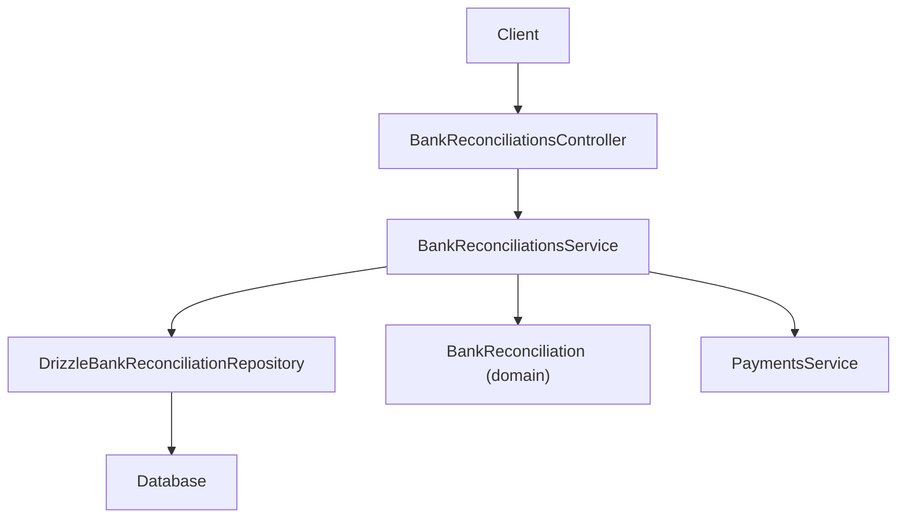
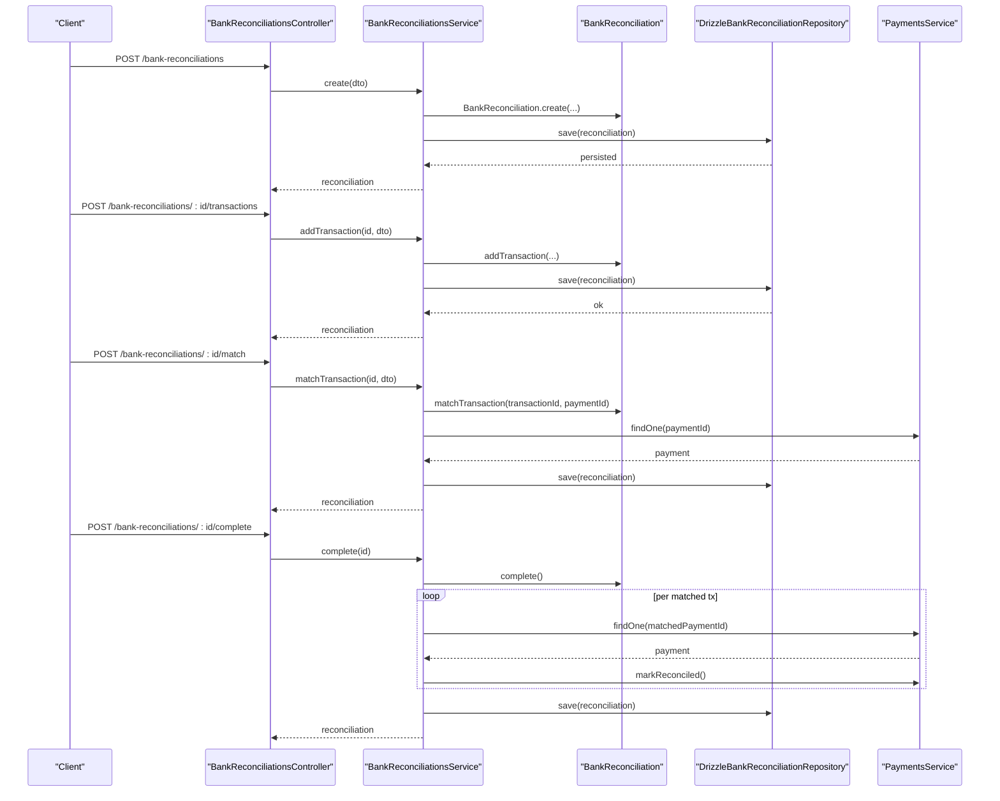
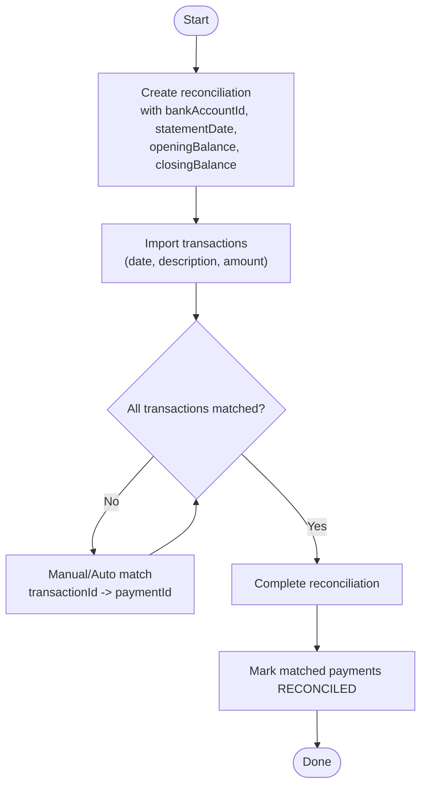
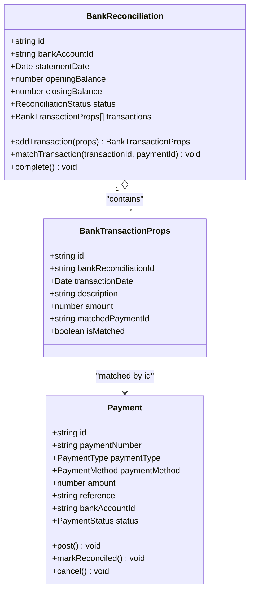
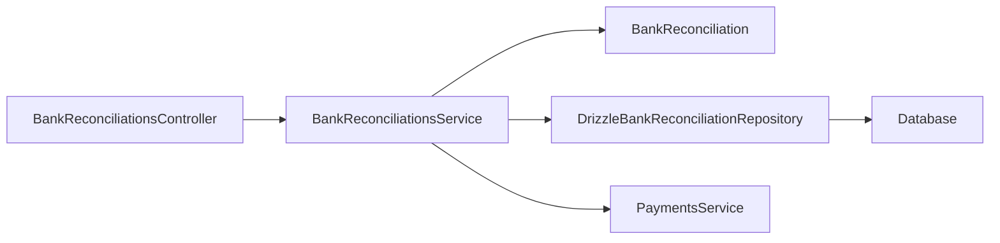

# Bank Reconciliation

<cite>
**Referenced Files in This Document**
- [apps/api/src/bank-reconciliations/bank-reconciliations.controller.ts](file://apps/api/src/bank-reconciliations/bank-reconciliations.controller.ts)
- [apps/api/src/bank-reconciliations/bank-reconciliations.service.ts](file://apps/api/src/bank-reconciliations/bank-reconciliations.service.ts)
- [apps/api/src/bank-reconciliations/dtos.ts](file://apps/api/src/bank-reconciliations/dtos.ts)
- [apps/api/src/bank-accounts/bank-accounts.controller.ts](file://apps/api/src/bank-accounts/bank-accounts.controller.ts)
- [apps/api/src/bank-accounts/bank-accounts.service.ts](file://apps/api/src/bank-accounts/bank-accounts.service.ts)
- [packages/finance/src/banking/bank-reconciliation.ts](file://packages/finance/src/banking/bank-reconciliation.ts)
- [packages/finance/src/banking/bank-reconciliation.repository.ts](file://packages/finance/src/banking/bank-reconciliation.repository.ts)
- [apps/api/src/infrastructure/repositories/drizzle-bank-reconciliation.repository.ts](file://apps/api/src/infrastructure/repositories/drizzle-bank-reconciliation.repository.ts)
- [apps/api/src/payments/payments.service.ts](file://apps/api/src/payments/payments.service.ts)
- [packages/finance/src/payments/payment.ts](file://packages/finance/src/payments/payment.ts)
</cite>

## Table of Contents
1. Introduction
2. Project Structure
3. Core Components
4. Architecture Overview
5. Detailed Component Analysis
6. Dependency Analysis
7. Performance Considerations
8. Troubleshooting Guide
9. Conclusion

## Introduction
This document explains the Bank Reconciliation module in Ananya ERP. It covers how to set up bank accounts, import bank statements as transactions, match them with internal payments (automatically or manually), resolve discrepancies, and complete reconciliations. It also outlines variance analysis concepts, outstanding items management, reporting considerations, integration points with payments and general ledger, error handling, auditability, and compliance guidance for financial reconciliation processes.

## Project Structure
The Bank Reconciliation feature spans API controllers/services, domain entities in the finance package, and a database repository implementation:
- API layer exposes endpoints to create reconciliations, add statement transactions, match them to payments, and complete sessions.
- Domain logic enforces state transitions and matching rules.
- Repository persists reconciliations and their transactions and maps between domain and storage.
- Payments integration updates payment statuses upon completion.

**Diagram sources**
- [apps/api/src/bank-reconciliations/bank-reconciliations.controller.ts:10-45](file://apps/api/src/bank-reconciliations/bank-reconciliations.controller.ts#L10-L45)
- [apps/api/src/bank-reconciliations/bank-reconciliations.service.ts:16-95](file://apps/api/src/bank-reconciliations/bank-reconciliations.service.ts#L16-L95)
- [apps/api/src/infrastructure/repositories/drizzle-bank-reconciliation.repository.ts:42-121](file://apps/api/src/infrastructure/repositories/drizzle-bank-reconciliation.repository.ts#L42-L121)
- [packages/finance/src/banking/bank-reconciliation.ts:42-137](file://packages/finance/src/banking/bank-reconciliation.ts#L42-L137)
- [apps/api/src/payments/payments.service.ts:14-87](file://apps/api/src/payments/payments.service.ts#L14-L87)

**Section sources**
- [apps/api/src/bank-reconciliations/bank-reconciliations.controller.ts:10-45](file://apps/api/src/bank-reconciliations/bank-reconciliations.controller.ts#L10-L45)
- [apps/api/src/bank-reconciliations/bank-reconciliations.service.ts:16-95](file://apps/api/src/bank-reconciliations/bank-reconciliations.service.ts#L16-L95)
- [apps/api/src/infrastructure/repositories/drizzle-bank-reconciliation.repository.ts:42-121](file://apps/api/src/infrastructure/repositories/drizzle-bank-reconciliation.repository.ts#L42-L121)
- [packages/finance/src/banking/bank-reconciliation.ts:42-137](file://packages/finance/src/banking/bank-reconciliation.ts#L42-L137)
- [apps/api/src/payments/payments.service.ts:14-87](file://apps/api/src/payments/payments.service.ts#L14-L87)

## Core Components
- BankReconciliationsController: Exposes REST endpoints to create, list, retrieve, add transactions, match, and complete reconciliations.
- BankReconciliationsService: Orchestrates business operations, validates inputs via DTOs, interacts with domain and repository, and coordinates with PaymentsService.
- BankReconciliation (domain): Encapsulates reconciliation lifecycle, transaction addition, matching, and completion rules.
- DrizzleBankReconciliationRepository: Persists reconciliation and transactions, mapping domain objects to rows and back.
- PaymentsService and Payment (domain): Provide payment lookup and status updates; payments can be marked RECONCILED when matched and posted.

Key responsibilities:
- Create reconciliation session with bank account, statement date, opening/closing balances.
- Add bank statement transactions to the session.
- Match statement transactions to internal payments.
- Complete reconciliation only when all transactions are matched.
- Update payment statuses on completion.

**Section sources**
- [apps/api/src/bank-reconciliations/bank-reconciliations.controller.ts:10-45](file://apps/api/src/bank-reconciliations/bank-reconciliations.controller.ts#L10-L45)
- [apps/api/src/bank-reconciliations/bank-reconciliations.service.ts:24-95](file://apps/api/src/bank-reconciliations/bank-reconciliations.service.ts#L24-L95)
- [packages/finance/src/banking/bank-reconciliation.ts:42-137](file://packages/finance/src/banking/bank-reconciliation.ts#L42-L137)
- [apps/api/src/infrastructure/repositories/drizzle-bank-reconciliation.repository.ts:42-121](file://apps/api/src/infrastructure/repositories/drizzle-bank-reconciliation.repository.ts#L42-L121)
- [apps/api/src/payments/payments.service.ts:50-87](file://apps/api/src/payments/payments.service.ts#L50-L87)
- [packages/finance/src/payments/payment.ts:82-105](file://packages/finance/src/payments/payment.ts#L82-L105)

## Architecture Overview
The module follows a layered architecture:
- Presentation/API: Controllers receive requests and delegate to services.
- Application: Services coordinate use cases and enforce cross-cutting concerns.
- Domain: Entities encapsulate business rules and state transitions.
- Infrastructure: Repositories implement persistence using Drizzle ORM.

**Diagram sources**
- [apps/api/src/bank-reconciliations/bank-reconciliations.controller.ts:14-45](file://apps/api/src/bank-reconciliations/bank-reconciliations.controller.ts#L14-L45)
- [apps/api/src/bank-reconciliations/bank-reconciliations.service.ts:24-95](file://apps/api/src/bank-reconciliations/bank-reconciliations.service.ts#L24-L95)
- [packages/finance/src/banking/bank-reconciliation.ts:86-137](file://packages/finance/src/banking/bank-reconciliation.ts#L86-L137)
- [apps/api/src/infrastructure/repositories/drizzle-bank-reconciliation.repository.ts:79-121](file://apps/api/src/infrastructure/repositories/drizzle-bank-reconciliation.repository.ts#L79-L121)
- [apps/api/src/payments/payments.service.ts:50-87](file://apps/api/src/payments/payments.service.ts#L50-L87)

## Detailed Component Analysis

### Bank Reconciliation Workflow
End-to-end flow from statement upload to completion:
- Create reconciliation session with bank account, statement date, opening and closing balances.
- Import statement transactions into the session.
- Match each statement transaction to an internal payment (manual or automatic).
- Complete the reconciliation once all transactions are matched; matched posted payments are marked RECONCILED.

**Diagram sources**
- [apps/api/src/bank-reconciliations/bank-reconciliations.controller.ts:14-45](file://apps/api/src/bank-reconciliations/bank-reconciliations.controller.ts#L14-L45)
- [apps/api/src/bank-reconciliations/bank-reconciliations.service.ts:24-95](file://apps/api/src/bank-reconciliations/bank-reconciliations.service.ts#L24-L95)
- [packages/finance/src/banking/bank-reconciliation.ts:86-137](file://packages/finance/src/banking/bank-reconciliation.ts#L86-L137)

**Section sources**
- [apps/api/src/bank-reconciliations/bank-reconciliations.controller.ts:14-45](file://apps/api/src/bank-reconciliations/bank-reconciliations.controller.ts#L14-L45)
- [apps/api/src/bank-reconciliations/bank-reconciliations.service.ts:24-95](file://apps/api/src/bank-reconciliations/bank-reconciliations.service.ts#L24-L95)
- [packages/finance/src/banking/bank-reconciliation.ts:86-137](file://packages/finance/src/banking/bank-reconciliation.ts#L86-L137)

### Data Model and State Machine

**Diagram sources**
- [packages/finance/src/banking/bank-reconciliation.ts:5-27](file://packages/finance/src/banking/bank-reconciliation.ts#L5-L27)
- [packages/finance/src/banking/bank-reconciliation.ts:42-137](file://packages/finance/src/banking/bank-reconciliation.ts#L42-L137)
- [packages/finance/src/payments/payment.ts:3-22](file://packages/finance/src/payments/payment.ts#L3-L22)
- [packages/finance/src/payments/payment.ts:33-105](file://packages/finance/src/payments/payment.ts#L33-L105)

**Section sources**
- [packages/finance/src/banking/bank-reconciliation.ts:5-27](file://packages/finance/src/banking/bank-reconciliation.ts#L5-L27)
- [packages/finance/src/banking/bank-reconciliation.ts:42-137](file://packages/finance/src/banking/bank-reconciliation.ts#L42-L137)
- [packages/finance/src/payments/payment.ts:33-105](file://packages/finance/src/payments/payment.ts#L33-L105)

### API Endpoints and DTOs
- Create reconciliation: POST /bank-reconciliations
- List reconciliations: GET /bank-reconciliations?bankAccountId&status
- Get reconciliation: GET /bank-reconciliations/:id
- Add statement transaction: POST /bank-reconciliations/:id/transactions
- Match transaction: POST /bank-reconciliations/:id/match
- Complete reconciliation: POST /bank-reconciliations/:id/complete

DTOs validate required fields such as dates, amounts, and IDs.

**Section sources**
- [apps/api/src/bank-reconciliations/bank-reconciliations.controller.ts:10-45](file://apps/api/src/bank-reconciliations/bank-reconciliations.controller.ts#L10-L45)
- [apps/api/src/bank-reconciliations/dtos.ts:3-40](file://apps/api/src/bank-reconciliations/dtos.ts#L3-L40)

### Bank Accounts Integration
- Retrieve active bank accounts and latest reconciliation status per account.
- Account numbers are masked for security in responses.

**Section sources**
- [apps/api/src/bank-accounts/bank-accounts.controller.ts:4-11](file://apps/api/src/bank-accounts/bank-accounts.controller.ts#L4-L11)
- [apps/api/src/bank-accounts/bank-accounts.service.ts:8-57](file://apps/api/src/bank-accounts/bank-accounts.service.ts#L8-L57)

### Matching Logic and Variance Handling
- Matching links a statement transaction to an internal payment by IDs.
- Completion requires all transactions to be matched; otherwise, it throws an error.
- On completion, matched payments that are POSTED are marked RECONCILED.

Variance analysis:
- Compare opening balance plus net activity against closing balance to detect discrepancies.
- Investigate unmatched transactions and timing differences.

Outstanding items:
- Unmatched transactions represent outstanding items until resolved.
- Track them within the reconciliation session until matched or investigated.

**Section sources**
- [apps/api/src/bank-reconciliations/bank-reconciliations.service.ts:66-95](file://apps/api/src/bank-reconciliations/bank-reconciliations.service.ts#L66-L95)
- [packages/finance/src/banking/bank-reconciliation.ts:108-137](file://packages/finance/src/banking/bank-reconciliation.ts#L108-L137)
- [packages/finance/src/payments/payment.ts:90-96](file://packages/finance/src/payments/payment.ts#L90-L96)

### Reporting and Auditability
- Reconciliation status and latest statement balances are available per bank account.
- Each reconciliation stores statement date, opening/closing balances, and transaction history.
- Payment status changes provide an audit trail for reconciled items.

Reporting considerations:
- Use bank account listing to view latest reconciliation status per account.
- Query reconciliations by bank account and status for historical reports.

**Section sources**
- [apps/api/src/bank-accounts/bank-accounts.service.ts:8-57](file://apps/api/src/bank-accounts/bank-accounts.service.ts#L8-L57)
- [apps/api/src/bank-reconciliations/bank-reconciliations.controller.ts:19-29](file://apps/api/src/bank-reconciliations/bank-reconciliations.controller.ts#L19-L29)
- [apps/api/src/infrastructure/repositories/drizzle-bank-reconciliation.repository.ts:57-77](file://apps/api/src/infrastructure/repositories/drizzle-bank-reconciliation.repository.ts#L57-L77)

### Integrations
- Payments: Reconciliation matches statement lines to posted payments and marks them RECONCILED.
- General Ledger: Payments posting typically creates journal entries; reconciliation ensures bank-side records align with GL through payment postings.
- External Banking APIs: Statement import can be extended to fetch CSV/OFX/PDF from banking APIs and parse into transactions before adding to the reconciliation.

**Section sources**
- [apps/api/src/payments/payments.service.ts:50-87](file://apps/api/src/payments/payments.service.ts#L50-L87)
- [packages/finance/src/payments/payment.ts:82-105](file://packages/finance/src/payments/payment.ts#L82-L105)

## Dependency Analysis

Coupling and cohesion:
- Controller is thin, delegating to service.
- Service orchestrates domain and infrastructure, maintaining clear boundaries.
- Domain encapsulates business rules, ensuring high cohesion.
- Repository abstracts persistence details.

Potential circular dependencies:
- None observed between controller/service/domain/repository layers.

External integrations:
- PaymentsService dependency introduces coupling to payment domain; used to verify and update payment status during matching and completion.

**Diagram sources**
- [apps/api/src/bank-reconciliations/bank-reconciliations.controller.ts:10-45](file://apps/api/src/bank-reconciliations/bank-reconciliations.controller.ts#L10-L45)
- [apps/api/src/bank-reconciliations/bank-reconciliations.service.ts:16-95](file://apps/api/src/bank-reconciliations/bank-reconciliations.service.ts#L16-L95)
- [apps/api/src/infrastructure/repositories/drizzle-bank-reconciliation.repository.ts:42-121](file://apps/api/src/infrastructure/repositories/drizzle-bank-reconciliation.repository.ts#L42-L121)
- [apps/api/src/payments/payments.service.ts:14-87](file://apps/api/src/payments/payments.service.ts#L14-L87)

**Section sources**
- [apps/api/src/bank-reconciliations/bank-reconciliations.controller.ts:10-45](file://apps/api/src/bank-reconciliations/bank-reconciliations.controller.ts#L10-L45)
- [apps/api/src/bank-reconciliations/bank-reconciliations.service.ts:16-95](file://apps/api/src/bank-reconciliations/bank-reconciliations.service.ts#L16-L95)
- [apps/api/src/infrastructure/repositories/drizzle-bank-reconciliation.repository.ts:42-121](file://apps/api/src/infrastructure/repositories/drizzle-bank-reconciliation.repository.ts#L42-L121)
- [apps/api/src/payments/payments.service.ts:14-87](file://apps/api/src/payments/payments.service.ts#L14-L87)

## Performance Considerations
- Batch imports: When importing many statement transactions, consider batching adds to reduce round trips.
- Query optimization: Repository queries load transactions per reconciliation; ensure indexes on foreign keys for performance at scale.
- Concurrency: Ensure reconciliation operations are idempotent where possible; repository uses upsert patterns for transactions.

[No sources needed since this section provides general guidance]

## Troubleshooting Guide
Common errors and resolutions:
- Cannot add transactions to non-IN_PROGRESS reconciliation: Ensure the session is still open before adding lines.
- Cannot match when not IN_PROGRESS: Open the reconciliation session first.
- Transaction not found during match: Verify the transaction ID exists in the current reconciliation.
- Cannot complete with unmatched transactions: Match all statement lines or investigate outstanding items before completing.
- Only POSTED payments can be marked RECONCILED: Post the payment before attempting reconciliation marking.

Error propagation:
- Domain methods throw descriptive errors on invalid state transitions.
- Service wraps domain calls and persists changes; repository handles persistence errors.

Audit and compliance notes:
- All state changes update timestamps, providing an audit trail.
- Payment status transitions (POSTED to RECONCILED) are recorded for traceability.

**Section sources**
- [packages/finance/src/banking/bank-reconciliation.ts:86-137](file://packages/finance/src/banking/bank-reconciliation.ts#L86-L137)
- [packages/finance/src/payments/payment.ts:82-105](file://packages/finance/src/payments/payment.ts#L82-L105)
- [apps/api/src/bank-reconciliations/bank-reconciliations.service.ts:66-95](file://apps/api/src/bank-reconciliations/bank-reconciliations.service.ts#L66-L95)

## Conclusion
The Bank Reconciliation module provides a robust workflow to reconcile bank statements with internal payments. It enforces strict state transitions, supports manual and automated matching, and integrates with payments to maintain accurate financial records. With clear APIs, domain-driven design, and persistent audit trails, it supports variance analysis, outstanding item management, and compliance requirements for financial reconciliation processes.

[No sources needed since this section summarizes without analyzing specific files]