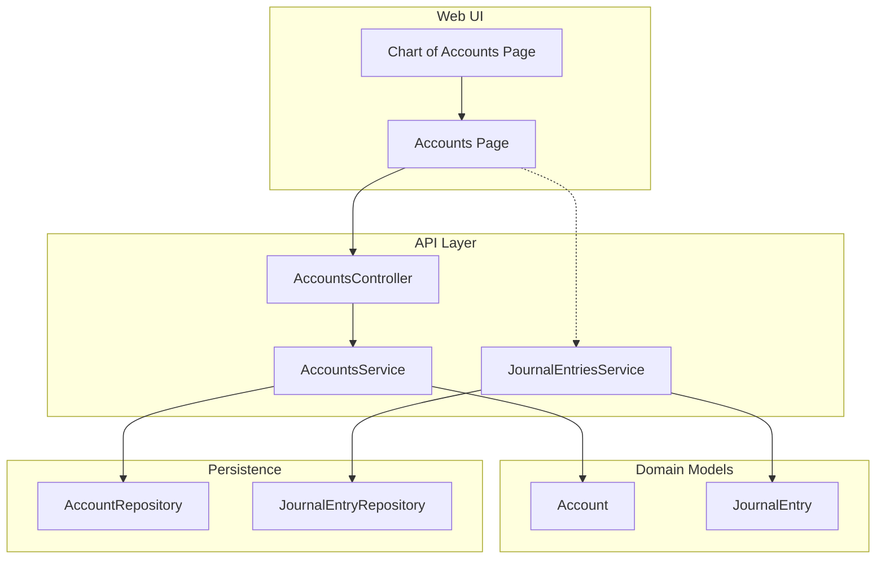
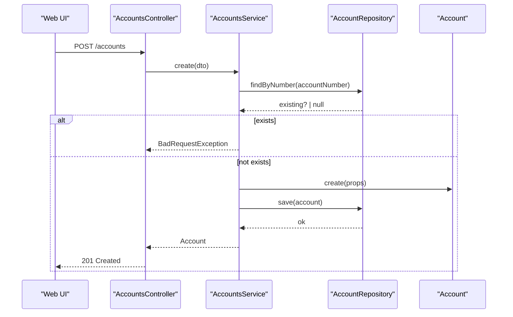
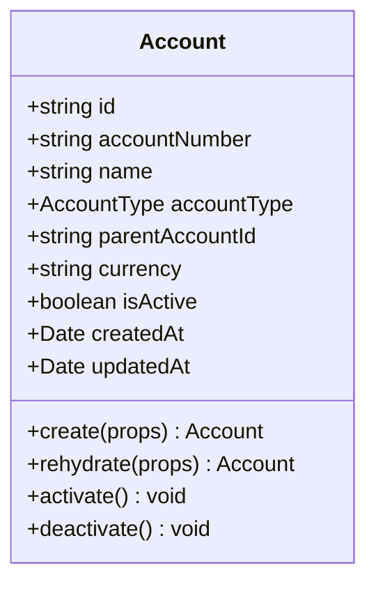
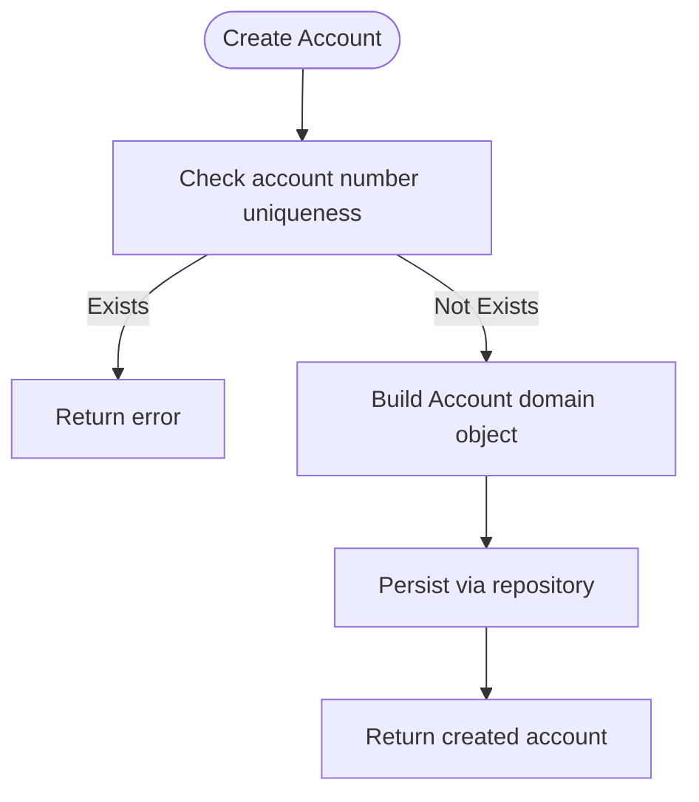
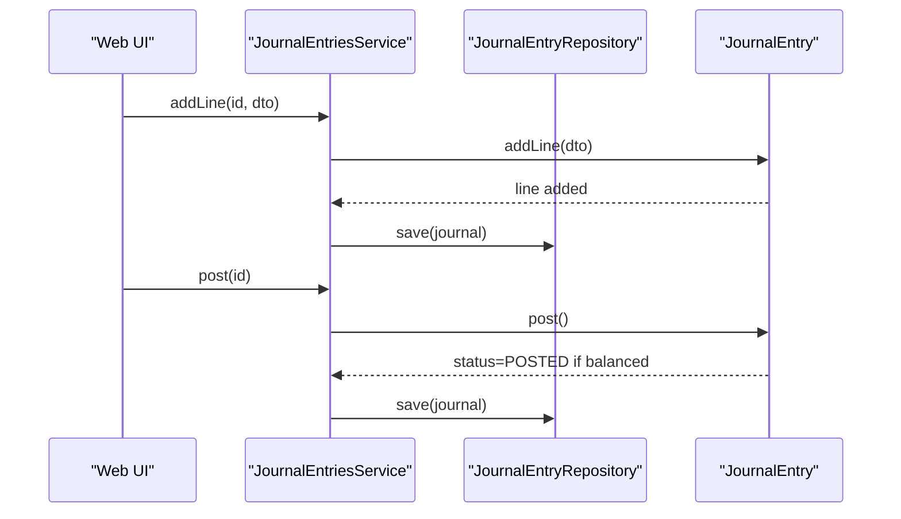
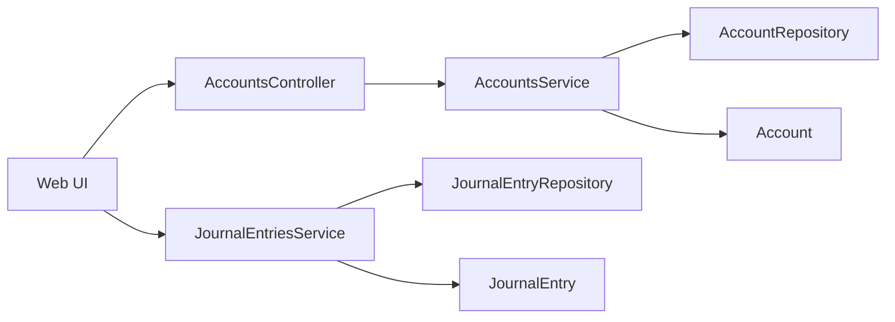

# Chart of Accounts

<cite>
**Referenced Files in This Document**
- [0031-chart-of-accounts.md](file://docs/rfcs/0031-chart-of-accounts.md)
- [0032-general-ledger-and-journal-entries.md](file://docs/rfcs/0032-general-ledger-and-journal-entries.md)
- [account.ts](file://packages/finance/src/accounts/account.ts)
- [account.repository.ts](file://packages/finance/src/accounts/account.repository.ts)
- [journal-entry.ts](file://packages/finance/src/journals/journal-entry.ts)
- [accounts.controller.ts](file://apps/api/src/accounts/accounts.controller.ts)
- [accounts.service.ts](file://apps/api/src/accounts/accounts.service.ts)
- [dtos.ts](file://apps/api/src/accounts/dtos.ts)
- [journal-entries.service.ts](file://apps/api/src/journal-entries/journal-entries.service.ts)
- [page.tsx](file://apps/web/app/chart-of-accounts/page.tsx)
- [page.tsx](file://apps/web/app/accounts/page.tsx)
</cite>

## Table of Contents
1. Introduction
2. Project Structure
3. Core Components
4. Architecture Overview
5. Detailed Component Analysis
6. Dependency Analysis
7. Performance Considerations
8. Troubleshooting Guide
9. Conclusion
10. Appendices

## Introduction
This document explains Ananya ERP’s Chart of Accounts (CoA) system: how accounts are structured hierarchically, the supported account types and categorization rules, setup and configuration workflows, relationships to journal entries, validation and status management, and compliance considerations for financial reporting. It is designed for both technical and non-technical readers.

## Project Structure
The CoA spans domain models in the finance package, API controllers/services in the NestJS backend, and a Next.js web page that surfaces the chart of accounts.

**Diagram sources**
- [page.tsx:1-8](file://apps/web/app/chart-of-accounts/page.tsx#L1-L8)
- [page.tsx:1-187](file://apps/web/app/accounts/page.tsx#L1-L187)
- [accounts.controller.ts:1-39](file://apps/api/src/accounts/accounts.controller.ts#L1-L39)
- [accounts.service.ts:1-69](file://apps/api/src/accounts/accounts.service.ts#L1-L69)
- [journal-entries.service.ts:1-74](file://apps/api/src/journal-entries/journal-entries.service.ts#L1-L74)
- [account.ts:1-85](file://packages/finance/src/accounts/account.ts#L1-L85)
- [journal-entry.ts:1-158](file://packages/finance/src/journals/journal-entry.ts#L1-L158)
- [account.repository.ts:1-15](file://packages/finance/src/accounts/account.repository.ts#L1-L15)

**Section sources**
- [0031-chart-of-accounts.md:1-98](file://docs/rfcs/0031-chart-of-accounts.md#L1-L98)
- [0032-general-ledger-and-journal-entries.md:1-98](file://docs/rfcs/0032-general-ledger-and-journal-entries.md#L1-L98)

## Core Components
- Account model defines account identity, classification, hierarchy link, currency, and lifecycle flags.
- JournalEntry model enforces double-entry balancing and immutable posted entries.
- API layer exposes CRUD and lifecycle operations for accounts and journals.
- Web UI provides listing, filtering, and navigation to account details.

Key responsibilities:
- Enforce unique account numbers and valid account types.
- Maintain parent-child relationships via optional parentAccountId.
- Ensure journal entries balance before posting and remain immutable after posting.

**Section sources**
- [account.ts:1-85](file://packages/finance/src/accounts/account.ts#L1-L85)
- [journal-entry.ts:1-158](file://packages/finance/src/journals/journal-entry.ts#L1-L158)
- [accounts.controller.ts:1-39](file://apps/api/src/accounts/accounts.controller.ts#L1-L39)
- [accounts.service.ts:1-69](file://apps/api/src/accounts/accounts.service.ts#L1-L69)
- [journal-entries.service.ts:1-74](file://apps/api/src/journal-entries/journal-entries.service.ts#L1-L74)

## Architecture Overview
The CoA integrates with the General Ledger through journal entries. Accounts are referenced by ID in journal lines; balances roll up through hierarchical parents.

**Diagram sources**
- [accounts.controller.ts:10-13](file://apps/api/src/accounts/accounts.controller.ts#L10-L13)
- [accounts.service.ts:19-37](file://apps/api/src/accounts/accounts.service.ts#L19-L37)
- [account.ts:49-69](file://packages/finance/src/accounts/account.ts#L49-L69)
- [account.repository.ts:9-14](file://packages/finance/src/accounts/account.repository.ts#L9-L14)

## Detailed Component Analysis

### Account Model and Hierarchy
- AccountType supports ASSET, LIABILITY, EQUITY, REVENUE, EXPENSE.
- Parent-child relationships are modeled via an optional parentAccountId on the Account.
- Currency is per-account to support multi-currency scenarios.
- Lifecycle methods activate/deactivate update isActive and timestamps.

**Diagram sources**
- [account.ts:3-16](file://packages/finance/src/accounts/account.ts#L3-L16)
- [account.ts:26-85](file://packages/finance/src/accounts/account.ts#L26-L85)

**Section sources**
- [account.ts:1-85](file://packages/finance/src/accounts/account.ts#L1-L85)

### Account Repository Contract
- Provides findById, findByNumber, findMany with filters (type, active, search), and save.
- Used by AccountsService to enforce uniqueness and persist changes.

**Section sources**
- [account.repository.ts:1-15](file://packages/finance/src/accounts/account.repository.ts#L1-L15)

### Accounts API and Service
- Controller exposes endpoints for create, list, get-by-id, activate, deactivate.
- Service validates uniqueness, constructs domain Account, persists via repository, and toggles status.

**Diagram sources**
- [accounts.controller.ts:10-13](file://apps/api/src/accounts/accounts.controller.ts#L10-L13)
- [accounts.service.ts:19-37](file://apps/api/src/accounts/accounts.service.ts#L19-L37)
- [dtos.ts:4-24](file://apps/api/src/accounts/dtos.ts#L4-L24)

**Section sources**
- [accounts.controller.ts:1-39](file://apps/api/src/accounts/accounts.controller.ts#L1-L39)
- [accounts.service.ts:1-69](file://apps/api/src/accounts/accounts.service.ts#L1-L69)
- [dtos.ts:1-35](file://apps/api/src/accounts/dtos.ts#L1-L35)

### Journal Entries and Double-Entry Rules
- JournalEntry enforces at least two lines, non-negative debits/credits, and exact balance before posting.
- Once posted, entries are immutable; adjustments require reversing or voiding drafts.

**Diagram sources**
- [journal-entries.service.ts:46-58](file://apps/api/src/journal-entries/journal-entries.service.ts#L46-L58)
- [journal-entry.ts:91-140](file://packages/finance/src/journals/journal-entry.ts#L91-L140)

**Section sources**
- [journal-entry.ts:1-158](file://packages/finance/src/journals/journal-entry.ts#L1-L158)
- [journal-entries.service.ts:1-74](file://apps/api/src/journal-entries/journal-entries.service.ts#L1-L74)

### Web Interface for Chart of Accounts
- The chart-of-accounts page delegates to the accounts page which lists accounts, supports filtering by type, and shows key stats.
- Navigation links allow drilling into individual accounts.

**Section sources**
- [page.tsx:1-8](file://apps/web/app/chart-of-accounts/page.tsx#L1-L8)
- [page.tsx:1-187](file://apps/web/app/accounts/page.tsx#L1-L187)

## Dependency Analysis
- AccountsService depends on AccountRepository and Account domain model.
- JournalEntriesService depends on JournalEntryRepository and JournalEntry domain model.
- Web UI consumes API endpoints exposed by controllers.

**Diagram sources**
- [accounts.controller.ts:1-39](file://apps/api/src/accounts/accounts.controller.ts#L1-L39)
- [accounts.service.ts:1-69](file://apps/api/src/accounts/accounts.service.ts#L1-L69)
- [journal-entries.service.ts:1-74](file://apps/api/src/journal-entries/journal-entries.service.ts#L1-L74)
- [account.ts:1-85](file://packages/finance/src/accounts/account.ts#L1-L85)
- [journal-entry.ts:1-158](file://packages/finance/src/journals/journal-entry.ts#L1-L158)

**Section sources**
- [account.repository.ts:1-15](file://packages/finance/src/accounts/account.repository.ts#L1-L15)

## Performance Considerations
- Use repository-level filtering (by accountType, isActive, search) to minimize data transfer.
- Avoid deep recursive queries for hierarchy rollups on the hot path; consider precomputed summaries where appropriate.
- Validate inputs early at DTO/controller level to reduce round-trips.
- Keep journal entry line counts reasonable; large batches should be paginated or batched.

[No sources needed since this section provides general guidance]

## Troubleshooting Guide
Common issues and resolutions:
- Duplicate account number: The service checks uniqueness and returns a bad request when a conflict is detected.
- Invalid account creation: Missing required fields trigger domain-level errors during Account creation.
- Posting failures: Journal entries must have at least two lines and balance exactly; otherwise posting throws an error.
- Status transitions: Only DRAFT entries can be voided; only POSTED entries can be reversed.

Operational tips:
- Verify account.isActive before creating journal lines referencing inactive accounts.
- Use search and filter parameters on the accounts endpoint to locate misconfigured accounts quickly.

**Section sources**
- [accounts.service.ts:19-37](file://apps/api/src/accounts/accounts.service.ts#L19-L37)
- [account.ts:49-69](file://packages/finance/src/accounts/account.ts#L49-L69)
- [journal-entry.ts:91-140](file://packages/finance/src/journals/journal-entry.ts#L91-L140)
- [journal-entries.service.ts:46-74](file://apps/api/src/journal-entries/journal-entries.service.ts#L46-L74)

## Conclusion
Ananya ERP’s Chart of Accounts provides a robust, domain-driven foundation for financial recordkeeping. It enforces clear account classifications, supports hierarchical organization, and integrates tightly with the General Ledger through strict double-entry rules. The API and UI enable straightforward setup, maintenance, and usage while preserving auditability and compliance through immutability and state transitions.

[No sources needed since this section summarizes without analyzing specific files]

## Appendices

### Setup and Configuration: Creating and Organizing Accounts
- Create accounts via the API with a unique accountNumber, name, accountType, optional parentAccountId, and currency.
- Establish hierarchy by linking child accounts to a parent using parentAccountId.
- Activate newly created accounts; deactivate when no longer used.

Practical examples:
- Retail business: Assets (Cash, Inventory), Liabilities (Payables), Equity (Owner’s Capital), Revenue (Sales), Expenses (COGS, Rent).
- Manufacturing: Add Work-in-Progress under Assets, Manufacturing Overhead under Expenses.
- Services: Emphasize Receivables and Professional Fees revenue; minimal inventory assets.

**Section sources**
- [accounts.controller.ts:10-13](file://apps/api/src/accounts/accounts.controller.ts#L10-L13)
- [accounts.service.ts:19-37](file://apps/api/src/accounts/accounts.service.ts#L19-L37)
- [account.ts:18-24](file://packages/finance/src/accounts/account.ts#L18-L24)
- [0031-chart-of-accounts.md:17-36](file://docs/rfcs/0031-chart-of-accounts.md#L17-L36)

### Validation Rules and Compliance
- Account number uniqueness enforced at creation time.
- Name and account type validated at domain level.
- Journal entries must balance (sum of debits equals sum of credits) before posting.
- Posted entries are immutable; corrections use reversal or voiding workflows.

Compliance considerations:
- Maintain audit trails via timestamps and status transitions.
- Restrict modifications to draft or reversible states to preserve integrity.
- Support multi-currency accounting via per-account currency fields.

**Section sources**
- [account.ts:49-69](file://packages/finance/src/accounts/account.ts#L49-L69)
- [journal-entry.ts:91-140](file://packages/finance/src/journals/journal-entry.ts#L91-L140)
- [0031-chart-of-accounts.md:55-64](file://docs/rfcs/0031-chart-of-accounts.md#L55-L64)
- [0032-general-ledger-and-journal-entries.md:55-64](file://docs/rfcs/0032-general-ledger-and-journal-entries.md#L55-L64)

### Relationship Between Chart of Accounts and Journal Entries
- Journal lines reference accounts by accountId.
- Balances roll up through parent-child relationships defined by parentAccountId.
- Financial statements derive from posted journal entries mapped to the CoA.

**Section sources**
- [journal-entry.ts:5-14](file://packages/finance/src/journals/journal-entry.ts#L5-L14)
- [account.ts:6-16](file://packages/finance/src/accounts/account.ts#L6-L16)
- [0032-general-ledger-and-journal-entries.md:17-24](file://docs/rfcs/0032-general-ledger-and-journal-entries.md#L17-L24)