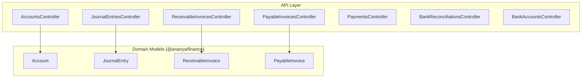
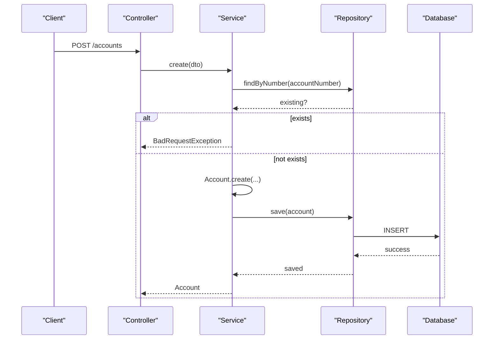
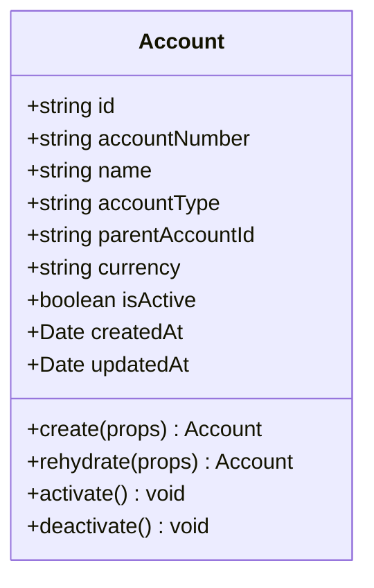
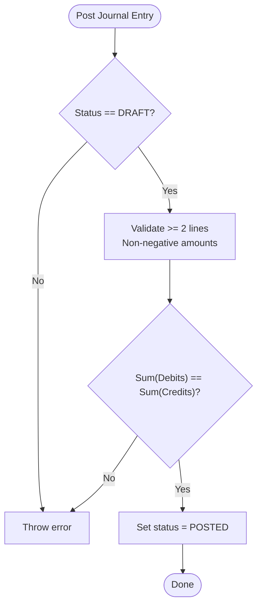
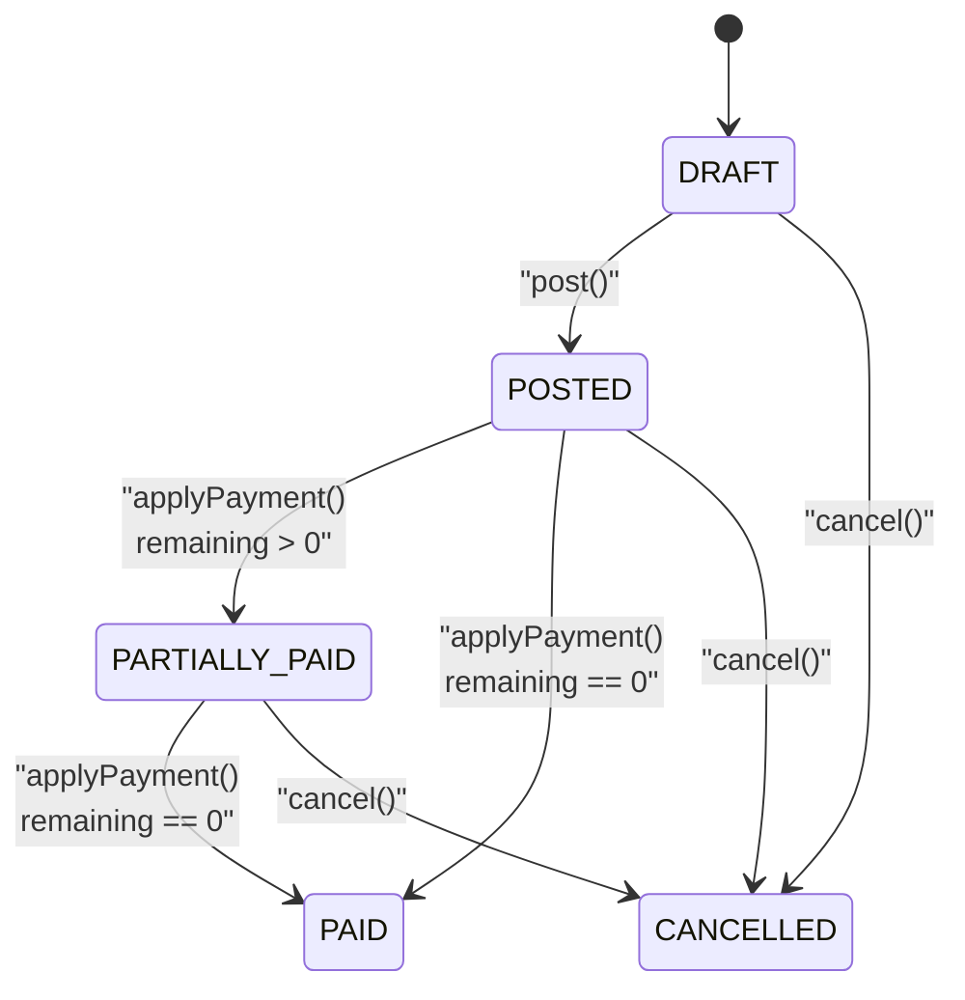
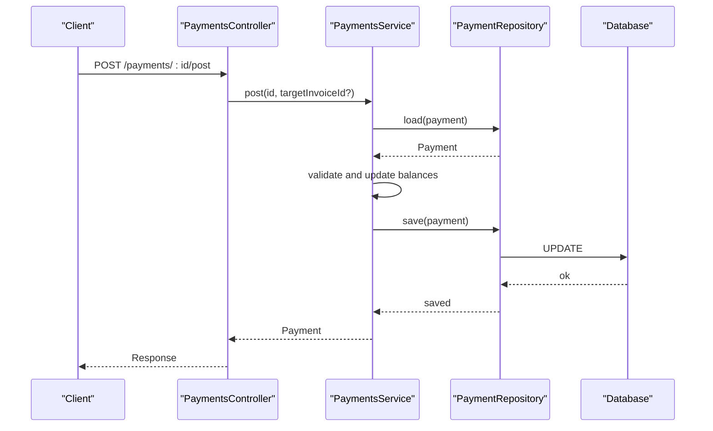
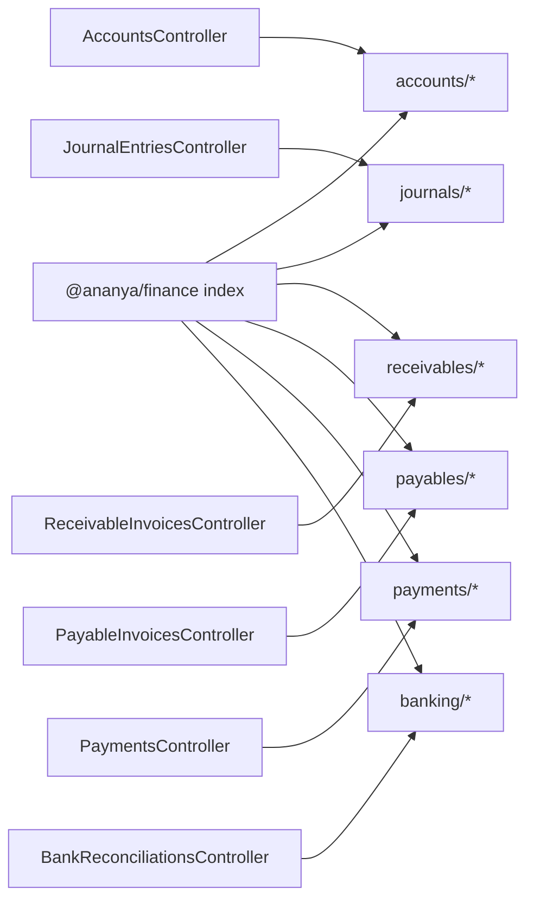

# Finance & Accounting

<cite>
**Referenced Files in This Document**
- [0031-chart-of-accounts.md](file://docs/rfcs/0031-chart-of-accounts.md)
- [0032-general-ledger-and-journal-entries.md](file://docs/rfcs/0032-general-ledger-and-journal-entries.md)
- [0033-accounts-receivable.md](file://docs/rfcs/0033-accounts-receivable.md)
- [0034-accounts-payable.md](file://docs/rfcs/0034-accounts-payable.md)
- [0035-payments-and-bank-reconciliation.md](file://docs/rfcs/0035-payments-and-bank-reconciliation.md)
- [accounts.controller.ts](file://apps/api/src/accounts/accounts.controller.ts)
- [accounts.service.ts](file://apps/api/src/accounts/accounts.service.ts)
- [journal-entries.controller.ts](file://apps/api/src/journal-entries/journal-entries.controller.ts)
- [receivable-invoices.controller.ts](file://apps/api/src/receivable-invoices/receivable-invoices.controller.ts)
- [payable-invoices.controller.ts](file://apps/api/src/payable-invoices/payable-invoices.controller.ts)
- [payments.controller.ts](file://apps/api/src/payments/payments.controller.ts)
- [bank-reconciliations.controller.ts](file://apps/api/src/bank-reconciliations/bank-reconciliations.controller.ts)
- [bank-accounts.controller.ts](file://apps/api/src/bank-accounts/bank-accounts.controller.ts)
- [account.ts](file://packages/finance/src/accounts/account.ts)
- [journal-entry.ts](file://packages/finance/src/journals/journal-entry.ts)
- [receivable-invoice.ts](file://packages/finance/src/receivables/receivable-invoice.ts)
- [payable-invoice.ts](file://packages/finance/src/payables/payable-invoice.ts)
- [index.ts](file://packages/finance/src/index.ts)
</cite>

## Table of Contents
1. Introduction
2. Project Structure
3. Core Components
4. Architecture Overview
5. Detailed Component Analysis
6. Dependency Analysis
7. Performance Considerations
8. Troubleshooting Guide
9. Conclusion

## Introduction
This document provides comprehensive documentation for Ananya ERP’s Finance & Accounting domain. It covers chart of accounts management, journal entries, accounts receivable, accounts payable, payments, and bank reconciliation. It explains the financial data model, key workflows from account setup through daily operations, month-end closing, and financial reporting. Practical examples are included to guide users in setting up accounts, recording journal entries, managing receivables and payables, processing payments, and performing bank reconciliations. The finance package structure, domain boundaries, and compliance considerations are also documented.

## Project Structure
The Finance & Accounting domain is implemented across:
- API layer (NestJS controllers and services) exposing REST endpoints for each subdomain
- Domain models in a shared finance package defining aggregates, value objects, and invariants
- RFCs that define the domain language, state machines, APIs, and database schemas

**Diagram sources**
- [accounts.controller.ts:6-38](file://apps/api/src/accounts/accounts.controller.ts#L6-L38)
- [journal-entries.controller.ts:6-47](file://apps/api/src/journal-entries/journal-entries.controller.ts#L6-L47)
- [receivable-invoices.controller.ts:6-38](file://apps/api/src/receivable-invoices/receivable-invoices.controller.ts#L6-L38)
- [payable-invoices.controller.ts:6-38](file://apps/api/src/payable-invoices/payable-invoices.controller.ts#L6-L38)
- [payments.controller.ts:6-41](file://apps/api/src/payments/payments.controller.ts#L6-L41)
- [bank-reconciliations.controller.ts:10-46](file://apps/api/src/bank-reconciliations/bank-reconciliations.controller.ts#L10-L46)
- [bank-accounts.controller.ts:4-12](file://apps/api/src/bank-accounts/bank-accounts.controller.ts#L4-L12)
- [account.ts:26-84](file://packages/finance/src/accounts/account.ts#L26-L84)
- [journal-entry.ts:42-157](file://packages/finance/src/journals/journal-entry.ts#L42-L157)
- [receivable-invoice.ts:27-111](file://packages/finance/src/receivables/receivable-invoice.ts#L27-L111)
- [payable-invoice.ts:27-111](file://packages/finance/src/payables/payable-invoice.ts#L27-L111)

**Section sources**
- [0031-chart-of-accounts.md:1-98](file://docs/rfcs/0031-chart-of-accounts.md#L1-L98)
- [0032-general-ledger-and-journal-entries.md:1-98](file://docs/rfcs/0032-general-ledger-and-journal-entries.md#L1-L98)
- [0033-accounts-receivable.md:1-92](file://docs/rfcs/0033-accounts-receivable.md#L1-L92)
- [0034-accounts-payable.md:1-92](file://docs/rfcs/0034-accounts-payable.md#L1-L92)
- [0035-payments-and-bank-reconciliation.md:1-105](file://docs/rfcs/0035-payments-and-bank-reconciliation.md#L1-L105)

## Core Components
- Chart of Accounts: Hierarchical accounts with types (Asset, Liability, Equity, Revenue, Expense), activation lifecycle, and balance rollups.
- General Ledger & Journal Entries: Double-entry bookkeeping with balanced debits/credits, immutable posted entries, and reversal/voiding.
- Accounts Receivable: Customer invoices linked to sales orders, payment application, aging buckets, and status transitions.
- Accounts Payable: Vendor bills linked to purchase invoices, payment application, aging buckets, and status transitions.
- Payments & Bank Reconciliation: Cash movements (customer/supplier payments, transfers, refunds), bank statement matching, and reconciliation completion.

Key implementation highlights:
- Controllers expose REST endpoints for create, list, find, post, cancel, match, complete actions.
- Domain models enforce invariants such as non-negative amounts, balance checks, and valid state transitions.
- RFCs define consistent domain language, commands, queries, repositories, and UI workflows.

**Section sources**
- [accounts.controller.ts:6-38](file://apps/api/src/accounts/accounts.controller.ts#L6-L38)
- [accounts.service.ts:19-67](file://apps/api/src/accounts/accounts.service.ts#L19-L67)
- [journal-entries.controller.ts:6-47](file://apps/api/src/journal-entries/journal-entries.controller.ts#L6-L47)
- [receivable-invoices.controller.ts:6-38](file://apps/api/src/receivable-invoices/receivable-invoices.controller.ts#L6-L38)
- [payable-invoices.controller.ts:6-38](file://apps/api/src/payable-invoices/payable-invoices.controller.ts#L6-L38)
- [payments.controller.ts:6-41](file://apps/api/src/payments/payments.controller.ts#L6-L41)
- [bank-reconciliations.controller.ts:10-46](file://apps/api/src/bank-reconciliations/bank-reconciliations.controller.ts#L10-L46)
- [account.ts:26-84](file://packages/finance/src/accounts/account.ts#L26-L84)
- [journal-entry.ts:42-157](file://packages/finance/src/journals/journal-entry.ts#L42-L157)
- [receivable-invoice.ts:27-111](file://packages/finance/src/receivables/receivable-invoice.ts#L27-L111)
- [payable-invoice.ts:27-111](file://packages/finance/src/payables/payable-invoice.ts#L27-L111)

## Architecture Overview
Finance & Accounting follows a layered architecture:
- API controllers handle HTTP requests and delegate to services
- Services orchestrate domain logic and repository interactions
- Domain models encapsulate business rules and state transitions
- RFCs define contracts, schemas, and cross-module integrations

**Diagram sources**
- [accounts.controller.ts:10-13](file://apps/api/src/accounts/accounts.controller.ts#L10-L13)
- [accounts.service.ts:19-36](file://apps/api/src/accounts/accounts.service.ts#L19-L36)
- [account.ts:49-69](file://packages/finance/src/accounts/account.ts#L49-L69)

**Section sources**
- [0031-chart-of-accounts.md:67-83](file://docs/rfcs/0031-chart-of-accounts.md#L67-L83)
- [0032-general-ledger-and-journal-entries.md:65-84](file://docs/rfcs/0032-general-ledger-and-journal-entries.md#L65-L84)
- [0033-accounts-receivable.md:61-78](file://docs/rfcs/0033-accounts-receivable.md#L61-L78)
- [0034-accounts-payable.md:61-78](file://docs/rfcs/0034-accounts-payable.md#L61-L78)
- [0035-payments-and-bank-reconciliation.md:72-91](file://docs/rfcs/0035-payments-and-bank-reconciliation.md#L72-L91)

## Detailed Component Analysis

### Chart of Accounts
- Purpose: Define hierarchical accounts, classification, and active/inactive states.
- Data Model: Account aggregate with fields for number, name, type, parent, currency, and flags.
- Workflows: Create account, activate/deactivate, query by type and search.
- Validation: Unique account numbers, required fields, valid types.
- Integration: Used by GL, AR, AP, Payments, and Inventory Valuation.

Practical example:
- Create an Asset account “Cash” with code “1000”, type ASSET, currency INR, then activate it for use in postings.

**Diagram sources**
- [account.ts:26-84](file://packages/finance/src/accounts/account.ts#L26-L84)

**Section sources**
- [0031-chart-of-accounts.md:1-98](file://docs/rfcs/0031-chart-of-accounts.md#L1-L98)
- [accounts.controller.ts:6-38](file://apps/api/src/accounts/accounts.controller.ts#L6-L38)
- [accounts.service.ts:19-67](file://apps/api/src/accounts/accounts.service.ts#L19-L67)
- [account.ts:26-84](file://packages/finance/src/accounts/account.ts#L26-L84)

### General Ledger & Journal Entries
- Purpose: Enforce double-entry bookkeeping with balanced debits/credits and immutable posted entries.
- Data Model: JournalEntry aggregate with lines; status transitions DRAFT → POSTED → REVERSED/VOID.
- Workflows: Create entry, add lines, post (balance check), reverse or void.
- Validation: Non-negative line amounts, at least two lines, total debits equals total credits.
- Integration: Consumed by AR, AP, Payments, and Inventory modules to post GL impacts.

Practical example:
- Record a journal entry to debit Accounts Receivable and credit Sales Revenue with equal amounts, then post it.

**Diagram sources**
- [journal-entry.ts:120-140](file://packages/finance/src/journals/journal-entry.ts#L120-L140)

**Section sources**
- [0032-general-ledger-and-journal-entries.md:1-98](file://docs/rfcs/0032-general-ledger-and-journal-entries.md#L1-L98)
- [journal-entries.controller.ts:6-47](file://apps/api/src/journal-entries/journal-entries.controller.ts#L6-L47)
- [journal-entry.ts:42-157](file://packages/finance/src/journals/journal-entry.ts#L42-L157)

### Accounts Receivable
- Purpose: Manage customer invoices, apply payments, track balances, and generate aging reports.
- Data Model: ReceivableInvoice aggregate with amount, balance, due date, and status.
- Workflows: Create invoice from sales order, post, apply partial/full payments, cancel if allowed.
- Validation: Positive amounts, payment cannot exceed remaining balance, status-based transitions.
- Integration: Posts revenue and receivable journal entries to GL upon posting; integrates with payments.

Practical example:
- Create a receivable invoice for a customer linked to a sales order, post it, then apply a partial payment to move to PARTIALLY_PAID.

**Diagram sources**
- [receivable-invoice.ts:76-110](file://packages/finance/src/receivables/receivable-invoice.ts#L76-L110)

**Section sources**
- [0033-accounts-receivable.md:1-92](file://docs/rfcs/0033-accounts-receivable.md#L1-L92)
- [receivable-invoices.controller.ts:6-38](file://apps/api/src/receivable-invoices/receivable-invoices.controller.ts#L6-L38)
- [receivable-invoice.ts:27-111](file://packages/finance/src/receivables/receivable-invoice.ts#L27-L111)

### Accounts Payable
- Purpose: Manage vendor bills, apply supplier payments, track liabilities, and produce aging reports.
- Data Model: PayableInvoice aggregate with amount, balance, due date, and status.
- Workflows: Create payable from purchase invoice, post, apply partial/full payments, cancel if allowed.
- Validation: Positive amounts, payment cannot exceed remaining balance, status-based transitions.
- Integration: Posts expense and liability journal entries to GL upon posting; integrates with payments.

Practical example:
- Create a payable invoice for a supplier linked to a purchase invoice, post it, then apply a full payment to mark PAID.

**Diagram sources**
- [payable-invoice.ts:76-110](file://packages/finance/src/payables/payable-invoice.ts#L76-L110)

**Section sources**
- [0034-accounts-payable.md:1-92](file://docs/rfcs/0034-accounts-payable.md#L1-L92)
- [payable-invoices.controller.ts:6-38](file://apps/api/src/payable-invoices/payable-invoices.controller.ts#L6-L38)
- [payable-invoice.ts:27-111](file://packages/finance/src/payables/payable-invoice.ts#L27-L111)

### Payments & Bank Reconciliation
- Purpose: Record cash movements (customer/supplier payments, transfers, refunds), manage bank accounts, and reconcile statements.
- Data Model: Payment aggregate with type, method, status; BankReconciliation aggregate with matched transactions.
- Workflows: Create and post payments; start reconciliation, add bank transactions, match to internal payments, complete reconciliation.
- Validation: Positive payment amounts, active bank accounts, completed reconciliations are immutable.
- Integration: Updates AR/AP balances on payment posting; generates GL entries; supports automated matching.

Practical example:
- Post a customer payment against an open receivable invoice, then start a bank reconciliation session, import bank transactions, match them to the posted payment, and complete the reconciliation.

**Diagram sources**
- [payments.controller.ts:29-35](file://apps/api/src/payments/payments.controller.ts#L29-L35)

**Section sources**
- [0035-payments-and-bank-reconciliation.md:1-105](file://docs/rfcs/0035-payments-and-bank-reconciliation.md#L1-L105)
- [payments.controller.ts:6-41](file://apps/api/src/payments/payments.controller.ts#L6-L41)
- [bank-reconciliations.controller.ts:10-46](file://apps/api/src/bank-reconciliations/bank-reconciliations.controller.ts#L10-L46)
- [bank-accounts.controller.ts:4-12](file://apps/api/src/bank-accounts/bank-accounts.controller.ts#L4-L12)

## Dependency Analysis
The finance package exposes domain models and repositories via a central index, enabling controllers to depend on stable interfaces. Controllers rely on services which coordinate domain logic and persistence.

**Diagram sources**
- [index.ts:1-7](file://packages/finance/src/index.ts#L1-L7)
- [accounts.controller.ts:6-38](file://apps/api/src/accounts/accounts.controller.ts#L6-L38)
- [journal-entries.controller.ts:6-47](file://apps/api/src/journal-entries/journal-entries.controller.ts#L6-L47)
- [receivable-invoices.controller.ts:6-38](file://apps/api/src/receivable-invoices/receivable-invoices.controller.ts#L6-L38)
- [payable-invoices.controller.ts:6-38](file://apps/api/src/payable-invoices/payable-invoices.controller.ts#L6-L38)
- [payments.controller.ts:6-41](file://apps/api/src/payments/payments.controller.ts#L6-L41)
- [bank-reconciliations.controller.ts:10-46](file://apps/api/src/bank-reconciliations/bank-reconciliations.controller.ts#L10-L46)

**Section sources**
- [index.ts:1-7](file://packages/finance/src/index.ts#L1-L7)

## Performance Considerations
- Use efficient queries with filters (status, account type, search) to reduce payload sizes.
- Batch operations where possible (e.g., bulk posting or reconciliation matching).
- Avoid unnecessary rehydration of large aggregates; fetch only needed fields.
- Leverage indexes on frequently queried columns (e.g., invoice numbers, account numbers, dates).
- Keep posted entries immutable to prevent expensive reprocessing.

[No sources needed since this section provides general guidance]

## Troubleshooting Guide
Common issues and resolutions:
- Duplicate account number: Ensure uniqueness before creation; service throws a bad request when duplicate detected.
- Unbalanced journal entry: Verify all lines sum to zero (debits equals credits); posting will fail otherwise.
- Invalid payment application: Payment amount must be positive and cannot exceed remaining invoice balance.
- State transition errors: Only DRAFT entries can be voided; only POSTED entries can be reversed; paid invoices cannot be cancelled.
- Completed reconciliation immutability: Once completed, reconciliation cannot be modified.

Operational tips:
- Use controller endpoints to inspect current statuses and balances.
- Validate inputs early in the UI to provide immediate feedback.
- Log domain exceptions thrown by aggregates for auditability.

**Section sources**
- [accounts.service.ts:19-36](file://apps/api/src/accounts/accounts.service.ts#L19-L36)
- [journal-entry.ts:91-157](file://packages/finance/src/journals/journal-entry.ts#L91-L157)
- [receivable-invoice.ts:84-110](file://packages/finance/src/receivables/receivable-invoice.ts#L84-L110)
- [payable-invoice.ts:84-110](file://packages/finance/src/payables/payable-invoice.ts#L84-L110)
- [0035-payments-and-bank-reconciliation.md:61-70](file://docs/rfcs/0035-payments-and-bank-reconciliation.md#L61-L70)

## Conclusion
Ananya ERP’s Finance & Accounting domain provides a robust, rule-driven foundation for accounting operations. The chart of accounts establishes the hierarchy and classifications necessary for accurate reporting. Journal entries enforce double-entry integrity, while AR and AP manage customer and vendor lifecycles with clear state transitions. Payments and bank reconciliation ensure cash movements are recorded and verified against external statements. Together, these components support daily accounting tasks, month-end closing, and reliable financial reporting with strong compliance safeguards.

[No sources needed since this section summarizes without analyzing specific files]