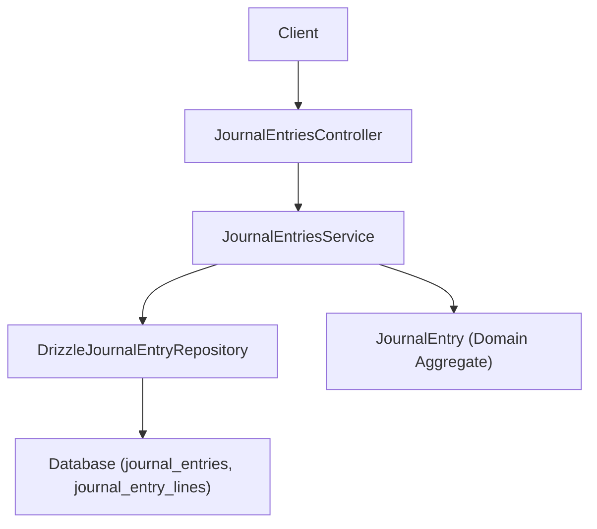
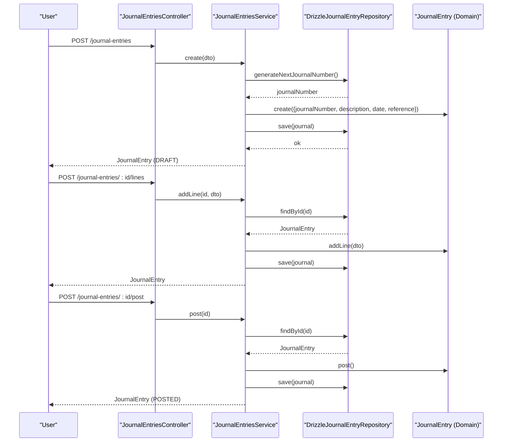
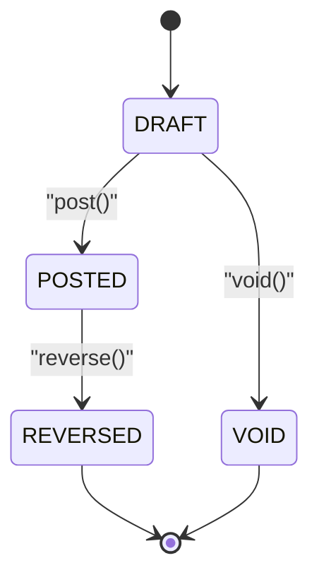
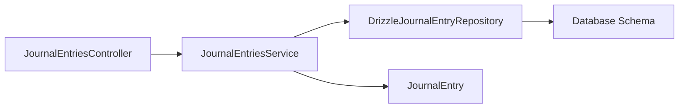

# Journal Entries

<cite>
**Referenced Files in This Document**
- [0032-general-ledger-and-journal-entries.md](file://docs/rfcs/0032-general-ledger-and-journal-entries.md)
- [journal-entries.controller.ts](file://apps/api/src/journal-entries/journal-entries.controller.ts)
- [journal-entries.service.ts](file://apps/api/src/journal-entries/journal-entries.service.ts)
- [dtos.ts](file://apps/api/src/journal-entries/dtos.ts)
- [journal-entry.ts](file://packages/finance/src/journals/journal-entry.ts)
- [journal-entry.repository.ts](file://packages/finance/src/journals/journal-entry.repository.ts)
- [drizzle-journal-entry.repository.ts](file://apps/api/src/infrastructure/repositories/drizzle-journal-entry.repository.ts)
</cite>

## Table of Contents
1. [Introduction](#introduction)
2. [Project Structure](#project-structure)
3. [Core Components](#core-components)
4. [Architecture Overview](#architecture-overview)
5. [Detailed Component Analysis](#detailed-component-analysis)
6. [Dependency Analysis](#dependency-analysis)
7. [Performance Considerations](#performance-considerations)
8. [Troubleshooting Guide](#troubleshooting-guide)
9. [Conclusion](#conclusion)
10. [Appendices](#appendices)

## Introduction
This document explains Ananya ERP’s Journal Entry system end-to-end: creation, validation, posting, reversal, and voiding. It covers double-entry accounting principles enforced by the domain model, API surface, repository persistence, and state transitions. It also outlines how journal entries relate to the general ledger, error handling, locking behavior via status, and reconciliation considerations. Practical scenarios such as accruals, adjustments, depreciation, and closing entries are described conceptually with references to the implemented rules.

## Project Structure
The Journal Entry feature spans three layers:
- API layer: Controller exposes REST endpoints for creating, listing, adding lines, posting, reversing, and voiding journal entries.
- Application service: Orchestrates operations using the domain aggregate and repository.
- Domain and persistence: The finance package defines the JournalEntry aggregate with strict validation and state transitions; a Drizzle-based repository persists entries and lines.

**Diagram sources**
- [journal-entries.controller.ts:6-46](file://apps/api/src/journal-entries/journal-entries.controller.ts#L6-L46)
- [journal-entries.service.ts:11-73](file://apps/api/src/journal-entries/journal-entries.service.ts#L11-L73)
- [drizzle-journal-entry.repository.ts:41-139](file://apps/api/src/infrastructure/repositories/drizzle-journal-entry.repository.ts#L41-L139)
- [journal-entry.ts:42-157](file://packages/finance/src/journals/journal-entry.ts#L42-L157)

**Section sources**
- [journal-entries.controller.ts:6-46](file://apps/api/src/journal-entries/journal-entries.controller.ts#L6-L46)
- [journal-entries.service.ts:11-73](file://apps/api/src/journal-entries/journal-entries.service.ts#L11-L73)
- [drizzle-journal-entry.repository.ts:41-139](file://apps/api/src/infrastructure/repositories/drizzle-journal-entry.repository.ts#L41-L139)
- [journal-entry.ts:42-157](file://packages/finance/src/journals/journal-entry.ts#L42-L157)

## Core Components
- JournalEntry (domain): Enforces double-entry balance, minimum line count, non-negative amounts, and immutable posted entries. Supports DRAFT → POSTED → REVERSED / VOID lifecycle.
- JournalEntriesService: Translates DTOs into domain operations, generates unique journal numbers, and persists changes.
- JournalEntriesController: Exposes REST endpoints for full CRUD-like lifecycle plus post/reverse/void.
- Repository interface and implementation: Abstracts persistence and provides number generation, queries, and save semantics.

Key behaviors:
- Creation: Generates next journal number, sets default date if missing, initializes status DRAFT.
- Adding lines: Only allowed in DRAFT; enforces non-negative debit/credit and at least one positive side per line.
- Posting: Requires at least two lines and exact balance (debits equals credits within tolerance).
- Reversal: Only from POSTED to REVERSED.
- Voiding: Only from DRAFT to VOID.

**Section sources**
- [journal-entry.ts:65-157](file://packages/finance/src/journals/journal-entry.ts#L65-L157)
- [journal-entries.service.ts:18-73](file://apps/api/src/journal-entries/journal-entries.service.ts#L18-L73)
- [journal-entries.controller.ts:10-46](file://apps/api/src/journal-entries/journal-entries.controller.ts#L10-L46)
- [journal-entry.repository.ts:8-14](file://packages/finance/src/journals/journal-entry.repository.ts#L8-L14)

## Architecture Overview
The system follows a layered architecture with clear separation of concerns:
- Controller handles HTTP requests and maps them to service calls.
- Service coordinates domain logic and persistence.
- Domain aggregate encapsulates business rules and state machine.
- Repository abstracts data access and mapping between database records and domain objects.

**Diagram sources**
- [journal-entries.controller.ts:10-36](file://apps/api/src/journal-entries/journal-entries.controller.ts#L10-L36)
- [journal-entries.service.ts:18-58](file://apps/api/src/journal-entries/journal-entries.service.ts#L18-L58)
- [drizzle-journal-entry.repository.ts:41-87](file://apps/api/src/infrastructure/repositories/drizzle-journal-entry.repository.ts#L41-L87)
- [journal-entry.ts:65-140](file://packages/finance/src/journals/journal-entry.ts#L65-L140)

## Detailed Component Analysis

### Domain Model: JournalEntry
- State machine: DRAFT → POSTED → REVERSED or VOID.
- Validation:
  - Lines can only be added while DRAFT.
  - Debit and credit must be non-negative; at least one must be positive per line.
  - Posting requires at least two lines and balanced totals (debits equals credits within a small tolerance).
- Immutability: Once POSTED, no modifications are allowed except reversal.

**Diagram sources**
- [journal-entry.ts:120-157](file://packages/finance/src/journals/journal-entry.ts#L120-L157)

**Section sources**
- [journal-entry.ts:65-157](file://packages/finance/src/journals/journal-entry.ts#L65-L157)

### API Layer: Controller
Endpoints:
- POST /journal-entries: Create a new draft entry.
- GET /journal-entries: List entries with optional status filter and search.
- GET /journal-entries/:id: Retrieve a specific entry.
- POST /journal-entries/:id/lines: Add a line item to a draft entry.
- POST /journal-entries/:id/post: Post the entry (balance check enforced).
- POST /journal-entries/:id/reverse: Reverse a posted entry.
- POST /journal-entries/:id/void: Void a draft entry.

Validation is delegated to DTOs and domain rules.

**Section sources**
- [journal-entries.controller.ts:6-46](file://apps/api/src/journal-entries/journal-entries.controller.ts#L6-L46)

### Application Service: JournalEntriesService
Responsibilities:
- Generate unique journal numbers via repository.
- Create domain JournalEntry instances from DTOs.
- Add lines, post, reverse, and void entries through the domain aggregate.
- Persist changes back to storage.

Error handling:
- Throws NotFoundException when an entry does not exist.
- Delegates domain validation errors (e.g., imbalance, invalid state transitions) to callers.

**Section sources**
- [journal-entries.service.ts:11-73](file://apps/api/src/journal-entries/journal-entries.service.ts#L11-L73)

### Data Transfer Objects (DTOs)
- CreateJournalEntryDto: Validates description, optional date, and optional reference.
- AddJournalLineDto: Validates accountId, non-negative debit and credit, and optional description.

These enforce input-level constraints before reaching the domain layer.

**Section sources**
- [dtos.ts:10-40](file://apps/api/src/journal-entries/dtos.ts#L10-L40)

### Persistence: Repository Interface and Implementation
Interface:
- findById, findByNumber, findMany, save, generateNextJournalNumber.

Implementation highlights:
- Maps database rows to domain JournalEntry with lines.
- Upserts entries and lines with conflict handling.
- Generates journal numbers in JE-{year}-{sequential} format based on current row count.

Indexes:
- journal_entry_lines has indexes on journal_entry_id and account_id for efficient lookups.

**Section sources**
- [journal-entry.repository.ts:8-14](file://packages/finance/src/journals/journal-entry.repository.ts#L8-L14)
- [drizzle-journal-entry.repository.ts:41-139](file://apps/api/src/infrastructure/repositories/drizzle-journal-entry.repository.ts#L41-L139)

### General Ledger Relationship
- RFC defines the general ledger as the cumulative record of all posted financial transactions.
- In this implementation, posting transitions the entry to POSTED; downstream processes can read posted entries to update ledger balances.
- The current codebase enforces balance invariants at post time but does not include explicit ledger-updating logic in these files.

**Section sources**
- [0032-general-ledger-and-journal-entries.md:15-16](file://docs/rfcs/0032-general-ledger-and-journal-entries.md#L15-L16)
- [journal-entry.ts:120-140](file://packages/finance/src/journals/journal-entry.ts#L120-L140)

## Dependency Analysis
High-level dependencies:
- Controller depends on Service.
- Service depends on Repository and Domain Aggregate.
- Repository depends on Database schema and query utilities.
- Domain Aggregate is independent and encapsulates business rules.

**Diagram sources**
- [journal-entries.controller.ts:1-46](file://apps/api/src/journal-entries/journal-entries.controller.ts#L1-L46)
- [journal-entries.service.ts:1-73](file://apps/api/src/journal-entries/journal-entries.service.ts#L1-L73)
- [drizzle-journal-entry.repository.ts:1-139](file://apps/api/src/infrastructure/repositories/drizzle-journal-entry.repository.ts#L1-L139)
- [journal-entry.ts:1-157](file://packages/finance/src/journals/journal-entry.ts#L1-L157)

**Section sources**
- [journal-entries.controller.ts:1-46](file://apps/api/src/journal-entries/journal-entries.controller.ts#L1-L46)
- [journal-entries.service.ts:1-73](file://apps/api/src/journal-entries/journal-entries.service.ts#L1-L73)
- [drizzle-journal-entry.repository.ts:1-139](file://apps/api/src/infrastructure/repositories/drizzle-journal-entry.repository.ts#L1-L139)
- [journal-entry.ts:1-157](file://packages/finance/src/journals/journal-entry.ts#L1-L157)

## Performance Considerations
- Listing entries fetches all rows and then loads lines per entry; consider batching or eager loading strategies for large datasets.
- Saving uses upserts for both entries and lines; ensure appropriate indexes exist (already present for line lookups).
- Number generation counts all rows; for high volume, consider sequence tables or server-side counters.

[No sources needed since this section provides general guidance]

## Troubleshooting Guide
Common errors and causes:
- Cannot add lines after posting: Ensure entry is in DRAFT before adding lines.
- Negative amounts: Debit and credit must be non-negative; adjust inputs accordingly.
- Empty line amounts: Each line must have either a positive debit or credit.
- Minimum lines: At least two lines required to post.
- Balance mismatch: Total debits must equal total credits within tolerance; review line amounts.
- Invalid state transitions: Only POSTED entries can be reversed; only DRAFT entries can be voided.
- Not found: Verify the entry ID exists before attempting operations.

Operational notes:
- Posted entries are immutable; use reversal to correct mistakes.
- Use the list endpoint filters to locate entries by status or search terms.

**Section sources**
- [journal-entry.ts:91-157](file://packages/finance/src/journals/journal-entry.ts#L91-L157)
- [journal-entries.service.ts:38-44](file://apps/api/src/journal-entries/journal-entries.service.ts#L38-L44)

## Conclusion
Ananya ERP’s Journal Entry system enforces robust double-entry accounting through a well-defined domain model and clear state transitions. The API provides a complete lifecycle for creating, validating, posting, reversing, and voiding entries. While ledger updates are defined at the design level, the current implementation ensures data integrity at the point of posting. For multi-currency support, approval workflows, audit trails, and advanced reconciliation, additional modules and configurations would extend this foundation.

[No sources needed since this section summarizes without analyzing specific files]

## Appendices

### Accounting Principles and Validation Rules
- Double-entry rule: Sum(Debits) == Sum(Credits) at post time.
- Non-negative amounts per line; each line must contribute to either debit or credit.
- Minimum two lines per entry to ensure meaningful postings.

**Section sources**
- [journal-entry.ts:91-140](file://packages/finance/src/journals/journal-entry.ts#L91-L140)
- [0032-general-ledger-and-journal-entries.md:55-63](file://docs/rfcs/0032-general-ledger-and-journal-entries.md#L55-L63)

### Common Scenarios (Conceptual)
- Accruals: Record expenses or revenues recognized in the period but not yet invoiced; ensure debits and credits balance across expense and liability or asset accounts.
- Adjustments: Correct prior-period misstatements by reversing or creating offsetting entries; use reversal flow for posted entries.
- Depreciation: Allocate asset cost over useful life; post periodic depreciation expense against accumulated depreciation.
- Closing entries: Transfer temporary accounts to retained earnings or equity; ensure balanced transfers across multiple accounts.

[No sources needed since this section doesn't analyze specific files]

### Multi-Currency Support
- Current implementation stores numeric amounts without currency context in journal lines.
- To support multi-currency, extend domain and persistence to include currency codes and exchange rates, and apply conversion rules at posting.

[No sources needed since this section doesn't analyze specific files]

### Approval Workflows, Audit Trails, and Compliance
- Approval workflows: Not implemented in the current files; could be added as a pre-post gate enforcing role-based approvals.
- Audit trails: Timestamps are maintained (createdAt, updatedAt); consider adding explicit audit logs for critical actions like post/reverse/void.
- Compliance: Enforce immutability of posted entries and require reversals for corrections to maintain auditability.

[No sources needed since this section doesn't analyze specific files]

### Reconciliation Processes
- Bank reconciliation: Can leverage posted journal entries linked to bank accounts; ensure entries reference appropriate accounts for traceability.
- Period-end checks: Validate that all periods are balanced and closed; use status filtering to identify open or reversed entries requiring attention.

[No sources needed since this section doesn't analyze specific files]