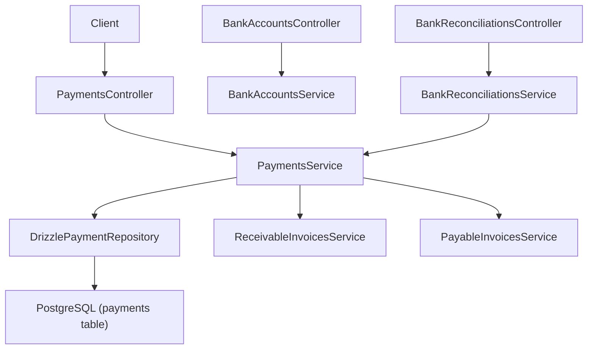
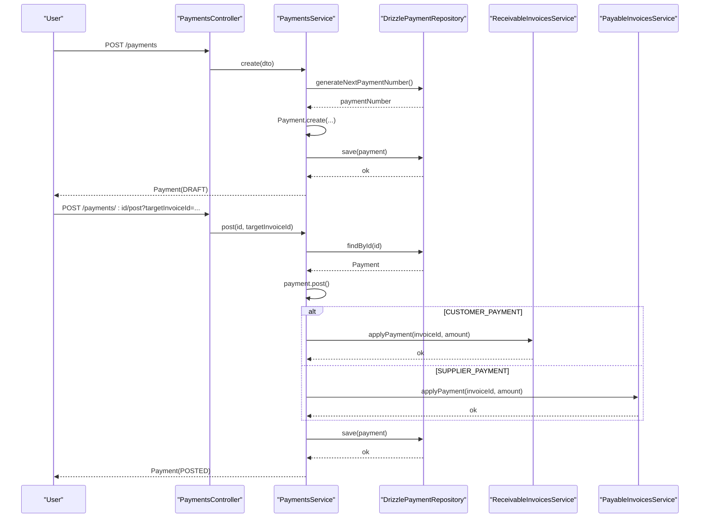
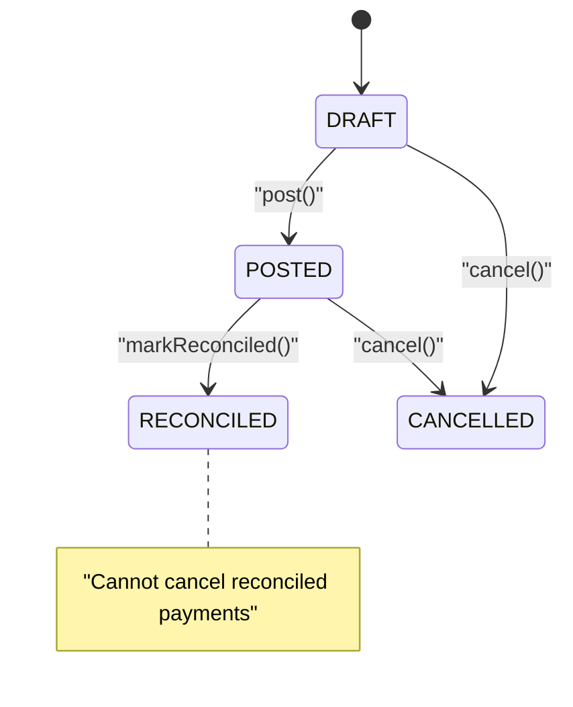
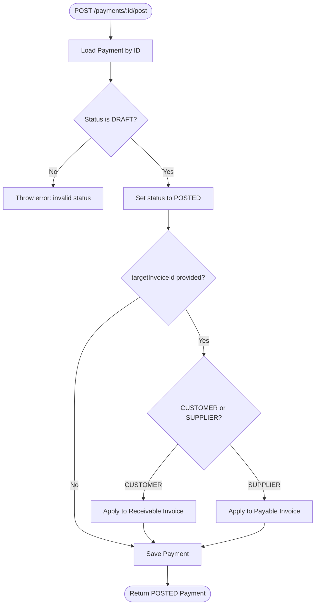
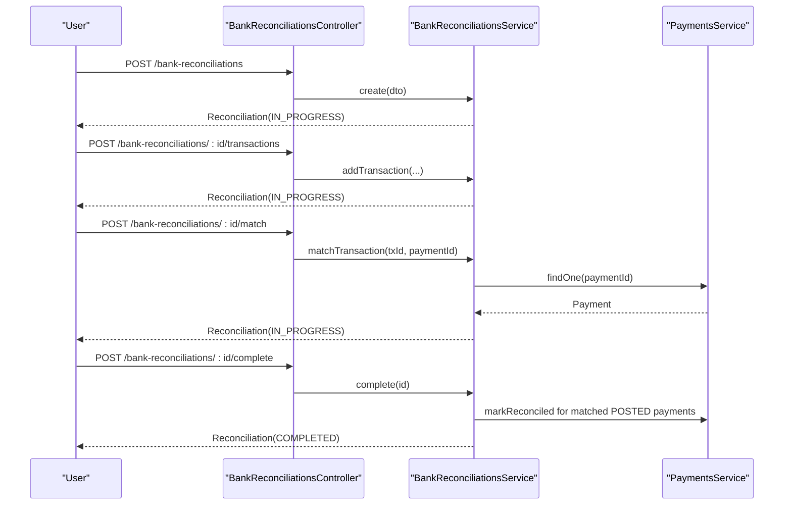
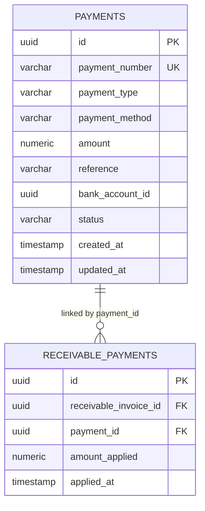
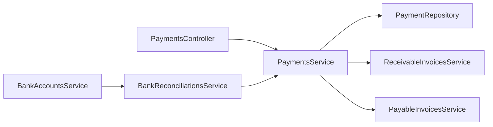

# Payment Processing

<cite>
**Referenced Files in This Document**
- [payments.controller.ts](file://apps/api/src/payments/payments.controller.ts)
- [payments.service.ts](file://apps/api/src/payments/payments.service.ts)
- [dtos.ts](file://apps/api/src/payments/dtos.ts)
- [payment.ts](file://packages/finance/src/payments/payment.ts)
- [payment.repository.ts](file://packages/finance/src/payments/payment.repository.ts)
- [drizzle-payment.repository.ts](file://apps/api/src/infrastructure/repositories/drizzle-payment.repository.ts)
- [payments schema](file://packages/database/src/schema/payments.ts)
- [bank-accounts.controller.ts](file://apps/api/src/bank-accounts/bank-accounts.controller.ts)
- [bank-accounts.service.ts](file://apps/api/src/bank-accounts/bank-accounts.service.ts)
- [bank-reconciliations.controller.ts](file://apps/api/src/bank-reconciliations/bank-reconciliations.controller.ts)
- [bank-reconciliations.service.ts](file://apps/api/src/bank-reconciliations/bank-reconciliations.service.ts)
- [receivable-invoices schema](file://packages/database/src/schema/receivable-invoices.ts)
- [payable-invoice.ts](file://packages/finance/src/payables/payable-invoice.ts)
</cite>

## Table of Contents
1. [Introduction](#introduction)
2. [Project Structure](#project-structure)
3. [Core Components](#core-components)
4. [Architecture Overview](#architecture-overview)
5. [Detailed Component Analysis](#detailed-component-analysis)
6. [Dependency Analysis](#dependency-analysis)
7. [Performance Considerations](#performance-considerations)
8. [Troubleshooting Guide](#troubleshooting-guide)
9. [Conclusion](#conclusion)

## Introduction
This document explains Ananya ERP’s Payment Processing system, focusing on payment methods, bank integrations, and automated workflows for creating, approving, executing, and reconciling payments across channels such as wire transfers, checks, ACH, credit cards, and cash. It covers the end-to-end lifecycle from payment creation to posting, allocation to invoices, and reconciliation with bank statements, including error handling and audit considerations.

## Project Structure
The payment processing feature spans API controllers/services, domain models in the finance package, and database schemas:
- API layer exposes endpoints for creating, querying, posting, and canceling payments; listing bank accounts; and managing bank reconciliations.
- Domain layer defines payment types, methods, statuses, and state transitions.
- Infrastructure layer implements persistence via a Drizzle repository and maps between DB records and domain objects.
- Database schemas define tables for payments, receivable payments, and related structures.

**Diagram sources**
- [payments.controller.ts:6-40](file://apps/api/src/payments/payments.controller.ts#L6-L40)
- [payments.service.ts:15-86](file://apps/api/src/payments/payments.service.ts#L15-L86)
- [drizzle-payment.repository.ts:29-93](file://apps/api/src/infrastructure/repositories/drizzle-payment.repository.ts#L29-L93)
- [bank-accounts.controller.ts:4-11](file://apps/api/src/bank-accounts/bank-accounts.controller.ts#L4-L11)
- [bank-accounts.service.ts:6-58](file://apps/api/src/bank-accounts/bank-accounts.service.ts#L6-L58)
- [bank-reconciliations.controller.ts:10-45](file://apps/api/src/bank-reconciliations/bank-reconciliations.controller.ts#L10-L45)
- [bank-reconciliations.service.ts:17-95](file://apps/api/src/bank-reconciliations/bank-reconciliations.service.ts#L17-L95)

**Section sources**
- [payments.controller.ts:6-40](file://apps/api/src/payments/payments.controller.ts#L6-L40)
- [payments.service.ts:15-86](file://apps/api/src/payments/payments.service.ts#L15-L86)
- [drizzle-payment.repository.ts:29-93](file://apps/api/src/infrastructure/repositories/drizzle-payment.repository.ts#L29-L93)
- [bank-accounts.controller.ts:4-11](file://apps/api/src/bank-accounts/bank-accounts.controller.ts#L4-L11)
- [bank-accounts.service.ts:6-58](file://apps/api/src/bank-accounts/bank-accounts.service.ts#L6-L58)
- [bank-reconciliations.controller.ts:10-45](file://apps/api/src/bank-reconciliations/bank-reconciliations.controller.ts#L10-L45)
- [bank-reconciliations.service.ts:17-95](file://apps/api/src/bank-reconciliations/bank-reconciliations.service.ts#L17-L95)

## Core Components
- Payment domain model: Defines payment types (customer, supplier, internal transfer, refund), methods (wire transfer, check, credit card, cash, ACH), and status transitions (DRAFT → POSTED → RECONCILED or CANCELLED). Validation enforces positive amounts and correct state changes.
- Payments service: Orchestrates creation, querying, posting, and cancellation. On post, optionally allocates the payment to a target invoice based on payment type.
- Repository: Persists payments, supports filtering by type, bank account, and status, generates unique payment numbers, and rehydrates domain objects from DB rows.
- Bank accounts service: Lists bank accounts and shows latest reconciliation statement balances and dates.
- Bank reconciliations service: Manages reconciliation sessions, adds transactions, matches them to payments, and completes reconciliation, marking matched posted payments as reconciled.

**Section sources**
- [payment.ts:3-105](file://packages/finance/src/payments/payment.ts#L3-L105)
- [payments.service.ts:23-86](file://apps/api/src/payments/payments.service.ts#L23-L86)
- [payment.repository.ts:3-15](file://packages/finance/src/payments/payment.repository.ts#L3-L15)
- [drizzle-payment.repository.ts:14-93](file://apps/api/src/infrastructure/repositories/drizzle-payment.repository.ts#L14-L93)
- [bank-accounts.service.ts:8-58](file://apps/api/src/bank-accounts/bank-accounts.service.ts#L8-L58)
- [bank-reconciliations.service.ts:24-95](file://apps/api/src/bank-reconciliations/bank-reconciliations.service.ts#L24-L95)

## Architecture Overview
The system follows a layered architecture:
- API Controllers expose REST endpoints for payments, bank accounts, and bank reconciliations.
- Services implement business logic and coordinate domain operations and cross-module interactions (e.g., applying payments to invoices).
- Repositories abstract data access and map between persistence and domain models.
- Database schemas enforce structure and provide indexes for performance.

**Diagram sources**
- [payments.controller.ts:10-35](file://apps/api/src/payments/payments.controller.ts#L10-L35)
- [payments.service.ts:23-79](file://apps/api/src/payments/payments.service.ts#L23-L79)
- [drizzle-payment.repository.ts:29-85](file://apps/api/src/infrastructure/repositories/drizzle-payment.repository.ts#L29-L85)

**Section sources**
- [payments.controller.ts:6-40](file://apps/api/src/payments/payments.controller.ts#L6-L40)
- [payments.service.ts:23-86](file://apps/api/src/payments/payments.service.ts#L23-L86)
- [drizzle-payment.repository.ts:29-93](file://apps/api/src/infrastructure/repositories/drizzle-payment.repository.ts#L29-L93)

## Detailed Component Analysis

### Payment Domain Model
- Types: PaymentType, PaymentMethod, PaymentStatus.
- Lifecycle: DRAFT → POSTED → RECONCILED or CANCELLED. State transitions are enforced within the model to prevent invalid operations.
- Creation: Validates amount > 0 and sets initial status to DRAFT.

**Diagram sources**
- [payment.ts:33-105](file://packages/finance/src/payments/payment.ts#L33-L105)

**Section sources**
- [payment.ts:3-105](file://packages/finance/src/payments/payment.ts#L3-L105)

### Payments Service and Controller
- Create: Generates a unique payment number, constructs a Payment in DRAFT state, persists it.
- Query: Supports filtering by paymentType, bankAccountId, and status.
- Post: Transitions to POSTED and optionally applies payment to a target invoice based on payment type.
- Cancel: Transitions to CANCELLED where allowed.

**Diagram sources**
- [payments.controller.ts:29-35](file://apps/api/src/payments/payments.controller.ts#L29-L35)
- [payments.service.ts:58-79](file://apps/api/src/payments/payments.service.ts#L58-L79)

**Section sources**
- [payments.controller.ts:6-40](file://apps/api/src/payments/payments.controller.ts#L6-L40)
- [payments.service.ts:23-86](file://apps/api/src/payments/payments.service.ts#L23-L86)

### Bank Accounts
- Lists all configured bank accounts and attaches the latest reconciliation statement balance and date per account. Account numbers are masked for security.

**Section sources**
- [bank-accounts.controller.ts:4-11](file://apps/api/src/bank-accounts/bank-accounts.controller.ts#L4-L11)
- [bank-accounts.service.ts:8-58](file://apps/api/src/bank-accounts/bank-accounts.service.ts#L8-L58)

### Bank Reconciliations
- Create reconciliation session with opening/closing balances and statement date.
- Add transactions to the session.
- Match transactions to payments by linking transaction IDs to payment IDs.
- Complete reconciliation only when all transactions are matched; marks matched posted payments as RECONCILED.

**Diagram sources**
- [bank-reconciliations.controller.ts:14-45](file://apps/api/src/bank-reconciliations/bank-reconciliations.controller.ts#L14-L45)
- [bank-reconciliations.service.ts:24-95](file://apps/api/src/bank-reconciliations/bank-reconciliations.service.ts#L24-L95)
- [payments.service.ts:50-86](file://apps/api/src/payments/payments.service.ts#L50-L86)

**Section sources**
- [bank-reconciliations.controller.ts:10-45](file://apps/api/src/bank-reconciliations/bank-reconciliations.controller.ts#L10-L45)
- [bank-reconciliations.service.ts:17-95](file://apps/api/src/bank-reconciliations/bank-reconciliations.service.ts#L17-L95)

### Data Models and Persistence
- Payments table stores core fields with indexes for efficient queries by type, bank account, and status.
- Receivable payments link payments to receivable invoices with applied amounts and timestamps.
- Repository converts DB rows to domain objects and vice versa, ensuring consistent types and precision handling.

**Diagram sources**
- [payments schema:11-34](file://packages/database/src/schema/payments.ts#L11-L34)
- [receivable-invoices schema:42-61](file://packages/database/src/schema/receivable-invoices.ts#L42-L61)

**Section sources**
- [payments schema:11-34](file://packages/database/src/schema/payments.ts#L11-L34)
- [receivable-invoices schema:42-61](file://packages/database/src/schema/receivable-invoices.ts#L42-L61)
- [drizzle-payment.repository.ts:14-93](file://apps/api/src/infrastructure/repositories/drizzle-payment.repository.ts#L14-L93)

## Dependency Analysis
- PaymentsController depends on PaymentsService for all payment operations.
- PaymentsService depends on:
  - PaymentRepository for persistence and number generation.
  - ReceivableInvoicesService and PayableInvoicesService for automatic allocation during posting.
- BankReconciliationsService depends on PaymentsService to mark matched payments as reconciled.
- BankAccountsService reads bank accounts and latest reconciliation data to present account summaries.

**Diagram sources**
- [payments.controller.ts:6-40](file://apps/api/src/payments/payments.controller.ts#L6-L40)
- [payments.service.ts:15-86](file://apps/api/src/payments/payments.service.ts#L15-L86)
- [bank-reconciliations.service.ts:17-95](file://apps/api/src/bank-reconciliations/bank-reconciliations.service.ts#L17-L95)
- [bank-accounts.service.ts:6-58](file://apps/api/src/bank-accounts/bank-accounts.service.ts#L6-L58)

**Section sources**
- [payments.controller.ts:6-40](file://apps/api/src/payments/payments.controller.ts#L6-L40)
- [payments.service.ts:15-86](file://apps/api/src/payments/payments.service.ts#L15-L86)
- [bank-reconciliations.service.ts:17-95](file://apps/api/src/bank-reconciliations/bank-reconciliations.service.ts#L17-L95)
- [bank-accounts.service.ts:6-58](file://apps/api/src/bank-accounts/bank-accounts.service.ts#L6-L58)

## Performance Considerations
- Use query filters in findMany to limit result sets by paymentType, bankAccountId, and status.
- Leverage database indexes on payment_type, bank_account_id, and status for faster lookups.
- Batch operations: When implementing bulk payments, consider grouping saves and minimizing round-trips to the database.
- Mask sensitive data at the service layer (e.g., account numbers) to reduce payload size and improve privacy.

[No sources needed since this section provides general guidance]

## Troubleshooting Guide
Common errors and how to handle them:
- Invalid state transitions: Attempting to post or reconcile a payment outside its allowed states will throw an error. Ensure payments are in DRAFT before posting and in POSTED before marking reconciled.
- Amount validation: Creating a payment with non-positive amount fails validation. Verify input amounts are greater than zero.
- Allocation constraints: Applying payments to invoices requires the invoice to be in a compatible state and not exceed remaining balance. Validate invoice status and balance before allocation.
- Reconciliation completion: Reconciliation cannot be completed if any transactions remain unmatched. Ensure all transactions are matched before completing.

Operational tips:
- Use the bank accounts endpoint to verify available accounts and their latest reconciliation status.
- Inspect payment status via the payments list endpoint filtered by status to track workflow progress.
- For mismatches, use the reconciliation match endpoint to link bank transactions to payments and review outcomes.

**Section sources**
- [payment.ts:58-105](file://packages/finance/src/payments/payment.ts#L58-L105)
- [payable-invoice.ts:84-111](file://packages/finance/src/payables/payable-invoice.ts#L84-L111)
- [bank-reconciliations.service.ts:66-95](file://apps/api/src/bank-reconciliations/bank-reconciliations.service.ts#L66-L95)

## Conclusion
Ananya ERP’s Payment Processing system provides a robust, stateful workflow for creating, posting, allocating, and reconciling payments across multiple methods and channels. The design separates concerns across controllers, services, repositories, and domain models, enabling clear state management, integration with invoicing modules, and reliable reconciliation with bank statements. By following the documented workflows and leveraging the provided endpoints, teams can automate payment execution, maintain accurate financial records, and ensure compliance through strict state transitions and validations.

[No sources needed since this section summarizes without analyzing specific files]