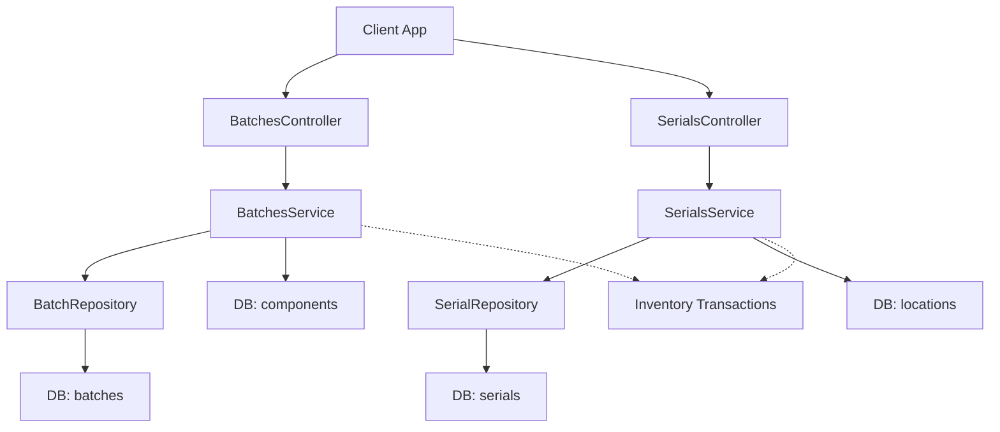
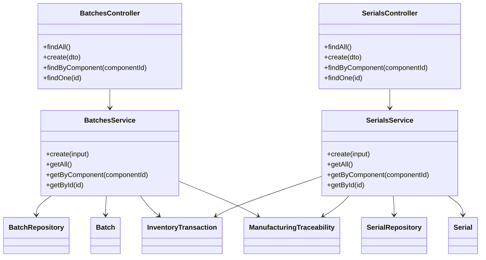
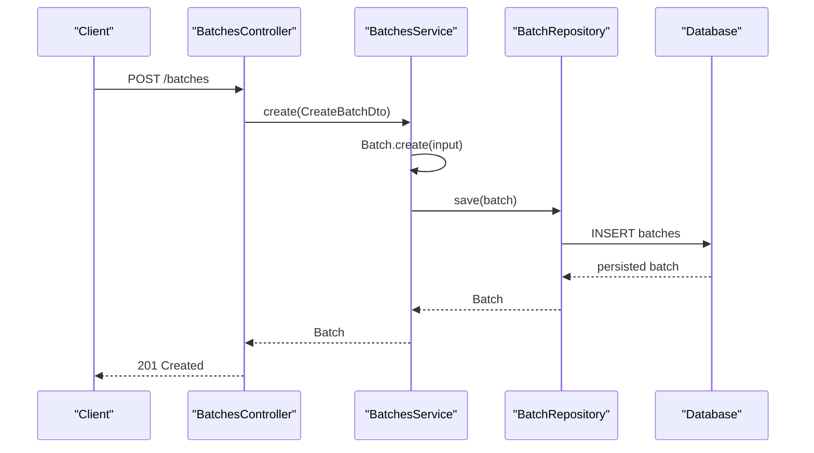
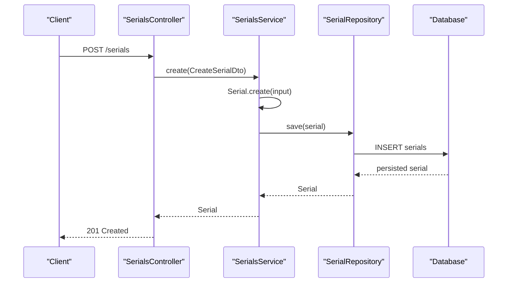
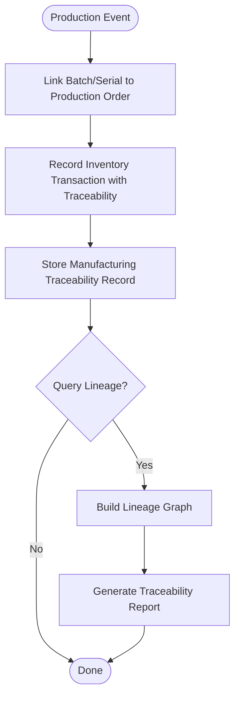
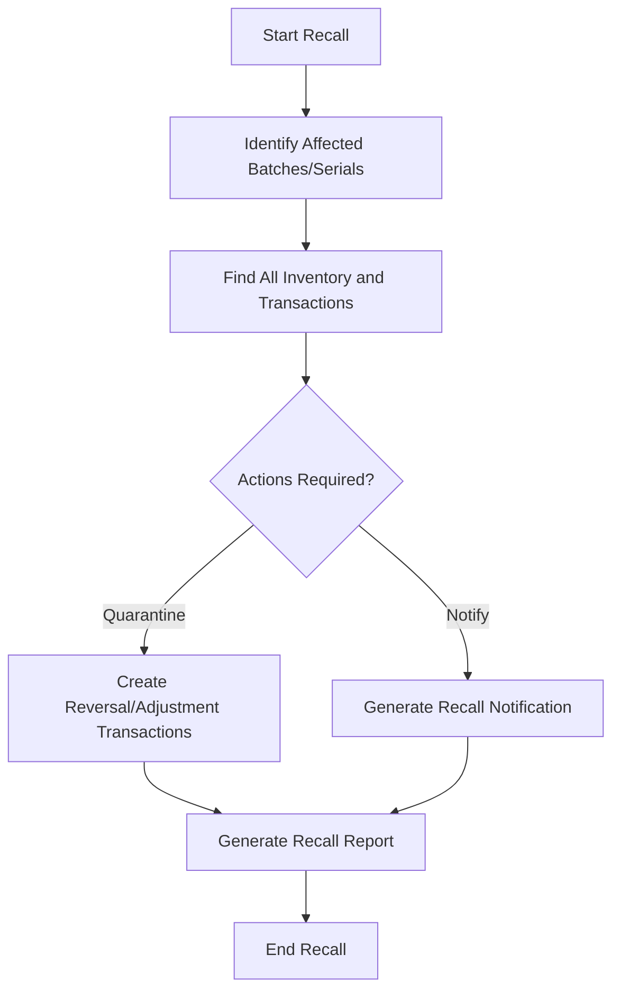
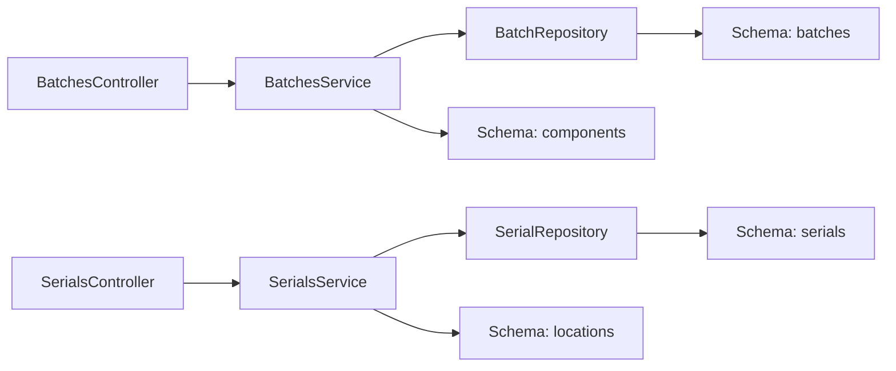

# Batch & Serial Number Tracking

<cite>
**Referenced Files in This Document**
- [RFC-0007: Batch and Serial Tracking](file://docs/rfcs/0007-batch-and-serial-tracking.md)
- [Batches Controller](file://apps/api/src/batches/batches.controller.ts)
- [Batches Service](file://apps/api/src/batches/batches.service.ts)
- [Create Batch DTO](file://apps/api/src/batches/create-batch.dto.ts)
- [Serials Controller](file://apps/api/src/serials/serials.controller.ts)
- [Serials Service](file://apps/api/src/serials/serials.service.ts)
- [Create Serial DTO](file://apps/api/src/serials/create-serial.dto.ts)
- [Batch Model](file://packages/inventory/src/batches/batch.ts)
- [Batch Repository Interface](file://packages/inventory/src/batches/batch.repository.ts)
- [Serial Model](file://packages/inventory/src/serials/serial.ts)
- [Serial Repository Interface](file://packages/inventory/src/serials/serial.repository.ts)
- [Database Schema: Batches](file://packages/database/src/schema/batches.ts)
- [Database Schema: Serials](file://packages/database/src/schema/serials.ts)
- [Inventory Transaction Model](file://packages/inventory/src/ledger/inventory-transaction.ts)
- [Inventory Transaction Types](file://packages/inventory/src/ledger/inventory-transaction.types.ts)
- [Manufacturing Traceability Schema](file://packages/database/src/schema/manufacturing-traceability.ts)
</cite>

## Table of Contents
1. Introduction
2. Project Structure
3. Core Components
4. Architecture Overview
5. Detailed Component Analysis
6. Dependency Analysis
7. Performance Considerations
8. Troubleshooting Guide
9. Conclusion
10. Appendices

## Introduction
This document explains Ananya ERP’s Batch and Serial Number Tracking system. It covers data models, tracking requirements, traceability features, workflows for batch creation and serial assignment, product lineage tracking, recall management, expiry handling, compliance reporting, API endpoints, search capabilities, audit trails, and examples for implementing batch-controlled processes and serialization.

The design follows RFC-0007, which establishes three traceability levels (None, Batch, Serial), keeps the Inventory Ledger as the single source of truth, and ensures immutable history with corrections represented by additional transactions.

**Section sources**
- [RFC-0007: Batch and Serial Tracking:11-159](file://docs/rfcs/0007-batch-and-serial-tracking.md#L11-L159)

## Project Structure
Ananya implements batch and serial tracking across layered modules:
- API layer: NestJS controllers and services expose REST endpoints for batch and serial operations.
- Domain layer: Inventory package defines Batch and Serial domain models and repository interfaces.
- Persistence layer: Database schemas define tables for batches and serials; queries join to components and locations.
- Traceability integration: Manufacturing traceability schema links production events to batches/serials for lineage.

**Diagram sources**
- [Batches Controller:12-44](file://apps/api/src/batches/batches.controller.ts#L12-L44)
- [Batches Service:19-47](file://apps/api/src/batches/batches.service.ts#L19-L47)
- [Serials Controller:12-38](file://apps/api/src/serials/serials.controller.ts#L12-L38)
- [Serials Service:19-47](file://apps/api/src/serials/serials.service.ts#L19-L47)
- [Database Schema: Batches](file://packages/database/src/schema/batches.ts)
- [Database Schema: Serials](file://packages/database/src/schema/serials.ts)

**Section sources**
- [Batches Controller:12-44](file://apps/api/src/batches/batches.controller.ts#L12-L44)
- [Batches Service:19-47](file://apps/api/src/batches/batches.service.ts#L19-L47)
- [Serials Controller:12-38](file://apps/api/src/serials/serials.controller.ts#L12-L38)
- [Serials Service:19-47](file://apps/api/src/serials/serials.service.ts#L19-L47)

## Core Components
- Batch model and repository interface define batch identity, dates, and supplier references, and how to persist/find batches.
- Serial model and repository interface define unique serial identity per component and location linkage.
- API controllers expose CRUD-like endpoints for listing, creating, and retrieving by ID or component.
- Services orchestrate domain object creation via factory methods and delegate persistence to repositories.
- Database schemas provide relational structure for batches and serials, including joins to components and locations.

Key responsibilities:
- Enforce optional traceability per component (None/Batch/Serial).
- Preserve immutable history through inventory transactions.
- Support recall and expiry workflows via batch metadata.
- Enable product lineage via manufacturing traceability records.

**Section sources**
- [Batch Model](file://packages/inventory/src/batches/batch.ts)
- [Batch Repository Interface](file://packages/inventory/src/batches/batch.repository.ts)
- [Serial Model](file://packages/inventory/src/serials/serial.ts)
- [Serial Repository Interface](file://packages/inventory/src/serials/serial.repository.ts)
- [Batches Service:19-47](file://apps/api/src/batches/batches.service.ts#L19-L47)
- [Serials Service:19-47](file://apps/api/src/serials/serials.service.ts#L19-L47)

## Architecture Overview
The system separates concerns into controller, service, repository, and database layers while integrating with the Inventory Ledger and Manufacturing Traceability subsystems.

**Diagram sources**
- [Batches Controller:12-44](file://apps/api/src/batches/batches.controller.ts#L12-L44)
- [Batches Service:19-47](file://apps/api/src/batches/batches.service.ts#L19-L47)
- [Serials Controller:12-38](file://apps/api/src/serials/serials.controller.ts#L12-L38)
- [Serials Service:19-47](file://apps/api/src/serials/serials.service.ts#L19-L47)
- [Batch Model](file://packages/inventory/src/batches/batch.ts)
- [Serial Model](file://packages/inventory/src/serials/serial.ts)
- [Inventory Transaction Model](file://packages/inventory/src/ledger/inventory-transaction.ts)
- [Manufacturing Traceability Schema](file://packages/database/src/schema/manufacturing-traceability.ts)

## Detailed Component Analysis

### Batch Tracking
- Data model: Batch includes identifiers, component association, batch number, optional manufacturing/expiry dates, and supplier batch number.
- API endpoints:
  - GET /batches: list all batches with component details.
  - POST /batches: create a batch from DTO.
  - GET /batches/component/:componentId: list batches for a component.
  - GET /batches/:id: retrieve a specific batch.
- Service behavior:
  - Create uses Batch.create factory and persists via repository.
  - List queries include joins to components for enriched output.
- Search capabilities:
  - Filter by componentId via dedicated endpoint.
  - Additional filters can be added at service/repository level.
- Expiry and recall:
  - Expiry date stored on batch enables FEFO logic and alerts.
  - Recall flows use batch identity to locate affected inventory and transactions.
- Audit trail:
  - Immutable ledger entries record batch movements; corrections are new transactions.

**Diagram sources**
- [Batches Controller:21-30](file://apps/api/src/batches/batches.controller.ts#L21-L30)
- [Batches Service:19-22](file://apps/api/src/batches/batches.service.ts#L19-L22)
- [Create Batch DTO:3-21](file://apps/api/src/batches/create-batch.dto.ts#L3-L21)
- [Batch Model](file://packages/inventory/src/batches/batch.ts)
- [Batch Repository Interface](file://packages/inventory/src/batches/batch.repository.ts)

**Section sources**
- [Batches Controller:12-44](file://apps/api/src/batches/batches.controller.ts#L12-L44)
- [Batches Service:19-47](file://apps/api/src/batches/batches.service.ts#L19-L47)
- [Create Batch DTO:3-21](file://apps/api/src/batches/create-batch.dto.ts#L3-L21)
- [Batch Model](file://packages/inventory/src/batches/batch.ts)
- [Batch Repository Interface](file://packages/inventory/src/batches/batch.repository.ts)
- [Database Schema: Batches](file://packages/database/src/schema/batches.ts)

### Serial Number Tracking
- Data model: Serial uniquely identifies one item per component, optionally linked to a location.
- API endpoints:
  - GET /serials: list all serials with component and location details.
  - POST /serials: create a serial from DTO.
  - GET /serials/component/:componentId: list serials for a component.
  - GET /serials/:id: retrieve a specific serial.
- Service behavior:
  - Create uses Serial.create factory and persists via repository.
  - List queries join to components and locations for enriched output.
- Search capabilities:
  - Filter by componentId via dedicated endpoint.
  - Additional filters can be added at service/repository level.
- Audit trail:
  - Each serial movement is recorded immutably in the Inventory Ledger.

**Diagram sources**
- [Serials Controller:21-24](file://apps/api/src/serials/serials.controller.ts#L21-L24)
- [Serials Service:19-22](file://apps/api/src/serials/serials.service.ts#L19-L22)
- [Create Serial DTO:3-13](file://apps/api/src/serials/create-serial.dto.ts#L3-L13)
- [Serial Model](file://packages/inventory/src/serials/serial.ts)
- [Serial Repository Interface](file://packages/inventory/src/serials/serial.repository.ts)

**Section sources**
- [Serials Controller:12-38](file://apps/api/src/serials/serials.controller.ts#L12-L38)
- [Serials Service:19-47](file://apps/api/src/serials/serials.service.ts#L19-L47)
- [Create Serial DTO:3-13](file://apps/api/src/serials/create-serial.dto.ts#L3-L13)
- [Serial Model](file://packages/inventory/src/serials/serial.ts)
- [Serial Repository Interface](file://packages/inventory/src/serials/serial.repository.ts)
- [Database Schema: Serials](file://packages/database/src/schema/serials.ts)

### Product Lineage and Traceability
- Manufacturing traceability links production events to batches and serials, enabling end-to-end lineage from raw materials to finished goods.
- Inventory transactions preserve traceability context (batch or serial) for every movement.

**Diagram sources**
- [Manufacturing Traceability Schema](file://packages/database/src/schema/manufacturing-traceability.ts)
- [Inventory Transaction Model](file://packages/inventory/src/ledger/inventory-transaction.ts)
- [Inventory Transaction Types](file://packages/inventory/src/ledger/inventory-transaction.types.ts)

**Section sources**
- [Manufacturing Traceability Schema](file://packages/database/src/schema/manufacturing-traceability.ts)
- [Inventory Transaction Model](file://packages/inventory/src/ledger/inventory-transaction.ts)
- [Inventory Transaction Types](file://packages/inventory/src/ledger/inventory-transaction.types.ts)

### Recall Management and Expiry Handling
- Recall workflow:
  - Identify affected batches or serials by criteria (e.g., batch number, component, date range).
  - Locate all inventory and transactions referencing those identifiers.
  - Quarantine or reverse movements via new ledger transactions.
  - Generate recall report including affected customers and shipments.
- Expiry handling:
  - Use batch expiry dates to enforce FEFO picking rules and generate expiry reports.
  - Alert on near-expiry batches for proactive actions.

[No sources needed since this diagram shows conceptual workflow, not actual code structure]

### Compliance Reporting
- Reports supported:
  - Batch movement history with dates and quantities.
  - Serial movement history with timestamps and locations.
  - Expiration aging and FEFO compliance metrics.
  - Lineage graphs for regulatory submissions.
- Data sources:
  - Inventory transactions with traceability context.
  - Manufacturing traceability records.
  - Batch and serial master data.

[No sources needed since this section provides general guidance]

## Dependency Analysis
- Controllers depend on services for business logic.
- Services depend on domain models and repository interfaces for persistence abstraction.
- Repositories implement database interactions using Drizzle ORM against schema-defined tables.
- Queries join to related entities (components, locations) for enriched responses.

**Diagram sources**
- [Batches Controller:12-44](file://apps/api/src/batches/batches.controller.ts#L12-L44)
- [Batches Service:19-47](file://apps/api/src/batches/batches.service.ts#L19-L47)
- [Serials Controller:12-38](file://apps/api/src/serials/serials.controller.ts#L12-L38)
- [Serials Service:19-47](file://apps/api/src/serials/serials.service.ts#L19-L47)
- [Database Schema: Batches](file://packages/database/src/schema/batches.ts)
- [Database Schema: Serials](file://packages/database/src/schema/serials.ts)

**Section sources**
- [Batches Service:24-47](file://apps/api/src/batches/batches.service.ts#L24-L47)
- [Serials Service:24-47](file://apps/api/src/serials/serials.service.ts#L24-L47)

## Performance Considerations
- Prefer filtering at the service/repository layer to reduce payload size.
- Use indexed columns for frequent filters (e.g., componentId, batchNumber, serialNumber).
- Avoid unnecessary joins; fetch related data only when required.
- For large datasets, paginate list endpoints and consider async export jobs for reports.

[No sources needed since this section provides general guidance]

## Troubleshooting Guide
Common issues and resolutions:
- Not Found errors:
  - Ensure IDs exist before retrieval; controllers throw NotFoundException when missing.
- Validation errors:
  - Validate DTO fields (dates, strings) before submission; ensure required fields are present.
- Duplicate serial numbers:
  - Enforce uniqueness at repository/schema level; handle conflicts with clear error messages.
- Expired batches:
  - Implement checks to prevent issuance or sale of expired items based on expiryDate.
- Missing traceability context:
  - Verify that inventory transactions include batch or serial identifiers for full auditability.

**Section sources**
- [Batches Controller:37-44](file://apps/api/src/batches/batches.controller.ts#L37-L44)
- [Serials Controller:31-38](file://apps/api/src/serials/serials.controller.ts#L31-L38)
- [Create Batch DTO:3-21](file://apps/api/src/batches/create-batch.dto.ts#L3-L21)
- [Create Serial DTO:3-13](file://apps/api/src/serials/create-serial.dto.ts#L3-L13)

## Conclusion
Ananya’s Batch and Serial Number Tracking system provides robust traceability aligned with RFC-0007. It supports optional traceability per component, immutable history via the Inventory Ledger, and integrates with manufacturing traceability for full product lineage. The API exposes straightforward endpoints for batch and serial operations, with extensibility for advanced search, recall management, expiry handling, and compliance reporting.

[No sources needed since this section summarizes without analyzing specific files]

## Appendices

### API Endpoints Summary
- Batches
  - GET /batches: list all batches with component details.
  - POST /batches: create a batch from DTO.
  - GET /batches/component/:componentId: list batches for a component.
  - GET /batches/:id: retrieve a specific batch.
- Serials
  - GET /serials: list all serials with component and location details.
  - POST /serials: create a serial from DTO.
  - GET /serials/component/:componentId: list serials for a component.
  - GET /serials/:id: retrieve a specific serial.

**Section sources**
- [Batches Controller:12-44](file://apps/api/src/batches/batches.controller.ts#L12-L44)
- [Serials Controller:12-38](file://apps/api/src/serials/serials.controller.ts#L12-L38)

### Example Workflows

#### Implementing Batch-Controlled Processes
- Create a batch with componentId, batchNumber, and optional dates.
- Record inventory receipts and issuances with batch context in transactions.
- Apply FEFO picking based on expiryDate during fulfillment.
- Generate batch movement reports for audits.

**Section sources**
- [Create Batch DTO:3-21](file://apps/api/src/batches/create-batch.dto.ts#L3-L21)
- [Batches Service:19-47](file://apps/api/src/batches/batches.service.ts#L19-L47)
- [Inventory Transaction Model](file://packages/inventory/src/ledger/inventory-transaction.ts)

#### Implementing Serial Number Serialization
- Create a serial for a component and optionally assign a location.
- Track each movement with serial context in transactions.
- Provide serial lookup by componentId or id for warranty and service workflows.

**Section sources**
- [Create Serial DTO:3-13](file://apps/api/src/serials/create-serial.dto.ts#L3-L13)
- [Serials Service:19-47](file://apps/api/src/serials/serials.service.ts#L19-L47)
- [Inventory Transaction Model](file://packages/inventory/src/ledger/inventory-transaction.ts)

#### Generating Traceability Reports for Regulatory Compliance
- Query manufacturing traceability records linked to batches/serials.
- Aggregate inventory transactions to build movement histories.
- Export lineage graphs and reports for regulators.

**Section sources**
- [Manufacturing Traceability Schema](file://packages/database/src/schema/manufacturing-traceability.ts)
- [Inventory Transaction Types](file://packages/inventory/src/ledger/inventory-transaction.types.ts)