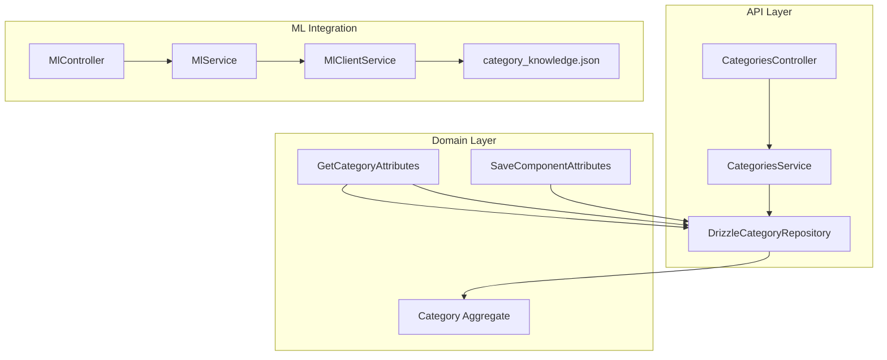
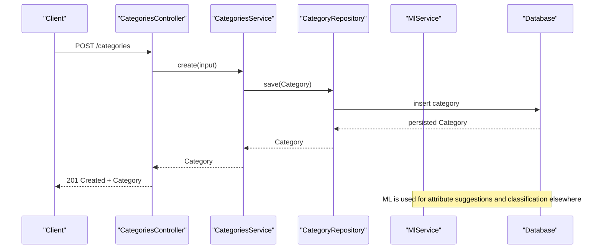
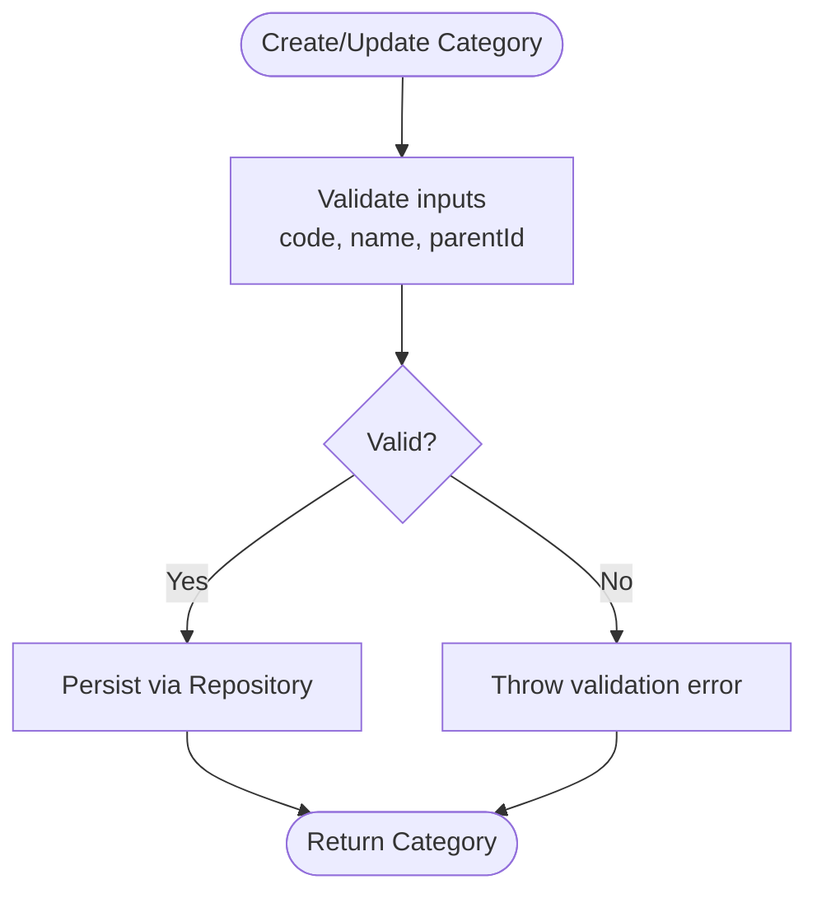
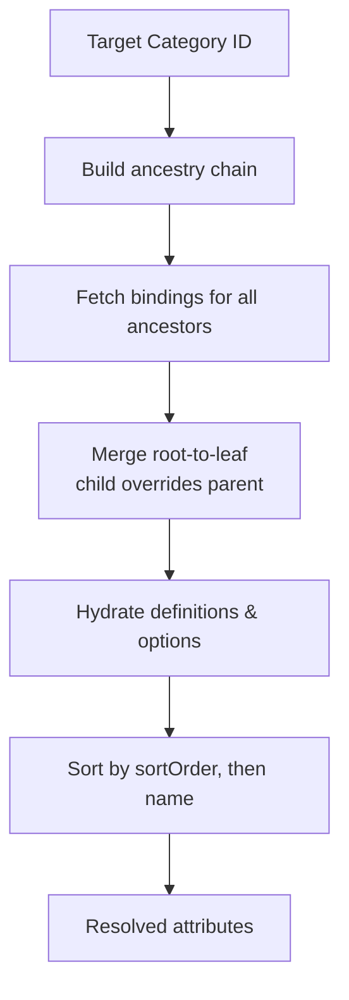
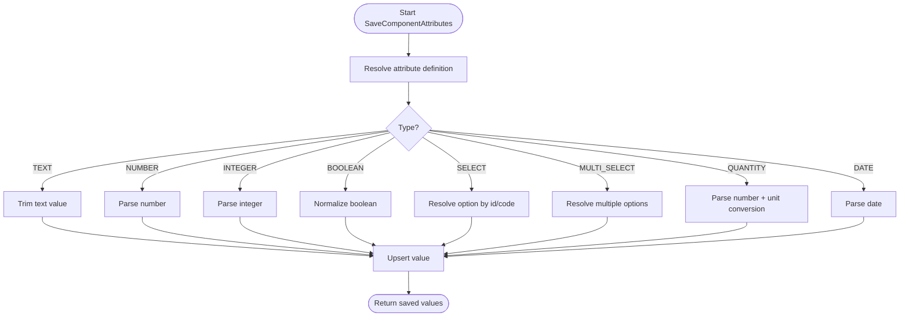
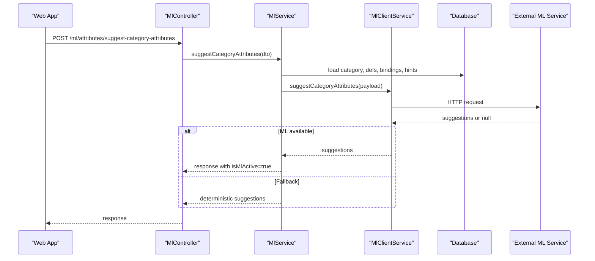
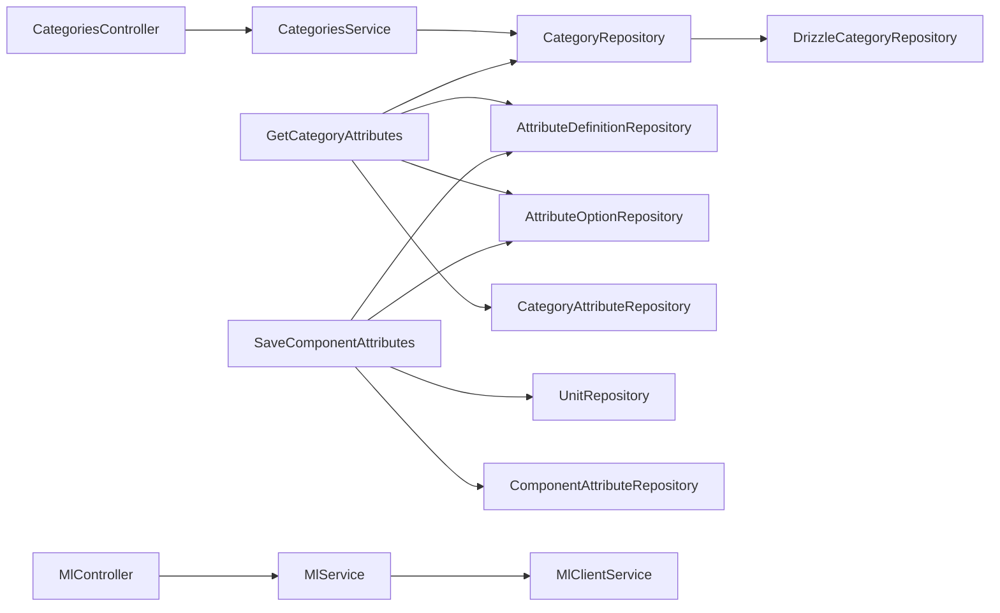

# Category Management

<cite>
**Referenced Files in This Document**
- [categories.controller.ts](file://apps/api/src/categories/categories.controller.ts)
- [categories.service.ts](file://apps/api/src/categories/categories.service.ts)
- [create-category.dto.ts](file://apps/api/src/categories/create-category.dto.ts)
- [update-category.dto.ts](file://apps/api/src/categories/update-category.dto.ts)
- [category-exception.filter.ts](file://apps/api/src/categories/category-exception.filter.ts)
- [category.ts](file://packages/inventory/src/categories/category.ts)
- [category.repository.ts](file://packages/inventory/src/categories/category.repository.ts)
- [drizzle-category.repository.ts](file://apps/api/src/infrastructure/repositories/drizzle-category.repository.ts)
- [category-attribute.ts](file://packages/inventory/src/attributes/category-attribute.ts)
- [get-category-attributes.ts](file://packages/inventory/src/attributes/get-category-attributes.ts)
- [save-component-attributes.ts](file://packages/inventory/src/attributes/save-component-attributes.ts)
- [ml.service.ts](file://apps/api/src/ml/ml.service.ts)
- [ml-client.service.ts](file://apps/api/src/ml/ml-client.service.ts)
- [ml.controller.ts](file://apps/api/src/ml/ml.controller.ts)
- [category_knowledge.json](file://apps/ml/models/category_knowledge.json)
- [0061-category-intelligence-v2.md](file://docs/rfcs/0061-category-intelligence-v2.md)
- [attributes-api.ts](file://apps/web/lib/api/attributes-api.ts)
</cite>

## Table of Contents
1. Introduction
2. Project Structure
3. Core Components
4. Architecture Overview
5. Detailed Component Analysis
6. Dependency Analysis
7. Performance Considerations
8. Troubleshooting Guide
9. Conclusion
10. Appendices

## Introduction
This document explains Ananya ERP’s Category Management system: how categories are modeled as a hierarchy, how attributes are bound to categories and inherited through the tree, how components consume those attributes, and how ML assists with category classification and attribute suggestions. It also documents API endpoints for creating and managing categories, binding attributes, and invoking ML-powered suggestions.

## Project Structure
Category management spans three layers:
- API layer (NestJS): controllers, services, DTOs, and exception filters expose CRUD operations for categories and integrate with ML.
- Domain layer (Inventory package): defines Category aggregates, repositories, and attribute binding logic including inheritance across the category tree.
- ML integration: an external ML service is called to suggest category attributes and classify components; domain knowledge is stored in a versioned JSON file.

**Diagram sources**
- [categories.controller.ts:17-49](file://apps/api/src/categories/categories.controller.ts#L17-L49)
- [categories.service.ts:14-52](file://apps/api/src/categories/categories.service.ts#L14-L52)
- [drizzle-category.repository.ts:36-...](file://apps/api/src/infrastructure/repositories/drizzle-category.repository.ts#L36-L...)
- [category.ts:34-127](file://packages/inventory/src/categories/category.ts#L34-L127)
- [get-category-attributes.ts:19-149](file://packages/inventory/src/attributes/get-category-attributes.ts#L19-L149)
- [save-component-attributes.ts:24-242](file://packages/inventory/src/attributes/save-component-attributes.ts#L24-L242)
- [ml.controller.ts:194-207](file://apps/api/src/ml/ml.controller.ts#L194-L207)
- [ml.service.ts:1976-2062](file://apps/api/src/ml/ml.service.ts#L1976-L2062)
- [ml-client.service.ts:570-595](file://apps/api/src/ml/ml-client.service.ts#L570-L595)
- [category_knowledge.json:1-35](file://apps/ml/models/category_knowledge.json#L1-L35)

**Section sources**
- [categories.controller.ts:17-49](file://apps/api/src/categories/categories.controller.ts#L17-L49)
- [categories.service.ts:14-52](file://apps/api/src/categories/categories.service.ts#L14-L52)
- [category.ts:34-127](file://packages/inventory/src/categories/category.ts#L34-L127)
- [get-category-attributes.ts:19-149](file://packages/inventory/src/attributes/get-category-attributes.ts#L19-L149)
- [save-component-attributes.ts:24-242](file://packages/inventory/src/attributes/save-component-attributes.ts#L24-L242)
- [ml.controller.ts:194-207](file://apps/api/src/ml/ml.controller.ts#L194-L207)
- [ml.service.ts:1976-2062](file://apps/api/src/ml/ml.service.ts#L1976-L2062)
- [ml-client.service.ts:570-595](file://apps/api/src/ml/ml-client.service.ts#L570-L595)
- [category_knowledge.json:1-35](file://apps/ml/models/category_knowledge.json#L1-L35)

## Core Components
- Category aggregate: immutable core entity with code, name, description, parent reference, active flag, and timestamps. Enforces invariants such as non-empty code/name and no self-parenting.
- Category repository interface and Drizzle implementation: provides persistence operations for categories and hierarchy traversal.
- Attribute binding model: binds attribute definitions to categories with required flags, sort order, and default values. Supports inheritance from root to leaf.
- Attribute resolution: resolves effective attributes for a category by walking up the ancestry chain and merging bindings so child overrides apply.
- Component attribute persistence: validates and saves component attribute values according to their definition types and units.
- ML integration: suggests category attributes based on category context, existing attributes, data pack hints, and domain knowledge; classifies components into ERP categories using a scoring model.

**Section sources**
- [category.ts:34-127](file://packages/inventory/src/categories/category.ts#L34-L127)
- [category.repository.ts:5-15](file://packages/inventory/src/categories/category.repository.ts#L5-L15)
- [category-attribute.ts:1-97](file://packages/inventory/src/attributes/category-attribute.ts#L1-L97)
- [get-category-attributes.ts:19-149](file://packages/inventory/src/attributes/get-category-attributes.ts#L19-L149)
- [save-component-attributes.ts:24-242](file://packages/inventory/src/attributes/save-component-attributes.ts#L24-L242)
- [ml.service.ts:1976-2062](file://apps/api/src/ml/ml.service.ts#L1976-L2062)
- [0061-category-intelligence-v2.md:1-27](file://docs/rfcs/0061-category-intelligence-v2.md#L1-L27)

## Architecture Overview
The Category Management architecture combines NestJS APIs with domain logic and ML assistance:
- Clients call REST endpoints to create, read, update, and delete categories.
- Services delegate to domain commands and repositories for persistence and validation.
- Attribute binding and resolution traverse the category tree to compute effective attributes per category.
- ML endpoints provide suggestions for attribute bindings and component classification, falling back to deterministic rules when ML is unavailable.

**Diagram sources**
- [categories.controller.ts:17-49](file://apps/api/src/categories/categories.controller.ts#L17-L49)
- [categories.service.ts:14-52](file://apps/api/src/categories/categories.service.ts#L14-L52)
- [category.repository.ts:5-15](file://packages/inventory/src/categories/category.repository.ts#L5-L15)
- [ml.service.ts:1976-2062](file://apps/api/src/ml/ml.service.ts#L1976-L2062)

## Detailed Component Analysis

### Category Hierarchy and Lifecycle
- Creation: enforced via DTOs and domain create method; code normalized to uppercase; name trimmed; defaults set for active state and timestamps.
- Update: supports changing code, name, description, parent, and active flag; prevents self-parenting and enforces required fields.
- Deletion: handled via repository; typically guarded by checks for children or components at higher layers.
- Retrieval: single and list operations return Category entities; errors thrown for missing IDs.

**Diagram sources**
- [create-category.dto.ts:1-20](file://apps/api/src/categories/create-category.dto.ts#L1-L20)
- [update-category.dto.ts:1-24](file://apps/api/src/categories/update-category.dto.ts#L1-L24)
- [category.ts:58-119](file://packages/inventory/src/categories/category.ts#L58-L119)
- [categories.service.ts:29-51](file://apps/api/src/categories/categories.service.ts#L29-L51)

**Section sources**
- [categories.controller.ts:17-49](file://apps/api/src/categories/categories.controller.ts#L17-L49)
- [categories.service.ts:14-52](file://apps/api/src/categories/categories.service.ts#L14-L52)
- [create-category.dto.ts:1-20](file://apps/api/src/categories/create-category.dto.ts#L1-L20)
- [update-category.dto.ts:1-24](file://apps/api/src/categories/update-category.dto.ts#L1-L24)
- [category.ts:34-127](file://packages/inventory/src/categories/category.ts#L34-L127)

### Attribute Binding and Inheritance
- Binding model: each category can bind multiple attribute definitions with required flags, sort order, and default values.
- Resolution algorithm: walks from target category up to root, merges bindings in root-to-leaf order, allowing child overrides; hydrates definitions and options; sorts by sortOrder then name.
- Practical effect: child categories inherit parent attributes unless overridden; defaults propagate if not specified at lower levels.

**Diagram sources**
- [get-category-attributes.ts:19-149](file://packages/inventory/src/attributes/get-category-attributes.ts#L19-L149)
- [category-attribute.ts:1-97](file://packages/inventory/src/attributes/category-attribute.ts#L1-L97)

**Section sources**
- [get-category-attributes.ts:19-149](file://packages/inventory/src/attributes/get-category-attributes.ts#L19-L149)
- [category-attribute.ts:1-97](file://packages/inventory/src/attributes/category-attribute.ts#L1-L97)

### Component Attribute Persistence
- Validates input per attribute definition type (TEXT, NUMBER, INTEGER, BOOLEAN, SELECT, MULTI_SELECT, QUANTITY, DATE).
- Normalizes numbers and quantities; converts units to base units where applicable.
- Upserts attribute values for a component, preserving provenance only when explicitly provided.

**Diagram sources**
- [save-component-attributes.ts:24-242](file://packages/inventory/src/attributes/save-component-attributes.ts#L24-L242)

**Section sources**
- [save-component-attributes.ts:24-242](file://packages/inventory/src/attributes/save-component-attributes.ts#L24-L242)

### ML Integration for Category Intelligence
- Category attribute suggestion: gathers active attribute definitions, current bindings, and data pack hints; calls ML client; falls back to deterministic logic if ML is disabled or returns no result.
- Classification model: uses ERP categories (active), aliases, terminology, MPN patterns, datasheet text, manufacturer names, and hierarchy specificity to score candidates; returns EXISTING, NEW_CANDIDATE, or UNKNOWN with ranked evidence.
- Domain knowledge: versioned JSON contains aliases, terms, patterns, and proposed parent relationships to augment ERP categories without replacing them.

**Diagram sources**
- [ml.controller.ts:194-207](file://apps/api/src/ml/ml.controller.ts#L194-L207)
- [ml.service.ts:1976-2062](file://apps/api/src/ml/ml.service.ts#L1976-L2062)
- [ml-client.service.ts:570-595](file://apps/api/src/ml/ml-client.service.ts#L570-L595)
- [attributes-api.ts:471-517](file://apps/web/lib/api/attributes-api.ts#L471-L517)
- [0061-category-intelligence-v2.md:1-27](file://docs/rfcs/0061-category-intelligence-v2.md#L1-L27)
- [category_knowledge.json:1-35](file://apps/ml/models/category_knowledge.json#L1-L35)

**Section sources**
- [ml.service.ts:1976-2062](file://apps/api/src/ml/ml.service.ts#L1976-L2062)
- [ml-client.service.ts:570-595](file://apps/api/src/ml/ml-client.service.ts#L570-L595)
- [ml.controller.ts:194-207](file://apps/api/src/ml/ml.controller.ts#L194-L207)
- [attributes-api.ts:471-517](file://apps/web/lib/api/attributes-api.ts#L471-L517)
- [0061-category-intelligence-v2.md:1-27](file://docs/rfcs/0061-category-intelligence-v2.md#L1-L27)
- [category_knowledge.json:1-35](file://apps/ml/models/category_knowledge.json#L1-L35)

## Dependency Analysis
- CategoriesController depends on CategoriesService and applies CategoryExceptionFilter for consistent error handling.
- CategoriesService composes domain commands and delegates to CategoryRepository; concrete implementation uses Drizzle.
- GetCategoryAttributes depends on CategoryRepository, AttributeDefinitionRepository, AttributeOptionRepository, and CategoryAttributeRepository to resolve effective attributes across hierarchy.
- SaveComponentAttributes depends on repositories for definitions, options, units, and component attribute storage.
- ML flow depends on MlController, MlService, MlClientService, and external ML endpoint; fallback logic ensures resilience.

**Diagram sources**
- [categories.controller.ts:17-49](file://apps/api/src/categories/categories.controller.ts#L17-L49)
- [categories.service.ts:14-52](file://apps/api/src/categories/categories.service.ts#L14-L52)
- [drizzle-category.repository.ts:36-...](file://apps/api/src/infrastructure/repositories/drizzle-category.repository.ts#L36-L...)
- [get-category-attributes.ts:19-149](file://packages/inventory/src/attributes/get-category-attributes.ts#L19-L149)
- [save-component-attributes.ts:24-242](file://packages/inventory/src/attributes/save-component-attributes.ts#L24-L242)
- [ml.controller.ts:194-207](file://apps/api/src/ml/ml.controller.ts#L194-L207)
- [ml.service.ts:1976-2062](file://apps/api/src/ml/ml.service.ts#L1976-L2062)
- [ml-client.service.ts:570-595](file://apps/api/src/ml/ml-client.service.ts#L570-L595)

**Section sources**
- [categories.controller.ts:17-49](file://apps/api/src/categories/categories.controller.ts#L17-L49)
- [categories.service.ts:14-52](file://apps/api/src/categories/categories.service.ts#L14-L52)
- [get-category-attributes.ts:19-149](file://packages/inventory/src/attributes/get-category-attributes.ts#L19-L149)
- [save-component-attributes.ts:24-242](file://packages/inventory/src/attributes/save-component-attributes.ts#L24-L242)
- [ml.controller.ts:194-207](file://apps/api/src/ml/ml.controller.ts#L194-L207)
- [ml.service.ts:1976-2062](file://apps/api/src/ml/ml.service.ts#L1976-L2062)
- [ml-client.service.ts:570-595](file://apps/api/src/ml/ml-client.service.ts#L570-L595)

## Performance Considerations
- Batch queries: ML attribute suggestion fetches definitions, bindings, and data pack hints concurrently to reduce latency.
- Fallback path: deterministic fallback avoids external service dependency and ensures responsiveness when ML is disabled or slow.
- Sorting and merging: attribute resolution performs a single pass merge across ancestry and final sort by sortOrder and name; complexity grows linearly with number of bindings and depth of hierarchy.
- Unit conversions: quantity normalization converts to base units once per value; ensure unit repository lookups are efficient.

[No sources needed since this section provides general guidance]

## Troubleshooting Guide
- Category not found: retrieving a category by ID throws a specific not-found error; verify the ID exists before calling update or deletion endpoints.
- Validation errors: creation and update require valid code and name; ensure codes are unique and names are non-empty.
- Self-parenting prevention: attempting to set a category as its own parent will fail; restructure hierarchy accordingly.
- ML unavailability: if ML is disabled or returns no suggestions, the system falls back to deterministic logic; check feature flags and service connectivity.
- Attribute binding conflicts: ensure attribute definitions exist and are active; multi-select and select types require valid option codes or IDs.

**Section sources**
- [categories.service.ts:45-51](file://apps/api/src/categories/categories.service.ts#L45-L51)
- [category.ts:58-119](file://packages/inventory/src/categories/category.ts#L58-L119)
- [ml.service.ts:1976-2062](file://apps/api/src/ml/ml.service.ts#L1976-L2062)
- [save-component-attributes.ts:66-203](file://packages/inventory/src/attributes/save-component-attributes.ts#L66-L203)

## Conclusion
Ananya ERP’s Category Management provides a robust hierarchical structure with clear lifecycle controls, flexible attribute binding with inheritance, and strong ML-assisted workflows for classification and suggestions. The design balances deterministic guarantees with intelligent automation, ensuring reliability and scalability for complex product taxonomies.

[No sources needed since this section summarizes without analyzing specific files]

## Appendices

### API Endpoints Summary
- Categories
  - POST /categories: Create a new category
  - GET /categories: List all categories
  - GET /categories/:id: Get a category by ID
  - PUT /categories/:id: Update a category
  - DELETE /categories/:id: Delete a category
- ML Attributes
  - POST /ml/attributes/suggest-bindings: Suggest attribute bindings
  - POST /ml/attributes/suggest-category-attributes: Suggest attributes for a category

**Section sources**
- [categories.controller.ts:17-49](file://apps/api/src/categories/categories.controller.ts#L17-L49)
- [ml.controller.ts:194-207](file://apps/api/src/ml/ml.controller.ts#L194-L207)
- [attributes-api.ts:471-517](file://apps/web/lib/api/attributes-api.ts#L471-L517)

### Practical Examples

- Setting up a category tree
  - Create a root category with a unique code and descriptive name.
  - Create child categories under the root by specifying the parent ID.
  - Use update to adjust hierarchy or deactivate categories that are not currently relevant.

- Assigning category-specific attributes
  - Bind attribute definitions to a category with required flags, sort order, and default values.
  - For child categories, override required flags or defaults while inheriting other attributes from parents.
  - Resolve effective attributes for any category to see the merged view used by forms and reports.

- Using categories for component organization and reporting
  - When creating or updating components, assign values to resolved attributes; the system validates types and units.
  - Reports can group by category and filter by attribute values; inheritance ensures consistent attribute availability across hierarchies.

- Using ML for automatic suggestions
  - Call the ML endpoint to get suggested attributes for a category; accept or reject suggestions.
  - For component classification, rely on ML results to propose ERP categories; review evidence and choose EXISTING, NEW_CANDIDATE, or UNKNOWN outcomes.

**Section sources**
- [get-category-attributes.ts:19-149](file://packages/inventory/src/attributes/get-category-attributes.ts#L19-L149)
- [save-component-attributes.ts:24-242](file://packages/inventory/src/attributes/save-component-attributes.ts#L24-L242)
- [ml.service.ts:1976-2062](file://apps/api/src/ml/ml.service.ts#L1976-L2062)
- [0061-category-intelligence-v2.md:1-27](file://docs/rfcs/0061-category-intelligence-v2.md#L1-L27)