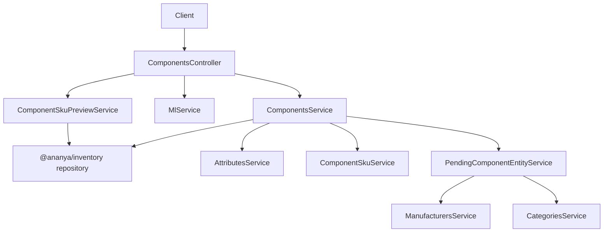
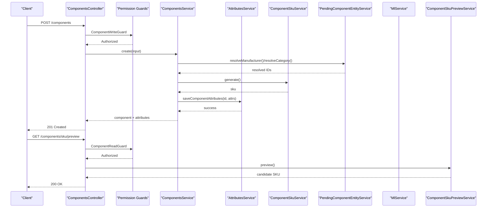
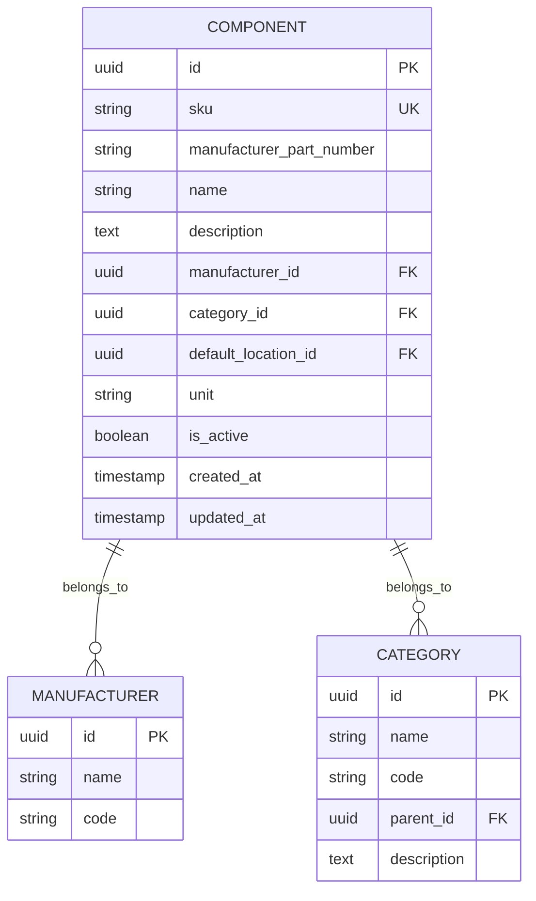
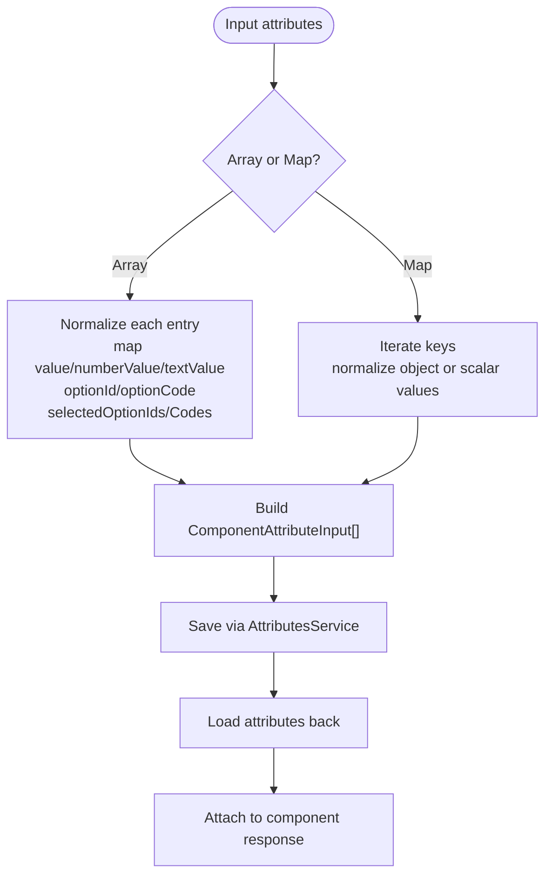
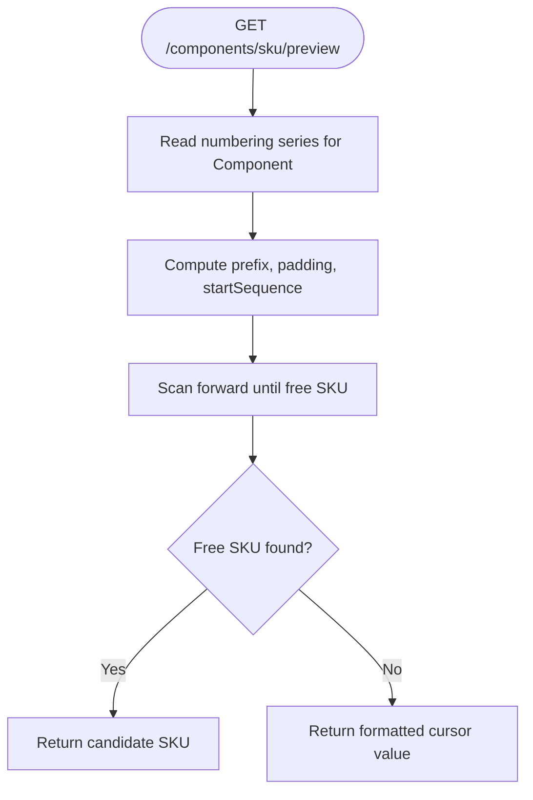
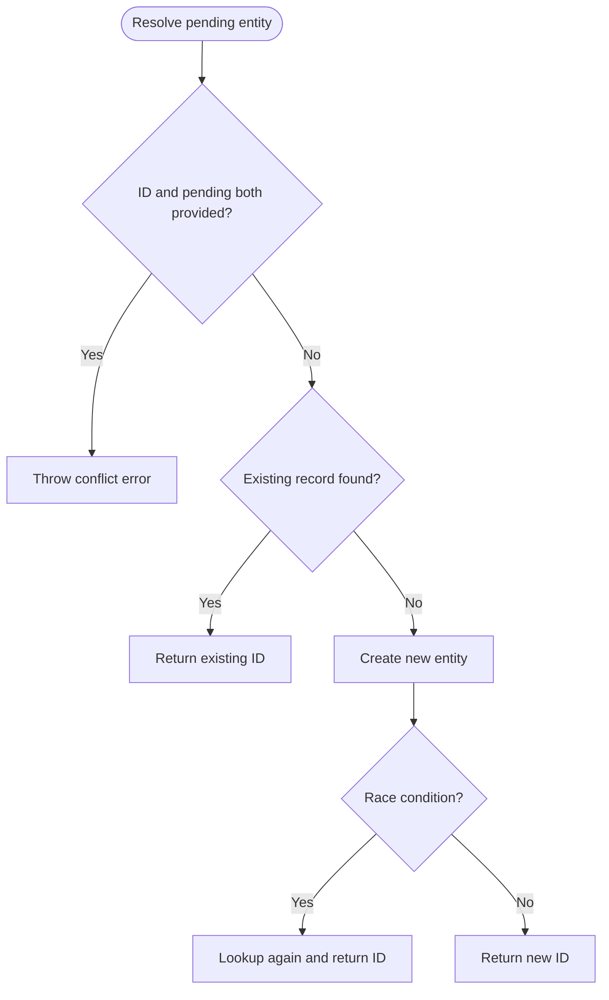
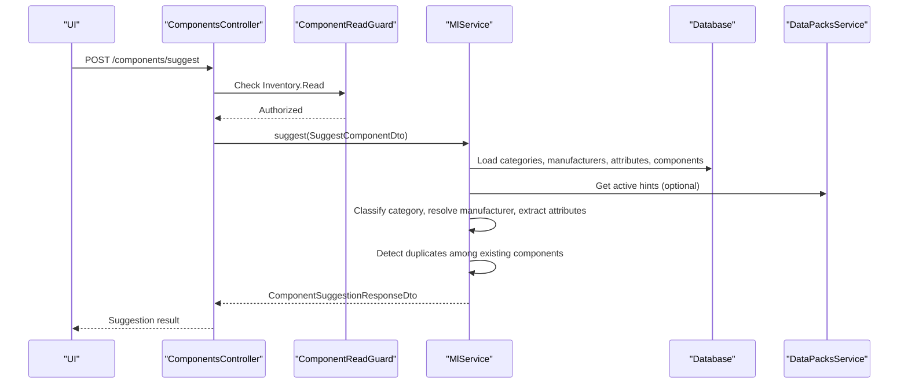
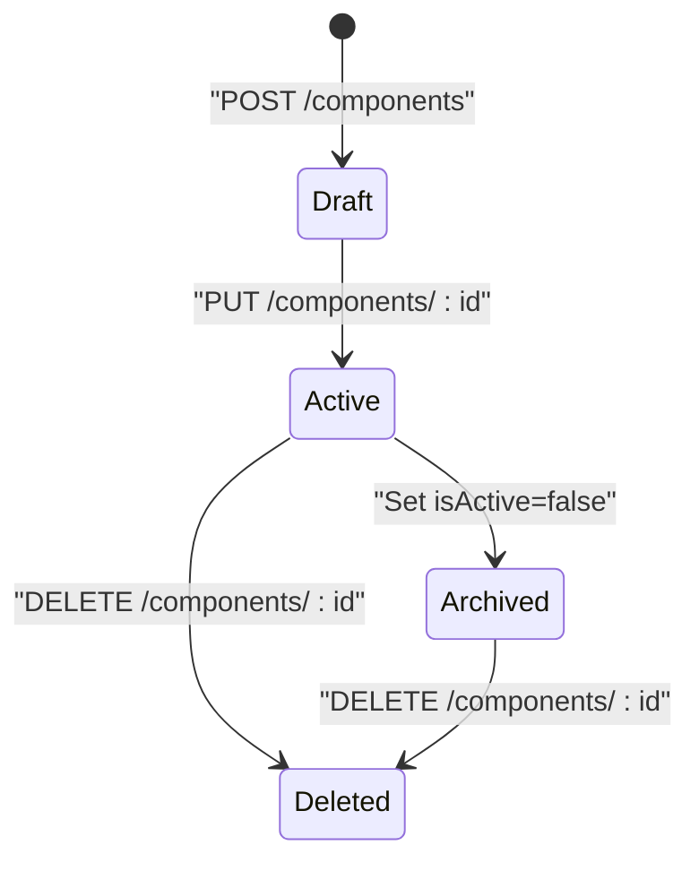
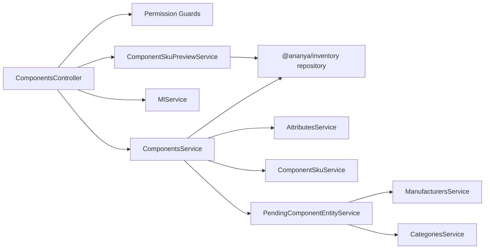

# Component Management

<cite>
**Referenced Files in This Document**
- [components.controller.ts](file://apps/api/src/components/components.controller.ts)
- [components.service.ts](file://apps/api/src/components/components.service.ts)
- [create-component.dto.ts](file://apps/api/src/components/create-component.dto.ts)
- [update-component.dto.ts](file://apps/api/src/components/update-component.dto.ts)
- [component-sku-preview.service.ts](file://apps/api/src/components/component-sku-preview.service.ts)
- [component-sku-allocation.ts](file://apps/api/src/components/component-sku-allocation.ts)
- [component-sku.service.ts](file://apps/api/src/components/component-sku.service.ts)
- [pending-component-entity.service.ts](file://apps/api/src/components/pending-component-entity.service.ts)
- [pending-component-entity.errors.ts](file://apps/api/src/components/pending-component-entity.errors.ts)
- [component-permissions.ts](file://apps/api/src/auth/component-permissions.ts)
- [ml.service.ts](file://apps/api/src/ml/ml.service.ts)
- [dtos.ts](file://apps/api/src/ml/dtos.ts)
- [component-exception.filter.ts](file://apps/api/src/components/component-exception.filter.ts)
</cite>

## Table of Contents
1. [Introduction](#introduction)
2. [Project Structure](#project-structure)
3. [Core Components](#core-components)
4. [Architecture Overview](#architecture-overview)
5. [Detailed Component Analysis](#detailed-component-analysis)
6. [Dependency Analysis](#dependency-analysis)
7. [Performance Considerations](#performance-considerations)
8. [Troubleshooting Guide](#troubleshooting-guide)
9. [Conclusion](#conclusion)

## Introduction
This document explains Ananya ERP’s Component Management system. It covers the component data model, SKU generation and preview, attribute handling, the complete lifecycle from creation through update to deletion, ML-powered classification and duplicate detection, API endpoints, permission guards, integration with manufacturers and categories, and exception handling patterns. The goal is to make the system understandable for both developers and product users while remaining grounded in the actual implementation.

## Project Structure
The Component Management feature lives primarily under `apps/api/src/components`, with supporting pieces in authentication, ML, and shared inventory/database layers:

- Controller: HTTP endpoints and request guards.
- Service: Business logic, use cases, attribute persistence, and pending entity resolution.
- DTOs: Request validation for create and update operations.
- SKU subsystem: Allocation algorithm, generator, and read-only preview.
- Pending entities: On-the-fly manufacturer/category creation or lookup.
- Permissions: Read/write/delete guards.
- ML service: Classification, manufacturer suggestion, attribute intelligence, and duplicate warnings.
- Exception filter: Domain errors mapped to HTTP responses.

**Diagram sources**
- [components.controller.ts:65-142](file://apps/api/src/components/components.controller.ts#L65-L142)
- [components.service.ts:87-206](file://apps/api/src/components/components.service.ts#L87-L206)
- [component-sku-preview.service.ts:25-60](file://apps/api/src/components/component-sku-preview.service.ts#L25-L60)
- [component-sku.service.ts:10-47](file://apps/api/src/components/component-sku.service.ts#L10-L47)
- [pending-component-entity.service.ts:22-128](file://apps/api/src/components/pending-component-entity.service.ts#L22-L128)

**Section sources**
- [components.controller.ts:1-143](file://apps/api/src/components/components.controller.ts#L1-L143)
- [components.service.ts:1-207](file://apps/api/src/components/components.service.ts#L1-L207)

## Core Components
- ComponentsController: Exposes CRUD, SKU preview, suggestions, and feedback endpoints. All routes are guarded by role-based permissions.
- ComponentsService: Orchestrates create/update/delete, resolves pending manufacturers/categories, persists attributes, and returns components with their attributes.
- Create/Update DTOs: Validate input fields including optional SKU, part number, name, description, manufacturer/category references, unit, and attributes. They also support “pending” manufacturer/category payloads for on-demand creation.
- SKU subsystem:
  - ComponentSkuService: Generates a unique sequential SKU using the numbering series.
  - ComponentSkuPreviewService: Returns a safe preview of the next available SKU without reserving it.
  - component-sku-allocation.ts: Shared allocation algorithm that scans forward from the cursor until an unused SKU is found.
- PendingComponentEntityService: Resolves or creates manufacturers and categories when only partial information is provided.
- Permission guards: Enforce Inventory.Read, Inventory.Update, and Inventory.Delete across endpoints.
- ML integration: Suggest category, manufacturer, attributes, and duplicate warnings; record feedback.
- Exception filter: Maps domain errors to consistent HTTP error responses.

**Section sources**
- [components.controller.ts:33-64](file://apps/api/src/components/components.controller.ts#L33-L64)
- [components.service.ts:22-106](file://apps/api/src/components/components.service.ts#L22-L106)
- [create-component.dto.ts:11-94](file://apps/api/src/components/create-component.dto.ts#L11-L94)
- [update-component.dto.ts:12-90](file://apps/api/src/components/update-component.dto.ts#L12-L90)
- [component-sku-preview.service.ts:17-60](file://apps/api/src/components/component-sku-preview.service.ts#L17-L60)
- [component-sku-allocation.ts:3-68](file://apps/api/src/components/component-sku-allocation.ts#L3-L68)
- [component-sku.service.ts:10-47](file://apps/api/src/components/component-sku.service.ts#L10-L47)
- [pending-component-entity.service.ts:10-128](file://apps/api/src/components/pending-component-entity.service.ts#L10-L128)
- [component-permissions.ts:12-77](file://apps/api/src/auth/component-permissions.ts#L12-L77)
- [component-exception.filter.ts:23-70](file://apps/api/src/components/component-exception.filter.ts#L23-L70)

## Architecture Overview
The controller layer enforces security and delegates to services. Services encapsulate business rules and coordinate repositories, external services, and cross-cutting concerns like attributes and SKU management. The ML service provides intelligent suggestions and duplicate detection, while the SKU subsystem ensures stable, conflict-free identifiers.

**Diagram sources**
- [components.controller.ts:74-112](file://apps/api/src/components/components.controller.ts#L74-L112)
- [components.service.ts:108-142](file://apps/api/src/components/components.service.ts#L108-L142)
- [component-sku.service.ts:12-46](file://apps/api/src/components/component-sku.service.ts#L12-L46)
- [component-sku-preview.service.ts:32-59](file://apps/api/src/components/component-sku-preview.service.ts#L32-L59)
- [pending-component-entity.service.ts:29-84](file://apps/api/src/components/pending-component-entity.service.ts#L29-L84)

## Detailed Component Analysis

### Component Data Model
A component represents a catalog item with identity, classification, and extensible attributes:

- Identity and classification:
  - id: internal identifier.
  - sku: unique, sequentially generated code (e.g., CMP-000001).
  - manufacturerPartNumber: supplier-facing part number.
  - name: human-readable title.
  - description: optional details.
  - manufacturerId: reference to a manufacturer.
  - categoryId: reference to a category.
  - defaultLocationId: optional default storage location.
  - unit: unit of measure.
  - isActive: logical status flag.
  - created_at/updated_at: timestamps.
- Attributes:
  - Stored separately and attached to components at runtime.
  - Support multiple value types, units, options, and multi-select values.
  - Validated against attribute definitions.

Database constraints visible in schema snapshots include a unique index on `sku` and indexes on `manufacturer_id` and `category_id`.

**Diagram sources**
- [components.service.ts:108-142](file://apps/api/src/components/components.service.ts#L108-L142)
- [create-component.dto.ts:44-94](file://apps/api/src/components/create-component.dto.ts#L44-L94)
- [update-component.dto.ts:45-90](file://apps/api/src/components/update-component.dto.ts#L45-L90)

**Section sources**
- [components.service.ts:108-206](file://apps/api/src/components/components.service.ts#L108-L206)
- [create-component.dto.ts:44-94](file://apps/api/src/components/create-component.dto.ts#L44-L94)
- [update-component.dto.ts:45-90](file://apps/api/src/components/update-component.dto.ts#L45-L90)

### Attribute Handling
Attributes can be supplied as either:
- A map keyed by attribute code.
- An array of attribute entries.

Normalization supports flexible shapes:
- Direct `value`, numeric `numberValue`, or textual `textValue`.
- Option selection via `optionId`/`optionCode` or multi-select arrays.
- Unit association where applicable.

After creating or updating a component, attributes are persisted and returned alongside the component payload.

**Diagram sources**
- [components.service.ts:22-85](file://apps/api/src/components/components.service.ts#L22-L85)
- [components.service.ts:128-141](file://apps/api/src/components/components.service.ts#L128-L141)
- [components.service.ts:168-176](file://apps/api/src/components/components.service.ts#L168-L176)

**Section sources**
- [components.service.ts:22-85](file://apps/api/src/components/components.service.ts#L22-L85)
- [components.service.ts:128-176](file://apps/api/src/components/components.service.ts#L128-L176)

### SKU Generation and Preview
- Generation:
  - Uses a database-backed numbering series per entity type.
  - Atomically increments the sequence and formats the SKU with prefix and zero-padding.
- Preview:
  - Reads the current cursor and scans forward to find the first free SKU.
  - Does not reserve the number; callers may still pick a different path.
  - Falls back to formatting the raw cursor if all candidates within the attempt limit are taken.

**Diagram sources**
- [component-sku-preview.service.ts:32-59](file://apps/api/src/components/component-sku-preview.service.ts#L32-L59)
- [component-sku-allocation.ts:31-68](file://apps/api/src/components/component-sku-allocation.ts#L31-L68)

**Section sources**
- [component-sku.service.ts:12-46](file://apps/api/src/components/component-sku.service.ts#L12-L46)
- [component-sku-preview.service.ts:17-60](file://apps/api/src/components/component-sku-preview.service.ts#L17-L60)
- [component-sku-allocation.ts:3-68](file://apps/api/src/components/component-sku-allocation.ts#L3-L68)

### Pending Manufacturer and Category Resolution
When a client does not have an existing manufacturer or category ID, it can provide “pending” metadata:
- For manufacturers: name and optional code.
- For categories: name, optional code, optional parent, and optional description.

Resolution logic:
- Rejects providing both an ID and a pending payload simultaneously.
- Looks up existing records by normalized name/code.
- Creates new records if none exist, with race-condition protection.
- Normalizes codes and trims inputs.

**Diagram sources**
- [pending-component-entity.service.ts:29-84](file://apps/api/src/components/pending-component-entity.service.ts#L29-L84)
- [pending-component-entity.errors.ts:3-15](file://apps/api/src/components/pending-component-entity.errors.ts#L3-L15)

**Section sources**
- [pending-component-entity.service.ts:10-128](file://apps/api/src/components/pending-component-entity.service.ts#L10-L128)
- [pending-component-entity.errors.ts:1-16](file://apps/api/src/components/pending-component-entity.errors.ts#L1-L16)

### ML-Powered Suggestions and Duplicate Detection
The ML service integrates with the component workflow to:
- Classify components into ERP categories.
- Resolve or propose manufacturers.
- Suggest relevant attributes and values with evidence.
- Detect potential duplicates among existing components.
- Record reviewer feedback for model improvement.

Key behaviors:
- If the ML microservice is enabled, it receives query, part number, description, datasheet content, existing components, ERP manufacturers, ERP categories, and data pack hints.
- Category resolution maps ML output to ERP categories, preserving hierarchy and path.
- Manufacturer resolution uses ML output or deterministic fallbacks based on data packs and ERP records.
- Duplicate detection excludes the component being edited and compares against a bounded, ordered set of stored components.
- Feedback recording uses the authenticated user, not the request body.

**Diagram sources**
- [components.controller.ts:74-80](file://apps/api/src/components/components.controller.ts#L74-L80)
- [ml.service.ts:313-452](file://apps/api/src/ml/ml.service.ts#L313-L452)
- [ml.service.ts:454-670](file://apps/api/src/ml/ml.service.ts#L454-L670)
- [ml.service.ts:672-800](file://apps/api/src/ml/ml.service.ts#L672-L800)

**Section sources**
- [ml.service.ts:313-800](file://apps/api/src/ml/ml.service.ts#L313-L800)
- [dtos.ts:21-70](file://apps/api/src/ml/dtos.ts#L21-L70)

### API Endpoints
All endpoints are protected by guards:

- POST /components/suggest
  - Guard: ComponentReadGuard (Inventory.Read)
  - Purpose: Request ML-powered classification, manufacturer suggestion, attribute suggestions, and duplicate warnings.
- GET /components/sku/preview
  - Guard: ComponentReadGuard (Inventory.Read)
  - Purpose: Preview the next available SKU without reservation.
- POST /components/suggest/feedback
  - Guard: ComponentWriteGuard (Inventory.Update)
  - Purpose: Record AI suggestion feedback tied to the authenticated user.
- POST /components
  - Guard: ComponentWriteGuard (Inventory.Update)
  - Purpose: Create a component with optional attributes and pending manufacturer/category.
- GET /components
  - Guard: ComponentReadGuard (Inventory.Read)
  - Purpose: List components with attributes.
- GET /components/:id
  - Guard: ComponentReadGuard (Inventory.Read)
  - Purpose: Retrieve a single component with attributes.
- PUT /components/:id
  - Guard: ComponentWriteGuard (Inventory.Update)
  - Purpose: Update a component and its attributes.
- DELETE /components/:id
  - Guard: ComponentDeleteGuard (Inventory.Delete)
  - Purpose: Delete a component.

**Section sources**
- [components.controller.ts:33-64](file://apps/api/src/components/components.controller.ts#L33-L64)
- [components.controller.ts:74-141](file://apps/api/src/components/components.controller.ts#L74-L141)

### Lifecycle: Creation, Updates, Deletion
- Creation:
  - Validates input DTO.
  - Resolves manufacturer/category (existing or pending).
  - Generates SKU via ComponentSkuService.
  - Persists attributes via AttributesService.
  - Returns component with attributes.
- Update:
  - Resolves manufacturer/category (existing or pending).
  - Applies updates.
  - Persists attributes if provided.
  - Returns component with attributes.
- Deletion:
  - Requires explicit delete permission.
  - Executes domain delete use case.

**Diagram sources**
- [components.controller.ts:106-141](file://apps/api/src/components/components.controller.ts#L106-L141)
- [components.service.ts:108-181](file://apps/api/src/components/components.service.ts#L108-L181)

**Section sources**
- [components.controller.ts:106-141](file://apps/api/src/components/components.controller.ts#L106-L141)
- [components.service.ts:108-181](file://apps/api/src/components/components.service.ts#L108-L181)

### Practical Examples

- Creating a component with complex attributes:
  - Provide name, unit, and attributes as either a map or array.
  - Optionally supply pendingManufacturer or pendingCategory if IDs are unknown.
  - The service normalizes attributes, persists them, and returns them with the component.

- Handling component suggestions:
  - Call POST /components/suggest with query, optional partNumber, description, datasheetText, and datasheetPdfBase64.
  - Use categoryId in the request to condition attribute relevance on the selected category.
  - Review suggested category, manufacturer, attributes, and duplicate warnings.

- Managing component versions:
  - Use PUT /components/:id to update fields such as name, description, manufacturer/category, unit, isActive, and attributes.
  - Attributes are merged according to the normalization rules.

- Using SKU preview:
  - Call GET /components/sku/preview to obtain a candidate SKU before saving.
  - Remember this is a preview, not a reservation.

**Section sources**
- [create-component.dto.ts:44-94](file://apps/api/src/components/create-component.dto.ts#L44-L94)
- [update-component.dto.ts:45-90](file://apps/api/src/components/update-component.dto.ts#L45-L90)
- [components.controller.ts:74-135](file://apps/api/src/components/components.controller.ts#L74-L135)
- [components.service.ts:108-176](file://apps/api/src/components/components.service.ts#L108-L176)
- [component-sku-preview.service.ts:32-59](file://apps/api/src/components/component-sku-preview.service.ts#L32-L59)

## Dependency Analysis
The following diagram shows how controllers, services, and external systems interact:

**Diagram sources**
- [components.controller.ts:65-142](file://apps/api/src/components/components.controller.ts#L65-L142)
- [components.service.ts:87-206](file://apps/api/src/components/components.service.ts#L87-L206)
- [component-sku-preview.service.ts:25-60](file://apps/api/src/components/component-sku-preview.service.ts#L25-L60)
- [component-sku.service.ts:10-47](file://apps/api/src/components/component-sku.service.ts#L10-L47)
- [pending-component-entity.service.ts:22-128](file://apps/api/src/components/pending-component-entity.service.ts#L22-L128)

**Section sources**
- [components.controller.ts:65-142](file://apps/api/src/components/components.controller.ts#L65-L142)
- [components.service.ts:87-206](file://apps/api/src/components/components.service.ts#L87-L206)

## Performance Considerations
- ML suggestion endpoint reads categories, manufacturers, attributes, and components in parallel and limits duplicate candidates to a named bound to avoid unbounded payloads.
- Duplicate detection orders candidates oldest-first so canonical records remain in scope even when truncated.
- SKU preview scans forward from the cursor and caps attempts to prevent excessive lookups.
- Attribute normalization avoids unnecessary work by skipping null/undefined values.

[No sources needed since this section provides general guidance]

## Troubleshooting Guide
Common issues and their handling:

- Duplicate SKU:
  - Error: ComponentSkuAlreadyExistsError
  - Response: 409 Conflict
- Invalid pending entity:
  - Errors: InvalidPendingComponentEntityError, PendingComponentEntityConflictError
  - Response: 400 Bad Request
- Missing component:
  - Error: ComponentNotFoundError
  - Response: 404 Not Found
- Validation failures:
  - Errors: InvalidComponentSkuError, InvalidComponentNameError, InvalidUnitError, AttributeDefinitionNotFoundError, AttributeValueValidationError
  - Response: 400 Bad Request
- Default location missing:
  - Error: DefaultLocationNotFoundError
  - Response: 400 Bad Request

The ComponentExceptionFilter centralizes these mappings so clients receive consistent error structures.

**Section sources**
- [component-exception.filter.ts:23-70](file://apps/api/src/components/component-exception.filter.ts#L23-L70)
- [pending-component-entity.errors.ts:3-15](file://apps/api/src/components/pending-component-entity.errors.ts#L3-L15)

## Conclusion
Ananya ERP’s Component Management system combines robust CRUD operations, flexible attribute modeling, reliable SKU management, and intelligent ML-driven assistance. Security is enforced through fine-grained permission guards, and exceptions are consistently handled. The design supports both manual workflows and automated intelligence, making it suitable for growing catalogs with complex specifications and evolving classification needs.