# Inventory Management

<cite>
**Referenced Files in This Document**
- [0002-inventory-domain-model.md](file://docs/rfcs/0002-inventory-domain-model.md)
- [0005-transaction-types.md](file://docs/rfcs/0005-transaction-types.md)
- [0007-batch-and-serial-tracking.md](file://docs/rfcs/0007-batch-and-serial-tracking.md)
- [0008-inventory-reservations.md](file://docs/rfcs/0008-inventory-reservations.md)
- [index.ts](file://packages/inventory/src/index.ts)
- [component.ts](file://packages/inventory/src/components/component.ts)
- [manufacturer.ts](file://packages/inventory/src/manufacturers/manufacturer.ts)
- [category.ts](file://packages/inventory/src/categories/category.ts)
- [inventory-transaction.ts](file://packages/inventory/src/ledger/inventory-transaction.ts)
- [transaction-types.ts](file://packages/inventory/src/ledger/transaction-types.ts)
- [create-inventory-transaction.ts](file://packages/inventory/src/ledger/create-inventory-transaction.ts)
- [reservation.ts](file://packages/inventory/src/reservations/reservation.ts)
- [reservation.types.ts](file://packages/inventory/src/reservations/reservation.types.ts)
- [batch.ts](file://packages/inventory/src/batches/batch.ts)
- [serial.ts](file://packages/inventory/src/serials/serial.ts)
- [attribute-definition.ts](file://packages/inventory/src/attributes/attribute-definition.ts)
- [components.service.ts](file://apps/api/src/components/components.service.ts)
- [create-component.dto.ts](file://apps/api/src/components/create-component.dto.ts)
- [component-form.tsx](file://apps/web/components/components/component-form.tsx)
- [inventory-transactions.service.ts](file://apps/api/src/inventory-transactions/inventory-transactions.service.ts)
</cite>

## Table of Contents
1. [Introduction](#introduction)
2. [Project Structure](#project-structure)
3. [Core Components](#core-components)
4. [Architecture Overview](#architecture-overview)
5. [Detailed Component Analysis](#detailed-component-analysis)
6. [Dependency Analysis](#dependency-analysis)
7. [Performance Considerations](#performance-considerations)
8. [Troubleshooting Guide](#troubleshooting-guide)
9. [Conclusion](#conclusion)
10. [Appendices](#appendices)

## Introduction
This document explains Ananya ERP’s Inventory Management domain. It covers the inventory data model, component management, manufacturer and category organization, stock transactions, reservations, batch tracking, serial number tracking, attributes, and traceability workflows. The documentation is designed for both technical and non-technical readers and maps directly to the repository’s domain package, API layer, and web interface.

The inventory domain follows a clear separation between catalog definitions and transactional history:
- Catalog data defines what items exist.
- Transactions record immutable business events.
- Derived projections represent current inventory positions.
- Reservations temporarily allocate inventory without moving it.
- Batch and serial numbers extend traceability where required.

**Section sources**
- [0002-inventory-domain-model.md:11-29](file://docs/rfcs/0002-inventory-domain-model.md#L11-L29)
- [0002-inventory-domain-model.md:126-157](file://docs/rfcs/0002-inventory-domain-model.md#L126-L157)
- [0002-inventory-domain-model.md:242-291](file://docs/rfcs/0002-inventory-domain-model.md#L242-L291)

## Project Structure
The inventory domain is implemented as a focused package with clear subdomains:
- Reference data: manufacturers, categories, units, locations.
- Catalog data: components and attributes.
- Transactional data: inventory ledger and transaction types.
- Traceability: batches and serial numbers.
- Allocation: reservations.
- Derived state: inventory projections.

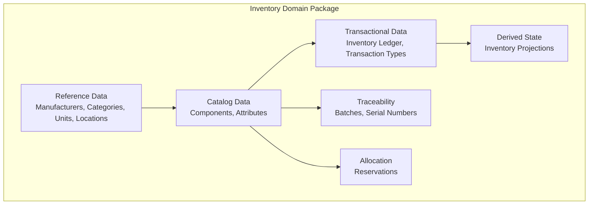

**Diagram sources**
- [index.ts:1-12](file://packages/inventory/src/index.ts#L1-L12)
- [0002-inventory-domain-model.md:159-210](file://docs/rfcs/0002-inventory-domain-model.md#L159-L210)

**Section sources**
- [index.ts:1-12](file://packages/inventory/src/index.ts#L1-L12)
- [0002-inventory-domain-model.md:159-210](file://docs/rfcs/0002-inventory-domain-model.md#L159-L210)

## Core Components
This section summarizes the core inventory entities and their responsibilities.

| Entity | Purpose | Key Properties | Important Rules |
|---|---|---:|---|
| Manufacturer | Identifies who manufactured an item | code, name, isActive | Code and name are required; normalization includes uppercase code. |
| Category | Organizes components into logical groups | code, name, description, parentId, isActive | Prevents self-parenting; code and name are required. |
| Component | Defines what an item is | sku, name, manufacturerId, categoryId, unit, defaultLocationId, isActive, consolidation fields | SKU and name are required; consolidated components cannot receive new transactions or edits. |
| AttributeDefinition | Defines reusable attribute metadata | code, name, dataType, unitCategory, defaultUnit, isFilterable, sortOrder, validationRules, aliases, groupName | Validates allowed data types; supports filtering and grouping. |
| InventoryTransaction | Immutable record of inventory movement | componentId, quantity, unitOfMeasure, sourceLocationId, destinationLocationId, transactionType, reference, reason, createdBy, createdAt | Quantity must be positive; transaction type must be canonical; location rules depend on type. |
| Reservation | Temporary allocation of inventory | reservationNumber, reservationType, lines, reservedBy, status, expiresAt | Does not move inventory; only Active reservations affect availability. |
| Batch | Groups interchangeable inventory by production/receipt lot | componentId, batchNumber, manufacturingDate, expiryDate, supplierBatchNumber | Batch number and componentId are required; can be reassigned during consolidation. |
| Serial | Uniquely identifies one physical item | componentId, serialNumber, locationId | Serial number and componentId are required; can be reassigned during consolidation. |

**Section sources**
- [manufacturer.ts:7-25](file://packages/inventory/src/manufacturers/manufacturer.ts#L7-L25)
- [manufacturer.ts:48-72](file://packages/inventory/src/manufacturers/manufacturer.ts#L48-L72)
- [category.ts:8-32](file://packages/inventory/src/categories/category.ts#L8-L32)
- [category.ts:58-84](file://packages/inventory/src/categories/category.ts#L58-L84)
- [category.ts:89-118](file://packages/inventory/src/categories/category.ts#L89-L118)
- [component.ts:26-42](file://packages/inventory/src/components/component.ts#L26-L42)
- [component.ts:117-155](file://packages/inventory/src/components/component.ts#L117-L155)
- [component.ts:174-218](file://packages/inventory/src/components/component.ts#L174-L218)
- [component.ts:232-265](file://packages/inventory/src/components/component.ts#L232-L265)
- [component.ts:275-314](file://packages/inventory/src/components/component.ts#L275-L314)
- [attribute-definition.ts:29-45](file://packages/inventory/src/attributes/attribute-definition.ts#L29-L45)
- [attribute-definition.ts:110-151](file://packages/inventory/src/attributes/attribute-definition.ts#L110-L151)
- [inventory-transaction.ts:22-47](file://packages/inventory/src/ledger/inventory-transaction.ts#L22-L47)
- [inventory-transaction.ts:53-156](file://packages/inventory/src/ledger/inventory-transaction.ts#L53-L156)
- [reservation.ts:16-41](file://packages/inventory/src/reservations/reservation.ts#L16-L41)
- [reservation.ts:47-72](file://packages/inventory/src/reservations/reservation.ts#L47-L72)
- [reservation.types.ts:1-8](file://packages/inventory/src/reservations/reservation.types.ts#L1-L8)
- [reservation.types.ts:13-24](file://packages/inventory/src/reservations/reservation.types.ts#L13-L24)
- [batch.ts:3-11](file://packages/inventory/src/batches/batch.ts#L3-L11)
- [batch.ts:40-60](file://packages/inventory/src/batches/batch.ts#L40-L60)
- [serial.ts:3-9](file://packages/inventory/src/serials/serial.ts#L3-L9)
- [serial.ts:32-50](file://packages/inventory/src/serials/serial.ts#L32-L50)

## Architecture Overview
The inventory architecture separates concerns across layers:
- Web UI collects user input and validates forms.
- API controllers and services orchestrate use cases.
- Domain aggregates enforce business rules.
- Repositories persist data.
- RFCs define stable domain vocabulary and principles.

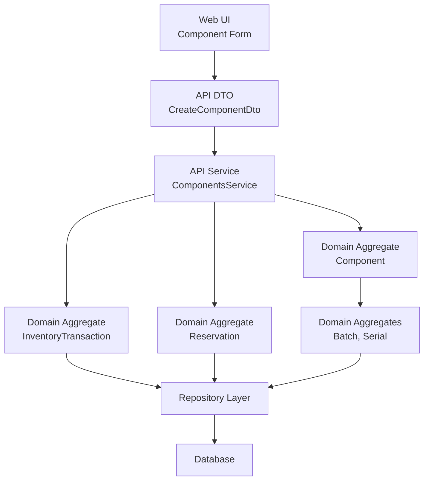

**Diagram sources**
- [component-form.tsx:73-90](file://apps/web/components/components/component-form.tsx#L73-L90)
- [create-component.dto.ts:44-94](file://apps/api/src/components/create-component.dto.ts#L44-L94)
- [components.service.ts:93-126](file://apps/api/src/components/components.service.ts#L93-L126)
- [component.ts:77-155](file://packages/inventory/src/components/component.ts#L77-L155)
- [inventory-transaction.ts:22-156](file://packages/inventory/src/ledger/inventory-transaction.ts#L22-L156)
- [reservation.ts:16-72](file://packages/inventory/src/reservations/reservation.ts#L16-L72)
- [batch.ts:21-60](file://packages/inventory/src/batches/batch.ts#L21-L60)
- [serial.ts:17-50](file://packages/inventory/src/serials/serial.ts#L17-L50)

**Section sources**
- [0002-inventory-domain-model.md:242-291](file://docs/rfcs/0002-inventory-domain-model.md#L242-L291)
- [component-form.tsx:73-90](file://apps/web/components/components/component-form.tsx#L73-L90)
- [create-component.dto.ts:44-94](file://apps/api/src/components/create-component.dto.ts#L44-L94)
- [components.service.ts:93-126](file://apps/api/src/components/components.service.ts#L93-L126)

## Detailed Component Analysis

### Component Management
Components are catalog definitions, not inventory balances. They capture identity, classification, measurement, and lifecycle state. Consolidation allows merging duplicate components while preserving historical integrity.

Key behaviors:
- Creation requires SKU, name, and unit.
- Updates preserve invariants and reject changes to consolidated components.
- Consolidation marks a component as retired and points to a canonical replacement.
- Consolidated components cannot receive new transactions or master-data edits.

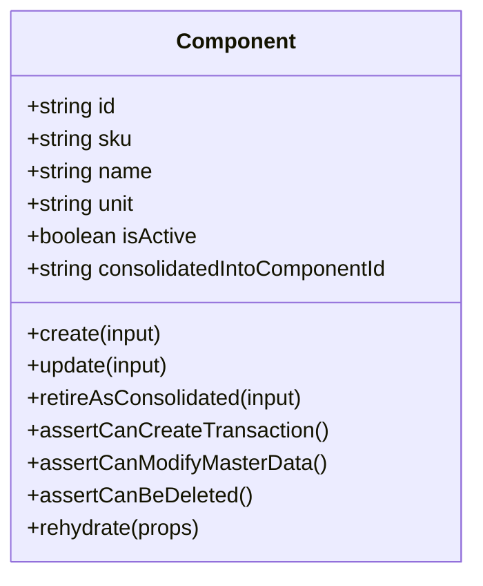

**Diagram sources**
- [component.ts:77-155](file://packages/inventory/src/components/component.ts#L77-L155)
- [component.ts:174-218](file://packages/inventory/src/components/component.ts#L174-L218)
- [component.ts:232-265](file://packages/inventory/src/components/component.ts#L232-L265)
- [component.ts:275-314](file://packages/inventory/src/components/component.ts#L275-L314)

Practical example: creating a component with attributes
- The web form validates component fields such as SKU, name, unit, manufacturer, category, and optional attributes.
- The API DTO accepts pending manufacturer and category creation alongside existing references.
- The API service resolves pending entities before invoking the domain create use case.

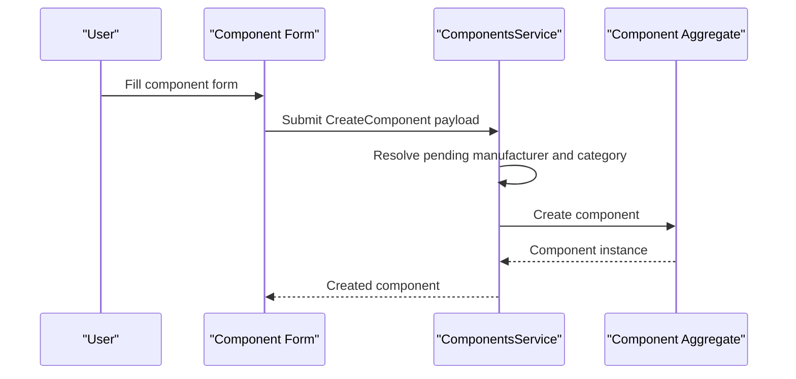

**Diagram sources**
- [component-form.tsx:73-90](file://apps/web/components/components/component-form.tsx#L73-L90)
- [create-component.dto.ts:44-94](file://apps/api/src/components/create-component.dto.ts#L44-L94)
- [components.service.ts:108-126](file://apps/api/src/components/components.service.ts#L108-L126)
- [component.ts:117-155](file://packages/inventory/src/components/component.ts#L117-L155)

**Section sources**
- [component.ts:77-155](file://packages/inventory/src/components/component.ts#L77-L155)
- [component.ts:174-218](file://packages/inventory/src/components/component.ts#L174-L218)
- [component.ts:232-265](file://packages/inventory/src/components/component.ts#L232-L265)
- [component.ts:275-314](file://packages/inventory/src/components/component.ts#L275-L314)
- [component-form.tsx:73-90](file://apps/web/components/components/component-form.tsx#L73-L90)
- [create-component.dto.ts:44-94](file://apps/api/src/components/create-component.dto.ts#L44-L94)
- [components.service.ts:108-126](file://apps/api/src/components/components.service.ts#L108-L126)

### Manufacturer Tracking
Manufacturers are reference data that identify the producer of a component. They are independent from suppliers and may overlap when a manufacturer also supplies parts.

Key behaviors:
- Creation requires code and name.
- Code is normalized to uppercase.
- Updates validate required fields and preserve timestamps.

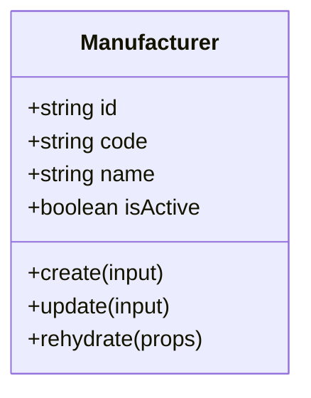

**Diagram sources**
- [manufacturer.ts:7-25](file://packages/inventory/src/manufacturers/manufacturer.ts#L7-L25)
- [manufacturer.ts:48-72](file://packages/inventory/src/manufacturers/manufacturer.ts#L48-L72)
- [manufacturer.ts:77-98](file://packages/inventory/src/manufacturers/manufacturer.ts#L77-L98)

**Section sources**
- [manufacturer.ts:7-25](file://packages/inventory/src/manufacturers/manufacturer.ts#L7-L25)
- [manufacturer.ts:48-72](file://packages/inventory/src/manufacturers/manufacturer.ts#L48-L72)
- [manufacturer.ts:77-98](file://packages/inventory/src/manufacturers/manufacturer.ts#L77-L98)

### Category Organization
Categories classify components and support hierarchical organization through parent-child relationships.

Key behaviors:
- Creation requires code and name.
- Parent ID is optional but cannot point to itself.
- Updates normalize values and enforce invariants.

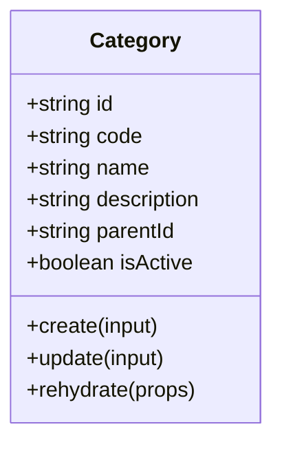

**Diagram sources**
- [category.ts:8-32](file://packages/inventory/src/categories/category.ts#L8-L32)
- [category.ts:58-84](file://packages/inventory/src/categories/category.ts#L58-L84)
- [category.ts:89-118](file://packages/inventory/src/categories/category.ts#L89-L118)

**Section sources**
- [category.ts:8-32](file://packages/inventory/src/categories/category.ts#L8-L32)
- [category.ts:58-84](file://packages/inventory/src/categories/category.ts#L58-L84)
- [category.ts:89-118](file://packages/inventory/src/categories/category.ts#L89-L118)

### Stock Transactions and Inventory Ledger
Inventory is derived from immutable transactions. Each transaction records why inventory moved, which component was affected, how much moved, and where it moved.

Canonical transaction types include Receipt, Issue, Transfer, Adjustment, Return, Consumption, Production, ManualCorrection, and InitialStock.

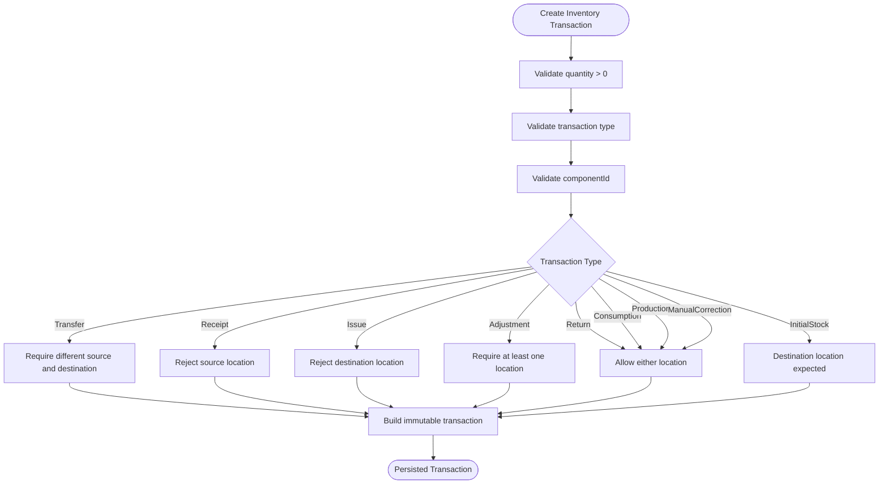

**Diagram sources**
- [inventory-transaction.ts:53-156](file://packages/inventory/src/ledger/inventory-transaction.ts#L53-L156)
- [transaction-types.ts:1-26](file://packages/inventory/src/ledger/transaction-types.ts#L1-L26)

Practical example: recording stock movements
- The API service checks that the component is usable for new activity before creating a transaction.
- The domain factory validates and constructs an immutable transaction.
- The repository persists the transaction.

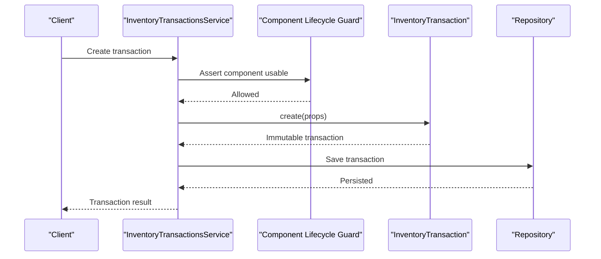

**Diagram sources**
- [inventory-transactions.service.ts:19-32](file://apps/api/src/inventory-transactions/inventory-transactions.service.ts#L19-L32)
- [create-inventory-transaction.ts:1-8](file://packages/inventory/src/ledger/create-inventory-transaction.ts#L1-L8)
- [inventory-transaction.ts:53-156](file://packages/inventory/src/ledger/inventory-transaction.ts#L53-L156)

**Section sources**
- [0005-transaction-types.md:13-65](file://docs/rfcs/0005-transaction-types.md#L13-L65)
- [0005-transaction-types.md:66-151](file://docs/rfcs/0005-transaction-types.md#L66-L151)
- [transaction-types.ts:1-26](file://packages/inventory/src/ledger/transaction-types.ts#L1-L26)
- [inventory-transaction.ts:22-156](file://packages/inventory/src/ledger/inventory-transaction.ts#L22-L156)
- [create-inventory-transaction.ts:1-8](file://packages/inventory/src/ledger/create-inventory-transaction.ts#L1-L8)
- [inventory-transactions.service.ts:19-32](file://apps/api/src/inventory-transactions/inventory-transactions.service.ts#L19-L32)

### Reservations System
Reservations temporarily allocate inventory without changing ownership or physical stock. Available inventory is derived as On Hand minus Reserved.

Lifecycle states:
- Draft → Active → Fulfilled
- Draft → Active → Released
- Active → Expired
- Active → Cancelled (if allowed)

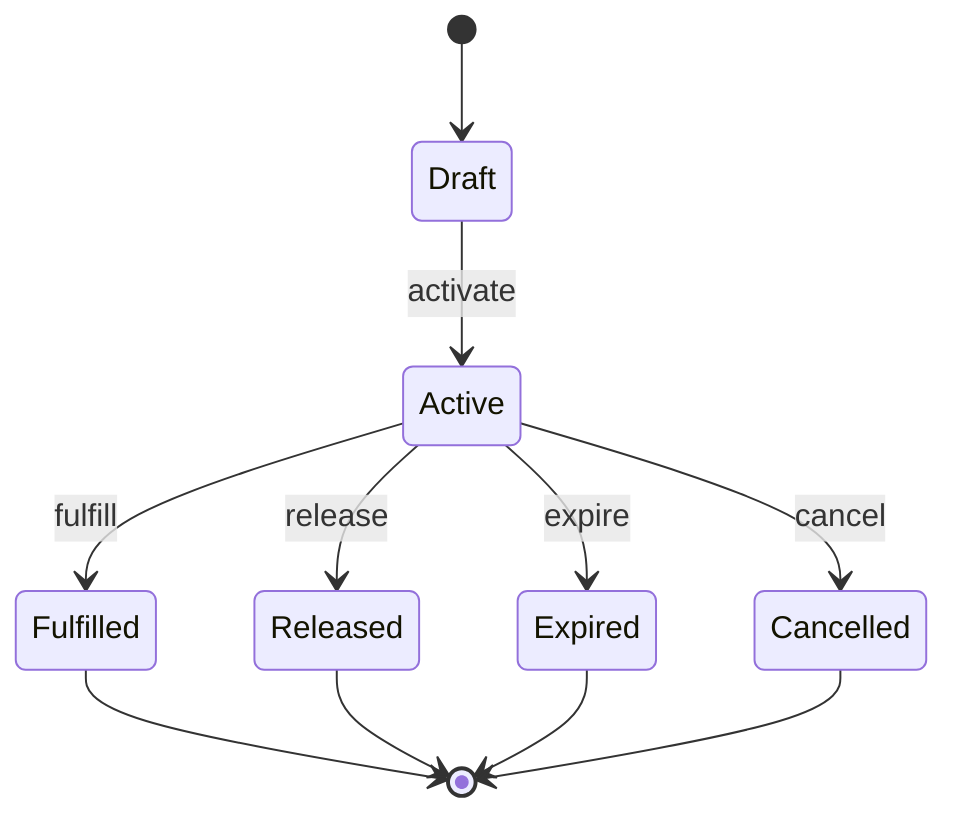

**Diagram sources**
- [reservation.types.ts:1-8](file://packages/inventory/src/reservations/reservation.types.ts#L1-L8)
- [reservation.ts:162-212](file://packages/inventory/src/reservations/reservation.ts#L162-L212)

Practical example: reserving inventory for a work order
- A reservation header includes reservation number, type, reference document, reservedBy, and optional expiry.
- Lines specify component, location, reserved quantity, fulfilled quantity, unit of measure, and notes.
- Only Active reservations affect available inventory.

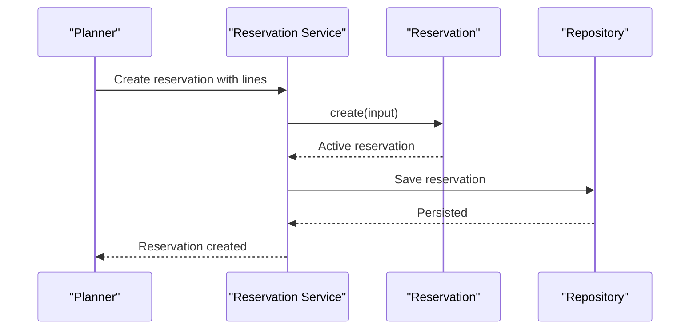

**Diagram sources**
- [reservation.ts:47-72](file://packages/inventory/src/reservations/reservation.ts#L47-L72)
- [reservation.types.ts:13-24](file://packages/inventory/src/reservations/reservation.types.ts#L13-L24)
- [0008-inventory-reservations.md:78-91](file://docs/rfcs/0008-inventory-reservations.md#L78-L91)

**Section sources**
- [0008-inventory-reservations.md:11-18](file://docs/rfcs/0008-inventory-reservations.md#L11-L18)
- [0008-inventory-reservations.md:37-76](file://docs/rfcs/0008-inventory-reservations.md#L37-L76)
- [0008-inventory-reservations.md:95-123](file://docs/rfcs/0008-inventory-reservations.md#L95-L123)
- [0008-inventory-reservations.md:125-186](file://docs/rfcs/0008-inventory-reservations.md#L125-L186)
- [reservation.ts:16-72](file://packages/inventory/src/reservations/reservation.ts#L16-L72)
- [reservation.ts:162-212](file://packages/inventory/src/reservations/reservation.ts#L162-L212)
- [reservation.types.ts:1-24](file://packages/inventory/src/reservations/reservation.types.ts#L1-L24)

### Batch and Serial Number Tracking
Traceability extends the inventory model based on component needs:
- None: quantity-only tracking.
- Batch: group interchangeable units by production or receipt lot.
- Serial: track each unique physical unit independently.

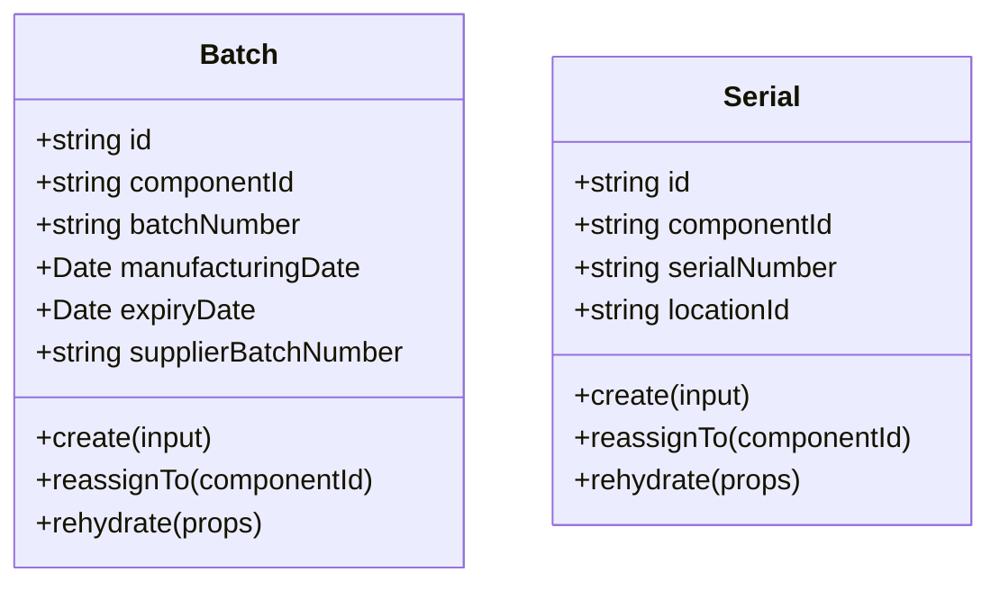

**Diagram sources**
- [batch.ts:3-11](file://packages/inventory/src/batches/batch.ts#L3-L11)
- [batch.ts:40-89](file://packages/inventory/src/batches/batch.ts#L40-L89)
- [serial.ts:3-9](file://packages/inventory/src/serials/serial.ts#L3-L9)
- [serial.ts:32-77](file://packages/inventory/src/serials/serial.ts#L32-L77)

Practical example: tracing product lineage
- For batch-tracked components, transactions carry batch information.
- For serial-tracked components, each serial moves independently through inventory.
- Both batch and serial records can be reassigned during component consolidation while preserving identity.

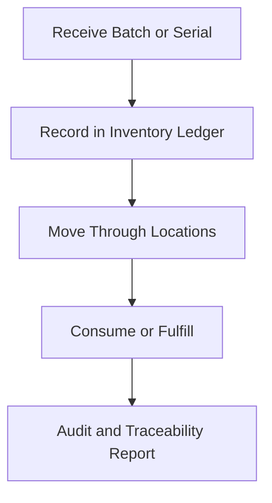

**Diagram sources**
- [0007-batch-and-serial-tracking.md:117-127](file://docs/rfcs/0007-batch-and-serial-tracking.md#L117-L127)
- [batch.ts:62-89](file://packages/inventory/src/batches/batch.ts#L62-L89)
- [serial.ts:52-77](file://packages/inventory/src/serials/serial.ts#L52-L77)

**Section sources**
- [0007-batch-and-serial-tracking.md:11-18](file://docs/rfcs/0007-batch-and-serial-tracking.md#L11-L18)
- [0007-batch-and-serial-tracking.md:37-85](file://docs/rfcs/0007-batch-and-serial-tracking.md#L37-L85)
- [0007-batch-and-serial-tracking.md:87-127](file://docs/rfcs/0007-batch-and-serial-tracking.md#L87-L127)
- [0007-batch-and-serial-tracking.md:129-159](file://docs/rfcs/0007-batch-and-serial-tracking.md#L129-L159)
- [batch.ts:21-89](file://packages/inventory/src/batches/batch.ts#L21-L89)
- [serial.ts:17-77](file://packages/inventory/src/serials/serial.ts#L17-L77)

### Attributes and Component Metadata
Attributes allow flexible metadata per component and per category. Attribute definitions define codes, names, data types, units, filtering, sorting, validation rules, aliases, and grouping.

Key behaviors:
- Validation enforces allowed data types.
- Normalization standardizes codes and names.
- Support for unit categories and default units enables consistent quantity-like attributes.

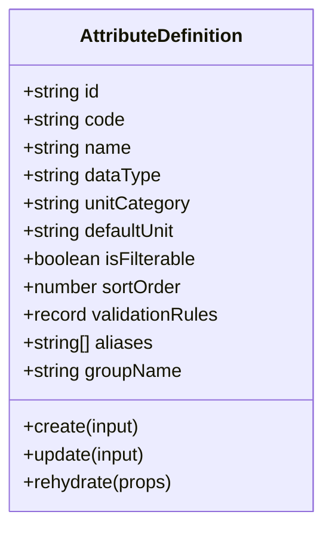

**Diagram sources**
- [attribute-definition.ts:29-45](file://packages/inventory/src/attributes/attribute-definition.ts#L29-L45)
- [attribute-definition.ts:110-151](file://packages/inventory/src/attributes/attribute-definition.ts#L110-L151)
- [attribute-definition.ts:153-204](file://packages/inventory/src/attributes/attribute-definition.ts#L153-L204)

**Section sources**
- [attribute-definition.ts:8-16](file://packages/inventory/src/attributes/attribute-definition.ts#L8-L16)
- [attribute-definition.ts:29-45](file://packages/inventory/src/attributes/attribute-definition.ts#L29-L45)
- [attribute-definition.ts:110-151](file://packages/inventory/src/attributes/attribute-definition.ts#L110-L151)
- [attribute-definition.ts:153-204](file://packages/inventory/src/attributes/attribute-definition.ts#L153-L204)

## Dependency Analysis
The inventory domain has clear dependencies:
- API layer depends on domain aggregates and repositories.
- Domain aggregates are framework-independent and enforce invariants.
- Web UI depends on API contracts and forms.
- RFCs provide stable domain vocabulary guiding implementation.

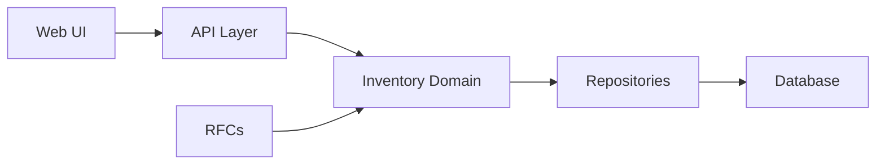

**Diagram sources**
- [component-form.tsx:73-90](file://apps/web/components/components/component-form.tsx#L73-L90)
- [create-component.dto.ts:44-94](file://apps/api/src/components/create-component.dto.ts#L44-L94)
- [components.service.ts:93-126](file://apps/api/src/components/components.service.ts#L93-L126)
- [0002-inventory-domain-model.md:242-291](file://docs/rfcs/0002-inventory-domain-model.md#L242-L291)

**Section sources**
- [index.ts:1-12](file://packages/inventory/src/index.ts#L1-L12)
- [0002-inventory-domain-model.md:242-291](file://docs/rfcs/0002-inventory-domain-model.md#L242-L291)

## Performance Considerations
- Inventory projections are derived from transactions and used for performance and reporting.
- Immutable transaction history avoids costly reconciliation but requires aggregation for current state.
- Reservations avoid overcommitting inventory without mutating inventory quantities.
- Batch and serial tracking add metadata to transactions; keep traceability selective to reduce overhead.

[No sources needed since this section provides general guidance]

## Troubleshooting Guide
Common issues and resolutions:
- Creating a transaction for a consolidated component fails because consolidated components cannot receive new activity.
- Updating a consolidated component fails because master data belongs to the canonical record.
- Invalid transaction type or missing required locations cause transaction creation to fail.
- Reservation lifecycle transitions are restricted; only Active reservations can be fulfilled, released, expired, or cancelled depending on state.
- Batch or serial reassignment requires checking uniqueness constraints before database enforcement.

Recommended checks:
- Verify component consolidation state before stock operations.
- Validate transaction type and location requirements.
- Ensure reservation status matches the intended transition.
- Use domain factories and aggregates rather than direct persistence for invariant-heavy operations.

**Section sources**
- [component.ts:275-314](file://packages/inventory/src/components/component.ts#L275-L314)
- [inventory-transaction.ts:53-156](file://packages/inventory/src/ledger/inventory-transaction.ts#L53-L156)
- [reservation.ts:162-212](file://packages/inventory/src/reservations/reservation.ts#L162-L212)
- [batch.ts:62-89](file://packages/inventory/src/batches/batch.ts#L62-L89)
- [serial.ts:52-77](file://packages/inventory/src/serials/serial.ts#L52-L77)

## Conclusion
Ananya ERP’s Inventory Management domain cleanly separates catalog definitions from immutable transaction history. Components describe items; transactions record movements; projections reflect current inventory; reservations allocate future usage; and batch and serial numbers provide traceability where needed. The design emphasizes invariant enforcement, workflow independence, and extensibility, making it suitable for procurement, manufacturing, sales, and service integrations.

[No sources needed since this section summarizes without analyzing specific files]

## Appendices

### Practical Operations Checklist

- Create a component with attributes
  - Prepare SKU, name, unit, manufacturer, category, and attributes.
  - Submit via API DTO; resolve pending manufacturer/category if needed.
  - Confirm domain aggregate creation and persistence.

- Manage stock levels
  - Choose appropriate transaction type.
  - Provide correct locations based on transaction semantics.
  - Persist immutable transaction and update projections.

- Handle reservations
  - Create reservation with lines for components and locations.
  - Activate draft reservations.
  - Fulfill or release when physical movement occurs.

- Track product lineage
  - Enable batch or serial tracking per component need.
  - Record batch or serial information with transactions.
  - Reassign batch or serial during consolidation while preserving identity.

[No sources needed since this section provides general guidance]