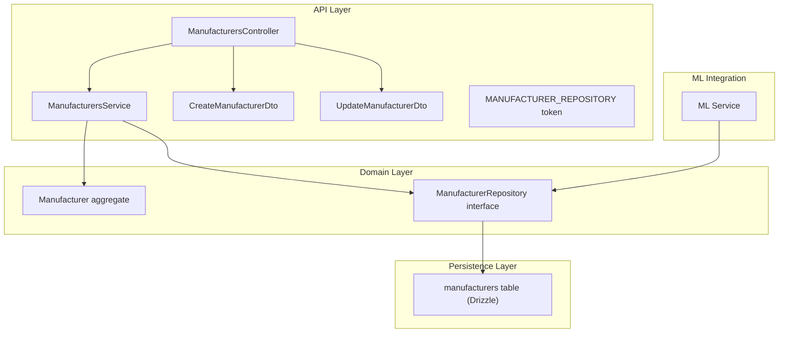
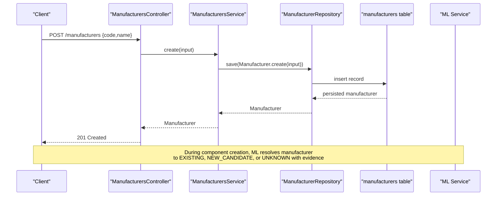
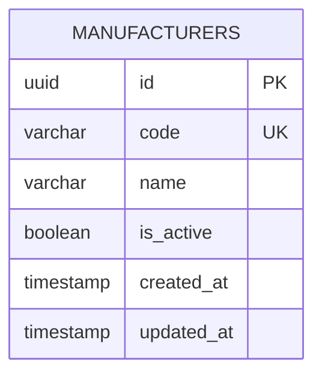
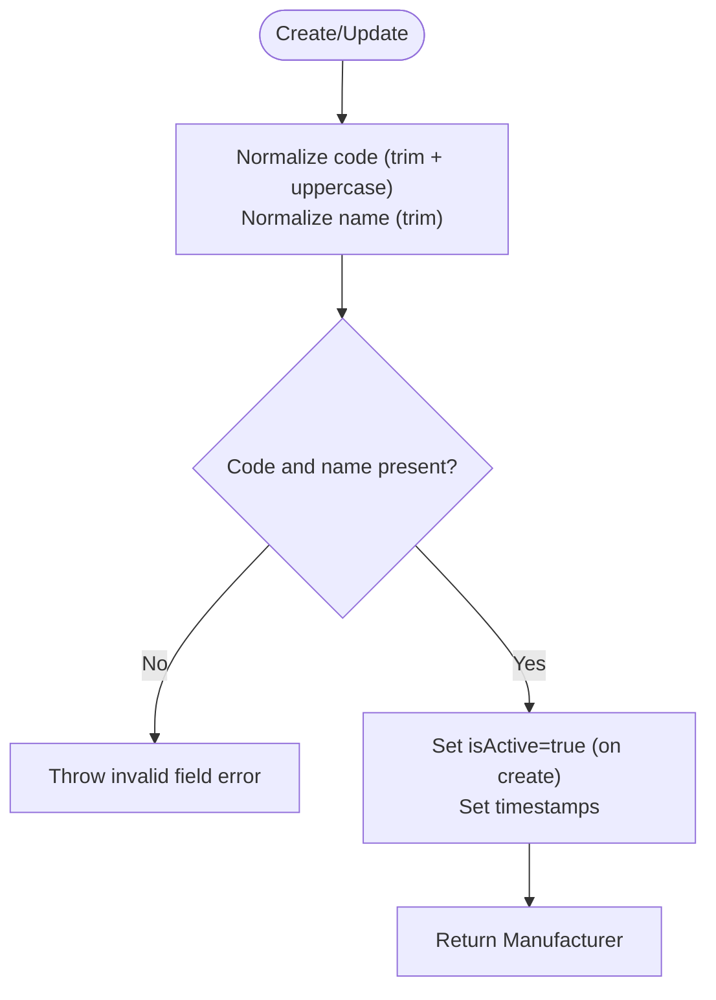
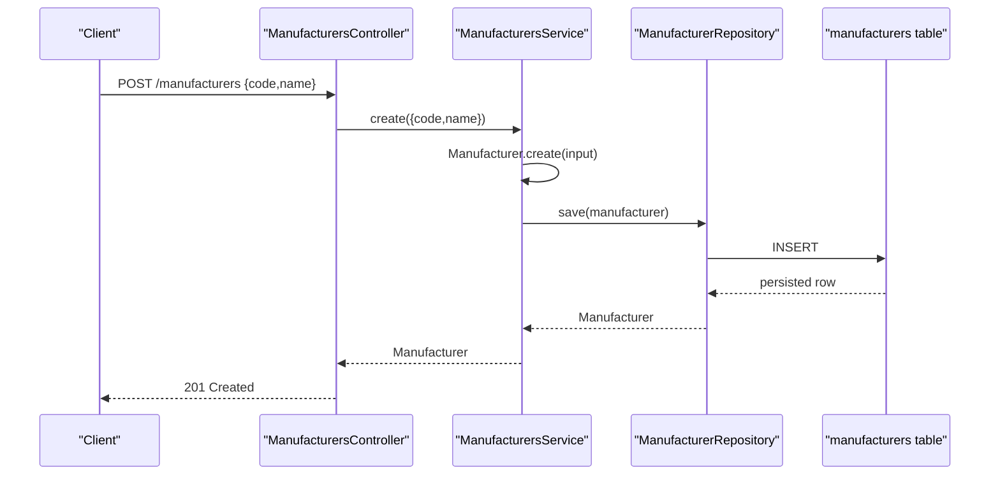
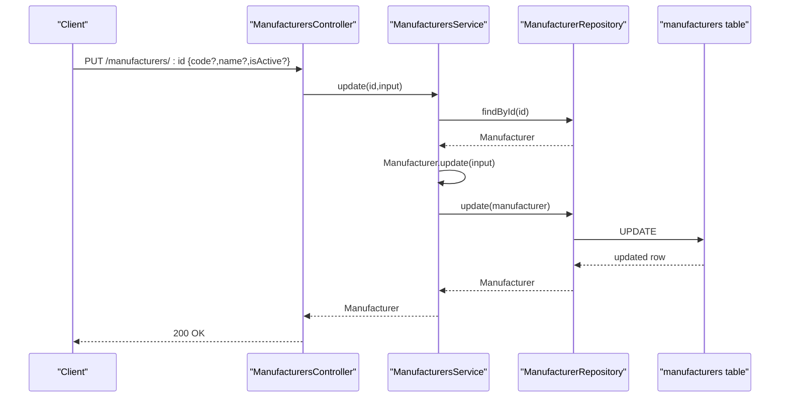
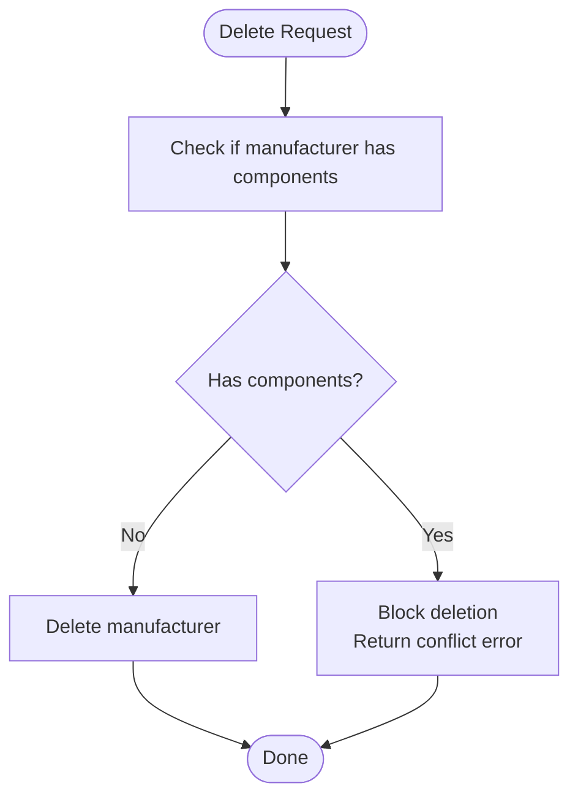
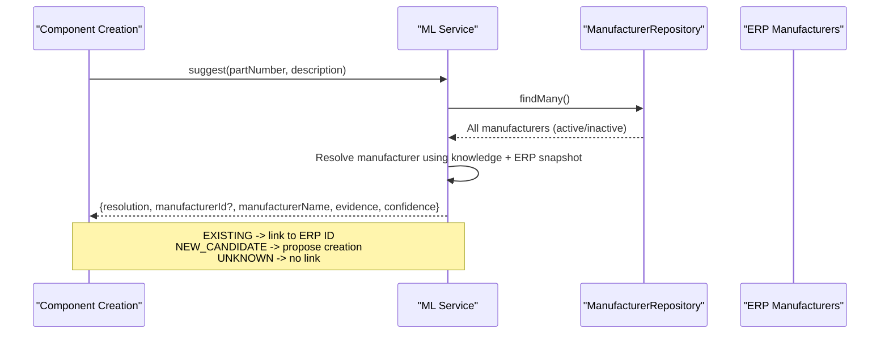
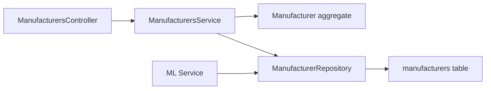

# Manufacturer Management

<cite>
**Referenced Files in This Document**
- [manufacturers.controller.ts](file://apps/api/src/manufacturers/manufacturers.controller.ts)
- [manufacturers.service.ts](file://apps/api/src/manufacturers/manufacturers.service.ts)
- [create-manufacturer.dto.ts](file://apps/api/src/manufacturers/create-manufacturer.dto.ts)
- [update-manufacturer.dto.ts](file://apps/api/src/manufacturers/update-manufacturer.dto.ts)
- [manufacturer.tokens.ts](file://apps/api/src/manufacturers/manufacturer.tokens.ts)
- [manufacturer.ts](file://packages/inventory/src/manufacturers/manufacturer.ts)
- [manufacturer.repository.ts](file://packages/inventory/src/manufacturers/manufacturer.repository.ts)
- [manufacturers.ts](file://packages/database/src/schema/manufacturers.ts)
- [ml.service.ts](file://apps/api/src/ml/ml.service.ts)
- [0060-manufacturer-intelligence-v2.md](file://docs/rfcs/0060-manufacturer-intelligence-v2.md)
</cite>

## Table of Contents
1. [Introduction](#introduction)
2. [Project Structure](#project-structure)
3. [Core Components](#core-components)
4. [Architecture Overview](#architecture-overview)
5. [Detailed Component Analysis](#detailed-component-analysis)
6. [Dependency Analysis](#dependency-analysis)
7. [Performance Considerations](#performance-considerations)
8. [Troubleshooting Guide](#troubleshooting-guide)
9. [Conclusion](#conclusion)
10. [Appendices](#appendices)

## Introduction
This document explains Ananya ERP’s Manufacturer Management system: the manufacturer data model, relationships with components, and manufacturer-specific attributes. It covers the full workflow for creating, updating, and managing manufacturers; integration with component intelligence for manufacturer resolution and deduplication; API endpoints and validation rules; and examples for setup, linking to components, and handling hierarchies or subsidiaries.

## Project Structure
Manufacturer management spans three layers:
- API layer (NestJS): controllers, services, DTOs, and DI tokens
- Domain layer (inventory package): domain entity, repository interface, and errors
- Persistence layer (database package): Drizzle schema for the manufacturers table
- ML integration: ML service orchestrates manufacturer resolution against ERP records and knowledge assets

**Diagram sources**
- [manufacturers.controller.ts:17-48](file://apps/api/src/manufacturers/manufacturers.controller.ts#L17-L48)
- [manufacturers.service.ts:14-51](file://apps/api/src/manufacturers/manufacturers.service.ts#L14-L51)
- [create-manufacturer.dto.ts:1-14](file://apps/api/src/manufacturers/create-manufacturer.dto.ts#L1-L14)
- [update-manufacturer.dto.ts:1-16](file://apps/api/src/manufacturers/update-manufacturer.dto.ts#L1-L16)
- [manufacturer.tokens.ts:1-20](file://apps/api/src/manufacturers/manufacturer.tokens.ts#L1-L20)
- [manufacturer.ts:27-105](file://packages/inventory/src/manufacturers/manufacturer.ts#L27-L105)
- [manufacturer.repository.ts:5-13](file://packages/inventory/src/manufacturers/manufacturer.repository.ts#L5-L13)
- [manufacturers.ts:11-39](file://packages/database/src/schema/manufacturers.ts#L11-L39)
- [ml.service.ts:672-815](file://apps/api/src/ml/ml.service.ts#L672-L815)

**Section sources**
- [manufacturers.controller.ts:17-48](file://apps/api/src/manufacturers/manufacturers.controller.ts#L17-L48)
- [manufacturers.service.ts:14-51](file://apps/api/src/manufacturers/manufacturers.service.ts#L14-L51)
- [manufacturer.ts:27-105](file://packages/inventory/src/manufacturers/manufacturer.ts#L27-L105)
- [manufacturer.repository.ts:5-13](file://packages/inventory/src/manufacturers/manufacturer.repository.ts#L5-L13)
- [manufacturers.ts:11-39](file://packages/database/src/schema/manufacturers.ts#L11-L39)
- [ml.service.ts:672-815](file://apps/api/src/ml/ml.service.ts#L672-L815)

## Core Components
- ManufacturersController: Exposes REST endpoints for CRUD operations on manufacturers.
- ManufacturersService: Orchestrates use cases by delegating to domain commands and the repository.
- Manufacturer aggregate: Encapsulates business rules, normalization, and invariants for code/name and lifecycle flags.
- ManufacturerRepository: Abstraction over persistence operations including existence checks and component linkage checks.
- Database schema: Defines the manufacturers table with unique constraints and timestamps.
- ML integration: Resolves manufacturer names/codes to existing ERP records or proposes new candidates with evidence and confidence.

Key responsibilities:
- Input validation at the API boundary via DTOs
- Business rule enforcement inside the Manufacturer aggregate
- Repository-based persistence and cross-entity integrity checks
- ML-assisted resolution for component creation workflows

**Section sources**
- [manufacturers.controller.ts:17-48](file://apps/api/src/manufacturers/manufacturers.controller.ts#L17-L48)
- [manufacturers.service.ts:14-51](file://apps/api/src/manufacturers/manufacturers.service.ts#L14-L51)
- [manufacturer.ts:27-105](file://packages/inventory/src/manufacturers/manufacturer.ts#L27-L105)
- [manufacturer.repository.ts:5-13](file://packages/inventory/src/manufacturers/manufacturer.repository.ts#L5-L13)
- [manufacturers.ts:11-39](file://packages/database/src/schema/manufacturers.ts#L11-L39)
- [ml.service.ts:672-815](file://apps/api/src/ml/ml.service.ts#L672-L815)

## Architecture Overview
The Manufacturer Management architecture follows a layered design:
- API layer validates requests and delegates to services
- Services apply domain logic through the Manufacturer aggregate and repository
- Repository abstracts persistence and enforces referential integrity
- ML service integrates during component creation to resolve or propose manufacturers

**Diagram sources**
- [manufacturers.controller.ts:22-30](file://apps/api/src/manufacturers/manufacturers.controller.ts#L22-L30)
- [manufacturers.service.ts:29-43](file://apps/api/src/manufacturers/manufacturers.service.ts#L29-L43)
- [manufacturer.ts:48-72](file://packages/inventory/src/manufacturers/manufacturer.ts#L48-L72)
- [manufacturer.repository.ts:5-13](file://packages/inventory/src/manufacturers/manufacturer.repository.ts#L5-L13)
- [manufacturers.ts:11-39](file://packages/database/src/schema/manufacturers.ts#L11-L39)
- [ml.service.ts:672-815](file://apps/api/src/ml/ml.service.ts#L672-L815)

## Detailed Component Analysis

### Data Model and Relationships
- Manufacturer fields: id (UUID), code (unique string), name (string), isActive (boolean), createdAt, updatedAt
- Unique constraint on code ensures canonical identity
- Relationship to components is enforced via repository methods that check if a manufacturer has linked components before deletion

**Diagram sources**
- [manufacturers.ts:11-39](file://packages/database/src/schema/manufacturers.ts#L11-L39)

**Section sources**
- [manufacturers.ts:11-39](file://packages/database/src/schema/manufacturers.ts#L11-L39)
- [manufacturer.repository.ts:5-13](file://packages/inventory/src/manufacturers/manufacturer.repository.ts#L5-L13)

### Manufacturer Aggregate and Validation Rules
- Code normalization: trimmed and uppercased on create/update
- Name normalization: trimmed on create/update
- Required fields: code and name must be non-empty
- Default state: isActive defaults to true on creation
- Update preserves unchanged fields and updates updatedAt timestamp

**Diagram sources**
- [manufacturer.ts:48-98](file://packages/inventory/src/manufacturers/manufacturer.ts#L48-L98)

**Section sources**
- [manufacturer.ts:48-98](file://packages/inventory/src/manufacturers/manufacturer.ts#L48-L98)

### API Endpoints and DTOs
- POST /manufacturers: Create a manufacturer using CreateManufacturerDto
- GET /manufacturers: List all manufacturers
- GET /manufacturers/:id: Retrieve a single manufacturer
- PUT /manufacturers/:id: Update a manufacturer using UpdateManufacturerDto
- DELETE /manufacturers/:id: Delete a manufacturer (subject to linkage checks)

Validation rules:
- CreateManufacturerDto: code and name are required strings with length limits
- UpdateManufacturerDto: code, name, isActive are optional with type constraints

Error handling:
- Missing manufacturer returns a not found error
- Deletion may be blocked if manufacturer is linked to components

**Section sources**
- [manufacturers.controller.ts:17-48](file://apps/api/src/manufacturers/manufacturers.controller.ts#L17-L48)
- [create-manufacturer.dto.ts:1-14](file://apps/api/src/manufacturers/create-manufacturer.dto.ts#L1-L14)
- [update-manufacturer.dto.ts:1-16](file://apps/api/src/manufacturers/update-manufacturer.dto.ts#L1-L16)
- [manufacturers.service.ts:45-51](file://apps/api/src/manufacturers/manufacturers.service.ts#L45-L51)

### Workflow: Creating a Manufacturer
1. Client sends POST /manufacturers with code and name
2. Controller validates input via DTOs
3. Service creates Manufacturer aggregate (normalizes and validates)
4. Repository persists the record and returns the saved entity
5. Controller responds with the created manufacturer

**Diagram sources**
- [manufacturers.controller.ts:22-25](file://apps/api/src/manufacturers/manufacturers.controller.ts#L22-L25)
- [manufacturers.service.ts:29-31](file://apps/api/src/manufacturers/manufacturers.service.ts#L29-L31)
- [manufacturer.ts:48-72](file://packages/inventory/src/manufacturers/manufacturer.ts#L48-L72)
- [manufacturer.repository.ts:5-13](file://packages/inventory/src/manufacturers/manufacturer.repository.ts#L5-L13)
- [manufacturers.ts:11-39](file://packages/database/src/schema/manufacturers.ts#L11-L39)

### Workflow: Updating a Manufacturer
1. Client sends PUT /manufacturers/:id with optional fields
2. Controller passes update payload to service
3. Service loads manufacturer, applies update with normalization and invariants
4. Repository persists changes and returns updated entity

**Diagram sources**
- [manufacturers.controller.ts:37-43](file://apps/api/src/manufacturers/manufacturers.controller.ts#L37-L43)
- [manufacturers.service.ts:33-35](file://apps/api/src/manufacturers/manufacturers.service.ts#L33-L35)
- [manufacturer.ts:77-98](file://packages/inventory/src/manufacturers/manufacturer.ts#L77-L98)
- [manufacturer.repository.ts:5-13](file://packages/inventory/src/manufacturers/manufacturer.repository.ts#L5-L13)
- [manufacturers.ts:11-39](file://packages/database/src/schema/manufacturers.ts#L11-L39)

### Workflow: Deleting a Manufacturer
1. Client sends DELETE /manufacturers/:id
2. Service attempts deletion via repository
3. Repository checks if manufacturer is linked to components
4. If linked, deletion is blocked; otherwise, record is removed

**Diagram sources**
- [manufacturer.repository.ts:5-13](file://packages/inventory/src/manufacturers/manufacturer.repository.ts#L5-L13)

**Section sources**
- [manufacturer.repository.ts:5-13](file://packages/inventory/src/manufacturers/manufacturer.repository.ts#L5-L13)

### Integration with Component Intelligence: Manufacturer Resolution and Deduplication
- The ML service receives current ERP manufacturer snapshots (active and inactive) and uses them alongside knowledge assets to resolve manufacturer names or codes from component inputs
- Resolution outcomes:
  - EXISTING: matches an active ERP manufacturer; includes its ID
  - NEW_CANDIDATE: identifies a known manufacturer outside ERP; creation remains explicit
  - UNKNOWN: insufficient evidence; ranked candidates may be returned
- Evidence precedence combines exact matches, normalized names, aliases, MPN patterns, and text extraction
- Deduplication relies on unique code constraint and normalized matching to avoid duplicates

**Diagram sources**
- [ml.service.ts:672-815](file://apps/api/src/ml/ml.service.ts#L672-L815)
- [0060-manufacturer-intelligence-v2.md:7-21](file://docs/rfcs/0060-manufacturer-intelligence-v2.md#L7-L21)

**Section sources**
- [ml.service.ts:672-815](file://apps/api/src/ml/ml.service.ts#L672-L815)
- [0060-manufacturer-intelligence-v2.md:7-21](file://docs/rfcs/0060-manufacturer-intelligence-v2.md#L7-L21)

### Examples: Setup, Linking, and Hierarchies
- Setup:
  - Create a manufacturer via POST /manufacturers with a unique code and a descriptive name
  - Use GET /manufacturers to verify creation and list available options
- Linking to components:
  - During component creation, the ML service can auto-resolve a manufacturer to an existing ERP record (EXISTING) and attach its ID
  - If the ML service returns NEW_CANDIDATE, explicitly create the manufacturer first, then link it to the component
- Hierarchies or subsidiaries:
  - The current data model does not include parent/child relationships or subsidiary fields
  - To represent hierarchies, extend the Manufacturer aggregate and database schema with fields such as parentId or subsidiary indicators, and add validation rules to enforce hierarchy constraints

[No sources needed since this section provides conceptual guidance beyond current schema]

## Dependency Analysis
- Coupling:
  - Controllers depend on services and DTOs for request/response contracts
  - Services depend on domain aggregates and repository interfaces
  - Repository abstracts persistence details and enforces referential integrity
- Cohesion:
  - Each layer has clear responsibilities: API boundaries, domain rules, persistence abstraction
- External dependencies:
  - ML service integrates with manufacturer resolution, consuming ERP snapshots and knowledge assets
- Potential circular dependencies:
  - None observed between API, domain, and persistence layers
- Interface contracts:
  - ManufacturerRepository defines consistent operations for CRUD and linkage checks

**Diagram sources**
- [manufacturers.controller.ts:17-48](file://apps/api/src/manufacturers/manufacturers.controller.ts#L17-L48)
- [manufacturers.service.ts:14-51](file://apps/api/src/manufacturers/manufacturers.service.ts#L14-L51)
- [manufacturer.ts:27-105](file://packages/inventory/src/manufacturers/manufacturer.ts#L27-L105)
- [manufacturer.repository.ts:5-13](file://packages/inventory/src/manufacturers/manufacturer.repository.ts#L5-L13)
- [manufacturers.ts:11-39](file://packages/database/src/schema/manufacturers.ts#L11-L39)
- [ml.service.ts:672-815](file://apps/api/src/ml/ml.service.ts#L672-L815)

**Section sources**
- [manufacturers.controller.ts:17-48](file://apps/api/src/manufacturers/manufacturers.controller.ts#L17-L48)
- [manufacturers.service.ts:14-51](file://apps/api/src/manufacturers/manufacturers.service.ts#L14-L51)
- [manufacturer.repository.ts:5-13](file://packages/inventory/src/manufacturers/manufacturer.repository.ts#L5-L13)
- [ml.service.ts:672-815](file://apps/api/src/ml/ml.service.ts#L672-L815)

## Performance Considerations
- Unique index on manufacturer code improves lookup performance and prevents duplicates
- Normalization (trimming and uppercasing) reduces false mismatches during resolution
- ML service uses immutable snapshots of ERP manufacturers per suggestion request to minimize contention
- Repository-level checks for component linkage prevent expensive cascading queries during deletion

[No sources needed since this section provides general guidance]

## Troubleshooting Guide
Common issues and resolutions:
- Invalid manufacturer code or name:
  - Ensure code and name meet validation rules (non-empty, length limits)
  - Code is normalized to uppercase; ensure expected casing when querying
- Not found errors:
  - Verify the manufacturer exists before retrieval or update
- Deletion conflicts:
  - If a manufacturer is linked to components, deletion is blocked; unlink or reassign components first
- ML resolution ambiguity:
  - Review evidence and confidence levels; consider refining manufacturer names or adding aliases

**Section sources**
- [create-manufacturer.dto.ts:1-14](file://apps/api/src/manufacturers/create-manufacturer.dto.ts#L1-L14)
- [update-manufacturer.dto.ts:1-16](file://apps/api/src/manufacturers/update-manufacturer.dto.ts#L1-L16)
- [manufacturers.service.ts:45-51](file://apps/api/src/manufacturers/manufacturers.service.ts#L45-L51)
- [manufacturer.repository.ts:5-13](file://packages/inventory/src/manufacturers/manufacturer.repository.ts#L5-L13)
- [ml.service.ts:672-815](file://apps/api/src/ml/ml.service.ts#L672-L815)

## Conclusion
Ananya ERP’s Manufacturer Management system provides a robust, validated, and extensible foundation for managing manufacturers. The layered architecture separates concerns across API, domain, and persistence layers, while ML integration enhances accuracy and efficiency in manufacturer resolution during component creation. The unique code constraint and normalization ensure deduplication and reliable lookups. Future enhancements can introduce hierarchical relationships and additional attributes to support complex organizational structures.

[No sources needed since this section summarizes without analyzing specific files]

## Appendices

### API Reference Summary
- POST /manufacturers: Create manufacturer
- GET /manufacturers: List manufacturers
- GET /manufacturers/:id: Get manufacturer by ID
- PUT /manufacturers/:id: Update manufacturer
- DELETE /manufacturers/:id: Delete manufacturer

**Section sources**
- [manufacturers.controller.ts:17-48](file://apps/api/src/manufacturers/manufacturers.controller.ts#L17-L48)

### Validation Rules Summary
- CreateManufacturerDto:
  - code: required string, max length
  - name: required string, max length
- UpdateManufacturerDto:
  - code: optional string
  - name: optional string
  - isActive: optional boolean

**Section sources**
- [create-manufacturer.dto.ts:1-14](file://apps/api/src/manufacturers/create-manufacturer.dto.ts#L1-L14)
- [update-manufacturer.dto.ts:1-16](file://apps/api/src/manufacturers/update-manufacturer.dto.ts#L1-L16)

### Manufacturer Resolution Outcomes
- EXISTING: matched to an active ERP manufacturer
- NEW_CANDIDATE: identified outside ERP; requires explicit creation
- UNKNOWN: insufficient evidence; candidates may be provided

**Section sources**
- [0060-manufacturer-intelligence-v2.md:13-21](file://docs/rfcs/0060-manufacturer-intelligence-v2.md#L13-L21)
- [ml.service.ts:672-815](file://apps/api/src/ml/ml.service.ts#L672-L815)