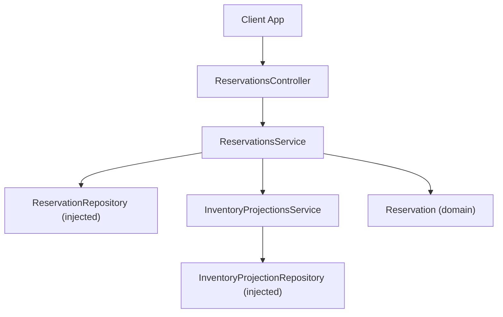
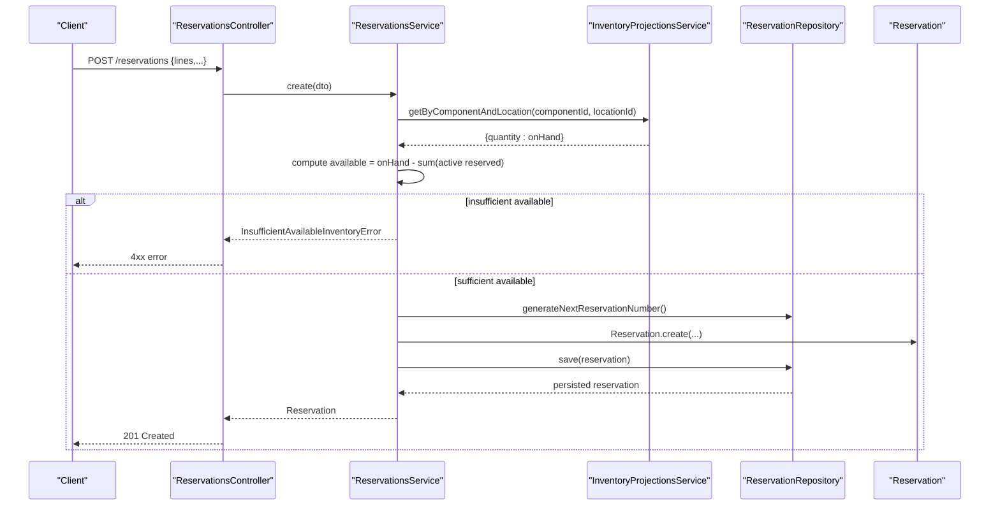
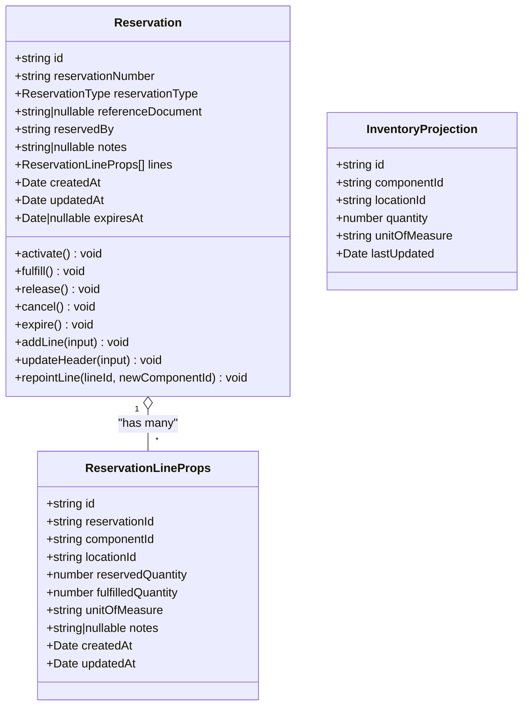
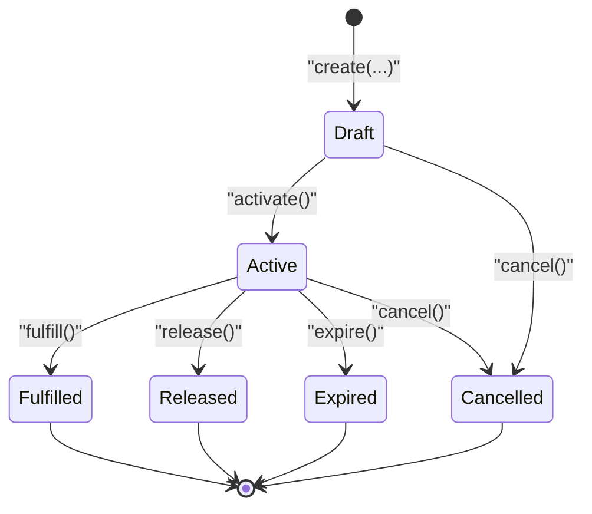
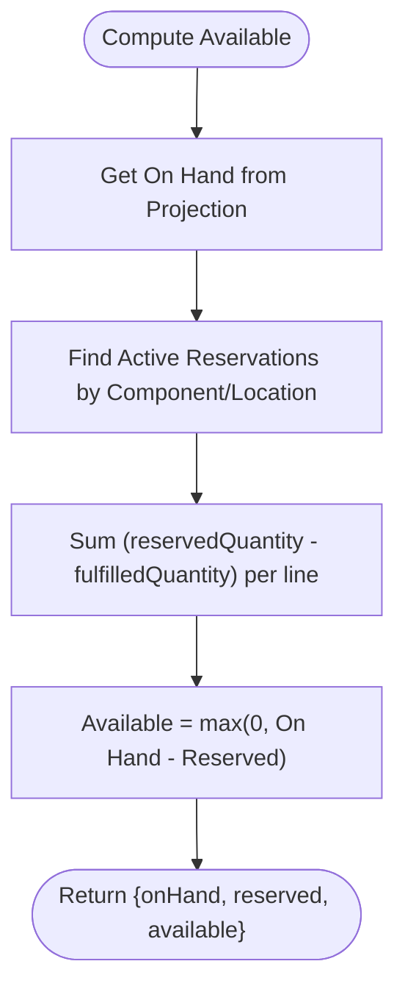
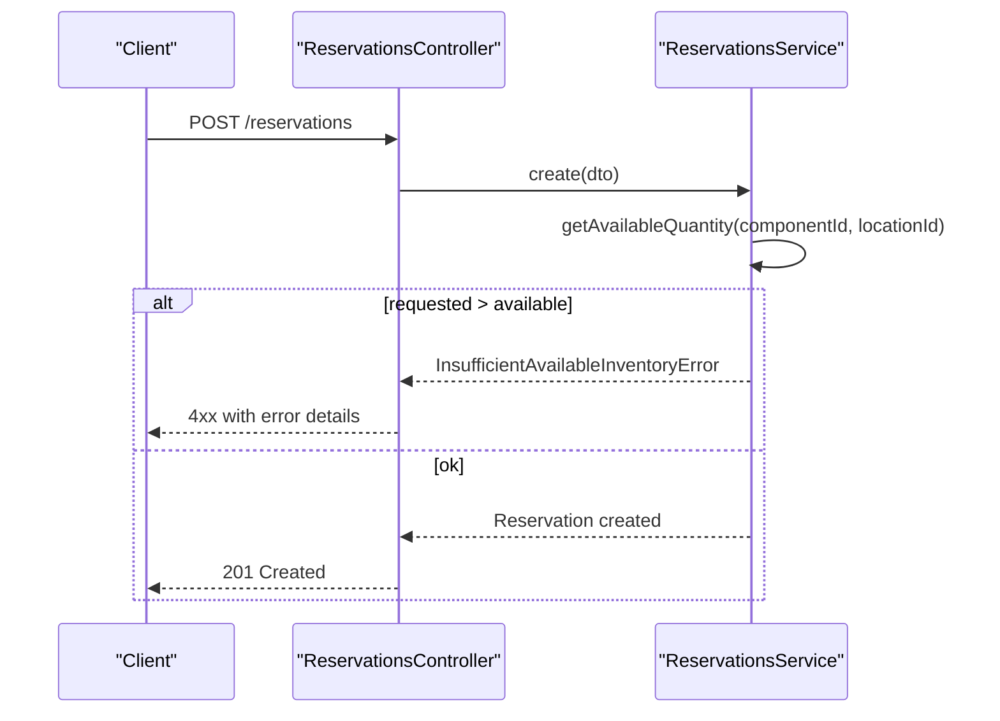
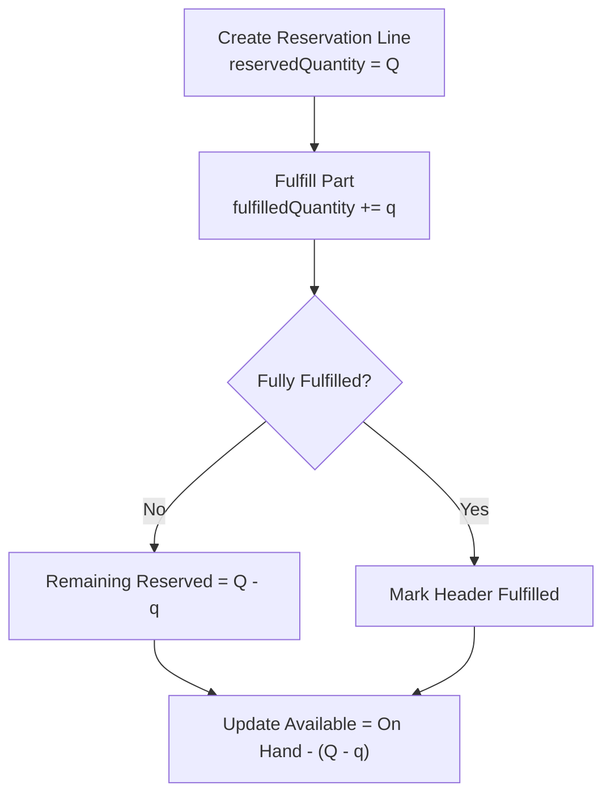
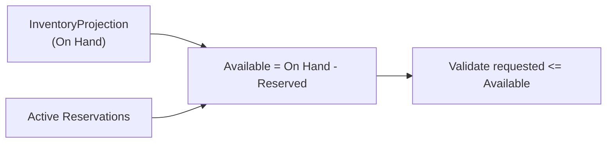
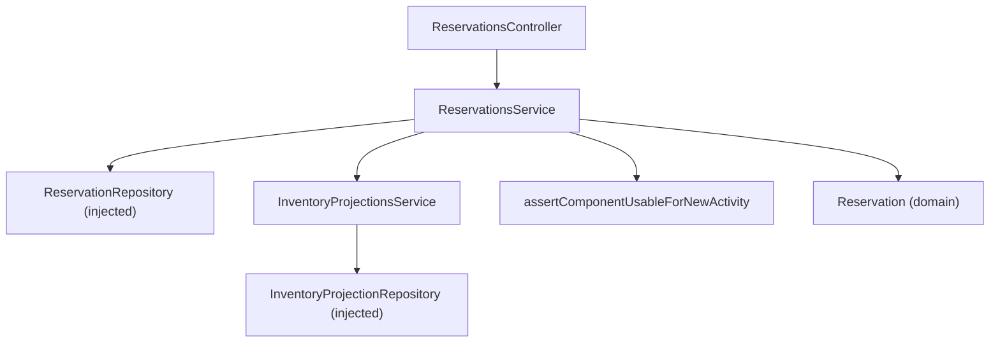

# Reservations System

<cite>
**Referenced Files in This Document**
- [0008-inventory-reservations.md](file://docs/rfcs/0008-inventory-reservations.md)
- [reservations.controller.ts](file://apps/api/src/reservations/reservations.controller.ts)
- [reservations.service.ts](file://apps/api/src/reservations/reservations.service.ts)
- [dtos.ts](file://apps/api/src/reservations/dtos.ts)
- [create-reservation.dto.ts](file://apps/api/src/reservations/create-reservation.dto.ts)
- [inventory-projections.service.ts](file://apps/api/src/inventory-projections/inventory-projections.service.ts)
- [reservation.ts](file://packages/inventory/src/reservations/reservation.ts)
- [reservation.types.ts](file://packages/inventory/src/reservations/reservation.types.ts)
- [reservation.errors.ts](file://packages/inventory/src/reservations/reservation.errors.ts)
- [inventory-projection.ts](file://packages/inventory/src/projection/inventory-projection.ts)
</cite>

## Table of Contents
1. Introduction
2. Project Structure
3. Core Components
4. Architecture Overview
5. Detailed Component Analysis
6. Dependency Analysis
7. Performance Considerations
8. Troubleshooting Guide
9. Conclusion
10. Appendices

## Introduction
This document explains Ananya ERP’s Reservations System: the data model, reservation types, allocation strategies, lifecycle from creation to fulfillment or cancellation, conflict handling and priority considerations, partial fulfillment support, and integration with inventory projections and availability checks. It also provides practical examples for creating reservations, handling conflicts, implementing workflows, and querying status across entities.

The system follows a clear principle: reservations allocate inventory without moving it; only inventory transactions change physical stock. Available inventory is derived as On Hand minus Reserved.

**Section sources**
- [0008-inventory-reservations.md:15-123](file://docs/rfcs/0008-inventory-reservations.md#L15-L123)

## Project Structure
The Reservations System spans API controllers/services, domain models, and inventory projections:
- API layer exposes endpoints for CRUD and lifecycle operations on reservations and availability queries.
- Domain layer defines the Reservation aggregate, statuses, types, lines, and errors.
- Inventory projections provide On Hand quantities used to compute Available inventory alongside active reservations.

**Diagram sources**
- [reservations.controller.ts:17-83](file://apps/api/src/reservations/reservations.controller.ts#L17-L83)
- [reservations.service.ts:19-25](file://apps/api/src/reservations/reservations.service.ts#L19-L25)
- [inventory-projections.service.ts:11-18](file://apps/api/src/inventory-projections/inventory-projections.service.ts#L11-L18)
- [reservation.ts:16-27](file://packages/inventory/src/reservations/reservation.ts#L16-L27)

**Section sources**
- [reservations.controller.ts:17-83](file://apps/api/src/reservations/reservations.controller.ts#L17-L83)
- [reservations.service.ts:19-25](file://apps/api/src/reservations/reservations.service.ts#L19-L25)
- [inventory-projections.service.ts:11-18](file://apps/api/src/inventory-projections/inventory-projections.service.ts#L11-L18)

## Core Components
- Reservation domain model: immutable state transitions, line items, and lifecycle methods.
- Service layer: validates inputs, enforces availability, coordinates repository and projection reads, and persists changes.
- Controller layer: HTTP endpoints for create, update, query, fulfill, release, cancel, delete, and available quantity lookup.
- DTOs: request/response contracts for creating/updating reservations and lines.
- Inventory projections: read-only view of On Hand per component/location used to derive Available.

Key responsibilities:
- Create: validate at least one line, check component usability, verify available quantity, generate reservation number, build domain object, persist.
- Update: allow edits only in Draft/Active, re-validate availability for changed lines.
- Fulfill/Release/Cancel: enforce valid state transitions via domain methods.
- Delete: prevent deletion of completed/released records.
- Availability: combine On Hand from projections with active reserved quantities to compute Available.

**Section sources**
- [reservations.service.ts:27-71](file://apps/api/src/reservations/reservations.service.ts#L27-L71)
- [reservations.service.ts:73-118](file://apps/api/src/reservations/reservations.service.ts#L73-L118)
- [reservations.service.ts:146-175](file://apps/api/src/reservations/reservations.service.ts#L146-L175)
- [reservations.service.ts:177-209](file://apps/api/src/reservations/reservations.service.ts#L177-L209)
- [reservation.ts:47-72](file://packages/inventory/src/reservations/reservation.ts#L47-L72)
- [reservation.ts:162-212](file://packages/inventory/src/reservations/reservation.ts#L162-L212)
- [dtos.ts:12-91](file://apps/api/src/reservations/dtos.ts#L12-L91)

## Architecture Overview
The Reservations System integrates with inventory projections to ensure that reservations never overcommit stock. The flow emphasizes validation before persistence and strict state transitions enforced by the domain.

**Diagram sources**
- [reservations.controller.ts:22-25](file://apps/api/src/reservations/reservations.controller.ts#L22-L25)
- [reservations.service.ts:27-71](file://apps/api/src/reservations/reservations.service.ts#L27-L71)
- [inventory-projections.service.ts:20-28](file://apps/api/src/inventory-projections/inventory-projections.service.ts#L20-L28)
- [reservation.ts:47-72](file://packages/inventory/src/reservations/reservation.ts#L47-L72)

## Detailed Component Analysis

### Data Model and Types
- Reservation header includes type, reference document, reservedBy, notes, expiry, timestamps, and status.
- Lines specify componentId, locationId, reservedQuantity, fulfilledQuantity, unitOfMeasure, notes, and timestamps.
- Statuses include Draft, Active, Fulfilled, Released, Expired, Cancelled.
- Types include WORK_ORDER, PROJECT, PURCHASE_REQUEST, SALES_ORDER.

**Diagram sources**
- [reservation.ts:16-27](file://packages/inventory/src/reservations/reservation.ts#L16-L27)
- [reservation.ts:74-102](file://packages/inventory/src/reservations/reservation.ts#L74-L102)
- [reservation.types.ts:1-57](file://packages/inventory/src/reservations/reservation.types.ts#L1-L57)
- [inventory-projection.ts:1-76](file://packages/inventory/src/projection/inventory-projection.ts#L1-L76)

**Section sources**
- [reservation.types.ts:1-57](file://packages/inventory/src/reservations/reservation.types.ts#L1-L57)
- [reservation.ts:16-27](file://packages/inventory/src/reservations/reservation.ts#L16-L27)
- [inventory-projection.ts:1-76](file://packages/inventory/src/projection/inventory-projection.ts#L1-L76)

### Reservation Lifecycle
Reservations transition through well-defined states. Only Active reservations affect Available inventory.

**Diagram sources**
- [reservation.ts:162-212](file://packages/inventory/src/reservations/reservation.ts#L162-L212)

**Section sources**
- [reservation.ts:162-212](file://packages/inventory/src/reservations/reservation.ts#L162-L212)
- [0008-inventory-reservations.md:125-163](file://docs/rfcs/0008-inventory-reservations.md#L125-L163)

### Allocation Strategy and Availability Checks
- Availability is computed as On Hand minus Reserved.
- On Hand comes from InventoryProjection.
- Reserved is the sum of active reservation line quantities minus fulfilled quantities per component/location.
- Creation/update validates each line against available quantity and throws an error if insufficient.

**Diagram sources**
- [reservations.service.ts:177-209](file://apps/api/src/reservations/reservations.service.ts#L177-L209)
- [inventory-projections.service.ts:20-28](file://apps/api/src/inventory-projections/inventory-projections.service.ts#L20-L28)

**Section sources**
- [reservations.service.ts:177-209](file://apps/api/src/reservations/reservations.service.ts#L177-L209)
- [0008-inventory-reservations.md:113-123](file://docs/rfcs/0008-inventory-reservations.md#L113-L123)

### Conflict Handling and Priority
- Conflicts are prevented by validating requested quantity against available inventory before creating or updating reservations.
- If insufficient, a specific domain error is raised to signal over-allocation.
- Priority handling is not implemented in this version; future RFCs may introduce priorities.

**Diagram sources**
- [reservations.controller.ts:22-25](file://apps/api/src/reservations/reservations.controller.ts#L22-L25)
- [reservations.service.ts:27-71](file://apps/api/src/reservations/reservations.service.ts#L27-L71)
- [reservation.errors.ts:10-17](file://packages/inventory/src/reservations/reservation.errors.ts#L10-L17)

**Section sources**
- [reservations.service.ts:27-71](file://apps/api/src/reservations/reservations.service.ts#L27-L71)
- [reservation.errors.ts:10-17](file://packages/inventory/src/reservations/reservation.errors.ts#L10-L17)

### Partial Fulfillment Scenarios
- Each line tracks both reservedQuantity and fulfilledQuantity, enabling partial fulfillment within a single reservation.
- Available inventory calculation subtracts net reserved per line (reservedQuantity - fulfilledQuantity).
- When inventory is physically consumed or moved, corresponding inventory transactions are created separately; fulfilling a reservation marks it as Fulfilled at the header level.

**Diagram sources**
- [reservation.types.ts:13-24](file://packages/inventory/src/reservations/reservation.types.ts#L13-L24)
- [reservations.service.ts:177-209](file://apps/api/src/reservations/reservations.service.ts#L177-L209)
- [reservation.ts:172-180](file://packages/inventory/src/reservations/reservation.ts#L172-L180)

**Section sources**
- [reservation.types.ts:13-24](file://packages/inventory/src/reservations/reservation.types.ts#L13-L24)
- [reservations.service.ts:177-209](file://apps/api/src/reservations/reservations.service.ts#L177-L209)
- [reservation.ts:172-180](file://packages/inventory/src/reservations/reservation.ts#L172-L180)

### Integration with Inventory Projections and Availability Checks
- On Hand is retrieved from InventoryProjection per component/location.
- Active reservations are aggregated to compute Reserved.
- Available is derived and enforced during create/update.

**Diagram sources**
- [inventory-projections.service.ts:20-28](file://apps/api/src/inventory-projections/inventory-projections.service.ts#L20-L28)
- [reservations.service.ts:177-209](file://apps/api/src/reservations/reservations.service.ts#L177-L209)

**Section sources**
- [inventory-projections.service.ts:20-28](file://apps/api/src/inventory-projections/inventory-projections.service.ts#L20-L28)
- [reservations.service.ts:177-209](file://apps/api/src/reservations/reservations.service.ts#L177-L209)

### Practical Examples

- Creating a reservation
  - Use the POST endpoint with a list of lines specifying componentId, locationId, reservedQuantity, and optional unitOfMeasure/notes.
  - The service validates at least one line, checks component usability, verifies availability, generates a reservation number, creates the domain object, and persists it.

- Handling reservation conflicts
  - If requested exceeds available, the service raises an error indicating insufficient inventory. Clients should handle this by adjusting quantities or waiting for releases/fulfillments.

- Implementing reservation workflows
  - Create a reservation in Active status.
  - Perform partial fulfillment by updating fulfilledQuantity on lines and marking the header Fulfilled when fully consumed.
  - Release or cancel as needed based on business rules.

- Querying reservation status across entities
  - Use GET /reservations with filters such as componentId, locationId, reservationType, status, referenceDocument, and search to retrieve matching reservations.
  - Use GET /reservations/available?componentId=...&locationId=... to obtain current On Hand, Reserved, and Available.

**Section sources**
- [reservations.controller.ts:22-83](file://apps/api/src/reservations/reservations.controller.ts#L22-L83)
- [reservations.service.ts:27-71](file://apps/api/src/reservations/reservations.service.ts#L27-L71)
- [reservations.service.ts:120-136](file://apps/api/src/reservations/reservations.service.ts#L120-L136)
- [reservations.service.ts:177-209](file://apps/api/src/reservations/reservations.service.ts#L177-L209)

## Dependency Analysis
The Reservations module depends on:
- @ananya/inventory domain types and repositories (injected).
- InventoryProjectionsService for On Hand data.
- Component lifecycle guard to ensure components are usable for new activities.

**Diagram sources**
- [reservations.controller.ts:17-20](file://apps/api/src/reservations/reservations.controller.ts#L17-L20)
- [reservations.service.ts:19-25](file://apps/api/src/reservations/reservations.service.ts#L19-L25)
- [inventory-projections.service.ts:11-18](file://apps/api/src/inventory-projections/inventory-projections.service.ts#L11-L18)

**Section sources**
- [reservations.service.ts:19-25](file://apps/api/src/reservations/reservations.service.ts#L19-L25)
- [inventory-projections.service.ts:11-18](file://apps/api/src/inventory-projections/inventory-projections.service.ts#L11-L18)

## Performance Considerations
- Availability computation aggregates active reservations per component/location; consider indexing on componentId and locationId for efficient lookups.
- Rebuilding inventory projections can be triggered when necessary to keep On Hand consistent with ledger transactions.
- Avoid excessive polling of availability; batch updates where possible.

[No sources needed since this section provides general guidance]

## Troubleshooting Guide
Common issues and resolutions:
- Over-allocation error: Occurs when requested quantity exceeds available. Reduce quantity or wait for other reservations to release/fulfill.
- Invalid state transitions: Attempting to fulfill/release/cancel a non-active reservation will fail. Ensure the reservation is Active before transitioning.
- Immutable record: Completed or released reservations cannot be edited or deleted. Create a new reservation if needed.
- Component usability: New reservations require the component to be usable; retired components are rejected.

**Section sources**
- [reservation.errors.ts:1-32](file://packages/inventory/src/reservations/reservation.errors.ts#L1-L32)
- [reservation.ts:162-212](file://packages/inventory/src/reservations/reservation.ts#L162-L212)
- [reservations.service.ts:73-118](file://apps/api/src/reservations/reservations.service.ts#L73-L118)
- [reservations.service.ts:164-175](file://apps/api/src/reservations/reservations.service.ts#L164-L175)

## Conclusion
Ananya’s Reservations System provides a robust mechanism to allocate inventory without altering physical stock, ensuring planning integrity and preventing over-commitment. Through strict state transitions, availability checks, and integration with inventory projections, it supports manufacturing, sales, repairs, and internal requests while preserving the ledger as the source of truth. Future enhancements may add priorities, automatic expiry, and advanced policies.

[No sources needed since this section summarizes without analyzing specific files]

## Appendices

### API Reference Summary
- POST /reservations: Create a reservation with lines and header metadata.
- GET /reservations: List reservations with filters (componentId, locationId, reservationType, status, referenceDocument, search).
- GET /reservations/available: Return onHand, reserved, available for a component/location.
- GET /reservations/:id: Retrieve a reservation by ID.
- PUT /reservations/:id: Update header and/or lines (only in Draft/Active).
- POST /reservations/:id/fulfill: Mark reservation as fulfilled.
- POST /reservations/:id/release: Release reservation.
- POST /reservations/:id/cancel: Cancel reservation.
- DELETE /reservations/:id: Delete reservation (not allowed if fulfilled/released).

**Section sources**
- [reservations.controller.ts:22-83](file://apps/api/src/reservations/reservations.controller.ts#L22-L83)

### DTOs Summary
- CreateReservationDto: reservationType, referenceDocument, reservedBy, notes, expiresAt, lines[].
- UpdateReservationDto: same fields as create but all optional; allows editing header and lines.
- ReservationLineInputDto: componentId, locationId, reservedQuantity, unitOfMeasure, notes.

**Section sources**
- [dtos.ts:12-91](file://apps/api/src/reservations/dtos.ts#L12-L91)