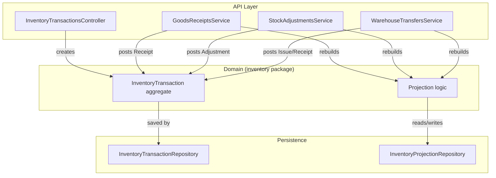
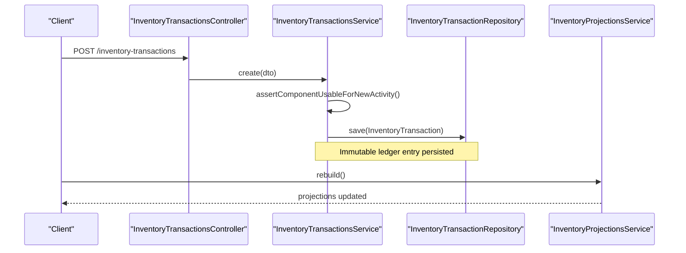
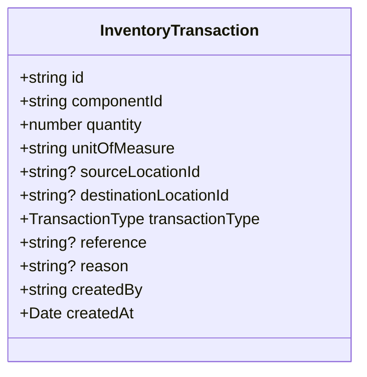
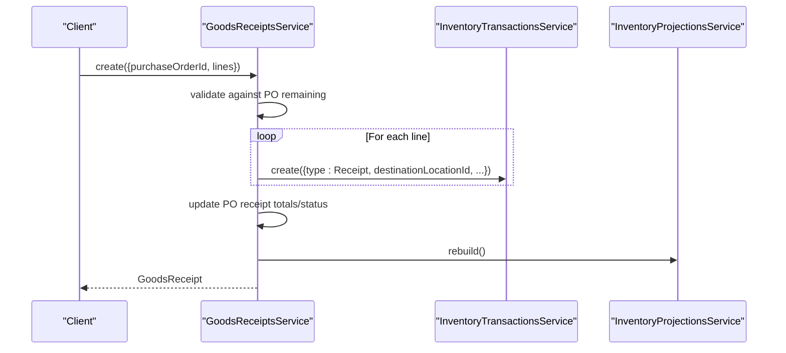
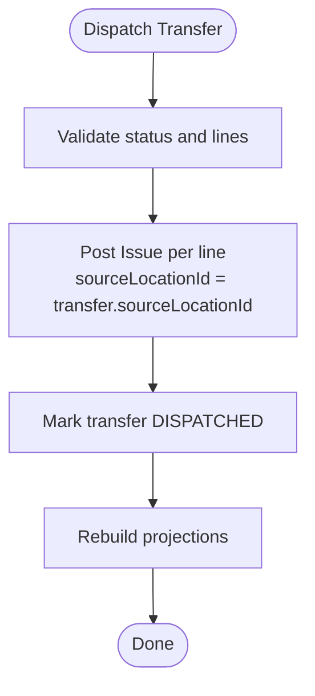
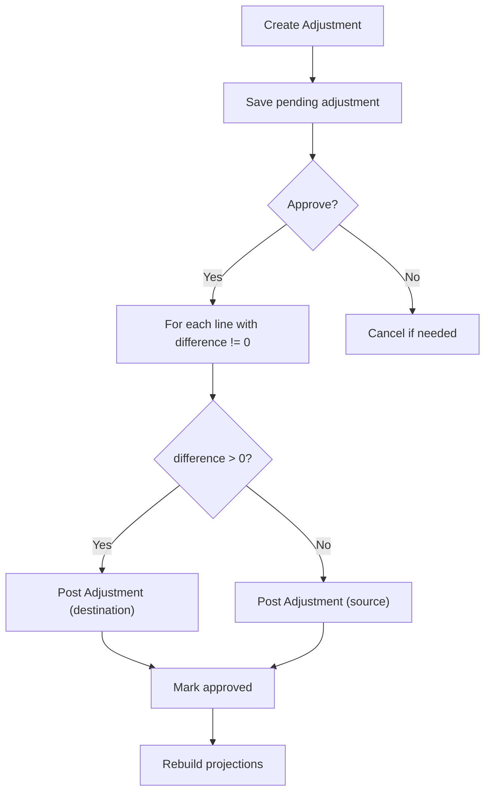
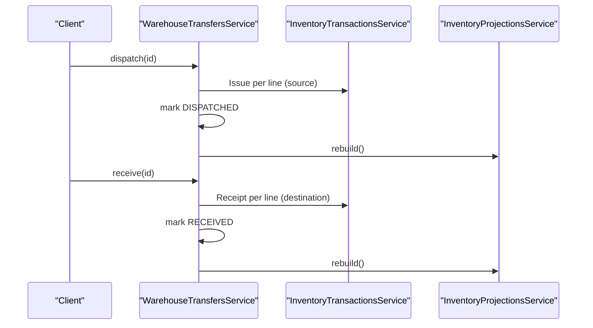
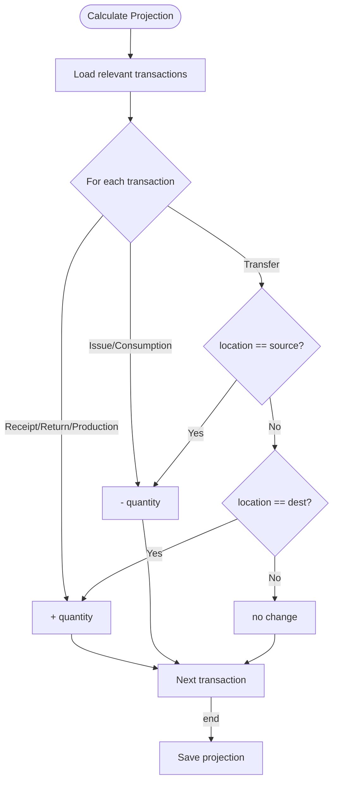
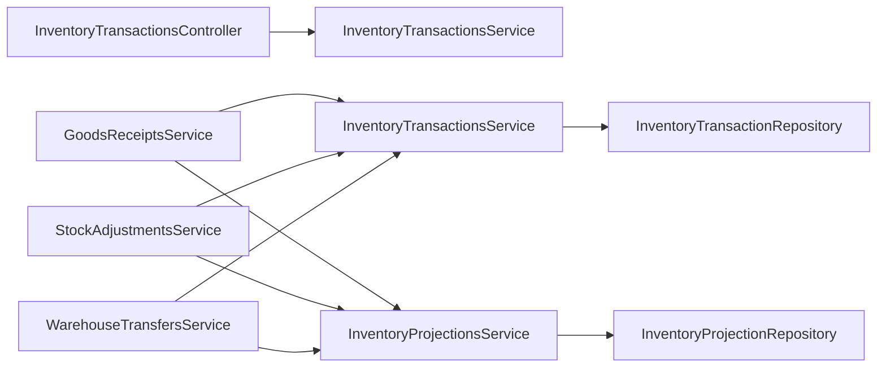

# Stock Transactions

<cite>
**Referenced Files in This Document**
- [inventory-transactions.controller.ts](file://apps/api/src/inventory-transactions/inventory-transactions.controller.ts)
- [inventory-transactions.service.ts](file://apps/api/src/inventory-transactions/inventory-transactions.service.ts)
- [create-inventory-transaction.dto.ts](file://apps/api/src/inventory-transactions/create-inventory-transaction.dto.ts)
- [goods-receipts.service.ts](file://apps/api/src/goods-receipts/goods-receipts.service.ts)
- [stock-adjustments.service.ts](file://apps/api/src/stock-adjustments/stock-adjustments.service.ts)
- [warehouse-transfers.service.ts](file://apps/api/src/warehouse-transfers/warehouse-transfers.service.ts)
- [inventory-projections.service.ts](file://apps/api/src/inventory-projections/inventory-projections.service.ts)
- [0005-transaction-types.md](file://docs/rfcs/0005-transaction-types.md)
- [0003-inventory-ledger.md](file://docs/rfcs/0003-inventory-ledger.md)
- [inventory-transaction.ts](file://packages/inventory/src/ledger/inventory-transaction.ts)
- [calculate-inventory-projection.ts](file://packages/inventory/src/projection/calculate-inventory-projection.ts)
- [update-inventory-projections.ts](file://packages/inventory/src/projection/update-inventory-projections.ts)
- [page.tsx](file://apps/web/app/transactions/[id]/page.tsx)
</cite>

## Table of Contents
1. Introduction
2. Project Structure
3. Core Components
4. Architecture Overview
5. Detailed Component Analysis
6. Dependency Analysis
7. Performance Considerations
8. Troubleshooting Guide
9. Conclusion

## Introduction
This document explains Ananya ERP’s Stock Transaction system: the immutable inventory ledger, canonical transaction types, and how business workflows create stock movements. It covers receipts, issues, adjustments, and transfers; validation rules; inventory projection calculations; real-time stock level updates via projections; API endpoints for creating and querying transactions; and examples for multi-location flows and extensibility.

## Project Structure
The Stock Transaction system is implemented across several modules:
- Inventory Ledger: core domain model and repository interfaces in the inventory package
- API Controllers and Services: NestJS controllers/services that expose endpoints and orchestrate workflows
- Projections: services to compute current inventory state from the ledger
- Business Workflows: Goods Receipts, Stock Adjustments, Warehouse Transfers that post ledger entries

**Diagram sources**
- [inventory-transactions.controller.ts:14-52](file://apps/api/src/inventory-transactions/inventory-transactions.controller.ts#L14-L52)
- [goods-receipts.service.ts:42-116](file://apps/api/src/goods-receipts/goods-receipts.service.ts#L42-L116)
- [stock-adjustments.service.ts:27-121](file://apps/api/src/stock-adjustments/stock-adjustments.service.ts#L27-L121)
- [warehouse-transfers.service.ts:135-199](file://apps/api/src/warehouse-transfers/warehouse-transfers.service.ts#L135-L199)
- [inventory-transaction.ts:53-156](file://packages/inventory/src/ledger/inventory-transaction.ts#L53-L156)
- [inventory-projections.service.ts:20-44](file://apps/api/src/inventory-projections/inventory-projections.service.ts#L20-L44)

**Section sources**
- [inventory-transactions.controller.ts:14-52](file://apps/api/src/inventory-transactions/inventory-transactions.controller.ts#L14-L52)
- [inventory-transactions.service.ts:19-42](file://apps/api/src/inventory-transactions/inventory-transactions.service.ts#L19-L42)
- [goods-receipts.service.ts:42-116](file://apps/api/src/goods-receipts/goods-receipts.service.ts#L42-L116)
- [stock-adjustments.service.ts:27-121](file://apps/api/src/stock-adjustments/stock-adjustments.service.ts#L27-L121)
- [warehouse-transfers.service.ts:31-199](file://apps/api/src/warehouse-transfers/warehouse-transfers.service.ts#L31-L199)
- [inventory-projections.service.ts:20-44](file://apps/api/src/inventory-projections/inventory-projections.service.ts#L20-L44)

## Core Components
- InventoryTransaction aggregate: immutable record of a single inventory movement with validated fields and type-specific location rules.
- InventoryTransactionsService: gateway to create and query ledger entries, enforcing component lifecycle constraints before saving.
- InventoryProjectionsService: reads/writes projections and triggers rebuilds after changes.
- Workflow services: GoodsReceiptsService, StockAdjustmentsService, WarehouseTransfersService post ledger entries and update projections.

Key responsibilities:
- Validation at creation time (quantity > 0, valid transaction type, required fields).
- Location semantics per transaction type (source vs destination).
- Auditability through immutable ledger entries.
- Deterministic projection calculation from the ledger.

**Section sources**
- [inventory-transaction.ts:53-156](file://packages/inventory/src/ledger/inventory-transaction.ts#L53-L156)
- [inventory-transactions.service.ts:19-42](file://apps/api/src/inventory-transactions/inventory-transactions.service.ts#L19-L42)
- [inventory-projections.service.ts:20-44](file://apps/api/src/inventory-projections/inventory-projections.service.ts#L20-L44)

## Architecture Overview
The system follows an event-sourced ledger design:
- Business workflows create immutable InventoryTransaction records.
- Projections are derived deterministically from the ledger.
- Real-time stock levels are served from projections; rebuilds occur after significant changes.

**Diagram sources**
- [inventory-transactions.controller.ts:18-21](file://apps/api/src/inventory-transactions/inventory-transactions.controller.ts#L18-L21)
- [inventory-transactions.service.ts:19-32](file://apps/api/src/inventory-transactions/inventory-transactions.service.ts#L19-L32)
- [inventory-projections.service.ts:38-44](file://apps/api/src/inventory-projections/inventory-projections.service.ts#L38-L44)

## Detailed Component Analysis

### Transaction Data Model and Validation
- Fields include componentId, quantity, unitOfMeasure, optional sourceLocationId and destinationLocationId, transactionType, reference, reason, createdBy, createdAt.
- Validation enforces:
  - Positive quantity
  - Valid transaction type from the canonical set
  - Required componentId
  - Type-specific location requirements (e.g., Receipt uses destination; Issue uses source; Transfer uses both)
- The aggregate owns identity generation and timestamps; rehydration bypasses validation for persistence.

**Diagram sources**
- [inventory-transaction.ts:35-47](file://packages/inventory/src/ledger/inventory-transaction.ts#L35-L47)
- [inventory-transaction.ts:53-156](file://packages/inventory/src/ledger/inventory-transaction.ts#L53-L156)

**Section sources**
- [inventory-transaction.ts:53-156](file://packages/inventory/src/ledger/inventory-transaction.ts#L53-L156)
- [create-inventory-transaction.dto.ts:4-36](file://apps/api/src/inventory-transactions/create-inventory-transaction.dto.ts#L4-L36)

### Canonical Transaction Types
Defined by RFC and enforced in the domain:
- Receipt: inbound inventory
- Issue: outbound inventory
- Transfer: internal movement between locations
- Adjustment: administrative correction
- Return: inventory returning from a previous issue
- Consumption: consumed during a process
- Production: created by consuming other inventory

Classification:
- Inbound: Receipt, Return
- Outbound: Issue, Consumption
- Internal: Transfer, Adjustment, Production

**Section sources**
- [0005-transaction-types.md:66-182](file://docs/rfcs/0005-transaction-types.md#L66-L182)

### Audit Trail and Immutability
- Every movement is recorded as an immutable ledger entry.
- History is never rewritten; corrections use compensating transactions.
- UI surfaces audit details including recorded timestamp and author.

**Section sources**
- [0003-inventory-ledger.md:175-218](file://docs/rfcs/0003-inventory-ledger.md#L175-L218)
- [page.tsx:306-342](file://apps/web/app/transactions/[id]/page.tsx#L306-L342)

### Lifecycle: Receipts
- GoodsReceiptsService validates receiving quantities against PO outstanding amounts.
- On create or post, it posts Receipt transactions to the ledger for each line and updates PO status.
- After posting, projections are rebuilt.

**Diagram sources**
- [goods-receipts.service.ts:42-116](file://apps/api/src/goods-receipts/goods-receipts.service.ts#L42-L116)
- [goods-receipts.service.ts:146-180](file://apps/api/src/goods-receipts/goods-receipts.service.ts#L146-L180)

**Section sources**
- [goods-receipts.service.ts:42-116](file://apps/api/src/goods-receipts/goods-receipts.service.ts#L42-L116)
- [goods-receipts.service.ts:146-180](file://apps/api/src/goods-receipts/goods-receipts.service.ts#L146-L180)

### Lifecycle: Issues
- Warehouse transfer dispatch posts Issue transactions from the source location.
- Other outbound workflows can also post Issue transactions directly.

**Diagram sources**
- [warehouse-transfers.service.ts:135-169](file://apps/api/src/warehouse-transfers/warehouse-transfers.service.ts#L135-L169)

**Section sources**
- [warehouse-transfers.service.ts:135-169](file://apps/api/src/warehouse-transfers/warehouse-transfers.service.ts#L135-L169)

### Lifecycle: Adjustments
- StockAdjustmentsService creates pending adjustments and, upon approval, posts Adjustment transactions:
  - Increase: destination location
  - Decrease: source location
- Projections are rebuilt after approval.

**Diagram sources**
- [stock-adjustments.service.ts:27-121](file://apps/api/src/stock-adjustments/stock-adjustments.service.ts#L27-L121)

**Section sources**
- [stock-adjustments.service.ts:27-121](file://apps/api/src/stock-adjustments/stock-adjustments.service.ts#L27-L121)

### Lifecycle: Transfers
- Create/Update/Draft management ensures valid headers and lines.
- Dispatch posts Issue from source; Receive posts Receipt to destination.
- Canceling a dispatched transfer posts compensating Receipt back to source.

**Diagram sources**
- [warehouse-transfers.service.ts:135-199](file://apps/api/src/warehouse-transfers/warehouse-transfers.service.ts#L135-L199)
- [warehouse-transfers.service.ts:201-229](file://apps/api/src/warehouse-transfers/warehouse-transfers.service.ts#L201-L229)

**Section sources**
- [warehouse-transfers.service.ts:31-229](file://apps/api/src/warehouse-transfers/warehouse-transfers.service.ts#L31-L229)

### Inventory Projection Calculations
- Projections are calculated by scanning relevant transactions and applying type-specific effects:
  - Receipt, Return, Production increase quantity
  - Issue, Consumption decrease quantity
  - Transfer affects only the specific location (outbound decreases, inbound increases)
  - Adjustment adds signed quantity
- Projections are stored and can be rebuilt entirely or updated incrementally.

**Diagram sources**
- [calculate-inventory-projection.ts:37-92](file://packages/inventory/src/projection/calculate-inventory-projection.ts#L37-L92)
- [update-inventory-projections.ts:15-49](file://packages/inventory/src/projection/update-inventory-projections.ts#L15-L49)

**Section sources**
- [calculate-inventory-projection.ts:37-92](file://packages/inventory/src/projection/calculate-inventory-projection.ts#L37-L92)
- [update-inventory-projections.ts:15-49](file://packages/inventory/src/projection/update-inventory-projections.ts#L15-L49)
- [inventory-projections.service.ts:20-44](file://apps/api/src/inventory-projections/inventory-projections.service.ts#L20-L44)

### API Endpoints
- Create inventory transaction
  - POST /inventory-transactions
  - Body: CreateInventoryTransactionDto (componentId, quantity, unitOfMeasure, optional sourceLocationId/destinationLocationId, transactionType, reference, reason, createdBy)
- Query transactions
  - GET /inventory-transactions
  - Query params: componentId, locationId, transactionType, reference, createdBy, search
- Get transaction by ID
  - GET /inventory-transactions/:id

Notes:
- Controller delegates to service which enforces component usability and persists via repository.
- Projections are not automatically rebuilt by this endpoint; workflow services trigger rebuilds after posting.

**Section sources**
- [inventory-transactions.controller.ts:14-52](file://apps/api/src/inventory-transactions/inventory-transactions.controller.ts#L14-L52)
- [create-inventory-transaction.dto.ts:4-36](file://apps/api/src/inventory-transactions/create-inventory-transaction.dto.ts#L4-L36)
- [inventory-transactions.service.ts:19-42](file://apps/api/src/inventory-transactions/inventory-transactions.service.ts#L19-L42)

### Examples and Multi-Location Scenarios
- Receipt example: Goods receipt posts Receipt to destination location and updates PO.
- Issue example: Transfer dispatch posts Issue from source location.
- Adjustment example: Approval posts Adjustment to source or destination based on sign of difference.
- Transfer example: Two-step flow with Issue then Receipt across locations; cancellation posts compensating Receipt.

These scenarios demonstrate multi-location handling using sourceLocationId and destinationLocationId consistently across workflows.

**Section sources**
- [goods-receipts.service.ts:86-116](file://apps/api/src/goods-receipts/goods-receipts.service.ts#L86-L116)
- [warehouse-transfers.service.ts:150-199](file://apps/api/src/warehouse-transfers/warehouse-transfers.service.ts#L150-L199)
- [stock-adjustments.service.ts:83-118](file://apps/api/src/stock-adjustments/stock-adjustments.service.ts#L83-L118)

### Custom Transaction Workflows
To implement a custom workflow:
- Use InventoryTransactionsService.create with appropriate transactionType and location fields.
- Ensure business validations precede posting (e.g., availability checks).
- Trigger InventoryProjectionsService.rebuild() after committing changes to keep projections consistent.
- Follow RFC-0005 to reuse canonical transaction types rather than introducing new ones.

**Section sources**
- [inventory-transactions.service.ts:19-32](file://apps/api/src/inventory-transactions/inventory-transactions.service.ts#L19-L32)
- [inventory-projections.service.ts:38-44](file://apps/api/src/inventory-projections/inventory-projections.service.ts#L38-L44)
- [0005-transaction-types.md:185-210](file://docs/rfcs/0005-transaction-types.md#L185-L210)

## Dependency Analysis
- Controllers depend on services for business logic.
- Services depend on repositories and shared domain functions from the inventory package.
- Projections depend on transaction history; any mutation should trigger rebuilds.
- Cross-module dependencies:
  - GoodsReceiptsService depends on PurchaseOrdersService and InventoryProjectionsService.
  - WarehouseTransfersService and StockAdjustmentsService depend on InventoryTransactionsService and InventoryProjectionsService.

**Diagram sources**
- [inventory-transactions.controller.ts:14-52](file://apps/api/src/inventory-transactions/inventory-transactions.controller.ts#L14-L52)
- [goods-receipts.service.ts:27-40](file://apps/api/src/goods-receipts/goods-receipts.service.ts#L27-L40)
- [stock-adjustments.service.ts:18-25](file://apps/api/src/stock-adjustments/stock-adjustments.service.ts#L18-L25)
- [warehouse-transfers.service.ts:22-29](file://apps/api/src/warehouse-transfers/warehouse-transfers.service.ts#L22-L29)
- [inventory-projections.service.ts:11-18](file://apps/api/src/inventory-projections/inventory-projections.service.ts#L11-L18)

**Section sources**
- [inventory-transactions.controller.ts:14-52](file://apps/api/src/inventory-transactions/inventory-transactions.controller.ts#L14-L52)
- [goods-receipts.service.ts:27-40](file://apps/api/src/goods-receipts/goods-receipts.service.ts#L27-L40)
- [stock-adjustments.service.ts:18-25](file://apps/api/src/stock-adjustments/stock-adjustments.service.ts#L18-L25)
- [warehouse-transfers.service.ts:22-29](file://apps/api/src/warehouse-transfers/warehouse-transfers.service.ts#L22-L29)
- [inventory-projections.service.ts:11-18](file://apps/api/src/inventory-projections/inventory-projections.service.ts#L11-L18)

## Performance Considerations
- Projections enable fast reads of current stock levels without recalculating from scratch.
- Rebuilds are triggered after significant mutations; consider batching or background jobs for large datasets.
- Incremental updates can be used when available to minimize full rebuilds.
- Keep transaction payloads minimal and avoid unnecessary queries inside loops.

[No sources needed since this section provides general guidance]

## Troubleshooting Guide
Common issues and resolutions:
- Invalid quantity: ensure quantity > 0; domain rejects non-positive values.
- Invalid transaction type: use canonical types defined in RFC-0005.
- Component lifecycle guard: consolidated components cannot receive new stock; route to surviving component.
- Status guards: workflow states restrict actions (e.g., cannot approve non-PENDING adjustments; cannot cancel RECEIVED transfers).
- Missing projections: call rebuild after posting transactions to ensure consistency.

**Section sources**
- [inventory-transaction.ts:53-64](file://packages/inventory/src/ledger/inventory-transaction.ts#L53-L64)
- [inventory-transactions.service.ts:22-28](file://apps/api/src/inventory-transactions/inventory-transactions.service.ts#L22-L28)
- [stock-adjustments.service.ts:70-79](file://apps/api/src/stock-adjustments/stock-adjustments.service.ts#L70-L79)
- [warehouse-transfers.service.ts:201-208](file://apps/api/src/warehouse-transfers/warehouse-transfers.service.ts#L201-L208)
- [inventory-projections.service.ts:38-44](file://apps/api/src/inventory-projections/inventory-projections.service.ts#L38-L44)

## Conclusion
Ananya’s Stock Transaction system centers on an immutable ledger with canonical transaction types and deterministic projections. Business workflows like goods receipts, adjustments, and transfers post standardized ledger entries, ensuring auditability and consistency. APIs provide straightforward creation and querying, while projections deliver real-time stock visibility. Extending the system involves adhering to the established patterns: validate inputs, post canonical transactions, and rebuild projections to maintain accurate inventory state.