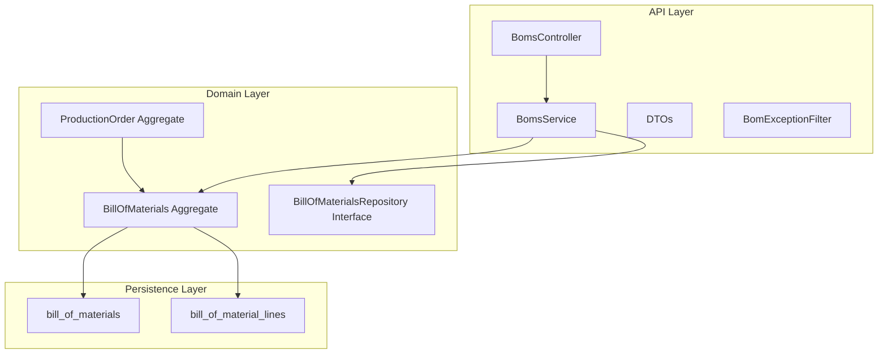
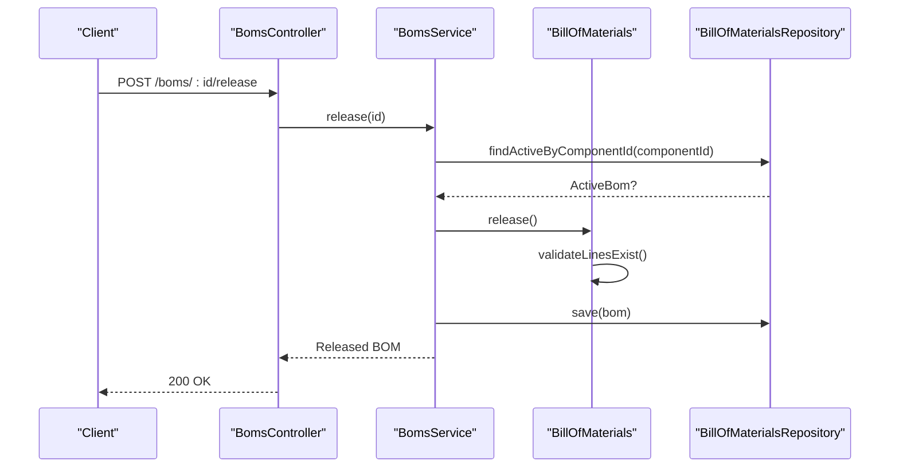
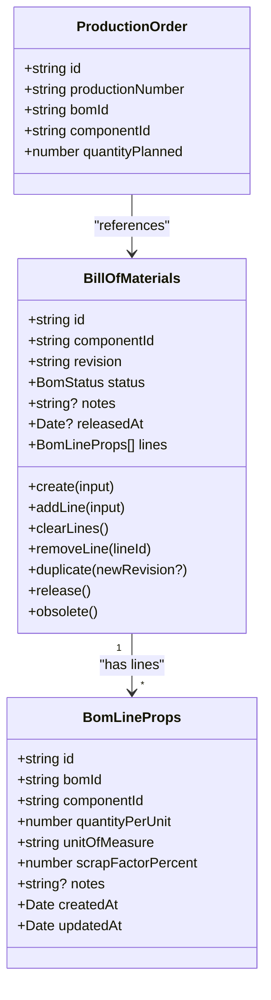
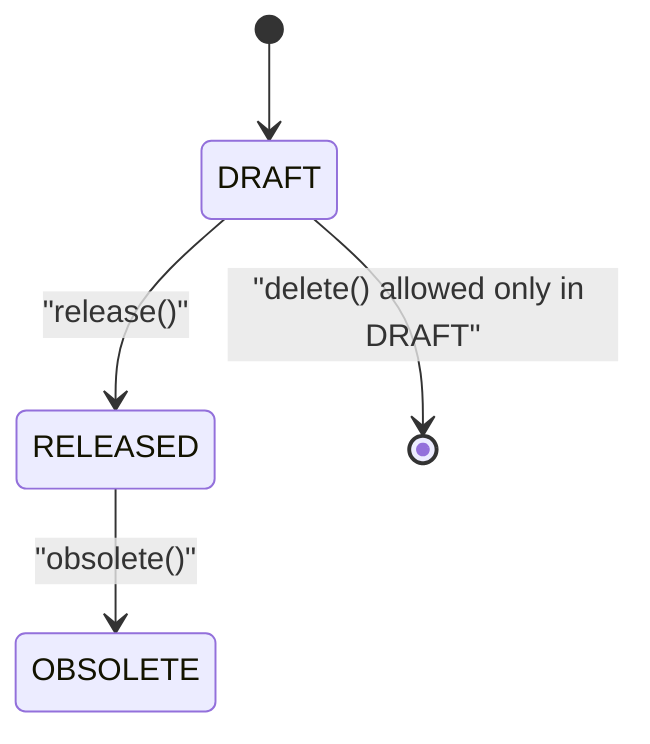
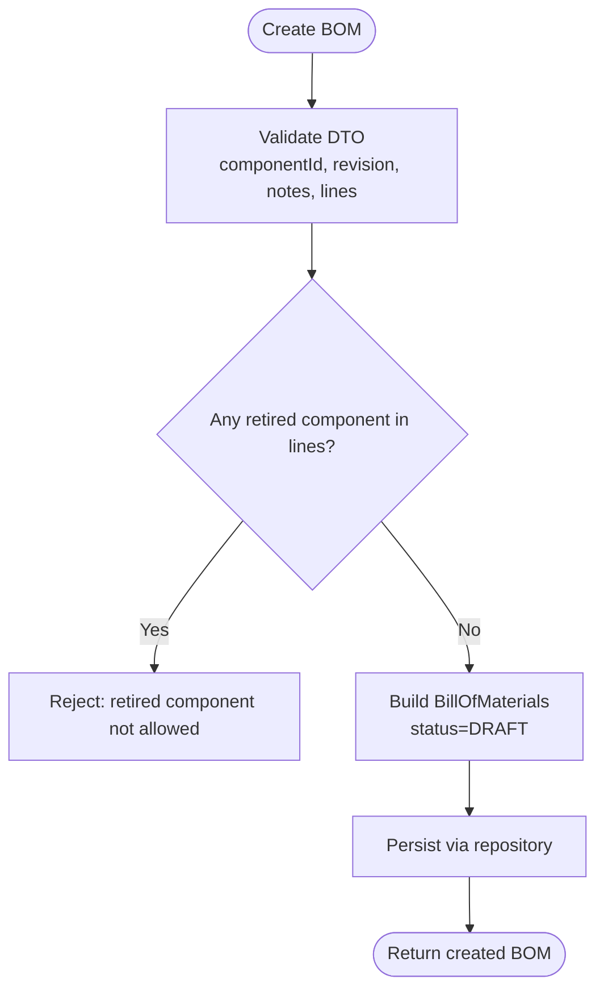
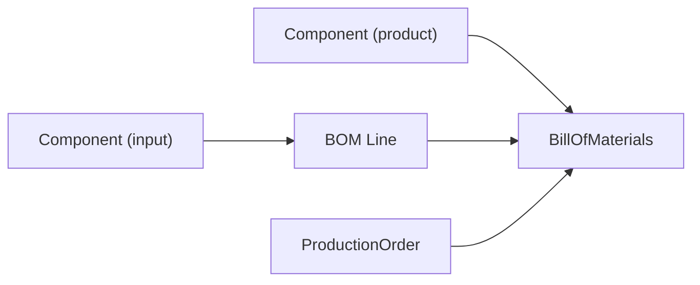
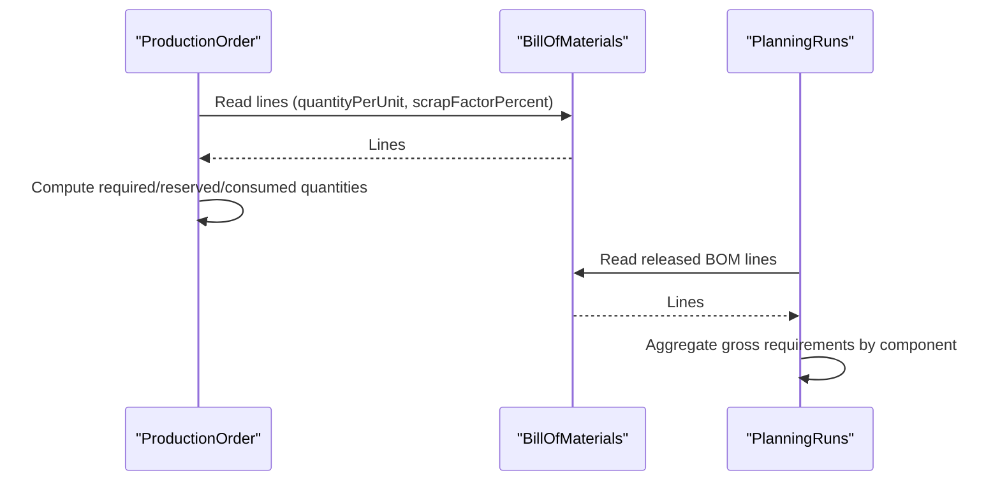
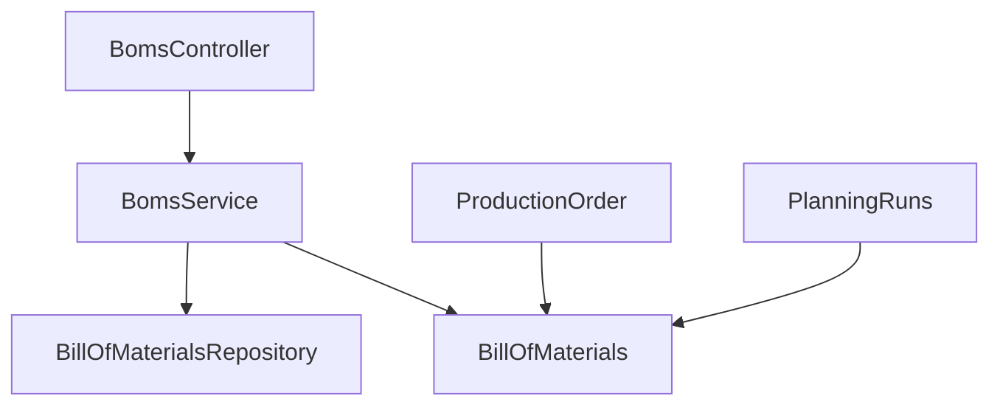
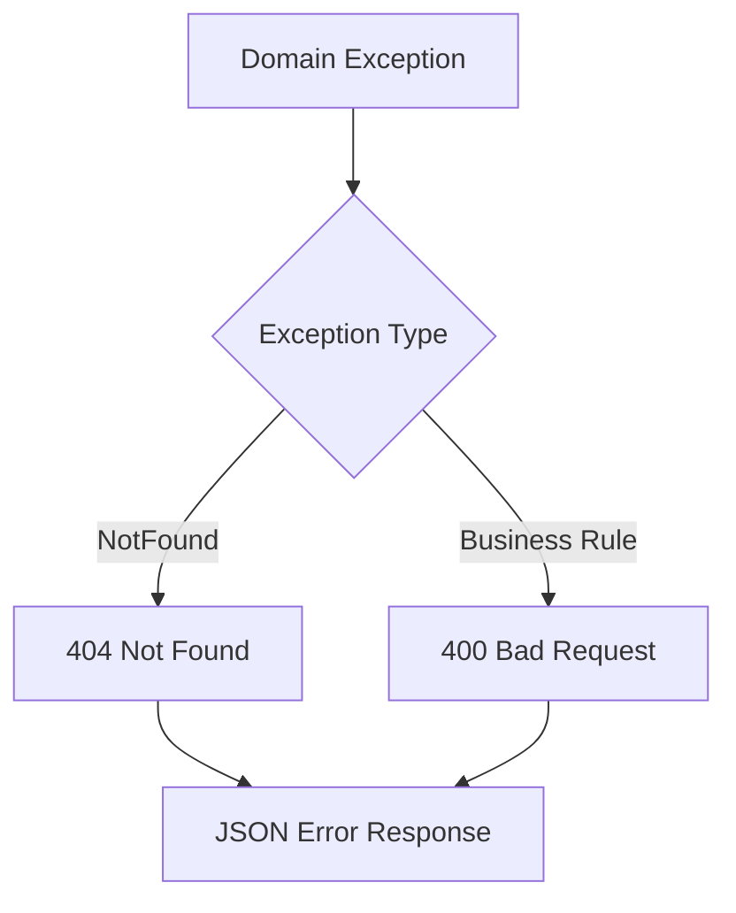

# Bill of Materials (BOM)

<cite>
**Referenced Files in This Document**
- [boms.controller.ts](file://apps/api/src/boms/boms.controller.ts)
- [boms.service.ts](file://apps/api/src/boms/boms.service.ts)
- [dtos.ts](file://apps/api/src/boms/dtos.ts)
- [bom-exception.filter.ts](file://apps/api/src/boms/bom-exception.filter.ts)
- [bill-of-materials.ts](file://packages/manufacturing/src/boms/bill-of-materials.ts)
- [bill-of-materials.repository.ts](file://packages/manufacturing/src/boms/bill-of-materials.repository.ts)
- [production-order.ts](file://packages/manufacturing/src/production-orders/production-order.ts)
- [production-orders.service.ts](file://apps/api/src/production-orders/production-orders.service.ts)
- [planning-runs.service.ts](file://apps/api/src/planning-runs/planning-runs.service.ts)
- [0016-bill-of-materials.md](file://docs/rfcs/0016-bill-of-materials.md)
- [bill-of-materials.ts](file://packages/database/src/schema/bill-of-materials.ts)
</cite>

## Table of Contents
1. [Introduction](#introduction)
2. [Project Structure](#project-structure)
3. [Core Components](#core-components)
4. [Architecture Overview](#architecture-overview)
5. [Detailed Component Analysis](#detailed-component-analysis)
6. [Dependency Analysis](#dependency-analysis)
7. [Performance Considerations](#performance-considerations)
8. [Troubleshooting Guide](#troubleshooting-guide)
9. [Conclusion](#conclusion)

## Introduction
This document explains the Bill of Materials (BOM) management in Ananya ERP. It covers the BOM data model, parent-child relationships through component references, revision control, and lifecycle states from creation to obsolescence. It also documents API endpoints for creating, updating, duplicating, adding/removing lines, releasing, and obsoleting BOM revisions, along with validation rules, versioning strategies, and integration points with components, manufacturers, and production orders.

## Project Structure
The BOM feature spans three layers:
- API layer: NestJS controller, service, DTOs, and exception filter
- Domain layer: Manufacturing package defining the BOM aggregate, repository interface, and related entities
- Persistence layer: Database schema definitions for BOM headers and lines

**Diagram sources**
- [boms.controller.ts:22-83](file://apps/api/src/boms/boms.controller.ts#L22-L83)
- [boms.service.ts:23-159](file://apps/api/src/boms/boms.service.ts#L23-L159)
- [bill-of-materials.ts:51-337](file://packages/manufacturing/src/boms/bill-of-materials.ts#L51-L337)
- [bill-of-materials.repository.ts:8-23](file://packages/manufacturing/src/boms/bill-of-materials.repository.ts#L8-L23)
- [production-order.ts:29-47](file://packages/manufacturing/src/production-orders/production-order.ts#L29-L47)
- [bill-of-materials.ts:13-35](file://packages/database/src/schema/bill-of-materials.ts#L13-L35)
- [bill-of-materials.ts:37-74](file://packages/database/src/schema/bill-of-materials.ts#L37-L74)

**Section sources**
- [boms.controller.ts:22-83](file://apps/api/src/boms/boms.controller.ts#L22-L83)
- [boms.service.ts:23-159](file://apps/api/src/boms/boms.service.ts#L23-L159)
- [bill-of-materials.ts:51-337](file://packages/manufacturing/src/boms/bill-of-materials.ts#L51-L337)
- [bill-of-materials.repository.ts:8-23](file://packages/manufacturing/src/boms/bill-of-materials.repository.ts#L8-L23)
- [production-order.ts:29-47](file://packages/manufacturing/src/production-orders/production-order.ts#L29-L47)
- [bill-of-materials.ts:13-35](file://packages/database/src/schema/bill-of-materials.ts#L13-L35)
- [bill-of-materials.ts:37-74](file://packages/database/src/schema/bill-of-materials.ts#L37-L74)

## Core Components
- BOM aggregate: Encapsulates header fields (componentId, revision, status, notes), line items, and state transitions. Enforces immutability after release and validates line-level invariants.
- Repository interface: Defines queries for finding by id, active released BOM per component, revisions by component, filtering, saving, and deleting.
- API controller/service: Exposes REST endpoints and orchestrates domain operations, including validation against retired components and uniqueness constraints on active released BOMs.
- DTOs: Validate input payloads for create, update, duplicate, and line operations.
- Production order: References a specific BOM and uses its lines to calculate material requirements.
- Planning runs: Use released BOM lines to compute gross requirements including scrap factors.

Key responsibilities:
- Create/update/duplicate BOMs with strict status checks
- Add/remove lines with quantity and scrap factor validation
- Release only one active BOM per product component
- Obsolete released BOMs
- Integrate with production orders and planning to drive material requirements

**Section sources**
- [bill-of-materials.ts:51-337](file://packages/manufacturing/src/boms/bill-of-materials.ts#L51-L337)
- [bill-of-materials.repository.ts:8-23](file://packages/manufacturing/src/boms/bill-of-materials.repository.ts#L8-L23)
- [boms.controller.ts:22-83](file://apps/api/src/boms/boms.controller.ts#L22-L83)
- [boms.service.ts:30-159](file://apps/api/src/boms/boms.service.ts#L30-L159)
- [dtos.ts:12-71](file://apps/api/src/boms/dtos.ts#L12-L71)
- [production-order.ts:29-47](file://packages/manufacturing/src/production-orders/production-order.ts#L29-L47)
- [planning-runs.service.ts:200-216](file://apps/api/src/planning-runs/planning-runs.service.ts#L200-L216)

## Architecture Overview
The BOM architecture follows a layered design:
- Controller handles HTTP requests and delegates to the service
- Service applies business rules, calls domain aggregate methods, and persists via repository
- Domain aggregate enforces invariants and state transitions
- Production orders and planning consume BOM data to plan and execute manufacturing

**Diagram sources**
- [boms.controller.ts:70-73](file://apps/api/src/boms/boms.controller.ts#L70-L73)
- [boms.service.ts:126-143](file://apps/api/src/boms/boms.service.ts#L126-L143)
- [bill-of-materials.ts:315-325](file://packages/manufacturing/src/boms/bill-of-materials.ts#L315-L325)
- [bill-of-materials.repository.ts:8-12](file://packages/manufacturing/src/boms/bill-of-materials.repository.ts#L8-L12)

## Detailed Component Analysis

### BOM Data Model and Relationships
- Header: Links a finished product or sub-assembly via componentId, tracks revision string, status, optional notes, and release timestamp.
- Lines: Each line references a componentId, defines quantityPerUnit, unitOfMeasure, scrapFactorPercent, and optional notes.
- Parent-child relationship: A BOM is defined for a component; lines reference other components that are consumed to produce the parent. Multi-level hierarchies are supported by referencing components that themselves have BOMs.
- Versioning: Revision strings follow a major.minor pattern with automatic increment when duplicating. The first revision defaults to v1.0 if not provided.

**Diagram sources**
- [bill-of-materials.ts:13-35](file://packages/manufacturing/src/boms/bill-of-materials.ts#L13-L35)
- [bill-of-materials.ts:51-337](file://packages/manufacturing/src/boms/bill-of-materials.ts#L51-L337)
- [production-order.ts:29-47](file://packages/manufacturing/src/production-orders/production-order.ts#L29-L47)

**Section sources**
- [bill-of-materials.ts:51-337](file://packages/manufacturing/src/boms/bill-of-materials.ts#L51-L337)
- [production-order.ts:29-47](file://packages/manufacturing/src/production-orders/production-order.ts#L29-L47)

### BOM Lifecycle States
States and transitions:
- DRAFT: Initial editable state. Lines can be added, updated, or removed.
- RELEASED: Approved and immutable. Cannot be edited or deleted. Only one RELEASED BOM per component is allowed at any time.
- OBSOLETE: Marks a previously released BOM as no longer active.

**Diagram sources**
- [bill-of-materials.ts:315-333](file://packages/manufacturing/src/boms/bill-of-materials.ts#L315-L333)
- [boms.service.ts:152-158](file://apps/api/src/boms/boms.service.ts#L152-L158)

**Section sources**
- [bill-of-materials.ts:315-333](file://packages/manufacturing/src/boms/bill-of-materials.ts#L315-L333)
- [boms.service.ts:152-158](file://apps/api/src/boms/boms.service.ts#L152-L158)

### API Endpoints and Operations
Endpoints exposed by the BOM controller:
- POST /boms: Create a new draft BOM with optional lines
- GET /boms: List BOMs filtered by componentId and/or status
- GET /boms/revisions/:componentId: Retrieve all revisions for a component
- GET /boms/:id: Get a specific BOM
- PUT /boms/:id: Update header and/or replace lines (only in DRAFT)
- POST /boms/:id/duplicate: Duplicate a BOM into a new revision
- POST /boms/:id/lines: Add a line to an existing BOM
- DELETE /boms/:id/lines/:lineId: Remove a line from an existing BOM
- POST /boms/:id/release: Transition to RELEASED (enforces single active per component)
- POST /boms/:id/obsolete: Transition to OBSOLETE
- DELETE /boms/:id: Delete only if DRAFT

Validation and guards:
- Retired components cannot be added to new BOM lines
- Quantity must be positive; scrap factor must be non-negative
- Duplicate component lines are forbidden
- Circular dependency (BOM consuming itself) is forbidden
- Only one RELEASED BOM per component is allowed

**Diagram sources**
- [boms.controller.ts:27-30](file://apps/api/src/boms/boms.controller.ts#L27-L30)
- [boms.service.ts:30-50](file://apps/api/src/boms/boms.service.ts#L30-L50)
- [dtos.ts:35-53](file://apps/api/src/boms/dtos.ts#L35-L53)

**Section sources**
- [boms.controller.ts:22-83](file://apps/api/src/boms/boms.controller.ts#L22-L83)
- [boms.service.ts:30-159](file://apps/api/src/boms/boms.service.ts#L30-L159)
- [dtos.ts:12-71](file://apps/api/src/boms/dtos.ts#L12-L71)

### Practical Examples
- Defining a product structure:
  - Create a BOM for a finished component with revision v1.0 and add multiple component lines specifying quantities and optional scrap factors.
- Adding material lines:
  - For each line, provide componentId, quantityPerUnit, optional unitOfMeasure, optional scrapFactorPercent, and optional notes.
- Setting quantities:
  - Ensure quantityPerUnit > 0; set scrapFactorPercent >= 0 to account for expected loss during manufacturing.
- Managing versions:
  - Duplicate an existing BOM to create a new revision; optionally specify a new revision string. The system increments minor version automatically if not provided.

These examples align with the DTOs and domain methods used by the API.

**Section sources**
- [dtos.ts:12-71](file://apps/api/src/boms/dtos.ts#L12-L71)
- [bill-of-materials.ts:74-89](file://packages/manufacturing/src/boms/bill-of-materials.ts#L74-L89)
- [bill-of-materials.ts:284-313](file://packages/manufacturing/src/boms/bill-of-materials.ts#L284-L313)

### Relationship Between BOMs, Components, Manufacturers, and Production Orders
- Components: BOM header links to a componentId representing the product being built; lines reference componentIds of inputs.
- Manufacturers: While BOMs do not directly store manufacturer information, components carry manufacturer associations elsewhere in the system; BOM lines inherit component attributes indirectly through component references.
- Production orders: A production order references a specific BOM (bomId) and uses its lines to calculate required quantities, including scrap factors, for planning and execution.

**Diagram sources**
- [bill-of-materials.ts:25-35](file://packages/manufacturing/src/boms/bill-of-materials.ts#L25-L35)
- [bill-of-materials.ts:13-23](file://packages/manufacturing/src/boms/bill-of-materials.ts#L13-L23)
- [production-order.ts:29-47](file://packages/manufacturing/src/production-orders/production-order.ts#L29-L47)

**Section sources**
- [bill-of-materials.ts:25-35](file://packages/manufacturing/src/boms/bill-of-materials.ts#L25-L35)
- [bill-of-materials.ts:13-23](file://packages/manufacturing/src/boms/bill-of-materials.ts#L13-L23)
- [production-order.ts:29-47](file://packages/manufacturing/src/production-orders/production-order.ts#L29-L47)

### Validation Rules and Invariants
- Status-based mutability:
  - Only DRAFT BOMs can be updated or deleted.
  - Release requires at least one line.
  - Obsolete requires current status to be RELEASED.
- Line invariants:
  - quantityPerUnit must be strictly positive.
  - scrapFactorPercent must be non-negative.
  - No duplicate component lines.
  - No circular dependency (a BOM cannot consume itself).
- Business rule:
  - Only one RELEASED BOM per component is allowed at any time.

These rules are enforced in the domain aggregate and application service.

**Section sources**
- [bill-of-materials.ts:99-136](file://packages/manufacturing/src/boms/bill-of-materials.ts#L99-L136)
- [bill-of-materials.ts:315-333](file://packages/manufacturing/src/boms/bill-of-materials.ts#L315-L333)
- [boms.service.ts:52-77](file://apps/api/src/boms/boms.service.ts#L52-L77)
- [boms.service.ts:126-143](file://apps/api/src/boms/boms.service.ts#L126-L143)

### Versioning Strategies and Change Management
- Default revision: v1.0 when not specified.
- Automatic increment: When duplicating without a new revision, the system increments the minor version (e.g., v1.0 → v1.1).
- Custom revision: You may supply a new revision string when duplicating.
- Change process:
  - Edit in DRAFT until ready.
  - Release to lock the version and make it active for production.
  - If changes are needed later, duplicate to create a new revision and release that instead.

**Section sources**
- [bill-of-materials.ts:74-89](file://packages/manufacturing/src/boms/bill-of-materials.ts#L74-L89)
- [bill-of-materials.ts:284-313](file://packages/manufacturing/src/boms/bill-of-materials.ts#L284-L313)
- [0016-bill-of-materials.md:19-22](file://docs/rfcs/0016-bill-of-materials.md#L19-L22)

### Integration with Production Orders and Planning
- Production orders:
  - Reference a BOM by bomId.
  - Material requirements are calculated using BOM lines, including quantityPerUnit and scrapFactorPercent.
- Planning runs:
  - Use released BOM lines to compute gross requirements across demand, factoring in scrap.

**Diagram sources**
- [production-order.ts:29-47](file://packages/manufacturing/src/production-orders/production-order.ts#L29-L47)
- [production-orders.service.ts:146-184](file://apps/api/src/production-orders/production-orders.service.ts#L146-L184)
- [planning-runs.service.ts:200-216](file://apps/api/src/planning-runs/planning-runs.service.ts#L200-L216)

**Section sources**
- [production-orders.service.ts:146-184](file://apps/api/src/production-orders/production-orders.service.ts#L146-L184)
- [planning-runs.service.ts:200-216](file://apps/api/src/planning-runs/planning-runs.service.ts#L200-L216)

## Dependency Analysis
- Controller depends on service for orchestration.
- Service depends on domain aggregate and repository interface.
- Domain aggregate encapsulates all business rules and state transitions.
- Production orders depend on BOMs to determine material needs.
- Planning runs depend on released BOMs to compute requirements.

**Diagram sources**
- [boms.controller.ts:22-83](file://apps/api/src/boms/boms.controller.ts#L22-L83)
- [boms.service.ts:23-159](file://apps/api/src/boms/boms.service.ts#L23-L159)
- [bill-of-materials.ts:51-337](file://packages/manufacturing/src/boms/bill-of-materials.ts#L51-L337)
- [bill-of-materials.repository.ts:8-23](file://packages/manufacturing/src/boms/bill-of-materials.repository.ts#L8-L23)
- [production-order.ts:29-47](file://packages/manufacturing/src/production-orders/production-order.ts#L29-L47)
- [planning-runs.service.ts:200-216](file://apps/api/src/planning-runs/planning-runs.service.ts#L200-L216)

**Section sources**
- [boms.controller.ts:22-83](file://apps/api/src/boms/boms.controller.ts#L22-L83)
- [boms.service.ts:23-159](file://apps/api/src/boms/boms.service.ts#L23-L159)
- [bill-of-materials.ts:51-337](file://packages/manufacturing/src/boms/bill-of-materials.ts#L51-L337)
- [bill-of-materials.repository.ts:8-23](file://packages/manufacturing/src/boms/bill-of-materials.repository.ts#L8-L23)
- [production-order.ts:29-47](file://packages/manufacturing/src/production-orders/production-order.ts#L29-L47)
- [planning-runs.service.ts:200-216](file://apps/api/src/planning-runs/planning-runs.service.ts#L200-L216)

## Performance Considerations
- Indexes:
  - bill_of_materials has indexes on component_id and status to support efficient filtering and active BOM lookups.
  - bill_of_material_lines has indexes on bom_id and component_id to optimize line queries and component usage analysis.
- Query patterns:
  - Retrieving revisions by component and listing by status benefit from these indexes.
- Calculation efficiency:
  - Material requirement calculations multiply planned quantity by line quantity and scrap factor; keep BOM line counts reasonable to avoid heavy computations.

**Section sources**
- [bill-of-materials.ts:31-34](file://packages/database/src/schema/bill-of-materials.ts#L31-L34)
- [bill-of-materials.ts:70-73](file://packages/database/src/schema/bill-of-materials.ts#L70-L73)
- [production-orders.service.ts:146-184](file://apps/api/src/production-orders/production-orders.service.ts#L146-L184)
- [planning-runs.service.ts:200-216](file://apps/api/src/planning-runs/planning-runs.service.ts#L200-L216)

## Troubleshooting Guide
Common errors and their causes:
- Invalid status transition: Attempting to release from non-DRAFT or obsolete from non-RELEASED.
- Empty BOM: Trying to release a BOM with no lines.
- Immutable BOM: Editing a RELEASED or OBSOLETE BOM.
- Invalid line quantity: Non-positive quantity or negative scrap factor.
- Duplicate component line: Adding the same component twice in a BOM.
- Circular dependency: A BOM line referencing the same component as the BOM’s product.
- Active BOM already exists: Attempting to release another BOM for the same component while one is already RELEASED.

Error mapping:
- Domain exceptions map to HTTP 400 Bad Request via the exception filter.
- Not found maps to HTTP 404 Not Found.

**Diagram sources**
- [bom-exception.filter.ts:19-58](file://apps/api/src/boms/bom-exception.filter.ts#L19-L58)

**Section sources**
- [bom-exception.filter.ts:19-58](file://apps/api/src/boms/bom-exception.filter.ts#L19-L58)
- [bill-of-materials.ts:99-136](file://packages/manufacturing/src/boms/bill-of-materials.ts#L99-L136)
- [bill-of-materials.ts:315-333](file://packages/manufacturing/src/boms/bill-of-materials.ts#L315-L333)
- [boms.service.ts:126-143](file://apps/api/src/boms/boms.service.ts#L126-L143)

## Conclusion
Ananya ERP’s BOM module provides a robust, domain-driven approach to managing product structures. It enforces clear lifecycle states, strong validation rules, and safe versioning practices. Through tight integration with production orders and planning, BOMs drive accurate material requirements and enable controlled change management across the manufacturing process.