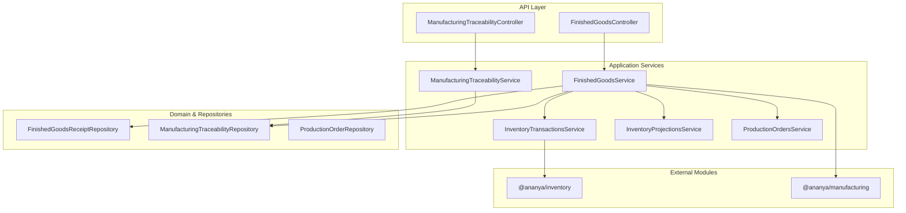
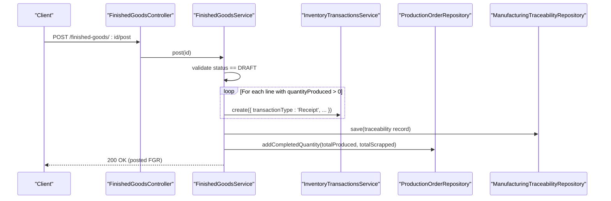
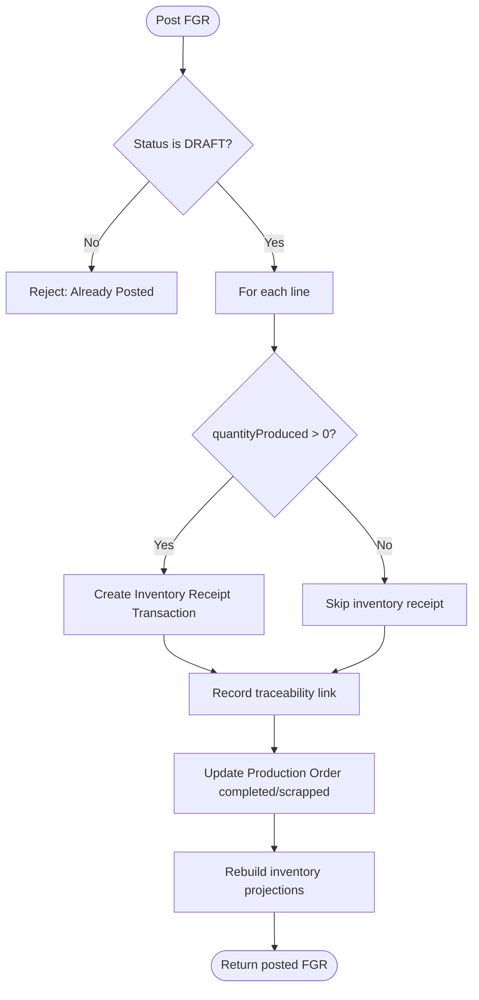
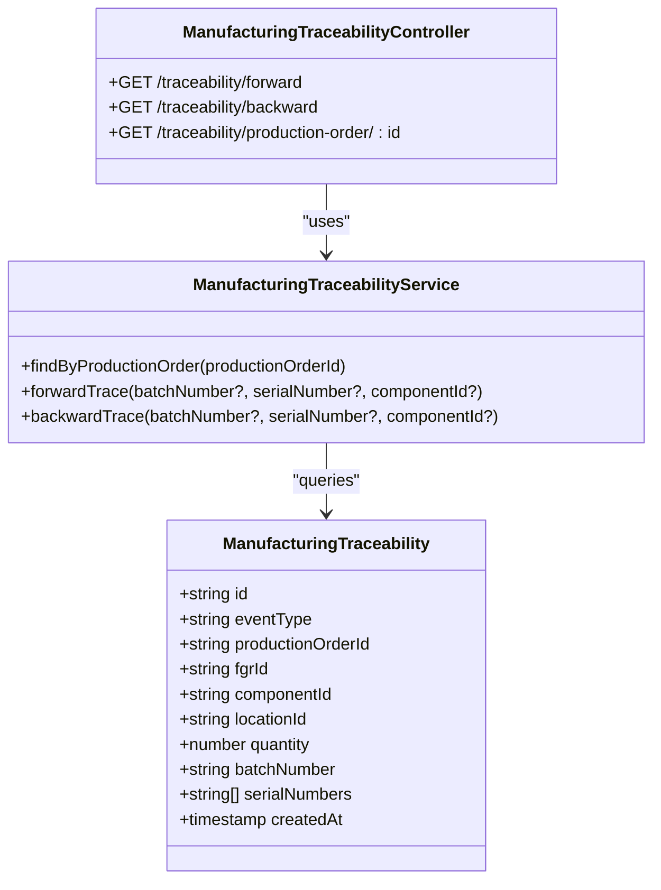
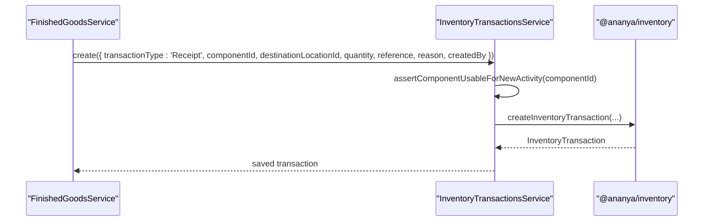
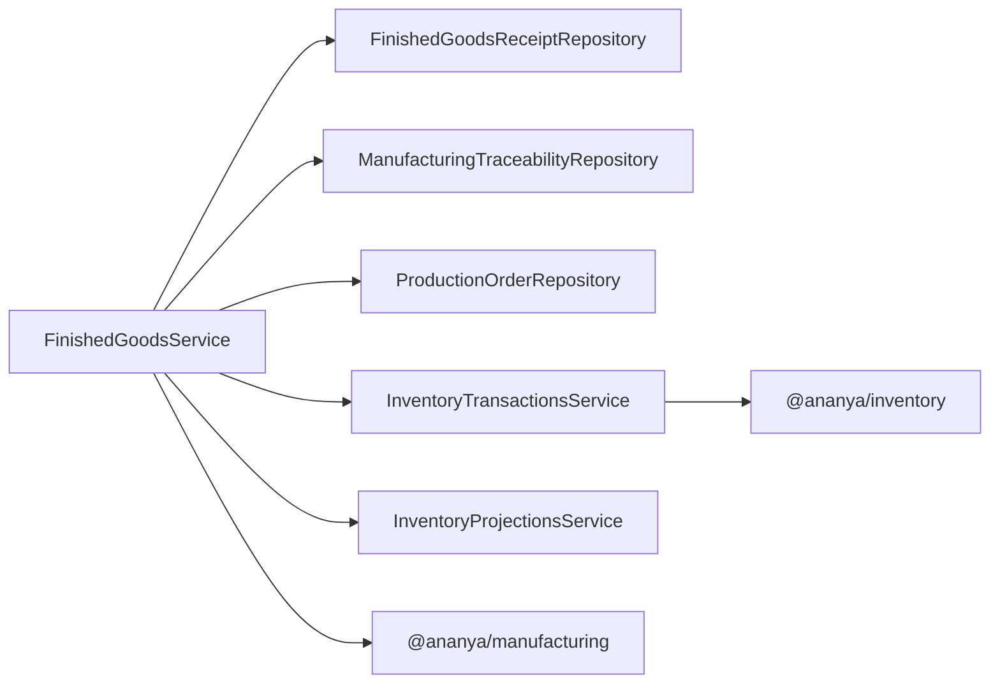

# Finished Goods Receipt

<cite>
**Referenced Files in This Document**
- [finished-goods.controller.ts](file://apps/api/src/finished-goods/finished-goods.controller.ts)
- [finished-goods.service.ts](file://apps/api/src/finished-goods/finished-goods.service.ts)
- [dtos.ts](file://apps/api/src/finished-goods/dtos.ts)
- [0019-finished-goods-receipt.md](file://docs/rfcs/0019-finished-goods-receipt.md)
- [0020-manufacturing-traceability.md](file://docs/rfcs/0020-manufacturing-traceability.md)
- [manufacturing-traceability.controller.ts](file://apps/api/src/manufacturing-traceability/manufacturing-traceability.controller.ts)
- [manufacturing-traceability.service.ts](file://apps/api/src/manufacturing-traceability/manufacturing-traceability.service.ts)
- [inventory-transactions.service.ts](file://apps/api/src/inventory-transactions/inventory-transactions.service.ts)
- [production-orders.service.ts](file://apps/api/src/production-orders/production-orders.service.ts)
- [page.tsx](file://apps/web/app/finished-goods/page.tsx)
</cite>

## Table of Contents
1. [Introduction](#introduction)
2. [Project Structure](#project-structure)
3. [Core Components](#core-components)
4. [Architecture Overview](#architecture-overview)
5. [Detailed Component Analysis](#detailed-component-analysis)
6. [Dependency Analysis](#dependency-analysis)
7. [Performance Considerations](#performance-considerations)
8. [Troubleshooting Guide](#troubleshooting-guide)
9. [Conclusion](#conclusion)
10. [Appendices](#appendices)

## Introduction
This document explains how Ananya ERP processes finished goods receipts: recording completed products into inventory, linking them to production orders, capturing batch and serial numbers for traceability, and updating inventory levels. It covers the data model, API endpoints, workflows, integration points with production orders, inventory management, quality assurance, and cost accounting considerations. It also addresses quality control workflows, rejection handling, and compliance requirements as defined by the design documents.

## Project Structure
Finished goods receipt is implemented under the Manufacturing module with a NestJS controller/service layer that orchestrates domain operations and integrates with Inventory and Production Order subsystems. Traceability is exposed via dedicated controllers and services. The web UI provides a page to receive production batches and view finished goods.

**Diagram sources**
- [finished-goods.controller.ts:5-32](file://apps/api/src/finished-goods/finished-goods.controller.ts#L5-L32)
- [finished-goods.service.ts:23-34](file://apps/api/src/finished-goods/finished-goods.service.ts#L23-L34)
- [manufacturing-traceability.controller.ts:4-39](file://apps/api/src/manufacturing-traceability/manufacturing-traceability.controller.ts#L4-L39)
- [manufacturing-traceability.service.ts:9-14](file://apps/api/src/manufacturing-traceability/manufacturing-traceability.service.ts#L9-L14)
- [inventory-transactions.service.ts:12-17](file://apps/api/src/inventory-transactions/inventory-transactions.service.ts#L12-L17)
- [production-orders.service.ts:58-66](file://apps/api/src/production-orders/production-orders.service.ts#L58-L66)

**Section sources**
- [finished-goods.controller.ts:5-32](file://apps/api/src/finished-goods/finished-goods.controller.ts#L5-L32)
- [finished-goods.service.ts:23-34](file://apps/api/src/finished-goods/finished-goods.service.ts#L23-L34)
- [manufacturing-traceability.controller.ts:4-39](file://apps/api/src/manufacturing-traceability/manufacturing-traceability.controller.ts#L4-L39)
- [manufacturing-traceability.service.ts:9-14](file://apps/api/src/manufacturing-traceability/manufacturing-traceability.service.ts#L9-L14)
- [inventory-transactions.service.ts:12-17](file://apps/api/src/inventory-transactions/inventory-transactions.service.ts#L12-L17)
- [production-orders.service.ts:58-66](file://apps/api/src/production-orders/production-orders.service.ts#L58-L66)

## Core Components
- Finished Goods Receipt (FGR): A document that records production yield (produced and scrapped quantities), destination location, and batch/serial information for each line item. It transitions from DRAFT to POSTED upon posting.
- Manufacturing Traceability: Immutable records linking material consumption and finished goods produced events to production orders, components, locations, batches, and serials.
- Inventory Transactions: Receipt transactions created when an FGR is posted for produced quantities.
- Production Orders: Updated with completed and scrapped quantities when an FGR is posted.

Key responsibilities:
- Create and manage FGR documents and lines.
- Validate inputs and enforce domain invariants.
- Post FGR to create inventory receipts and update production order quantities.
- Record traceability links for forward/backward genealogy.

**Section sources**
- [0019-finished-goods-receipt.md:11-79](file://docs/rfcs/0019-finished-goods-receipt.md#L11-L79)
- [0020-manufacturing-traceability.md:11-79](file://docs/rfcs/0020-manufacturing-traceability.md#L11-L79)
- [finished-goods.service.ts:36-124](file://apps/api/src/finished-goods/finished-goods.service.ts#L36-L124)

## Architecture Overview
The finished goods receipt flow integrates Manufacturing, Inventory, and Production Order domains through application services. Posting triggers inventory receipts and updates production order completion metrics while recording immutable traceability links.

**Diagram sources**
- [finished-goods.controller.ts:29-32](file://apps/api/src/finished-goods/finished-goods.controller.ts#L29-L32)
- [finished-goods.service.ts:70-124](file://apps/api/src/finished-goods/finished-goods.service.ts#L70-L124)
- [inventory-transactions.service.ts:19-32](file://apps/api/src/inventory-transactions/inventory-transactions.service.ts#L19-L32)
- [production-orders.service.ts:58-66](file://apps/api/src/production-orders/production-orders.service.ts#L58-L66)

## Detailed Component Analysis

### Finished Goods Receipt (FGR) Domain and API
- Data model:
  - Header: unique FGR number, linked production order, status (DRAFT/POSTED).
  - Lines: component ID, destination location, produced quantity, scrapped quantity, optional batch number, optional serial numbers.
- API endpoints:
  - Create FGR: POST /finished-goods
  - List FGRs: GET /finished-goods?productionOrderId=...
  - Get FGR: GET /finished-goods/:id
  - Add line: POST /finished-goods/:id/lines
  - Post FGR: POST /finished-goods/:id/post
- Posting behavior:
  - Validates FGR is DRAFT.
  - Creates inventory receipts for produced quantities per line.
  - Records manufacturing traceability entries.
  - Updates production order completed/scrapped totals.
  - Rebuilds inventory projections.

**Diagram sources**
- [finished-goods.service.ts:70-124](file://apps/api/src/finished-goods/finished-goods.service.ts#L70-L124)

**Section sources**
- [finished-goods.controller.ts:5-32](file://apps/api/src/finished-goods/finished-goods.controller.ts#L5-L32)
- [finished-goods.service.ts:36-124](file://apps/api/src/finished-goods/finished-goods.service.ts#L36-L124)
- [dtos.ts:10-41](file://apps/api/src/finished-goods/dtos.ts#L10-L41)
- [0019-finished-goods-receipt.md:156-191](file://docs/rfcs/0019-finished-goods-receipt.md#L156-L191)

### Manufacturing Traceability
- Purpose: Provide complete genealogy for finished products and consumed materials.
- Events recorded:
  - FINISHED_GOODS_PRODUCED during FGR posting.
  - MATERIAL_CONSUMED during material consumption (outside this scope).
- Query APIs:
  - Forward trace by batch number, serial number, or component ID.
  - Backward trace by batch number, serial number, or component ID.
  - All traceability records for a production order.

**Diagram sources**
- [manufacturing-traceability.controller.ts:4-39](file://apps/api/src/manufacturing-traceability/manufacturing-traceability.controller.ts#L4-L39)
- [manufacturing-traceability.service.ts:9-59](file://apps/api/src/manufacturing-traceability/manufacturing-traceability.service.ts#L9-L59)
- [0020-manufacturing-traceability.md:158-183](file://docs/rfcs/0020-manufacturing-traceability.md#L158-L183)

**Section sources**
- [manufacturing-traceability.controller.ts:4-39](file://apps/api/src/manufacturing-traceability/manufacturing-traceability.controller.ts#L4-L39)
- [manufacturing-traceability.service.ts:9-59](file://apps/api/src/manufacturing-traceability/manufacturing-traceability.service.ts#L9-L59)
- [0020-manufacturing-traceability.md:11-79](file://docs/rfcs/0020-manufacturing-traceability.md#L11-L79)
- [0020-manufacturing-traceability.md:158-183](file://docs/rfcs/0020-manufacturing-traceability.md#L158-L183)

### Inventory Integration
- Receipt creation:
  - On FGR post, for each line with produced quantity, an inventory receipt transaction is created with reference to the FGR number and reason indicating finished goods from production.
- Projection rebuild:
  - After posting, inventory projections are rebuilt to reflect new stock levels.
- Validation:
  - New inventory transactions assert that the component is usable for new activity (e.g., not consolidated/retired).

**Diagram sources**
- [finished-goods.service.ts:78-91](file://apps/api/src/finished-goods/finished-goods.service.ts#L78-L91)
- [inventory-transactions.service.ts:19-32](file://apps/api/src/inventory-transactions/inventory-transactions.service.ts#L19-L32)

**Section sources**
- [finished-goods.service.ts:78-124](file://apps/api/src/finished-goods/finished-goods.service.ts#L78-L124)
- [inventory-transactions.service.ts:19-32](file://apps/api/src/inventory-transactions/inventory-transactions.service.ts#L19-L32)

### Production Order Integration
- Upon FGR post, the associated production order’s completed and scrapped quantities are updated based on the FGR totals.
- This ensures accurate progress tracking and completion metrics.

**Section sources**
- [finished-goods.service.ts:111-118](file://apps/api/src/finished-goods/finished-goods.service.ts#L111-L118)
- [production-orders.service.ts:58-66](file://apps/api/src/production-orders/production-orders.service.ts#L58-L66)

### Web Interface
- The finished goods page allows users to receive production batches and view finished goods inventory metrics.
- Provides actions to open a form dialog for receiving completed output into inventory.

**Section sources**
- [page.tsx:98-152](file://apps/web/app/finished-goods/page.tsx#L98-L152)

## Dependency Analysis
Finished goods receipt depends on:
- Manufacturing domain models and repositories (FGR, traceability, production orders).
- Inventory application service for creating receipt transactions and rebuilding projections.
- Production order repository for updating completion metrics.

**Diagram sources**
- [finished-goods.service.ts:23-34](file://apps/api/src/finished-goods/finished-goods.service.ts#L23-L34)
- [inventory-transactions.service.ts:12-17](file://apps/api/src/inventory-transactions/inventory-transactions.service.ts#L12-L17)

**Section sources**
- [finished-goods.service.ts:23-34](file://apps/api/src/finished-goods/finished-goods.service.ts#L23-L34)
- [inventory-transactions.service.ts:12-17](file://apps/api/src/inventory-transactions/inventory-transactions.service.ts#L12-L17)

## Performance Considerations
- Batch processing: When posting FGRs with multiple lines, consider batching inventory transaction creations and traceability saves to reduce database round trips.
- Projection rebuild: Invoking projection rebuild after posting can be expensive; ensure it runs asynchronously if needed to avoid blocking responses.
- Validation overhead: Component usability checks prevent invalid writes but should be cached where appropriate to minimize repeated lookups.

[No sources needed since this section provides general guidance]

## Troubleshooting Guide
Common issues and resolutions:
- Posting already posted FGR:
  - Symptom: Error when attempting to post a non-DRAFT FGR.
  - Resolution: Ensure the FGR is in DRAFT state before posting.
- Invalid component for new inventory transactions:
  - Symptom: Error asserting component usability when creating receipts.
  - Resolution: Verify the component is active and not consolidated/retired.
- Missing production order:
  - Symptom: Cannot update production order quantities.
  - Resolution: Confirm the production order exists and is linked correctly.
- Traceability gaps:
  - Symptom: Incomplete genealogy for a finished product.
  - Resolution: Ensure both material consumption and finished goods events are recorded with correct references.

**Section sources**
- [finished-goods.service.ts:70-76](file://apps/api/src/finished-goods/finished-goods.service.ts#L70-L76)
- [inventory-transactions.service.ts:19-32](file://apps/api/src/inventory-transactions/inventory-transactions.service.ts#L19-L32)

## Conclusion
Finished goods receipt in Ananya ERP provides a robust mechanism to record production yields, integrate with inventory and production orders, and maintain full traceability. The design emphasizes clear domain boundaries, immutable traceability records, and reliable inventory updates. Quality inspection holds and advanced compliance features are outlined as future extensions, enabling phased enhancement of QA workflows and regulatory reporting.

[No sources needed since this section summarizes without analyzing specific files]

## Appendices

### API Reference Summary
- Create FGR: POST /finished-goods
- List FGRs: GET /finished-goods?productionOrderId=...
- Get FGR: GET /finished-goods/:id
- Add line: POST /finished-goods/:id/lines
- Post FGR: POST /finished-goods/:id/post
- Forward trace: GET /traceability/forward?batchNumber=&serialNumber=&componentId=
- Backward trace: GET /traceability/backward?batchNumber=&serialNumber=&componentId=
- Production order trace: GET /traceability/production-order/:id

**Section sources**
- [finished-goods.controller.ts:5-32](file://apps/api/src/finished-goods/finished-goods.controller.ts#L5-L32)
- [manufacturing-traceability.controller.ts:4-39](file://apps/api/src/manufacturing-traceability/manufacturing-traceability.controller.ts#L4-L39)
- [0019-finished-goods-receipt.md:185-191](file://docs/rfcs/0019-finished-goods-receipt.md#L185-L191)
- [0020-manufacturing-traceability.md:178-183](file://docs/rfcs/0020-manufacturing-traceability.md#L178-L183)

### Data Model Summary
- Finished Goods Receipt:
  - Header: id, fgr_number, production_order_id, status, timestamps.
  - Lines: id, fgr_id, component_id, location_id, quantity_produced, quantity_scrapped, batch_number, serial_numbers, timestamps.
- Manufacturing Traceability:
  - Fields: id, event_type, production_order_id, consumption_id, fgr_id, component_id, location_id, quantity, batch_number, serial_numbers, created_at.

**Section sources**
- [0019-finished-goods-receipt.md:156-181](file://docs/rfcs/0019-finished-goods-receipt.md#L156-L181)
- [0020-manufacturing-traceability.md:158-174](file://docs/rfcs/0020-manufacturing-traceability.md#L158-L174)

### Practical Examples
- Completing a production order and receiving goods:
  - Create FGR linked to the production order.
  - Add lines specifying produced and scrapped quantities, destination location, and batch/serial numbers.
  - Post the FGR to create inventory receipts and update production order totals.
- Maintaining product lineage:
  - Use forward trace to find consumed components and suppliers for a finished product batch/serial.
  - Use backward trace to identify all finished products that consumed a given component batch/serial.

**Section sources**
- [finished-goods.controller.ts:5-32](file://apps/api/src/finished-goods/finished-goods.controller.ts#L5-L32)
- [finished-goods.service.ts:36-124](file://apps/api/src/finished-goods/finished-goods.service.ts#L36-L124)
- [manufacturing-traceability.controller.ts:4-39](file://apps/api/src/manufacturing-traceability/manufacturing-traceability.controller.ts#L4-L39)
- [manufacturing-traceability.service.ts:16-59](file://apps/api/src/manufacturing-traceability/manufacturing-traceability.service.ts#L16-L59)

### Quality Control Workflows and Compliance
- Current implementation focuses on recording yields and scrap, creating inventory receipts, and maintaining traceability.
- Future enhancements include:
  - Quality inspection hold status before posting finished goods to available inventory.
  - Automatic production order completion when yield reaches planned quantity.
  - Regulatory compliance exports (e.g., FDA 21 CFR Part 11, IPC-1782).

**Section sources**
- [0019-finished-goods-receipt.md:212-216](file://docs/rfcs/0019-finished-goods-receipt.md#L212-L216)
- [0020-manufacturing-traceability.md:202-206](file://docs/rfcs/0020-manufacturing-traceability.md#L202-L206)