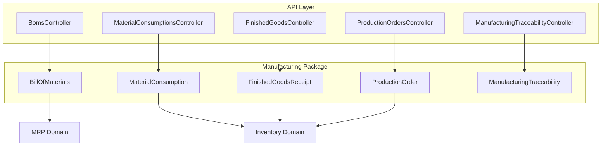
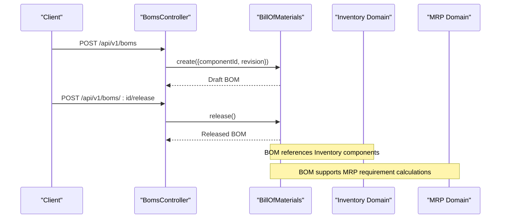
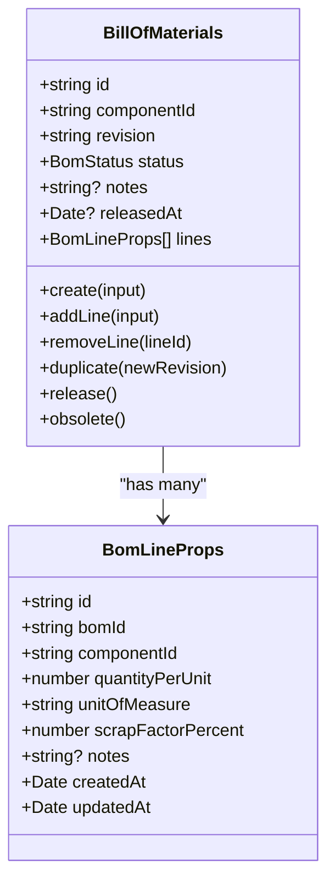
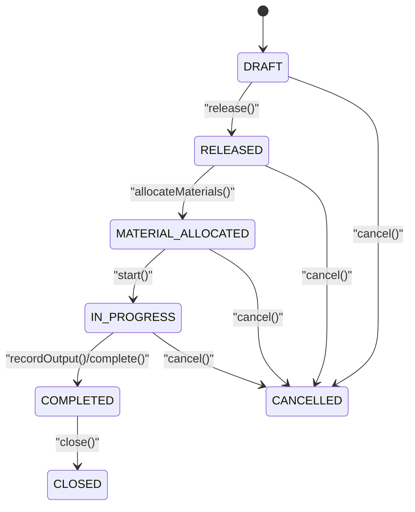
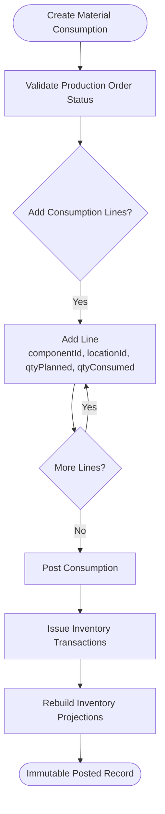
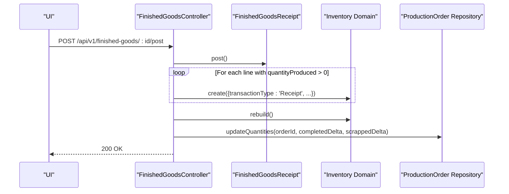
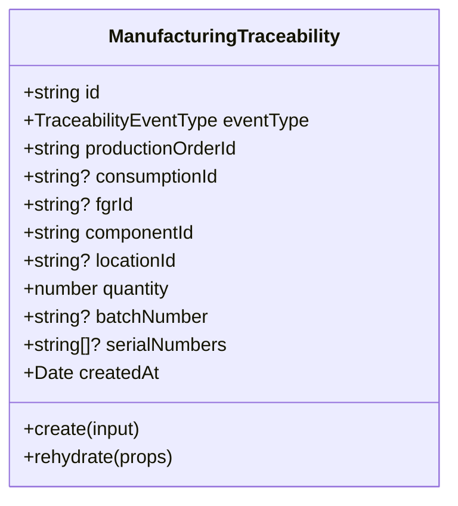
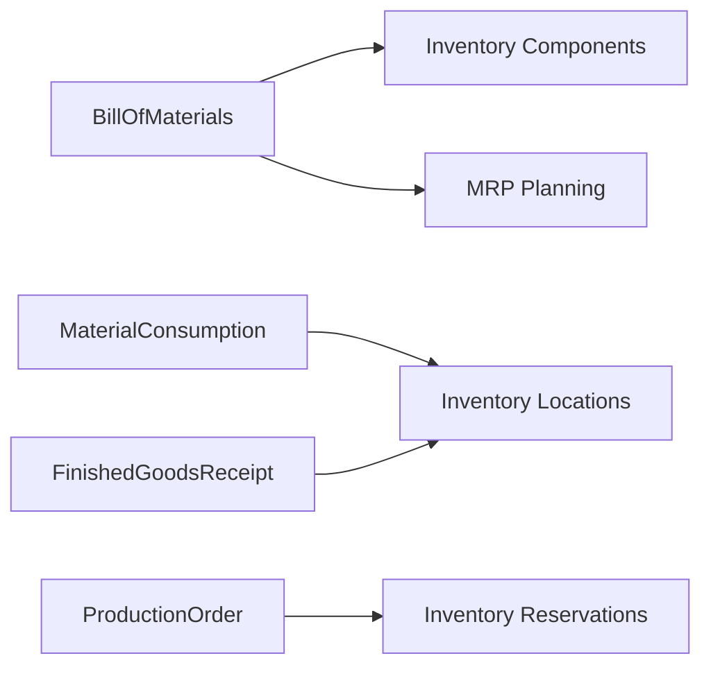

# Manufacturing Operations

<cite>
**Referenced Files in This Document**
- [0016-bill-of-materials.md](file://docs/rfcs/0016-bill-of-materials.md)
- [0017-production-orders.md](file://docs/rfcs/0017-production-orders.md)
- [0018-material-consumption.md](file://docs/rfcs/0018-material-consumption.md)
- [0019-finished-goods-receipt.md](file://docs/rfcs/0019-finished-goods-receipt.md)
- [0020-manufacturing-traceability.md](file://docs/rfcs/0020-manufacturing-traceability.md)
- [bill-of-materials.ts](file://packages/manufacturing/src/boms/bill-of-materials.ts)
- [production-order.ts](file://packages/manufacturing/src/production-orders/production-order.ts)
- [material-consumption.ts](file://packages/manufacturing/src/material-consumptions/material-consumption.ts)
- [finished-goods-receipt.ts](file://packages/manufacturing/src/finished-goods/finished-goods-receipt.ts)
- [manufacturing-traceability.ts](file://packages/manufacturing/src/traceability/manufacturing-traceability.ts)
- [boms.controller.ts](file://apps/api/src/boms/boms.controller.ts)
- [production-orders.controller.ts](file://apps/api/src/production-orders/production-orders.controller.ts)
- [material-consumptions.controller.ts](file://apps/api/src/material-consumptions/material-consumptions.controller.ts)
- [finished-goods.controller.ts](file://apps/api/src/finished-goods/finished-goods.controller.ts)
- [manufacturing-traceability.controller.ts](file://apps/api/src/manufacturing-traceability/manufacturing-traceability.controller.ts)
</cite>

## Table of Contents
1. [Introduction](#introduction)
2. [Project Structure](#project-structure)
3. [Core Components](#core-components)
4. [Architecture Overview](#architecture-overview)
5. [Detailed Component Analysis](#detailed-component-analysis)
6. [Dependency Analysis](#dependency-analysis)
7. [Performance Considerations](#performance-considerations)
8. [Troubleshooting Guide](#troubleshooting-guide)
9. [Conclusion](#conclusion)

## Introduction
This document explains Ananya ERP’s Manufacturing Operations domain, focusing on bill of materials (BOM) management, production order lifecycle, material consumption tracking, finished goods receipt, and manufacturing traceability. It describes the data model, key workflows from BOM creation through planning, execution, and quality assurance, and how the manufacturing package integrates with inventory and MRP domains. Practical examples are provided as step-by-step workflows rather than code snippets.

## Project Structure
The manufacturing domain is implemented as a TypeScript package under `packages/manufacturing`, exposing domain aggregates for BOMs, production orders, material consumptions, finished goods receipts, and traceability records. The NestJS API exposes controllers for each manufacturing capability under `apps/api`.

**Diagram sources**
- [boms.controller.ts:22-84](file://apps/api/src/boms/boms.controller.ts#L22-L84)
- [production-orders.controller.ts:26-129](file://apps/api/src/production-orders/production-orders.controller.ts#L26-L129)
- [material-consumptions.controller.ts:5-35](file://apps/api/src/material-consumptions/material-consumptions.controller.ts#L5-L35)
- [finished-goods.controller.ts:5-33](file://apps/api/src/finished-goods/finished-goods.controller.ts#L5-L33)
- [manufacturing-traceability.controller.ts:4-40](file://apps/api/src/manufacturing-traceability/manufacturing-traceability.controller.ts#L4-L40)
- [bill-of-materials.ts:51-338](file://packages/manufacturing/src/boms/bill-of-materials.ts#L51-L338)
- [production-order.ts:71-271](file://packages/manufacturing/src/production-orders/production-order.ts#L71-L271)
- [material-consumption.ts:59-142](file://packages/manufacturing/src/material-consumptions/material-consumption.ts#L59-L142)
- [finished-goods-receipt.ts:58-153](file://packages/manufacturing/src/finished-goods/finished-goods-receipt.ts#L58-L153)
- [manufacturing-traceability.ts:32-82](file://packages/manufacturing/src/traceability/manufacturing-traceability.ts#L32-L82)

**Section sources**
- [0016-bill-of-materials.md:11-23](file://docs/rfcs/0016-bill-of-materials.md#L11-L23)
- [0017-production-orders.md:11-23](file://docs/rfcs/0017-production-orders.md#L11-L23)
- [0018-material-consumption.md:11-24](file://docs/rfcs/0018-material-consumption.md#L11-L24)
- [0019-finished-goods-receipt.md:11-24](file://docs/rfcs/0019-finished-goods-receipt.md#L11-L24)
- [0020-manufacturing-traceability.md:11-23](file://docs/rfcs/0020-manufacturing-traceability.md#L11-L23)

## Core Components
- Bill of Materials (BOM): Defines the engineering recipe for a finished product, including component lines, quantities, unit of measure, scrap factor, and revision control. Released BOMs are immutable; changes require new revisions.
- Production Order: Authorizes a manufacturing run against a released BOM, tracks planned, completed, and scrapped quantities, and manages state transitions from draft to closed or cancelled.
- Material Consumption: Records actual raw material usage during production, linking to production orders and inventory locations, with batch and serial tracking. Posting creates inventory issue transactions.
- Finished Goods Receipt: Records production yield and scrap entering inventory, creating inventory receipt transactions and updating production order completion metrics.
- Manufacturing Traceability: Immutable audit links connecting production events to consumed components and produced finished goods, enabling forward and backward genealogy queries.

**Section sources**
- [0016-bill-of-materials.md:35-63](file://docs/rfcs/0016-bill-of-materials.md#L35-L63)
- [0017-production-orders.md:37-65](file://docs/rfcs/0017-production-orders.md#L37-L65)
- [0018-material-consumption.md:36-60](file://docs/rfcs/0018-material-consumption.md#L36-L60)
- [0019-finished-goods-receipt.md:36-60](file://docs/rfcs/0019-finished-goods-receipt.md#L36-L60)
- [0020-manufacturing-traceability.md:35-58](file://docs/rfcs/0020-manufacturing-traceability.md#L35-L58)

## Architecture Overview
The manufacturing domain follows a clear separation between API controllers, application services (not shown here), and domain aggregates. Inventory and MRP are external domains integrated via application services.

**Diagram sources**
- [boms.controller.ts:27-73](file://apps/api/src/boms/boms.controller.ts#L27-L73)
- [bill-of-materials.ts:74-325](file://packages/manufacturing/src/boms/bill-of-materials.ts#L74-L325)
- [0016-bill-of-materials.md:133-137](file://docs/rfcs/0016-bill-of-materials.md#L133-L137)

## Detailed Component Analysis

### Bill of Materials (BOM)
- Purpose: Define and manage the engineering recipe for a finished product.
- Key entities:
  - BillOfMaterials aggregate with header fields (componentId, revision, status, notes, releasedAt).
  - BomLine entity with componentId, quantityPerUnit, unitOfMeasure, scrapFactorPercent, notes.
- Lifecycle:
  - Create DRAFT BOM.
  - Add/update/remove line items while DRAFT.
  - Release to RELEASED (immutable).
  - Obsolete when superseded by a newer revision.
- Invariants:
  - Positive quantity per unit.
  - Non-negative scrap factor percent.
  - No circular dependency (BOM cannot consume itself).
  - Duplicate component lines are forbidden.
- Integration:
  - References Inventory components.
  - Supports MRP planning by providing required quantities and scrap factors.

**Diagram sources**
- [bill-of-materials.ts:11-35](file://packages/manufacturing/src/boms/bill-of-materials.ts#L11-L35)
- [bill-of-materials.ts:51-338](file://packages/manufacturing/src/boms/bill-of-materials.ts#L51-L338)

**Section sources**
- [0016-bill-of-materials.md:35-63](file://docs/rfcs/0016-bill-of-materials.md#L35-L63)
- [0016-bill-of-materials.md:100-114](file://docs/rfcs/0016-bill-of-materials.md#L100-L114)
- [bill-of-materials.ts:99-136](file://packages/manufacturing/src/boms/bill-of-materials.ts#L99-L136)
- [bill-of-materials.ts:315-333](file://packages/manufacturing/src/boms/bill-of-materials.ts#L315-L333)

### Production Orders
- Purpose: Authorize and track manufacturing runs against a released BOM.
- Key entities:
  - ProductionOrder aggregate with productionNumber, bomId, componentId, locationId, priority, planned/completed/scrapped quantities, dates, operations.
- Lifecycle:
  - Create DRAFT.
  - Release to RELEASED.
  - Allocate materials (MATERIAL_ALLOCATED).
  - Start production (IN_PROGRESS).
  - Record output and scrap incrementally.
  - Complete (COMPLETED), Close (CLOSED), or Cancel (CANCELLED).
- Invariants:
  - Planned quantity must be positive.
  - Cannot complete until at least one finished goods receipt has been posted.
  - Closed/cancelled orders cannot be edited or reopened.

**Diagram sources**
- [production-order.ts:7-14](file://packages/manufacturing/src/production-orders/production-order.ts#L7-L14)
- [production-order.ts:164-259](file://packages/manufacturing/src/production-orders/production-order.ts#L164-L259)

**Section sources**
- [0017-production-orders.md:37-65](file://docs/rfcs/0017-production-orders.md#L37-L65)
- [0017-production-orders.md:106-122](file://docs/rfcs/0017-production-orders.md#L106-L122)
- [production-order.ts:110-139](file://packages/manufacturing/src/production-orders/production-order.ts#L110-L139)
- [production-order.ts:175-227](file://packages/manufacturing/src/production-orders/production-order.ts#L175-L227)

### Material Consumption
- Purpose: Record actual raw material usage during production and post inventory issues.
- Key entities:
  - MaterialConsumption aggregate with consumptionNumber, productionOrderId, status, lines.
  - MaterialConsumptionLine entity with componentId, locationId, quantityPlanned, quantityConsumed, batchNumber, serialNumbers.
- Lifecycle:
  - Create DRAFT consumption against an active production order.
  - Add consumption lines with planned vs actual quantities.
  - Post to finalize and trigger inventory issue transactions.
- Invariants:
  - Must reference a valid production order in IN_PROGRESS.
  - Consumed quantity must be positive.
  - Posted consumption is immutable.

**Diagram sources**
- [material-consumption.ts:59-142](file://packages/manufacturing/src/material-consumptions/material-consumption.ts#L59-L142)
- [0018-material-consumption.md:117-151](file://docs/rfcs/0018-material-consumption.md#L117-L151)

**Section sources**
- [0018-material-consumption.md:36-60](file://docs/rfcs/0018-material-consumption.md#L36-L60)
- [0018-material-consumption.md:100-113](file://docs/rfcs/0018-material-consumption.md#L100-L113)
- [material-consumption.ts:98-135](file://packages/manufacturing/src/material-consumptions/material-consumption.ts#L98-L135)

### Finished Goods Receipt
- Purpose: Record production yield and scrap entering inventory and update production order quantities.
- Key entities:
  - FinishedGoodsReceipt aggregate with fgrNumber, productionOrderId, status, lines.
  - FinishedGoodsReceiptLine entity with componentId, locationId, quantityProduced, quantityScrapped, batchNumber, serialNumbers.
- Lifecycle:
  - Create DRAFT FGR against a production order.
  - Add yield and scrap lines.
  - Post to create inventory receipt transactions and update production order totals.
- Invariants:
  - Must reference a valid production order in IN_PROGRESS or COMPLETED.
  - Produced and scrapped quantities must be non-negative; at least one must be positive per line.
  - Total produced across all FGRs cannot exceed planned quantity without policy approval.

**Diagram sources**
- [finished-goods.controller.ts:29-32](file://apps/api/src/finished-goods/finished-goods.controller.ts#L29-L32)
- [finished-goods-receipt.ts:131-146](file://packages/manufacturing/src/finished-goods/finished-goods-receipt.ts#L131-L146)
- [0019-finished-goods-receipt.md:117-152](file://docs/rfcs/0019-finished-goods-receipt.md#L117-L152)

**Section sources**
- [0019-finished-goods-receipt.md:36-60](file://docs/rfcs/0019-finished-goods-receipt.md#L36-L60)
- [0019-finished-goods-receipt.md:98-106](file://docs/rfcs/0019-finished-goods-receipt.md#L98-L106)
- [finished-goods-receipt.ts:95-138](file://packages/manufacturing/src/finished-goods/finished-goods-receipt.ts#L95-L138)

### Manufacturing Traceability
- Purpose: Provide immutable genealogy links for forward and backward traceability across production events.
- Key entities:
  - ManufacturingTraceability record with eventType (MATERIAL_CONSUMED or FINISHED_GOODS_PRODUCED), productionOrderId, optional consumptionId/fgrId, componentId, locationId, quantity, batchNumber, serialNumbers.
- Queries:
  - Forward trace from finished product batch/serial to consumed components and supply chain.
  - Backward trace from component batch/serial to production orders and finished products.
  - All traceability records for a specific production order.
- Invariants:
  - Records are immutable append-only logs.
  - Valid references to production orders, components, and event types.

**Diagram sources**
- [manufacturing-traceability.ts:3-18](file://packages/manufacturing/src/traceability/manufacturing-traceability.ts#L3-L18)
- [manufacturing-traceability.ts:32-82](file://packages/manufacturing/src/traceability/manufacturing-traceability.ts#L32-L82)

**Section sources**
- [0020-manufacturing-traceability.md:35-58](file://docs/rfcs/0020-manufacturing-traceability.md#L35-L58)
- [0020-manufacturing-traceability.md:105-115](file://docs/rfcs/0020-manufacturing-traceability.md#L105-L115)
- [manufacturing-traceability.ts:59-75](file://packages/manufacturing/src/traceability/manufacturing-traceability.ts#L59-L75)

## Dependency Analysis
- Manufacturing depends on Inventory for:
  - Component references and units of measure.
  - Location references for withdrawals and receipts.
  - Batch and serial number tracking.
- Manufacturing interacts with MRP for:
  - BOM-driven material requirements planning.
- API Controllers expose endpoints that orchestrate domain aggregates and integrate with external services (inventory transactions, projections, reservations).

**Diagram sources**
- [0016-bill-of-materials.md:133-137](file://docs/rfcs/0016-bill-of-materials.md#L133-L137)
- [0017-production-orders.md:140-143](file://docs/rfcs/0017-production-orders.md#L140-L143)
- [0018-material-consumption.md:145-151](file://docs/rfcs/0018-material-consumption.md#L145-L151)
- [0019-finished-goods-receipt.md:146-152](file://docs/rfcs/0019-finished-goods-receipt.md#L146-L152)

**Section sources**
- [0016-bill-of-materials.md:133-137](file://docs/rfcs/0016-bill-of-materials.md#L133-L137)
- [0017-production-orders.md:140-143](file://docs/rfcs/0017-production-orders.md#L140-L143)
- [0018-material-consumption.md:145-151](file://docs/rfcs/0018-material-consumption.md#L145-L151)
- [0019-finished-goods-receipt.md:146-152](file://docs/rfcs/0019-finished-goods-receipt.md#L146-L152)

## Performance Considerations
- BOM explosion and material requirement calculations should leverage indexed lookups on componentId and status to minimize query cost.
- Material consumption posting batches inventory issue transactions to reduce overhead and then triggers projection rebuild once per document.
- Finished goods receipt posting updates production order totals incrementally and rebuilds projections after all receipt lines are processed.
- Traceability queries should use read-model indexes on batchNumber, serialNumber, componentId, and productionOrderId to support fast genealogy traversal.

[No sources needed since this section provides general guidance]

## Troubleshooting Guide
- BOM errors:
  - Immutable BOM error indicates attempting to modify a RELEASED BOM; create a new revision instead.
  - Invalid BOM line quantity errors indicate non-positive quantity or negative scrap factor.
  - Duplicate component line errors occur when adding duplicate components to a BOM.
  - Circular dependency errors occur when a BOM attempts to consume its own product component.
- Production order errors:
  - Invalid status transition errors occur when moving to an invalid next state.
  - Invalid production quantity errors occur when planned quantity is not positive.
- Material consumption errors:
  - Immutable consumption error occurs when trying to modify a POSTED consumption.
  - Invalid consumption quantity errors occur when consumed quantity is not positive.
- Finished goods receipt errors:
  - Immutable FGR error occurs when trying to modify a POSTED FGR.
  - Invalid FGR quantity errors occur when produced/scrapped quantities are negative or both zero.

**Section sources**
- [bill-of-materials.ts:91-118](file://packages/manufacturing/src/boms/bill-of-materials.ts#L91-L118)
- [production-order.ts:141-152](file://packages/manufacturing/src/production-orders/production-order.ts#L141-L152)
- [material-consumption.ts:98-106](file://packages/manufacturing/src/material-consumptions/material-consumption.ts#L98-L106)
- [finished-goods-receipt.ts:95-109](file://packages/manufacturing/src/finished-goods/finished-goods-receipt.ts#L95-L109)

## Conclusion
Ananya ERP’s Manufacturing Operations domain provides robust, invariant-enforcing aggregates for BOM management, production order lifecycle, material consumption, finished goods receipt, and traceability. The design ensures immutability where appropriate, clear state transitions, and clean integration points with Inventory and MRP domains. By following the documented workflows and validation rules, teams can reliably plan, execute, and trace manufacturing processes while maintaining accurate inventory and compliance-ready audit trails.