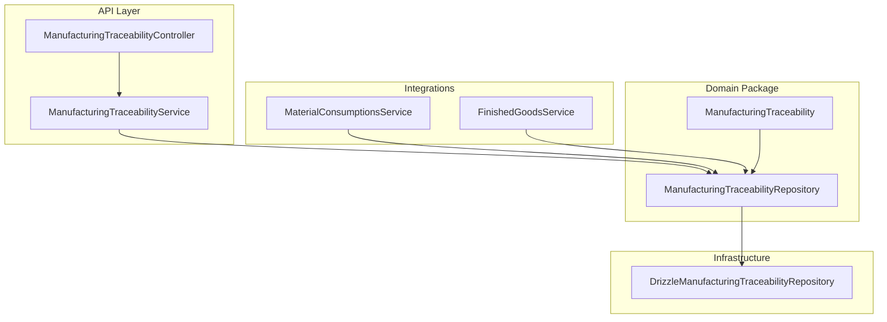
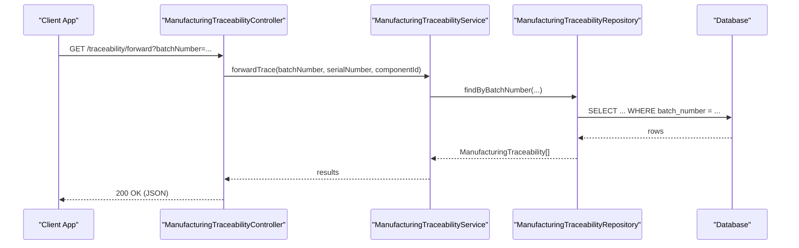
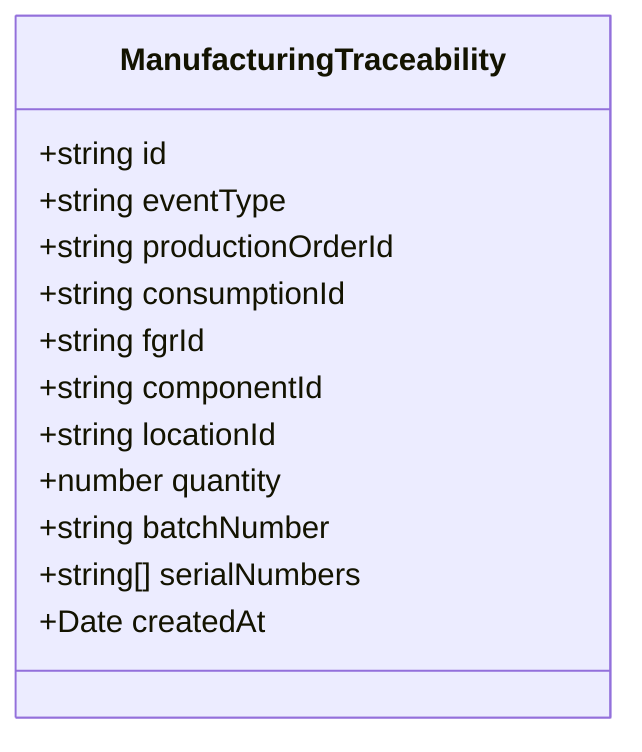
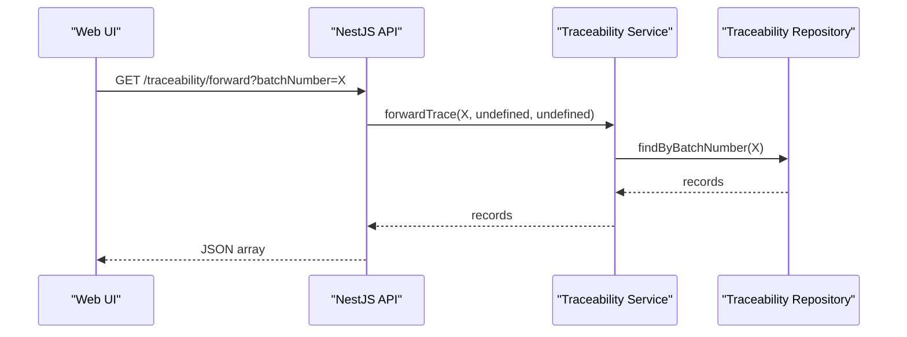
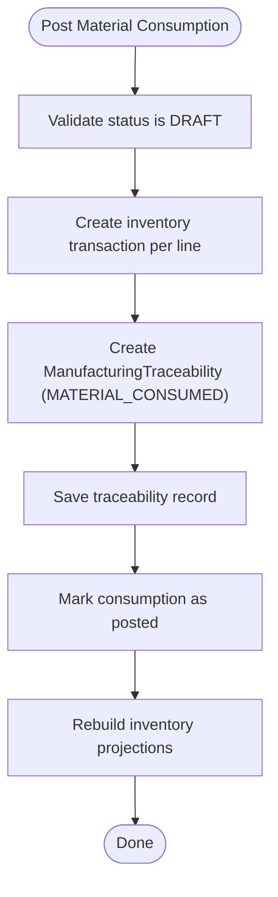
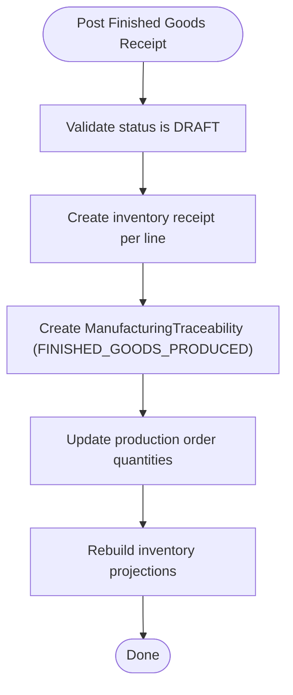
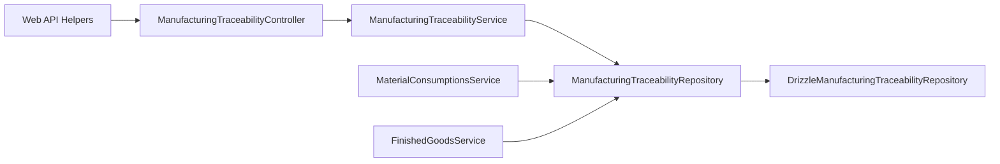

# Manufacturing Traceability

<cite>
**Referenced Files in This Document**
- [0020-manufacturing-traceability.md](file://docs/rfcs/0020-manufacturing-traceability.md)
- [manufacturing-traceability.controller.ts](file://apps/api/src/manufacturing-traceability/manufacturing-traceability.controller.ts)
- [manufacturing-traceability.service.ts](file://apps/api/src/manufacturing-traceability/manufacturing-traceability.service.ts)
- [manufacturing-traceability.ts](file://packages/manufacturing/src/traceability/manufacturing-traceability.ts)
- [manufacturing-traceability.repository.ts](file://packages/manufacturing/src/traceability/manufacturing-traceability.repository.ts)
- [drizzle-manufacturing-traceability.repository.ts](file://apps/api/src/infrastructure/repositories/drizzle-manufacturing-traceability.repository.ts)
- [material-consumptions.service.ts](file://apps/api/src/material-consumptions/material-consumptions.service.ts)
- [finished-goods.service.ts](file://apps/api/src/finished-goods/finished-goods.service.ts)
- [api.ts](file://apps/web/src/lib/api.ts)
</cite>

## Table of Contents
1. Introduction
2. Project Structure
3. Core Components
4. Architecture Overview
5. Detailed Component Analysis
6. Dependency Analysis
7. Performance Considerations
8. Troubleshooting Guide
9. Conclusion
10. Appendices

## Introduction
This document explains Manufacturing Traceability in Ananya ERP, focusing on end-to-end product lineage from raw materials to finished goods with batch and serial number tracing. It covers the traceability data model, chain-of-custody records, recall support capabilities, API endpoints for querying product history and origins, practical usage scenarios, integrations with inventory transactions, production orders, and quality management systems, industry-specific requirements, data retention considerations, and performance guidance for large-scale queries.

## Project Structure
The manufacturing traceability feature spans:
- Domain model and repository interface in the manufacturing package
- API controller and service in the NestJS application
- Infrastructure repository implementation (Drizzle-based)
- Integration points during material consumption and finished goods receipt posting
- Web client API helpers for forward/backward trace queries

**Diagram sources**
- [manufacturing-traceability.controller.ts:1-41](file://apps/api/src/manufacturing-traceability/manufacturing-traceability.controller.ts#L1-L41)
- [manufacturing-traceability.service.ts:1-60](file://apps/api/src/manufacturing-traceability/manufacturing-traceability.service.ts#L1-L60)
- [manufacturing-traceability.ts:1-82](file://packages/manufacturing/src/traceability/manufacturing-traceability.ts#L1-L82)
- [manufacturing-traceability.repository.ts:1-20](file://packages/manufacturing/src/traceability/manufacturing-traceability.repository.ts#L1-L20)
- [material-consumptions.service.ts:70-113](file://apps/api/src/material-consumptions/material-consumptions.service.ts#L70-L113)
- [finished-goods.service.ts:70-123](file://apps/api/src/finished-goods/finished-goods.service.ts#L70-L123)

**Section sources**
- [0020-manufacturing-traceability.md:11-23](file://docs/rfcs/0020-manufacturing-traceability.md#L11-L23)
- [manufacturing-traceability.controller.ts:1-41](file://apps/api/src/manufacturing-traceability/manufacturing-traceability.controller.ts#L1-L41)
- [manufacturing-traceability.service.ts:1-60](file://apps/api/src/manufacturing-traceability/manufacturing-traceability.service.ts#L1-L60)
- [manufacturing-traceability.repository.ts:1-20](file://packages/manufacturing/src/traceability/manufacturing-traceability.repository.ts#L1-L20)

## Core Components
- Traceability record: immutable link between a production event and its inputs/outputs, capturing component identity, location, quantity, batch, and serial numbers.
- Event types:
  - MATERIAL_CONSUMED: recorded when materials are issued to a production order.
  - FINISHED_GOODS_PRODUCED: recorded when finished goods are received into inventory.
- Directional tracing:
  - Forward trace: start from a finished product (batch or serial) and walk down to consumed components and their supply chain origin.
  - Backward trace: start from a component (batch or serial) and find all production orders and finished products that consumed it.
- Repository contract: supports queries by production order, finished goods component, consumed component, batch number, and serial number; supports append-only persistence.

Key behaviors:
- Records are created at post time for both material consumption and finished goods receipt.
- Queries return lists of traceability records suitable for assembling genealogy trees in the UI or downstream services.

**Section sources**
- [0020-manufacturing-traceability.md:26-66](file://docs/rfcs/0020-manufacturing-traceability.md#L26-L66)
- [0020-manufacturing-traceability.md:105-116](file://docs/rfcs/0020-manufacturing-traceability.md#L105-L116)
- [manufacturing-traceability.repository.ts:1-20](file://packages/manufacturing/src/traceability/manufacturing-traceability.repository.ts#L1-L20)
- [material-consumptions.service.ts:91-103](file://apps/api/src/material-consumptions/material-consumptions.service.ts#L91-L103)
- [finished-goods.service.ts:93-105](file://apps/api/src/finished-goods/finished-goods.service.ts#L93-L105)

## Architecture Overview
The system follows a clear separation of concerns:
- API layer exposes read endpoints for traceability queries.
- Service layer routes queries to the repository abstraction.
- Domain model defines immutable traceability records.
- Infrastructure implements persistence using Drizzle with indexes optimized for common query patterns.
- Production workflows (material consumption and finished goods receipt) create traceability records as part of their posted state transitions.

**Diagram sources**
- [manufacturing-traceability.controller.ts:10-21](file://apps/api/src/manufacturing-traceability/manufacturing-traceability.controller.ts#L10-L21)
- [manufacturing-traceability.service.ts:24-41](file://apps/api/src/manufacturing-traceability/manufacturing-traceability.service.ts#L24-L41)
- [manufacturing-traceability.repository.ts:1-20](file://packages/manufacturing/src/traceability/manufacturing-traceability.repository.ts#L1-L20)

## Detailed Component Analysis

### Data Model: ManufacturingTraceability
- Immutable entity representing a single traceability link.
- Captures:
  - eventType: MATERIAL_CONSUMED or FINISHED_GOODS_PRODUCED
  - productionOrderId: links to the originating production order
  - consumptionId or fgrId: context identifier for consumption or finished goods receipt
  - componentId: the component involved
  - locationId: where the event occurred
  - quantity: amount involved
  - batchNumber and serialNumbers: identifiers for batch/serial-level traceability
  - createdAt: timestamp

**Diagram sources**
- [manufacturing-traceability.ts:1-82](file://packages/manufacturing/src/traceability/manufacturing-traceability.ts#L1-L82)

**Section sources**
- [manufacturing-traceability.ts:1-82](file://packages/manufacturing/src/traceability/manufacturing-traceability.ts#L1-L82)
- [0020-manufacturing-traceability.md:158-174](file://docs/rfcs/0020-manufacturing-traceability.md#L158-L174)

### API Endpoints
- GET /traceability/forward
  - Query parameters: batchNumber, serialNumber, componentId
  - Purpose: retrieve traceability records associated with a finished product or component for forward tracing.
- GET /traceability/backward
  - Query parameters: batchNumber, serialNumber, componentId
  - Purpose: retrieve traceability records for backward tracing from a component’s perspective.
- GET /traceability/production-order/:id
  - Path parameter: id (production order ID)
  - Purpose: retrieve all traceability records for a specific production order.

**Diagram sources**
- [manufacturing-traceability.controller.ts:10-21](file://apps/api/src/manufacturing-traceability/manufacturing-traceability.controller.ts#L10-L21)
- [manufacturing-traceability.service.ts:24-41](file://apps/api/src/manufacturing-traceability/manufacturing-traceability.service.ts#L24-L41)
- [manufacturing-traceability.repository.ts:1-20](file://packages/manufacturing/src/traceability/manufacturing-traceability.repository.ts#L1-L20)

**Section sources**
- [manufacturing-traceability.controller.ts:1-41](file://apps/api/src/manufacturing-traceability/manufacturing-traceability.controller.ts#L1-L41)
- [manufacturing-traceability.service.ts:1-60](file://apps/api/src/manufacturing-traceability/manufacturing-traceability.service.ts#L1-L60)
- [0020-manufacturing-traceability.md:178-183](file://docs/rfcs/0020-manufacturing-traceability.md#L178-L183)
- [api.ts:594-622](file://apps/web/src/lib/api.ts#L594-L622)

### Record Creation During Material Consumption
When a material consumption is posted:
- Inventory transactions are created to issue materials.
- For each consumption line, a traceability record is created with eventType MATERIAL_CONSUMED.
- The consumption is marked posted and projections are rebuilt.

**Diagram sources**
- [material-consumptions.service.ts:70-113](file://apps/api/src/material-consumptions/material-consumptions.service.ts#L70-L113)

**Section sources**
- [material-consumptions.service.ts:70-113](file://apps/api/src/material-consumptions/material-consumptions.service.ts#L70-L113)

### Record Creation During Finished Goods Receipt
When a finished goods receipt is posted:
- Inventory transactions are created to receive produced quantities.
- For each line, a traceability record is created with eventType FINISHED_GOODS_PRODUCED.
- Production order completed/scrapped quantities are updated.
- Projections are rebuilt.

**Diagram sources**
- [finished-goods.service.ts:70-123](file://apps/api/src/finished-goods/finished-goods.service.ts#L70-L123)

**Section sources**
- [finished-goods.service.ts:70-123](file://apps/api/src/finished-goods/finished-goods.service.ts#L70-L123)

### Database Schema and Indexes
- Table: manufacturing_traceability
  - Columns include id, event_type, production_order_id, consumption_id, fgr_id, component_id, location_id, quantity, batch_number, serial_numbers, created_at.
- Indexes exist for:
  - production_order_id
  - component_id
  - event_type
  - batch_number
  - consumption_id
  - fgr_id

These indexes support efficient lookups for forward/backward tracing and production order queries.

**Section sources**
- [0020-manufacturing-traceability.md:158-174](file://docs/rfcs/0020-manufacturing-traceability.md#L158-L174)
- [drizzle-manufacturing-traceability.repository.ts:1-200](file://apps/api/src/infrastructure/repositories/drizzle-manufacturing-traceability.repository.ts#L1-L200)

## Dependency Analysis
- API controller depends on the traceability service.
- Service depends on the repository abstraction.
- Repository abstraction implemented by Drizzle infrastructure.
- Material consumption and finished goods services depend on the same repository to write traceability records.
- Web client uses API helpers to call forward/backward trace endpoints.

**Diagram sources**
- [manufacturing-traceability.controller.ts:1-41](file://apps/api/src/manufacturing-traceability/manufacturing-traceability.controller.ts#L1-L41)
- [manufacturing-traceability.service.ts:1-60](file://apps/api/src/manufacturing-traceability/manufacturing-traceability.service.ts#L1-L60)
- [manufacturing-traceability.repository.ts:1-20](file://packages/manufacturing/src/traceability/manufacturing-traceability.repository.ts#L1-L20)
- [material-consumptions.service.ts:70-113](file://apps/api/src/material-consumptions/material-consumptions.service.ts#L70-L113)
- [finished-goods.service.ts:70-123](file://apps/api/src/finished-goods/finished-goods.service.ts#L70-L123)
- [api.ts:594-622](file://apps/web/src/lib/api.ts#L594-L622)

**Section sources**
- [manufacturing-traceability.controller.ts:1-41](file://apps/api/src/manufacturing-traceability/manufacturing-traceability.controller.ts#L1-L41)
- [manufacturing-traceability.service.ts:1-60](file://apps/api/src/manufacturing-traceability/manufacturing-traceability.service.ts#L1-L60)
- [manufacturing-traceability.repository.ts:1-20](file://packages/manufacturing/src/traceability/manufacturing-traceability.repository.ts#L1-L20)
- [material-consumptions.service.ts:70-113](file://apps/api/src/material-consumptions/material-consumptions.service.ts#L70-L113)
- [finished-goods.service.ts:70-123](file://apps/api/src/finished-goods/finished-goods.service.ts#L70-L123)
- [api.ts:594-622](file://apps/web/src/lib/api.ts#L594-L622)

## Performance Considerations
- Use existing indexes on production_order_id, component_id, event_type, batch_number, consumption_id, and fgr_id to optimize query performance.
- Prefer targeted queries via batchNumber, serialNumber, or componentId to minimize result sets.
- Avoid unbounded scans by always providing at least one filter parameter for forward/backward trace endpoints.
- For large datasets, consider pagination or filtering by date ranges if extended APIs are added later.
- Keep traceability records append-only and immutable to avoid costly updates.

[No sources needed since this section provides general guidance]

## Troubleshooting Guide
Common issues and resolutions:
- No results for forward trace:
  - Ensure the batchNumber or serialNumber exists in traceability records.
  - Verify that finished goods were posted to create FINISHED_GOODS_PRODUCED records.
- No results for backward trace:
  - Confirm that material consumption was posted to create MATERIAL_CONSUMED records.
  - Check that the componentId matches the consumed component.
- Invalid production order ID:
  - Ensure the provided production order ID exists before querying.
- State validation errors:
  - Only DRAFT consumptions and receipts can be posted; ensure correct workflow state.

Operational checks:
- Confirm indexes exist on key columns for performance.
- Validate that integration points (material consumption and finished goods) are creating traceability records on post.

**Section sources**
- [material-consumptions.service.ts:70-113](file://apps/api/src/material-consumptions/material-consumptions.service.ts#L70-L113)
- [finished-goods.service.ts:70-123](file://apps/api/src/finished-goods/finished-goods.service.ts#L70-L123)
- [0020-manufacturing-traceability.md:158-174](file://docs/rfcs/0020-manufacturing-traceability.md#L158-L174)

## Conclusion
Ananya ERP’s Manufacturing Traceability provides an immutable, indexed record of every material consumption and finished goods production event, enabling robust forward and backward tracing across batches and serials. The API exposes straightforward endpoints to query product history and origins, while integrations with inventory transactions and production orders ensure consistent chain-of-custody records. With appropriate indexing and disciplined query patterns, the system supports scalable traceability for high-volume manufacturing environments and lays groundwork for regulatory compliance and recall impact analysis.

[No sources needed since this section summarizes without analyzing specific files]

## Appendices

### Practical Examples
- Track product movement through manufacturing stages:
  - Post material consumption to record MATERIAL_CONSUMED events.
  - Post finished goods receipt to record FINISHED_GOODS_PRODUCED events.
  - Use forward trace with a finished product batch or serial to view the complete genealogy tree.
- Investigate quality issues:
  - Use backward trace with a suspect component batch or serial to identify all affected production orders and finished products.
- Support regulatory compliance:
  - Leverage immutable traceability records and indexed queries to generate audit-ready reports linking components to suppliers, purchase orders, and goods receipts.

[No sources needed since this section provides general guidance]

### Industry-Specific Requirements
- Food and pharmaceutical industries may require strict batch and serial traceability with immutable records and comprehensive supplier linkage.
- Electronics manufacturing may need component-level traceability aligned with standards such as IPC-1782.
- Medical devices may require FDA 21 CFR Part 11-aligned reporting and audit trails.

[No sources needed since this section provides general guidance]

### Data Retention Policies
- Maintain immutable traceability records indefinitely or per regulatory requirements.
- Archive historical records based on retention policies while preserving index integrity for queries.
- Ensure backups and disaster recovery plans cover traceability tables.

[No sources needed since this section provides general guidance]