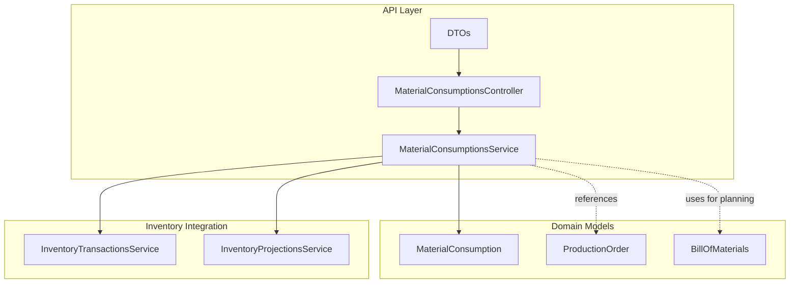
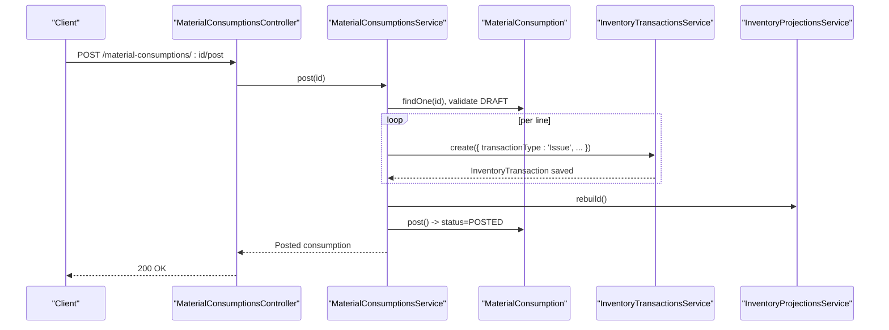
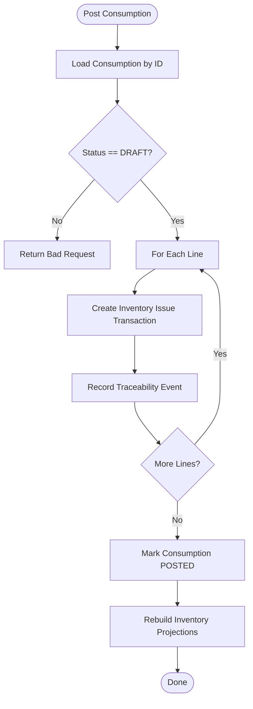
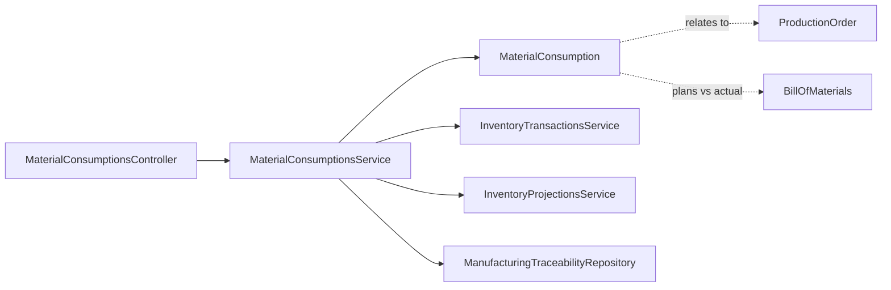

# Material Consumption Tracking

<cite>
**Referenced Files in This Document**
- [material-consumptions.controller.ts](file://apps/api/src/material-consumptions/material-consumptions.controller.ts)
- [material-consumptions.service.ts](file://apps/api/src/material-consumptions/material-consumptions.service.ts)
- [dtos.ts](file://apps/api/src/material-consumptions/dtos.ts)
- [0018-material-consumption.md](file://docs/rfcs/0018-material-consumption.md)
- [material-consumption.ts](file://packages/manufacturing/src/material-consumptions/material-consumption.ts)
- [production-order.ts](file://packages/manufacturing/src/production-orders/production-order.ts)
- [bill-of-materials.ts](file://packages/manufacturing/src/boms/bill-of-materials.ts)
- [inventory-transactions.service.ts](file://apps/api/src/inventory-transactions/inventory-transactions.service.ts)
</cite>

## Table of Contents
1. [Introduction](#introduction)
2. [Project Structure](#project-structure)
3. [Core Components](#core-components)
4. [Architecture Overview](#architecture-overview)
5. [Detailed Component Analysis](#detailed-component-analysis)
6. [Dependency Analysis](#dependency-analysis)
7. [Performance Considerations](#performance-considerations)
8. [Troubleshooting Guide](#troubleshooting-guide)
9. [Conclusion](#conclusion)
10. [Appendices](#appendices)

## Introduction
This document explains how Ananya ERP tracks material consumption against production orders, including planned versus actual usage, variance analysis, and waste/scrap recording. It covers the API endpoints for logging consumption, adjusting quantities, reporting on usage patterns, and integrating with inventory management, production orders, and cost accounting. It also documents validation rules, audit trails via traceability, and performance considerations around posting and projection rebuilds.

## Project Structure
Material consumption is implemented as a NestJS module under apps/api/src/material-consumptions with:
- A controller exposing REST endpoints for creating, listing, adding lines, and posting consumption documents.
- A service orchestrating domain logic, inventory transactions, and traceability.
- DTOs defining request payloads for creation and line addition.

The manufacturing domain models (MaterialConsumption, ProductionOrder, BillOfMaterials) live in packages/manufacturing and define state machines, invariants, and relationships used by the application layer.

**Diagram sources**
- [material-consumptions.controller.ts:5-34](file://apps/api/src/material-consumptions/material-consumptions.controller.ts#L5-L34)
- [material-consumptions.service.ts:22-31](file://apps/api/src/material-consumptions/material-consumptions.service.ts#L22-L31)
- [material-consumption.ts:59-143](file://packages/manufacturing/src/material-consumptions/material-consumption.ts#L59-L143)
- [production-order.ts:71-272](file://packages/manufacturing/src/production-orders/production-order.ts#L71-L272)
- [bill-of-materials.ts:51-339](file://packages/manufacturing/src/boms/bill-of-materials.ts#L51-L339)
- [inventory-transactions.service.ts:12-44](file://apps/api/src/inventory-transactions/inventory-transactions.service.ts#L12-L44)

**Section sources**
- [material-consumptions.controller.ts:5-34](file://apps/api/src/material-consumptions/material-consumptions.controller.ts#L5-L34)
- [material-consumptions.service.ts:22-31](file://apps/api/src/material-consumptions/material-consumptions.service.ts#L22-L31)
- [dtos.ts:10-40](file://apps/api/src/material-consumptions/dtos.ts#L10-L40)

## Core Components
- MaterialConsumptionsController: Exposes endpoints to create consumption documents, add lines, list consumptions, and post them.
- MaterialConsumptionsService: Orchestrates creation, line addition, posting, inventory issues, traceability recording, and projection rebuild.
- MaterialConsumption (domain): Aggregate root enforcing immutability after posting, validating positive consumed quantities, and managing status transitions from DRAFT to POSTED.
- InventoryTransactionsService: Creates Issue transactions for each posted consumption line; validates component usability.
- ProductionOrder and BillOfMaterials: Provide context for planned quantities, scrap factors, and production lifecycle relevant to variance and efficiency metrics.

Key responsibilities:
- Create: Generate next consumption number and persist a DRAFT document linked to a production order.
- Add Line: Append a consumption line with component, location, planned and consumed quantities, batch/serial tracking.
- Post: Validate DRAFT status, issue inventory for each line, record traceability events, mark as POSTED, and rebuild projections.

**Section sources**
- [material-consumptions.controller.ts:11-34](file://apps/api/src/material-consumptions/material-consumptions.controller.ts#L11-L34)
- [material-consumptions.service.ts:33-113](file://apps/api/src/material-consumptions/material-consumptions.service.ts#L33-L113)
- [material-consumption.ts:59-143](file://packages/manufacturing/src/material-consumptions/material-consumption.ts#L59-L143)
- [inventory-transactions.service.ts:19-32](file://apps/api/src/inventory-transactions/inventory-transactions.service.ts#L19-L32)

## Architecture Overview
The system follows a layered architecture:
- API Layer: Controllers receive HTTP requests and delegate to services.
- Application Layer: Services coordinate domain aggregates and external integrations.
- Domain Layer: Manufacturing aggregates enforce business rules and state transitions.
- Integration Layer: Inventory services handle stock movements and projections.

**Diagram sources**
- [material-consumptions.controller.ts:31-34](file://apps/api/src/material-consumptions/material-consumptions.controller.ts#L31-L34)
- [material-consumptions.service.ts:70-113](file://apps/api/src/material-consumptions/material-consumptions.service.ts#L70-L113)
- [material-consumption.ts:128-135](file://packages/manufacturing/src/material-consumptions/material-consumption.ts#L128-L135)
- [inventory-transactions.service.ts:19-32](file://apps/api/src/inventory-transactions/inventory-transactions.service.ts#L19-L32)

## Detailed Component Analysis

### MaterialConsumptionsController
- Endpoints:
  - POST /material-consumptions: Create a new consumption document linked to a production order.
  - GET /material-consumptions: List consumptions, optionally filtered by productionOrderId.
  - GET /material-consumptions/:id: Retrieve a specific consumption document.
  - POST /material-consumptions/:id/lines: Add a consumption line to an existing document.
  - POST /material-consumptions/:id/post: Post the consumption, triggering inventory issues and traceability.

Behavior:
- Delegates all operations to MaterialConsumptionsService.
- Uses DTOs for input validation at the boundary.

**Section sources**
- [material-consumptions.controller.ts:5-34](file://apps/api/src/material-consumptions/material-consumptions.controller.ts#L5-L34)
- [dtos.ts:10-40](file://apps/api/src/material-consumptions/dtos.ts#L10-L40)

### MaterialConsumptionsService
Responsibilities:
- Create: Generates next consumption number and persists a DRAFT document tied to a production order.
- Add Line: Loads consumption, adds a line with validated inputs, and saves.
- Post: Validates DRAFT status, issues inventory for each line, records traceability events, marks as POSTED, and rebuilds projections.

Integration points:
- InventoryTransactionsService: Issues stock for each consumption line.
- InventoryProjectionsService: Rebuilds projections after posting.
- ManufacturingTraceabilityRepository: Records MATERIAL_CONSUMED events with production order, consumption, component, location, quantity, batch, and serial numbers.

Validation and error handling:
- Throws not found if consumption does not exist.
- Throws bad request if attempting to post a non-DRAFT consumption.
- Enforces positive consumed quantity in domain model.

**Section sources**
- [material-consumptions.service.ts:22-113](file://apps/api/src/material-consumptions/material-consumptions.service.ts#L22-L113)
- [material-consumption.ts:98-135](file://packages/manufacturing/src/material-consumptions/material-consumption.ts#L98-L135)

### MaterialConsumption (Domain Aggregate)
State machine:
- DRAFT: Editable; can add lines and post.
- POSTED: Immutable; cannot be modified further.

Invariants:
- Consumed quantity must be strictly positive.
- Posting transitions status to POSTED and records posted timestamp.

Usage:
- Used by service to enforce immutability and state transitions during posting.

**Section sources**
- [material-consumption.ts:18-143](file://packages/manufacturing/src/material-consumptions/material-consumption.ts#L18-L143)

### Inventory Transactions Integration
When posting:
- For each consumption line, an Issue transaction is created with:
  - Transaction type: Issue
  - Component ID, source location ID, quantity consumed, unit of measure, reference consumption number, reason, and creator.
- Component usability is validated before saving.

Projection rebuild:
- After all lines are posted, projections are rebuilt to reflect updated stock levels.

**Section sources**
- [material-consumptions.service.ts:78-113](file://apps/api/src/material-consumptions/material-consumptions.service.ts#L78-L113)
- [inventory-transactions.service.ts:19-32](file://apps/api/src/inventory-transactions/inventory-transactions.service.ts#L19-L32)

### Production Orders and BOMs Context
- ProductionOrder: Tracks planned vs completed quantities and scrap, enabling efficiency calculations.
- BillOfMaterials: Defines planned quantities per unit and scrap factors per component line, supporting variance analysis between planned and actual consumption.

These models provide the baseline for comparing actual consumption against planned requirements and computing variance and efficiency metrics.

**Section sources**
- [production-order.ts:71-272](file://packages/manufacturing/src/production-orders/production-order.ts#L71-L272)
- [bill-of-materials.ts:51-339](file://packages/manufacturing/src/boms/bill-of-materials.ts#L51-L339)

### Data Flow and Processing Logic

**Diagram sources**
- [material-consumptions.service.ts:70-113](file://apps/api/src/material-consumptions/material-consumptions.service.ts#L70-L113)
- [material-consumption.ts:128-135](file://packages/manufacturing/src/material-consumptions/material-consumption.ts#L128-L135)

## Dependency Analysis
Coupling and cohesion:
- Controller depends only on the service; low coupling and high cohesion.
- Service depends on domain aggregates and integration services; clear separation of concerns.
- Domain aggregates encapsulate business rules; no direct database access in service.

External dependencies:
- InventoryTransactionsService for stock movements.
- InventoryProjectionsService for projection updates.
- ManufacturingTraceabilityRepository for audit trail.

Potential circular dependencies:
- None observed; service calls domain and integration services without reverse dependencies.

**Diagram sources**
- [material-consumptions.controller.ts:5-34](file://apps/api/src/material-consumptions/material-consumptions.controller.ts#L5-L34)
- [material-consumptions.service.ts:22-31](file://apps/api/src/material-consumptions/material-consumptions.service.ts#L22-L31)
- [material-consumption.ts:59-143](file://packages/manufacturing/src/material-consumptions/material-consumption.ts#L59-L143)
- [production-order.ts:71-272](file://packages/manufacturing/src/production-orders/production-order.ts#L71-L272)
- [bill-of-materials.ts:51-339](file://packages/manufacturing/src/boms/bill-of-materials.ts#L51-L339)

**Section sources**
- [material-consumptions.controller.ts:5-34](file://apps/api/src/material-consumptions/material-consumptions.controller.ts#L5-L34)
- [material-consumptions.service.ts:22-31](file://apps/api/src/material-consumptions/material-consumptions.service.ts#L22-L31)

## Performance Considerations
- Posting loops over consumption lines to create inventory transactions; consider batching or asynchronous processing for large consumptions to reduce latency.
- Projection rebuild occurs after posting; ensure it is efficient and possibly deferred to background jobs if heavy.
- Validation at boundaries (DTOs) reduces unnecessary processing.
- Avoid repeated reads/writes; service loads once per operation and persists changes minimally.

[No sources needed since this section provides general guidance]

## Troubleshooting Guide
Common issues and resolutions:
- Attempting to post a non-DRAFT consumption:
  - Symptom: Bad request when calling post endpoint.
  - Cause: Consumption already posted or invalid state.
  - Resolution: Ensure consumption is in DRAFT before posting.

- Not found when accessing consumption:
  - Symptom: Not found error when retrieving by ID.
  - Cause: Invalid or deleted consumption ID.
  - Resolution: Verify ID exists and is accessible.

- Invalid consumed quantity:
  - Symptom: Domain error when adding a line with zero or negative quantity.
  - Cause: Violation of invariant requiring positive consumed quantity.
  - Resolution: Adjust quantity to be greater than zero.

- Component usability check failure:
  - Symptom: Error when creating inventory transaction.
  - Cause: Consolidated or retired component cannot receive new activity.
  - Resolution: Use a valid, active component ID.

Audit trail:
- Each posted consumption creates traceability events with event type MATERIAL_CONSUMED, linking production order, consumption, component, location, quantity, batch, and serial numbers for full traceability.

**Section sources**
- [material-consumptions.service.ts:50-76](file://apps/api/src/material-consumptions/material-consumptions.service.ts#L50-L76)
- [material-consumption.ts:98-135](file://packages/manufacturing/src/material-consumptions/material-consumption.ts#L98-L135)
- [inventory-transactions.service.ts:19-32](file://apps/api/src/inventory-transactions/inventory-transactions.service.ts#L19-L32)

## Conclusion
Material consumption in Ananya ERP provides a robust mechanism to record actual material usage against production orders, integrate with inventory through standardized Issue transactions, and maintain full traceability. Planned versus actual consumption enables variance analysis and efficiency metrics, while strict validation and immutable posted states ensure data integrity. The modular design separates concerns across controller, service, domain, and integration layers, supporting scalability and maintainability.

[No sources needed since this section summarizes without analyzing specific files]

## Appendices

### API Endpoints Summary
- POST /material-consumptions: Create a new consumption document linked to a production order.
- GET /material-consumptions: List consumptions, optionally filtered by productionOrderId.
- GET /material-consumptions/:id: Retrieve a specific consumption document.
- POST /material-consumptions/:id/lines: Add a consumption line to an existing document.
- POST /material-consumptions/:id/post: Post the consumption, triggering inventory issues and traceability.

**Section sources**
- [material-consumptions.controller.ts:11-34](file://apps/api/src/material-consumptions/material-consumptions.controller.ts#L11-L34)
- [0018-material-consumption.md:185-191](file://docs/rfcs/0018-material-consumption.md#L185-L191)

### Consumption Types and Variance Analysis
- Planned consumption: Derived from BOM lines (quantity per unit and scrap factor).
- Actual consumption: Recorded via consumption lines (quantity consumed).
- Variance: Difference between planned and actual per component; supports identifying over/under consumption and waste/scrap trends.

**Section sources**
- [bill-of-materials.ts:11-23](file://packages/manufacturing/src/boms/bill-of-materials.ts#L11-L23)
- [material-consumption.ts:20-32](file://packages/manufacturing/src/material-consumptions/material-consumption.ts#L20-L32)
- [0018-material-consumption.md:19-24](file://docs/rfcs/0018-material-consumption.md#L19-L24)

### Waste and Scrap Recording
- Production orders track quantity scrapped alongside completed quantities.
- BOM lines include scrap factor percent to plan expected waste.
- Consumption lines capture actual usage; variance analysis highlights discrepancies indicating waste or inefficiency.

**Section sources**
- [production-order.ts:29-47](file://packages/manufacturing/src/production-orders/production-order.ts#L29-L47)
- [production-order.ts:217-227](file://packages/manufacturing/src/production-orders/production-order.ts#L217-L227)
- [bill-of-materials.ts:13-23](file://packages/manufacturing/src/boms/bill-of-materials.ts#L13-L23)

### Practical Examples
- Consuming materials during production:
  - Create a consumption document for an IN_PROGRESS production order.
  - Add lines specifying component, location, planned quantity, and consumed quantity.
  - Post the consumption to issue inventory and record traceability.

- Handling over/under consumption:
  - Over-consumption: Set quantityConsumed higher than planned; analyze variance to identify waste or process issues.
  - Under-consumption: Set quantityConsumed lower than planned; investigate potential savings or measurement errors.

- Analyzing efficiency metrics:
  - Compare total consumed quantities against planned totals derived from BOM and production order output.
  - Use scrap quantities and variance to compute yield and efficiency KPIs.

**Section sources**
- [material-consumptions.controller.ts:11-34](file://apps/api/src/material-consumptions/material-consumptions.controller.ts#L11-L34)
- [material-consumptions.service.ts:33-113](file://apps/api/src/material-consumptions/material-consumptions.service.ts#L33-L113)
- [production-order.ts:217-227](file://packages/manufacturing/src/production-orders/production-order.ts#L217-L227)
- [bill-of-materials.ts:11-23](file://packages/manufacturing/src/boms/bill-of-materials.ts#L11-L23)

### Validation Rules and Audit Trails
- Validation rules:
  - Production order must be in IN_PROGRESS status.
  - componentId and locationId must exist in inventory.
  - quantityConsumed must be greater than zero.
  - Posted consumption is immutable.

- Audit trails:
  - Traceability events recorded for each consumed line with event type MATERIAL_CONSUMED, linking production order, consumption, component, location, quantity, batch, and serial numbers.

**Section sources**
- [0018-material-consumption.md:203-209](file://docs/rfcs/0018-material-consumption.md#L203-L209)
- [material-consumptions.service.ts:78-103](file://apps/api/src/material-consumptions/material-consumptions.service.ts#L78-L103)
- [material-consumption.ts:98-135](file://packages/manufacturing/src/material-consumptions/material-consumption.ts#L98-L135)