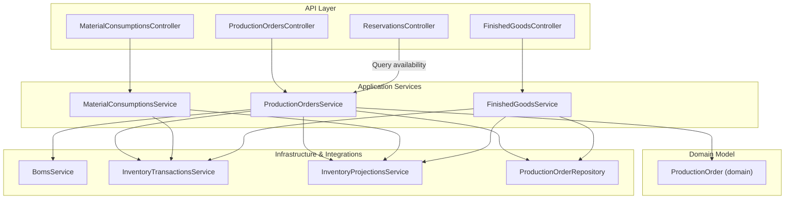
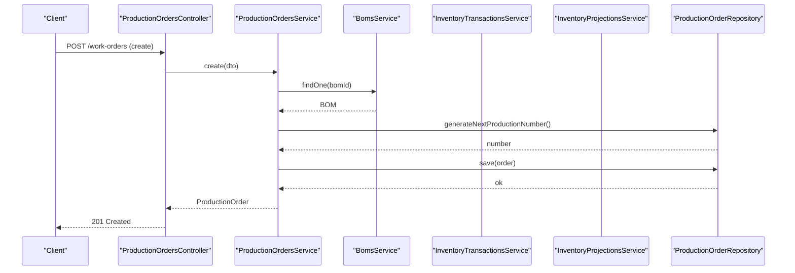
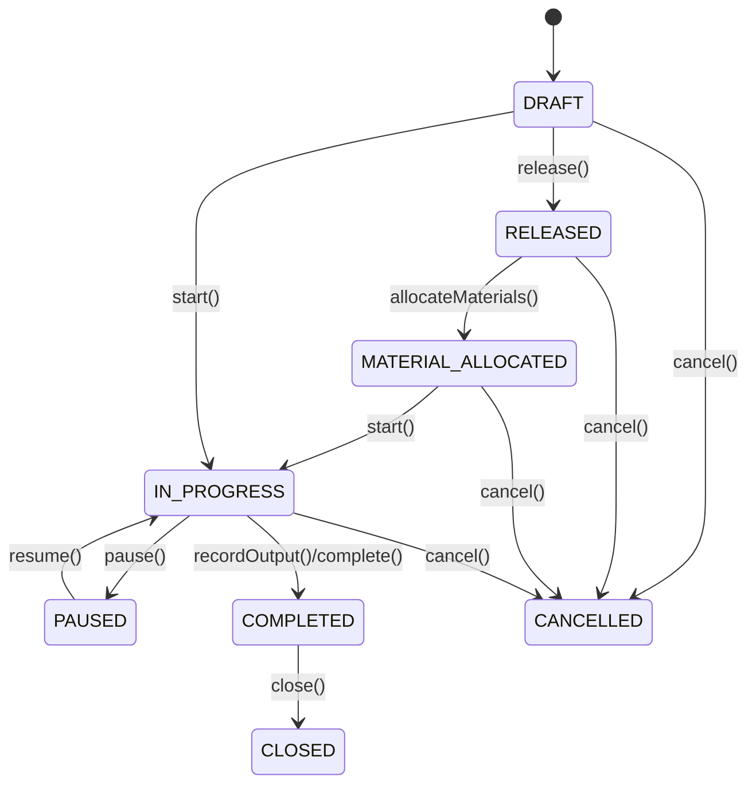
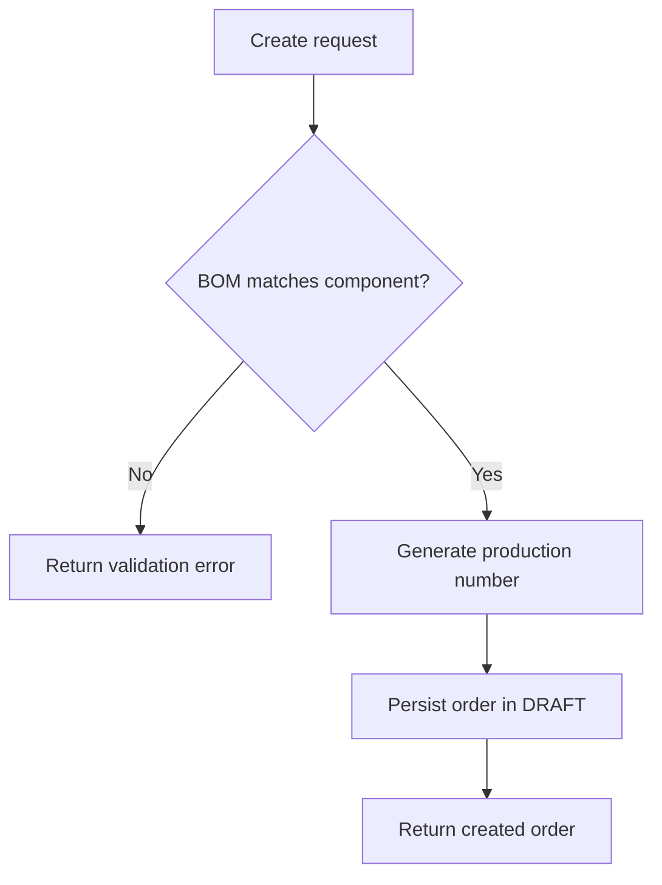
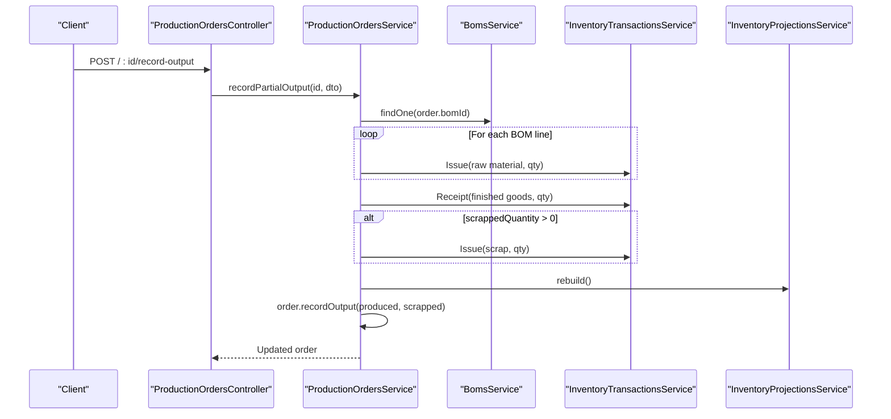
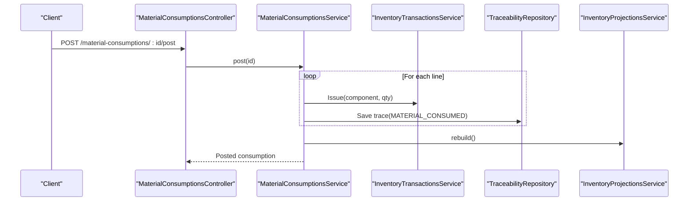
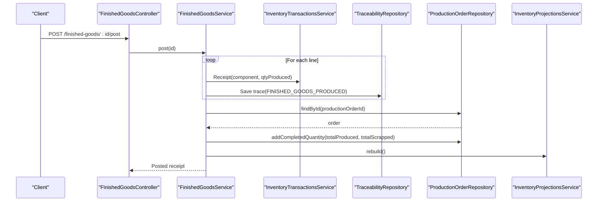
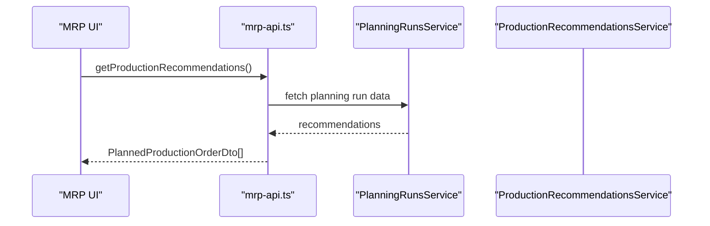
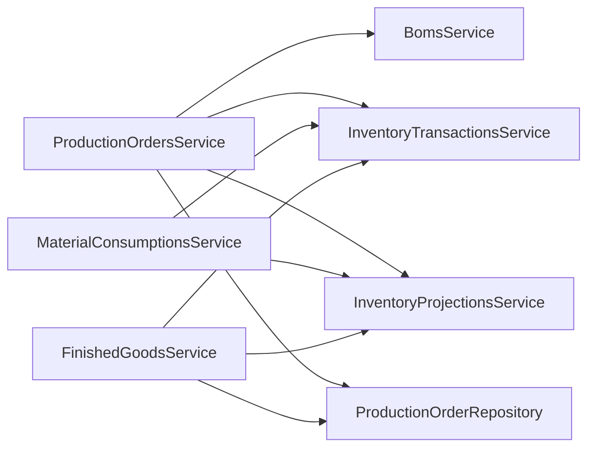

# Production Orders

<cite>
**Referenced Files in This Document**
- [production-orders.controller.ts](file://apps/api/src/production-orders/production-orders.controller.ts)
- [production-orders.service.ts](file://apps/api/src/production-orders/production-orders.service.ts)
- [dtos.ts](file://apps/api/src/production-orders/dtos.ts)
- [production-orders.module.ts](file://apps/api/src/production-orders/production-orders.module.ts)
- [production-order.ts](file://packages/manufacturing/src/production-orders/production-order.ts)
- [production-order.errors.ts](file://packages/manufacturing/src/production-orders/production-order.errors.ts)
- [material-consumptions.controller.ts](file://apps/api/src/material-consumptions/material-consumptions.controller.ts)
- [material-consumptions.service.ts](file://apps/api/src/material-consumptions/material-consumptions.service.ts)
- [finished-goods.controller.ts](file://apps/api/src/finished-goods/finished-goods.controller.ts)
- [finished-goods.service.ts](file://apps/api/src/finished-goods/finished-goods.service.ts)
- [reservations.controller.ts](file://apps/api/src/reservations/reservations.controller.ts)
- [planning-runs.service.ts](file://apps/api/src/planning-runs/planning-runs.service.ts)
- [mrp-api.ts](file://apps/web/lib/api/mrp-api.ts)
- [0017-production-orders.md](file://docs/rfcs/0017-production-orders.md)
</cite>

## Table of Contents
1. Introduction
2. Project Structure
3. Core Components
4. Architecture Overview
5. Detailed Component Analysis
6. Dependency Analysis
7. Performance Considerations
8. Troubleshooting Guide
9. Conclusion
10. Appendices

## Introduction
This document explains the end-to-end Production Order lifecycle in Ananya ERP, from creation through completion and closure. It covers planning via MRP recommendations, scheduling, execution (material consumption, output recording, scrap), and final receipt and closure. It also documents states, priorities, status transitions, API endpoints, integrations with BOMs, inventory reservations, material consumption, and finished goods receipt, along with optimization and performance guidance.

## Project Structure
Production Order functionality is implemented as a NestJS module exposing REST endpoints, backed by a domain model in the manufacturing package and integrated with inventory, projections, and MRP services.

**Diagram sources**
- [production-orders.controller.ts:26-128](file://apps/api/src/production-orders/production-orders.controller.ts#L26-L128)
- [production-orders.service.ts:58-66](file://apps/api/src/production-orders/production-orders.service.ts#L58-L66)
- [material-consumptions.service.ts:22-31](file://apps/api/src/material-consumptions/material-consumptions.service.ts#L22-L31)
- [finished-goods.service.ts:23-34](file://apps/api/src/finished-goods/finished-goods.service.ts#L23-L34)
- [production-order.ts:71-108](file://packages/manufacturing/src/production-orders/production-order.ts#L71-L108)

**Section sources**
- [production-orders.controller.ts:26-128](file://apps/api/src/production-orders/production-orders.controller.ts#L26-L128)
- [production-orders.module.ts:12-27](file://apps/api/src/production-orders/production-orders.module.ts#L12-L27)

## Core Components
- Production Orders Controller: Exposes endpoints for creating, updating, releasing, starting, recording outputs/scrap, pausing/resuming, completing, closing, canceling, and deleting production orders. Also provides listing and detail queries including material requirements and activity timeline.
- Production Orders Service: Orchestrates order state transitions, material issues/receipts, scrap handling, and timeline assembly. Validates BOM-product alignment and enforces status rules.
- Domain Model (ProductionOrder): Encapsulates lifecycle state machine, quantity tracking, and operations support.
- Material Consumption: Allows drafting and posting consumption lines that issue materials and record traceability.
- Finished Goods Receipt: Allows drafting and posting receipts that receive finished goods, update traceability, and increment production order quantities.
- Reservations: Provides reservation management and availability queries used during planning and allocation.

**Section sources**
- [production-orders.controller.ts:26-128](file://apps/api/src/production-orders/production-orders.controller.ts#L26-L128)
- [production-orders.service.ts:68-118](file://apps/api/src/production-orders/production-orders.service.ts#L68-L118)
- [production-order.ts:71-271](file://packages/manufacturing/src/production-orders/production-order.ts#L71-L271)
- [material-consumptions.controller.ts:5-34](file://apps/api/src/material-consumptions/material-consumptions.controller.ts#L5-L34)
- [material-consumptions.service.ts:33-113](file://apps/api/src/material-consumptions/material-consumptions.service.ts#L33-L113)
- [finished-goods.controller.ts:5-32](file://apps/api/src/finished-goods/finished-goods.controller.ts#L5-L32)
- [finished-goods.service.ts:36-124](file://apps/api/src/finished-goods/finished-goods.service.ts#L36-L124)
- [reservations.controller.ts:17-83](file://apps/api/src/reservations/reservations.controller.ts#L17-L83)

## Architecture Overview
The system follows a layered architecture:
- API layer exposes REST endpoints grouped under work-orders and production-orders.
- Application services coordinate business logic and integrate with domain models and infrastructure.
- Domain model enforces invariants and state transitions.
- Infrastructure includes repositories and integrations to inventory transactions and projections.

**Diagram sources**
- [production-orders.controller.ts:33-36](file://apps/api/src/production-orders/production-orders.controller.ts#L33-L36)
- [production-orders.service.ts:68-93](file://apps/api/src/production-orders/production-orders.service.ts#L68-L93)

## Detailed Component Analysis

### Production Order Lifecycle and State Machine
The domain model defines the canonical lifecycle and transitions:
- DRAFT → RELEASED → MATERIAL_ALLOCATED → IN_PROGRESS → COMPLETED → CLOSED
- CANCELLED can be reached from non-terminal states
- Start is allowed from DRAFT, RELEASED, or MATERIAL_ALLOCATED
- Output recording auto-transitions to COMPLETED when planned quantity is met

**Diagram sources**
- [production-order.ts:164-260](file://packages/manufacturing/src/production-orders/production-order.ts#L164-L260)

**Section sources**
- [production-order.ts:7-16](file://packages/manufacturing/src/production-orders/production-order.ts#L7-L16)
- [production-order.ts:164-260](file://packages/manufacturing/src/production-orders/production-order.ts#L164-L260)
- [0017-production-orders.md:115-123](file://docs/rfcs/0017-production-orders.md#L115-L123)

### Creating and Updating Production Orders
- Create: Validates BOM matches product component, generates unique production number, persists order in DRAFT.
- Update: Allowed only in DRAFT; updates header fields like location, priority, planned quantity, dates, notes.

**Diagram sources**
- [production-orders.service.ts:68-93](file://apps/api/src/production-orders/production-orders.service.ts#L68-L93)

**Section sources**
- [production-orders.service.ts:68-118](file://apps/api/src/production-orders/production-orders.service.ts#L68-L118)
- [dtos.ts:17-80](file://apps/api/src/production-orders/dtos.ts#L17-L80)

### Releasing, Starting, Pausing, Resuming
- Release: Transitions DRAFT to RELEASED.
- Start: Transitions to IN_PROGRESS; sets start date if missing.
- Pause/Resume: Temporarily halt and continue production.

**Section sources**
- [production-orders.service.ts:186-215](file://apps/api/src/production-orders/production-orders.service.ts#L186-L215)
- [production-order.ts:186-215](file://packages/manufacturing/src/production-orders/production-order.ts#L186-L215)

### Recording Outputs and Scrap
- Partial output: Issues proportional raw materials based on BOM lines and scrap factors, receives finished goods, posts scrap if provided, rebuilds projections, updates completed/scrapped quantities.
- Scrap: Issues scrap quantity from location and records traceability events.

**Diagram sources**
- [production-orders.service.ts:204-273](file://apps/api/src/production-orders/production-orders.service.ts#L204-L273)

**Section sources**
- [production-orders.service.ts:204-301](file://apps/api/src/production-orders/production-orders.service.ts#L204-L301)

### Completing and Closing
- Complete: Optionally posts remaining materials and finished goods, then marks order COMPLETED with end date.
- Close: Finalizes order to CLOSED after completion.

**Section sources**
- [production-orders.service.ts:317-365](file://apps/api/src/production-orders/production-orders.service.ts#L317-L365)
- [production-order.ts:229-249](file://packages/manufacturing/src/production-orders/production-order.ts#L229-L249)

### Activity Timeline
- Aggregates creation, start, material consumed, output produced, scrap recorded, completed events into a chronological timeline for an order.

**Section sources**
- [production-orders.service.ts:367-447](file://apps/api/src/production-orders/production-orders.service.ts#L367-L447)

### Material Consumption Integration
- Draft consumption records can be created and posted. Posting issues materials per line and records traceability, then marks consumption posted and rebuilds projections.

**Diagram sources**
- [material-consumptions.controller.ts:31-34](file://apps/api/src/material-consumptions/material-consumptions.controller.ts#L31-L34)
- [material-consumptions.service.ts:70-113](file://apps/api/src/material-consumptions/material-consumptions.service.ts#L70-L113)

**Section sources**
- [material-consumptions.controller.ts:5-34](file://apps/api/src/material-consumptions/material-consumptions.controller.ts#L5-L34)
- [material-consumptions.service.ts:33-113](file://apps/api/src/material-consumptions/material-consumptions.service.ts#L33-L113)

### Finished Goods Receipt Integration
- Draft receipts can be created and posted. Posting receives finished goods per line, records traceability, updates production order quantities, and rebuilds projections.

**Diagram sources**
- [finished-goods.controller.ts:29-32](file://apps/api/src/finished-goods/finished-goods.controller.ts#L29-L32)
- [finished-goods.service.ts:70-124](file://apps/api/src/finished-goods/finished-goods.service.ts#L70-L124)

**Section sources**
- [finished-goods.controller.ts:5-32](file://apps/api/src/finished-goods/finished-goods.controller.ts#L5-L32)
- [finished-goods.service.ts:36-124](file://apps/api/src/finished-goods/finished-goods.service.ts#L36-L124)

### Reservations and Availability
- Reservations controller supports creating, querying, fulfilling, releasing, and canceling reservations, plus checking available quantities by component and location.

**Section sources**
- [reservations.controller.ts:17-83](file://apps/api/src/reservations/reservations.controller.ts#L17-L83)

### Planning and MRP Integration
- Planning runs compute gross requirements, shortages, and generate production recommendations. The web client retrieves these recommendations to convert into production orders.

**Diagram sources**
- [planning-runs.service.ts:120-162](file://apps/api/src/planning-runs/planning-runs.service.ts#L120-L162)
- [mrp-api.ts:165-180](file://apps/web/lib/api/mrp-api.ts#L165-L180)

**Section sources**
- [planning-runs.service.ts:120-162](file://apps/api/src/planning-runs/planning-runs.service.ts#L120-L162)
- [mrp-api.ts:165-180](file://apps/web/lib/api/mrp-api.ts#L165-L180)

## Dependency Analysis
Key dependencies and coupling:
- ProductionOrdersService depends on BomsService, InventoryTransactionsService, InventoryProjectionsService, and ProductionOrderRepository.
- MaterialConsumptionsService and FinishedGoodsService depend on InventoryTransactionsService and InventoryProjectionsService, and write traceability records.
- Domain model encapsulates state transitions and invariants, reducing coupling at the application layer.

**Diagram sources**
- [production-orders.service.ts:58-66](file://apps/api/src/production-orders/production-orders.service.ts#L58-L66)
- [material-consumptions.service.ts:22-31](file://apps/api/src/material-consumptions/material-consumptions.service.ts#L22-L31)
- [finished-goods.service.ts:23-34](file://apps/api/src/finished-goods/finished-goods.service.ts#L23-L34)

**Section sources**
- [production-orders.module.ts:12-27](file://apps/api/src/production-orders/production-orders.module.ts#L12-L27)

## Performance Considerations
- Batch material issues and receipts: When recording partial outputs or completing orders, multiple inventory transactions are issued per BOM line. Grouping or batching where possible can reduce transaction overhead.
- Projection rebuilds: After material issues or receipts, projections are rebuilt. In high-throughput scenarios, consider debouncing or batching rebuilds to minimize load.
- Query filtering: Use query parameters (componentId, bomId, locationId, status, priority, search) to limit result sets and improve list performance.
- Avoid redundant starts: The service guards against duplicate start transitions, preventing unnecessary writes.

[No sources needed since this section provides general guidance]

## Troubleshooting Guide
Common errors and resolutions:
- Invalid status transition: Occurs when attempting actions not allowed in current state (e.g., editing a non-DRAFT order). Check order status before calling update or other mutating methods.
- Cannot record output on completed/cancelled orders: Ensure order is IN_PROGRESS before recording outputs or scrap.
- Only DRAFT orders can be deleted: Delete is restricted to draft state.
- BOM mismatch: Creation validates that BOM’s componentId matches the order’s componentId. Verify BOM selection.

**Section sources**
- [production-orders.service.ts:96-118](file://apps/api/src/production-orders/production-orders.service.ts#L96-L118)
- [production-orders.service.ts:204-213](file://apps/api/src/production-orders/production-orders.service.ts#L204-L213)
- [production-orders.service.ts:275-281](file://apps/api/src/production-orders/production-orders.service.ts#L275-L281)
- [production-order.errors.ts:1-24](file://packages/manufacturing/src/production-orders/production-order.errors.ts#L1-L24)

## Conclusion
Ananya ERP’s Production Order module provides a robust, domain-driven workflow for manufacturing execution. It integrates tightly with BOMs, inventory transactions, projections, and MRP recommendations, while enforcing strict state transitions and traceability. By leveraging the provided APIs and following the lifecycle patterns, teams can plan, schedule, execute, and close production efficiently with clear visibility and control.

[No sources needed since this section summarizes without analyzing specific files]

## Appendices

### API Endpoints Reference
- Create production order: POST /work-orders
- List production orders: GET /work-orders?componentId=&bomId=&locationId=&status=&priority=&search=
- Get production order: GET /work-orders/:id
- Get material requirements: GET /work-orders/:id/materials
- Get activity timeline: GET /work-orders/:id/timeline
- Update production order: PUT /work-orders/:id
- Release: POST /work-orders/:id/release
- Start: POST /work-orders/:id/start
- Record partial output: POST /work-orders/:id/record-output
- Record scrap: POST /work-orders/:id/record-scrap
- Pause: POST /work-orders/:id/pause
- Resume: POST /work-orders/:id/resume
- Complete: POST /work-orders/:id/complete
- Close: POST /work-orders/:id/close
- Cancel: POST /work-orders/:id/cancel
- Delete: DELETE /work-orders/:id

Note: The controller binds both /work-orders and /production-orders paths.

**Section sources**
- [production-orders.controller.ts:26-128](file://apps/api/src/production-orders/production-orders.controller.ts#L26-L128)

### DTOs Summary
- CreateProductionOrderDto: Required bomId, componentId, quantityPlanned; optional locationId, priority, startDate, endDate, notes, createdBy.
- UpdateProductionOrderDto: Optional fields for header updates.
- RecordPartialOutputDto: Required producedQuantity; optional scrappedQuantity, notes.
- RecordScrapDto: Required componentId, quantity, reason.
- CompleteProductionOrderDto: Optional producedQuantity to finalize remaining output.

**Section sources**
- [dtos.ts:17-117](file://apps/api/src/production-orders/dtos.ts#L17-L117)

### Practical Examples

#### Generate Production Orders from MRP Recommendations
- Retrieve production recommendations via MRP API and convert them into production orders using the create endpoint. Validate BOM-product alignment and set appropriate priorities and schedules.

**Section sources**
- [mrp-api.ts:165-180](file://apps/web/lib/api/mrp-api.ts#L165-L180)
- [production-orders.controller.ts:33-36](file://apps/api/src/production-orders/production-orders.controller.ts#L33-L36)

#### Allocate Resources and Reserve Materials
- Use reservations endpoints to check availability and reserve materials prior to starting production. Align reservation quantities with material requirements derived from BOMs.

**Section sources**
- [reservations.controller.ts:27-52](file://apps/api/src/reservations/reservations.controller.ts#L27-L52)

#### Monitor Progress and Handle Exceptions
- Track progress via activity timeline and material requirements endpoints. Handle exceptions such as invalid transitions or insufficient stock by validating statuses and adjusting plans.

**Section sources**
- [production-orders.controller.ts:62-70](file://apps/api/src/production-orders/production-orders.controller.ts#L62-L70)
- [production-orders.service.ts:367-447](file://apps/api/src/production-orders/production-orders.service.ts#L367-L447)

#### Integrate BOMs, Inventory Reservations, Material Consumption, and Finished Goods Receipt
- BOM integration: Ensure BOM matches product component during creation.
- Inventory reservations: Reserve required materials before starting.
- Material consumption: Post consumption records to issue materials and record traceability.
- Finished goods receipt: Post receipts to receive finished goods and update production order quantities.

**Section sources**
- [production-orders.service.ts:68-93](file://apps/api/src/production-orders/production-orders.service.ts#L68-L93)
- [material-consumptions.service.ts:70-113](file://apps/api/src/material-consumptions/material-consumptions.service.ts#L70-L113)
- [finished-goods.service.ts:70-124](file://apps/api/src/finished-goods/finished-goods.service.ts#L70-L124)

### Capacity Planning Considerations
- While capacity planning features are referenced in RFCs, current implementation focuses on production order execution and inventory integration. Future enhancements may include workstation capacity constraints and scheduling optimizations.

**Section sources**
- [0017-production-orders.md:205-208](file://docs/rfcs/0017-production-orders.md#L205-L208)