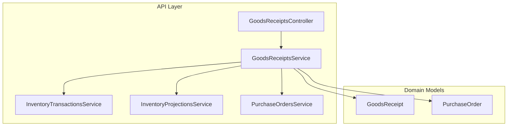
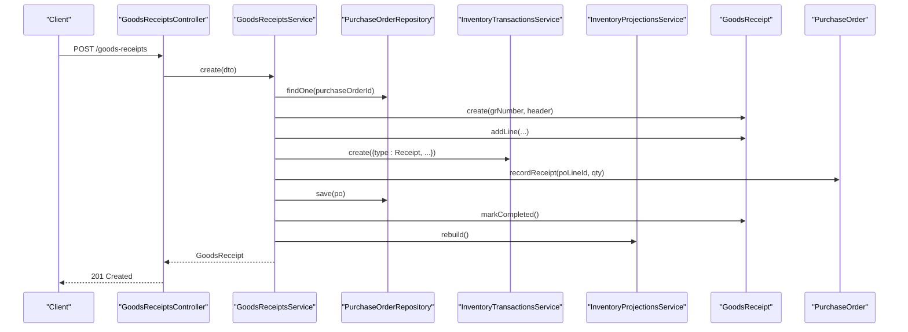
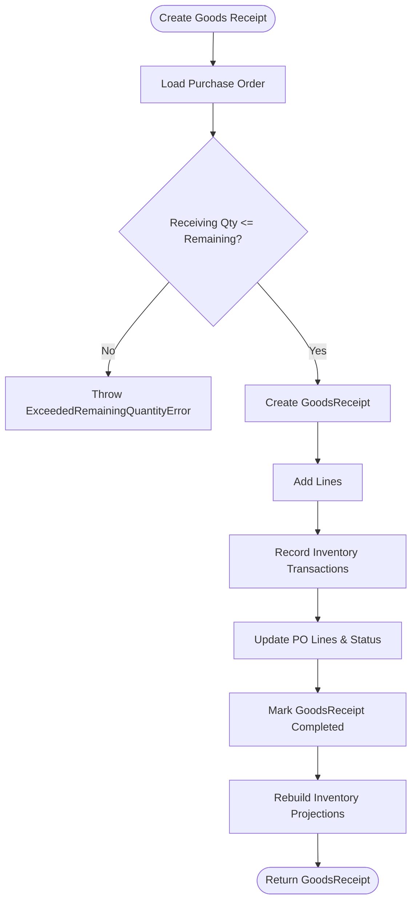
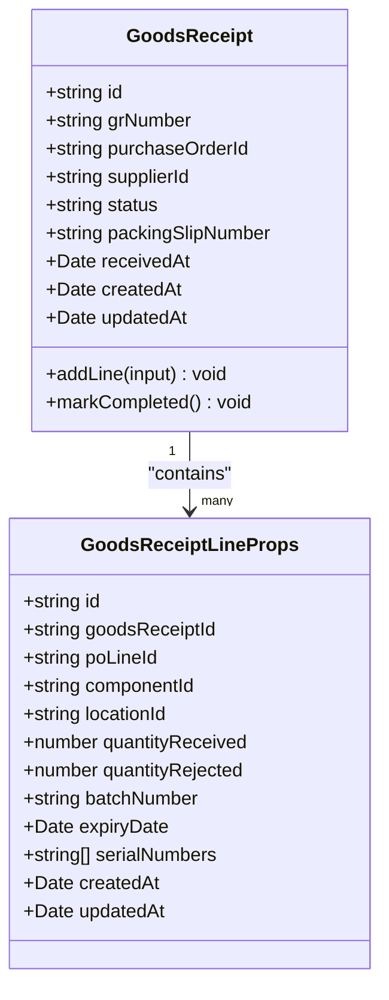
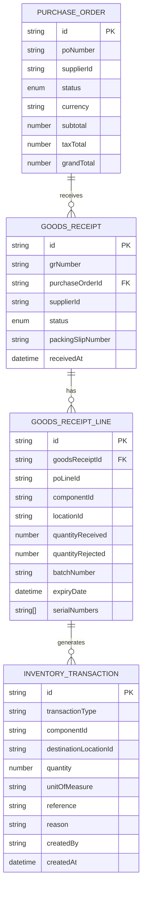
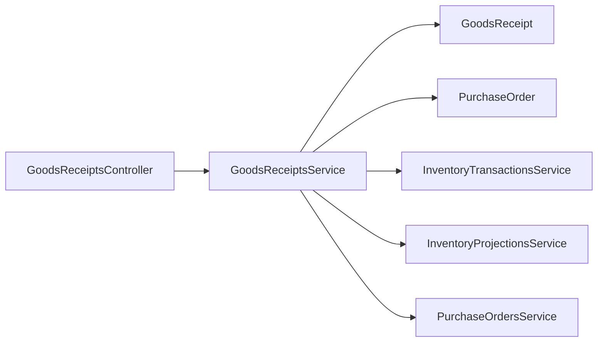

# Goods Receipt Processing

<cite>
**Referenced Files in This Document**
- [goods-receipts.controller.ts](file://apps/api/src/goods-receipts/goods-receipts.controller.ts)
- [goods-receipts.service.ts](file://apps/api/src/goods-receipts/goods-receipts.service.ts)
- [dtos.ts](file://apps/api/src/goods-receipts/dtos.ts)
- [gr-exception.filter.ts](file://apps/api/src/goods-receipts/gr-exception.filter.ts)
- [inventory-transactions.service.ts](file://apps/api/src/inventory-transactions/inventory-transactions.service.ts)
- [inventory-projections.service.ts](file://apps/api/src/inventory-projections/inventory-projections.service.ts)
- [purchase-orders.service.ts](file://apps/api/src/purchase-orders/purchase-orders.service.ts)
- [goods-receipt.ts](file://packages/procurement/src/goods-receipts/goods-receipt.ts)
- [create-goods-receipt.ts](file://packages/procurement/src/goods-receipts/create-goods-receipt.ts)
- [goods-receipt.errors.ts](file://packages/procurement/src/goods-receipts/goods-receipt.errors.ts)
- [purchase-order.ts](file://packages/procurement/src/purchase-orders/purchase-order.ts)
</cite>

## Table of Contents
1. [Introduction](#introduction)
2. [Project Structure](#project-structure)
3. [Core Components](#core-components)
4. [Architecture Overview](#architecture-overview)
5. [Detailed Component Analysis](#detailed-component-analysis)
6. [Dependency Analysis](#dependency-analysis)
7. [Performance Considerations](#performance-considerations)
8. [Troubleshooting Guide](#troubleshooting-guide)
9. [Conclusion](#conclusion)

## Introduction
This document explains Ananya ERP’s Goods Receipt Processing system. It covers the end-to-end workflow for receiving goods against purchase orders, including receipt creation, quantity verification, quality handling (rejection), inventory updates, and integration with warehouse operations and financial accounting via inventory transactions. It also documents the data model for goods receipts, their relationship to purchase orders, and how stock levels are updated through inventory transactions and projections.

## Project Structure
The Goods Receipt feature spans API controllers/services and domain models:
- API layer exposes endpoints to create receipts, add lines, and post receipts.
- Service layer orchestrates validation, inventory ledger updates, PO reconciliation, and projection rebuilds.
- Domain models define GoodsReceipt and PurchaseOrder entities with state transitions and business rules.

**Diagram sources**
- [goods-receipts.controller.ts:14-45](file://apps/api/src/goods-receipts/goods-receipts.controller.ts#L14-L45)
- [goods-receipts.service.ts:27-40](file://apps/api/src/goods-receipts/goods-receipts.service.ts#L27-L40)
- [goods-receipt.ts:56-79](file://packages/procurement/src/goods-receipts/goods-receipt.ts#L56-L79)
- [purchase-order.ts:81-119](file://packages/procurement/src/purchase-orders/purchase-order.ts#L81-L119)

**Section sources**
- [goods-receipts.controller.ts:14-45](file://apps/api/src/goods-receipts/goods-receipts.controller.ts#L14-L45)
- [goods-receipts.service.ts:27-40](file://apps/api/src/goods-receipts/goods-receipts.service.ts#L27-L40)

## Core Components
- GoodsReceiptsController: Exposes REST endpoints for creating receipts, adding lines, listing receipts, and posting receipts.
- GoodsReceiptsService: Implements business logic for receipt creation, line addition, posting, inventory transaction recording, PO reconciliation, and projection rebuild.
- InventoryTransactionsService: Creates inventory ledger entries and enforces component lifecycle constraints.
- InventoryProjectionsService: Rebuilds inventory projections after changes.
- PurchaseOrdersService: Provides access to purchase orders for validation and reconciliation.
- Domain Models: GoodsReceipt and PurchaseOrder encapsulate state, validations, and business rules.

Key responsibilities:
- Validate receiving quantities against outstanding PO quantities.
- Record inventory receipts and update PO line received quantities.
- Transition GoodsReceipt status from DRAFT to COMPLETED upon posting.
- Maintain batch/expiry/serial tracking per receipt line.

**Section sources**
- [goods-receipts.controller.ts:14-45](file://apps/api/src/goods-receipts/goods-receipts.controller.ts#L14-L45)
- [goods-receipts.service.ts:42-116](file://apps/api/src/goods-receipts/goods-receipts.service.ts#L42-L116)
- [inventory-transactions.service.ts:19-31](file://apps/api/src/inventory-transactions/inventory-transactions.service.ts#L19-L31)
- [inventory-projections.service.ts:38-44](file://apps/api/src/inventory-projections/inventory-projections.service.ts#L38-L44)
- [goods-receipt.ts:81-140](file://packages/procurement/src/goods-receipts/goods-receipt.ts#L81-L140)
- [purchase-order.ts:163-174](file://packages/procurement/src/purchase-orders/purchase-order.ts#L163-L174)

## Architecture Overview
The Goods Receipt workflow integrates procurement, inventory, and projections:

**Diagram sources**
- [goods-receipts.controller.ts:19-22](file://apps/api/src/goods-receipts/goods-receipts.controller.ts#L19-L22)
- [goods-receipts.service.ts:42-116](file://apps/api/src/goods-receipts/goods-receipts.service.ts#L42-L116)
- [goods-receipt.ts:81-140](file://packages/procurement/src/goods-receipts/goods-receipt.ts#L81-L140)
- [purchase-order.ts:163-174](file://packages/procurement/src/purchase-orders/purchase-order.ts#L163-L174)

## Detailed Component Analysis

### GoodsReceiptsController
- Endpoints:
  - POST /goods-receipts: Create a new goods receipt with optional lines.
  - GET /goods-receipts: List receipts filtered by purchase order or supplier.
  - GET /goods-receipts/:id: Retrieve a specific receipt.
  - POST /goods-receipts/:id/lines: Add a line to an existing draft receipt.
  - POST /goods-receipts/:id/post: Post a draft receipt to finalize it.

Error handling is centralized via GrExceptionFilter.

**Section sources**
- [goods-receipts.controller.ts:14-45](file://apps/api/src/goods-receipts/goods-receipts.controller.ts#L14-L45)

### GoodsReceiptsService
Responsibilities:
- Create GoodsReceipt:
  - Validates that receiving quantities do not exceed remaining PO quantities.
  - Generates GR number, creates header, adds lines, records inventory receipts, updates PO lines, marks receipt completed, and rebuilds projections.
- Add Line:
  - Adds a line to a draft receipt and persists it.
- Post Receipt:
  - Ensures receipt is in DRAFT state.
  - Records inventory receipts for each line, updates PO lines, marks receipt completed, and rebuilds projections.
- PO Reconciliation:
  - Updates PO line quantityReceived and sets PO status to PARTIALLY_RECEIVED or FULFILLED.

Validation and error handling:
- Throws domain errors when exceeding remaining PO quantities or when attempting invalid state transitions.
- Uses GrExceptionFilter to map domain errors to HTTP responses.

**Diagram sources**
- [goods-receipts.service.ts:42-116](file://apps/api/src/goods-receipts/goods-receipts.service.ts#L42-L116)
- [goods-receipts.service.ts:182-205](file://apps/api/src/goods-receipts/goods-receipts.service.ts#L182-L205)
- [goods-receipt.errors.ts:24-31](file://packages/procurement/src/goods-receipts/goods-receipt.errors.ts#L24-L31)

**Section sources**
- [goods-receipts.service.ts:42-116](file://apps/api/src/goods-receipts/goods-receipts.service.ts#L42-L116)
- [goods-receipts.service.ts:133-180](file://apps/api/src/goods-receipts/goods-receipts.service.ts#L133-L180)
- [goods-receipts.service.ts:182-205](file://apps/api/src/goods-receipts/goods-receipts.service.ts#L182-L205)

### Data Model: GoodsReceipt and Lines
GoodsReceipt fields:
- Header: id, grNumber, purchaseOrderId, supplierId, status, packingSlipNumber, receivedAt, timestamps.
- Lines: id, goodsReceiptId, poLineId, componentId, locationId, quantityReceived, quantityRejected, batchNumber, expiryDate, serialNumbers, timestamps.

State transitions:
- DRAFT -> COMPLETED on successful posting.
- Adding lines is allowed only in DRAFT state.

**Diagram sources**
- [goods-receipt.ts:9-22](file://packages/procurement/src/goods-receipts/goods-receipt.ts#L9-L22)
- [goods-receipt.ts:24-35](file://packages/procurement/src/goods-receipts/goods-receipt.ts#L24-L35)
- [goods-receipt.ts:56-79](file://packages/procurement/src/goods-receipts/goods-receipt.ts#L56-L79)
- [goods-receipt.ts:99-140](file://packages/procurement/src/goods-receipts/goods-receipt.ts#L99-L140)

**Section sources**
- [goods-receipt.ts:9-22](file://packages/procurement/src/goods-receipts/goods-receipt.ts#L9-L22)
- [goods-receipt.ts:24-35](file://packages/procurement/src/goods-receipts/goods-receipt.ts#L24-L35)
- [goods-receipt.ts:56-79](file://packages/procurement/src/goods-receipts/goods-receipt.ts#L56-L79)
- [goods-receipt.ts:99-140](file://packages/procurement/src/goods-receipts/goods-receipt.ts#L99-L140)

### Relationship Between Goods Receipts, Purchase Orders, and Inventory Transactions
- Goods Receipts reference Purchase Orders and link to PO lines via poLineId.
- On receipt creation or posting, inventory transactions are recorded for each line with type "Receipt".
- PO lines accumulate quantityReceived; PO status becomes PARTIALLY_RECEIVED or FULFILLED accordingly.

**Diagram sources**
- [goods-receipt.ts:9-22](file://packages/procurement/src/goods-receipts/goods-receipt.ts#L9-L22)
- [goods-receipt.ts:24-35](file://packages/procurement/src/goods-receipts/goods-receipt.ts#L24-L35)
- [purchase-order.ts:17-49](file://packages/procurement/src/purchase-orders/purchase-order.ts#L17-L49)
- [inventory-transactions.service.ts:19-31](file://apps/api/src/inventory-transactions/inventory-transactions.service.ts#L19-L31)

**Section sources**
- [goods-receipts.service.ts:86-116](file://apps/api/src/goods-receipts/goods-receipts.service.ts#L86-L116)
- [goods-receipts.service.ts:146-180](file://apps/api/src/goods-receipts/goods-receipts.service.ts#L146-L180)
- [purchase-order.ts:163-174](file://packages/procurement/src/purchase-orders/purchase-order.ts#L163-L174)

### Practical Examples

#### Example 1: Full Delivery Against a Purchase Order
- Create a Goods Receipt with lines matching PO lines.
- System validates quantities, records inventory receipts, updates PO lines, and sets PO status to FULFILLED.

Steps:
- POST /goods-receipts with lines containing poLineId, componentId, locationId, quantityReceived.
- Service validates against remaining PO quantities and posts immediately if lines exist.

**Section sources**
- [goods-receipts.service.ts:42-116](file://apps/api/src/goods-receipts/goods-receipts.service.ts#L42-L116)
- [purchase-order.ts:163-174](file://packages/procurement/src/purchase-orders/purchase-order.ts#L163-L174)

#### Example 2: Partial Delivery
- Receive less than ordered on one or more PO lines.
- PO status transitions to PARTIALLY_RECEIVED until all lines are fully received.

Steps:
- Create Goods Receipt with quantityReceived < quantityOrdered for some lines.
- Service updates PO lines and status accordingly.

**Section sources**
- [goods-receipts.service.ts:182-205](file://apps/api/src/goods-receipts/goods-receipts.service.ts#L182-L205)
- [purchase-order.ts:163-174](file://packages/procurement/src/purchase-orders/purchase-order.ts#L163-L174)

#### Example 3: Handling Discrepancies and Quality Checks
- Use quantityRejected to capture rejected units during inspection.
- Serial numbers and batch/expiry tracking support traceability.

Steps:
- Add line with quantityReceived and quantityRejected.
- Persist batchNumber, expiryDate, and serialNumbers for traceability.

**Section sources**
- [dtos.ts:12-45](file://apps/api/src/goods-receipts/dtos.ts#L12-L45)
- [goods-receipt.ts:9-22](file://packages/procurement/src/goods-receipts/goods-receipt.ts#L9-L22)

#### Example 4: Updating Stock Levels
- Each receipt line generates an inventory transaction with type "Receipt".
- Inventory projections are rebuilt to reflect updated balances.

Steps:
- Service calls InventoryTransactionsService.create for each line.
- Service calls InventoryProjectionsService.rebuild.

**Section sources**
- [goods-receipts.service.ts:86-116](file://apps/api/src/goods-receipts/goods-receipts.service.ts#L86-L116)
- [inventory-transactions.service.ts:19-31](file://apps/api/src/inventory-transactions/inventory-transactions.service.ts#L19-L31)
- [inventory-projections.service.ts:38-44](file://apps/api/src/inventory-projections/inventory-projections.service.ts#L38-L44)

### Integration Points
- Warehouse Operations:
  - Destination locationId on receipt lines directs stock into specific warehouse locations/bins.
- Quality Control:
  - quantityRejected captures inspection outcomes; batch/expiry/serial enable traceability.
- Financial Accounting:
  - Inventory transactions provide audit trails for stock movements; future integration can use these for valuation and cost postings.

**Section sources**
- [goods-receipts.service.ts:86-116](file://apps/api/src/goods-receipts/goods-receipts.service.ts#L86-L116)
- [inventory-transactions.service.ts:19-31](file://apps/api/src/inventory-transactions/inventory-transactions.service.ts#L19-L31)

## Dependency Analysis
High-level dependencies:
- GoodsReceiptsController depends on GoodsReceiptsService.
- GoodsReceiptsService depends on:
  - GoodsReceipt domain model.
  - PurchaseOrder domain model.
  - InventoryTransactionsService.
  - InventoryProjectionsService.
  - PurchaseOrdersService (for PO lookup).

**Diagram sources**
- [goods-receipts.controller.ts:14-45](file://apps/api/src/goods-receipts/goods-receipts.controller.ts#L14-L45)
- [goods-receipts.service.ts:27-40](file://apps/api/src/goods-receipts/goods-receipts.service.ts#L27-L40)

**Section sources**
- [goods-receipts.controller.ts:14-45](file://apps/api/src/goods-receipts/goods-receipts.controller.ts#L14-L45)
- [goods-receipts.service.ts:27-40](file://apps/api/src/goods-receipts/goods-receipts.service.ts#L27-L40)

## Performance Considerations
- Asynchronous Projection Rebuild:
  - After posting receipts, inventory projections are rebuilt asynchronously to avoid blocking request completion.
- Validation Efficiency:
  - Early validation of receiving quantities against PO outstanding amounts prevents unnecessary processing.
- Repository Abstraction:
  - Using repositories decouples persistence and allows efficient querying and saving.

[No sources needed since this section provides general guidance]

## Troubleshooting Guide
Common issues and resolutions:
- Exceeded Remaining Quantity:
  - Occurs when receiving more than the outstanding PO quantity.
  - Resolution: Adjust quantityReceived to match remaining PO balance.
- Invalid Goods Receipt Status:
  - Attempting to add lines or post a non-DRAFT receipt.
  - Resolution: Ensure receipt is in DRAFT before modifications or posting.
- Invalid Receiving Quantity:
  - Non-positive quantityReceived on a line.
  - Resolution: Provide a positive quantityReceived value.
- Not Found Errors:
  - Referencing a non-existent Goods Receipt or Purchase Order.
  - Resolution: Verify IDs and ensure entities exist.

Error mapping:
- Domain errors are mapped to HTTP status codes via GrExceptionFilter:
  - GoodsReceiptNotFoundError -> 404
  - InvalidGoodsReceiptStatusError, InvalidReceivingQuantityError, ExceededRemainingQuantityError -> 400

**Section sources**
- [goods-receipts.service.ts:42-60](file://apps/api/src/goods-receipts/goods-receipts.service.ts#L42-L60)
- [goods-receipts.service.ts:146-152](file://apps/api/src/goods-receipts/goods-receipts.service.ts#L146-L152)
- [goods-receipt.ts:99-140](file://packages/procurement/src/goods-receipts/goods-receipt.ts#L99-L140)
- [goods-receipt.errors.ts:3-31](file://packages/procurement/src/goods-receipts/goods-receipt.errors.ts#L3-L31)
- [gr-exception.filter.ts:15-46](file://apps/api/src/goods-receipts/gr-exception.filter.ts#L15-L46)

## Conclusion
Ananya ERP’s Goods Receipt Processing integrates procurement, inventory, and projections to ensure accurate stock updates and PO reconciliation. The system enforces robust validation, supports partial deliveries and quality checks, and maintains traceability through batch/expiry/serial tracking. By leveraging domain-driven design and clear service boundaries, the module provides a reliable foundation for warehouse operations and financial accounting integrations.