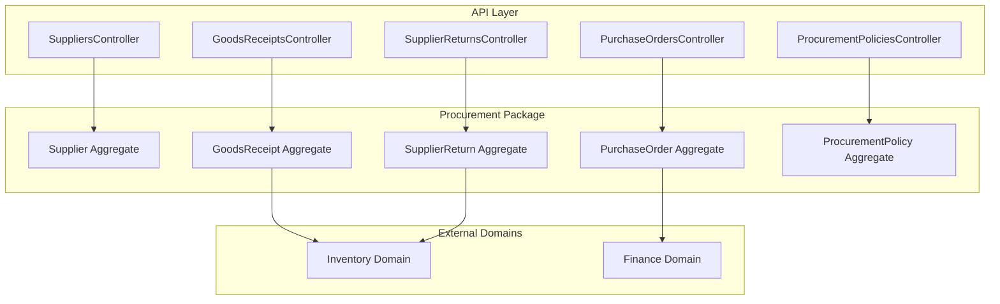
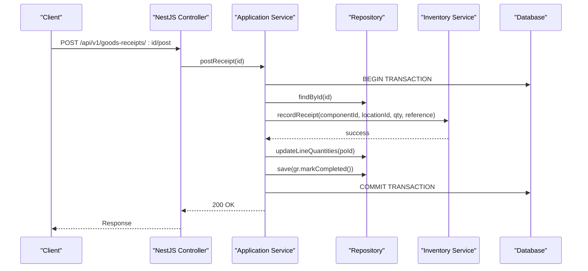
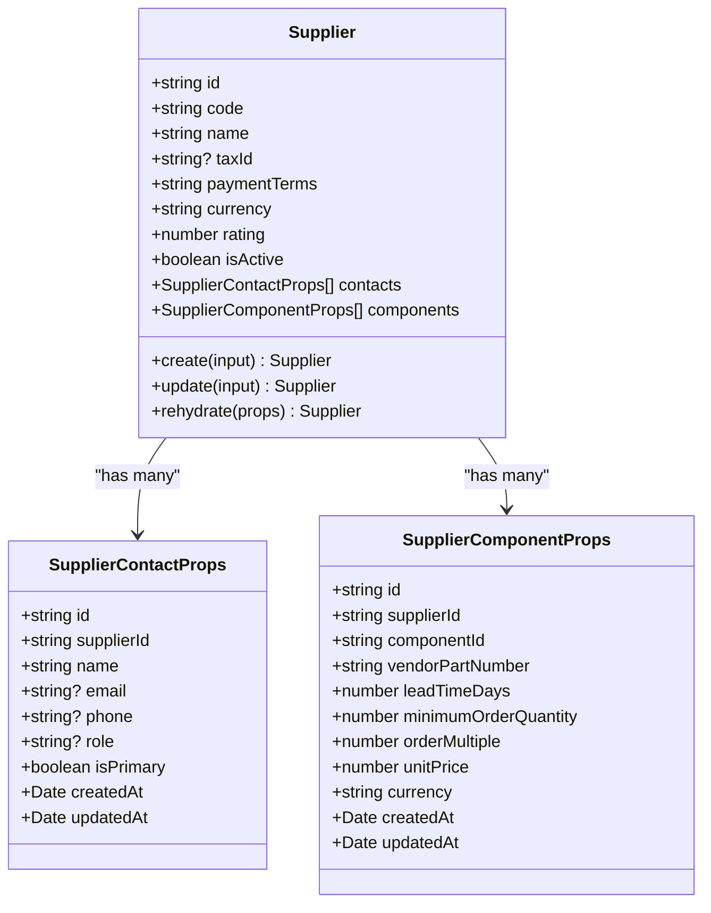
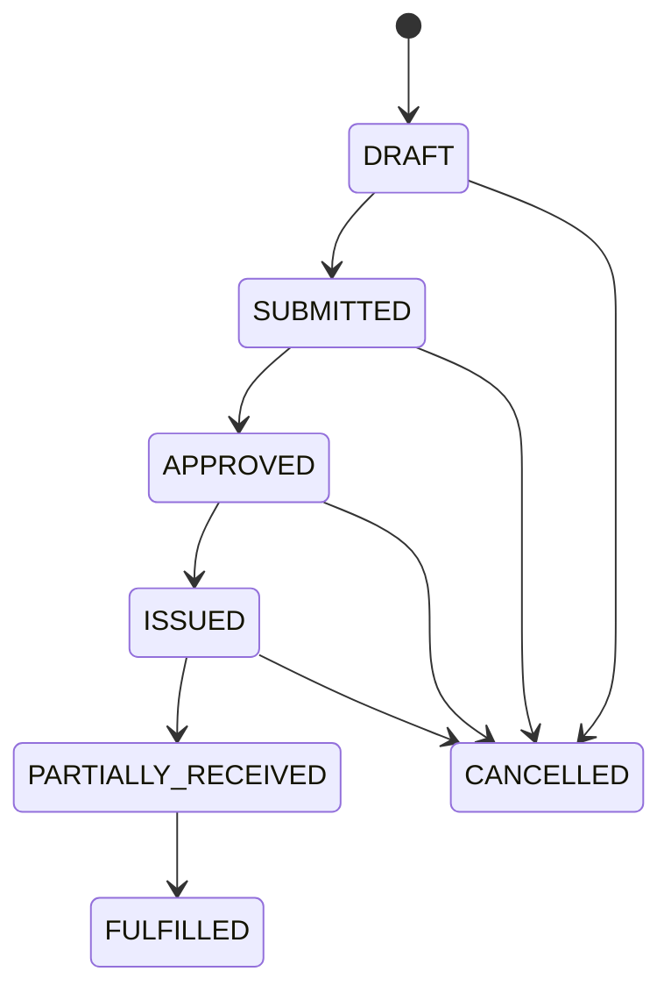
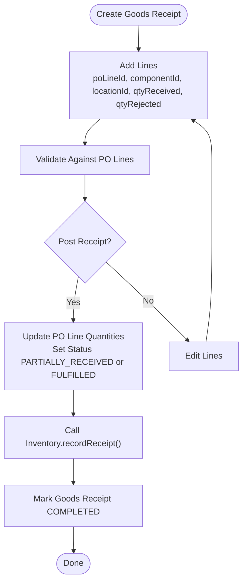
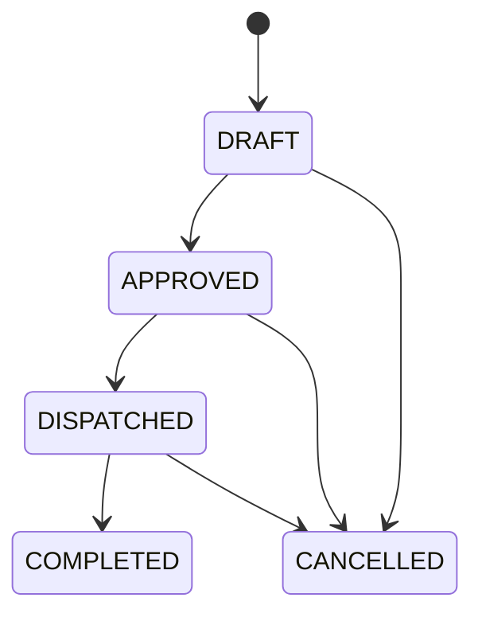
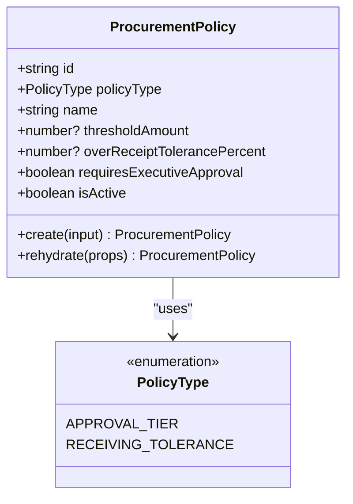
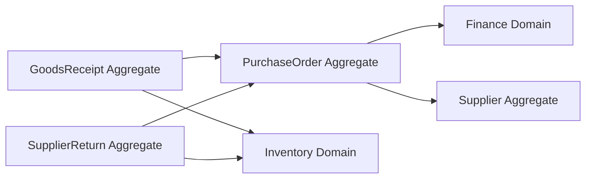

# Procurement & Supply Chain

<cite>
**Referenced Files in This Document**
- [0009-supplier-management.md](file://docs/rfcs/0009-supplier-management.md)
- [0010-purchase-orders.md](file://docs/rfcs/0010-purchase-orders.md)
- [0011-goods-receipt.md](file://docs/rfcs/0011-goods-receipt.md)
- [0012-supplier-returns.md](file://docs/rfcs/0012-supplier-returns.md)
- [0014-procurement-policies.md](file://docs/rfcs/0014-procurement-policies.md)
- [supplier.ts](file://packages/procurement/src/suppliers/supplier.ts)
- [purchase-order.ts](file://packages/procurement/src/purchase-orders/purchase-order.ts)
- [goods-receipt.ts](file://packages/procurement/src/goods-receipts/goods-receipt.ts)
- [supplier-return.ts](file://packages/procurement/src/supplier-returns/supplier-return.ts)
- [procurement-policy.ts](file://packages/procurement/src/policies/procurement-policy.ts)
- [suppliers.controller.ts](file://apps/api/src/suppliers/suppliers.controller.ts)
- [purchase-orders.controller.ts](file://apps/api/src/purchase-orders/purchase-orders.controller.ts)
- [goods-receipts.controller.ts](file://apps/api/src/goods-receipts/goods-receipts.controller.ts)
- [supplier-returns.controller.ts](file://apps/api/src/supplier-returns/supplier-returns.controller.ts)
- [procurement-policies.controller.ts](file://apps/api/src/procurement-policies/procurement-policies.controller.ts)
</cite>

## Table of Contents
1. [Introduction](#introduction)
2. [Project Structure](#project-structure)
3. [Core Components](#core-components)
4. [Architecture Overview](#architecture-overview)
5. [Detailed Component Analysis](#detailed-component-analysis)
6. [Dependency Analysis](#dependency-analysis)
7. [Performance Considerations](#performance-considerations)
8. [Troubleshooting Guide](#troubleshooting-guide)
9. [Conclusion](#conclusion)

## Introduction
This document explains Ananya ERP’s Procurement & Supply Chain domain, focusing on supplier management, purchase order lifecycle, goods receipt processing, supplier returns, and procurement policies. It covers the supply chain data model, key workflows from supplier onboarding through PO fulfillment and return processing, practical examples for common operations, and integration with Inventory and Finance domains. The documentation is grounded in the Procurement package implementation and RFC specifications.

## Project Structure
The Procurement domain is implemented as a NestJS API layer over a shared Procurement package:
- Domain models and aggregates live under packages/procurement/src.
- REST endpoints are exposed under apps/api/src for each subdomain (Suppliers, Purchase Orders, Goods Receipts, Supplier Returns, Procurement Policies).
- RFCs define the canonical data model, state machines, commands, queries, and cross-domain integrations.

**Diagram sources**
- [suppliers.controller.ts:23-80](file://apps/api/src/suppliers/suppliers.controller.ts#L23-L80)
- [purchase-orders.controller.ts:23-82](file://apps/api/src/purchase-orders/purchase-orders.controller.ts#L23-L82)
- [goods-receipts.controller.ts:14-45](file://apps/api/src/goods-receipts/goods-receipts.controller.ts#L14-L45)
- [supplier-returns.controller.ts:20-88](file://apps/api/src/supplier-returns/supplier-returns.controller.ts#L20-L88)
- [procurement-policies.controller.ts:5-22](file://apps/api/src/procurement-policies/procurement-policies.controller.ts#L5-L22)
- [supplier.ts:65-162](file://packages/procurement/src/suppliers/supplier.ts#L65-L162)
- [purchase-order.ts:81-274](file://packages/procurement/src/purchase-orders/purchase-order.ts#L81-L274)
- [goods-receipt.ts:56-145](file://packages/procurement/src/goods-receipts/goods-receipt.ts#L56-L145)
- [supplier-return.ts:52-209](file://packages/procurement/src/supplier-returns/supplier-return.ts#L52-L209)
- [procurement-policy.ts:25-68](file://packages/procurement/src/policies/procurement-policy.ts#L25-L68)

**Section sources**
- [0009-supplier-management.md:17-23](file://docs/rfcs/0009-supplier-management.md#L17-L23)
- [0010-purchase-orders.md:17-23](file://docs/rfcs/0010-purchase-orders.md#L17-L23)
- [0011-goods-receipt.md:17-22](file://docs/rfcs/0011-goods-receipt.md#L17-L22)
- [0012-supplier-returns.md:17-22](file://docs/rfcs/0012-supplier-returns.md#L17-L22)
- [0014-procurement-policies.md:17-22](file://docs/rfcs/0014-procurement-policies.md#L17-L22)

## Core Components
- Supplier: Master entity for vendor identity, contacts, catalog mapping, payment terms, currency, rating, and active status.
- Purchase Order: Contractual request to a supplier with line items, totals, tax, and lifecycle states.
- Goods Receipt: Physical receiving document linked to a PO, with lines for received/rejected quantities, location, batch, expiry, and serials; posts inventory transactions upon completion.
- Supplier Return: Return document for defective or incorrect items, with approval/dispatch/completion flow and inventory deduction on dispatch.
- Procurement Policy: Governance rules for approval tiers and receiving tolerances.

Key responsibilities:
- Supplier Management: Create/update suppliers, manage contacts and component mappings.
- Purchase Order Lifecycle: Draft -> Submitted -> Approved -> Issued -> Partially Received -> Fulfilled; cancellation allowed before fulfillment.
- Goods Receipt Processing: Validate against PO lines, update received quantities, transition PO status, and integrate with Inventory ledger.
- Supplier Returns: Approve, dispatch (deduct stock), complete/cancel; track RMA numbers and reasons.
- Procurement Policies: Define thresholds and tolerances evaluated during PO submission/approval and Goods Receipt posting.

**Section sources**
- [supplier.ts:65-162](file://packages/procurement/src/suppliers/supplier.ts#L65-L162)
- [purchase-order.ts:81-274](file://packages/procurement/src/purchase-orders/purchase-order.ts#L81-L274)
- [goods-receipt.ts:56-145](file://packages/procurement/src/goods-receipts/goods-receipt.ts#L56-L145)
- [supplier-return.ts:52-209](file://packages/procurement/src/supplier-returns/supplier-return.ts#L52-L209)
- [procurement-policy.ts:25-68](file://packages/procurement/src/policies/procurement-policy.ts#L25-L68)

## Architecture Overview
The Procurement domain follows a layered architecture:
- API Controllers expose REST endpoints for each subdomain.
- Application services orchestrate use cases and enforce business rules.
- Domain Aggregates encapsulate core entities, value objects, and state transitions.
- Repositories persist aggregates to the database.
- Cross-domain integrations call Inventory for stock movements and Finance for accounting entries.

**Diagram sources**
- [goods-receipts.controller.ts:42-45](file://apps/api/src/goods-receipts/goods-receipts.controller.ts#L42-L45)
- [goods-receipt.ts:132-140](file://packages/procurement/src/goods-receipts/goods-receipt.ts#L132-L140)
- [0011-goods-receipt.md:88-95](file://docs/rfcs/0011-goods-receipt.md#L88-L95)

## Detailed Component Analysis

### Supplier Management
Supplier management covers supplier creation, updates, contact management, and component catalog mapping. Suppliers have unique codes, names, tax IDs, payment terms, currency, ratings, and active status. Contacts and component mappings are owned by the Supplier aggregate.

**Diagram sources**
- [supplier.ts:7-46](file://packages/procurement/src/suppliers/supplier.ts#L7-L46)
- [supplier.ts:65-162](file://packages/procurement/src/suppliers/supplier.ts#L65-L162)

Practical example: Creating a supplier via API
- Endpoint: POST /api/v1/suppliers
- Request body includes code, name, optional tax ID, payment terms, and currency.
- Validation enforces non-empty code and name; defaults apply for payment terms and currency.

**Section sources**
- [0009-supplier-management.md:17-23](file://docs/rfcs/0009-supplier-management.md#L17-L23)
- [0009-supplier-management.md:156-197](file://docs/rfcs/0009-supplier-management.md#L156-L197)
- [0009-supplier-management.md:201-210](file://docs/rfcs/0009-supplier-management.md#L201-L210)
- [suppliers.controller.ts:28-46](file://apps/api/src/suppliers/suppliers.controller.ts#L28-L46)
- [supplier.ts:94-122](file://packages/procurement/src/suppliers/supplier.ts#L94-L122)

### Purchase Order Lifecycle
Purchase orders represent contracts with suppliers, including line items for components, quantities, prices, taxes, and delivery schedules. The lifecycle progresses through defined states with strict transition rules.

**Diagram sources**
- [purchase-order.ts:8-15](file://packages/procurement/src/purchase-orders/purchase-order.ts#L8-L15)
- [purchase-order.ts:217-253](file://packages/procurement/src/purchase-orders/purchase-order.ts#L217-L253)
- [0010-purchase-orders.md:114-122](file://docs/rfcs/0010-purchase-orders.md#L114-L122)

Practical example: Creating and issuing a purchase order
- Create draft PO: POST /api/v1/purchase-orders
- Add line items: POST /api/v1/purchase-orders/:id/lines
- Submit: POST /api/v1/purchase-orders/:id/submit
- Approve: POST /api/v1/purchase-orders/:id/approve
- Issue: POST /api/v1/purchase-orders/:id/issue

Validation highlights:
- At least one line required before submit.
- Line quantity must be positive.
- Totals recalculated automatically.

**Section sources**
- [0010-purchase-orders.md:37-70](file://docs/rfcs/0010-purchase-orders.md#L37-L70)
- [0010-purchase-orders.md:125-132](file://docs/rfcs/0010-purchase-orders.md#L125-L132)
- [0010-purchase-orders.md:191-201](file://docs/rfcs/0010-purchase-orders.md#L191-L201)
- [purchase-orders.controller.ts:28-81](file://apps/api/src/purchase-orders/purchase-orders.controller.ts#L28-L81)
- [purchase-order.ts:184-215](file://packages/procurement/src/purchase-orders/purchase-order.ts#L184-L215)
- [purchase-order.ts:217-253](file://packages/procurement/src/purchase-orders/purchase-order.ts#L217-L253)

### Goods Receipt Processing
Goods receipts record physical arrival and inspection against open POs. They support partial/full receipts, over-receipt validation, and integration with Inventory to create immutable ledger transactions and update projections.

**Diagram sources**
- [goods-receipt.ts:99-130](file://packages/procurement/src/goods-receipts/goods-receipt.ts#L99-L130)
- [goods-receipt.ts:132-140](file://packages/procurement/src/goods-receipts/goods-receipt.ts#L132-L140)
- [0011-goods-receipt.md:88-95](file://docs/rfcs/0011-goods-receipt.md#L88-L95)

Practical example: Receiving goods
- Create draft receipt: POST /api/v1/goods-receipts
- Add lines: POST /api/v1/goods-receipts/:id/lines
- Post receipt: POST /api/v1/goods-receipts/:id/post

Integration notes:
- Inventory service records RECEIPT transactions and updates stock projections.
- PO lines’ quantityReceived updated; PO status transitions accordingly.

**Section sources**
- [0011-goods-receipt.md:34-63](file://docs/rfcs/0011-goods-receipt.md#L34-L63)
- [0011-goods-receipt.md:114-129](file://docs/rfcs/0011-goods-receipt.md#L114-L129)
- [0011-goods-receipt.md:178-184](file://docs/rfcs/0011-goods-receipt.md#L178-L184)
- [goods-receipts.controller.ts:19-45](file://apps/api/src/goods-receipts/goods-receipts.controller.ts#L19-L45)
- [goods-receipt.ts:81-140](file://packages/procurement/src/goods-receipts/goods-receipt.ts#L81-L140)

### Supplier Returns
Supplier returns handle RMAs and stock removal when returning defective or incorrect items. The lifecycle includes Draft -> Approved -> Dispatched -> Completed, with cancellation allowed prior to completion.

**Diagram sources**
- [supplier-return.ts:4-5](file://packages/procurement/src/supplier-returns/supplier-return.ts#L4-L5)
- [supplier-return.ts:125-167](file://packages/procurement/src/supplier-returns/supplier-return.ts#L125-L167)
- [0012-supplier-returns.md:103-109](file://docs/rfcs/0012-supplier-returns.md#L103-L109)

Practical example: Processing a supplier return
- Create draft return: POST /api/v1/supplier-returns
- Add lines: POST /api/v1/supplier-returns/:id/lines
- Approve with RMA: POST /api/v1/supplier-returns/:id/approve
- Dispatch (deduct stock): POST /api/v1/supplier-returns/:id/dispatch
- Complete: POST /api/v1/supplier-returns/:id/complete
- Cancel: POST /api/v1/supplier-returns/:id/cancel

Integration notes:
- On dispatch, Inventory service issues an ISSUE transaction to deduct stock from the specified location.

**Section sources**
- [0012-supplier-returns.md:35-64](file://docs/rfcs/0012-supplier-returns.md#L35-L64)
- [0012-supplier-returns.md:113-124](file://docs/rfcs/0012-supplier-returns.md#L113-L124)
- [0012-supplier-returns.md:173-180](file://docs/rfcs/0012-supplier-returns.md#L173-L180)
- [supplier-returns.controller.ts:24-88](file://apps/api/src/supplier-returns/supplier-returns.controller.ts#L24-L88)
- [supplier-return.ts:79-167](file://packages/procurement/src/supplier-returns/supplier-return.ts#L79-L167)

### Procurement Policies
Procurement policies define governance rules for approval tiers and receiving tolerances. They are evaluated during PO submission/approval and Goods Receipt creation/posting.

**Diagram sources**
- [procurement-policy.ts:3-15](file://packages/procurement/src/policies/procurement-policy.ts#L3-L15)
- [procurement-policy.ts:25-68](file://packages/procurement/src/policies/procurement-policy.ts#L25-L68)

Practical example: Managing procurement policies
- Create policy: POST /api/v1/procurement-policies
- List policies: GET /api/v1/procurement-policies
- Get policy details: GET /api/v1/procurement-policies/:id

Evaluation points:
- Approval tier evaluation during PO submission/approval.
- Over-receipt tolerance checks during Goods Receipt creation/posting.

**Section sources**
- [0014-procurement-policies.md:32-45](file://docs/rfcs/0014-procurement-policies.md#L32-L45)
- [0014-procurement-policies.md:100-109](file://docs/rfcs/0014-procurement-policies.md#L100-L109)
- [0014-procurement-policies.md:143-147](file://docs/rfcs/0014-procurement-policies.md#L143-L147)
- [procurement-policies.controller.ts:9-22](file://apps/api/src/procurement-policies/procurement-policies.controller.ts#L9-L22)
- [procurement-policy.ts:48-63](file://packages/procurement/src/policies/procurement-policy.ts#L48-L63)

## Dependency Analysis
Cross-domain dependencies:
- Procurement depends on Inventory for stock movements:
  - Goods Receipt posting calls Inventory.recordReceipt().
  - Supplier Return dispatch calls Inventory.recordIssue().
- Procurement integrates with Finance for accounting entries (e.g., purchase invoices and payable obligations), though detailed finance flows are outside this document’s scope.

**Diagram sources**
- [0011-goods-receipt.md:125-129](file://docs/rfcs/0011-goods-receipt.md#L125-L129)
- [0012-supplier-returns.md:121-124](file://docs/rfcs/0012-supplier-returns.md#L121-L124)
- [0010-purchase-orders.md:135-139](file://docs/rfcs/0010-purchase-orders.md#L135-L139)

**Section sources**
- [0011-goods-receipt.md:125-129](file://docs/rfcs/0011-goods-receipt.md#L125-L129)
- [0012-supplier-returns.md:121-124](file://docs/rfcs/0012-supplier-returns.md#L121-L124)
- [0010-purchase-orders.md:135-139](file://docs/rfcs/0010-purchase-orders.md#L135-L139)

## Performance Considerations
- Batch operations: When creating multiple PO lines or GR lines, minimize round-trips by batching requests where possible at the API layer.
- Transactional integrity: Goods Receipt posting should execute within a single transaction to ensure consistency between Procurement and Inventory updates.
- Indexing: Ensure indexes on foreign keys (supplier_id, purchase_order_id, component_id, location_id) and frequently filtered fields (status, po_number, gr_number) to optimize query performance.
- Calculations: Recalculate totals only when necessary (e.g., after adding/removing lines) to avoid unnecessary CPU overhead.

[No sources needed since this section provides general guidance]

## Troubleshooting Guide
Common issues and resolutions:
- Invalid PO status transition: Attempting to edit lines or change status outside allowed transitions raises errors. Verify current status and permitted transitions.
- Empty PO error: Submitting a PO without any lines fails validation. Add at least one line item before submitting.
- Invalid receiving quantity: Goods Receipt lines require positive received quantities. Correct input values.
- Stock availability mismatch: Supplier Return dispatch requires sufficient stock at the specified location. Verify inventory balances before dispatch.
- Policy violations: Approval tier or receiving tolerance policies may block actions. Review configured policies and adjust thresholds/tolerances.

Error handling patterns:
- Controllers use exception filters to map domain/application errors to HTTP responses.
- Aggregates throw specific errors for invariant violations (e.g., invalid status transitions, empty orders, invalid quantities).

**Section sources**
- [purchase-order.ts:184-225](file://packages/procurement/src/purchase-orders/purchase-order.ts#L184-L225)
- [goods-receipt.ts:99-110](file://packages/procurement/src/goods-receipts/goods-receipt.ts#L99-L110)
- [supplier-return.ts:97-103](file://packages/procurement/src/supplier-returns/supplier-return.ts#L97-L103)
- [0010-purchase-orders.md:125-132](file://docs/rfcs/0010-purchase-orders.md#L125-L132)
- [0011-goods-receipt.md:114-121](file://docs/rfcs/0011-goods-receipt.md#L114-L121)
- [0012-supplier-returns.md:113-118](file://docs/rfcs/0012-supplier-returns.md#L113-L118)

## Conclusion
Ananya ERP’s Procurement & Supply Chain domain provides robust capabilities for managing suppliers, purchasing, receiving, returns, and governance policies. The domain model enforces clear invariants and state transitions, while integration points with Inventory and Finance ensure end-to-end traceability and financial accuracy. By following the documented workflows and leveraging the provided APIs, teams can implement reliable procurement processes that scale with operational complexity.

[No sources needed since this section summarizes without analyzing specific files]