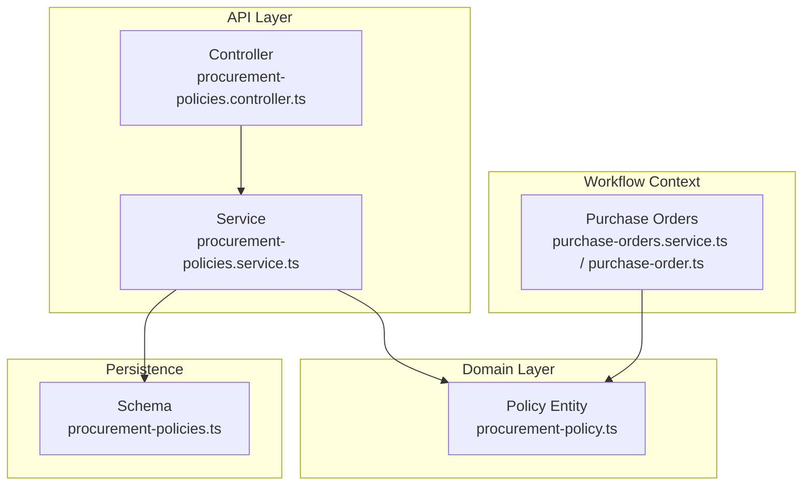
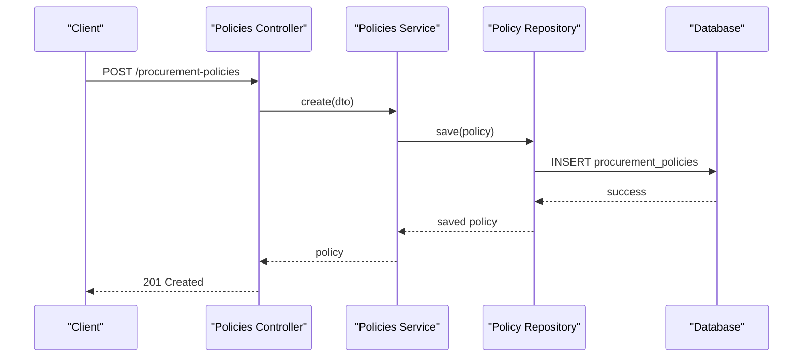
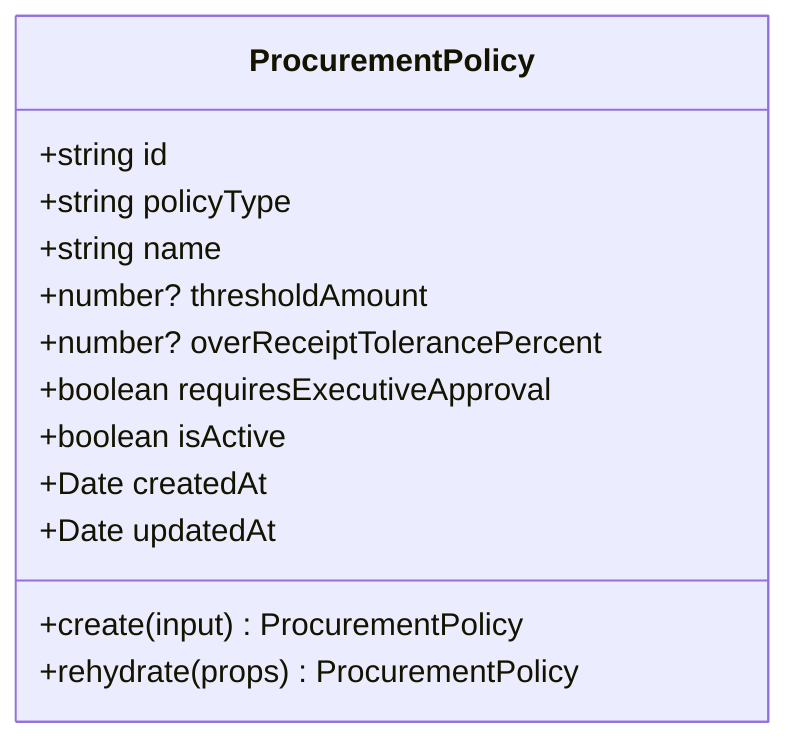
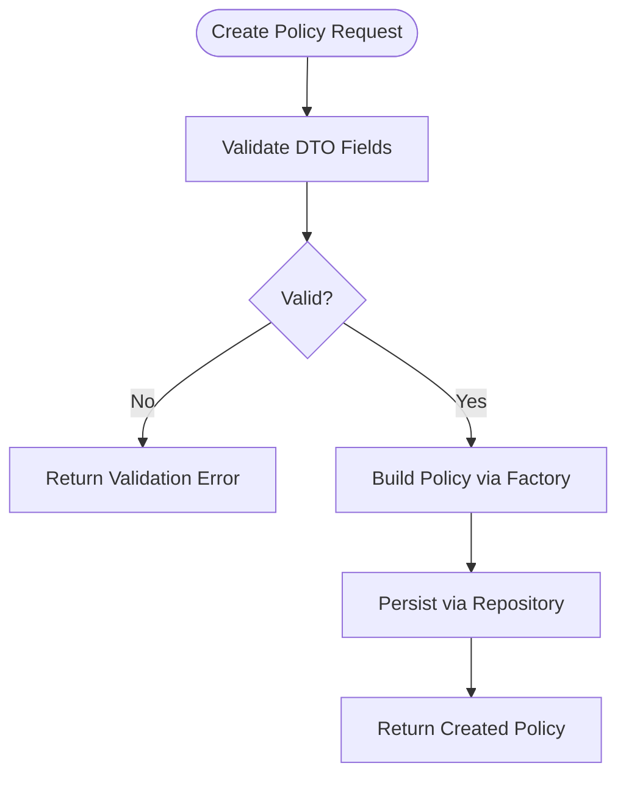
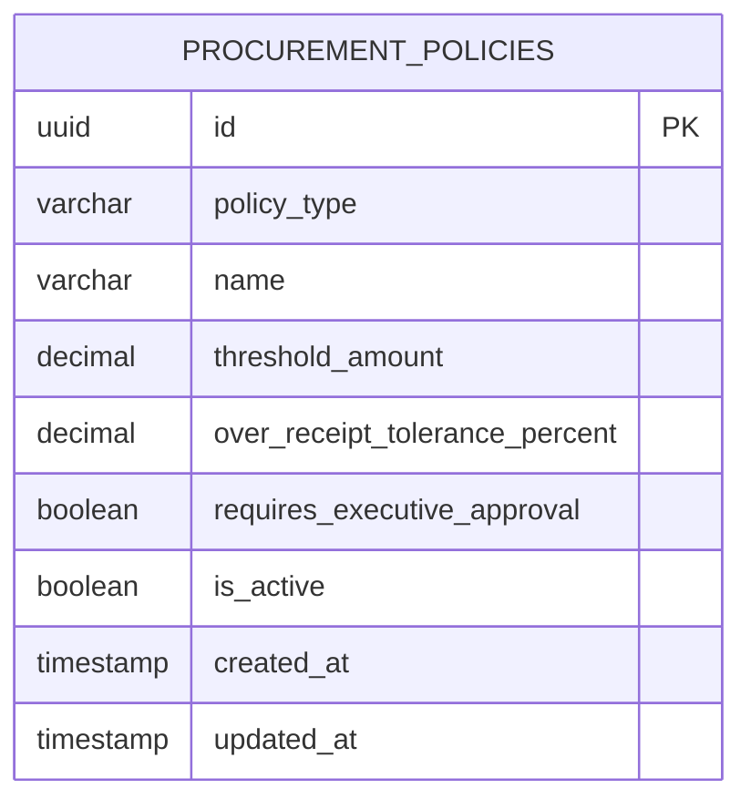
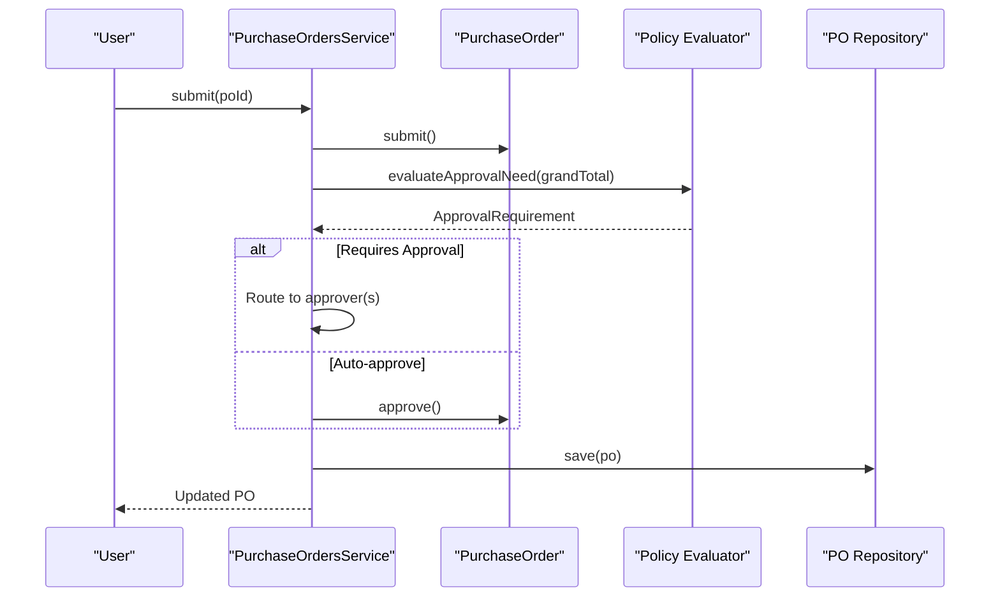
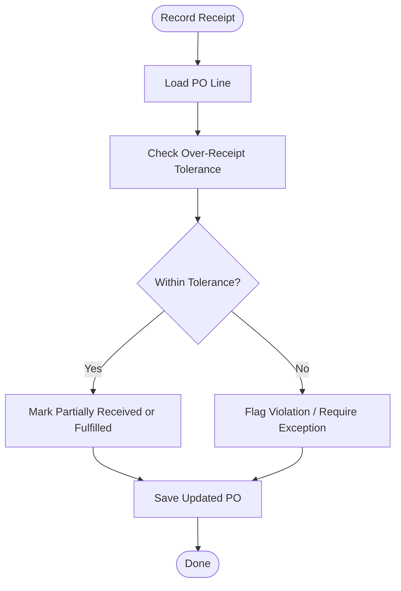
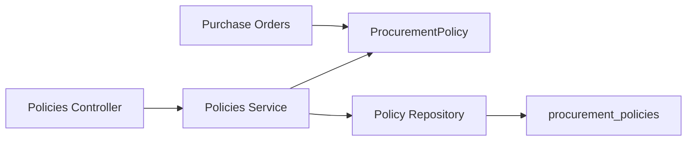

# Procurement Policies

<cite>
**Referenced Files in This Document**
- [RFC-0014: Procurement Policies](file://docs/rfcs/0014-procurement-policies.md)
- [Procurement Policy Domain Model](file://packages/procurement/src/policies/procurement-policy.ts)
- [Procurement Policies API Controller](file://apps/api/src/procurement-policies/procurement-policies.controller.ts)
- [Procurement Policies Service](file://apps/api/src/procurement-policies/procurement-policies.service.ts)
- [Procurement Policies DTOs](file://apps/api/src/procurement-policies/dtos.ts)
- [Database Schema Definition](file://packages/database/src/schema/procurement-policies.ts)
- [Purchase Orders Service](file://apps/api/src/purchase-orders/purchase-orders.service.ts)
- [Purchase Order Domain Model](file://packages/procurement/src/purchase-orders/purchase-order.ts)
</cite>

## Table of Contents
1. [Introduction](#introduction)
2. [Project Structure](#project-structure)
3. [Core Components](#core-components)
4. [Architecture Overview](#architecture-overview)
5. [Detailed Component Analysis](#detailed-component-analysis)
6. [Dependency Analysis](#dependency-analysis)
7. [Performance Considerations](#performance-considerations)
8. [Troubleshooting Guide](#troubleshooting-guide)
9. [Conclusion](#conclusion)
10. [Appendices](#appendices)

## Introduction
This document explains the Procurement Policies system in Ananya ERP. It covers how policies define approval thresholds, receiving tolerances, and governance rules that influence purchase order workflows and receiving processes. It also documents the policy data model, configuration options, evaluation points during PO creation and submission, and the intended integration with approval routing and compliance checks. Where applicable, it references the RFC, domain models, API endpoints, and database schema to ensure traceability.

## Project Structure
The procurement policies feature spans multiple layers:
- Domain model in the procurement package defines the policy entity and types.
- API layer exposes endpoints to create and retrieve policies.
- Database schema defines the persistent structure for policies.
- Purchase orders module provides the workflow context where policies are evaluated (as defined by the RFC).

**Diagram sources**
- [Procurement Policies API Controller:1-24](file://apps/api/src/procurement-policies/procurement-policies.controller.ts#L1-L24)
- [Procurement Policies Service:1-37](file://apps/api/src/procurement-policies/procurement-policies.service.ts#L1-L37)
- [Procurement Policy Domain Model:1-69](file://packages/procurement/src/policies/procurement-policy.ts#L1-L69)
- [Database Schema Definition:1-44](file://packages/database/src/schema/procurement-policies.ts#L1-L44)
- [Purchase Orders Service:1-145](file://apps/api/src/purchase-orders/purchase-orders.service.ts#L1-L145)
- [Purchase Order Domain Model:1-275](file://packages/procurement/src/purchase-orders/purchase-order.ts#L1-L275)

**Section sources**
- [RFC-0014: Procurement Policies:1-170](file://docs/rfcs/0014-procurement-policies.md#L1-L170)
- [Procurement Policy Domain Model:1-69](file://packages/procurement/src/policies/procurement-policy.ts#L1-L69)
- [Procurement Policies API Controller:1-24](file://apps/api/src/procurement-policies/procurement-policies.controller.ts#L1-L24)
- [Procurement Policies Service:1-37](file://apps/api/src/procurement-policies/procurement-policies.service.ts#L1-L37)
- [Database Schema Definition:1-44](file://packages/database/src/schema/procurement-policies.ts#L1-L44)
- [Purchase Orders Service:1-145](file://apps/api/src/purchase-orders/purchase-orders.service.ts#L1-L145)
- [Purchase Order Domain Model:1-275](file://packages/procurement/src/purchase-orders/purchase-order.ts#L1-L275)

## Core Components
- Policy entity: Defines policy type (approval tier or receiving tolerance), name, monetary threshold, over-receipt tolerance percentage, executive approval flag, active status, and timestamps.
- API controller: Exposes endpoints to create policies and list them.
- API service: Orchestrates policy creation via the domain factory and persists through a repository abstraction.
- Database schema: Stores policies with typed numeric fields and indexes for efficient querying by type and active status.
- Workflow integration: The RFC specifies that policies are evaluated during PO submission and goods receipt creation to determine approvals and tolerances.

Key responsibilities:
- Configuration: Create and manage policies that govern approvals and receiving tolerances.
- Evaluation: Determine whether a PO requires approval and which tier, based on configured thresholds.
- Compliance: Enforce receiving tolerances when recording receipts against PO lines.

**Section sources**
- [Procurement Policy Domain Model:1-69](file://packages/procurement/src/policies/procurement-policy.ts#L1-L69)
- [Procurement Policies API Controller:1-24](file://apps/api/src/procurement-policies/procurement-policies.controller.ts#L1-L24)
- [Procurement Policies Service:1-37](file://apps/api/src/procurement-policies/procurement-policies.service.ts#L1-L37)
- [Database Schema Definition:1-44](file://packages/database/src/schema/procurement-policies.ts#L1-L44)
- [RFC-0014: Procurement Policies:1-170](file://docs/rfcs/0014-procurement-policies.md#L1-L170)

## Architecture Overview
The procurement policies architecture follows a layered design:
- API layer exposes CRUD operations for policies.
- Service layer uses the domain model to construct policies and delegates persistence to a repository.
- Domain model encapsulates policy attributes and lifecycle methods.
- Database schema persists policies with appropriate types and indexes.
- Workflow modules (purchase orders, goods receipts) integrate with policies at key decision points as defined by the RFC.

**Diagram sources**
- [Procurement Policies API Controller:1-24](file://apps/api/src/procurement-policies/procurement-policies.controller.ts#L1-L24)
- [Procurement Policies Service:1-37](file://apps/api/src/procurement-policies/procurement-policies.service.ts#L1-L37)
- [Database Schema Definition:1-44](file://packages/database/src/schema/procurement-policies.ts#L1-L44)

**Section sources**
- [RFC-0014: Procurement Policies:143-170](file://docs/rfcs/0014-procurement-policies.md#L143-L170)
- [Procurement Policies API Controller:1-24](file://apps/api/src/procurement-policies/procurement-policies.controller.ts#L1-L24)
- [Procurement Policies Service:1-37](file://apps/api/src/procurement-policies/procurement-policies.service.ts#L1-L37)

## Detailed Component Analysis

### Policy Data Model
The policy entity captures:
- policyType: APPROVAL_TIER or RECEIVING_TOLERANCE
- name: descriptive label
- thresholdAmount: monetary threshold used for approval tiers
- overReceiptTolerancePercent: allowed over-receipt percentage for receiving tolerances
- requiresExecutiveApproval: boolean flag indicating higher-level approval needs
- isActive: indicates whether the policy is currently enforced
- createdAt/updatedAt: audit timestamps

**Diagram sources**
- [Procurement Policy Domain Model:1-69](file://packages/procurement/src/policies/procurement-policy.ts#L1-L69)

**Section sources**
- [Procurement Policy Domain Model:1-69](file://packages/procurement/src/policies/procurement-policy.ts#L1-L69)
- [RFC-0014: Procurement Policies:32-46](file://docs/rfcs/0014-procurement-policies.md#L32-L46)

### API Endpoints and Validation
- POST /procurement-policies: Creates a new policy using validated input.
- GET /procurement-policies: Retrieves all policies.
- GET /procurement-policies/:id: Retrieves a single policy by ID.

Input validation enforces required fields and types for policy creation.

**Diagram sources**
- [Procurement Policies DTOs:1-30](file://apps/api/src/procurement-policies/dtos.ts#L1-L30)
- [Procurement Policies Service:1-37](file://apps/api/src/procurement-policies/procurement-policies.service.ts#L1-L37)

**Section sources**
- [Procurement Policies API Controller:1-24](file://apps/api/src/procurement-policies/procurement-policies.controller.ts#L1-L24)
- [Procurement Policies DTOs:1-30](file://apps/api/src/procurement-policies/dtos.ts#L1-L30)
- [Procurement Policies Service:1-37](file://apps/api/src/procurement-policies/procurement-policies.service.ts#L1-L37)

### Database Schema and Indexes
The schema stores policies with precise numeric types for monetary and percentage values, and includes indexes for common queries by policy type and active status.

**Diagram sources**
- [Database Schema Definition:1-44](file://packages/database/src/schema/procurement-policies.ts#L1-L44)

**Section sources**
- [Database Schema Definition:1-44](file://packages/database/src/schema/procurement-policies.ts#L1-L44)
- [RFC-0014: Procurement Policies:125-139](file://docs/rfcs/0014-procurement-policies.md#L125-L139)

### Purchase Order Workflow Integration
Per the RFC, policies are evaluated during PO submission to determine if an approval is required and at which tier. The purchase order domain supports status transitions from DRAFT to SUBMITTED, then to APPROVED upon successful approval.

**Diagram sources**
- [RFC-0014: Procurement Policies:157-163](file://docs/rfcs/0014-procurement-policies.md#L157-L163)
- [Purchase Orders Service:117-122](file://apps/api/src/purchase-orders/purchase-orders.service.ts#L117-L122)
- [Purchase Order Domain Model:217-234](file://packages/procurement/src/purchase-orders/purchase-order.ts#L217-L234)

**Section sources**
- [RFC-0014: Procurement Policies:157-163](file://docs/rfcs/0014-procurement-policies.md#L157-L163)
- [Purchase Orders Service:117-122](file://apps/api/src/purchase-orders/purchase-orders.service.ts#L117-L122)
- [Purchase Order Domain Model:217-234](file://packages/procurement/src/purchase-orders/purchase-order.ts#L217-L234)

### Receiving Tolerance Enforcement
Receiving tolerances define acceptable over-receipt percentages. When recording goods receipts, the system should compare received quantities against ordered quantities and policy-defined tolerances to decide whether to mark a line as complete, incomplete, or short.

**Diagram sources**
- [RFC-0014: Procurement Policies:17-28](file://docs/rfcs/0014-procurement-policies.md#L17-L28)
- [Purchase Order Domain Model:163-174](file://packages/procurement/src/purchase-orders/purchase-order.ts#L163-L174)

**Section sources**
- [RFC-0014: Procurement Policies:17-28](file://docs/rfcs/0014-procurement-policies.md#L17-L28)
- [Purchase Order Domain Model:163-174](file://packages/procurement/src/purchase-orders/purchase-order.ts#L163-L174)

## Dependency Analysis
- The API controller depends on the policies service for business logic.
- The policies service depends on the procurement domain model and a repository abstraction for persistence.
- The database schema defines the storage contract for policies.
- The purchase orders workflow integrates with policies as per the RFC’s evaluation points.

**Diagram sources**
- [Procurement Policies API Controller:1-24](file://apps/api/src/procurement-policies/procurement-policies.controller.ts#L1-L24)
- [Procurement Policies Service:1-37](file://apps/api/src/procurement-policies/procurement-policies.service.ts#L1-L37)
- [Procurement Policy Domain Model:1-69](file://packages/procurement/src/policies/procurement-policy.ts#L1-L69)
- [Database Schema Definition:1-44](file://packages/database/src/schema/procurement-policies.ts#L1-L44)
- [Purchase Orders Service:1-145](file://apps/api/src/purchase-orders/purchase-orders.service.ts#L1-L145)

**Section sources**
- [Procurement Policies API Controller:1-24](file://apps/api/src/procurement-policies/procurement-policies.controller.ts#L1-L24)
- [Procurement Policies Service:1-37](file://apps/api/src/procurement-policies/procurement-policies.service.ts#L1-L37)
- [Procurement Policy Domain Model:1-69](file://packages/procurement/src/policies/procurement-policy.ts#L1-L69)
- [Database Schema Definition:1-44](file://packages/database/src/schema/procurement-policies.ts#L1-L44)
- [Purchase Orders Service:1-145](file://apps/api/src/purchase-orders/purchase-orders.service.ts#L1-L145)

## Performance Considerations
- Use indexes on policy_type and is_active to optimize retrieval of active policies for evaluation.
- Cache active policies in memory for frequent evaluation during PO submission and goods receipt processing to reduce database load.
- Keep policy updates infrequent and batched to minimize cache invalidation overhead.

[No sources needed since this section provides general guidance]

## Troubleshooting Guide
Common issues and resolutions:
- Validation errors on policy creation: Ensure required fields are provided and conform to expected types.
- Not found errors when retrieving policies: Verify the policy ID exists before requesting details.
- Unexpected approval behavior: Confirm that active policies exist and thresholds align with PO totals; check policy evaluation integration points.

**Section sources**
- [Procurement Policies DTOs:1-30](file://apps/api/src/procurement-policies/dtos.ts#L1-L30)
- [Procurement Policies Service:27-35](file://apps/api/src/procurement-policies/procurement-policies.service.ts#L27-L35)

## Conclusion
Ananya ERP’s Procurement Policies provide a structured way to govern purchase order approvals and receiving tolerances. The domain model, API, and database schema support creating and managing policies, while the RFC outlines evaluation points for approval routing and compliance enforcement. Integrating policies into PO submission and goods receipt workflows ensures consistent governance across procurement activities.

[No sources needed since this section summarizes without analyzing specific files]

## Appendices

### Practical Examples

- Creating an approval tier policy:
  - Define policyType as APPROVAL_TIER, set a meaningful name, specify thresholdAmount, and optionally require executive approval.
  - Submit via POST /procurement-policies with validated DTO fields.

- Configuring receiving tolerance:
  - Define policyType as RECEIVING_TOLERANCE, set overReceiptTolerancePercent to allow specified over-receipt percentage.
  - Use these tolerances during goods receipt recording to determine acceptance or violations.

- Setting up approval workflows:
  - Configure multiple approval tier policies to route POs based on grand total thresholds.
  - During PO submission, evaluate active policies to determine if auto-approval or manual approval is required.

- Enforcing compliance rules:
  - Apply receiving tolerance policies when recording receipts to prevent excessive over-receipts.
  - Flag violations for review and exception handling.

- Evaluating policies during PO creation/submission:
  - On submit, compute PO totals and evaluate active approval tier policies to determine required approvals.
  - Route to appropriate approvers or auto-approve based on policy outcomes.

- Audit reporting for policy violations:
  - Log instances where receipts exceed tolerances or approvals were bypassed.
  - Provide reports for compliance audits highlighting policy breaches and exceptions.

[No sources needed since this section provides practical guidance]