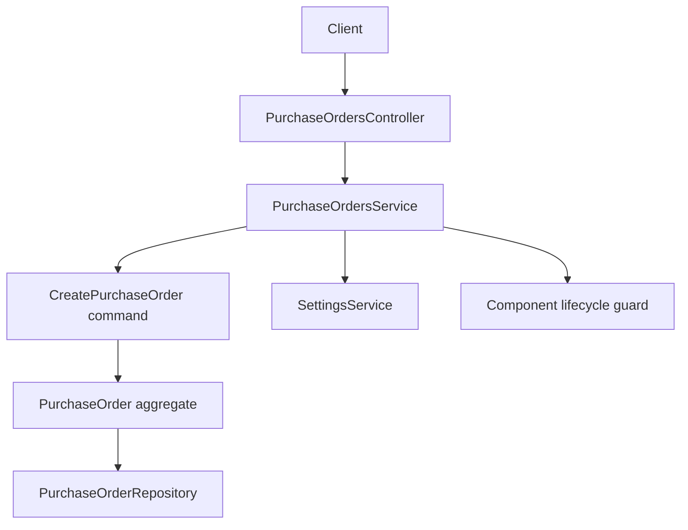
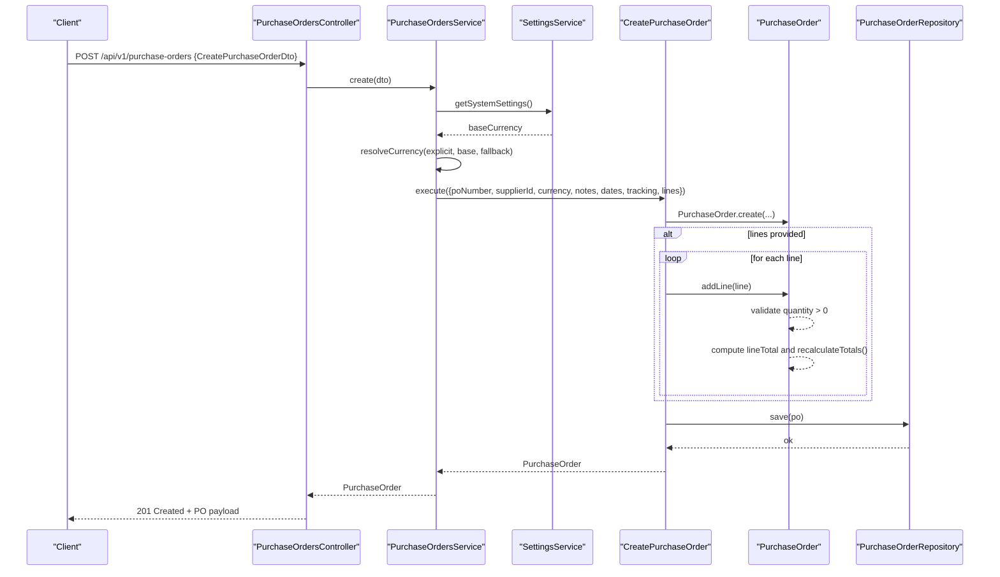
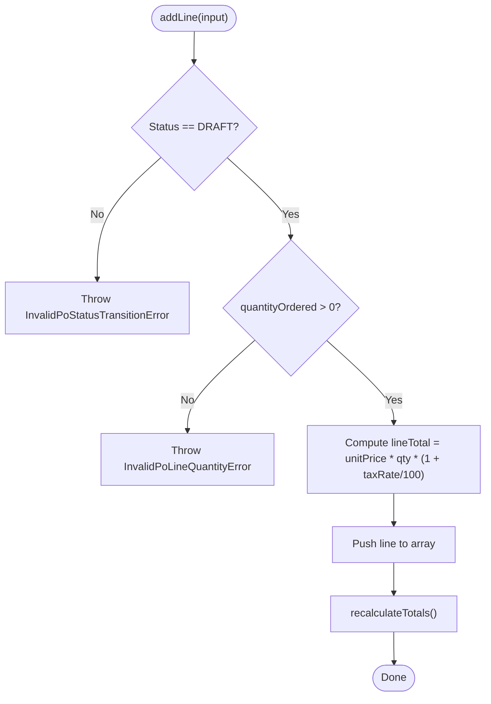
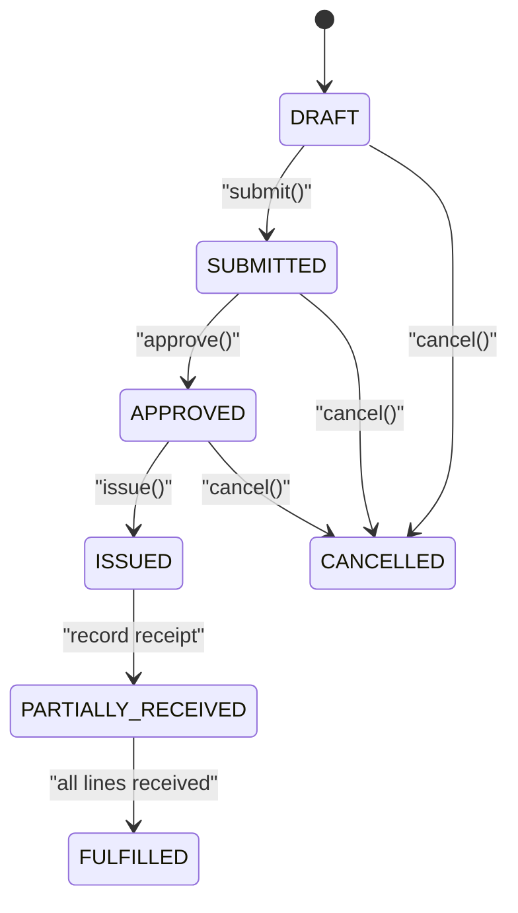
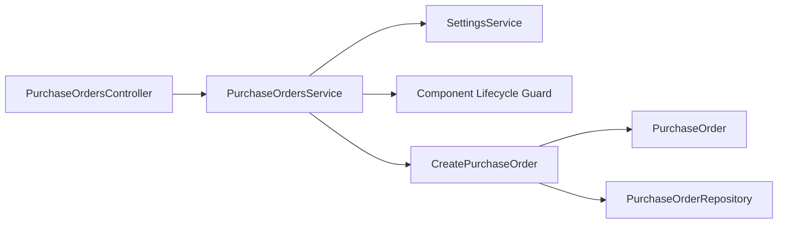

# Purchase Order Creation

<cite>
**Referenced Files in This Document**
- [purchase-orders.controller.ts](file://apps/api/src/purchase-orders/purchase-orders.controller.ts)
- [purchase-orders.service.ts](file://apps/api/src/purchase-orders/purchase-orders.service.ts)
- [dtos.ts](file://apps/api/src/purchase-orders/dtos.ts)
- [purchase-order.ts](file://packages/procurement/src/purchase-orders/purchase-order.ts)
- [create-purchase-order.ts](file://packages/procurement/src/purchase-orders/create-purchase-order.ts)
- [purchase-order.errors.ts](file://packages/procurement/src/purchase-orders/purchase-order.errors.ts)
- [0010-purchase-orders.md](file://docs/rfcs/0010-purchase-orders.md)
- [suppliers.controller.ts](file://apps/api/src/suppliers/suppliers.controller.ts)
- [components.controller.ts](file://apps/api/src/components/components.controller.ts)
- [procurement-policies.controller.ts](file://apps/api/src/procurement-policies/procurement-policies.controller.ts)
</cite>

## Table of Contents
1. Introduction
2. Project Structure
3. Core Components
4. Architecture Overview
5. Detailed Component Analysis
6. Dependency Analysis
7. Performance Considerations
8. Troubleshooting Guide
9. Conclusion

## Introduction
This document explains how to create a new Purchase Order (PO) in Ananya ERP, including required and optional fields, validation rules, data models, integrations with suppliers, components, and procurement policies, automatic calculations for taxes and totals, approval workflows, and integration points with MRP recommendations. It focuses on the API surface and domain logic that enforce business rules during PO creation.

## Project Structure
The PO creation flow spans:
- API layer: Controller exposes endpoints; Service orchestrates use cases and delegates to domain commands.
- Domain layer: PurchaseOrder aggregate enforces state transitions, line item rules, and financial totals.
- Integration points: Suppliers, Components, Procurement Policies, Settings (for currency resolution).

**Diagram sources**
- [purchase-orders.controller.ts:23-31](file://apps/api/src/purchase-orders/purchase-orders.controller.ts#L23-L31)
- [purchase-orders.service.ts:22-60](file://apps/api/src/purchase-orders/purchase-orders.service.ts#L22-L60)
- [create-purchase-order.ts:12-43](file://packages/procurement/src/purchase-orders/create-purchase-order.ts#L12-L43)
- [purchase-order.ts:81-145](file://packages/procurement/src/purchase-orders/purchase-order.ts#L81-L145)

**Section sources**
- [purchase-orders.controller.ts:23-83](file://apps/api/src/purchase-orders/purchase-orders.controller.ts#L23-L83)
- [purchase-orders.service.ts:22-145](file://apps/api/src/purchase-orders/purchase-orders.service.ts#L22-L145)
- [create-purchase-order.ts:12-43](file://packages/procurement/src/purchase-orders/create-purchase-order.ts#L12-L43)
- [purchase-order.ts:81-275](file://packages/procurement/src/purchase-orders/purchase-order.ts#L81-L275)

## Core Components
- CreatePurchaseOrderDto: Request model for creating a PO header and optional lines.
- AddPoLineDto: Request model for adding a PO line item.
- PurchaseOrder aggregate: Enforces domain rules, calculates totals, manages status transitions.
- CreatePurchaseOrder command: Orchestrates creation, optional line addition, and persistence.

Key behaviors:
- Currency resolution uses system settings with fallbacks.
- Line items are validated by the domain before saving.
- Totals are recalculated automatically when lines change.

**Section sources**
- [dtos.ts:12-72](file://apps/api/src/purchase-orders/dtos.ts#L12-L72)
- [purchase-order.ts:52-79](file://packages/procurement/src/purchase-orders/purchase-order.ts#L52-L79)
- [purchase-order.ts:122-145](file://packages/procurement/src/purchase-orders/purchase-order.ts#L122-L145)
- [create-purchase-order.ts:15-43](file://packages/procurement/src/purchase-orders/create-purchase-order.ts#L15-L43)

## Architecture Overview
End-to-end sequence for creating a PO with optional lines:

**Diagram sources**
- [purchase-orders.controller.ts:28-31](file://apps/api/src/purchase-orders/purchase-orders.controller.ts#L28-L31)
- [purchase-orders.service.ts:38-60](file://apps/api/src/purchase-orders/purchase-orders.service.ts#L38-L60)
- [create-purchase-order.ts:15-43](file://packages/procurement/src/purchase-orders/create-purchase-order.ts#L15-L43)
- [purchase-order.ts:122-215](file://packages/procurement/src/purchase-orders/purchase-order.ts#L122-L215)

## Detailed Component Analysis

### CreatePurchaseOrderDto and AddPoLineDto
- CreatePurchaseOrderDto fields:
  - Required: supplierId
  - Optional: currency, notes, expectedDeliveryDate, trackingNumber, carrier, shippingProvider, trackingUrl, lines[]
- AddPoLineDto fields:
  - Required: componentId, unitPrice, quantityOrdered
  - Optional: vendorPartNumber, taxRate

Validation:
- class-validator decorators enforce presence and types at the API boundary.
- Domain-level validation ensures positive quantities and valid states.

**Section sources**
- [dtos.ts:12-72](file://apps/api/src/purchase-orders/dtos.ts#L12-L72)
- [purchase-order.ts:184-215](file://packages/procurement/src/purchase-orders/purchase-order.ts#L184-L215)

### PurchaseOrder Aggregate and Totals
- Header fields include poNumber, supplierId, status, currency, subtotal, taxTotal, grandTotal, notes, issuedAt, expectedDeliveryDate, and shipping/tracking fields.
- Line fields include componentId, vendorPartNumber, unitPrice, quantityOrdered, quantityReceived, taxRate, lineTotal.
- Automatic calculations:
  - Line total = unitPrice × quantityOrdered × (1 + taxRate/100)
  - Subtotal = sum of base prices across lines
  - Tax total = sum of per-line tax amounts
  - Grand total = subtotal + taxTotal
- Totals are recalculated whenever lines are added or modified.

**Diagram sources**
- [purchase-order.ts:184-215](file://packages/procurement/src/purchase-orders/purchase-order.ts#L184-L215)
- [purchase-order.ts:255-269](file://packages/procurement/src/purchase-orders/purchase-order.ts#L255-L269)

**Section sources**
- [purchase-order.ts:31-49](file://packages/procurement/src/purchase-orders/purchase-order.ts#L31-L49)
- [purchase-order.ts:184-215](file://packages/procurement/src/purchase-orders/purchase-order.ts#L184-L215)
- [purchase-order.ts:255-269](file://packages/procurement/src/purchase-orders/purchase-order.ts#L255-L269)

### CreatePurchaseOrder Command
- Generates or accepts a PO number.
- Creates the PurchaseOrder aggregate with resolved currency and header fields.
- Optionally adds lines via the aggregate’s addLine method.
- Persists the PO through the repository.

**Section sources**
- [create-purchase-order.ts:15-43](file://packages/procurement/src/purchase-orders/create-purchase-order.ts#L15-L43)

### API Endpoints for PO Creation
- POST /api/v1/purchase-orders: Create a draft PO (optionally with lines).
- Additional endpoints exist for listing, retrieving, updating, deleting, adding lines, submitting, approving, issuing, and canceling POs.

**Section sources**
- [purchase-orders.controller.ts:23-83](file://apps/api/src/purchase-orders/purchase-orders.controller.ts#L23-L83)

### Data Models and RFC Alignment
- The domain model aligns with RFC-0010:
  - Statuses: DRAFT, SUBMITTED, APPROVED, ISSUED, PARTIALLY_RECEIVED, FULFILLED, CANCELLED
  - Invariants: valid supplierId, at least one line before submission, positive quantities, non-negative totals consistent with line sums
  - Repository contracts and database schema are defined in the RFC

**Section sources**
- [0010-purchase-orders.md:17-23](file://docs/rfcs/0010-purchase-orders.md#L17-L23)
- [0010-purchase-orders.md:37-77](file://docs/rfcs/0010-purchase-orders.md#L37-L77)
- [0010-purchase-orders.md:125-132](file://docs/rfcs/0010-purchase-orders.md#L125-L132)
- [0010-purchase-orders.md:155-187](file://docs/rfcs/0010-purchase-orders.md#L155-L187)

### Integrations

#### Supplier Master Data
- PO creation requires a valid supplierId.
- Supplier master data is managed under the suppliers module; controllers expose CRUD operations for supplier records.

**Section sources**
- [purchase-order.ts:31-49](file://packages/procurement/src/purchase-orders/purchase-order.ts#L31-L49)
- [suppliers.controller.ts](file://apps/api/src/suppliers/suppliers.controller.ts)

#### Component Catalog
- Each line references a componentId.
- Adding a line validates that the component is usable for new activities (e.g., not retired).

**Section sources**
- [purchase-orders.service.ts:102-115](file://apps/api/src/purchase-orders/purchase-orders.service.ts#L102-L115)
- [components.controller.ts](file://apps/api/src/components/components.controller.ts)

#### Procurement Policies
- Policy configuration exists for thresholds, tolerances, and executive approval flags.
- While PO creation does not directly call policy services in the current service implementation, policies can influence downstream approvals and controls.

**Section sources**
- [procurement-policies.controller.ts](file://apps/api/src/procurement-policies/procurement-policies.controller.ts)
- [procurement-policies/dtos.ts:10-31](file://apps/api/src/procurement-policies/dtos.ts#L10-L31)

#### Settings and Currency Resolution
- Currency defaults to organization base currency from settings; falls back to INR if not set.
- Explicit currency in the request overrides the default.

**Section sources**
- [purchase-orders.service.ts:38-60](file://apps/api/src/purchase-orders/purchase-orders.service.ts#L38-L60)

### Approval Workflow and State Transitions
- Submit: DRAFT → SUBMITTED (requires at least one line)
- Approve: SUBMITTED → APPROVED
- Issue: APPROVED → ISSUED (sets issuedAt)
- Cancel: allowed from certain statuses; blocked from FULFILLED, CANCELLED, PARTIALLY_RECEIVED

**Diagram sources**
- [purchase-order.ts:217-253](file://packages/procurement/src/purchase-orders/purchase-order.ts#L217-L253)

**Section sources**
- [purchase-order.ts:217-253](file://packages/procurement/src/purchase-orders/purchase-order.ts#L217-L253)

### MRP Recommendations Integration
- RFC-0010 defines planning-related queries and future extensions such as re-order alerts based on safety stock projections.
- Current PO creation does not directly consume MRP recommendations; however, POs can be created from planning outputs in higher-level workflows.

**Section sources**
- [0010-purchase-orders.md:93-103](file://docs/rfcs/0010-purchase-orders.md#L93-L103)
- [0010-purchase-orders.md:228-232](file://docs/rfcs/0010-purchase-orders.md#L228-L232)

## Dependency Analysis
- Controller depends on Service for business orchestration.
- Service depends on:
  - SettingsService for currency resolution
  - Component lifecycle guard for line validation
  - Domain commands (CreatePurchaseOrder) and repository
- Domain aggregate encapsulates all PO rules and calculations.

**Diagram sources**
- [purchase-orders.controller.ts:23-31](file://apps/api/src/purchase-orders/purchase-orders.controller.ts#L23-L31)
- [purchase-orders.service.ts:22-60](file://apps/api/src/purchase-orders/purchase-orders.service.ts#L22-L60)
- [create-purchase-order.ts:12-43](file://packages/procurement/src/purchase-orders/create-purchase-order.ts#L12-L43)

**Section sources**
- [purchase-orders.controller.ts:23-83](file://apps/api/src/purchase-orders/purchase-orders.controller.ts#L23-L83)
- [purchase-orders.service.ts:22-145](file://apps/api/src/purchase-orders/purchase-orders.service.ts#L22-L145)
- [create-purchase-order.ts:12-43](file://packages/procurement/src/purchase-orders/create-purchase-order.ts#L12-L43)

## Performance Considerations
- Keep line count reasonable; totals are recalculated per line addition.
- Batch line additions where possible to reduce repeated recalculations.
- Use efficient queries when listing/filtering POs via repository methods.

[No sources needed since this section provides general guidance]

## Troubleshooting Guide
Common errors and their causes:
- Invalid status transition: Attempting to submit/approve/issue/cancel from an incorrect state.
- Empty purchase order: Submitting without any line items.
- Invalid line quantity: Providing zero or negative quantityOrdered.
- Not found: Referencing a PO ID that does not exist.

These errors originate from domain error classes and are surfaced through the controller/service layer.

**Section sources**
- [purchase-order.errors.ts:3-42](file://packages/procurement/src/purchase-orders/purchase-order.errors.ts#L3-L42)
- [purchase-order.ts:217-253](file://packages/procurement/src/purchase-orders/purchase-order.ts#L217-L253)

## Conclusion
Creating a Purchase Order in Ananya ERP involves validating inputs at the API boundary, resolving currency from settings, enforcing domain rules in the PurchaseOrder aggregate, computing line and header totals automatically, and persisting the result. The workflow supports a clear state machine for submission, approval, issuance, and cancellation, with integrations to supplier and component master data and alignment with procurement policies and planning concepts.