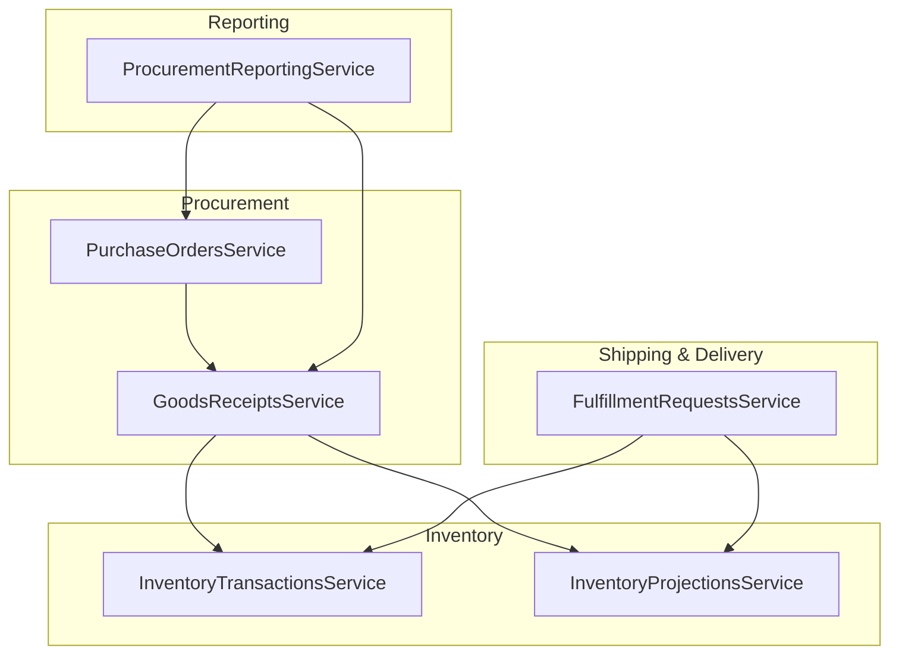
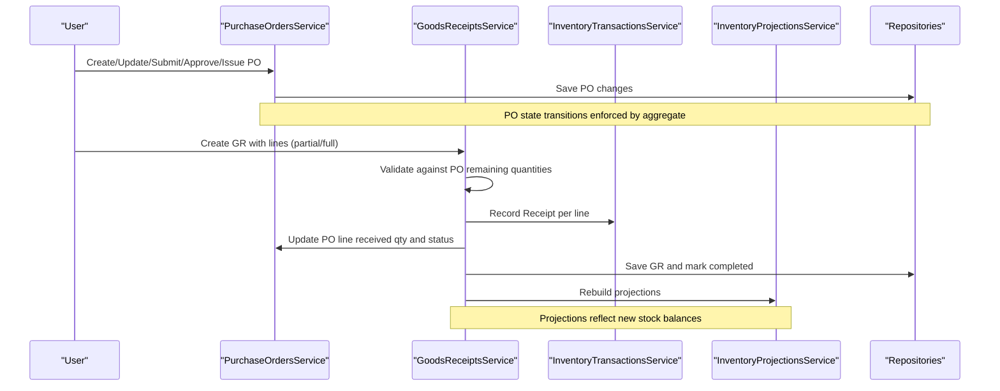
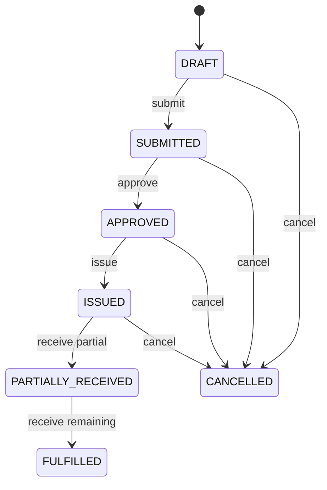
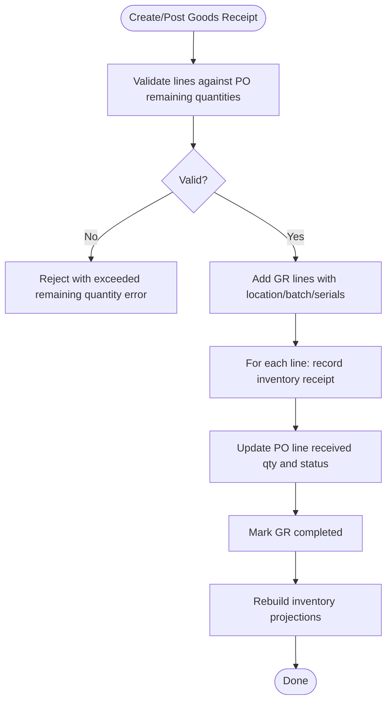
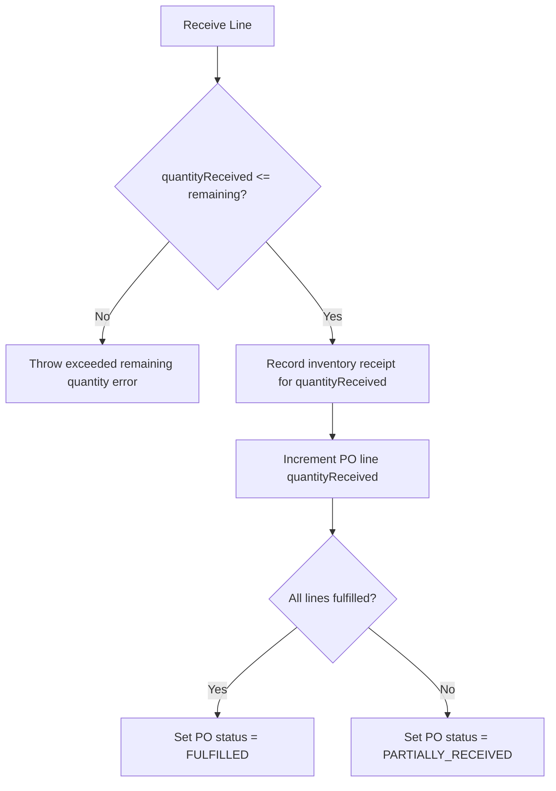
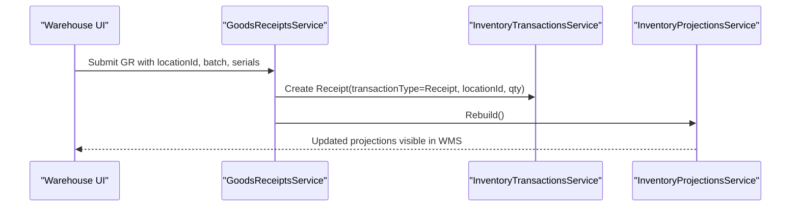
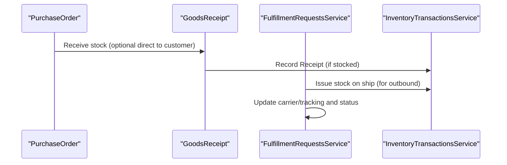
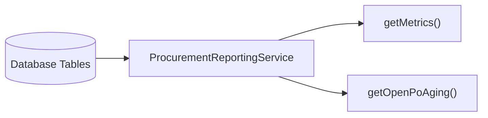
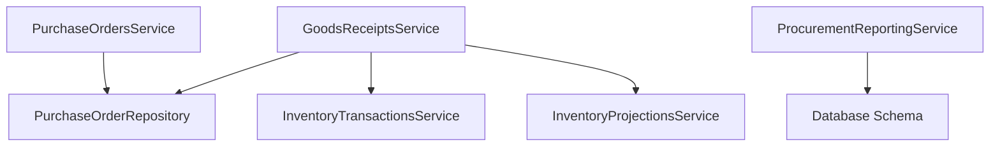

# Purchase Order Fulfillment & Tracking

<cite>
**Referenced Files in This Document**
- [purchase-orders.service.ts](file://apps/api/src/purchase-orders/purchase-orders.service.ts)
- [goods-receipts.service.ts](file://apps/api/src/goods-receipts/goods-receipts.service.ts)
- [0010-purchase-orders.md](file://docs/rfcs/0010-purchase-orders.md)
- [0011-goods-receipt.md](file://docs/rfcs/0011-goods-receipt.md)
- [procurement-reporting.service.ts](file://apps/api/src/procurement-reporting/procurement-reporting.service.ts)
- [0015-procurement-reporting.md](file://docs/rfcs/0015-procurement-reporting.md)
- [fulfillment-requests.service.ts](file://apps/api/src/fulfillment/fulfillment-requests.service.ts)
- [0029-shipping-and-delivery.md](file://docs/rfcs/0029-shipping-and-delivery.md)
- [po-form.tsx](file://apps/web/components/purchase-orders/po-form.tsx)
</cite>

## Table of Contents
1. [Introduction](#introduction)
2. [Project Structure](#project-structure)
3. [Core Components](#core-components)
4. [Architecture Overview](#architecture-overview)
5. [Detailed Component Analysis](#detailed-component-analysis)
6. [Dependency Analysis](#dependency-analysis)
7. [Performance Considerations](#performance-considerations)
8. [Troubleshooting Guide](#troubleshooting-guide)
9. [Conclusion](#conclusion)
10. [Appendices](#appendices)

## Introduction
This document explains purchase order fulfillment and tracking in Ananya ERP, focusing on how Purchase Orders (POs) relate to Goods Receipts (GRs), how partial and full fulfillment are handled, and how inventory is updated upon receipt. It also covers status tracking, delivery schedules, supplier performance metrics, exception handling for short or damaged deliveries, integration with warehouse management, advanced scenarios such as drop shipping and third-party logistics, and reporting capabilities for fulfillment analytics and supplier scorecards.

## Project Structure
The fulfillment flow spans Procurement, Inventory, and Reporting modules:
- Procurement manages PO lifecycle and GR creation against open POs.
- Inventory records immutable ledger transactions and updates projections when receipts post.
- Reporting provides read-only KPIs and aging views over POs and GRs.
- Shipping and Delivery tracks carrier, tracking numbers, and proof of delivery for outbound fulfillment.

**Diagram sources**
- [purchase-orders.service.ts:22-144](file://apps/api/src/purchase-orders/purchase-orders.service.ts#L22-L144)
- [goods-receipts.service.ts:26-206](file://apps/api/src/goods-receipts/goods-receipts.service.ts#L26-L206)
- [procurement-reporting.service.ts:10-52](file://apps/api/src/procurement-reporting/procurement-reporting.service.ts#L10-L52)
- [fulfillment-requests.service.ts:117-164](file://apps/api/src/fulfillment/fulfillment-requests.service.ts#L117-L164)

**Section sources**
- [0010-purchase-orders.md:11-23](file://docs/rfcs/0010-purchase-orders.md#L11-L23)
- [0011-goods-receipt.md:11-22](file://docs/rfcs/0011-goods-receipt.md#L11-L22)

## Core Components
- Purchase Orders Service: Creates, updates, submits, approves, issues, and cancels POs; enforces domain rules via the PO aggregate.
- Goods Receipts Service: Validates receiving quantities against PO lines, creates GRs, posts inventory receipts, updates PO line quantities and PO status, and rebuilds projections.
- Procurement Reporting Service: Provides high-level metrics and open PO aging queries across suppliers, POs, and GRs.
- Fulfillment Requests Service: Manages outbound fulfillment, shipping, and stock issuance for sales orders (relevant for cross-domain context).

Key responsibilities:
- PO state machine transitions and business rules.
- GR validation against remaining PO quantities and integration with inventory ledger.
- Read-only reporting for procurement KPIs and aging.

**Section sources**
- [purchase-orders.service.ts:22-144](file://apps/api/src/purchase-orders/purchase-orders.service.ts#L22-L144)
- [goods-receipts.service.ts:26-206](file://apps/api/src/goods-receipts/goods-receipts.service.ts#L26-L206)
- [procurement-reporting.service.ts:10-52](file://apps/api/src/procurement-reporting/procurement-reporting.service.ts#L10-L52)
- [fulfillment-requests.service.ts:117-164](file://apps/api/src/fulfillment/fulfillment-requests.service.ts#L117-L164)

## Architecture Overview
End-to-end flow from PO issuance through goods receipt posting and reporting:

**Diagram sources**
- [purchase-orders.service.ts:38-136](file://apps/api/src/purchase-orders/purchase-orders.service.ts#L38-L136)
- [goods-receipts.service.ts:42-116](file://apps/api/src/goods-receipts/goods-receipts.service.ts#L42-L116)
- [goods-receipts.service.ts:146-180](file://apps/api/src/goods-receipts/goods-receipts.service.ts#L146-L180)

## Detailed Component Analysis

### Purchase Order Lifecycle and Status Tracking
- States: DRAFT, SUBMITTED, APPROVED, ISSUED, PARTIALLY_RECEIVED, FULFILLED, CANCELLED.
- Actions: create, add/update/remove lines (in DRAFT), submit, approve, issue, cancel.
- Tracking fields: expectedDeliveryDate, trackingNumber, carrier, shippingProvider, trackingUrl.

**Diagram sources**
- [0010-purchase-orders.md:114-121](file://docs/rfcs/0010-purchase-orders.md#L114-L121)

**Section sources**
- [purchase-orders.service.ts:38-136](file://apps/api/src/purchase-orders/purchase-orders.service.ts#L38-L136)
- [0010-purchase-orders.md:17-23](file://docs/rfcs/0010-purchase-orders.md#L17-L23)
- [po-form.tsx:341-372](file://apps/web/components/purchase-orders/po-form.tsx#L341-L372)

### Goods Receipt Processing and Inventory Updates
- Creation: Validates lines against PO remaining quantities; generates next GR number; adds lines with location, batch, expiry, serials.
- Posting: For each line, records an immutable inventory receipt transaction, updates PO line quantityReceived, sets PO status to PARTIALLY_RECEIVED or FULFILLED, marks GR completed, and rebuilds projections.
- Partial vs Full: Multiple GRs can incrementally fulfill a PO until all lines reach their ordered quantities.

**Diagram sources**
- [goods-receipts.service.ts:42-116](file://apps/api/src/goods-receipts/goods-receipts.service.ts#L42-L116)
- [goods-receipts.service.ts:146-180](file://apps/api/src/goods-receipts/goods-receipts.service.ts#L146-L180)
- [goods-receipts.service.ts:182-206](file://apps/api/src/goods-receipts/goods-receipts.service.ts#L182-L206)

**Section sources**
- [goods-receipts.service.ts:42-116](file://apps/api/src/goods-receipts/goods-receipts.service.ts#L42-L116)
- [goods-receipts.service.ts:146-180](file://apps/api/src/goods-receipts/goods-receipts.service.ts#L146-L180)
- [0011-goods-receipt.md:17-22](file://docs/rfcs/0011-goods-receipt.md#L17-L22)

### Exception Handling: Short Deliveries and Damaged Goods
- Over-receipt prevention: If any line’s quantityReceived exceeds the PO line’s remaining quantity, an error is thrown to block over-receiving.
- Short deliveries: Allowed; PO remains PARTIALLY_RECEIVED until all lines are fully received.
- Damaged goods: Use quantityRejected on GR lines to capture rejections; only quantityReceived increments stock.

**Diagram sources**
- [goods-receipts.service.ts:45-60](file://apps/api/src/goods-receipts/goods-receipts.service.ts#L45-L60)
- [goods-receipts.service.ts:182-206](file://apps/api/src/goods-receipts/goods-receipts.service.ts#L182-L206)

**Section sources**
- [goods-receipts.service.ts:45-60](file://apps/api/src/goods-receipts/goods-receipts.service.ts#L45-L60)
- [goods-receipts.service.ts:182-206](file://apps/api/src/goods-receipts/goods-receipts.service.ts#L182-L206)

### Integration with Warehouse Management
- Destination locationId on GR lines directs stock into specific physical locations within the warehouse.
- Batch and serial tracking supported on GR lines for traceability.
- Upon posting, inventory projections are rebuilt to reflect available stock at the destination location.

**Diagram sources**
- [goods-receipts.service.ts:86-116](file://apps/api/src/goods-receipts/goods-receipts.service.ts#L86-L116)
- [goods-receipts.service.ts:156-178](file://apps/api/src/goods-receipts/goods-receipts.service.ts#L156-L178)

**Section sources**
- [0011-goods-receipt.md:17-22](file://docs/rfcs/0011-goods-receipt.md#L17-L22)

### Advanced Scenarios: Drop Shipping and Third-Party Logistics
- Drop shipping: While not explicitly modeled as a separate flow in the current code, POs support carrier/tracking metadata that can be used to coordinate direct-to-customer shipments. Outbound fulfillment uses the same inventory issuance pattern for shipped items.
- Third-party logistics: Carrier name and tracking number are captured during shipment; status transitions track dispatch and delivery.

**Diagram sources**
- [fulfillment-requests.service.ts:117-164](file://apps/api/src/fulfillment/fulfillment-requests.service.ts#L117-L164)
- [0029-shipping-and-delivery.md:20-35](file://docs/rfcs/0029-shipping-and-delivery.md#L20-L35)

**Section sources**
- [0029-shipping-and-delivery.md:1-62](file://docs/rfcs/0029-shipping-and-delivery.md#L1-L62)
- [fulfillment-requests.service.ts:117-164](file://apps/api/src/fulfillment/fulfillment-requests.service.ts#L117-L164)

### Reporting Capabilities: Fulfillment Analytics and Supplier Scorecards
- High-level metrics: Active suppliers count, total POs, completed GRs, total fulfilled spend.
- Open PO aging: Lists POs in active states with expected delivery dates for visibility into overdue deliveries.
- Future enhancements include OTIF calculations and supplier performance scoring based on timeliness and defect rates.

**Diagram sources**
- [procurement-reporting.service.ts:10-52](file://apps/api/src/procurement-reporting/procurement-reporting.service.ts#L10-L52)

**Section sources**
- [procurement-reporting.service.ts:10-52](file://apps/api/src/procurement-reporting/procurement-reporting.service.ts#L10-L52)
- [0015-procurement-reporting.md:11-21](file://docs/rfcs/0015-procurement-reporting.md#L11-L21)
- [0015-procurement-reporting.md:63-68](file://docs/rfcs/0015-procurement-reporting.md#L63-L68)

## Dependency Analysis
- GoodsReceiptsService depends on:
  - PurchaseOrderRepository to update PO lines and status.
  - InventoryTransactionsService to record immutable receipt transactions.
  - InventoryProjectionsService to rebuild projections after postings.
- PurchaseOrdersService depends on:
  - PurchaseOrderRepository for persistence and domain operations.
  - SettingsService for currency resolution.
- ProcurementReportingService reads from database schema tables for suppliers, purchase_orders, and goods_receipts.

**Diagram sources**
- [goods-receipts.service.ts:26-40](file://apps/api/src/goods-receipts/goods-receipts.service.ts#L26-L40)
- [purchase-orders.service.ts:22-36](file://apps/api/src/purchase-orders/purchase-orders.service.ts#L22-L36)
- [procurement-reporting.service.ts:1-8](file://apps/api/src/procurement-reporting/procurement-reporting.service.ts#L1-L8)

**Section sources**
- [goods-receipts.service.ts:26-40](file://apps/api/src/goods-receipts/goods-receipts.service.ts#L26-L40)
- [purchase-orders.service.ts:22-36](file://apps/api/src/purchase-orders/purchase-orders.service.ts#L22-L36)
- [procurement-reporting.service.ts:1-8](file://apps/api/src/procurement-reporting/procurement-reporting.service.ts#L1-L8)

## Performance Considerations
- Asynchronous projection rebuild: After posting receipts, projections are rebuilt to keep available stock accurate without blocking the main transaction path.
- Minimal writes: Only necessary PO line updates and GR saves occur; inventory ledger entries are appended immutably.
- Efficient queries: Reporting uses targeted SQL aggregations over key tables for metrics and aging.

[No sources needed since this section provides general guidance]

## Troubleshooting Guide
Common issues and resolutions:
- Exceeded remaining quantity: Occurs when a GR line attempts to receive more than the PO line’s remaining quantity. Reduce the received quantity or split into multiple receipts.
- Cannot post non-DRAFT GR: Ensure the GR is in DRAFT before posting; otherwise, it has already been processed.
- Missing location or invalid component: Ensure each GR line specifies a valid destination locationId and componentId.

**Section sources**
- [goods-receipts.service.ts:45-60](file://apps/api/src/goods-receipts/goods-receipts.service.ts#L45-L60)
- [goods-receipts.service.ts:146-152](file://apps/api/src/goods-receipts/goods-receipts.service.ts#L146-L152)

## Conclusion
Ananya ERP’s procurement module provides a robust, policy-driven workflow for purchasing and receiving goods. POs progress through a clear state machine, while GRs enforce receiving constraints and integrate tightly with inventory to maintain accurate stock levels. Reporting offers visibility into fulfillment performance and aging, enabling data-driven decisions. The system supports partial and full fulfillment, handles exceptions like short or damaged deliveries, and integrates with warehouse and shipping processes to provide end-to-end tracking.

[No sources needed since this section summarizes without analyzing specific files]

## Appendices

### Fulfillment Workflows Examples
- Full fulfillment: Single GR receives all quantities for each PO line; PO transitions directly to FULFILLED.
- Partial fulfillment: Multiple GRs incrementally receive portions; PO remains PARTIALLY_RECEIVED until all lines are fully received.

**Section sources**
- [goods-receipts.service.ts:86-116](file://apps/api/src/goods-receipts/goods-receipts.service.ts#L86-L116)
- [goods-receipts.service.ts:182-206](file://apps/api/src/goods-receipts/goods-receipts.service.ts#L182-L206)

### Supplier Performance Metrics
- Current metrics include counts and total fulfilled spend; future enhancements define OTIF and lead time variance for supplier scorecards.

**Section sources**
- [procurement-reporting.service.ts:10-52](file://apps/api/src/procurement-reporting/procurement-reporting.service.ts#L10-L52)
- [0015-procurement-reporting.md:11-21](file://docs/rfcs/0015-procurement-reporting.md#L11-L21)
- [0015-procurement-reporting.md:63-68](file://docs/rfcs/0015-procurement-reporting.md#L63-L68)