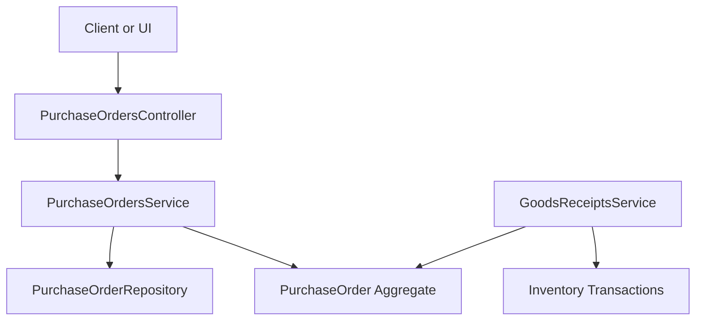
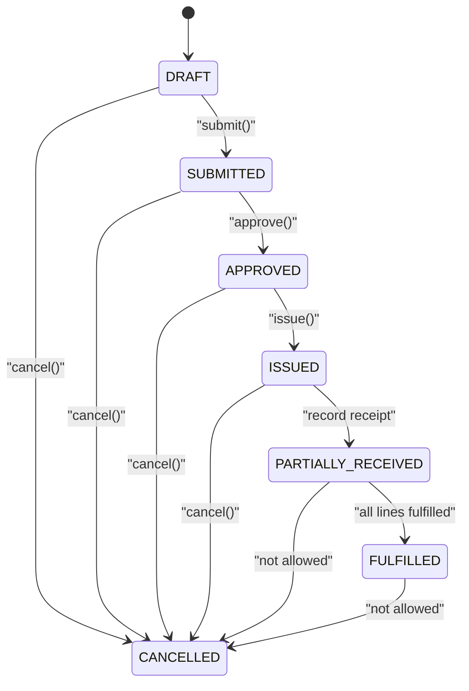
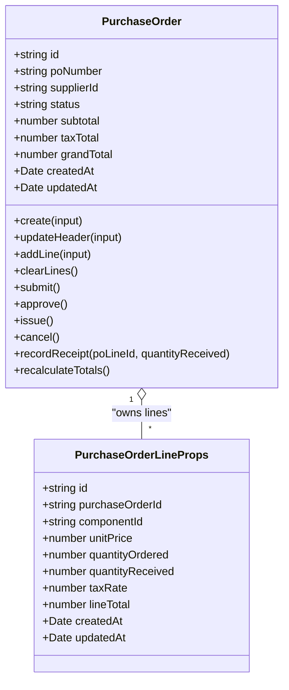
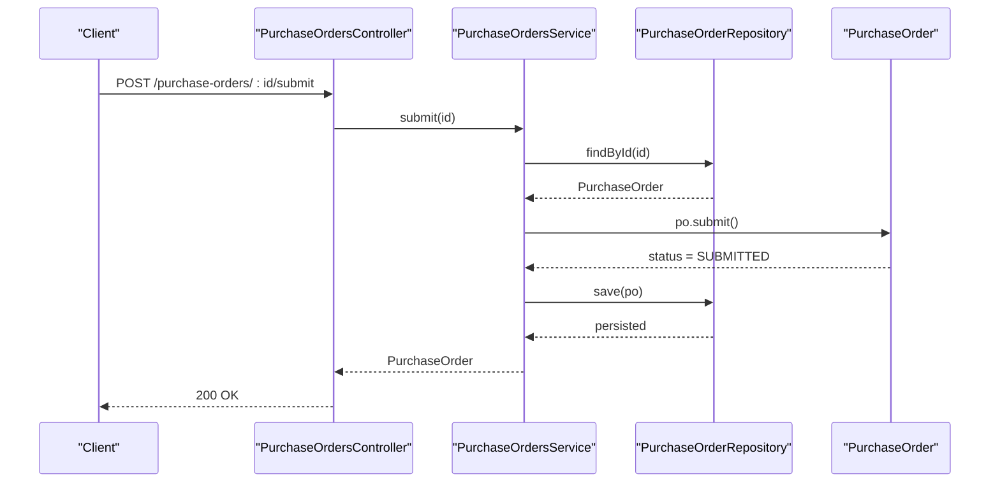
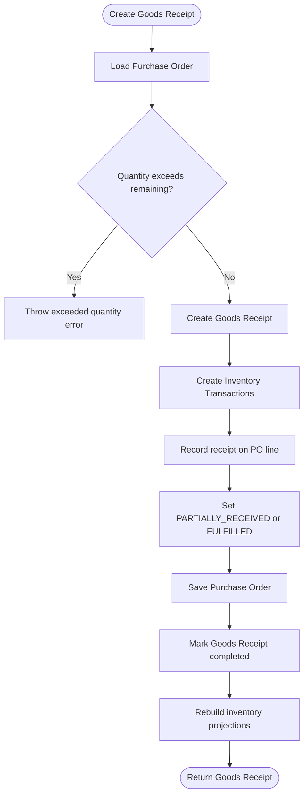
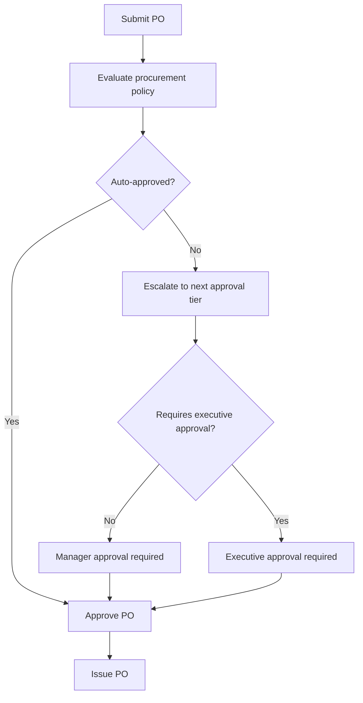
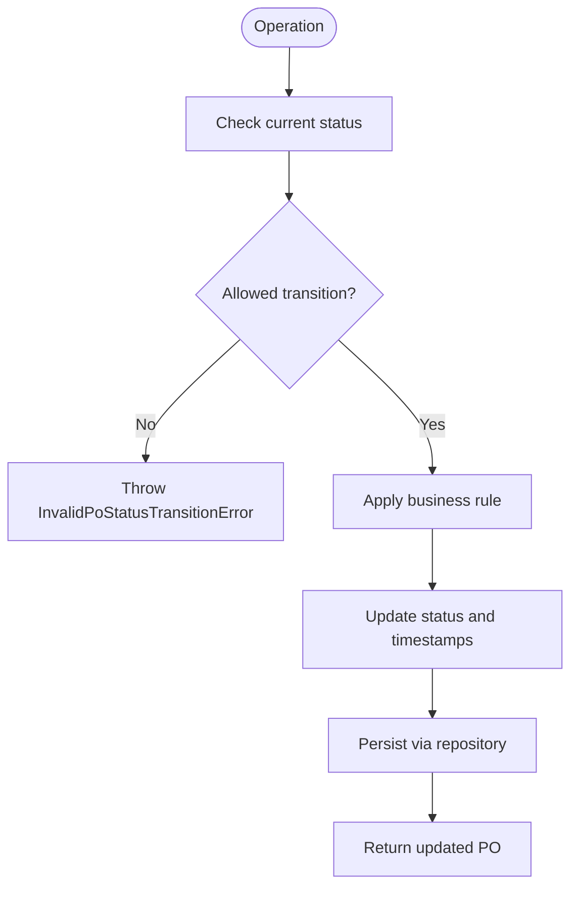
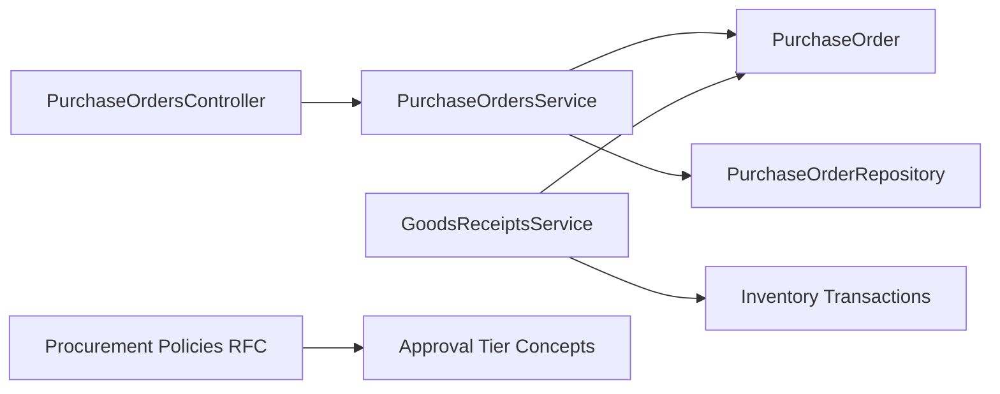

# Purchase Order Lifecycle & State Management

<cite>
**Referenced Files in This Document**
- [purchase-order.ts](file://packages/procurement/src/purchase-orders/purchase-order.ts)
- [purchase-order.errors.ts](file://packages/procurement/src/purchase-orders/purchase-order.errors.ts)
- [purchase-orders.service.ts](file://apps/api/src/purchase-orders/purchase-orders.service.ts)
- [purchase-orders.controller.ts](file://apps/api/src/purchase-orders/purchase-orders.controller.ts)
- [goods-receipts.service.ts](file://apps/api/src/goods-receipts/goods-receipts.service.ts)
- [0010-purchase-orders.md](file://docs/rfcs/0010-purchase-orders.md)
- [0014-procurement-policies.md](file://docs/rfcs/0014-procurement-policies.md)
</cite>

## Table of Contents
1. [Introduction](#introduction)
2. [Project Structure](#project-structure)
3. [Core Components](#core-components)
4. [Architecture Overview](#architecture-overview)
5. [Detailed Component Analysis](#detailed-component-analysis)
6. [Dependency Analysis](#dependency-analysis)
7. [Performance Considerations](#performance-considerations)
8. [Troubleshooting Guide](#troubleshooting-guide)
9. [Conclusion](#conclusion)
10. [Appendices](#appendices)

## Introduction
This document explains the purchase order lifecycle and state management in Ananya ERP. It focuses on how a purchase order moves through states, what business rules govern transitions, how goods receipts update inventory and purchase orders, and where approval policies and future workflow customization can be applied.

The documented lifecycle includes:
- Draft
- Submitted
- Approved
- Issued
- Partially Received
- Fulfilled
- Cancelled

These states are enforced by domain logic in the procurement package and exposed through API endpoints in the application layer.

## Project Structure
Purchase order functionality is implemented across three main layers:
- Domain model: defines states, aggregate behavior, and validation errors.
- Application service: loads entities, applies domain methods, and persists changes.
- HTTP controller: exposes REST endpoints for client applications.

**Diagram sources**
- [purchase-orders.controller.ts:23-81](file://apps/api/src/purchase-orders/purchase-orders.controller.ts#L23-L81)
- [purchase-orders.service.ts:22-36](file://apps/api/src/purchase-orders/purchase-orders.service.ts#L22-L36)
- [purchase-order.ts:81-120](file://packages/procurement/src/purchase-orders/purchase-order.ts#L81-L120)
- [goods-receipts.service.ts:42-60](file://apps/api/src/goods-receipts/goods-receipts.service.ts#L42-L60)

**Section sources**
- [purchase-orders.controller.ts:23-81](file://apps/api/src/purchase-orders/purchase-orders.controller.ts#L23-L81)
- [purchase-orders.service.ts:22-36](file://apps/api/src/purchase-orders/purchase-orders.service.ts#L22-L36)
- [purchase-order.ts:81-120](file://packages/procurement/src/purchase-orders/purchase-order.ts#L81-L120)

## Core Components
- PurchaseOrder aggregate: owns status, lines, totals, and all state transitions.
- PurchaseOrdersService: orchestrates request handling, entity loading, domain method invocation, and persistence.
- PurchaseOrdersController: maps HTTP routes to service methods.
- GoodsReceiptsService: integrates receiving with purchase orders and inventory.
- Procurement policy RFC: provides the conceptual foundation for approval tiers and tolerances.

Key responsibilities:
- Enforce valid state transitions inside the domain.
- Validate line quantities and prevent editing after submission.
- Update received quantities and compute fulfillment state.
- Expose submit, approve, issue, and cancel operations via REST.

**Section sources**
- [purchase-order.ts:8-15](file://packages/procurement/src/purchase-orders/purchase-order.ts#L8-L15)
- [purchase-order.ts:163-174](file://packages/procurement/src/purchase-orders/purchase-order.ts#L163-L174)
- [purchase-orders.service.ts:117-143](file://apps/api/src/purchase-orders/purchase-orders.service.ts#L117-L143)
- [purchase-orders.controller.ts:63-80](file://apps/api/src/purchase-orders/purchase-orders.controller.ts#L63-L80)
- [goods-receipts.service.ts:154-179](file://apps/api/src/goods-receipts/goods-receipts.service.ts#L154-L179)

## Architecture Overview
The purchase order lifecycle is modeled as a finite state machine inside the domain aggregate. The application layer delegates transition logic to the domain, ensuring business rules remain consistent regardless of the caller.

**Diagram sources**
- [purchase-order.ts:217-253](file://packages/procurement/src/purchase-orders/purchase-order.ts#L217-L253)
- [purchase-order.ts:163-174](file://packages/procurement/src/purchase-orders/purchase-order.ts#L163-L174)
- [0010-purchase-orders.md:114-121](file://docs/rfcs/0010-purchase-orders.md#L114-L121)

## Detailed Component Analysis

### Purchase Order Domain Model
The PurchaseOrder aggregate encapsulates:
- Status lifecycle
- Line item management
- Financial totals calculation
- Receipt recording and fulfillment determination

Important behaviors:
- Creating a PO initializes it in DRAFT.
- Adding or clearing lines is only allowed in DRAFT.
- Submitting requires at least one line.
- Approving requires SUBMITTED status.
- Issuing sets issuedAt and moves to ISSUED.
- Cancelling is blocked from FULFILLED, CANCELLED, and PARTIALLY_RECEIVED.
- Receiving updates quantityReceived per line and computes PARTIALLY_RECEIVED or FULFILLED.

**Diagram sources**
- [purchase-order.ts:17-29](file://packages/procurement/src/purchase-orders/purchase-order.ts#L17-L29)
- [purchase-order.ts:81-120](file://packages/procurement/src/purchase-orders/purchase-order.ts#L81-L120)
- [purchase-order.ts:122-145](file://packages/procurement/src/purchase-orders/purchase-order.ts#L122-L145)
- [purchase-order.ts:163-174](file://packages/procurement/src/purchase-orders/purchase-order.ts#L163-L174)
- [purchase-order.ts:176-215](file://packages/procurement/src/purchase-orders/purchase-order.ts#L176-L215)
- [purchase-order.ts:217-269](file://packages/procurement/src/purchase-orders/purchase-order.ts#L217-L269)

**Section sources**
- [purchase-order.ts:8-15](file://packages/procurement/src/purchase-orders/purchase-order.ts#L8-L15)
- [purchase-order.ts:122-145](file://packages/procurement/src/purchase-orders/purchase-order.ts#L122-L145)
- [purchase-order.ts:163-174](file://packages/procurement/src/purchase-orders/purchase-order.ts#L163-L174)
- [purchase-order.ts:176-215](file://packages/procurement/src/purchase-orders/purchase-order.ts#L176-L215)
- [purchase-order.ts:217-269](file://packages/procurement/src/purchase-orders/purchase-order.ts#L217-L269)

### API Layer: Controller and Service
The controller exposes REST endpoints for CRUD and lifecycle actions. The service loads the purchase order, invokes domain methods, and saves the updated entity.

API endpoints:
- POST /purchase-orders/:id/submit
- POST /purchase-orders/:id/approve
- POST /purchase-orders/:id/issue
- POST /purchase-orders/:id/cancel

Service behavior:
- findOne throws not found if the PO does not exist.
- addLine validates that the component is usable before adding a line.
- submit, approve, issue, and cancel delegate to the domain aggregate.

**Diagram sources**
- [purchase-orders.controller.ts:63-66](file://apps/api/src/purchase-orders/purchase-orders.controller.ts#L63-L66)
- [purchase-orders.service.ts:117-122](file://apps/api/src/purchase-orders/purchase-orders.service.ts#L117-L122)
- [purchase-order.ts:217-226](file://packages/procurement/src/purchase-orders/purchase-order.ts#L217-L226)

**Section sources**
- [purchase-orders.controller.ts:23-81](file://apps/api/src/purchase-orders/purchase-orders.controller.ts#L23-L81)
- [purchase-orders.service.ts:94-143](file://apps/api/src/purchase-orders/purchase-orders.service.ts#L94-L143)

### Goods Receipt Integration
When a goods receipt is created:
- The system loads the associated purchase order.
- It validates that requested receipt quantities do not exceed remaining ordered quantities.
- It creates inventory transactions for each received line.
- It records receipt against the purchase order line.
- It updates the purchase order status to PARTIALLY_RECEIVED or FULFILLED.
- It rebuilds inventory projections.

**Diagram sources**
- [goods-receipts.service.ts:42-60](file://apps/api/src/goods-receipts/goods-receipts.service.ts#L42-L60)
- [goods-receipts.service.ts:154-179](file://apps/api/src/goods-receipts/goods-receipts.service.ts#L154-L179)
- [purchase-order.ts:163-174](file://packages/procurement/src/purchase-orders/purchase-order.ts#L163-L174)

**Section sources**
- [goods-receipts.service.ts:42-60](file://apps/api/src/goods-receipts/goods-receipts.service.ts#L42-L60)
- [goods-receipts.service.ts:154-179](file://apps/api/src/goods-receipts/goods-receipts.service.ts#L154-L179)
- [purchase-order.ts:163-174](file://packages/procurement/src/purchase-orders/purchase-order.ts#L163-L174)

### Approval Workflows and Escalation Paths
The current implementation enforces a simple linear approval flow:
- DRAFT → SUBMITTED → APPROVED → ISSUED

Approval policy concepts are defined in the procurement policies RFC:
- Approval tier thresholds determine whether higher-level authorization is required.
- Executive approval flags can be configured.
- These policies provide the foundation for multi-level authorization and escalation.

Current code path:
- The service calls po.approve() without evaluating policy rules yet.
- Policy evaluation is described conceptually in the RFC sequence diagram.

Recommended extension points:
- Integrate procurement policy evaluation into the submit or approve flow.
- Add escalation steps based on grand total thresholds.
- Require executive approval when configured.

**Diagram sources**
- [0014-procurement-policies.md:157-163](file://docs/rfcs/0014-procurement-policies.md#L157-L163)
- [purchase-orders.service.ts:124-129](file://apps/api/src/purchase-orders/purchase-orders.service.ts#L124-L129)

**Section sources**
- [0014-procurement-policies.md:1-46](file://docs/rfcs/0014-procurement-policies.md#L1-46)
- [0014-procurement-policies.md:125-163](file://docs/rfcs/0014-procurement-policies.md#L125-L163)
- [purchase-orders.service.ts:124-129](file://apps/api/src/purchase-orders/purchase-orders.service.ts#L124-L129)

### Practical State Transition Examples
Valid transitions:
- Create PO → DRAFT
- Add lines while DRAFT
- Submit → SUBMITTED (requires at least one line)
- Approve → APPROVED (requires SUBMITTED)
- Issue → ISSUED (sets issuedAt)
- Receive partial quantity → PARTIALLY_RECEIVED
- Receive remaining quantity → FULFILLED
- Cancel from DRAFT, SUBMITTED, APPROVED, or ISSUED

Invalid transitions:
- Submit from any state other than DRAFT
- Approve from any state other than SUBMITTED
- Issue from any state other than APPROVED
- Cancel from PARTIALLY_RECEIVED or FULFILLED
- Edit lines after DRAFT

Error handling:
- InvalidPoStatusTransitionError is thrown for invalid transitions.
- EmptyPurchaseOrderError is thrown when submitting an empty PO.
- InvalidPoLineQuantityError is thrown when line quantity is not positive.

**Diagram sources**
- [purchase-order.ts:217-253](file://packages/procurement/src/purchase-orders/purchase-order.ts#L217-L253)
- [purchase-order.errors.ts:3-25](file://packages/procurement/src/purchase-orders/purchase-order.errors.ts#L3-L25)

**Section sources**
- [purchase-order.ts:217-253](file://packages/procurement/src/purchase-orders/purchase-order.ts#L217-L253)
- [purchase-order.errors.ts:3-25](file://packages/procurement/src/purchase-orders/purchase-order.errors.ts#L3-L25)

### Audit Logging and Notifications
The current purchase order domain and service do not explicitly implement audit logging or notification triggers in the referenced files. However, the design supports extensibility:
- Audit logging can be added around repository save operations or domain events.
- Notification triggers can be attached to state transitions such as SUBMITTED, APPROVED, ISSUED, PARTIALLY_RECEIVED, FULFILLED, and CANCELLED.
- Future implementations should emit domain events or use an event bus to notify stakeholders.

Until explicit logging or notifications are implemented, operators should rely on:
- Updated timestamps
- Status changes
- Goods receipt integration logs
- Inventory transaction records

**Section sources**
- [purchase-order.ts:217-269](file://packages/procurement/src/purchase-orders/purchase-order.ts#L217-L269)
- [goods-receipts.service.ts:154-179](file://apps/api/src/goods-receipts/goods-receipts.service.ts#L154-L179)

### Workflow Customization Options
Customization options include:
- Configuring approval tiers and monetary thresholds using procurement policies.
- Adding executive approval requirements.
- Defining receiving tolerance policies for over-receipt and under-receipt.
- Extending the submit/approve flow to evaluate policies before allowing transitions.
- Adding notification channels for state changes.

The RFC documents the intended policy model and API surface for procurement policies.

**Section sources**
- [0014-procurement-policies.md:1-46](file://docs/rfcs/0014-procurement-policies.md#L1-46)
- [0014-procurement-policies.md:125-163](file://docs/rfcs/0014-procurement-policies.md#L125-L163)

## Dependency Analysis
The following diagram shows key dependencies between controllers, services, domain aggregates, and related modules.

**Diagram sources**
- [purchase-orders.controller.ts:23-81](file://apps/api/src/purchase-orders/purchase-orders.controller.ts#L23-L81)
- [purchase-orders.service.ts:22-36](file://apps/api/src/purchase-orders/purchase-orders.service.ts#L22-L36)
- [purchase-order.ts:81-120](file://packages/procurement/src/purchase-orders/purchase-order.ts#L81-L120)
- [goods-receipts.service.ts:42-60](file://apps/api/src/goods-receipts/goods-receipts.service.ts#L42-L60)
- [0014-procurement-policies.md:157-163](file://docs/rfcs/0014-procurement-policies.md#L157-L163)

**Section sources**
- [purchase-orders.controller.ts:23-81](file://apps/api/src/purchase-orders/purchase-orders.controller.ts#L23-L81)
- [purchase-orders.service.ts:22-36](file://apps/api/src/purchase-orders/purchase-orders.service.ts#L22-L36)
- [goods-receipts.service.ts:42-60](file://apps/api/src/goods-receipts/goods-receipts.service.ts#L42-L60)
- [0014-procurement-policies.md:157-163](file://docs/rfcs/0014-procurement-policies.md#L157-L163)

## Performance Considerations
- Domain validation is lightweight and runs in memory; avoid unnecessary repeated lookups.
- Goods receipt creation performs multiple operations: PO load, inventory transaction creation, PO update, GR completion, and projection rebuild. Batch operations should be considered if many lines are received together.
- Recalculating totals iterates over lines; keep line counts reasonable and avoid excessive line churn.
- Inventory projection rebuild may be expensive; schedule or throttle it appropriately.

[No sources needed since this section provides general guidance]

## Troubleshooting Guide
Common issues and resolutions:
- Invalid state transition: Ensure the PO is in the correct status before calling submit, approve, issue, or cancel.
- Cannot cancel partially received or fulfilled PO: Cancel is blocked once receiving has progressed beyond allowed states.
- Submit fails due to empty PO: Add at least one line before submitting.
- Line quantity validation fails: Ensure quantityOrdered is strictly greater than zero.
- Goods receipt exceeds remaining quantity: Reduce the receipt quantity to match outstanding PO line quantities.
- Not found errors: Verify the PO ID exists before invoking lifecycle operations.

Error types:
- InvalidPoStatusTransitionError
- EmptyPurchaseOrderError
- InvalidPoLineQuantityError

**Section sources**
- [purchase-order.errors.ts:3-25](file://packages/procurement/src/purchase-orders/purchase-order.errors.ts#L3-L25)
- [purchase-order.ts:217-253](file://packages/procurement/src/purchase-orders/purchase-order.ts#L217-L253)
- [goods-receipts.service.ts:42-60](file://apps/api/src/goods-receipts/goods-receipts.service.ts#L42-L60)

## Conclusion
Ananya ERP models purchase order lifecycle as a strict state machine within the domain aggregate. The application layer delegates transitions to the domain, ensuring consistency and clear separation of concerns. Goods receipt integration updates inventory and purchase order fulfillment status. Approval workflows are conceptually supported by procurement policies, enabling future multi-level authorization and escalation. For robust operations, teams should extend the current implementation with policy evaluation, audit logging, and notification triggers aligned with state changes.

[No sources needed since this section summarizes without analyzing specific files]

## Appendices

### RFC Reference Summary
- Purchase Orders RFC defines lifecycle, domain model, commands, queries, state machines, and API endpoints.
- Procurement Policies RFC defines approval tiers and receiving tolerances, providing the conceptual basis for workflow customization.

**Section sources**
- [0010-purchase-orders.md:11-23](file://docs/rfcs/0010-purchase-orders.md#L11-L23)
- [0010-purchase-orders.md:114-121](file://docs/rfcs/0010-purchase-orders.md#L114-L121)
- [0010-purchase-orders.md:191-201](file://docs/rfcs/0010-purchase-orders.md#L191-L201)
- [0014-procurement-policies.md:1-46](file://docs/rfcs/0014-procurement-policies.md#L1-46)
- [0014-procurement-policies.md:125-163](file://docs/rfcs/0014-procurement-policies.md#L125-L163)