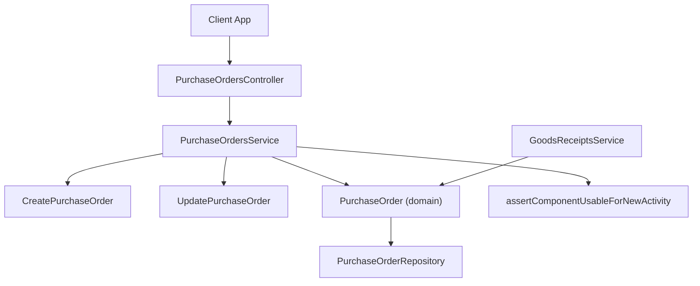
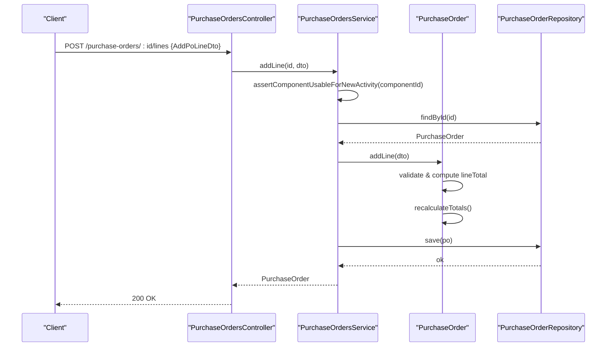
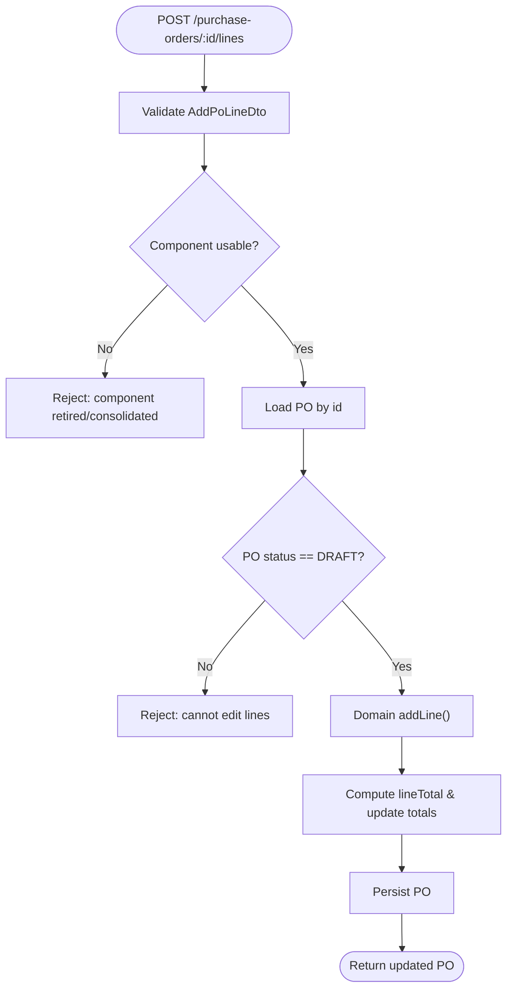
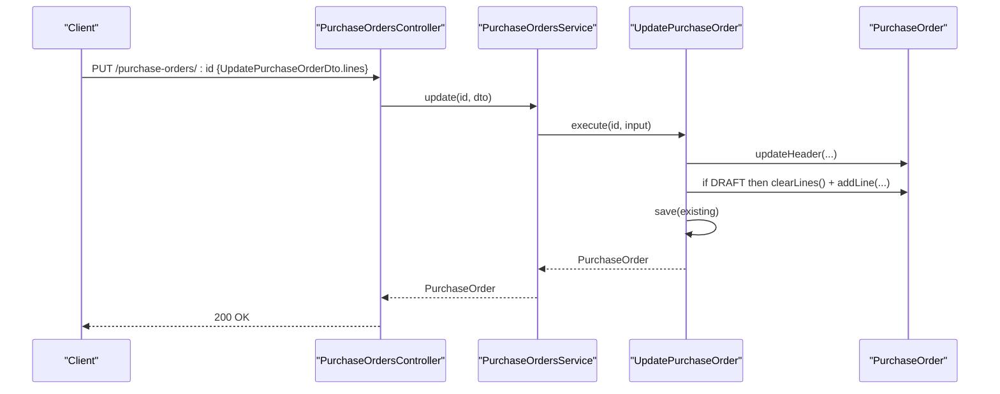
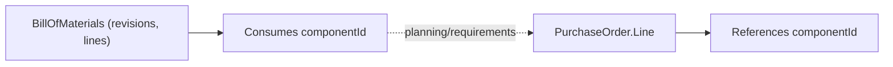
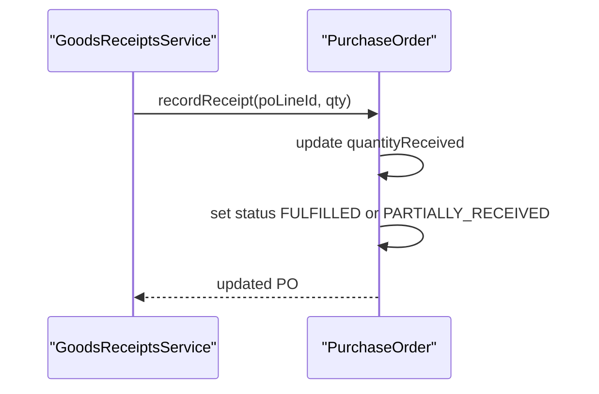
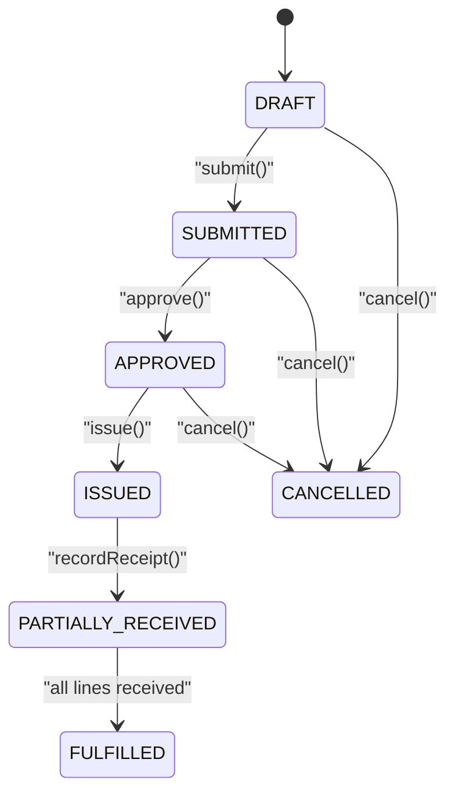
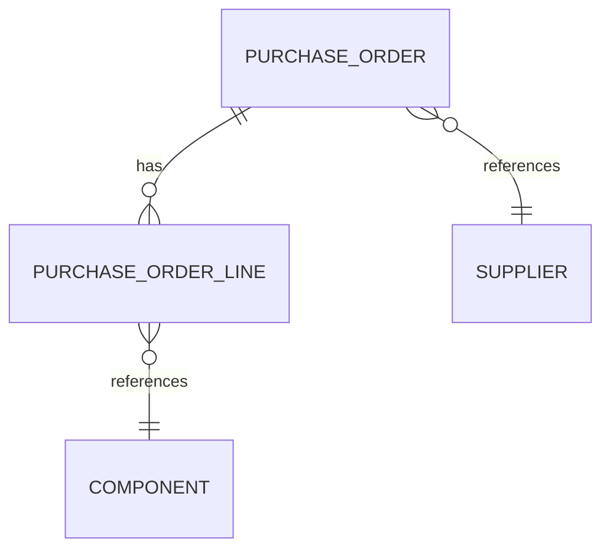
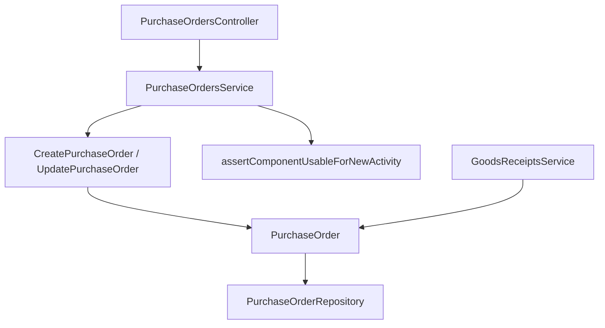

# Purchase Order Line Management

<cite>
**Referenced Files in This Document**
- [dtos.ts](file://apps/api/src/purchase-orders/dtos.ts)
- [purchase-orders.controller.ts](file://apps/api/src/purchase-orders/purchase-orders.controller.ts)
- [purchase-orders.service.ts](file://apps/api/src/purchase-orders/purchase-orders.service.ts)
- [purchase-order.ts](file://packages/procurement/src/purchase-orders/purchase-order.ts)
- [create-purchase-order.ts](file://packages/procurement/src/purchase-orders/create-purchase-order.ts)
- [update-purchase-order.ts](file://packages/procurement/src/purchase-orders/update-purchase-order.ts)
- [component-lifecycle.guard.ts](file://apps/api/src/components/component-lifecycle.guard.ts)
- [goods-receipts.service.ts](file://apps/api/src/goods-receipts/goods-receipts.service.ts)
- [drizzle-bill-of-materials.repository.ts](file://apps/api/src/infrastructure/repositories/drizzle-bill-of-materials.repository.ts)
- [boms-api.ts](file://apps/web/lib/api/boms-api.ts)
- [0010-purchase-orders.md](file://docs/rfcs/0010-purchase-orders.md)
</cite>

## Table of Contents
1. Introduction
2. Project Structure
3. Core Components
4. Architecture Overview
5. Detailed Component Analysis
6. Dependency Analysis
7. Performance Considerations
8. Troubleshooting Guide
9. Conclusion

## Introduction
This document explains how purchase order line items are managed in Ananya ERP, focusing on the AddPoLineDto structure and the full lifecycle of adding, updating, and removing lines from purchase orders. It covers component selection rules, quantity management, unit pricing, tax handling, status transitions, approvals, integration with goods receipts, and relationships to components, suppliers, inventory projections, and bill of materials. Where applicable, it references the exact API endpoints, service methods, and domain logic that implement these behaviors.

## Project Structure
Purchase order line management spans three layers:
- API layer (NestJS controller/service): exposes HTTP endpoints for creating POs, adding lines, submitting/approving/issuing/canceling POs, and receiving goods against lines.
- Domain layer (@ananya/procurement): enforces business rules such as valid line quantities, totals recalculation, and state transitions.
- Infrastructure and integrations: repository persistence, component lifecycle guard, goods receipt processing, and BOM relationships.

**Diagram sources**
- [purchase-orders.controller.ts:23-82](file://apps/api/src/purchase-orders/purchase-orders.controller.ts#L23-L82)
- [purchase-orders.service.ts:22-145](file://apps/api/src/purchase-orders/purchase-orders.service.ts#L22-L145)
- [create-purchase-order.ts:12-44](file://packages/procurement/src/purchase-orders/create-purchase-order.ts#L12-L44)
- [update-purchase-order.ts:13-46](file://packages/procurement/src/purchase-orders/update-purchase-order.ts#L13-L46)
- [purchase-order.ts:81-275](file://packages/procurement/src/purchase-orders/purchase-order.ts#L81-L275)
- [component-lifecycle.guard.ts:22-45](file://apps/api/src/components/component-lifecycle.guard.ts#L22-L45)
- [goods-receipts.service.ts:184-198](file://apps/api/src/goods-receipts/goods-receipts.service.ts#L184-L198)

**Section sources**
- [purchase-orders.controller.ts:23-82](file://apps/api/src/purchase-orders/purchase-orders.controller.ts#L23-L82)
- [purchase-orders.service.ts:22-145](file://apps/api/src/purchase-orders/purchase-orders.service.ts#L22-L145)
- [purchase-order.ts:81-275](file://packages/procurement/src/purchase-orders/purchase-order.ts#L81-L275)

## Core Components
- AddPoLineDto: Defines the input shape for adding a purchase order line via the API. Required fields include componentId, unitPrice, and quantityOrdered; optional fields include vendorPartNumber and taxRate.
- PurchaseOrder domain model: Encapsulates line item creation, totals recalculation, receipt recording, and state transitions. Lines store unitPrice, quantityOrdered, quantityReceived, taxRate, and computed lineTotal.
- CreatePurchaseOrder and UpdatePurchaseOrder use cases: orchestrate creation/update flows and apply line changes only when allowed by PO status.
- Component lifecycle guard: prevents using consolidated/retired components in new activities like adding PO lines.

Key responsibilities:
- Validate and normalize inputs at the API boundary.
- Enforce domain invariants (e.g., positive quantities, DRAFT-only edits).
- Persist changes through repositories.
- Integrate with related domains (components, goods receipts, BOMs).

**Section sources**
- [dtos.ts:12-32](file://apps/api/src/purchase-orders/dtos.ts#L12-L32)
- [purchase-order.ts:17-29](file://packages/procurement/src/purchase-orders/purchase-order.ts#L17-L29)
- [purchase-order.ts:184-215](file://packages/procurement/src/purchase-orders/purchase-order.ts#L184-L215)
- [create-purchase-order.ts:12-44](file://packages/procurement/src/purchase-orders/create-purchase-order.ts#L12-L44)
- [update-purchase-order.ts:13-46](file://packages/procurement/src/purchase-orders/update-purchase-order.ts#L13-L46)
- [component-lifecycle.guard.ts:22-45](file://apps/api/src/components/component-lifecycle.guard.ts#L22-L45)

## Architecture Overview
The system follows a layered architecture with clear separation between API, application services, domain logic, and infrastructure.

**Diagram sources**
- [purchase-orders.controller.ts:58-61](file://apps/api/src/purchase-orders/purchase-orders.controller.ts#L58-L61)
- [purchase-orders.service.ts:102-115](file://apps/api/src/purchase-orders/purchase-orders.service.ts#L102-L115)
- [purchase-order.ts:184-215](file://packages/procurement/src/purchase-orders/purchase-order.ts#L184-L215)
- [component-lifecycle.guard.ts:22-45](file://apps/api/src/components/component-lifecycle.guard.ts#L22-L45)

## Detailed Component Analysis

### AddPoLineDto and Line Creation Flow
- Input validation: The API validates required fields (componentId, unitPrice, quantityOrdered) and optional fields (vendorPartNumber, taxRate).
- Component eligibility: Before adding a line, the system checks that the selected component is not retired/consolidated.
- Domain enforcement: The domain ensures the PO is in DRAFT before editing lines and that quantityOrdered > 0.
- Totals: Each line computes lineTotal based on unitPrice, quantityOrdered, and taxRate; the PO recalculates subtotal, taxTotal, and grandTotal.

**Diagram sources**
- [purchase-orders.controller.ts:58-61](file://apps/api/src/purchase-orders/purchase-orders.controller.ts#L58-L61)
- [purchase-orders.service.ts:102-115](file://apps/api/src/purchase-orders/purchase-orders.service.ts#L102-L115)
- [purchase-order.ts:184-215](file://packages/procurement/src/purchase-orders/purchase-order.ts#L184-L215)
- [component-lifecycle.guard.ts:22-45](file://apps/api/src/components/component-lifecycle.guard.ts#L22-L45)

**Section sources**
- [dtos.ts:12-32](file://apps/api/src/purchase-orders/dtos.ts#L12-L32)
- [purchase-orders.service.ts:102-115](file://apps/api/src/purchase-orders/purchase-orders.service.ts#L102-L115)
- [purchase-order.ts:184-215](file://packages/procurement/src/purchase-orders/purchase-order.ts#L184-L215)

### Updating Lines in Bulk
- The update endpoint supports replacing all lines for a PO in DRAFT state.
- Behavior: existing lines are cleared and replaced with the provided list; totals are recalculated.
- Non-DRAFT states reject line updates.

**Diagram sources**
- [purchase-orders.controller.ts:47-50](file://apps/api/src/purchase-orders/purchase-orders.controller.ts#L47-L50)
- [update-purchase-order.ts:13-46](file://packages/procurement/src/purchase-orders/update-purchase-order.ts#L13-L46)
- [purchase-order.ts:176-182](file://packages/procurement/src/purchase-orders/purchase-order.ts#L176-L182)
- [purchase-order.ts:184-215](file://packages/procurement/src/purchase-orders/purchase-order.ts#L184-L215)

**Section sources**
- [update-purchase-order.ts:13-46](file://packages/procurement/src/purchase-orders/update-purchase-order.ts#L13-L46)
- [purchase-order.ts:176-182](file://packages/procurement/src/purchase-orders/purchase-order.ts#L176-L182)

### Removing Lines
- There is no dedicated “remove line” endpoint. To remove lines:
  - For DRAFT POs: call the update endpoint with an empty lines array to clear all lines.
  - For non-DRAFT POs: line removal is not allowed per domain rules.

**Section sources**
- [purchase-order.ts:176-182](file://packages/procurement/src/purchase-orders/purchase-order.ts#L176-L182)
- [update-purchase-order.ts:35-40](file://packages/procurement/src/purchase-orders/update-purchase-order.ts#L35-L40)

### Quantity Management, Unit Pricing, and Discounts
- Quantity:
  - quantityOrdered must be strictly greater than zero when adding a line.
  - quantityReceived tracks partial or full receipt against each line.
- Unit pricing and taxes:
  - unitPrice is stored per line.
  - taxRate is optional; lineTotal is computed as unitPrice × quantityOrdered × (1 + taxRate/100).
  - PO-level subtotal, taxTotal, and grandTotal are recalculated after any line change.
- Discounts:
  - No explicit discount field exists on AddPoLineDto or the domain line model. If discounts are needed, they can be modeled as a negative adjustment to unitPrice or via a separate discount mechanism outside the current scope.

**Section sources**
- [purchase-order.ts:184-215](file://packages/procurement/src/purchase-orders/purchase-order.ts#L184-L215)
- [purchase-order.ts:255-269](file://packages/procurement/src/purchase-orders/purchase-order.ts#L255-L269)

### Validation Against Supplier Catalogs and Inventory Availability
- Supplier catalog:
  - The current implementation does not enforce supplier-specific pricing or availability at line creation time.
- Inventory availability:
  - No real-time inventory reservation or availability check is performed when adding lines.
  - Availability constraints should be enforced upstream (e.g., during planning or MRP) or via additional guards if required.

Note: These gaps are inferred from the absence of explicit checks in the referenced files.

[No sources needed since this section summarizes observed behavior]

### Integration with Bill of Materials
- BOMs define component usage for finished goods and have their own revisions and statuses.
- While PO lines reference components directly, BOMs do not automatically generate PO lines. However, procurement planning can use BOM data to derive requirements.
- The repository provides queries to find BOMs that consume a given component, supporting traceability.

**Diagram sources**
- [boms-api.ts:5-27](file://apps/web/lib/api/boms-api.ts#L5-L27)
- [drizzle-bill-of-materials.repository.ts:129-143](file://apps/api/src/infrastructure/repositories/drizzle-bill-of-materials.repository.ts#L129-L143)
- [purchase-order.ts:17-29](file://packages/procurement/src/purchase-orders/purchase-order.ts#L17-L29)

**Section sources**
- [boms-api.ts:5-27](file://apps/web/lib/api/boms-api.ts#L5-L27)
- [drizzle-bill-of-materials.repository.ts:129-143](file://apps/api/src/infrastructure/repositories/drizzle-bill-of-materials.repository.ts#L129-L143)

### Line Item Status Tracking and Receipts
- Line-level tracking:
  - quantityReceived accumulates receipts.
  - When all lines reach quantityReceived >= quantityOrdered, the PO status becomes FULFILLED; otherwise PARTIALLY_RECEIVED.
- Goods receipt integration:
  - Goods receipts record quantities received per PO line and update PO status accordingly.

**Diagram sources**
- [goods-receipts.service.ts:184-198](file://apps/api/src/goods-receipts/goods-receipts.service.ts#L184-L198)
- [purchase-order.ts:163-174](file://packages/procurement/src/purchase-orders/purchase-order.ts#L163-L174)

**Section sources**
- [goods-receipts.service.ts:184-198](file://apps/api/src/goods-receipts/goods-receipts.service.ts#L184-L198)
- [purchase-order.ts:163-174](file://packages/procurement/src/purchase-orders/purchase-order.ts#L163-L174)

### Approvals, Versioning, and Audit Trails
- Approvals:
  - PO workflow includes submit → approve → issue transitions.
  - Only DRAFT allows line edits; SUBMITTED requires approval before issuing.
- Versioning:
  - POs themselves do not expose version fields in the referenced code.
  - BOMs support revision-based versions; POs do not.
- Audit trails:
  - Created/updated timestamps exist on PO and lines; explicit audit log entries are not shown in the referenced files.

**Diagram sources**
- [purchase-order.ts:217-253](file://packages/procurement/src/purchase-orders/purchase-order.ts#L217-L253)
- [purchase-orders.controller.ts:63-81](file://apps/api/src/purchase-orders/purchase-orders.controller.ts#L63-L81)

**Section sources**
- [purchase-order.ts:217-253](file://packages/procurement/src/purchase-orders/purchase-order.ts#L217-L253)
- [purchase-orders.controller.ts:63-81](file://apps/api/src/purchase-orders/purchase-orders.controller.ts#L63-L81)

### Relationships Between PO Lines, Components, Suppliers, and Inventory Projections
- PO lines link to components via componentId.
- PO header links to supplierId.
- Inventory projections are not directly consumed when adding lines; however, goods receipts update receipt quantities which influence downstream projections.
- Component lifecycle guard ensures only active components are used for new PO lines.

**Diagram sources**
- [purchase-order.ts:17-29](file://packages/procurement/src/purchase-orders/purchase-order.ts#L17-L29)
- [purchase-order.ts:31-50](file://packages/procurement/src/purchase-orders/purchase-order.ts#L31-L50)
- [component-lifecycle.guard.ts:22-45](file://apps/api/src/components/component-lifecycle.guard.ts#L22-L45)

**Section sources**
- [purchase-order.ts:17-50](file://packages/procurement/src/purchase-orders/purchase-order.ts#L17-L50)
- [component-lifecycle.guard.ts:22-45](file://apps/api/src/components/component-lifecycle.guard.ts#L22-L45)

## Dependency Analysis
- Controller depends on service for all PO operations.
- Service composes domain use cases (CreatePurchaseOrder, UpdatePurchaseOrder) and calls domain methods to mutate state.
- Domain enforces invariants and calculates totals; repository persists changes.
- Component lifecycle guard is invoked before adding lines to prevent retired components.
- Goods receipts depend on PO domain to update receipt quantities and status.

**Diagram sources**
- [purchase-orders.controller.ts:23-82](file://apps/api/src/purchase-orders/purchase-orders.controller.ts#L23-L82)
- [purchase-orders.service.ts:22-145](file://apps/api/src/purchase-orders/purchase-orders.service.ts#L22-L145)
- [create-purchase-order.ts:12-44](file://packages/procurement/src/purchase-orders/create-purchase-order.ts#L12-L44)
- [update-purchase-order.ts:13-46](file://packages/procurement/src/purchase-orders/update-purchase-order.ts#L13-L46)
- [purchase-order.ts:81-275](file://packages/procurement/src/purchase-orders/purchase-order.ts#L81-L275)
- [component-lifecycle.guard.ts:22-45](file://apps/api/src/components/component-lifecycle.guard.ts#L22-L45)
- [goods-receipts.service.ts:184-198](file://apps/api/src/goods-receipts/goods-receipts.service.ts#L184-L198)

**Section sources**
- [purchase-orders.controller.ts:23-82](file://apps/api/src/purchase-orders/purchase-orders.controller.ts#L23-L82)
- [purchase-orders.service.ts:22-145](file://apps/api/src/purchase-orders/purchase-orders.service.ts#L22-L145)
- [purchase-order.ts:81-275](file://packages/procurement/src/purchase-orders/purchase-order.ts#L81-L275)

## Performance Considerations
- Line addition and bulk updates are O(n) over the number of lines due to totals recalculation.
- Avoid excessive round-trips by using bulk update (replace lines) when editing multiple lines in DRAFT.
- Ensure repository implementations paginate large lists when querying POs or lines.

[No sources needed since this section provides general guidance]

## Troubleshooting Guide
Common issues and where to look:
- Cannot add line because component is retired/consolidated:
  - Check component lifecycle guard error path.
  - Use the surviving component ID instead.
- Cannot edit lines on non-DRAFT PO:
  - Submitting or approving locks line edits until canceled or returned to draft (if supported by policy).
- Empty PO submission rejected:
  - Ensure at least one line exists before submitting.
- Partial/full receipt not updating status:
  - Verify goods receipt records target the correct poLineId and that quantityReceived increments correctly.

**Section sources**
- [component-lifecycle.guard.ts:22-45](file://apps/api/src/components/component-lifecycle.guard.ts#L22-L45)
- [purchase-order.ts:184-215](file://packages/procurement/src/purchase-orders/purchase-order.ts#L184-L215)
- [purchase-order.ts:217-226](file://packages/procurement/src/purchase-orders/purchase-order.ts#L217-L226)
- [goods-receipts.service.ts:184-198](file://apps/api/src/goods-receipts/goods-receipts.service.ts#L184-L198)

## Conclusion
Ananya ERP’s purchase order line management centers on strict domain rules for line creation, totals computation, and state transitions. The API exposes clear endpoints for adding lines and managing PO lifecycle events. While component eligibility is enforced, supplier catalog and inventory availability checks are not applied at line creation time in the referenced code. Goods receipts integrate tightly with PO lines to track fulfillment and update status. BOMs provide component definitions and revisions but do not auto-generate PO lines; procurement planning typically bridges BOMs and POs.