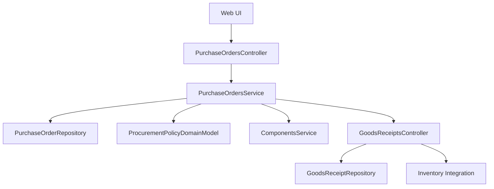
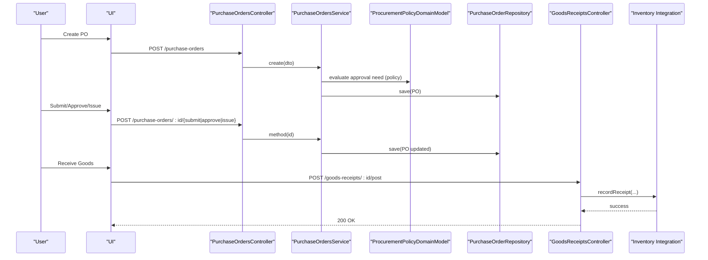
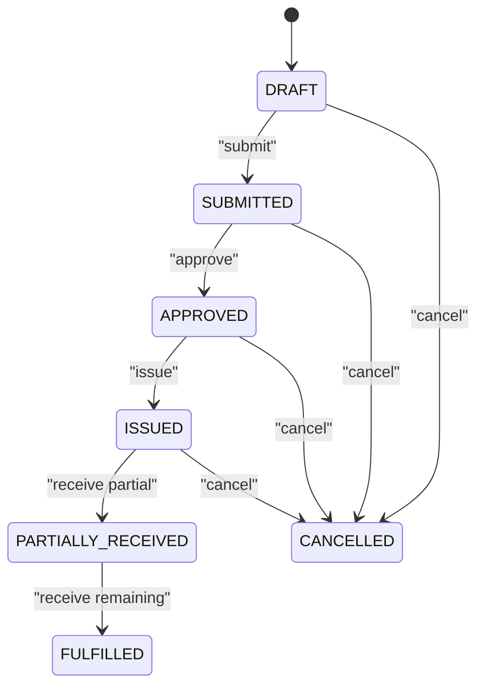
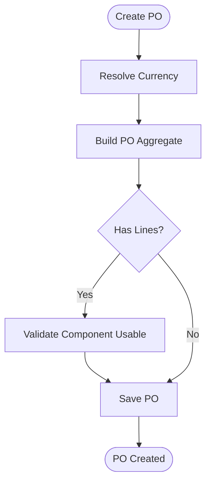
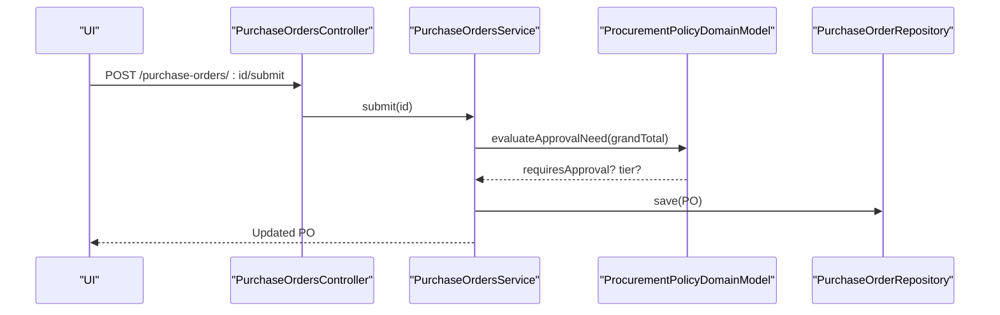
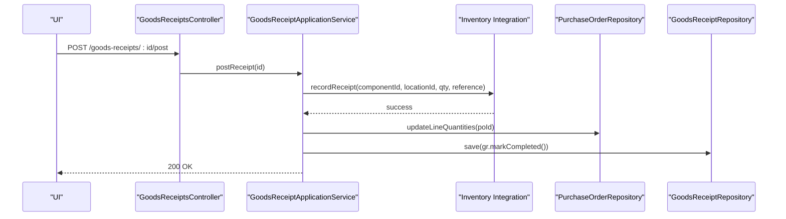
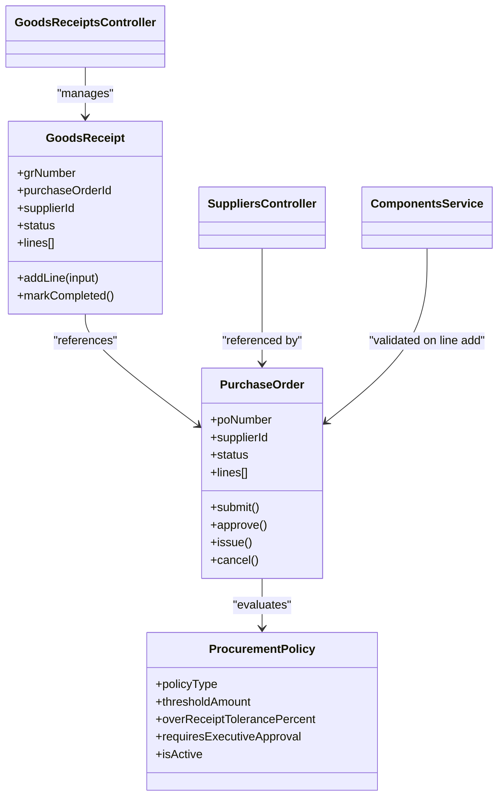
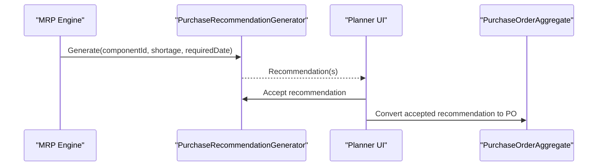
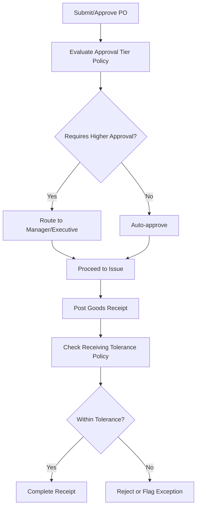
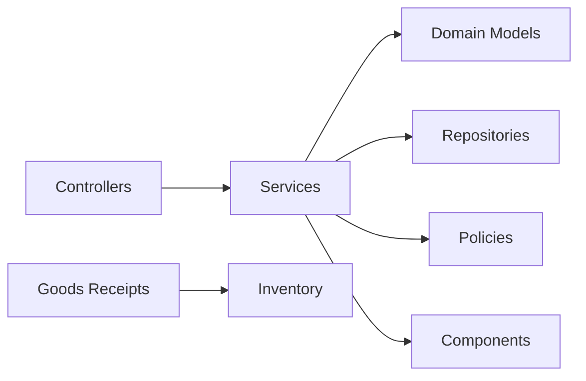

# Purchase Order Workflow

<cite>
**Referenced Files in This Document**
- [RFC-0010: Purchase Orders](file://docs/rfcs/0010-purchase-orders.md)
- [RFC-0011: Goods Receipt](file://docs/rfcs/0011-goods-receipt.md)
- [RFC-0014: Procurement Policies](file://docs/rfcs/0014-procurement-policies.md)
- [RFC-0054: Purchase Planning](file://docs/rfcs/0054-purchase-planning.md)
- [Purchase Orders Controller](file://apps/api/src/purchase-orders/purchase-orders.controller.ts)
- [Purchase Orders Service](file://apps/api/src/purchase-orders/purchase-orders.service.ts)
- [Create Purchase Order Use Case](file://packages/procurement/src/purchase-orders/create-purchase-order.ts)
- [Purchase Order Errors](file://packages/procurement/src/purchase-orders/purchase-order.errors.ts)
- [Goods Receipt Domain Model](file://packages/procurement/src/goods-receipts/goods-receipt.ts)
- [Procurement Policy Domain Model](file://packages/procurement/src/policies/procurement-policy.ts)
- [Suppliers Controller](file://apps/api/src/suppliers/suppliers.controller.ts)
- [Components Service](file://apps/api/src/components/components.service.ts)
- [Goods Receipts Controller](file://apps/api/src/goods-receipts/goods-receipts.controller.ts)
- [Procurement Policies Controller](file://apps/api/src/procurement-policies/procurement-policies.controller.ts)
</cite>

## Table of Contents
1. Introduction
2. Project Structure
3. Core Components
4. Architecture Overview
5. Detailed Component Analysis
6. Dependency Analysis
7. Performance Considerations
8. Troubleshooting Guide
9. Conclusion

## Introduction
This document explains the end-to-end Purchase Order workflow in Ananya ERP, covering creation, approval, issuance, fulfillment via Goods Receipts, and closure. It documents PO states, line item management, status transitions, and integrations with suppliers, components, inventory, MRP recommendations, procurement policies, and budget controls. Practical examples illustrate how to create POs, add line items, approve orders, and track fulfillment. Error handling, validation rules, and audit considerations are included for robust operations.

## Project Structure
The Purchase Order workflow spans API controllers, application services, domain models, and RFC specifications:
- API layer exposes endpoints for PO lifecycle actions (create, submit, approve, issue, cancel), line management, and goods receipt posting.
- Application services orchestrate use cases, enforce validations, and persist changes through repositories.
- Domain models define state machines, invariants, and cross-module integration points.
- RFCs provide authoritative definitions of entities, commands, queries, and workflows.

**Diagram sources**
- [Purchase Orders Controller:23-81](file://apps/api/src/purchase-orders/purchase-orders.controller.ts#L23-L81)
- [Purchase Orders Service:22-144](file://apps/api/src/purchase-orders/purchase-orders.service.ts#L22-L144)
- [Goods Receipts Controller:14-46](file://apps/api/src/goods-receipts/goods-receipts.controller.ts#L14-L46)
- [Procurement Policy Domain Model:25-68](file://packages/procurement/src/policies/procurement-policy.ts#L25-L68)
- [Components Service:87-206](file://apps/api/src/components/components.service.ts#L87-L206)

**Section sources**
- [RFC-0010: Purchase Orders:11-23](file://docs/rfcs/0010-purchase-orders.md#L11-L23)
- [RFC-0011: Goods Receipt:11-23](file://docs/rfcs/0011-goods-receipt.md#L11-L23)
- [RFC-0014: Procurement Policies:11-21](file://docs/rfcs/0014-procurement-policies.md#L11-L21)
- [RFC-0054: Purchase Planning:3-12](file://docs/rfcs/0054-purchase-planning.md#L3-L12)

## Core Components
- Purchase Order aggregate and lifecycle: DRAFT → SUBMITTED → APPROVED → ISSUED → PARTIALLY_RECEIVED → FULFILLED; any stage can transition to CANCELLED where allowed.
- PO Line items: component selection, ordered/received quantities, unit price, tax rate, expected delivery date.
- Goods Receipt: physical receiving against open PO lines, with batch/serial tracking and destination location.
- Procurement Policies: approval tiers and receiving tolerances that govern approvals and over/under-receipt limits.
- Suppliers and Components: referenced by POs and receipts; supplier mapping and component attributes support procurement decisions.
- MRP Recommendations: suggestions generated by planning to resolve shortages; planners accept or reject before converting to formal POs.

Key responsibilities:
- Controllers expose REST endpoints for each lifecycle action.
- Services enforce invariants, call domain methods, and persist changes.
- Domain models encapsulate state transitions, totals, and policy checks.
- RFCs define contracts, schemas, and workflows.

**Section sources**
- [RFC-0010: Purchase Orders:17-23](file://docs/rfcs/0010-purchase-orders.md#L17-L23)
- [RFC-0011: Goods Receipt:17-23](file://docs/rfcs/0011-goods-receipt.md#L17-L23)
- [RFC-0014: Procurement Policies:17-21](file://docs/rfcs/0014-procurement-policies.md#L17-L21)
- [RFC-0054: Purchase Planning:13-18](file://docs/rfcs/0054-purchase-planning.md#L13-L18)

## Architecture Overview
The workflow integrates multiple bounded contexts:
- Procurement context owns POs, Goods Receipts, and Policies.
- Inventory context records stock transactions and updates projections upon receipt posting.
- Planning context generates purchase recommendations consumed by procurement planners.
- Supplier and Component master data underpin procurement decisions.

**Diagram sources**
- [Purchase Orders Controller:28-81](file://apps/api/src/purchase-orders/purchase-orders.controller.ts#L28-L81)
- [Purchase Orders Service:38-144](file://apps/api/src/purchase-orders/purchase-orders.service.ts#L38-L144)
- [Goods Receipts Controller:19-46](file://apps/api/src/goods-receipts/goods-receipts.controller.ts#L19-L46)
- [RFC-0010: Purchase Orders:114-121](file://docs/rfcs/0010-purchase-orders.md#L114-L121)
- [RFC-0011: Goods Receipt:196-211](file://docs/rfcs/0011-goods-receipt.md#L196-L211)

## Detailed Component Analysis

### Purchase Order Lifecycle and State Machine
- States: DRAFT, SUBMITTED, APPROVED, ISSUED, PARTIALLY_RECEIVED, FULFILLED, CANCELLED.
- Transitions:
  - DRAFT → SUBMITTED on submit.
  - SUBMITTED → APPROVED on approve.
  - APPROVED → ISSUED on issue.
  - ISSUED → PARTIALLY_RECEIVED when at least one line is partially received.
  - PARTIALLY_RECEIVED → FULFILLED when all lines fully received.
  - Any pre-receiving state may transition to CANCELLED per policy constraints.
- Invariants:
  - Must have at least one line before leaving DRAFT.
  - Lines cannot be edited after APPROVED or beyond.
  - Ordered quantity must be positive; totals must be consistent.

**Diagram sources**
- [RFC-0010: Purchase Orders:114-121](file://docs/rfcs/0010-purchase-orders.md#L114-L121)

**Section sources**
- [RFC-0010: Purchase Orders:17-23](file://docs/rfcs/0010-purchase-orders.md#L17-L23)
- [RFC-0010: Purchase Orders:125-132](file://docs/rfcs/0010-purchase-orders.md#L125-L132)

### PO Creation and Line Item Management
- Create a draft PO with optional initial lines; currency resolved from settings or explicit input.
- Add/update/remove lines only while in DRAFT.
- Validate component usability before adding lines to prevent ordering retired components.
- Financial totals computed from line prices, quantities, and tax rates.

**Diagram sources**
- [Purchase Orders Service:38-60](file://apps/api/src/purchase-orders/purchase-orders.service.ts#L38-L60)
- [Purchase Orders Service:102-115](file://apps/api/src/purchase-orders/purchase-orders.service.ts#L102-L115)
- [Create Purchase Order Use Case:15-43](file://packages/procurement/src/purchase-orders/create-purchase-order.ts#L15-L43)

**Section sources**
- [Purchase Orders Service:38-60](file://apps/api/src/purchase-orders/purchase-orders.service.ts#L38-L60)
- [Purchase Orders Service:102-115](file://apps/api/src/purchase-orders/purchase-orders.service.ts#L102-L115)
- [Create Purchase Order Use Case:15-43](file://packages/procurement/src/purchase-orders/create-purchase-order.ts#L15-L43)

### Approval Workflow and Procurement Policies
- Approval tier policies determine whether managerial or executive approval is required based on monetary thresholds.
- During submission/approval, policies are evaluated to enforce governance rules.
- Receiving tolerance policies constrain over/under-receipt percentages during Goods Receipt posting.

**Diagram sources**
- [Purchase Orders Controller:63-71](file://apps/api/src/purchase-orders/purchase-orders.controller.ts#L63-L71)
- [Purchase Orders Service:117-129](file://apps/api/src/purchase-orders/purchase-orders.service.ts#L117-L129)
- [Procurement Policy Domain Model:25-68](file://packages/procurement/src/policies/procurement-policy.ts#L25-L68)
- [RFC-0014: Procurement Policies:157-163](file://docs/rfcs/0014-procurement-policies.md#L157-L163)

**Section sources**
- [RFC-0014: Procurement Policies:17-21](file://docs/rfcs/0014-procurement-policies.md#L17-L21)
- [RFC-0014: Procurement Policies:157-163](file://docs/rfcs/0014-procurement-policies.md#L157-L163)

### Fulfillment via Goods Receipts
- Create a Goods Receipt linked to an open PO; add lines referencing PO lines, quantities, locations, and tracking info.
- Post receipt triggers inventory integration to record stock transactions and update projections.
- PO line received quantities are updated; PO status transitions to PARTIALLY_RECEIVED or FULFILLED accordingly.

**Diagram sources**
- [Goods Receipts Controller:19-46](file://apps/api/src/goods-receipts/goods-receipts.controller.ts#L19-L46)
- [RFC-0011: Goods Receipt:196-211](file://docs/rfcs/0011-goods-receipt.md#L196-L211)

**Section sources**
- [RFC-0011: Goods Receipt:17-23](file://docs/rfcs/0011-goods-receipt.md#L17-L23)
- [RFC-0011: Goods Receipt:114-129](file://docs/rfcs/0011-goods-receipt.md#L114-L129)
- [Goods Receipt Domain Model:81-140](file://packages/procurement/src/goods-receipts/goods-receipt.ts#L81-L140)

### Integrations: Suppliers, Components, and Inventory
- Suppliers: POs reference active suppliers; supplier-component mappings inform vendor part numbers and pricing.
- Components: Adding PO lines validates component usability; attributes and SKUs support procurement decisions.
- Inventory: Goods Receipt posting creates immutable ledger transactions and updates stock projections.

**Diagram sources**
- [Purchase Orders Controller:23-81](file://apps/api/src/purchase-orders/purchase-orders.controller.ts#L23-L81)
- [Goods Receipts Controller:14-46](file://apps/api/src/goods-receipts/goods-receipts.controller.ts#L14-L46)
- [Suppliers Controller:23-81](file://apps/api/src/suppliers/suppliers.controller.ts#L23-L81)
- [Components Service:87-206](file://apps/api/src/components/components.service.ts#L87-L206)
- [Procurement Policy Domain Model:25-68](file://packages/procurement/src/policies/procurement-policy.ts#L25-L68)
- [Goods Receipt Domain Model:56-140](file://packages/procurement/src/goods-receipts/goods-receipt.ts#L56-L140)

**Section sources**
- [Suppliers Controller:23-81](file://apps/api/src/suppliers/suppliers.controller.ts#L23-L81)
- [Components Service:108-142](file://apps/api/src/components/components.service.ts#L108-L142)
- [RFC-0010: Purchase Orders:135-139](file://docs/rfcs/0010-purchase-orders.md#L135-L139)
- [RFC-0011: Goods Receipt:125-129](file://docs/rfcs/0011-goods-receipt.md#L125-L129)

### MRP Recommendations to Purchase Orders
- MRP generates purchase recommendations indicating suggested quantities, preferred suppliers, and target dates.
- Planners review and accept recommendations; acceptance marks them for conversion into formal POs.
- MRP does not directly create POs; procurement retains control over final issuance.

**Diagram sources**
- [RFC-0054: Purchase Planning:67-75](file://docs/rfcs/0054-purchase-planning.md#L67-L75)
- [RFC-0054: Purchase Planning:54-58](file://docs/rfcs/0054-purchase-planning.md#L54-L58)

**Section sources**
- [RFC-0054: Purchase Planning:3-12](file://docs/rfcs/0054-purchase-planning.md#L3-L12)
- [RFC-0054: Purchase Planning:54-58](file://docs/rfcs/0054-purchase-planning.md#L54-L58)
- [RFC-0054: Purchase Planning:67-75](file://docs/rfcs/0054-purchase-planning.md#L67-L75)

### Budget Controls and Procurement Policies
- Approval tier policies enforce monetary thresholds for auto-approval vs managerial/executive approval.
- Receiving tolerance policies limit over/under-receipt percentages per component category or PO line.
- Policies are evaluated during submission/approval and Goods Receipt posting.

**Diagram sources**
- [RFC-0014: Procurement Policies:17-21](file://docs/rfcs/0014-procurement-policies.md#L17-L21)
- [RFC-0014: Procurement Policies:157-163](file://docs/rfcs/0014-procurement-policies.md#L157-L163)

**Section sources**
- [RFC-0014: Procurement Policies:17-21](file://docs/rfcs/0014-procurement-policies.md#L17-L21)
- [RFC-0014: Procurement Policies:100-104](file://docs/rfcs/0014-procurement-policies.md#L100-L104)

## Dependency Analysis
- Controllers depend on services for business logic and on exception filters for error handling.
- Services depend on domain aggregates and repositories; they also integrate with settings, components, and policies.
- Domain models encapsulate state transitions and invariants; errors are defined centrally for consistent handling.
- RFCs define contracts and schemas used across modules.

**Diagram sources**
- [Purchase Orders Controller:23-81](file://apps/api/src/purchase-orders/purchase-orders.controller.ts#L23-L81)
- [Purchase Orders Service:22-144](file://apps/api/src/purchase-orders/purchase-orders.service.ts#L22-L144)
- [Goods Receipts Controller:14-46](file://apps/api/src/goods-receipts/goods-receipts.controller.ts#L14-L46)
- [Procurement Policy Domain Model:25-68](file://packages/procurement/src/policies/procurement-policy.ts#L25-L68)

**Section sources**
- [Purchase Orders Controller:23-81](file://apps/api/src/purchase-orders/purchase-orders.controller.ts#L23-L81)
- [Purchase Orders Service:22-144](file://apps/api/src/purchase-orders/purchase-orders.service.ts#L22-L144)
- [Goods Receipts Controller:14-46](file://apps/api/src/goods-receipts/goods-receipts.controller.ts#L14-L46)

## Performance Considerations
- Minimize database round-trips by batching line additions and using repository findMany for list operations.
- Cache policy evaluations where appropriate to reduce repeated threshold checks.
- Ensure Goods Receipt posting runs within a transaction to maintain consistency between inventory updates and PO line updates.
- Avoid unnecessary attribute loading when listing POs; load attributes on demand for detail views.

## Troubleshooting Guide
Common errors and handling:
- Invalid status transitions: thrown when attempting illegal state changes; ensure correct sequence (e.g., approve only from SUBMITTED).
- Empty PO submission: rejected if no lines exist; require at least one line before leaving DRAFT.
- Deleted PO restrictions: deletion allowed only for DRAFT or CANCELLED statuses.
- Component usability: adding lines to retired components is blocked; validate component before line addition.
- Goods Receipt constraints: non-DRAFT receipts cannot be modified; posted receipts are immutable.

Error types and messages are centralized in domain error classes and enforced by services/controllers.

**Section sources**
- [Purchase Order Errors:3-42](file://packages/procurement/src/purchase-orders/purchase-order.errors.ts#L3-L42)
- [Goods Receipt Domain Model:99-140](file://packages/procurement/src/goods-receipts/goods-receipt.ts#L99-L140)
- [Purchase Orders Service:94-115](file://apps/api/src/purchase-orders/purchase-orders.service.ts#L94-L115)

## Conclusion
Ananya ERP’s Purchase Order workflow provides a robust, policy-driven process from creation through fulfillment and closure. The design separates concerns across controllers, services, and domain models, ensuring clear state transitions, strong invariants, and reliable integrations with suppliers, components, inventory, and planning systems. Procurement policies enforce governance and receiving tolerances, while MRP recommendations streamline sourcing decisions. Proper error handling and validation ensure data integrity and operational reliability throughout the lifecycle.