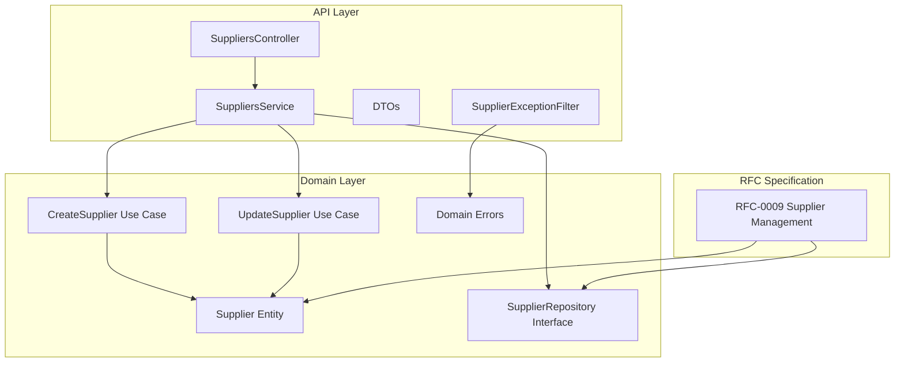
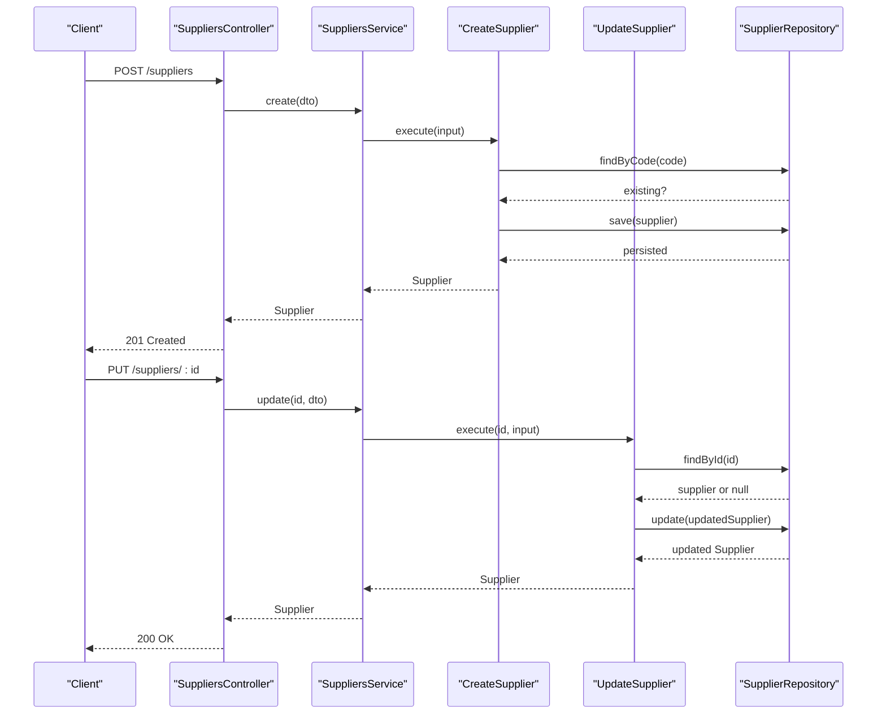
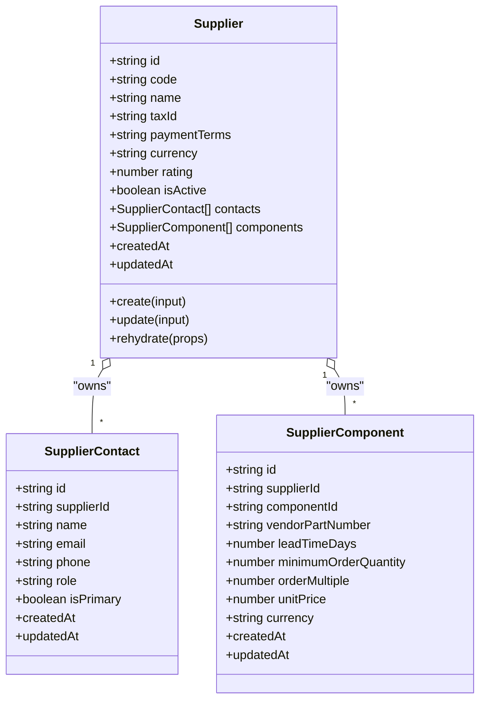
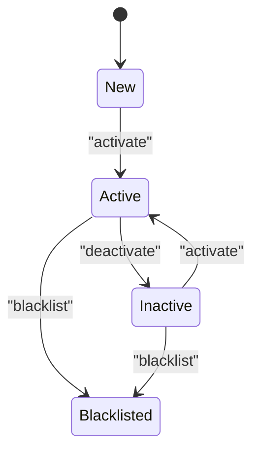
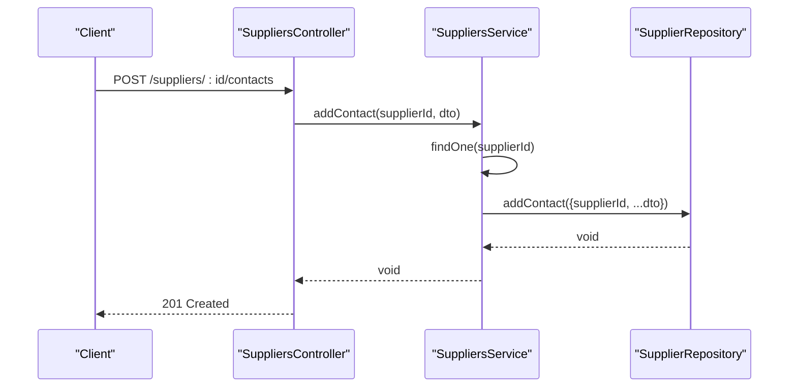
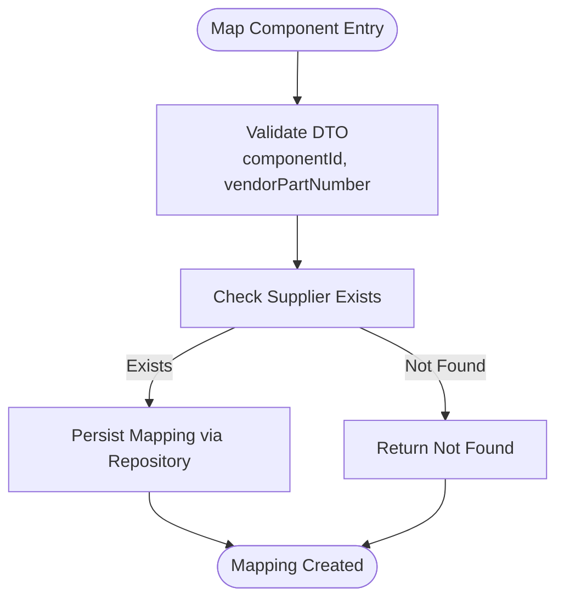
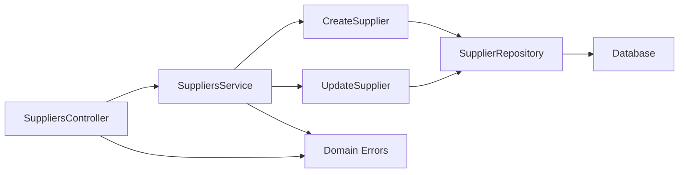

# Supplier Management

<cite>
**Referenced Files in This Document**
- [suppliers.controller.ts](file://apps/api/src/suppliers/suppliers.controller.ts)
- [suppliers.service.ts](file://apps/api/src/suppliers/suppliers.service.ts)
- [dtos.ts](file://apps/api/src/suppliers/dtos.ts)
- [supplier-exception.filter.ts](file://apps/api/src/suppliers/supplier-exception.filter.ts)
- [0009-supplier-management.md](file://docs/rfcs/0009-supplier-management.md)
- [supplier.ts](file://packages/procurement/src/suppliers/supplier.ts)
- [supplier.repository.ts](file://packages/procurement/src/suppliers/supplier.repository.ts)
- [create-supplier.ts](file://packages/procurement/src/suppliers/create-supplier.ts)
- [update-supplier.ts](file://packages/procurement/src/suppliers/update-supplier.ts)
- [supplier.errors.ts](file://packages/procurement/src/suppliers/supplier.errors.ts)
</cite>

## Table of Contents
1. Introduction
2. Project Structure
3. Core Components
4. Architecture Overview
5. Detailed Component Analysis
6. Dependency Analysis
7. Performance Considerations
8. Troubleshooting Guide
9. Conclusion

## Introduction
This document explains Ananya ERP’s Supplier Management system within the Procurement bounded context. It covers the supplier lifecycle (creation, updates, activation/deactivation), contact management, and component mapping to suppliers. It also documents the data model, API endpoints, validation rules, business constraints, and integration points with purchase orders and procurement workflows.

## Project Structure
Supplier Management is implemented across:
- API layer (NestJS): controller, service, DTOs, exception filter
- Domain layer (Procurement package): domain entity, repository interface, use cases (create/update), errors
- RFC specification: domain model, state machine, database schema, API spec

**Diagram sources**
- [suppliers.controller.ts:23-80](file://apps/api/src/suppliers/suppliers.controller.ts#L23-L80)
- [suppliers.service.ts:20-101](file://apps/api/src/suppliers/suppliers.service.ts#L20-L101)
- [dtos.ts:9-107](file://apps/api/src/suppliers/dtos.ts#L9-L107)
- [supplier-exception.filter.ts:16-51](file://apps/api/src/suppliers/supplier-exception.filter.ts#L16-L51)
- [supplier.ts:65-161](file://packages/procurement/src/suppliers/supplier.ts#L65-L161)
- [supplier.repository.ts:8-36](file://packages/procurement/src/suppliers/supplier.repository.ts#L8-L36)
- [create-supplier.ts:5-20](file://packages/procurement/src/suppliers/create-supplier.ts#L5-L20)
- [update-supplier.ts:8-31](file://packages/procurement/src/suppliers/update-supplier.ts#L8-L31)
- [0009-supplier-management.md:38-197](file://docs/rfcs/0009-supplier-management.md#L38-L197)

**Section sources**
- [suppliers.controller.ts:23-80](file://apps/api/src/suppliers/suppliers.controller.ts#L23-L80)
- [suppliers.service.ts:20-101](file://apps/api/src/suppliers/suppliers.service.ts#L20-L101)
- [dtos.ts:9-107](file://apps/api/src/suppliers/dtos.ts#L9-L107)
- [supplier-exception.filter.ts:16-51](file://apps/api/src/suppliers/supplier-exception.filter.ts#L16-L51)
- [supplier.ts:65-161](file://packages/procurement/src/suppliers/supplier.ts#L65-L161)
- [supplier.repository.ts:8-36](file://packages/procurement/src/suppliers/supplier.repository.ts#L8-L36)
- [create-supplier.ts:5-20](file://packages/procurement/src/suppliers/create-supplier.ts#L5-L20)
- [update-supplier.ts:8-31](file://packages/procurement/src/suppliers/update-supplier.ts#L8-L31)
- [0009-supplier-management.md:38-197](file://docs/rfcs/0009-supplier-management.md#L38-L197)

## Core Components
- SuppliersController: Exposes REST endpoints for supplier CRUD, contacts, and component mappings.
- SuppliersService: Orchestrates use cases and delegates to domain use cases and repository.
- DTOs: Request validation schemas for creating/updating suppliers, adding contacts, and mapping components.
- Supplier Exception Filter: Maps domain errors to HTTP status codes.
- Supplier Entity: Immutable domain object with creation and update logic.
- SupplierRepository Interface: Contract for persistence and relationships (contacts, component mappings).
- CreateSupplier/UpdateSupplier Use Cases: Enforce uniqueness and domain rules before persisting changes.
- Domain Errors: Typed exceptions for invalid inputs, duplicates, not found, and referential integrity.

Key responsibilities:
- Controller handles routing and request/response mapping.
- Service validates existence and coordinates operations.
- Domain enforces invariants (code/name validation, defaults).
- Repository abstracts storage and relationship operations.

**Section sources**
- [suppliers.controller.ts:23-80](file://apps/api/src/suppliers/suppliers.controller.ts#L23-L80)
- [suppliers.service.ts:20-101](file://apps/api/src/suppliers/suppliers.service.ts#L20-L101)
- [dtos.ts:9-107](file://apps/api/src/suppliers/dtos.ts#L9-L107)
- [supplier-exception.filter.ts:16-51](file://apps/api/src/suppliers/supplier-exception.filter.ts#L16-L51)
- [supplier.ts:65-161](file://packages/procurement/src/suppliers/supplier.ts#L65-L161)
- [supplier.repository.ts:8-36](file://packages/procurement/src/suppliers/supplier.repository.ts#L8-L36)
- [create-supplier.ts:5-20](file://packages/procurement/src/suppliers/create-supplier.ts#L5-L20)
- [update-supplier.ts:8-31](file://packages/procurement/src/suppliers/update-supplier.ts#L8-L31)

## Architecture Overview
The Supplier Management feature follows a layered architecture:
- Presentation/API: NestJS controller exposes REST endpoints.
- Application: Service coordinates use cases and repository calls.
- Domain: Supplier entity encapsulates business rules; use cases enforce invariants.
- Infrastructure: Repository interface abstracts persistence and relationships.

**Diagram sources**
- [suppliers.controller.ts:28-51](file://apps/api/src/suppliers/suppliers.controller.ts#L28-L51)
- [suppliers.service.ts:35-56](file://apps/api/src/suppliers/suppliers.service.ts#L35-L56)
- [create-supplier.ts:8-19](file://packages/procurement/src/suppliers/create-supplier.ts#L8-L19)
- [update-supplier.ts:11-30](file://packages/procurement/src/suppliers/update-supplier.ts#L11-L30)
- [supplier.repository.ts:8-14](file://packages/procurement/src/suppliers/supplier.repository.ts#L8-L14)

## Detailed Component Analysis

### Supplier Data Model
The Supplier aggregate includes:
- Company details: code (unique, uppercase), name, taxId, paymentTerms, currency
- Lifecycle: rating (default 5.0), isActive (default true)
- Contacts: multiple entries with primary flag
- Catalog: mappings to internal components with vendor part number, lead time, MOQ, order multiple, unit price, currency

**Diagram sources**
- [supplier.ts:7-46](file://packages/procurement/src/suppliers/supplier.ts#L7-L46)
- [supplier.ts:65-161](file://packages/procurement/src/suppliers/supplier.ts#L65-L161)
- [0009-supplier-management.md:38-79](file://docs/rfcs/0009-supplier-management.md#L38-L79)

**Section sources**
- [supplier.ts:7-46](file://packages/procurement/src/suppliers/supplier.ts#L7-L46)
- [supplier.ts:65-161](file://packages/procurement/src/suppliers/supplier.ts#L65-L161)
- [0009-supplier-management.md:38-79](file://docs/rfcs/0009-supplier-management.md#L38-L79)

### API Endpoints
- Create supplier: POST /suppliers
- List/search suppliers: GET /suppliers?search=...
- Get supplier by ID: GET /suppliers/:id
- Update supplier: PUT /suppliers/:id
- Delete supplier: DELETE /suppliers/:id
- Add contact: POST /suppliers/:id/contacts
- Remove contact: DELETE /suppliers/:id/contacts/:contactId
- Map component: POST /suppliers/:id/components
- Remove component mapping: DELETE /suppliers/:id/components/:mappingId

Validation and behavior:
- Create/Update DTOs validate required fields and types.
- Contact DTO ensures at least one primary contact can be set.
- Component mapping DTO requires componentId and vendorPartNumber; optional pricing and ordering constraints.

**Section sources**
- [suppliers.controller.ts:28-80](file://apps/api/src/suppliers/suppliers.controller.ts#L28-L80)
- [dtos.ts:9-107](file://apps/api/src/suppliers/dtos.ts#L9-L107)
- [0009-supplier-management.md:201-210](file://docs/rfcs/0009-supplier-management.md#L201-L210)

### Supplier Lifecycle and State Machine
Lifecycle states:
- New/Draft -> Active
- Active <-> Inactive
- Active/Inactive -> Blacklisted

Business constraints:
- Deactivated or blacklisted suppliers cannot be selected for new purchase orders.
- Supplier code must be unique and uppercase.
- At most one primary contact per supplier.

**Diagram sources**
- [0009-supplier-management.md:116-122](file://docs/rfcs/0009-supplier-management.md#L116-L122)
- [0009-supplier-management.md:126-133](file://docs/rfcs/0009-supplier-management.md#L126-L133)

**Section sources**
- [0009-supplier-management.md:116-133](file://docs/rfcs/0009-supplier-management.md#L116-L133)

### Validation Rules and Business Constraints
- Supplier code: non-empty, trimmed, uppercase, unique
- Supplier name: non-empty
- Payment terms: default NET30 if omitted
- Currency: default INR if omitted
- Contact primary flag: only one primary allowed per supplier
- Component mapping: MOQ and order multiple must be positive integers (>0)
- Deactivated/blacklisted suppliers are excluded from new PO selection

Implementation highlights:
- Domain entity enforces code/name validation and defaults during create/update.
- Use cases check duplicate codes before saving.
- DTOs provide runtime validation for incoming requests.

**Section sources**
- [supplier.ts:94-156](file://packages/procurement/src/suppliers/supplier.ts#L94-L156)
- [create-supplier.ts:8-19](file://packages/procurement/src/suppliers/create-supplier.ts#L8-L19)
- [update-supplier.ts:11-30](file://packages/procurement/src/suppliers/update-supplier.ts#L11-L30)
- [dtos.ts:9-107](file://apps/api/src/suppliers/dtos.ts#L9-L107)
- [0009-supplier-management.md:126-133](file://docs/rfcs/0009-supplier-management.md#L126-L133)

### Contact Management
Operations:
- Add contact with name, email, phone, role, and optional primary flag
- Remove contact by ID

Behavior:
- Service verifies supplier exists before adding/removing contacts
- Repository contract supports add/delete contact operations

**Diagram sources**
- [suppliers.controller.ts:54-57](file://apps/api/src/suppliers/suppliers.controller.ts#L54-L57)
- [suppliers.service.ts:74-80](file://apps/api/src/suppliers/suppliers.service.ts#L74-L80)
- [supplier.repository.ts:16-24](file://packages/procurement/src/suppliers/supplier.repository.ts#L16-L24)

**Section sources**
- [suppliers.controller.ts:54-66](file://apps/api/src/suppliers/suppliers.controller.ts#L54-L66)
- [suppliers.service.ts:74-85](file://apps/api/src/suppliers/suppliers.service.ts#L74-L85)
- [supplier.repository.ts:16-24](file://packages/procurement/src/suppliers/supplier.repository.ts#L16-L24)

### Component-Supplier Mapping
Operations:
- Map a component to a supplier with vendor part number, lead time, MOQ, order multiple, unit price, currency
- Remove mapping by mapping ID

Behavior:
- Service verifies supplier exists before mapping
- Repository contract supports map/remove mapping operations

**Diagram sources**
- [suppliers.controller.ts:68-80](file://apps/api/src/suppliers/suppliers.controller.ts#L68-L80)
- [suppliers.service.ts:87-101](file://apps/api/src/suppliers/suppliers.service.ts#L87-L101)
- [supplier.repository.ts:25-35](file://packages/procurement/src/suppliers/supplier.repository.ts#L25-L35)

**Section sources**
- [suppliers.controller.ts:68-80](file://apps/api/src/suppliers/suppliers.controller.ts#L68-L80)
- [suppliers.service.ts:87-101](file://apps/api/src/suppliers/suppliers.service.ts#L87-L101)
- [supplier.repository.ts:25-35](file://packages/procurement/src/suppliers/supplier.repository.ts#L25-L35)

### Integration Points with Purchase Orders and Procurement Workflows
- Supplier readiness: deactivated or blacklisted suppliers cannot be selected for new purchase orders
- Preferred supplier and best pricing resolution for a given component and order quantity
- Reference to inventory components via SupplierComponent.componentId

Practical implications:
- When creating purchase orders, the system should filter out inactive/blacklisted suppliers
- Pricing and lead times from SupplierComponent inform procurement decisions

**Section sources**
- [0009-supplier-management.md:126-133](file://docs/rfcs/0009-supplier-management.md#L126-L133)
- [0009-supplier-management.md:136-140](file://docs/rfcs/0009-supplier-management.md#L136-L140)

### Database Schema
Core tables:
- suppliers: id, code (unique), name, tax_id, payment_terms, currency, rating, is_active, timestamps
- supplier_contacts: id, supplier_id (FK), name, email, phone, role, is_primary, timestamps
- supplier_components: id, supplier_id (FK), component_id, vendor_part_number, lead_time_days, minimum_order_quantity, order_multiple, unit_price, currency, timestamps

Constraints and defaults:
- Default payment terms: NET30
- Default currency: USD (schema) vs INR (domain default)
- Primary keys and foreign keys ensure referential integrity

**Section sources**
- [0009-supplier-management.md:156-197](file://docs/rfcs/0009-supplier-management.md#L156-L197)

## Dependency Analysis
Coupling and cohesion:
- Controller depends on Service and DTOs
- Service depends on Domain Use Cases and Repository interface
- Domain entities and use cases are independent of infrastructure
- Exception filter maps domain errors to HTTP responses

External dependencies:
- Inventory bounded context referenced via SupplierComponent.componentId
- Procurement policies and purchase orders integrate with supplier readiness and catalog pricing

**Diagram sources**
- [suppliers.controller.ts:23-80](file://apps/api/src/suppliers/suppliers.controller.ts#L23-L80)
- [suppliers.service.ts:20-101](file://apps/api/src/suppliers/suppliers.service.ts#L20-L101)
- [create-supplier.ts:5-20](file://packages/procurement/src/suppliers/create-supplier.ts#L5-L20)
- [update-supplier.ts:8-31](file://packages/procurement/src/suppliers/update-supplier.ts#L8-L31)
- [supplier.repository.ts:8-36](file://packages/procurement/src/suppliers/supplier.repository.ts#L8-L36)
- [supplier.errors.ts:1-39](file://packages/procurement/src/suppliers/supplier.errors.ts#L1-L39)

**Section sources**
- [suppliers.controller.ts:23-80](file://apps/api/src/suppliers/suppliers.controller.ts#L23-L80)
- [suppliers.service.ts:20-101](file://apps/api/src/suppliers/suppliers.service.ts#L20-L101)
- [supplier.repository.ts:8-36](file://packages/procurement/src/suppliers/supplier.repository.ts#L8-L36)
- [supplier.errors.ts:1-39](file://packages/procurement/src/suppliers/supplier.errors.ts#L1-L39)

## Performance Considerations
- Indexing: Ensure indexes on suppliers.code, supplier_contacts.supplier_id, supplier_components.supplier_id, and supplier_components.component_id for efficient lookups and joins.
- Pagination: Implement pagination for list endpoints to handle large supplier catalogs.
- Caching: Cache frequently accessed supplier profiles and catalog mappings where appropriate.
- Validation: Keep DTO validation lightweight; defer expensive checks to domain/use case layers.
- Transactions: Wrap multi-step operations (e.g., mapping component and updating supplier) in transactions to maintain consistency.

[No sources needed since this section provides general guidance]

## Troubleshooting Guide
Common issues and resolutions:
- Duplicate supplier code: Occurs when attempting to create or update with an existing code. Resolve by choosing a unique code or updating the existing supplier.
- Supplier not found: Occurs when referencing a non-existent supplier. Verify the ID and ensure the supplier exists.
- Invalid supplier code/name: Occurs when input violates domain rules. Trim and uppercase the code; ensure name is non-empty.
- Referential integrity: Cannot delete supplier with active purchase orders or transactions. Resolve by clearing references or deactivating first.

HTTP status mapping:
- Conflict (409): DuplicateSupplierCodeError
- Not Found (404): SupplierNotFoundError
- Bad Request (400): InvalidSupplierCodeError, InvalidSupplierNameError, SupplierHasPurchaseOrdersError

**Section sources**
- [supplier-exception.filter.ts:16-51](file://apps/api/src/suppliers/supplier-exception.filter.ts#L16-L51)
- [supplier.errors.ts:1-39](file://packages/procurement/src/suppliers/supplier.errors.ts#L1-L39)

## Conclusion
Ananya ERP’s Supplier Management system provides a robust foundation for managing external vendors, their contacts, and component mappings. The domain-driven design ensures strong invariants, while the API layer offers clear endpoints for CRUD and relationship management. Integration points with procurement workflows enable informed purchasing decisions based on supplier readiness, pricing, and lead times. Adhering to the documented validation rules and constraints will help maintain data integrity and streamline procurement processes.

[No sources needed since this section summarizes without analyzing specific files]