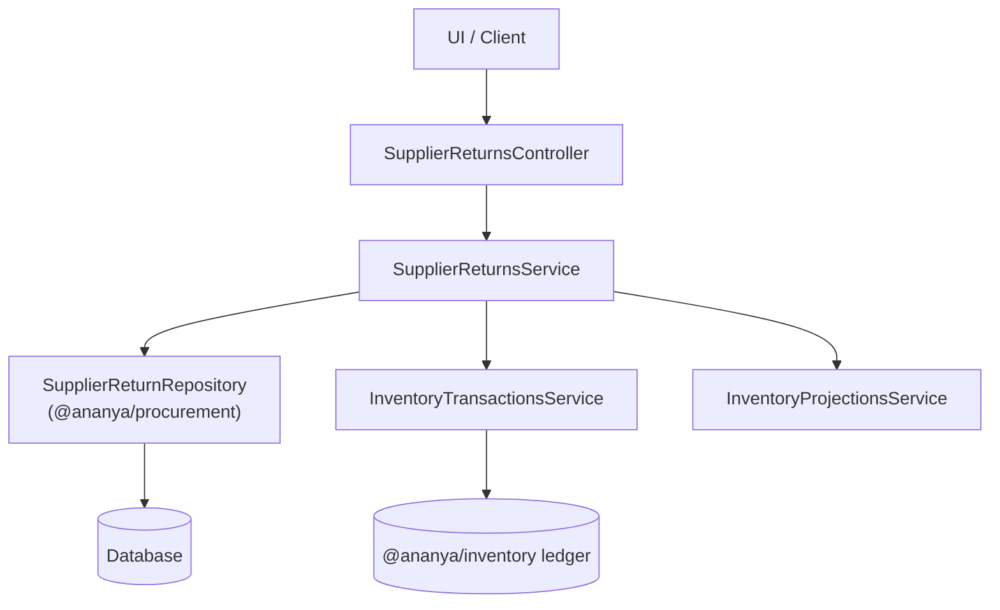
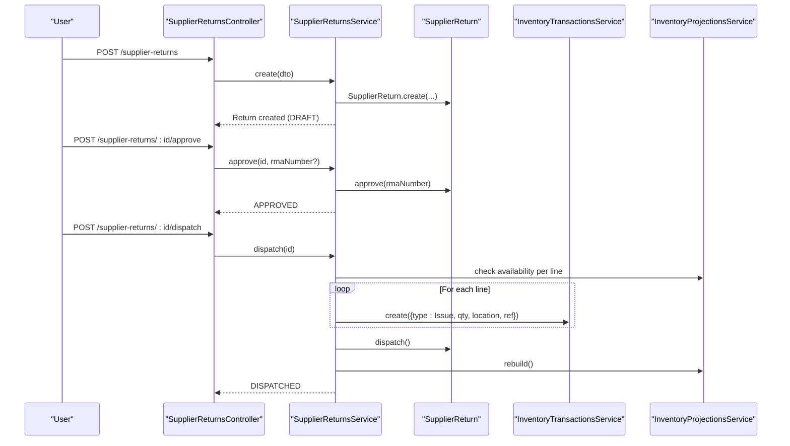
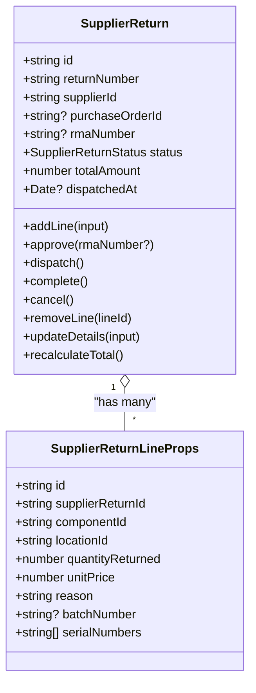
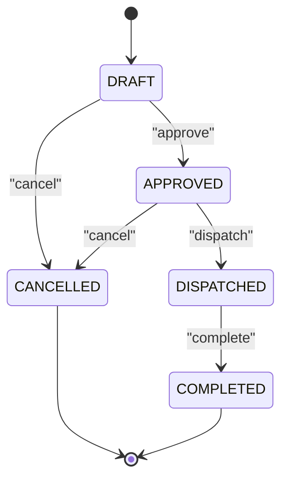
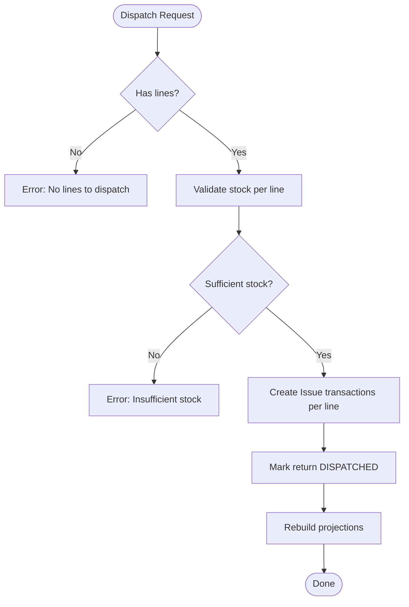
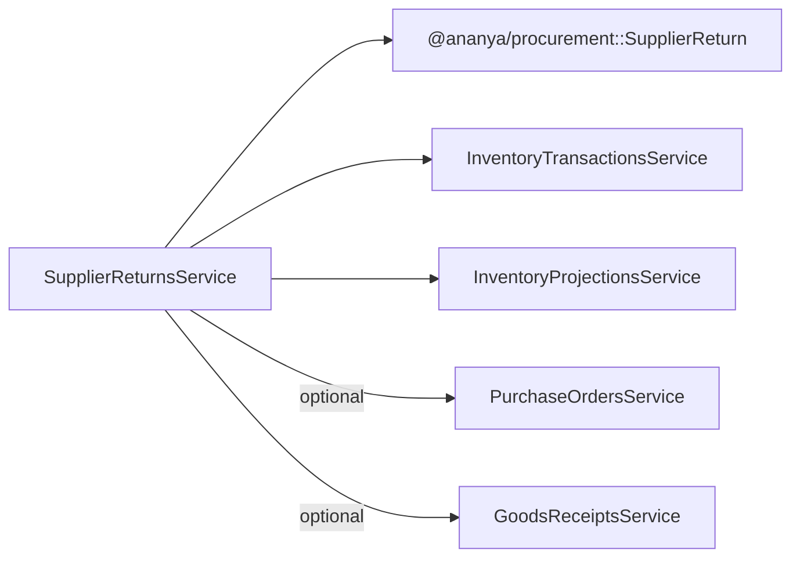

# Supplier Returns

<cite>
**Referenced Files in This Document**
- [supplier-returns.controller.ts](file://apps/api/src/supplier-returns/supplier-returns.controller.ts)
- [supplier-returns.service.ts](file://apps/api/src/supplier-returns/supplier-returns.service.ts)
- [dtos.ts](file://apps/api/src/supplier-returns/dtos.ts)
- [supplier-return.ts](file://packages/procurement/src/supplier-returns/supplier-return.ts)
- [0012-supplier-returns.md](file://docs/rfcs/0012-supplier-returns.md)
- [goods-receipts.service.ts](file://apps/api/src/goods-receipts/goods-receipts.service.ts)
- [purchase-orders.service.ts](file://apps/api/src/purchase-orders/purchase-orders.service.ts)
- [inventory-transactions.service.ts](file://apps/api/src/inventory-transactions/inventory-transactions.service.ts)
- [purchase-invoices.service.ts](file://apps/api/src/purchase-invoices/purchase-invoices.service.ts)
- [payments.service.ts](file://apps/api/src/payments/payments.service.ts)
</cite>

## Table of Contents
1. Introduction
2. Project Structure
3. Core Components
4. Architecture Overview
5. Detailed Component Analysis
6. Dependency Analysis
7. Performance Considerations
8. Troubleshooting Guide
9. Conclusion

## Introduction
This document explains Ananya ERP’s Supplier Returns management end-to-end: from return authorization through processing, inventory impact, and financial settlement. It covers return types (defective items, wrong shipments, excess quantities), the relationship between supplier returns, goods receipts, and purchase orders, the data model for returns (reasons, quantities, condition assessment via batch/serial, credit calculations), practical workflows, and integrations with quality management, vendor performance tracking, and financial accounting.

## Project Structure
Supplier Returns is implemented as a NestJS feature module under apps/api/src/supplier-returns with domain logic defined in packages/procurement/src/supplier-returns. The API exposes endpoints to create, approve, dispatch, complete, cancel, and manage line items. Inventory integration occurs via inventory transactions when stock is physically dispatched back to the supplier.

**Diagram sources**
- [supplier-returns.controller.ts:20-88](file://apps/api/src/supplier-returns/supplier-returns.controller.ts#L20-L88)
- [supplier-returns.service.ts:23-30](file://apps/api/src/supplier-returns/supplier-returns.service.ts#L23-L30)
- [supplier-return.ts:52-95](file://packages/procurement/src/supplier-returns/supplier-return.ts#L52-L95)
- [inventory-transactions.service.ts:19-32](file://apps/api/src/inventory-transactions/inventory-transactions.service.ts#L19-L32)

**Section sources**
- [supplier-returns.controller.ts:20-88](file://apps/api/src/supplier-returns/supplier-returns.controller.ts#L20-L88)
- [supplier-returns.service.ts:23-30](file://apps/api/src/supplier-returns/supplier-returns.service.ts#L23-L30)
- [supplier-return.ts:52-95](file://packages/procurement/src/supplier-returns/supplier-return.ts#L52-L95)

## Core Components
- SupplierReturnsController: REST endpoints for lifecycle operations (create, update, lines, approve, dispatch, complete, cancel).
- SupplierReturnsService: Orchestrates state transitions, validates stock availability, issues inventory transactions on dispatch, and rebuilds projections.
- SupplierReturn aggregate: Encapsulates status machine, line management, totals, and business rules.
- DTOs: Input validation for creation, updates, status changes, and line additions.
- Inventory integration: Issues stock on dispatch; restores stock on cancellation if already dispatched.

Key responsibilities:
- Enforce DRAFT-only modifications for details and lines.
- Validate available stock before approving/dispatching.
- Generate Issue transactions upon dispatch and restore Receipt transactions on cancellation.
- Maintain totalAmount based on line unitPrice × quantityReturned.

**Section sources**
- [supplier-returns.controller.ts:24-88](file://apps/api/src/supplier-returns/supplier-returns.controller.ts#L24-L88)
- [supplier-returns.service.ts:32-260](file://apps/api/src/supplier-returns/supplier-returns.service.ts#L32-L260)
- [supplier-return.ts:97-204](file://packages/procurement/src/supplier-returns/supplier-return.ts#L97-L204)
- [dtos.ts:9-76](file://apps/api/src/supplier-returns/dtos.ts#L9-L76)

## Architecture Overview
The Supplier Returns workflow integrates procurement, inventory, and finance modules:

**Diagram sources**
- [supplier-returns.controller.ts:24-88](file://apps/api/src/supplier-returns/supplier-returns.controller.ts#L24-L88)
- [supplier-returns.service.ts:122-181](file://apps/api/src/supplier-returns/supplier-returns.service.ts#L122-L181)
- [supplier-return.ts:125-147](file://packages/procurement/src/supplier-returns/supplier-return.ts#L125-L147)
- [inventory-transactions.service.ts:19-32](file://apps/api/src/inventory-transactions/inventory-transactions.service.ts#L19-L32)

## Detailed Component Analysis

### Supplier Return Domain Model
- Aggregate root: SupplierReturn
- Lines: componentId, locationId, quantityReturned, unitPrice, reason, batchNumber, serialNumbers
- Statuses: DRAFT → APPROVED → DISPATCHED → COMPLETED (or CANCELLED at any time except COMPLETED)
- Totals: computed from lines (unitPrice × quantityReturned)
- Invariants:
  - Only DRAFT allows detail/line edits
  - Dispatch requires APPROVED and sufficient stock
  - Cancel disallowed after COMPLETED

**Diagram sources**
- [supplier-return.ts:21-33](file://packages/procurement/src/supplier-returns/supplier-return.ts#L21-L33)
- [supplier-return.ts:52-204](file://packages/procurement/src/supplier-returns/supplier-return.ts#L52-L204)

**Section sources**
- [supplier-return.ts:52-204](file://packages/procurement/src/supplier-returns/supplier-return.ts#L52-L204)
- [0012-supplier-returns.md:35-72](file://docs/rfcs/0012-supplier-returns.md#L35-L72)

### API Endpoints and DTOs
- Create, Find, Update, Delete returns
- Add/Remove lines
- Approve, Dispatch, Complete, Cancel
- Status update endpoint
- DTOs enforce required fields and types for inputs

Validation highlights:
- Line addition requires componentId, locationId, quantityReturned, unitPrice, reason
- Optional batchNumber and serialNumbers support lot/serial tracking
- Status updates route to specific service methods

**Section sources**
- [supplier-returns.controller.ts:24-88](file://apps/api/src/supplier-returns/supplier-returns.controller.ts#L24-L88)
- [dtos.ts:9-76](file://apps/api/src/supplier-returns/dtos.ts#L9-L76)

### Return Workflow and State Machine

**Diagram sources**
- [supplier-return.ts:125-167](file://packages/procurement/src/supplier-returns/supplier-return.ts#L125-L167)
- [supplier-returns.service.ts:228-260](file://apps/api/src/supplier-returns/supplier-returns.service.ts#L228-L260)

**Section sources**
- [supplier-return.ts:125-167](file://packages/procurement/src/supplier-returns/supplier-return.ts#L125-L167)
- [supplier-returns.service.ts:228-260](file://apps/api/src/supplier-returns/supplier-returns.service.ts#L228-L260)

### Stock Availability and Inventory Impact
- Before adding or dispatching lines, the service checks projected stock at the specified location.
- On dispatch, Issue transactions are created per line with reference to the return number and optional RMA.
- On cancellation after dispatch, Receipt transactions restore stock and projections are rebuilt.

**Diagram sources**
- [supplier-returns.service.ts:129-181](file://apps/api/src/supplier-returns/supplier-returns.service.ts#L129-L181)
- [inventory-transactions.service.ts:19-32](file://apps/api/src/inventory-transactions/inventory-transactions.service.ts#L19-L32)

**Section sources**
- [supplier-returns.service.ts:129-181](file://apps/api/src/supplier-returns/supplier-returns.service.ts#L129-L181)
- [supplier-returns.service.ts:201-226](file://apps/api/src/supplier-returns/supplier-returns.service.ts#L201-L226)

### Relationship to Purchase Orders and Goods Receipts
- Supplier returns can be linked to a purchase order to trace origin.
- Goods receipts increase inventory; supplier returns decrease inventory via Issue transactions.
- PO receipt progress is updated by goods receipts; returns do not directly modify PO receipt counters but provide audit trail via references.

Practical linkage:
- Create return with purchaseOrderId to associate with original procurement.
- Use GR numbers and PO numbers in reasons/references for traceability.

**Section sources**
- [goods-receipts.service.ts:42-116](file://apps/api/src/goods-receipts/goods-receipts.service.ts#L42-L116)
- [goods-receipts.service.ts:146-180](file://apps/api/src/goods-receipts/goods-receipts.service.ts#L146-L180)
- [purchase-orders.service.ts:38-60](file://apps/api/src/purchase-orders/purchase-orders.service.ts#L38-L60)

### Credit Memo and Financial Accounting Integration
- Current implementation focuses on inventory impact and return lifecycle.
- Future extension includes credit memo reconciliation with Accounting.
- Payments module supports applying payments to payable invoices; supplier returns can later trigger credit memos that reduce payables or enable refunds.

Integration points:
- Reference return number and RMA in inventory transactions for audit.
- When credits are issued, link to purchase invoices/payables for three-way matching adjustments.

**Section sources**
- [0012-supplier-returns.md:207-208](file://docs/rfcs/0012-supplier-returns.md#L207-L208)
- [purchase-invoices.service.ts:70-83](file://apps/api/src/purchase-invoices/purchase-invoices.service.ts#L70-L83)
- [payments.service.ts:58-79](file://apps/api/src/payments/payments.service.ts#L58-L79)

### Quality Management and Vendor Performance Tracking
- Return lines capture reason codes (e.g., defective, wrong item, over-shipment) and condition indicators (batch/serial).
- These data points feed quality analytics and vendor scorecards:
  - Defect rate per supplier
  - Wrong shipment frequency
  - Excess delivery incidents
- Recommendations:
  - Standardize reason codes across returns
  - Track batch/serial for traceability and recall scenarios
  - Export return metrics to vendor performance dashboards

**Section sources**
- [0012-supplier-returns.md:19-22](file://docs/rfcs/0012-supplier-returns.md#L19-L22)
- [supplier-return.ts:7-19](file://packages/procurement/src/supplier-returns/supplier-return.ts#L7-L19)

## Dependency Analysis
Supplier Returns depends on:
- Procurement domain (SupplierReturn aggregate, repository)
- Inventory services (transactions and projections)
- Optional links to Purchase Orders and Goods Receipts for traceability

**Diagram sources**
- [supplier-returns.service.ts:23-30](file://apps/api/src/supplier-returns/supplier-returns.service.ts#L23-L30)
- [purchase-orders.service.ts:22-36](file://apps/api/src/purchase-orders/purchase-orders.service.ts#L22-L36)
- [goods-receipts.service.ts:26-40](file://apps/api/src/goods-receipts/goods-receipts.service.ts#L26-L40)

**Section sources**
- [supplier-returns.service.ts:23-30](file://apps/api/src/supplier-returns/supplier-returns.service.ts#L23-L30)

## Performance Considerations
- Batch validations: Validate all lines’ stock availability before issuing multiple inventory transactions to minimize round-trips.
- Projection rebuild: Trigger projection rebuild once after bulk operations rather than per line.
- Idempotency: Ensure dispatch and completion endpoints are idempotent to handle retries safely.
- Indexing: Ensure indexes on supplierId, purchaseOrderId, status, and returnNumber for efficient queries.

[No sources needed since this section provides general guidance]

## Troubleshooting Guide
Common errors and resolutions:
- Cannot modify non-DRAFT return: Edit details or lines only in DRAFT state.
- Insufficient stock at location: Verify projected stock before adding/dispatching lines.
- Cannot cancel completed return: Completed returns cannot be cancelled; consider reversal processes outside this module.
- Invalid status transition: Follow allowed state transitions (DRAFT→APPROVED→DISPATCHED→COMPLETED; CANCELLED anytime except COMPLETED).

Operational checks:
- Confirm RMA number is set on approval if required by supplier.
- Verify inventory transactions were created on dispatch and restored on cancellation.
- Review return reasons and batch/serial data for quality analysis.

**Section sources**
- [supplier-returns.service.ts:59-82](file://apps/api/src/supplier-returns/supplier-returns.service.ts#L59-L82)
- [supplier-returns.service.ts:84-120](file://apps/api/src/supplier-returns/supplier-returns.service.ts#L84-L120)
- [supplier-returns.service.ts:129-181](file://apps/api/src/supplier-returns/supplier-returns.service.ts#L129-L181)
- [supplier-returns.service.ts:201-226](file://apps/api/src/supplier-returns/supplier-returns.service.ts#L201-L226)
- [supplier-return.ts:97-167](file://packages/procurement/src/supplier-returns/supplier-return.ts#L97-L167)

## Conclusion
Ananya ERP’s Supplier Returns module provides a robust, stateful workflow for returning components to suppliers, with strong inventory controls and clear traceability to purchase orders and goods receipts. While credit memo reconciliation is planned as a future extension, the current design lays a solid foundation for integrating with quality management and vendor performance tracking through structured return reasons and condition data. Teams should standardize reason codes, leverage batch/serial tracking, and ensure consistent use of RMA numbers to maximize visibility and accountability across procurement, inventory, and finance.